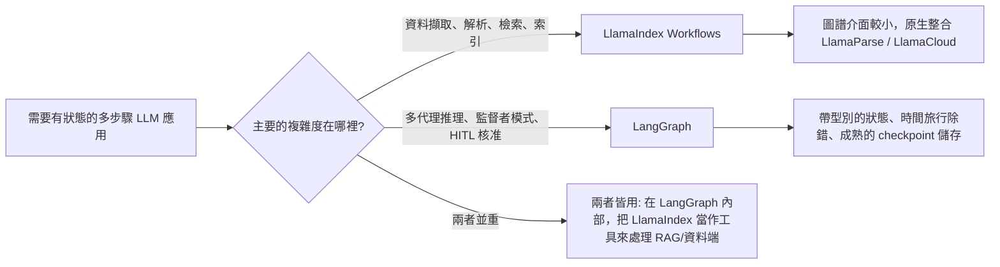

# LlamaIndex

當 LangChain 聚焦於「編排（Orchestration）」時，**LlamaIndex** 則是 **以資料為核心的 AI（Data-Centric AI）** 的大師。它已經從一個 RAG 函式庫，演化成一個用於 **工作流（Workflows）** 與 **代理式資料操作（Agentic Data Manipulation）** 的框架。

## 目錄

- [資料框架的設計哲學](#philosophy)
- [LlamaIndex Workflows](#workflows)
- [進階索引：超越向量搜尋](#indexing)
- [LlamaCloud 與託管式擷取](#llamacloud)
- [代理即工具](#agents-as-tools)
- [LlamaIndex Workflows：事件驅動的應用框架](#llamaindex-workflows-event-driven-application-framework)
- [面試問題](#interview-questions)
- [參考資料](#references)

---

## 資料框架的設計哲學 {#philosophy}

LlamaIndex 建立在一個信念之上：**資料比模型更重要**。
- **節點（The Node）**：每一個資料區塊都是一個「節點」，帶有豐富的中繼資料（關聯關係、摘要，以及親子連結）。
- **檢索器（The Retriever）**：LlamaIndex 提供了最多樣化的檢索器（摘要型、知識圖譜型、樹狀型，以及關鍵字型）。

---

## LlamaIndex Workflows {#workflows}

在 2024 年底，LlamaIndex 推出了 **Workflows**，作為它對 LangGraph 的回應。
- **事件驅動架構（Event-Driven Architecture）**：節點之間透過發出 `Events` 來溝通。
- **並行性（Concurrency）**：Workflows 原生支援非同步，在處理大規模平行資料時，表現比線性鏈（linear chains）更好。

```python
# Conceptual Workflow
class RAGWorkflow(Workflow):
    @step
    async def ingest(self, ev: StartEvent) -> RetrievalEvent:
        # Custom logic...
        return RetrievalEvent(results=nodes)
```

---

## 進階索引

1. **屬性圖（Property Graphs）**：將向量區塊連結到圖譜節點，以進行 RAG。
2. **情境感知切分器（Context-Aware Splitters）**：依「語意」而非「Token 數量」來分組文字（使用較小的 LLM 來找出最佳的切分點）。
3. **動態路徑（Dynamic Pathing）**：檢索器會根據問題的複雜度，決定 *該* 查詢哪一個索引。

---

## LlamaCloud 與託管式擷取 {#llamacloud}

為了因應企業級規模，LlamaIndex 聚焦於 **LlamaCloud**。
- **託管式擷取（Managed Ingestion）**：以服務的形式，處理 PDF 解析、OCR 與表格擷取。
- **解析即模型（Parsing as a Model）**：使用視覺 LLM（Gemini 3.1 Pro、Claude Opus 4.7、GPT-5.5）來「理解」版面配置，而非使用基於規則的解析器。

---

## 代理即工具 {#agents-as-tools}

LlamaIndex 把代理視為 **高階檢索器（high-level retrievers）**。
- 你可以把一個複雜的 LlamaIndex 查詢引擎「包裝」成一個工具，再交給 LangGraph 代理使用。
- **好處**：代理能取得「智慧型資料存取」能力，而不需要知道向量 DB 或圖譜結構（Graph schema）的技術細節。

---

## LlamaIndex Workflows：事件驅動的應用框架 {#llamaindex-workflows-event-driven-application-framework}

2024 年的定位是「Workflows 就是我們的 LangGraph」。如今的定位則不同：Workflows 是一個通用型、事件驅動的框架，適用於任何 AI 應用，而 RAG 只是其中一種可能的用途。今天 `llama-index-core` 把 Workflows 作為主要的應用層介面，而索引／檢索器類別則已移到圍繞它的整合套件之中（[LlamaIndex workflows docs](https://developers.llamaindex.ai/python/framework/understanding/workflows/)）。有一個值得釐清的命名細節：**Workflows** 套件在 2025 年中期達到了 1.0，現在以獨立套件的形式進入 2.x 系列，而核心的 `llama-index` 框架本身則仍維持在 0.x 系列（在 2026 年中期約為 0.14.x）。關於這類版本變動如何讓教學文件失效，以及如何在其中存活下來，請參閱 [駕馭框架變動](12-navigating-framework-churn.md)。

### 架構上有哪些改變

| 面向 | Workflows 之前的 LlamaIndex | Workflows 優先的 LlamaIndex |
|-----------|--------------------------|-----------------------------------|
| 主要抽象 | 查詢引擎、聊天引擎 | 帶有 `@step` 方法的 `Workflow` 類別 |
| 控制流程 | 線性；巢狀的查詢引擎 | 步驟消費／發出帶型別的 `Event` 子類別 |
| 狀態 | 隱含在引擎實例中 | 明確的 `Context`，帶有可序列化的狀態 |
| 並行性 | 透過非同步查詢引擎協作 | 一級公民：發出多個事件、扇出（fan out）、匯合（join） |
| 持久化 | 無 | Context 可被 `pickle` 化，或儲存為 JSON 以供恢復 |
| 串流 | 以引擎為單位 | 可從任何步驟呼叫 `ctx.write_event_to_stream()` |
| 人在迴路中（Human-in-the-loop） | 手動 | `InputRequiredEvent` ／ `HumanResponseEvent` 模式 |

### 事件驅動的心智模型

```python
from llama_index.core.workflow import (
    Workflow, step, Event, StartEvent, StopEvent, Context
)

class RetrievedEvent(Event):
    nodes: list

class JudgedEvent(Event):
    nodes: list
    keep: bool

class GraphRAG(Workflow):
    @step
    async def plan(self, ctx: Context, ev: StartEvent) -> RetrievedEvent:
        await ctx.set("query", ev.query)
        nodes = await self.retriever.aretrieve(ev.query)
        return RetrievedEvent(nodes=nodes)

    @step
    async def judge(self, ctx: Context, ev: RetrievedEvent) -> JudgedEvent:
        keep = await self.relevance_judge(ev.nodes, await ctx.get("query"))
        return JudgedEvent(nodes=ev.nodes, keep=keep)

    @step
    async def answer(self, ctx: Context, ev: JudgedEvent) -> StopEvent:
        if not ev.keep:
            return StopEvent(result="No good evidence found.")
        return StopEvent(result=await self.llm.acomplete(...))
```

從這個設計衍生出兩個特性：

1. 引擎純粹依 **事件型別** 來分派，因此新增一個分支，就等同於新增一個 `Event` 子類別，再加上一個消費它的步驟。沒有中央路由器需要修改。
2. **並行性是由資料驅動的**：一個發出三個 `RetrievedEvent` 的步驟，會自動扇出三個下游的 `judge` 呼叫，而匯合的步驟則以 `ctx.collect_events` 收集它們。

### Workflows 與 LangGraph 的比較



| 面向 | LlamaIndex Workflows（1.x） | LangGraph（1.x） |
|-----------|----------------------------|-----------------|
| 控制流程原語 | 事件分派 | 圖節點與邊，加上帶型別的 reducer 狀態 |
| 狀態模型 | 自由格式的 `Context`（類似 dict） | 帶 reducer 的 Pydantic ／ TypedDict 狀態 |
| 恢復／時間旅行 | 可 pickle 的 context、基本的恢復 | 一級公民的 checkpoints，可從任一節點分支（[LangGraph persistence docs](https://docs.langchain.com/oss/python/langgraph/persistence)） |
| 原生整合 | LlamaParse、LlamaCloud、所有 LlamaHub 載入器 | LangSmith 評估、所有 LangChain 整合 |
| 最適合的複雜度 | 資料形態：解析、嵌入、檢索、精煉 | 邏輯形態：規劃、行動、反思、委派 |
| 多代理輔助工具 | `AgentWorkflow`、函式呼叫代理（[LlamaIndex AgentWorkflow](https://developers.llamaindex.ai/python/framework/understanding/agent/multi_agent/)） | `create_supervisor`、`create_react_agent`、群集（swarm）模式 |
| 串流 UI | `ctx.write_event_to_stream` + AG-UI 協定 | `astream_events` v2、AG-UI 協定 |

什麼時候你應該選擇 LlamaIndex Workflows 而非 LangGraph：

- 困難的部分在於 **資料擷取**，而非推理。LlamaCloud、LlamaParse 與屬性圖技術堆疊全都是原生的，而非透過轉接器橋接（[LlamaCloud overview](https://www.llamaindex.ai/llamacloud)）。
- 你想要 **由文件驅動的平行性**：解析 1000 份 PDF，為每個區塊扇出一個嵌入步驟，再匯合成一次索引更新。
- 你正在 **TypeScript** 生態系中、基於 `llama-index-ts` 進行開發，並且希望擁有與 Python 核心對等的功能。

什麼時候 LangGraph 勝出：

- 困難的部分在於 **代理控制迴圈** 本身：眾多代理、監督者模式、持久化的中斷（durable interrupts）、重播（replay）。
- 你需要開箱即用的 **時間旅行除錯**。LlamaIndex 的恢復功能對於當機復原很好用，但無法像 LangGraph 的 checkpoints 那樣，從任意一個歷史狀態進行分支。
- 你已經在使用 LangSmith 評估技術堆疊，並且希望在追蹤層級（trace-level）進行整合，而不需要橋接。

### 真實世界中的姿態

許多資深架構會同時運行兩者：以 LlamaIndex Workflows 作為資料平面（擷取、索引、混合檢索、重排序）並包裝成一個工具，再以 LangGraph 作為其上的代理控制平面。這正是 [AIMultiple framework comparison](https://research.aimultiple.com/agentic-ai-frameworks/) 以及 LlamaIndex 自家的 [hybrid integration cookbook](https://developers.llamaindex.ai/python/framework/understanding/workflows/) 中所指出的模式。

如果你為一個全新的綠地（greenfield）應用只能選一個，問題就簡化成：**你的團隊會把更多時間花在資料管路（data plumbing），還是花在代理編排上？** 答案會驅動你的框架選擇。

---

## 面試問題 {#interview-questions}

### Q：LangChain 與 LlamaIndex 現在都有「圖譜／工作流」功能，你會怎麼選？

**強力答案：**
對於 **資料密集型** 的任務，當主要複雜度在於擷取、多模態解析與複雜檢索時，我會選 **LlamaIndex Workflows**。它的事件驅動架構在大規模平行資料處理上效能更佳。對於 **邏輯密集型** 的多代理系統，當複雜度在於「推理」與「人在迴路中」的邏輯時，我會選 **LangGraph**。在許多資深架構中，我們會 **兩者皆用**：以 LlamaIndex 作為 RAG 引擎，以 LangGraph 作為整體的代理式監督者。

### Q：什麼是 LlamaIndex 中的「屬性圖（Property Graph）」，它為什麼優於基本的向量 RAG？

**強力答案：**
屬性圖結合了向量的 **語意彈性** 與資料庫的 **結構精確性**。在基本的 RAG 中，你也許能找到一個關於「Project Alpha」的區塊，但你不知道它的負責人是誰。在屬性圖中，這個向量區塊是一個節點，連結到一個 `User` 節點與一個 `Timeline` 節點。這就能進行 **全域推理（Global Reasoning）**（例如：「找出上個月由 Tom 撰寫、關於 Project Alpha 的所有文件」）。基本的 RAG 很可能會漏掉許多相關節點，因為它們並未包含「Alpha」這個確切的關鍵字。

---

## 參考資料 {#references}
- LlamaIndex. "The Workflows Framework: Event-Driven Agents" (2025)
- Jerry Liu. "Data-Centric AI in the LLM Era" (2024/2025)
- LlamaHub. "The Repository of 1000+ Data Loaders" (2025)

---

*下一篇：[DSPy：對語言模型進行程式設計](05-dspy.md)*
