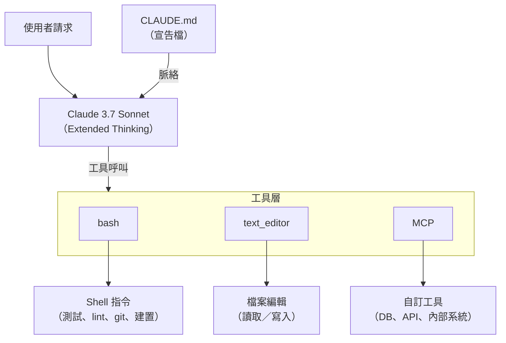
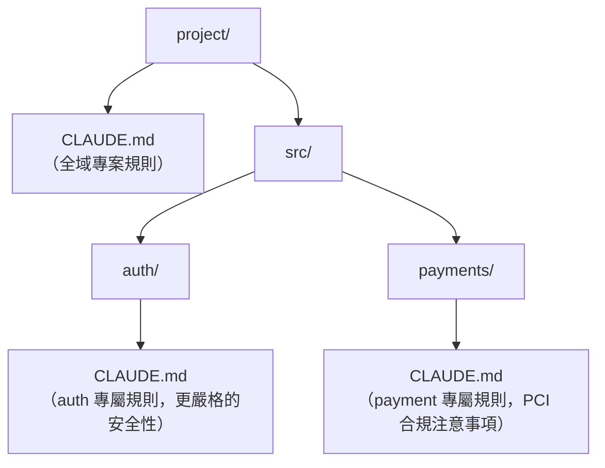
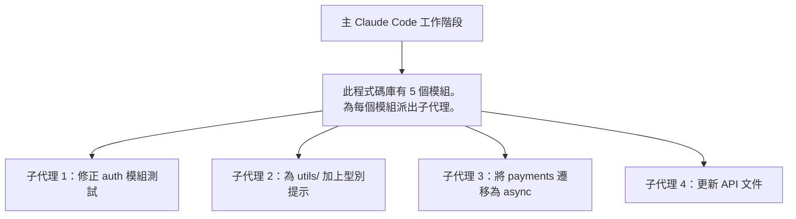

# Claude Code：自主編碼代理

Claude Code 是 Anthropic 推出的**終端機原生自主編碼代理**。不同於提供補全建議的 IDE 外掛，Claude Code 扮演的是全端軟體工程師的角色：它會讀取你的程式碼庫、編輯檔案、執行指令、跑測試，並反覆迭代直到任務完成為止。

## 目錄

- [Claude Code 是什麼](#what-it-is)
- [核心架構](#architecture)
- [核心工具](#tools)
- [CLAUDE.md 宣告檔模式](#claude-md)
- [執行 Claude Code](#running)
- [子代理與平行化](#subagents)
- [自訂 MCP 整合](#mcp-integration)
- [安全性與權限模型](#safety)
- [生產環境用途：CI 管線](#production)
- [比較：Claude Code 與其他替代方案](#comparison)
- [面試問題](#interview-questions)
- [參考資料](#references)

---

## Claude Code 是什麼

Claude Code 由 Anthropic 於 2025 年初發布，它是：

- **一個 CLI 工具**：在終端機中使用 `claude` 指令
- **一個 MCP 原生代理**：使用 bash、text_editor 與 computer 工具
- **一個 SDK**：可以嵌入 Python/TypeScript 應用程式中
- **不只是聊天機器人**：它會自主地規劃、實作並驗證

```
# Install
pip install claude-code  # or: npm install -g @anthropic-ai/claude-code

# Run interactively
claude

# Run headlessly (for CI)
claude -p "Add unit tests for all functions in src/utils.py" --output-format json
```

**與 Copilot/Cursor 的關鍵差異：**
- Copilot/Cursor：建議程式碼，由你接受或拒絕
- Claude Code：**自主地實作整個任務**，並執行測試來驗證

---

## 核心架構



Claude Code 以 **Claude 3.7 Sonnet** 作為其骨幹模型，並預設啟用 Extended Thinking 以處理複雜的規劃任務。

---

## 核心工具

Claude Code 有三個原生工具，並支援自訂的 MCP 工具：

### 1. `bash` — Shell 執行

```python
# Claude calls this internally:
bash(command="pytest tests/ -v --tb=short", timeout=60)
# Returns: stdout, stderr, exit_code
```

**Claude 用它來做什麼：**
- 執行測試套件（`pytest`、`jest`、`cargo test`）
- Git 操作（`git diff`、`git commit`、`git log`）
- 建置指令（`npm build`、`make`、`docker build`）
- 套件安裝（`pip install`、`npm install`）

bash 工作階段是**跨回合持續存在的**，環境變數與工作目錄在同一個工作階段內會延續下去。

### 2. `text_editor` — 檔案操作

```python
# Read a file
text_editor(command="view", path="/project/src/auth.py")

# Find in file
text_editor(command="view", path="/project/src/auth.py", view_range=[1, 50])

# Edit (surgical replacement)
text_editor(
    command="str_replace",
    path="/project/src/auth.py",
    old_str="def authenticate(user, password):",
    new_str="def authenticate(user: str, password: str) -> AuthResult:"
)

# Create new file
text_editor(command="create", path="/project/tests/test_auth.py", file_text="...")
```

**為什麼精準替換勝過整檔重寫：**
- 保留檔案的脈絡
- 降低幻覺（只變更需要變更的部分）
- 產生原子化、可審查的 diff

### 3. `computer` — GUI 自動化（選用）

完整的桌面控制（截圖、滑鼠、鍵盤），用於瀏覽器測試與 UI 驗證。需要沙箱化的環境。

---

## CLAUDE.md 宣告檔模式

`CLAUDE.md` 檔案是高效運用 Claude Code 時**最重要的單一模式**。它會把持久性的專案脈絡注入到每一次 Claude Code 工作階段中。

```markdown
# CLAUDE.md — Project: E-Commerce API

## Architecture
- Python 3.11 FastAPI backend
- PostgreSQL 15 with Alembic migrations
- Redis for session caching
- All API responses must be Pydantic models

## Test Commands
- Run all tests: `pytest tests/ -v`
- Run single test: `pytest tests/test_auth.py::test_login -v`
- Lint: `ruff check . --fix`
- Type check: `mypy src/`

## Coding Standards
- Always add type hints
- Never use `global` variables
- All database queries through SQLAlchemy ORM, never raw SQL
- New features require tests with >80% coverage

## Forbidden Patterns
- Do NOT use `os.system()` — use `subprocess.run()` instead
- Do NOT commit secrets — use environment variables
- Do NOT modify `alembic/versions/` — create new migrations

## Architecture Decisions
- Auth: JWT tokens, 1hr expiry, refresh token pattern
- Errors: Always return RFC 7807 Problem Details format
- Logging: structlog with JSON output, always include request_id
```

**巢狀的 CLAUDE.md 檔案：**


當在某個目錄下工作時，Claude 會自動讀取最接近的 CLAUDE.md。

---

## 執行 Claude Code

### 互動模式

```bash
# Start session (reads CLAUDE.md automatically)
claude

# With specific model
claude --model claude-3-7-sonnet-20250219

# With MCP config
claude --mcp-config .claude/mcp.json
```

### 無頭模式（用於腳本化）

```bash
# Single task, JSON output
claude -p "Fix all type errors in src/" \
  --output-format json \
  --max-turns 20

# Pipe from file
echo "Refactor src/utils.py to use async/await" | claude -p -

# Stream output
claude -p "Add logging to all API endpoints" --output-format stream-json
```

### Python SDK

```python
import asyncio
from claude_code_sdk import query, ClaudeCodeOptions

async def run_coding_task(task: str) -> str:
    options = ClaudeCodeOptions(
        max_turns=30,
        allowed_tools=["bash", "str_replace_based_edit_tool"],
        system_prompt_suffix="Always run tests after making changes.",
    )
    
    messages = []
    async for message in query(prompt=task, options=options):
        messages.append(message)
    
    return messages[-1].content[0].text

result = asyncio.run(run_coding_task(
    "Add input validation to all POST endpoints in src/api/"
))
```

---

## 子代理與平行化

Claude Code 支援針對大型程式碼庫的**子代理派工**：



每個子代理會平行執行，接著由主代理審查並合併結果。

**何時該使用子代理：**
- 程式碼庫超過 5 萬行
- 平行且彼此獨立的變更（沒有共享狀態）
- 模組層級的重構任務

---

## 自訂 MCP 整合

Claude Code 會從 `~/.claude/config.json` 或 `.claude/mcp.json` 讀取 MCP 伺服器設定：

```json
{
  "mcpServers": {
    "context7": {
      "command": "npx",
      "args": ["-y", "@upstash/context7-mcp"],
      "description": "Live library documentation"
    },
    "postgres": {
      "command": "uvx",
      "args": ["mcp-server-postgres"],
      "env": {"DATABASE_URL": "postgresql://localhost/myapp"},
      "description": "Direct DB access for schema inspection"
    },
    "jira": {
      "command": "uvx",
      "args": ["mcp-server-jira"],
      "env": {"JIRA_URL": "https://company.atlassian.net"},
      "description": "Task tracking integration"
    }
  }
}
```

有了這份設定，Claude Code 就能夠：
1. 在寫程式之前查詢最新的函式庫文件（Context7）
2. 在撰寫 SQL 之前讀取實際的資料庫綱要（postgres MCP）
3. 在完成實作後把 Jira 工單標記為已完成（jira MCP）

---

## 安全性與權限模型

Claude Code 採用**分層式權限模型**：

| 權限層級 | 由誰核准 | 涵蓋範圍 |
|----------|----------|----------|
| Auto | Claude（不提示） | 讀取檔案、執行測試 |
| Ask per-turn | 使用者確認 | Shell 指令執行 |
| Explicit allow | 使用者預先核准 | 特定指令／目錄 |
| Blocked | 永不執行 | allowlist 以外的網路呼叫 |

### 設定

```json
{
  "permissions": {
    "allow": [
      "bash(pytest*)",           // Always allow test runs
      "bash(ruff*)",             // Always allow linting
      "bash(git diff*)",         // Always allow git reads
      "str_replace_based_edit_tool"  // Always allow file edits
    ],
    "deny": [
      "bash(rm -rf*)",           // Block destructive deletions
      "bash(curl https://external*)", // Block external network
      "bash(pip install*)"       // Block package installs without approval
    ]
  }
}
```

### 生產環境安全規則

1. **務必沙箱化**：在 Docker 容器或 E2B 雲端 VM 中執行
2. **Git 隔離**：開始前先建立功能分支，合併前先審查 diff
3. **人工檢查點**：對於生產環境部署，要求由人工審查最終的 diff
4. **機密掃描**：對每一份 Claude Code 的產出執行 `truffleHog` 或 `git-secrets`
5. **速率限制**：設定 `max_turns` 以防止失控的迴圈（建議值：20-30）

---

## 生產環境用途：CI 管線

### GitHub Actions 整合

```yaml
# .github/workflows/ai-fix.yml
name: AI Bug Fix
on:
  issues:
    types: [labeled]

jobs:
  ai-fix:
    if: github.event.label.name == 'ai-fix'
    runs-on: ubuntu-latest
    steps:
      - uses: actions/checkout@v4
      
      - name: Run Claude Code
        env:
          ANTHROPIC_API_KEY: ${{ secrets.ANTHROPIC_API_KEY }}
        run: |
          pip install claude-code
          
          ISSUE_BODY="${{ github.event.issue.body }}"
          
          claude -p "Fix the following bug: $ISSUE_BODY
          
          Rules:
          - Read the relevant files first
          - Make minimal changes
          - Run tests and verify they pass
          - Do not change unrelated code
          " --output-format json --max-turns 15 > result.json
      
      - name: Create Pull Request
        uses: peter-evans/create-pull-request@v5
        with:
          title: "AI Fix: ${{ github.event.issue.title }}"
          body: "Automated fix by Claude Code"
          branch: "ai-fix/${{ github.event.issue.number }}"
```

### CI 的成本模型

| 任務類型 | 平均回合數 | 平均 Token 數 | 預估成本 |
|-----------|-----------|------------|----------------|
| 修錯（小型） | 8 | 15K | $0.23 |
| 測試產生 | 12 | 25K | $0.38 |
| 功能實作 | 20 | 50K | $0.75 |
| 大型重構 | 30 | 100K | $1.50 |

*以每天 100 次 CI 執行計算：依任務組合而定，約 $75-150/天。*

---

## 比較：Claude Code 與其他替代方案

| 功能 | Claude Code | Cursor/Windsurf | Cline | OpenHands |
|---------|-------------|-----------------|-------|-----------|
| **介面** | CLI + SDK | IDE（VS Code 分支） | VS Code 擴充功能 | Web UI + CLI |
| **模型** | 僅限 Claude | 任意（GPT、Claude、Gemini） | 任意 | 任意 |
| **自主程度** | 完全 | 中等（需要點擊） | 完全 | 完全 |
| **CI/無頭** | ✅ 原生 | ❌ | ✅ | ✅ |
| **MCP 支援** | ✅ 原生 | ✅ | ✅ | ✅ |
| **CLAUDE.md** | ✅ | ❌（類似：.cursorrules） | ❌ | ❌ |
| **開源** | ❌ | ❌ | ✅ | ✅ |
| **最適合** | 後端開發者、CI/CD | UI/前端開發者、視覺化 | 任何開發者 | 自架團隊 |

### SWE-bench Verified 分數（2026 年 5 月）

| 代理 | 分數 | 備註 |
|-------|-------|-------|
| GPT-5.5（原始模型領先者） | 88.7% | SWE-Bench Verified 排行榜第一名 |
| Claude Opus 4.7（原始模型） | 87.6% | 以 64.3% 領先 SWE-Bench Pro |
| Claude Code（Opus 4.7 / Sonnet 4.6） | ~87% | Anthropic 的官方代理 |
| OpenHands + Claude Sonnet 4.6 | ~75% | 開源框架 |
| Aider + Claude Sonnet 4.6 / GPT-5.5 | ~74% | 開源 CLI |
| Devin（商業） | ~65% | Cognition AI 產品 |
| SWE-agent + GPT-5.5 | ~55% | 普林斯頓研究基準線 |

---

## 面試問題

### 問：Claude Code 與 GitHub Copilot 有何不同？

**強而有力的回答：**
Copilot 是一個**補全工具**，它會在你打字時預測接下來的幾行程式碼。Claude Code 則是一個**自主代理**，你交給它一個任務（例如「為這個 API 加上身分驗證」），它就會讀取程式碼庫、規劃實作、編輯多個檔案、執行測試、修正失敗，並且只在測試通過時才結束。這兩者的體驗有著根本上的不同：Copilot 幫助你寫程式更快；Claude Code 則是替你*寫*程式，而你負責審查產出。

### 問：什麼是 CLAUDE.md，為什麼它至關重要？

**強而有力的回答：**
CLAUDE.md 就像是專門寫給 AI 同事看的 `README`。沒有它的話，Claude Code 會把你的專案當成一般的 Python/JS 專案來看待。有了它，Claude 就會知道：你確切的測試指令、你的禁止模式（不准用原始 SQL，要用 ORM）、你的架構決策（JWT 驗證、特定的錯誤格式），以及你的編碼規範。它把一個通用型代理轉變成了**專案專家**。我見過在有了一份寫得好的 CLAUDE.md 之後，任務完成速度加快 2-3 倍、錯誤減少 60%。

### 問：如何在生產環境的 CI 中安全地執行 Claude Code？

**強而有力的回答：**
三個層次：
1. **沙箱**：在沒有對外網路存取權的 Docker 容器內執行 Claude Code，只開放 git 儲存庫與測試執行器。
2. **權限白名單**：使用權限設定，精確地把允許執行的 bash 指令列入白名單（測試執行器、linter），並封鎖破壞性操作（rm -rf、未經審查的 pip install）。
3. **人工關卡**：Claude Code 會輸出一個帶有 diff 的分支。由人工在 PR 中審查 diff 並進行合併。Claude 絕不會直接合併到 main。如此一來，最終決策權就保留在人工判斷的迴圈之中。

### 問：對於高流量的 CI，如何處理 Claude Code 的成本？

**強而有力的回答：**
我從三個方面進行最佳化：
1. **任務範圍界定**：Claude Code 對於獨立且範圍明確的任務（修錯、測試產生）具有成本效益。我不會把它用在開放式的探索上，那種情況交給人工還是比較便宜。
2. **最大回合數**：設定 `max_turns=15` 可以防止失控的工作在循環推理上燒掉超過 $10。
3. **模型路由**：對於簡單的修錯（語法錯誤、明顯的拼字錯誤），我透過 SDK 使用 Claude 3.5 Haiku，便宜 5 倍。對於架構性的重構，我則使用搭配 Extended Thinking 的 Claude 3.7 Sonnet。

---

## 參考資料

- Anthropic.「Claude Code: Building Agentic Coding Experiences」(2025) — https://docs.anthropic.com/claude-code
- Anthropic.「Claude Code SDK Documentation」— https://github.com/anthropics/claude-code
- Anthropic.「CLAUDE.md Best Practices」— https://docs.anthropic.com/claude-code/settings#claudemd
- SWE-bench Verified Leaderboard — https://www.swebench.com/

---

*下一篇：[OpenCoder / AI 編碼代理全景](10-opencoderguide.md)*
