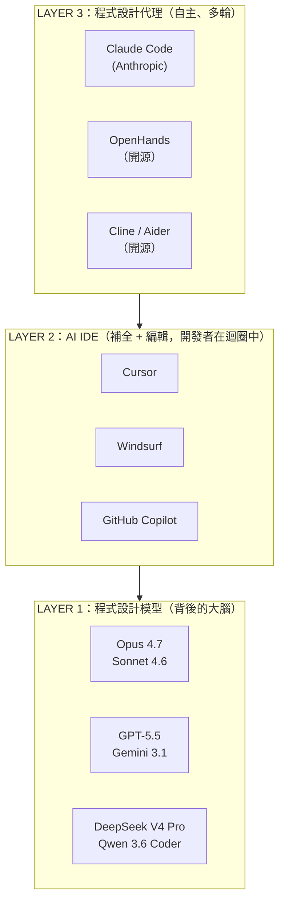
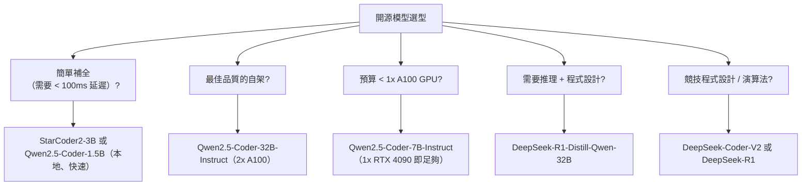
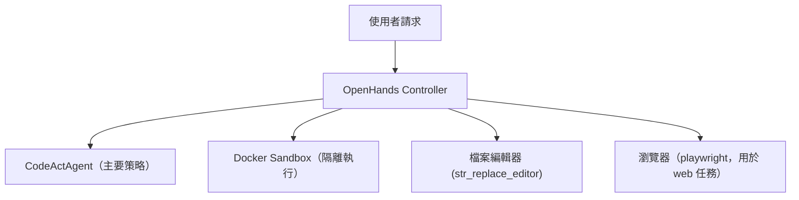
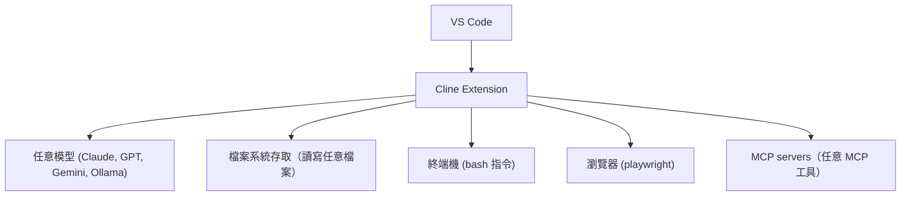
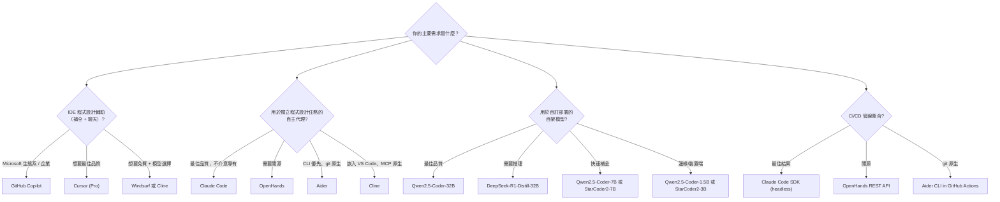
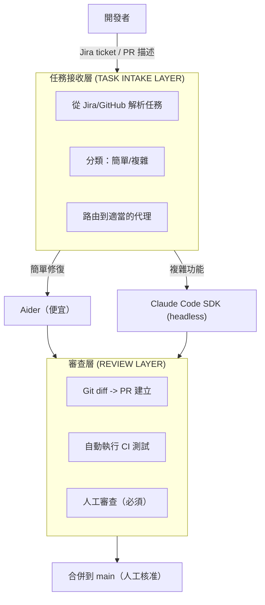
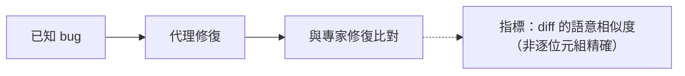

# OpenCoder：AI 程式設計代理全景

AI 程式設計代理的版圖已經爆炸性成長。本指南涵蓋開放權重程式設計模型、代理式 IDE、開源代理，以及如何為你的工程工作流程選對工具。

## 目錄

- [AI 程式設計版圖（2026）](#landscape)
- [開放權重程式設計模型](#models)
- [AI 原生 IDE](#ides)
- [開源程式設計代理](#agents)
- [基準測試深入剖析](#benchmarks)
- [成本比較](#costs)
- [選型指南](#selection)
- [生產環境架構](#production)
- [面試問題](#interview-questions)
- [參考資料](#references)

---

## AI 程式設計版圖（2026） {#landscape}

程式設計 AI 的版圖有三個明確的層次：



---

## 開放權重程式設計模型 {#models}

這些模型可以自架、微調並部署，完全不需要任何 API 依賴。

### Qwen2.5-Coder（Alibaba）

一個強大的開源程式設計模型家族。截至 2026 年 5 月，開源程式設計的領先者是 Qwen 3.6 Coder 與 DeepSeek V4 Pro；Qwen 2.5 Coder 在較小硬體上的自架部署仍是熱門選擇：

| 模型 | 參數量 | 上下文 | HumanEval+ | 備註 |
|-------|------------|---------|------------|-------|
| Qwen2.5-Coder-32B-Instruct | 32B | 128K | 88.2% | 最佳開源程式設計模型 |
| Qwen2.5-Coder-7B-Instruct | 7B | 128K | 79.3% | 出色的小型模型 |
| Qwen2.5-Coder-1.5B | 1.5B | 32K | 65.8% | 邊緣/裝置端使用 |

**優勢：**
- 在程式設計基準測試上表現強勁；在 SWE-bench Verified 上與前沿閉源模型不相上下
- 支援 100+ 種程式語言
- 出色的中間填空（FIM）補全能力
- Apache 2.0 授權，完全可商用

```python
# Self-hosted with vLLM
from vllm import LLM

model = LLM(
    model="Qwen/Qwen2.5-Coder-32B-Instruct",
    tensor_parallel_size=2,  # 2× A100 80GB
)
response = model.generate("def fibonacci(n: int) -> list[int]:")
```

### DeepSeek-Coder-V2（DeepSeek）

| 模型 | 參數量 | 架構 | HumanEval+ |
|-------|------------|-------------|------------|
| DeepSeek-Coder-V2-Instruct | 236B (MoE) | MoE | 90.2% |
| DeepSeek-Coder-V2-Lite | 16B (MoE) | MoE | 81.1% |

**優勢：**
- MoE 架構，每個 token 只啟用 21B 參數（高效率）
- 在競技程式設計（CodeForces 題目）上表現強勁
- 開放權重；強大的中文語言支援

### StarCoder2（BigCode / Hugging Face）

| 模型 | 參數量 | 上下文 | 備註 |
|-------|------------|---------|-------|
| StarCoder2-15B | 15B | 16K | 最佳中型開源程式設計 LM |
| StarCoder2-7B | 7B | 16K | 高效率，支援 80+ 種語言 |
| StarCoder2-3B | 3B | 16K | 輕量，裝置端 |

**優勢：**
- 完全開放（BigCode OpenRAIL-M 授權）
- 非常適合 IDE 補全（低延遲）
- 在 Stack Overflow / GitHub 資料上表現強勁

### DeepSeek-R1-Distill（用於程式設計）

| 模型 | 參數量 | 數學/程式碼 | 備註 |
|-------|------------|-----------|-------|
| DeepSeek-R1-Distill-Qwen-32B | 32B | 出色 | 將推理能力蒸餾進較小模型 |
| DeepSeek-R1-Distill-Llama-8B | 8B | 良好 | 極小型推理模型 |

**使用情境**：當你需要在自架規模下達到推理品質的程式碼生成時。

### 開源模型選型指南



---

## AI 原生 IDE {#ides}

### Cursor

**網站：** cursor.sh | **基礎：** VS Code 分支 | **定價：** $20/月 Pro

Cursor 是領先的 AI 原生 IDE。主要功能：

| 功能 | 說明 |
|---------|-------------|
| **Composer** | 多檔案代理式編輯（Cursor 相當於 Claude Code 的功能） |
| **Ctrl+K** | 行內程式碼生成 |
| **Tab** | 預測式補全（比 Copilot 更聰明） |
| **@-mentions** | 將檔案、URL、文件附加到上下文 |
| **.cursorrules** | 專案層級的 AI 指示（類似 CLAUDE.md） |
| **模型選擇** | GPT-5.5、Claude Sonnet 4.6 / Opus 4.7、Gemini 3.1 Pro、DeepSeek V4 Pro |

**最適合**：想在熟悉的 GUI 中進行代理式編輯的前端/全端開發者。

**限制**：閉源；你的程式碼會被傳送到 Cursor 的伺服器（他們提供隱私模式 Privacy Mode）。

### Windsurf（由 Codeium 開發）

**網站：** codeium.com/windsurf | **基礎：** VS Code 分支 | **定價：** 免費方案 + $15/月 Pro

Windsurf 以 **Flows** 作為差異化（請勿與 CrewAI Flows 混淆）：

| 功能 | 說明 |
|---------|-------------|
| **Cascade** | Windsurf 的代理式編輯模式 |
| **Flows** | 確定性的代理式序列（代理與使用者協調一致） |
| **模型選擇** | 任意：GPT-5.5、Claude Sonnet 4.6 / Opus 4.7、Gemini 3.1 Pro、DeepSeek V4 |
| **免費方案** | 慷慨的免費額度 |

**最適合**：想要 Cursor 般的體驗，同時具備免費方案與模型彈性的團隊。

### GitHub Copilot（Microsoft/OpenAI）

| 功能 | 狀態（2026 年 5 月） |
|---------|---------------------|
| 補全 | ✅ 以安裝量計仍是市場領導者 |
| Copilot Workspace | ✅ 多檔案代理式編輯（已正式發行 GA） |
| 模型 | GPT-5.5（預設）、Claude Sonnet 4.6 / Opus 4.7（可選用） |
| 企業功能 | ✅ IP 保護、組織政策、可關閉程式碼引用 |

**最適合**：已經在使用 Microsoft/GitHub 生態系的企業團隊。

**2026 現況**：對多數開發者而言，Copilot 的補全品質已被 Cursor/Windsurf 超越，但其企業功能與 GitHub 整合讓它在大型組織中仍佔主導地位。

### Google Antigravity

Antigravity 是 Google 的代理式開發平台，也是 Gemini CLI 的後繼產品。它與其說是文字編輯器，不如說是一個圍繞 Gemini 3 打造的**代理優先工作空間**：

| 功能 | 細節 |
|---------|--------|
| **Agent Manager** | 一個專用視圖，用來啟動、監看並引導多個非同步程式設計代理，而非逐一編輯檔案 |
| **規劃 + 產出物** | 代理在執行前與執行期間會產出一份計畫與可審查的產出物（差異、任務清單、即時瀏覽器工作階段） |
| **內建瀏覽器** | 代理可以執行並以視覺化方式測試它所建構的 UI |
| **模型可選性** | 預設為 Gemini 3 Pro，並支援 Anthropic Claude 與開源模型 |
| **平台** | 跨平台（macOS、Windows、Linux）；公開預覽，對個人免費 |

**最適合**：想在「任務」層級運作（委派一個目標、審查計畫與結果）而非「編輯」層級運作的開發者。它與 Cursor 的 Composer 和 Claude Code 的代理式循環競爭，而 Google 押注的是多代理管理器 UI 以及與 Gemini 3 的緊密整合。

---

## 開源程式設計代理 {#agents}

### OpenHands（前身為 OpenDevin）

**GitHub：** github.com/All-Hands-AI/OpenHands | **授權：** MIT

領先的開源自主程式設計代理：

```bash
# Run with Docker
docker pull docker.all-hands.dev/all-hands-ai/openhands:latest
docker run -it --rm \
  -e SANDBOX_RUNTIME_CONTAINER_IMAGE=docker.all-hands.dev/all-hands-ai/runtime:latest \
  -e LLM_API_KEY=$ANTHROPIC_API_KEY \
  -e LLM_MODEL=claude-3-7-sonnet-20250219 \
  -v /var/run/docker.sock:/var/run/docker.sock \
  -p 3000:3000 \
  docker.all-hands.dev/all-hands-ai/openhands:latest
# Access at http://localhost:3000
```

**架構：**


**主要功能：**
- **任意 LLM**：可搭配 Claude Sonnet 4.6 / Opus 4.7、GPT-5.5、Gemini 3.1 Pro、DeepSeek V4、本地 Ollama 運作
- **Docker 沙箱**：代理在隔離的容器中執行
- **Web UI**：類聊天介面；顯示代理的推理過程
- **API 存取**：提供 REST API 以整合 CI
- **SWE-bench 分數**：約 55-60%（取決於後端模型）

### Aider

**GitHub：** github.com/paul-gauthier/aider | **授權：** Apache 2.0

終端機優先、git 原生的程式設計代理：

```bash
pip install aider-chat

# Works directly with your git repo
aider --model claude-3-7-sonnet-20250219

# Add files to context
/add src/auth.py src/models.py

# Give task
> Add JWT authentication to the User model
```

**Aider 的不同之處：**
- **Git 原生**：邊做邊提交變更；維持乾淨的 git 歷史
- **上下文地圖**：維護你整個程式碼庫的地圖（即使是不在上下文中的檔案）
- **語音模式**：用口說下達任務
- **架構模式**：在動手寫程式碼之前先討論設計

```bash
# SWE-bench Verified benchmarks (May 2026)
# Aider + Claude Sonnet 4.6  → ~74%
# Aider + Claude Opus 4.7    → ~87%
# Aider + GPT-5.5            → ~88%
```

### Cline（VS Code 擴充套件）

**GitHub：** github.com/cline/cline | **授權：** Apache 2.0

用於自主程式設計的開源 VS Code 擴充套件：



**主要差異化：**
- **MCP 原生**：開箱即用的完整 MCP 支援
- **逐動作權限**：每一條 shell 指令、每一次檔案編輯都需要使用者核准
- **模型彈性**：支援任何 OpenAI 相容的 API 端點（包含本地 Ollama）
- **免費**：開源，無需訂閱

**最適合**：想免費獲得 Cursor 般體驗，並具備完整模型彈性的開發者。

---

## 基準測試深入剖析 {#benchmarks}

### SWE-bench Verified（2026 年 3 月）

代理式軟體工程的黃金標準。衡量解決真實 GitHub issue 的能力。

| 代理 / 系統 | 分數 | 模型後端 | 備註 |
|---------------|-------|---------------|-------|
| GPT-5.5（single-shot 領先者） | 88.7% | OpenAI | 在 SWE-Bench Verified 上保持第一（2026 年 5 月） |
| Claude Opus 4.7（Anthropic） | 87.6% | Anthropic | 在 SWE-Bench Pro 上以 64.3% 領先 |
| Claude Code | ~87% | Claude Opus 4.7 / Sonnet 4.6 | Anthropic 的官方代理 |
| OpenHands（最佳配置） | ~75% | Claude Sonnet 4.6 | 開源 |
| Aider | ~74% | Claude Sonnet 4.6 / Opus 4.7 / GPT-5.5 | 開源 CLI |
| SWE-agent | ~55% | GPT-5.5 | Princeton 研究基準 |

> [!NOTE]
> SWE-bench 分數對後端模型高度敏感。同一個代理搭配 claude-3-7-sonnet 的分數通常比搭配 GPT-4o 高出 10-15%。

### HumanEval+（開源模型）

| 模型 | HumanEval+ 分數 |
|-------|-----------------|
| Claude 3.7 Sonnet | 93.6% |
| GPT-4o | 90.2% |
| Qwen2.5-Coder-32B-Instruct | 88.2% |
| DeepSeek-Coder-V2-Instruct | 90.2% |
| StarCoder2-15B | 73.3% |

### LiveCodeBench（執行期評估，訊號更強）

LiveCodeBench 使用全新的競技程式設計題目（不在訓練資料中）：

| 模型 | LiveCodeBench 分數 |
|-------|---------------------|
| o3 (high) | 68.1% |
| Claude 3.7 Sonnet | 54.2% |
| GPT-4.5 | 38.7% |
| Qwen2.5-Coder-32B | 43.2% |
| DeepSeek-R1 | 57.0% |

**洞察**：LiveCodeBench 分數遠低於 HumanEval，因為它測試的是全新題目。o3 與 DeepSeek-R1 憑藉其推理能力居於主導地位。

---

## 成本比較 {#costs}

### 閉源 API vs. 開源自架

**情境：每天 1,000 個程式設計任務，每個平均 5K token**

| 方法 | 每月成本 | 品質 | 延遲 |
|----------|-------------|---------|---------|
| Claude 3.7 Sonnet（API） | ~$9,000 | ★★★★★ | 中 |
| GPT-4o（API） | ~$7,500 | ★★★★ | 中 |
| o3-mini（API） | ~$3,300 | ★★★★★（推理） | 慢 |
| Qwen2.5-Coder-32B（4×A100） | ~$4,000（基礎設施） | ★★★★ | 快 |
| DeepSeek-V3（Together AI） | ~$1,350 | ★★★★ | 中 |

**關鍵洞察**：相較於 Claude API，自架 Qwen2.5-Coder-32B 在約每天 500+ 任務時開始具備成本競爭力。若每天少於 200 任務，把工程開銷算進去後，API 幾乎總是比較便宜。

---

## 選型指南 {#selection}

### 快速決策樹



### 比較矩陣

| 維度 | Claude Code | Cursor | OpenHands | Aider | Cline |
|-----------|-------------|--------|-----------|-------|-------|
| 自主性 | 完整 | 中 | 完整 | 完整 | 完整 |
| 模型鎖定 | Claude | 任意 | 任意 | 任意 | 任意 |
| 開源 | ❌ | ❌ | ✅ | ✅ | ✅ |
| CI/無頭 | ✅ | ❌ | ✅ | ✅ | ❌ |
| GUI | CLI | 完整 IDE | Web UI | 終端機 | VS Code |
| MCP | ✅ | ✅ | 部分 | ❌ | ✅ |
| Git 原生 | 部分 | 部分 | ✅ | ✅ | 部分 |
| 價格 | API 成本 | $20/月 | 免費 + API | 免費 + API | 免費 + API |

---

## 生產環境架構 {#production}

### 企業程式設計代理平台

以下是建構內部 AI 程式設計平台的方法：



### 關鍵生產環境決策

| 決策 | 選項 | 建議 |
|----------|---------|----------------|
| 代理所用模型 | Claude 3.7、GPT-4o、開源 | Claude 3.7 Sonnet 以獲得最佳結果 |
| 任務接收 | 手動、Jira webhook、GitHub 標籤 | GitHub 標籤觸發 Actions 工作流程 |
| 程式碼執行 | 本地、Docker、E2B | Docker（可重現、隔離） |
| 人工審查 | PR、Slack 核准、自動化 | 必須有 PR 審查，絕不自動合併 |
| 成本控制 | 最大回合數、模型路由 | max_turns=20，簡單任務用 Haiku |

---

## 面試問題 {#interview-questions}

### Q：你如何在 Claude Code、Cursor 與 OpenHands 之間做選擇？

**有力的回答：**
這取決於三個軸向：

1. **介面需求**：如果開發者想要 GUI（在上下文中看到變更），就用 Cursor 或 Windsurf。如果任務是腳本化/無頭的（在 CI 中修 bug、生成測試），就用 Claude Code SDK 或 OpenHands。

2. **模型控制**：如果你需要使用任意模型（或你自己微調的模型），就用 OpenHands 或 Aider。如果你能接受只用 Anthropic 並想要頂尖的結果，就用 Claude Code。

3. **開源需求**：企業資安團隊通常要求使用他們能稽核的開源工具。OpenHands（MIT）與 Aider（Apache 2.0）就是答案。

對一家典型的新創公司，我會建議：日常開發用 Cursor，批次任務（從 GitHub issue 產生 PR）用 Claude Code，自架 CI 管線則用 OpenHands。

### Q：為什麼像 Qwen2.5-Coder 這樣的開放權重程式設計模型對企業很重要？

**有力的回答：**
三個原因：

1. **資料隱私**：傳送到閉源 API 的程式碼有可能被用於訓練或暴露給第三方。對醫療（HIPAA）、金融（SOX）與政府團隊而言，任何專有程式碼都不能離開網路。在地端運行的 Qwen2.5-Coder-32B 解決了這個問題。

2. **規模化成本**：在每月 1M+ 程式碼生成請求時，自架會比 API 定價便宜 40-60%，尤其是補全（相較於代理式任務）。

3. **微調**：開放權重可以做領域特化。一家法律科技公司可以針對其內部 DSL（領域特定語言）進行微調。API 不允許這麼做。

Qwen2.5-Coder-32B 與 Claude 3.7 Sonnet 之間的品質差距是真實存在的，但正在縮小。對於補全與較簡單的任務，開源模型往往「夠用了」。

### Q：你會如何為 CI 中的 AI 程式設計代理設計測試策略？

**有力的回答：**
我會採用三層評估：

**1. 功能測試**（自動化，每次執行）：


**2. 真實標準比對**（每週）：


**3. 人工評估**（抽樣 5% 的代理 PR）：
```
Senior engineer rates: Correctness, Style, Safety, 1-5 scale
```

我也會追蹤**回歸率**，如果一個代理的修復引入了新的失敗測試，那就是硬性失敗。代理應該執行完整的測試套件，且只有在提升或維持通過率時才算成功。

---

## 參考資料 {#references}

- Qwen2.5-Coder: https://qwenlm.github.io/blog/qwen2.5-coder/
- DeepSeek-Coder-V2: https://github.com/deepseek-ai/DeepSeek-Coder-V2
- StarCoder2: https://huggingface.co/blog/starcoder2
- OpenHands: https://github.com/All-Hands-AI/OpenHands
- Aider: https://aider.chat/
- Cline: https://github.com/cline/cline
- Cursor: https://cursor.sh/
- Windsurf: https://codeium.com/windsurf
- Google Antigravity: https://developers.googleblog.com/build-with-google-antigravity-our-new-agentic-development-platform/
- SWE-bench Leaderboard: https://www.swebench.com/
- LiveCodeBench: https://livecodebench.github.io/

---

*上一篇：[Claude Code](09-claude-code.md) | 下一篇：[框架選型指南](08-framework-selection-guide.md)*
