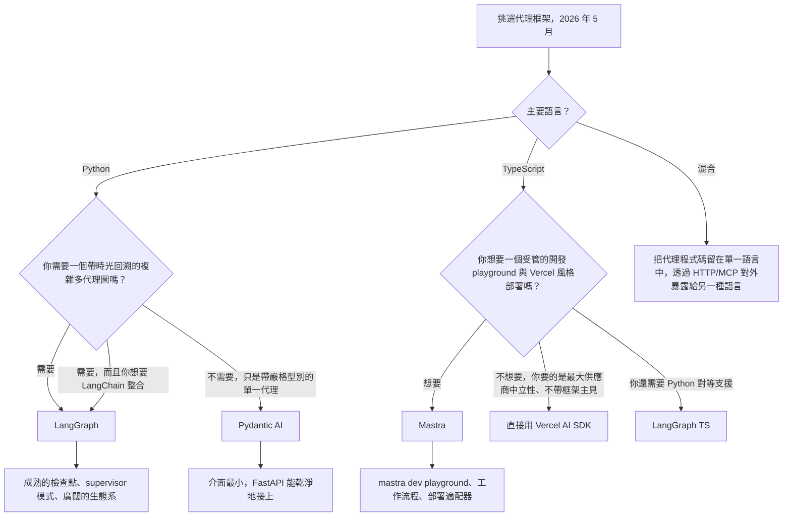

# Pydantic AI 與 Mastra：型別化代理框架（2026）

到了 2026 年 5 月，代理框架的論戰已經不再是「LangGraph 還是 LlamaIndex」。如今有兩個較新的後起之秀，在那些把型別安全看得比廣度更重要的團隊之間，已經佔據了可觀的生產環境市佔率：Python 世界裡的 **Pydantic AI**，以及 TypeScript 世界裡的 **Mastra**。兩者都拒絕了舊框架所接受的「字串進、字串出」的介面，並且都押注於：一個完全型別化的代理，會比一個聰明但沒有型別的代理更容易測試、評估與運維。

## 目錄

- [這些框架是什麼](#what-these-frameworks-are)
- [Pydantic AI：Python 中的型別化代理](#pydantic-ai-typed-agents-in-python)
- [Mastra：以 TypeScript 為優先的代理](#mastra-typescript-first-agents)
- [與 LangGraph 的比較](#comparison-with-langgraph)
- [如何挑選框架](#choosing-a-framework)
- [生產環境參考案例](#production-references)
- [面試題](#interview-questions)
- [參考資料](#references)

---

## 這些框架是什麼

Pydantic AI 與 Mastra 都源自於對框架鎖定（framework lock-in）以及無型別提示拼接的不滿。它們聚焦於同一組理念：

- 代理迴圈是**由程式碼定義**的，而不是由 YAML / JSON 圖定義。
- 工具呼叫、結構化輸出，以及人類介入（human-in-the-loop）的檢查點，全部都在**函式簽章上完成型別化**。
- 供應商可移植性是一項硬性要求：把 Anthropic 換成 OpenAI、再換成 Google，只需要改一行。
- 評估、追蹤與部署都是一等公民，而不是事後外掛上去的。

兩者的差異大多是技術棧形狀上的不同：一個鎖定那些已經用 Pydantic 做 HTTP 驗證的 Python 服務；另一個則鎖定那些想要 Vercel 風格開發者體驗的 Next.js / Node 團隊。

---

## Pydantic AI：Python 中的型別化代理

### 目前狀態

[Pydantic AI](https://ai.pydantic.dev/) 於 2025 年 9 月推出 v1.0，並在 2026 年 4 月將 1.x 系列穩定收斂於 **v1.85.1**，接著在 **2026 年 5 月 21 日進入 v2.0 beta 週期**（[PyPI 發行歷史](https://pypi.org/project/pydantic-ai/#history)）。這個函式庫是由 Pydantic 本身背後的團隊所打造，同一個團隊也經營 [Pydantic Logfire](https://pydantic.dev/logfire)。它以 MIT 授權開源。

主要的介面範圍：

- `Agent` 類別，以一個輸出型別與一份型別化工具清單作為參數。
- 針對 Anthropic、OpenAI、Google、Mistral、Groq、Cohere、Ollama，以及任何相容於 OpenAI 的端點的供應商適配器。
- 原生 OpenTelemetry 追蹤，可匯出至 Logfire 或任何 OTLP collector。
- `pydantic_evals`，用於以宣告式方式撰寫評估套件，支援 LLM-judge 與程式碼評分的 scorer。
- 一個 `Graph` API，用於在簡單的 `Agent` 迴圈不夠用時，明確定義狀態機。

### 為什麼團隊會選它

```python
from pydantic import BaseModel, Field
from pydantic_ai import Agent, RunContext

class RefundDecision(BaseModel):
    approved: bool
    amount_cents: int = Field(ge=0)
    reason: str

agent = Agent(
    "anthropic:claude-opus-4-7",
    output_type=RefundDecision,
    system_prompt="You are a refund analyst. Approve only if policy allows.",
)

@agent.tool
async def lookup_order(ctx: RunContext, order_id: str) -> dict:
    """Look up an order by id."""
    return await ctx.deps.orders.get(order_id)

result = await agent.run("Refund order 1234", deps=DepContainer(orders=db))
assert isinstance(result.output, RefundDecision)
```

有三項特性，使它在生產環境中極具吸引力：

1. **回傳型別會被強制檢查。** `result.output` 要嘛是一個 `RefundDecision`，否則這次呼叫就會失敗。不存在悄悄發生的字串漂移（string drift）。
2. **工具是函式，而不是字典。** schema 是在註冊時從 Python 簽章與 docstring 產生的，所以你不會不小心讓面向 LLM 的 schema 與實作之間發生漂移。
3. **依賴注入是明確的。** `ctx.deps` 是一個型別化的容器，這讓代理可以用 mock 輕鬆地進行單元測試。

[Pydantic AI 評估文件](https://ai.pydantic.dev/evals/)描述了一個典型的迴圈：用於生產 schema 的同一個 Pydantic 模型，會同時被當作 LLM 的輸出型別，以及評估 scorer 的 `expected_output`。

### 什麼時候 Pydantic AI 是正確選擇

- 服務是 **Python**，而且已經用 Pydantic 做 HTTP 驗證（FastAPI 是最典型的案例）。
- 你想要從頭到尾都有**嚴格的 schema**：HTTP 邊界、LLM 工具呼叫、LLM 輸出、資料庫列。
- 你想要**供應商可移植性**，又不想自己寫一層適配器。
- 你樂於把代理迴圈寫成命令式（imperative）的 Python，而不是寫成一份圖定義。

### 什麼時候它不是

- 你想要一個**宣告式的圖**，搭配 supervisor 模式來做多代理協調。`Graph` API 雖然存在，但比 LangGraph 更陽春。
- 你想要具備「從任一節點分支」語意的**時光回溯除錯**（time-travel debugging）。
- 你需要 LangChain 整合生態系的廣度（向量儲存、文件載入器等）。

---

## Mastra：以 TypeScript 為優先的代理

### 目前狀態

[Mastra](https://mastra.ai/) 由 Gatsby 背後的團隊創立（畢業於 YC W25），於 2025 年 10 月宣布完成由 Lightspeed 領投的 **1,300 萬美元種子輪**（[TechCrunch 報導](https://techcrunch.com/2025/10/16/mastra-typescript-agent-framework-seed/)），並於 **2026 年 1 月推出 v1.0**。到了 2026 年 5 月，GitHub 儲存庫已突破 **22.3K stars**，每週 npm 下載量超過 **300K**（[mastra-ai/mastra](https://github.com/mastra-ai/mastra)）。Mastra 以 Elastic License v2 授權開源。

主要的介面範圍：

- `Agent`、`Workflow` 與 `Tool` 這幾個基本元件，全都以 TypeScript 定義並具備完整的型別推論。
- 一個內建的**本機開發伺服器**（`mastra dev`），附帶 playground UI、評估執行器，以及追蹤檢視器。
- 與 Vercel 的 **AI SDK** 緊密整合，用於串流、多步驟工具呼叫，以及供應商切換。
- 開箱即用的記憶體與 RAG，搭配 `libsql` / `pgvector` 適配器。
- 一行指令即可部署到 **Mastra Cloud**、Vercel、Cloudflare Workers，或一台 Node 伺服器。

### 為什麼團隊會選它

```typescript
import { Agent } from "@mastra/core/agent";
import { createTool } from "@mastra/core/tools";
import { anthropic } from "@ai-sdk/anthropic";
import { z } from "zod";

const lookupOrder = createTool({
  id: "lookup-order",
  description: "Look up an order by id",
  inputSchema: z.object({ orderId: z.string() }),
  outputSchema: z.object({ status: z.string(), totalCents: z.number() }),
  execute: async ({ context }) => ordersDb.get(context.orderId),
});

export const refundAgent = new Agent({
  name: "refund-agent",
  model: anthropic("claude-opus-4-7"),
  instructions: "You are a refund analyst. Approve only if policy allows.",
  tools: { lookupOrder },
});
```

有三項特性，使它極具吸引力：

1. **從頭到尾的推論型別。** Zod schema 同時驅動了工具的執行期驗證、面向 LLM 的 JSON Schema，以及 `execute` 內部 `context` 的 TypeScript 型別。單一事實來源。
2. **`mastra dev` 是殺手級功能。** 它會啟動一個本機 UI，讓你可以呼叫任何代理、重播任何追蹤、執行任何評估，並檢視任何工具的輸入／輸出，完全不必寫前端。
3. **一等公民的工作流程。** `createWorkflow` 定義出一張由步驟組成的型別化圖（每個步驟都是一個 Mastra 工具或代理），支援分支、暫停／恢復，以及人類介入，全部都經過型別檢查。

[Generative.inc 的 Mastra 指南](https://generative.inc/blog/mastra-typescript-agent-framework)逐步說明了：當其餘技術棧已經是 TypeScript 時，團隊如何用 Mastra 完全取代 Python 編排。

### 什麼時候 Mastra 是正確選擇

- 團隊是 **TypeScript 優先**，而且應用程式的其餘部分都是 Next.js / Node / Bun / Cloudflare Workers。
- 你想要 **Vercel 風格的 DX**：單一 CLI、本機 playground、有主見的部署方式。
- 串流 UI 很重要，而且你想倚靠 AI SDK 的 `useChat` 與 `streamText` 基本元件。
- 你想要預設就把人類核准步驟接好的**暫停／恢復工作流程**。

### 什麼時候它不是

- 你需要一個**大型的預建代理庫**或社群整合。相較於 LangChain，這個生態系還很小。
- 你的團隊以及大多數 AI 工具都是 **Python**。把 TS 橋接到跨越 HTTP 層的 Python 服務雖然沒問題，但會增加延遲。
- 你需要**學術風格**的自訂推論行為（自訂解碼等）。那就留在 Python 吧。

---

## 與 LangGraph 的比較

| 面向 | Pydantic AI v1.85 | Mastra（2026 年 5 月） | LangGraph 1.x |
|-----------|-------------------|---------------------|----------------|
| 語言 | Python | TypeScript | Python 與 TypeScript |
| 授權 | MIT | Elastic License v2 | MIT |
| 主要單位 | 帶有 `output_type` 的型別化 `Agent` | 型別化的 `Agent` 與 `Workflow` | 以型別化狀態為基礎的節點圖 |
| schema 來源 | Pydantic v2 | Zod | JSON Schema（Pydantic、Zod、Valibot、ArkType） |
| 供應商中立性 | 內建適配器 | 透過 Vercel AI SDK | 透過 LangChain 夥伴套件 |
| 多代理 | 手動或 `Graph` API | `Workflow` ＋ agent-as-tool | `create_supervisor`、swarm、自訂圖 |
| 狀態持久化 | 手動或 `pydantic_graph` 檢查點 | 工作流程快照 ＋ 儲存適配器 | 一等公民的檢查點儲存（Postgres、Redis、SQLite、記憶體內） |
| 時光回溯除錯 | 無 | 在本機 playground 重播 | 有，可從任一檢查點分支 |
| 評估框架 | `pydantic_evals` | Mastra 評估（內建） | LangSmith 或外部 |
| 追蹤 | OTLP / Logfire | OTLP / Mastra Cloud | LangSmith 或 OTLP |
| 耦合 | 與 LangChain 零耦合 | 與 LangChain 零耦合 | 與 LangChain 生態系緊密耦合 |
| 生態系規模 | 小但正在成長 | 小但正在成長 | 大（LangChain 整合） |



---

## 如何挑選框架

三個決策驅動因素，依權重排序：

1. **既有服務的語言。** Python 服務選 Pydantic AI 與 LangGraph（Python）。TypeScript 服務選 Mastra 與 LangGraph TS。跨越這條邊界幾乎總是比挑對邊更糟的取捨。
2. **複雜度的形狀。** 如果代理本質上就是「LLM ＋ 幾個工具 ＋ 嚴格輸出型別」，那麼 Pydantic AI 或 Mastra 就夠了，運維起來也更便宜。如果你有許多相互協作、帶分支、重試與核准的代理，那麼 LangGraph 的「圖 ＋ 檢查點」模型會勝出。
3. **生態系耦合。** LangGraph 為你帶來 LangChain 整合、LangSmith 評估，以及那一整片介面。Pydantic AI 與 Mastra 為你帶來更乾淨的型別保證以及更快的冷啟動路徑，但整合要靠你自己接。

一個好用的經驗法則：如果頁面上最長的東西是工具清單，就選 Pydantic AI 或 Mastra。如果頁面上最長的東西是狀態機，就選 LangGraph。

---

## 生產環境參考案例

以下是截至 2026 年 5 月，各框架真正被認真使用的公開參考案例：

- **Pydantic AI**
  - [Pydantic Logfire 儀表板](https://pydantic.dev/logfire)本身就用 Pydantic AI 來驅動它們內部的分流（triage）代理。
  - [Sourcegraph Cody](https://sourcegraph.com/cody) 團隊曾[發文談到使用 Pydantic AI](https://ai.pydantic.dev/) 來打造其伺服器端工作流程中的型別化程式碼動作（code-action）代理。
  - 許多 FastAPI 團隊已經採用它，因為同一個 Pydantic 模型既服務 HTTP 邊界，也充當 LLM 的輸出型別。
- **Mastra**
  - [Stripe](https://stripe.com/) 的開發者體驗原型（[mastra.ai](https://mastra.ai/)）。
  - [Resend](https://resend.com/)、[Liveblocks](https://liveblocks.io/) 與 [Vercel](https://vercel.com/) 的示範應用程式。
  - 種子輪公告（[TechCrunch](https://techcrunch.com/2025/10/16/mastra-typescript-agent-framework-seed/)）列出了金融科技與開發者工具領域的生產環境使用者。
- **LangGraph**（供參考）
  - [LinkedIn 的 SQL Bot](https://www.linkedin.com/blog/engineering/ai/practical-text-to-sql-for-data-analytics)、[Uber 的程式設計助理](https://www.uber.com/en-IN/blog/genie-uber-genai-on-call-copilot/)、[Klarna](https://www.klarna.com/)、[Elastic](https://www.elastic.co/) AI Assistant、[Replit](https://replit.com/)，以及 [LangChain 客戶頁面](https://www.langchain.com/built-with-langgraph)上的數十家其他公司。

---

## 面試題

### Q：對於一個 Python 服務，你什麼時候會選 Pydantic AI 而不是 LangGraph？

**強答案：**
當代理本質上就是一個帶型別化輸出與幾個工具的 LLM，而且服務的其餘部分都已經是 Pydantic 形狀的（FastAPI、SQLModel 等）時，我會選 Pydantic AI。它的好處在於：同一個 Pydantic 模型同時定義了 HTTP 回應、LLM 輸出，以及評估 scorer 預期的形狀，所以不會有 schema 漂移。當我需要一個真正的多代理圖，搭配以檢查點為基礎的時光回溯、supervisor 模式，或 LangChain 整合生態系時，LangGraph 那較重的介面就值得了。我會問的決定性問題是：設計中最複雜的部分究竟是工具清單還是狀態機。是工具清單，選 Pydantic AI；是狀態機，選 LangGraph。

### Q：Mastra 是 Vercel AI SDK 的替代品嗎？

**強答案：**
不是。實際的供應商呼叫與串流，Mastra 是建立在 Vercel AI SDK 之上的。Mastra 額外添加的是**代理抽象層**、**工作流程引擎**、**記憶體**、**RAG**、**評估**，以及 **`mastra dev` playground**。如果你在 Next.js 應用程式裡只需要呼叫一個帶串流與工具呼叫的 LLM，那麼光靠 AI SDK 就綽綽有餘。如果你想要一個帶工作流程、暫停／恢復、記憶體，以及本機 playground 的型別化代理，那麼 Mastra 就是那一層，它幫你加上這些，而不必你自己動手寫。

### Q：「型別化代理框架」在生產環境中究竟為你帶來什麼？

**強答案：**
三件事。第一，**更少的壞輸入會漏過去**。面向 LLM 的 schema 是由驗證執行期 payload 的同一份 Pydantic / Zod 定義衍生而來，所以如果 LLM 幻覺出一個欄位，解析步驟會在任何下游程式碼執行之前就把它拒絕掉。第二，**乾淨的單元測試**。一個型別化的工具不過就是一個帶 Pydantic / Zod 邊界的函式，所以我可以在迴圈中完全不放 LLM 的情況下測試它。第三，**理解 schema 的評估**。評估框架可以逐欄位比較兩個型別化物件，而不是去對字串做 diff，這能抓出一些細微的回歸，例如某個欄位變成了可選（optional），或某個 enum 多了一個新值。

---

## 參考資料

- Pydantic AI v1.85 發行說明：https://github.com/pydantic/pydantic-ai/releases
- Pydantic AI 文件：https://ai.pydantic.dev/
- Pydantic AI 評估：https://ai.pydantic.dev/evals/
- Mastra 儲存庫：https://github.com/mastra-ai/mastra
- Mastra 文件：https://mastra.ai/
- TechCrunch，〈Mastra raises $13M seed for TypeScript agent framework〉（2025 年 10 月）：https://techcrunch.com/2025/10/16/mastra-typescript-agent-framework-seed/
- Generative.inc Mastra 指南：https://generative.inc/blog/mastra-typescript-agent-framework
- LangGraph 1.x 文件：https://docs.langchain.com/oss/python/langgraph/
- LangChain「Built with LangGraph」客戶清單：https://www.langchain.com/built-with-langgraph
- Vercel AI SDK：https://ai-sdk.dev/
- AIMultiple〈Agentic AI frameworks compared〉（2026）：https://research.aimultiple.com/agentic-ai-frameworks/

---

*下一篇：請參閱[框架選擇指南](08-framework-selection-guide.md)，以了解跨框架的選擇準則。*
