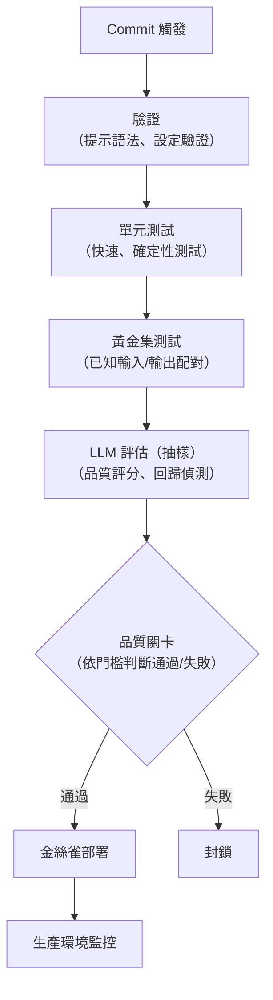

# LLM 應用程式的 CI/CD

部署 LLM 應用程式需要將傳統的 CI/CD 實務做法，調整以因應 AI 特有的考量，例如模型評估、提示測試與品質關卡。

## 目錄

- [LLM CI/CD 的挑戰](#llm-cicd-challenges)
- [管線架構](#pipeline-architecture)
- [測試階段](#testing-stages)
- [品質關卡](#quality-gates)
- [部署策略](#deployment-strategies)
- [回滾程序](#rollback-procedures)
- [面試問題](#interview-questions)
- [參考資料](#references)

---

## LLM CI/CD 的挑戰

### LLM 部署有何不同

| 傳統 CI/CD | LLM CI/CD |
|-------------------|-----------|
| 二元測試（通過/失敗） | 機率性評估 |
| 測試快速 | 評估緩慢且昂貴 |
| 確定性輸出 | 非確定性輸出 |
| 僅有程式碼變更 | 提示加模型加資料的變更 |
| 版本控制顯而易見 | 提示版本控制複雜 |

### 變更類型

| 變更類型 | 風險 | 所需測試 |
|-------------|------|------------------|
| 提示文字 | 中 | 回歸測試加品質評估 |
| 系統提示 | 高 | 完整評估套件 |
| 模型版本 | 高 | 全面基準測試 |
| RAG 索引 | 中 | 檢索加品質評估 |
| 參數（溫度等） | 低至中 | 品質抽樣 |

---

## 管線架構

### 完整管線



---

## 測試階段

### 階段 1：靜態驗證

```python
class PromptValidator:
    def validate(self, prompt_config: dict) -> ValidationResult:
        errors = []
        
        # Required fields
        if not prompt_config.get("system_prompt"):
            errors.append("Missing system_prompt")
        
        # Template syntax
        try:
            Template(prompt_config["user_template"]).substitute({})
        except KeyError:
            pass  # Expected for templates with variables
        except ValueError as e:
            errors.append(f"Invalid template syntax: {e}")
        
        # Token limits
        system_tokens = count_tokens(prompt_config.get("system_prompt", ""))
        if system_tokens > 4000:
            errors.append(f"System prompt too long: {system_tokens} tokens")
        
        return ValidationResult(
            valid=len(errors) == 0,
            errors=errors
        )
```

### 階段 2：單元測試

```python
class PromptUnitTests:
    def test_template_rendering(self):
        prompt = PromptTemplate(SYSTEM_PROMPT, USER_TEMPLATE)
        
        rendered = prompt.render(
            query="test query",
            context="test context"
        )
        
        assert "test query" in rendered
        assert "test context" in rendered
        assert len(rendered) < 10000  # Token limit
    
    def test_output_parsing(self):
        parser = OutputParser()
        
        valid_output = '{"answer": "test", "confidence": 0.9}'
        result = parser.parse(valid_output)
        assert result["answer"] == "test"
        
        invalid_output = "not json"
        with pytest.raises(ParseError):
            parser.parse(invalid_output)
```

### 階段 3：黃金集測試

```python
class GoldenSetRunner:
    def __init__(self, golden_set: list[dict]):
        self.golden_set = golden_set
    
    async def run(self, llm_client) -> TestResults:
        results = []
        
        for example in self.golden_set:
            response = await llm_client.generate(example["input"])
            
            # Exact match for deterministic outputs
            if example.get("exact_match"):
                passed = response == example["expected"]
            # Contains check for flexible outputs
            elif example.get("must_contain"):
                passed = all(
                    phrase in response 
                    for phrase in example["must_contain"]
                )
            # LLM judge for quality
            else:
                passed = await self.judge_quality(
                    response, example["expected"]
                )
            
            results.append(TestResult(
                input=example["input"],
                expected=example["expected"],
                actual=response,
                passed=passed
            ))
        
        return TestResults(
            total=len(results),
            passed=sum(1 for r in results if r.passed),
            failed=[r for r in results if not r.passed]
        )
```

### 階段 4：LLM 評估

```python
class LLMEvaluationStage:
    def __init__(self, eval_set: list[dict], sample_rate: float = 0.1):
        self.eval_set = eval_set
        self.sample_rate = sample_rate
        self.evaluator = LLMEvaluator()
    
    async def run(self, llm_client) -> EvalResults:
        # Sample for cost efficiency
        sample = random.sample(
            self.eval_set,
            int(len(self.eval_set) * self.sample_rate)
        )
        
        scores = []
        for example in sample:
            response = await llm_client.generate(example["input"])
            
            score = await self.evaluator.evaluate(
                query=example["input"],
                response=response,
                reference=example.get("reference"),
                criteria=["relevance", "accuracy", "helpfulness"]
            )
            scores.append(score)
        
        return EvalResults(
            sample_size=len(sample),
            avg_relevance=np.mean([s["relevance"] for s in scores]),
            avg_accuracy=np.mean([s["accuracy"] for s in scores]),
            avg_helpfulness=np.mean([s["helpfulness"] for s in scores])
        )
```

---

## 品質關卡

### 關卡設定

```python
class QualityGate:
    def __init__(self, thresholds: dict):
        self.thresholds = thresholds
    
    def evaluate(self, results: dict) -> GateResult:
        failures = []
        
        # Golden set pass rate
        if results["golden_pass_rate"] < self.thresholds["golden_pass_rate"]:
            failures.append({
                "metric": "golden_pass_rate",
                "actual": results["golden_pass_rate"],
                "threshold": self.thresholds["golden_pass_rate"]
            })
        
        # Quality scores
        for metric in ["relevance", "accuracy", "helpfulness"]:
            if results.get(f"avg_{metric}", 0) < self.thresholds.get(metric, 0):
                failures.append({
                    "metric": metric,
                    "actual": results.get(f"avg_{metric}"),
                    "threshold": self.thresholds[metric]
                })
        
        # Regression detection
        if results.get("regression_detected"):
            failures.append({
                "metric": "regression",
                "details": results["regression_details"]
            })
        
        return GateResult(
            passed=len(failures) == 0,
            failures=failures
        )

# Example thresholds
QUALITY_THRESHOLDS = {
    "golden_pass_rate": 0.95,  # 95% of golden tests must pass
    "relevance": 4.0,          # Average score >= 4.0/5.0
    "accuracy": 4.0,
    "helpfulness": 3.5
}
```

---

## 部署策略

### 金絲雀部署

```python
class CanaryDeployer:
    def __init__(
        self,
        initial_percentage: int = 5,
        increment: int = 10,
        bake_time_minutes: int = 30
    ):
        self.initial_percentage = initial_percentage
        self.increment = increment
        self.bake_time = bake_time_minutes
    
    async def deploy(self, new_version: str):
        # Start canary
        await self.router.set_canary(new_version, self.initial_percentage)
        
        percentage = self.initial_percentage
        while percentage < 100:
            # Wait for bake time
            await asyncio.sleep(self.bake_time * 60)
            
            # Check canary health
            metrics = await self.get_canary_metrics(new_version)
            
            if not self.is_healthy(metrics):
                await self.rollback(new_version)
                raise CanaryFailedError(metrics)
            
            # Increment traffic
            percentage = min(100, percentage + self.increment)
            await self.router.set_canary(new_version, percentage)
        
        # Full rollout
        await self.router.promote_canary(new_version)
```

### 影子部署

```python
class ShadowDeployer:
    async def shadow_test(
        self,
        new_version: str,
        duration_hours: int = 24
    ):
        # Run new version in shadow mode
        await self.enable_shadow(new_version)
        
        # Collect comparison data
        start = datetime.now()
        while datetime.now() - start < timedelta(hours=duration_hours):
            await asyncio.sleep(60)
            
            comparison = await self.compare_outputs()
            if comparison["divergence_rate"] > 0.1:
                await self.alert("High divergence in shadow test", comparison)
        
        # Analyze results
        return await self.generate_comparison_report(new_version)
```

---

## 回滾程序

### 自動化回滾

```python
class AutoRollback:
    def __init__(self, rollback_thresholds: dict):
        self.thresholds = rollback_thresholds
    
    async def monitor_and_rollback(self, version: str):
        while True:
            metrics = await self.get_live_metrics(version)
            
            # Check error rate
            if metrics["error_rate"] > self.thresholds["error_rate"]:
                await self.trigger_rollback(version, "error_rate_exceeded")
                return
            
            # Check latency
            if metrics["p99_latency"] > self.thresholds["p99_latency"]:
                await self.trigger_rollback(version, "latency_exceeded")
                return
            
            # Check quality (sampled)
            if metrics.get("quality_score", 5) < self.thresholds["quality_score"]:
                await self.trigger_rollback(version, "quality_degradation")
                return
            
            await asyncio.sleep(60)
    
    async def trigger_rollback(self, version: str, reason: str):
        previous = await self.get_previous_version()
        await self.router.rollback_to(previous)
        await self.alert(f"Auto-rollback from {version}: {reason}")
```

---

## 面試問題

### Q：你如何在進入生產環境前測試提示變更？

**優秀回答：**

「我使用多階段的測試管線：

**階段 1：靜態驗證。** 語法檢查、token 限制、模板錯誤。快速且便宜。

**階段 2：單元測試。** 模板渲染、輸出解析、確定性行為。一樣快速。

**階段 3：黃金集測試。** 必須通過的已知輸入/輸出配對。可捕捉明顯的回歸問題。

**階段 4：LLM 評估。** 使用 LLM-as-judge 進行抽樣評估。衡量品質面向（相關性、準確性）。較為昂貴，但能捕捉細微的問題。

**品質關卡：** 所有階段都必須通過門檻。黃金集通過率超過 95%，品質分數超過 4.0/5.0。

**部署：** 以 5% 流量進行金絲雀部署，烘烤 30 分鐘，監控指標，然後逐步提高。

關鍵的洞察在於，LLM 的輸出是非確定性的，因此測試必須採用統計方式。我無法保證 100% 正確，但我可以確保品質維持在可接受的範圍內。」

### Q：哪些觸發條件應該導致自動回滾？

**優秀回答：**

「我會設定多個回滾觸發條件：

**錯誤率：** 若錯誤連續 5 分鐘超過 5%，便回滾。這能捕捉徹底的故障。

**延遲：** 若 P99 延遲連續 10 分鐘超過 SLA（例如 10 秒），便回滾。這能捕捉效能回歸。

**品質分數：** 若抽樣的品質分數掉到 3.5/5.0 以下，便回滾。這能捕捉細微的品質劣化。

**使用者訊號：** 若負面回饋率飆升至基準的 2 倍，便進行調查並可能回滾。

**實作方式：**
- Prometheus 告警觸發回滾腳本
- 自動通知團隊
- 回滾到最後一個已知正常的版本
- 在調查完成前封鎖後續部署

關鍵在於快速偵測與行動。一個有問題的提示在生產環境中存在 10 分鐘是可以接受的，但存在 10 小時則不行。」

---

## 參考資料

- ML Ops: https://ml-ops.org/
- LangSmith: https://docs.smith.langchain.com/

---

*上一篇：[LLM 基礎設施](01-llm-infrastructure.md) · 下一篇：[AI 閘道與模型路由](03-ai-gateways-and-model-routing.md)*
