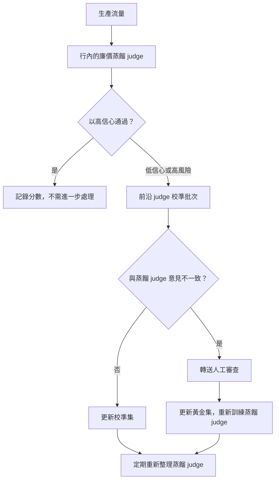
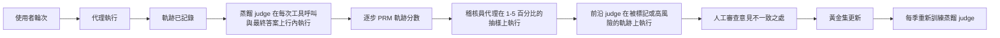

# LLM 評估

評估 LLM 系統與傳統 ML 有著本質上的不同。本章涵蓋在生產環境中衡量品質的指標、方法論以及實務做法。本章談的是評估「你自己」的系統；至於如何解讀 MMLU、SWE-bench、Arena Elo 等公開模型基準測試，請參閱 [Benchmarks and Leaderboards](03-benchmarks-and-leaderboards.md)。

## 目錄

- [為什麼 LLM 評估很困難](#why-llm-evaluation-is-hard)
- [評估維度](#evaluation-dimensions)
- [自動化評估方法](#automated-evaluation-methods)
- [LLM-as-Judge](#llm-as-judge)
- [人工評估](#human-evaluation)
- [RAG 專屬評估](#rag-specific-evaluation)
- [建構評估管線](#building-evaluation-pipelines)
- [生產環境監控](#production-monitoring)
- [2026 評估演進：超越 LLM-as-Judge](#2026-eval-evolution-beyond-llm-as-judge)
- [面試問題](#interview-questions)
- [參考資料](#references)

---

## 為什麼 LLM 評估很困難 {#why-llm-evaluation-is-hard}

### 根本性的挑戰

傳統 ML 有明確的指標（accuracy、F1、AUC）。LLM 的輸出是開放式文字，其中「正確」是主觀的。

| 傳統 ML | LLM 系統 |
|----------------|-------------|
| 單一正確答案 | 許多有效的回應 |
| 客觀指標 | 主觀品質 |
| 容易自動化 | 需要判斷 |
| 靜態測試集 | 需要多樣化的情境 |

### 品質的多重維度

一個回應可能是：
- 正確但寫得很糟
- 寫得很好但不完整
- 完整但不相關
- 相關但不安全

你需要獨立地衡量多個維度。

---

## 評估維度 {#evaluation-dimensions}

### 核心維度

| 維度 | 衡量什麼 | 如何評估 |
|-----------|------------------|-----------------|
| **正確性（Correctness）** | 事實上準確嗎？ | 真實標準（ground truth）、LLM judge |
| **相關性（Relevance）** | 有回答問題嗎？ | LLM judge、人工 |
| **完整性（Completeness）** | 所有面向都涵蓋了嗎？ | 檢查清單、LLM judge |
| **連貫性（Coherence）** | 結構良好、有邏輯嗎？ | LLM judge、人工 |
| **簡潔性（Conciseness）** | 適當地精簡嗎？ | token 數量、LLM judge |
| **安全性（Safety）** | 沒有有害內容嗎？ | 分類器、LLM judge |
| **有用性（Helpfulness）** | 真的有用嗎？ | 人工回饋 |

### 任務專屬維度

**對於 RAG：**
- 忠實度（Faithfulness）：是否接地於檢索到的上下文？
- 歸因（Attribution）：引用是否恰當？
- 無幻覺：沒有任何捏造的內容？

**對於程式碼生成：**
- 可執行性：能跑得起來嗎？
- 正確性：通過測試嗎？
- 風格：遵循慣例嗎？

**對於摘要生成：**
- 涵蓋率：重點都包含進去了嗎？
- 事實一致性：沒有引入錯誤？
- 壓縮率：長度縮減是否適當？

---

## 自動化評估方法 {#automated-evaluation-methods}

### 完全匹配（Exact Match）

最簡單的方法，單獨使用時很少足夠：

```python
def exact_match(prediction: str, reference: str) -> float:
    return float(prediction.strip().lower() == reference.strip().lower())
```

**適用於：** 多選題、分類、實體擷取

### 包含關鍵字

```python
def keyword_match(prediction: str, required_keywords: list[str]) -> float:
    prediction_lower = prediction.lower()
    matches = sum(1 for kw in required_keywords if kw.lower() in prediction_lower)
    return matches / len(required_keywords)
```

**適用於：** 檢查是否提及特定事實

### 語意相似度

```python
def semantic_similarity(prediction: str, reference: str) -> float:
    pred_embedding = embed(prediction)
    ref_embedding = embed(reference)
    return cosine_similarity(pred_embedding, ref_embedding)
```

**適用於：** 改寫偵測、一般相似度
**限制：** 高相似度不代表正確

### ROUGE（摘要生成）

衡量 n-gram 重疊：

```python
from rouge_score import rouge_scorer

scorer = rouge_scorer.RougeScorer(['rouge1', 'rouge2', 'rougeL'])

def evaluate_summary(prediction: str, reference: str) -> dict:
    scores = scorer.score(reference, prediction)
    return {
        "rouge1": scores["rouge1"].fmeasure,
        "rouge2": scores["rouge2"].fmeasure,
        "rougeL": scores["rougeL"].fmeasure
    }
```

**限制：** 衡量的是重疊，而非品質

### 程式碼執行

對於程式碼生成，執行就是真實標準：

```python
def evaluate_code(prediction: str, test_cases: list[dict]) -> dict:
    try:
        exec(prediction, globals())
    except SyntaxError as e:
        return {"syntax_valid": False, "error": str(e)}
    
    passed = 0
    for test in test_cases:
        try:
            result = eval(test["call"])
            if result == test["expected"]:
                passed += 1
        except Exception:
            pass
    
    return {
        "syntax_valid": True,
        "tests_passed": passed,
        "tests_total": len(test_cases),
        "pass_rate": passed / len(test_cases)
    }
```

---

## LLM-as-Judge {#llm-as-judge}

使用一個 LLM 來評估另一個 LLM 的輸出。

### 基本的 Judge 提示

```python
JUDGE_PROMPT = """
Evaluate the following response to the user's question.

Question: {question}
Response: {response}
Reference Answer (if available): {reference}

Rate the response on these criteria (1-5 scale):

1. Correctness: Is the information accurate?
2. Relevance: Does it address the question?
3. Completeness: Are all aspects covered?
4. Clarity: Is it well-written and clear?

For each criterion, provide:
- Score (1-5)
- Brief justification

Output as JSON:
{
    "correctness": {"score": X, "reason": "..."},
    "relevance": {"score": X, "reason": "..."},
    "completeness": {"score": X, "reason": "..."},
    "clarity": {"score": X, "reason": "..."},
    "overall": X
}
"""

def llm_judge(question: str, response: str, reference: str = None) -> dict:
    prompt = JUDGE_PROMPT.format(
        question=question,
        response=response,
        reference=reference or "Not provided"
    )
    
    result = judge_model.generate(prompt)
    return json.loads(result)
```

### 成對比較（Pairwise Comparison）

直接比較兩個回應：

```python
PAIRWISE_PROMPT = """
Compare these two responses to the question and determine which is better.

Question: {question}

Response A:
{response_a}

Response B:
{response_b}

Which response is better? Consider:
- Correctness
- Helpfulness
- Clarity
- Completeness

Output your choice (A or B) and explain why.

Choice:
"""

def pairwise_judge(question: str, response_a: str, response_b: str) -> dict:
    prompt = PAIRWISE_PROMPT.format(
        question=question,
        response_a=response_a,
        response_b=response_b
    )
    
    result = judge_model.generate(prompt)
    choice = "A" if "A" in result[:10] else "B"
    
    return {"winner": choice, "explanation": result}
```

### Judge 校準（Calibration）

LLM judge 帶有偏誤：

| 偏誤 | 說明 | 緩解方式 |
|------|-------------|------------|
| 位置偏誤 | 偏好第一個或最後一個選項 | 隨機化順序 |
| 長度偏誤 | 偏好較長的回應 | 指示其忽略長度 |
| 自我偏好 | 偏好自己模型的輸出 | 使用不同的 judge 模型 |
| 格式偏誤 | 偏好特定格式 | 多樣化的訓練範例 |

```python
def calibrated_pairwise_judge(question: str, response_a: str, response_b: str) -> dict:
    # Run twice with swapped positions
    result1 = pairwise_judge(question, response_a, response_b)
    result2 = pairwise_judge(question, response_b, response_a)
    
    # Check consistency
    result2_adjusted = "A" if result2["winner"] == "B" else "B"
    
    if result1["winner"] == result2_adjusted:
        return {"winner": result1["winner"], "confidence": "high"}
    else:
        return {"winner": "tie", "confidence": "low"}
```

---

## 人工評估 {#human-evaluation}

### 何時使用人工評估

| 使用情境 | 自動化？ | 人工？ |
|----------|-----------|--------|
| 快速迭代 | 是 | 抽查 |
| 最終品質評估 | 輔助 | 是 |
| 主觀品質 | 否 | 是 |
| 安全性評估 | 分類器 | 審查 |
| 邊緣案例 | 否 | 是 |

### 標註指引

```markdown
# Response Quality Annotation Guide

## Task
Rate the AI response quality on a 1-5 scale.

## Scale
5 - Excellent: Fully correct, helpful, well-written
4 - Good: Mostly correct, helpful, minor issues
3 - Acceptable: Correct but could be better
2 - Poor: Significant issues, partially helpful
1 - Unacceptable: Wrong, unhelpful, or harmful

## Instructions
1. Read the user question carefully
2. Read the AI response
3. Check for factual accuracy (if verifiable)
4. Assess helpfulness for the user's goal
5. Note any issues (inaccuracies, missing info, unclear)
6. Assign a score

## Examples
[Include 3-5 annotated examples at each score level]
```

### 標註者間一致性（Inter-Annotator Agreement）

```python
from sklearn.metrics import cohen_kappa_score

def calculate_agreement(annotator1: list, annotator2: list) -> dict:
    kappa = cohen_kappa_score(annotator1, annotator2)
    
    exact_agreement = sum(a == b for a, b in zip(annotator1, annotator2))
    exact_pct = exact_agreement / len(annotator1)
    
    return {
        "cohens_kappa": kappa,
        "exact_agreement": exact_pct,
        "interpretation": interpret_kappa(kappa)
    }

def interpret_kappa(kappa: float) -> str:
    if kappa < 0.2: return "Poor"
    if kappa < 0.4: return "Fair"
    if kappa < 0.6: return "Moderate"
    if kappa < 0.8: return "Substantial"
    return "Almost perfect"
```

---

## RAG 專屬評估 {#rag-specific-evaluation}

### RAGAS 指標

RAGAS 提供標準的 RAG 評估指標：

```python
from ragas import evaluate
from ragas.metrics import (
    faithfulness,
    answer_relevancy,
    context_precision,
    context_recall
)

def evaluate_rag(
    questions: list[str],
    contexts: list[list[str]],
    answers: list[str],
    ground_truths: list[str]
) -> dict:
    dataset = Dataset.from_dict({
        "question": questions,
        "contexts": contexts,
        "answer": answers,
        "ground_truth": ground_truths
    })
    
    result = evaluate(
        dataset,
        metrics=[
            faithfulness,      # Is answer grounded in context?
            answer_relevancy,  # Does answer address question?
            context_precision, # Are retrieved contexts relevant?
            context_recall     # Did we retrieve all needed context?
        ]
    )
    
    return result
```

### 忠實度評估

檢查回應是否接地於上下文：

```python
FAITHFULNESS_PROMPT = """
Given the context and the response, determine if every claim in the 
response is supported by the context.

Context:
{context}

Response:
{response}

For each sentence in the response:
1. Extract the factual claims
2. Check if each claim is supported by the context
3. Mark as SUPPORTED or UNSUPPORTED

Output:
- Total claims: X
- Supported claims: Y
- Faithfulness score: Y/X
- Unsupported claims: [list]
"""

def evaluate_faithfulness(context: str, response: str) -> dict:
    prompt = FAITHFULNESS_PROMPT.format(context=context, response=response)
    result = judge_model.generate(prompt)
    return parse_faithfulness_result(result)
```

### 上下文相關性

評估檢索到的上下文品質：

```python
def evaluate_context_relevance(query: str, contexts: list[str]) -> dict:
    scores = []
    
    for context in contexts:
        prompt = f"""
        Query: {query}
        Context: {context}
        
        Is this context relevant to answering the query?
        Rate from 1-5 and explain.
        """
        
        result = judge_model.generate(prompt)
        score = extract_score(result)
        scores.append(score)
    
    return {
        "individual_scores": scores,
        "mean_relevance": sum(scores) / len(scores),
        "contexts_above_threshold": sum(1 for s in scores if s >= 3)
    }
```

---

## 建構評估管線 {#building-evaluation-pipelines}

### 評估資料集結構

```python
@dataclass
class EvalSample:
    id: str
    input: str
    expected_output: str  # Optional ground truth
    context: list[str]    # For RAG
    metadata: dict        # Category, difficulty, etc.

eval_dataset = [
    EvalSample(
        id="q001",
        input="What is the capital of France?",
        expected_output="Paris",
        context=[],
        metadata={"category": "factual", "difficulty": "easy"}
    ),
    # ... more samples
]
```

### 自動化評估管線

```python
class EvaluationPipeline:
    def __init__(
        self,
        system_under_test,
        evaluators: list[Evaluator],
        dataset: list[EvalSample]
    ):
        self.sut = system_under_test
        self.evaluators = evaluators
        self.dataset = dataset
    
    def run(self) -> EvalReport:
        results = []
        
        for sample in self.dataset:
            # Get prediction
            prediction = self.sut.generate(sample.input)
            
            # Run all evaluators
            scores = {}
            for evaluator in self.evaluators:
                score = evaluator.evaluate(
                    input=sample.input,
                    prediction=prediction,
                    reference=sample.expected_output,
                    context=sample.context
                )
                scores[evaluator.name] = score
            
            results.append({
                "id": sample.id,
                "input": sample.input,
                "prediction": prediction,
                "scores": scores,
                "metadata": sample.metadata
            })
        
        return self.compile_report(results)
    
    def compile_report(self, results: list) -> EvalReport:
        # Aggregate by category, compute statistics
        report = EvalReport()
        
        for metric in self.evaluators:
            scores = [r["scores"][metric.name] for r in results]
            report.add_metric(metric.name, {
                "mean": statistics.mean(scores),
                "std": statistics.stdev(scores),
                "min": min(scores),
                "max": max(scores)
            })
        
        # Breakdown by category
        for category in set(r["metadata"]["category"] for r in results):
            category_results = [r for r in results if r["metadata"]["category"] == category]
            report.add_breakdown(category, self.aggregate(category_results))
        
        return report
```

---

## 生產環境監控 {#production-monitoring}

### 需要追蹤的關鍵指標

```python
PRODUCTION_METRICS = {
    # Quality metrics (sample-based)
    "llm_judge_score": "Mean LLM judge score on sampled responses",
    "faithfulness": "RAG faithfulness on sampled responses",
    
    # User signals
    "thumbs_up_rate": "Positive feedback / total feedback",
    "regeneration_rate": "How often users regenerate",
    "copy_rate": "How often users copy responses",
    
    # Operational
    "error_rate": "Failed generations / total",
    "latency_p50": "Median response time",
    "latency_p99": "99th percentile response time",
    "tokens_per_response": "Average output length",
    
    # Cost
    "cost_per_request": "Average cost per request",
    "daily_cost": "Total daily API spend"
}
```

### 線上評估（Online Evaluation）

```python
class OnlineEvaluator:
    def __init__(self, sample_rate: float = 0.1):
        self.sample_rate = sample_rate
    
    def maybe_evaluate(self, request: dict, response: str) -> None:
        if random.random() > self.sample_rate:
            return
        
        # Async evaluation
        asyncio.create_task(self.evaluate_async(request, response))
    
    async def evaluate_async(self, request: dict, response: str):
        scores = await self.llm_judge(request["query"], response)
        
        # Log to monitoring system
        self.log_metrics({
            "correctness": scores["correctness"],
            "relevance": scores["relevance"],
            "timestamp": datetime.now()
        })
        
        # Alert on low scores
        if scores["overall"] < 3:
            self.alert_low_quality(request, response, scores)
```

### 漂移偵測（Drift Detection）

```python
def detect_quality_drift(
    current_scores: list[float],
    baseline_scores: list[float],
    threshold: float = 0.1
) -> dict:
    current_mean = statistics.mean(current_scores)
    baseline_mean = statistics.mean(baseline_scores)
    
    drift = abs(current_mean - baseline_mean)
    is_significant = drift > threshold
    
    # Statistical test
    stat, p_value = stats.ttest_ind(current_scores, baseline_scores)
    
    return {
        "current_mean": current_mean,
        "baseline_mean": baseline_mean,
        "drift": drift,
        "is_significant": is_significant,
        "p_value": p_value
    }
```

---

## 2026 評估演進：超越 LLM-as-Judge {#2026-eval-evolution-beyond-llm-as-judge}

2023 到 2024 年的劇本（「用 GPT-4 當 judge」）對於 v1 系統來說已經夠用，但在三股壓力下出現裂痕：規模化時的成本、字串評分器無法檢視的代理軌跡，以及把檢索、記憶與推理混為一談的基準測試。到了 2026 年 5 月，生產環境的評估技術堆疊已分裂成四個協同運作的層級。

### 分層式 Judge 架構



成本的算式迫使這種形態成形：在每一條生產軌跡上都動用前沿 judge（Claude Opus 4.7、GPT-5、Gemini Ultra 3）在每天約 100K 個請求以上時是負擔不起的。蒸餾 judge 熱機運轉，前沿 judge 負責校準，人工負責設定真實標準。

### Galileo Luna-2：規模化的蒸餾 Judge

[Galileo 的 Luna-2 系列](https://www.galileo.ai/luna-2)（2026 年 2 月發布）是一組小型、任務專屬的 judge 模型，以數百萬筆前沿 judge 標籤加上人工標註訓練而成。Galileo 公布的數據如下：

| 指標 | Luna-2 對比前沿 Judge |
|--------|--------------------------|
| 每次評估成本 | 約低 97% |
| 延遲 P50 | 約低 10 倍（短回應低於 100ms） |
| 與前沿 judge 的一致性 | 在已發布的基準測試中達 88-92% |
| 與人工黃金標籤的一致性 | 與前沿 judge 相差 2-3 分以內 |

關鍵在於這種意見不一致的**形態**。Luna-2 是針對一套固定的失效模式分類訓練的（接地性、指令遵循、毒性、PII、離題、拒答）。任何落在該分類之外的東西都會退化成預設分數。所以在生產環境中站得住腳的模式是：

- **在每一條軌跡上行內使用 Luna-2（或某個 Luna 等價物）**，針對它所涵蓋的分類。
- **在抽樣的 1-5% 軌跡上使用前沿 judge**，以偵測蒸餾 judge 與較大模型之間的漂移。
- 當蒸餾 judge 回傳低信心時，**自動回退到前沿 judge**（Luna-2 會發出一個信心分數，而不只是一個標籤）。
- **對於不在其訓練分布內的全新失效模式，絕不可單獨信任蒸餾 judge**：剛發布的攻擊向量、新類別的使用者意圖，或是領域專屬的事實性檢查。

Galileo 的[公開技術報告](https://www.galileo.ai/research/luna-2)詳細說明了蒸餾的配方，以及 Luna-2 在哪些地方仍不如前沿 judge（長程多步推理、低資源語言）。

其他已出貨、可拿來比較的蒸餾 judge：

- [Patronus AI Lynx](https://www.patronus.ai/lynx)，用於接地性，成本特性相似。
- [Vectara HHEM-2](https://www.vectara.com/blog/hhem)，用於幻覺偵測。
- [Arize Phoenix Evals](https://arize.com/docs/phoenix/)，出貨開放的蒸餾 judge 加上校準框架。

### Sierra tau2-bench 及其變體

[Sierra 的 tau-bench](https://github.com/sierra-research/tau-bench)（2024 年）是第一個在模擬商業環境中衡量工具使用成功率的真實代理基準測試。2026 年的後繼者把這個概念加以一般化。

[tau2-bench](https://github.com/sierra-research/tau-bench)（2026 年第一季發布）是一次重大更新：

- **更多領域**：零售、航空、金融、醫療、電信。
- **Pass^k 指標**：衡量代理在同一任務的 k 次重複試驗中**全部**成功的機率。Pass^1 是傳統的成功率。Pass^4 才能告訴你代理是否可靠。
- **基於驗證器的評分**：採用確定性的後置條件（訂單已取消、退款確實存在、座位已更改），而非由 LLM 評分的逐字稿評分。

姊妹基準測試：

- **[tau-Voice](https://sierra.ai/blog/tau-voice)**：語音對語音的變體，代理透過語音管道運作。能捕捉一類純文字基準測試完全錯過的失效（時序、插話處理、從 ASR 錯誤中復原）。
- **[tau-Knowledge](https://sierra.ai/blog/tau-knowledge)**：以代理必須從中檢索的內部知識庫來擴充模擬。將「代理是否檢索」與「代理是否行動」解耦。

在實務上，pass^k 指標是最能據以行動的。Pass^1 為 70% 而 Pass^4 為 12% 的結果，說的是「代理在簡單路徑上能運作，但無法從任何小擾動中復原」。這正是生產團隊在大規模推出代理之前所需要的訊號。

### Agent-as-Judge：軌跡評分

LLM-as-judge 評的是最終答案。Agent-as-judge 評的是**軌跡**：代理所經歷的工具呼叫序列、中間狀態、重試與推理步驟。

這是必要的，因為長程代理會以最終答案無法揭露的方式失效：

- **答案對，推理錯**：代理在一次搞砸的計算之後猜對了數字。
- **答案對，路徑危險**：代理在第五次（安全的）工具呼叫碰巧成功之前，嘗試了四次破壞性的工具呼叫。
- **答案對，成本失控**：代理做了 47 次檢索呼叫，而其實 2 次就夠了。

生產環境中的模式：

- **流程獎勵模型（Process Reward Models，PRM）** 獨立地為軌跡中的每一步評分。PRM 原本是為數學訓練的（OpenAI 的 [Let's Verify Step by Step](https://arxiv.org/abs/2305.20050)），現已一般化：到 2026 年，已有用於程式碼、工具使用軌跡與多輪對話的 PRM。
- **一個輔助的「稽核員」代理**（通常是與被評分者不同的模型）重播軌跡，在每個節點上問「這一步是否合理？」，並發出一份已評分的逐字稿。這正是 [DeepMind 的 agent-as-judge 論文](https://arxiv.org/abs/2410.10934)（2024 年 10 月，歷經 2026 年持續精煉）所形式化的內容。
- 會在這類評分中浮現的**軌跡失效模式**：
  - **推理與行動不一致**：代理的思維鏈說的是一回事，工具呼叫做的是另一回事。
  - **過度檢索**：檢索呼叫次數超過所需。
  - **工具亂試**：以略微變化的方式反覆嘗試同一個工具，直到某個碰巧成功。
  - **過早定論**：在所有證據到齊之前就寫下答案。
  - **自我越獄**：代理自身的中間推理繞過了它自己的安全政策。

[Anthropic 的 Constitutional Classifiers 論文](https://www.anthropic.com/research/constitutional-classifiers)（2025 年 1 月）及後續工作顯示，用憲法分類器來評斷軌跡，能捕捉到相當一部分被最終答案評分完全錯過的安全失效。

### HaluMem：操作層級的幻覺基準測試

[HaluMem](https://arxiv.org/abs/2511.03506)（2025 年 11 月）是第一個把幻覺評估拆解成產生或使用記憶的那些**操作**、而不只是最終答案的基準測試：

| 階段 | 衡量什麼 | 典型失效 |
|-------|------------------|-----------------|
| 擷取（Extraction） | 寫入記憶的事實與來源相符 | 來源說的是「使用者不喜歡花生」，代理卻存成「使用者對花生過敏」 |
| 更新（Update） | 記憶更新相對於先前狀態是正確的 | 一筆新記憶與一筆較舊的記憶相互矛盾卻未獲解決 |
| 問答（QA） | 答案接地於已儲存的記憶 | 代理其實是憑參數知識作答，卻佯裝引用記憶 |

HaluMem 論文的重大洞見：一個系統可以在標準幻覺基準測試上達到非常高的 QA 準確率，同時卻犯下災難性的擷取錯誤。聚合指標會掩蓋錯誤源頭的那個階段，而那卻是你唯一真正能修正的階段。

實務配方：

- 為記憶層裝設**逐操作的評估**：每一次寫入、更新與讀取都有各自獨立的評估。
- 針對每一種操作類型使用一個蒸餾 judge（Luna-2 或類似者）。
- 持續追蹤各階段的錯誤率；5% 的擷取錯誤在數千次操作中複利累積，會變成一個完全不可靠的代理。

### 2026 年 5 月的生產環境評估技術堆疊

一個面向客戶的代理產品所採用、站得住腳的技術堆疊，大致看起來像這樣：



這並非免費，但比起在每一條軌跡上都動用前沿 judge 要便宜得多，而且它能捕捉到純粹的最終答案評分看不見的失效類別（流程錯誤、記憶錯誤、軌跡錯誤）。

### 面試重點摘要

- 「LLM-as-judge」如今是最差情況下的回退方案，而非預設方案。
- 認真的團隊會把**行內的蒸餾 judge + 用於校準的前沿 judge + 用於真實標準的人工審查**堆疊起來。
- 對於代理，要**評斷軌跡，而不只是答案**。Pass^k、PRM 與代理稽核員就是做法。
- 對於配備記憶的系統，要**分別衡量擷取、更新與問答**；聚合準確率會掩蓋失效的所在位置。

---

## 面試問題 {#interview-questions}

### Q：你會如何評估一個 RAG 系統？

**強力答案：**
我會在多個層級上進行評估：

**1. 檢索品質：**
- Precision@K：檢索到的文件相關嗎？
- Recall@K：我們找到所有相關文件了嗎？
- MRR：最佳文件的排名夠高嗎？

**2. 生成品質：**
- 忠實度：回應是否接地於上下文？
- 相關性：有回答問題嗎？
- 完整性：所有面向都處理到了嗎？

**3. 端到端：**
- 答案正確性對比真實標準
- 使用者滿意度（按讚／倒讚）

**工具：**
- RAGAS 用於自動化指標
- LLM-as-judge 用於主觀品質
- 人工評估作為黃金標準

**流程：**
1. 建立評估資料集（100 筆以上範例）
2. 每次變更都跑自動化指標
3. 用 LLM judge 做更深入的分析
4. 人工審查做最終驗證
5. 在生產環境中持續監控

### Q：LLM-as-judge 有哪些限制？

**強力答案：**
有幾個已知的偏誤與限制：

**偏誤：**
- 位置偏誤：在比較中偏好第一個選項
- 長度偏誤：偏好較長的回應
- 自我偏好：可能偏好自己模型的風格
- 格式偏誤：受到格式影響

**緩解方式：**
- 交換位置並檢查一致性
- 使用不同的模型當 judge
- 以人工標註進行校準
- 多個 judge 提示

**何時不可靠：**
- 高度領域專屬的內容
- 細微的事實錯誤
- 文化／情境上的細微差異
- 安全性邊緣案例

**最佳實務：**
- 用於快速迭代
- 對照人工判斷進行校準
- 不要單獨倚賴 LLM judge
- 高風險決策交由人工審查

---

## 參考資料 {#references}

- Es et al. "RAGAS: Automated Evaluation of Retrieval Augmented Generation" (2023)
- Zheng et al. "Judging LLM-as-a-Judge with MT-Bench and Chatbot Arena" (2023)
- RAGAS: https://docs.ragas.io/
- OpenAI Evals: https://github.com/openai/evals

---

*下一篇：[Observability](02-observability.md)*
