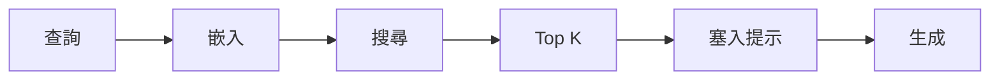
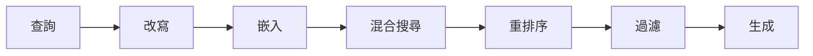
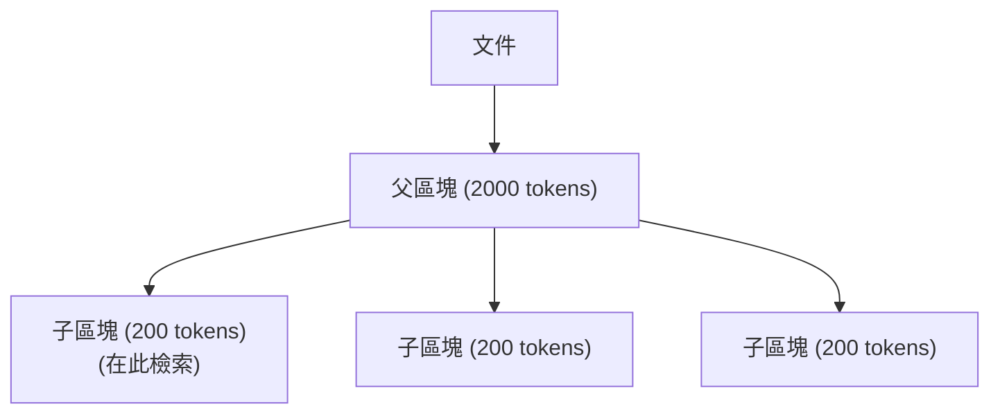
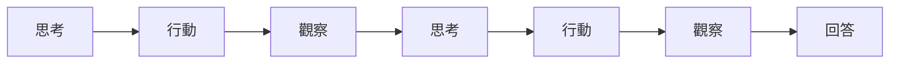

# AI 設計模式

本章彙整建構 AI 系統的常見模式，類似於軟體工程中的設計模式。每個模式都包含適用時機、實作指引與取捨。

## 目錄

- [RAG 模式](#rag-patterns)
- [代理模式](#agent-patterns)
- [最佳化模式](#optimization-patterns)
- [可靠性模式](#reliability-patterns)
- [成本模式](#cost-patterns)
- [面試問題](#interview-questions)
- [參考資料](#references)

---

## RAG 模式

### 模式：Naive RAG

最簡單的 RAG 實作：



**適用時機：**
- MVP 與原型開發
- 簡單的問答
- 當檢索品質已經足夠時

**限制：**
- 沒有重排序
- 沒有查詢增強
- 可能會檢索到不相關的區塊

---

### 模式：Advanced RAG

具有多個階段的增強管線：



```python
class AdvancedRAG:
    async def query(self, user_query: str) -> str:
        # Step 1: Query rewriting
        enhanced_query = await self.rewrite_query(user_query)
        
        # Step 2: Hybrid retrieval
        semantic_results = await self.vector_search(enhanced_query, top_k=50)
        keyword_results = await self.bm25_search(enhanced_query, top_k=50)
        
        # Step 3: Fusion
        combined = self.reciprocal_rank_fusion(semantic_results, keyword_results)
        
        # Step 4: Reranking
        reranked = await self.rerank(enhanced_query, combined[:20])
        
        # Step 5: Generation with top results
        context = self.format_context(reranked[:5])
        return await self.generate(user_query, context)
```

**適用時機：**
- 生產環境系統
- 當準確度很重要時
- 複雜的文件集

---

### 模式：Parent-Child Retrieval（父子檢索）

檢索小區塊，回傳較大的父區塊：



```python
class ParentChildRetriever:
    def __init__(self, vector_store):
        self.vector_store = vector_store
    
    async def retrieve(self, query: str, top_k: int = 5) -> list[str]:
        # Search on child chunks (more precise)
        child_results = await self.vector_store.search(
            query, 
            collection="child_chunks",
            top_k=top_k * 3
        )
        
        # Get unique parent chunks
        parent_ids = set(r.metadata["parent_id"] for r in child_results)
        
        # Return parent chunks (more context)
        parents = await self.get_parents(list(parent_ids)[:top_k])
        return parents
```

**適用時機：**
- 需要檢索的精確度
- 需要生成時的上下文
- 文件結構是階層式的

---

### 模式：Self-RAG

由模型決定何時檢索以及檢索什麼：

```python
class SelfRAG:
    async def generate(self, query: str) -> str:
        # Step 1: Decide if retrieval is needed
        needs_retrieval = await self.assess_retrieval_need(query)
        
        if needs_retrieval:
            # Step 2: Retrieve
            context = await self.retrieve(query)
            
            # Step 3: Assess relevance
            relevant_context = await self.filter_relevant(query, context)
            
            # Step 4: Generate with context
            response = await self.generate_with_context(query, relevant_context)
            
            # Step 5: Self-critique
            is_supported = await self.check_support(response, relevant_context)
            if not is_supported:
                response = await self.regenerate(query, relevant_context)
        else:
            response = await self.generate_without_context(query)
        
        return response
```

**適用時機：**
- 混合知識（參數化知識加上檢索得到的知識）
- 希望模型能有選擇性
- 研究與實驗

---

### 模式：Corrective RAG (CRAG)

評估並修正檢索品質：

```python
class CorrectiveRAG:
    async def query(self, user_query: str) -> str:
        # Initial retrieval
        docs = await self.retrieve(user_query)
        
        # Grade each document
        graded = []
        for doc in docs:
            grade = await self.grade_relevance(user_query, doc)
            graded.append((doc, grade))
        
        # Categorize results
        relevant = [d for d, g in graded if g == "relevant"]
        ambiguous = [d for d, g in graded if g == "ambiguous"]
        
        if len(relevant) >= 3:
            # Enough relevant docs
            context = relevant
        elif len(relevant) + len(ambiguous) >= 2:
            # Refine ambiguous docs
            refined = await self.refine_search(user_query, ambiguous)
            context = relevant + refined
        else:
            # Web search fallback
            web_results = await self.web_search(user_query)
            context = relevant + web_results
        
        return await self.generate(user_query, context)
```

**適用時機：**
- 不可靠的文件語料庫
- 需要高準確度
- 可以為品質檢查付出延遲代價

---

## 代理模式

### 模式：ReAct

交錯進行推理與行動：



實作請參閱 [Agent 架構](../07-agentic-systems/01-agent-fundamentals.md)。

**適用時機：**
- 通用型代理
- 可解釋的決策過程
- 中等複雜度的任務

---

### 模式：Plan-and-Execute（先規劃再執行）

先建立計畫，再執行各個步驟：

```python
class PlanAndExecuteAgent:
    async def run(self, task: str) -> str:
        # Step 1: Create plan
        plan = await self.create_plan(task)
        
        # Step 2: Execute each step
        results = []
        for step in plan.steps:
            result = await self.execute_step(step, results)
            results.append(result)
            
            # Re-plan if needed
            if result.needs_replanning:
                plan = await self.replan(task, results)
        
        # Step 3: Synthesize final answer
        return await self.synthesize(task, results)
    
    async def create_plan(self, task: str) -> Plan:
        prompt = f"""
        Create a step-by-step plan to accomplish this task: {task}
        
        Return as JSON:
        {{
            "steps": [
                {{"id": 1, "description": "...", "tool": "..."}},
                ...
            ]
        }}
        """
        return await self.llm.generate(prompt)
```

**適用時機：**
- 複雜的多步驟任務
- 需要對計畫有可見性
- 任務能從拆解中受益

---

### 模式：Critic/Verifier（評論者／驗證者）

一個代理負責生成，另一個負責評論：

```python
class CriticPattern:
    async def generate_with_critique(self, task: str, max_iterations: int = 3) -> str:
        response = await self.generator.generate(task)
        
        for i in range(max_iterations):
            # Critique the response
            critique = await self.critic.evaluate(task, response)
            
            if critique.is_acceptable:
                break
            
            # Regenerate with feedback
            response = await self.generator.regenerate(
                task, 
                previous=response, 
                feedback=critique.feedback
            )
        
        return response
```

**適用時機：**
- 品質至關重要
- 可以承受額外的延遲
- 任務有明確的成功標準

---

### 模式：Hierarchical Agents（階層式代理）

由管理者將工作委派給專責的工作者：

```python
class ManagerAgent:
    def __init__(self):
        self.workers = {
            "research": ResearchAgent(),
            "coding": CodingAgent(),
            "writing": WritingAgent()
        }
    
    async def run(self, task: str) -> str:
        # Decompose task
        subtasks = await self.decompose(task)
        
        # Assign to workers
        results = {}
        for subtask in subtasks:
            worker = self.workers[subtask.worker_type]
            results[subtask.id] = await worker.execute(subtask)
        
        # Synthesize results
        return await self.synthesize(task, results)
```

**適用時機：**
- 跨領域的複雜任務
- 每個子任務使用不同的工具
- 有平行化的機會

---

## 最佳化模式

### 模式：Cascading Models（級聯模型）

路由到最便宜且足夠勝任的模型：

```python
class ModelCascade:
    def __init__(self):
        self.models = [
            ("gpt-4o-mini", 0.15),     # Cheapest
            ("gpt-4o", 2.50),           # Mid-tier
            ("claude-3.5-sonnet", 3.00) # Most capable
        ]
    
    async def generate(self, query: str) -> str:
        # Classify complexity
        complexity = await self.classify_complexity(query)
        
        if complexity == "simple":
            return await self.call_model("gpt-4o-mini", query)
        elif complexity == "medium":
            return await self.call_model("gpt-4o", query)
        else:
            return await self.call_model("claude-3.5-sonnet", query)
```

**適用時機：**
- 查詢量很大
- 查詢複雜度不一
- 以成本最佳化為優先

---

### 模式：Speculative Execution（推測執行）

用小模型起草，用大模型驗證：

```python
class SpeculativeExecution:
    async def generate(self, prompt: str, n_tokens: int = 5) -> str:
        output = []
        
        while len(output) < max_tokens:
            # Draft with small model
            draft = await self.draft_model.generate(
                prompt + "".join(output),
                n_tokens=n_tokens
            )
            
            # Verify with large model
            verified = await self.target_model.verify(
                prompt + "".join(output),
                draft
            )
            
            # Accept verified tokens
            output.extend(verified.accepted_tokens)
            
            if verified.is_complete:
                break
        
        return "".join(output)
```

**適用時機：**
- 對延遲敏感的應用
- 擁有對齊的草稿模型
- 生成模式可預測

---

### 模式：Caching Layers（快取層）

多層快取策略：

```python
class CachingLLM:
    def __init__(self):
        self.exact_cache = ExactMatchCache()
        self.semantic_cache = SemanticCache(threshold=0.95)
    
    async def generate(self, query: str) -> str:
        # Level 1: Exact match
        cached = await self.exact_cache.get(query)
        if cached:
            return cached
        
        # Level 2: Semantic similarity
        similar = await self.semantic_cache.get_similar(query)
        if similar:
            return similar
        
        # Cache miss: Generate
        response = await self.llm.generate(query)
        
        # Store in caches
        await self.exact_cache.set(query, response)
        await self.semantic_cache.set(query, response)
        
        return response
```

**適用時機：**
- 重複出現的相似查詢
- 以降低成本為優先
- 可以容忍部分資料陳舊

---

## 可靠性模式

### 模式：Retry with Fallback（重試並備援）

```python
class RetryWithFallback:
    async def generate(self, query: str) -> str:
        providers = [
            ("openai", "gpt-4o"),
            ("anthropic", "claude-3.5-sonnet"),
            ("google", "gemini-1.5-pro")
        ]
        
        for provider, model in providers:
            try:
                return await self.call(provider, model, query)
            except RateLimitError:
                continue
            except ServiceError:
                continue
        
        # All providers failed
        raise AllProvidersUnavailable()
```

---

### 模式：Circuit Breaker（斷路器）

```python
class CircuitBreaker:
    def __init__(self, failure_threshold: int = 5, reset_timeout: int = 60):
        self.failures = 0
        self.state = "closed"
        self.last_failure = None
        self.failure_threshold = failure_threshold
        self.reset_timeout = reset_timeout
    
    async def call(self, func, *args):
        if self.state == "open":
            if time.time() - self.last_failure > self.reset_timeout:
                self.state = "half-open"
            else:
                raise CircuitOpenError()
        
        try:
            result = await func(*args)
            self.failures = 0
            self.state = "closed"
            return result
        except Exception as e:
            self.failures += 1
            self.last_failure = time.time()
            if self.failures >= self.failure_threshold:
                self.state = "open"
            raise
```

---

### 模式：Bulkhead（艙壁隔離）

在元件之間隔離故障：

```python
class BulkheadExecutor:
    def __init__(self, max_concurrent: int = 10):
        self.semaphore = asyncio.Semaphore(max_concurrent)
    
    async def execute(self, func, *args):
        async with self.semaphore:
            return await func(*args)

# Separate bulkheads for different operations
rag_bulkhead = BulkheadExecutor(max_concurrent=20)
agent_bulkhead = BulkheadExecutor(max_concurrent=5)
```

---

## 成本模式

### 模式：Token Budget（Token 預算）

```python
class TokenBudget:
    def __init__(self, max_input: int, max_output: int):
        self.max_input = max_input
        self.max_output = max_output
    
    def constrain_input(self, messages: list[dict]) -> list[dict]:
        total_tokens = 0
        constrained = []
        
        for msg in reversed(messages):
            tokens = count_tokens(msg["content"])
            if total_tokens + tokens > self.max_input:
                break
            constrained.insert(0, msg)
            total_tokens += tokens
        
        return constrained
```

---

### 模式：Cost Tracking Decorator（成本追蹤裝飾器）

```python
def track_cost(model: str):
    def decorator(func):
        async def wrapper(*args, **kwargs):
            start_tokens = get_token_count()
            result = await func(*args, **kwargs)
            end_tokens = get_token_count()
            
            cost = calculate_cost(model, end_tokens - start_tokens)
            metrics.record("llm_cost", cost, tags={"model": model})
            
            return result
        return wrapper
    return decorator

@track_cost("gpt-4o")
async def generate_response(query: str):
    return await llm.generate(query)
```

---

## 面試問題

### 問：請描述三種 RAG 模式以及各自的適用時機。

**優秀回答：**

「我會描述 Naive RAG、Advanced RAG 與 Parent-Child Retrieval。

**Naive RAG** 是最簡單的：嵌入查詢、搜尋向量、把 top K 塞進提示、然後生成。我會在 MVP 階段，以及檢索品質已經很好的情況下使用它。它實作起來很快，但沒有重排序，也沒有查詢增強。

**Advanced RAG** 加入了多個階段：查詢改寫、混合搜尋（語意加上關鍵字）、重排序與過濾。我會在準確度很重要的生產環境中使用它。為了換來 10 至 15% 的精確度提升，額外的延遲（重排序約 100 至 200ms）是值得的。

**Parent-Child Retrieval** 嵌入小區塊以進行精確比對，但回傳較大的父區塊以提供上下文。當文件具有結構，而我同時需要檢索的精確度與足夠的生成上下文時，我會使用它。

我選擇哪一種模式，取決於準確度需求、延遲預算與文件特性。我通常會先用 Naive RAG 建立一個基準，再迭代到 Advanced RAG。」

### 問：對於生產環境的 LLM 系統，你會使用哪些可靠性模式？

**優秀回答：**

「我會實作多層次的可靠性：

**重試搭配指數退避（exponential backoff）**，用於處理短暫性的故障。對於 LLM API 來說，速率限制與暫時性錯誤很常見。

**多供應商備援**，這樣一來，如果 OpenAI 出問題，我就能自動路由到 Anthropic 或 Google。這需要把 LLM 介面抽象化。

**斷路器（Circuit breaker）**，用來停止持續猛打一個正在故障的服務。在 N 次失敗之後，我會開啟斷路器並立即路由到備援，讓主要服務有時間恢復。

**優雅降級（Graceful degradation）**，當所有供應商都失敗時採用。回傳快取的回應、顯示備援訊息，或排入佇列稍後處理，而不是直接報錯。

**艙壁隔離（Bulkhead isolation）**，用來防止某個元件的故障擴散開來。代理工作負載與 RAG 工作負載使用各自獨立的執行緒池。

**逾時（Timeouts）**，在每一層都設定。LLM 呼叫可能會卡住；我會設定積極的逾時時間，並優雅地處理它們。

關鍵在於假設故障一定會發生，並為此進行設計，而不是寄望它們不會發生。」

---

## 參考資料

- Gao et al. "Retrieval-Augmented Generation for Large Language Models: A Survey" (2024)
- Yao et al. "ReAct: Synergizing Reasoning and Acting in Language Models" (2023)
- Microsoft Patterns for AI: https://learn.microsoft.com/azure/architecture/patterns/

---

*下一篇：[應避免的反模式](02-anti-patterns.md)*
