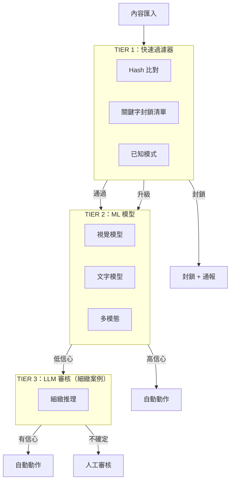
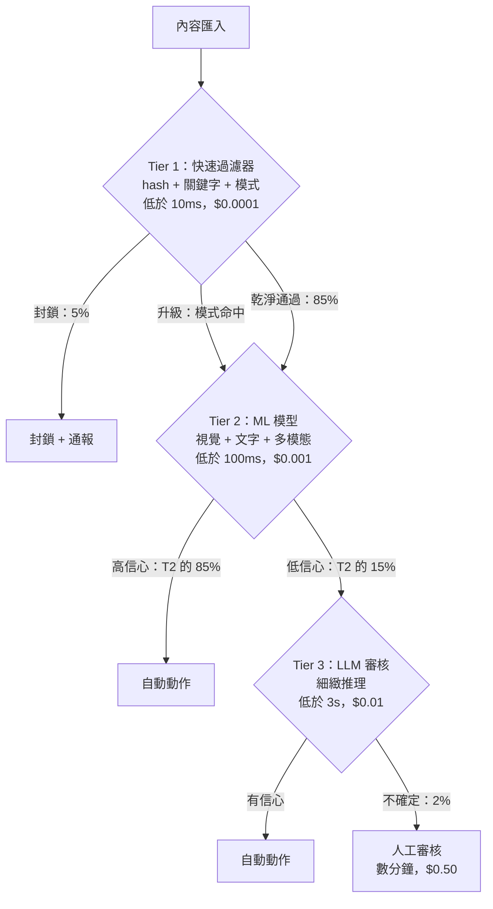
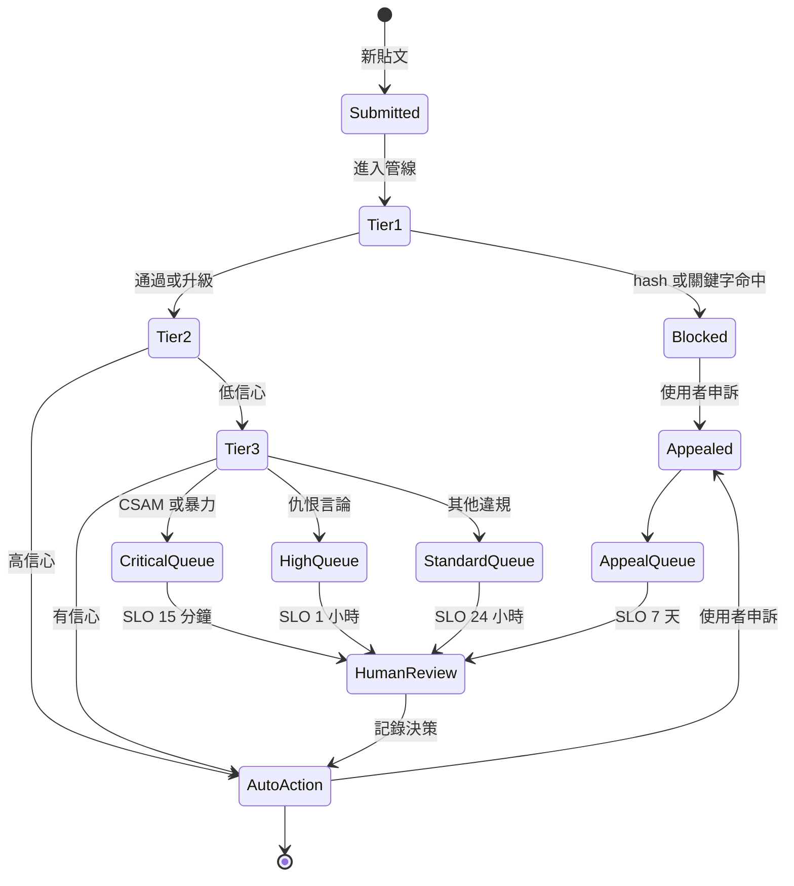

# 案例研究：大規模內容審核

本案例研究涵蓋如何為每天處理數百萬則貼文的社群平台設計一套 AI 驅動的內容審核系統。

## 目錄

- [問題陳述](#problem-statement)
- [需求分析](#requirements-analysis)
- [架構設計](#architecture-design)
- [分類管線](#classification-pipeline)
- [人在迴路中（Human-in-the-Loop）](#human-in-the-loop)
- [對抗式穩健性](#adversarial-robustness)
- [結果與指標](#results-and-metrics)
- [面試演練](#interview-walkthrough)

---

## 問題陳述

**公司：** 擁有 5000 萬日活躍使用者的社群媒體平台

**現況：**
- 每天 1000 萬則貼文
- 500 名人工審核員
- 平均審核時間：4 小時
- 誤判率（false positive rate）：15%
- 觸及使用者的有害內容：2%

**目標：**
- 將有害內容曝光降至 < 0.1%
- 在 < 15 分鐘內審核優先內容
- 將誤判率降至 < 5%
- 在不需線性增加審核員的情況下擴展

---

## 需求分析

### 內容類別

| 類別 | 嚴重程度 | 動作 | 延遲 |
|----------|----------|--------|---------|
| CSAM | 極嚴重 | 封鎖 + 通報 | 立即 |
| 暴力／血腥 | 高 | 封鎖 + 審核 | < 1 分鐘 |
| 仇恨言論 | 高 | 封鎖 + 審核 | < 5 分鐘 |
| 騷擾 | 中 | 審核 + 警告 | < 15 分鐘 |
| 垃圾訊息 | 中 | 降低優先序 | < 1 小時 |
| 不實資訊 | 中 | 標註 + 審核 | < 1 小時 |
| 成人內容 | 低 | 年齡分級 | < 1 小時 |

### 準確度需求

| 指標 | 目標 | 理由 |
|--------|--------|-----------|
| 召回率（有害內容） | > 99% | 將有害曝光最小化 |
| 精確率（precision） | > 95% | 將誤判最小化 |
| 延遲（極嚴重） | < 1 分鐘 | 防止擴散 |
| 延遲（標準） | < 15 分鐘 | 平衡資源 |

---

## 架構設計

### 高階架構



這套分層管線就像一棵決策樹。每一層只將自己無法廉價判定的內容向上升級。Tier 1 與 Tier 4 之間的每次決策成本比約為 1:5000，因此把路由做對是單位經濟效益的主要槓桿：



### 處理層級

| 層級 | 方法 | 延遲 | 成本 | 涵蓋範圍 |
|------|--------|---------|------|----------|
| 1 | Hash／關鍵字 | < 10ms | $0.0001 | 5% 封鎖 |
| 2 | ML 分類器 | < 100ms | $0.001 | 85% 自動判定 |
| 3 | LLM 審核 | < 3s | $0.01 | 8% 細緻案例 |
| 4 | 人工審核 | 數分鐘 | $0.50 | 2% 升級 |

---

## 分類管線

### Tier 1：快速過濾器

```python
class FastFilters:
    """
    Immediate blocking for known harmful content.
    No false positives for matches.
    """
    
    def __init__(self):
        self.hash_db = PhotoDNADatabase()  # CSAM detection
        self.keyword_filter = KeywordBlocklist()
        self.pattern_matcher = RegexPatterns()
    
    async def filter(self, content: Content) -> FilterResult:
        # CSAM hash matching (highest priority)
        if content.has_media:
            hash_match = await self.hash_db.check(content.media_hashes)
            if hash_match:
                return FilterResult(
                    action="block_report",
                    reason="csam_hash_match",
                    confidence=1.0,
                    tier=1
                )
        
        # Keyword blocklist
        if content.text:
            keyword_match = self.keyword_filter.check(content.text)
            if keyword_match and keyword_match.severity == "critical":
                return FilterResult(
                    action="block_review",
                    reason=f"keyword_{keyword_match.category}",
                    confidence=0.99,
                    tier=1
                )
        
        # Pattern matching (phone numbers in suspicious context, etc)
        pattern_match = self.pattern_matcher.check(content.text)
        if pattern_match:
            return FilterResult(
                action="elevate",
                reason=f"pattern_{pattern_match.type}",
                confidence=pattern_match.confidence,
                tier=1
            )
        
        return FilterResult(action="continue", tier=1)
```

### Tier 2：ML 分類

```python
### Tier 2: Native Multimodal Classification (Gemini 3 Flash)

```python
class MultimodalSafety:
    """
    Dec 2025 Shift: No separate OCR/Vision models.
    Gemini 3 Flash handles interleaved text/images natively for <$0.10 / 1M posts.
    """
    async def classify(self, content: Content) -> dict:
        # Native multimodal understanding catches context (e.g., text on a protest sign)
        response = await genai.submit(
            model="gemini-3-flash",
            content=[content.text, content.image_bytes],
            schema=SafetySchema
        )
        return response
```

### Tier 3: Nuanced LLM Review (GPT-5.2-mini)

```python
class NuanceReviewer:
    """
    Using GPT-5.2-mini for nuanced context (sarcasm, regional slang).
    Reasoning capabilities of 2025-mini models exceed 2024-frontier models.
    """
    async def review(self, content: Content, context: dict) -> dict:
        result = await client.chat.completions.create(
            model="gpt-5.2-mini",
            messages=[
                {"role": "system", "content": "Analyze for regional hate speech slang."},
                {"role": "user", "content": content.text}
            ],
            response_format={"type": "json_object"}
        )
        return json.loads(result)
```
```

---

## 人在迴路中（Human-in-the-Loop）

### 審核佇列管理

每一則內容都會經歷從提交到終態的生命週期。把這個生命週期視為一台狀態機，可以讓 SLO 變得具體：每條優先序通道都有不同的「抵達終態時間」目標，而申訴可以讓內容轉回待處理狀態：



```python
class ReviewQueueManager:
    """
    Prioritize and route content to human moderators.
    """
    
    def __init__(self):
        self.queues = {
            "critical": PriorityQueue(),  # CSAM, violence - immediate
            "high": PriorityQueue(),      # Hate speech - < 15 min
            "standard": PriorityQueue(),  # Other violations - < 1 hour
            "appeals": PriorityQueue()    # User appeals
        }
    
    async def enqueue(self, content: Content, result: ReviewResult):
        priority = self.calculate_priority(content, result)
        
        item = ReviewItem(
            content_id=content.id,
            content=content,
            ai_analysis=result,
            priority=priority,
            enqueued_at=datetime.now()
        )
        
        queue_name = self.get_queue(result.severity)
        await self.queues[queue_name].put(item)
        
        # Alert if critical
        if queue_name == "critical":
            await self.alert_moderators(item)
    
    def calculate_priority(self, content: Content, result: ReviewResult) -> float:
        priority = 0.0
        
        # Severity weight
        severity_weights = {"critical": 100, "high": 50, "medium": 20, "low": 5}
        priority += severity_weights.get(result.severity, 0)
        
        # Reach weight (viral content prioritized)
        priority += min(content.reach_score * 10, 50)
        
        # Confidence inverse (less confident = higher priority)
        priority += (1 - result.confidence) * 30
        
        return priority
```

### 審核員介面

```python
class ModeratorDecision:
    async def submit(
        self,
        moderator_id: str,
        content_id: str,
        decision: str,
        reason: str,
        notes: str = None
    ):
        # Record decision
        await self.store_decision({
            "content_id": content_id,
            "moderator_id": moderator_id,
            "decision": decision,
            "reason": reason,
            "notes": notes,
            "ai_recommendation": await self.get_ai_result(content_id),
            "decided_at": datetime.now()
        })
        
        # Execute action
        await self.execute_action(content_id, decision)
        
        # Update ML models with feedback
        await self.feedback_loop.record(
            content_id=content_id,
            ai_prediction=await self.get_ai_result(content_id),
            human_decision=decision
        )
```

---

## 對抗式穩健性

### 規避手法與防禦

| 規避手法 | 防禦 |
|-------------------|---------|
| 字元替換（h@te） | 正規化 + 同形字（homoglyph）映射 |
| 圖片文字（文字嵌在圖片中） | OCR 管線 |
| 不可見字元 | Unicode 正規化 |
| 上下文操弄 | 多輪分析 |
| 編碼內容 | 解碼管線 |
| 對抗式圖片 | 穩健的視覺模型 |

### 防禦管線

```python
class AdversarialDefense:
    def __init__(self):
        self.normalizer = TextNormalizer()
        self.ocr = OCRPipeline()
        self.decoder = ContentDecoder()
    
    def preprocess(self, content: Content) -> Content:
        processed = content.copy()
        
        # Normalize text
        if processed.text:
            processed.text = self.normalizer.normalize(processed.text)
            processed.text = self.decoder.decode_obfuscation(processed.text)
        
        # Extract text from images
        if processed.has_images:
            for image in processed.images:
                extracted_text = self.ocr.extract(image)
                if extracted_text:
                    processed.text = f"{processed.text}\n[IMAGE TEXT]: {extracted_text}"
        
        return processed
    
    def normalize(self, text: str) -> str:
        # Homoglyph normalization
        text = self.homoglyph_map(text)
        
        # Unicode normalization
        text = unicodedata.normalize("NFKC", text)
        
        # Remove zero-width characters
        text = re.sub(r"[\u200b-\u200f\u2028-\u202f]", "", text)
        
        # Leetspeak normalization
        text = self.leetspeak_decode(text)
        
        return text
```

---

## 結果與指標

### 效能比較

| 指標 | 之前 | 之後 | 改善幅度 |
|--------|--------|-------|-------------|
| 有害內容曝光 | 2% | 0.08% | 降低 96% |
| 審核延遲（極嚴重） | 4 小時 | 8 分鐘 | 快 30 倍 |
| 誤判率 | 15% | 4.2% | 降低 72% |
| 審核員效率 | 50/天 | 200/天 | 提升 4 倍 |

### 成本分析（2025 年 12 月）

| 元件 | 每 1000 萬則貼文 | 備註 |
|-----------|---------------|-------|
| Tier 1 過濾器 | $0.10 | 可忽略 |
| Tier 2 多模態 | $0.50 | Gemini 3 Flash（$0.05/1M） |
| Tier 3 LLM（GPT-5.2） | $0.20 | 對 10% 流量做細緻檢查 |
| 人工審核 | $15.00 | 僅聚焦在 1% 的量 |
| **總計** | **$15.80** | **相較 2024 年降低 40%** |

> [!TIP]
> **生產環境智慧：** 把繁重工作從「Tier 2 視覺／OCR」移轉到 **原生多模態（Gemini 3 Flash）**，讓管線複雜度降低 70%、延遲降低 400ms。

*人工審核仍是成本大宗，但已聚焦在困難案例上*

---

## 面試演練

**面試官：** 「為一個社群媒體平台設計一套內容審核系統。」

**理想回答：**

1. **釐清規模與需求**（1 分鐘）
   - 「量有多大？有哪些內容類型？可接受的誤判率是多少？」
   - 「有任何法規要求嗎（CSAM 通報、GDPR）？」

2. **多層架構**（3 分鐘）
   - 「我會採用一串複雜度逐層遞增的串接（cascade）：」
   - 「Tier 1：Hash 比對、關鍵字過濾，即時、確定」
   - 「Tier 2：ML 分類器，快速、專門化」
   - 「Tier 3：LLM 審核，細緻、具上下文意識」
   - 「Tier 4：人工審核，最終裁決者」
   - 「每一層處理前一層無法處理的部分」

3. **優先排序是關鍵**（2 分鐘）
   - 「並非所有有害內容都一樣。CSAM 與暴力需要立即處理。仇恨言論優先但不需即時。垃圾訊息可以等。」
   - 「依嚴重程度、觸及範圍與信心度建立優先序佇列」

4. **人在迴路中設計**（2 分鐘）
   - 「由人類處理低信心決策與申訴」
   - 「AI 自動處理 95% 以上，讓人工審核在經濟上可行」
   - 「回饋迴路：人工決策可改善 ML 模型」

5. **對抗式穩健性**（2 分鐘）
   - 「使用者會試圖規避偵測。防禦包含：」
   - 「針對混淆的文字正規化」
   - 「針對圖片中文字的 OCR」
   - 「隨著規避手法演進而持續更新模型」

6. **指標**（1 分鐘）
   - 「主要：有害內容曝光率（目標 < 0.1%）」
   - 「次要：誤判率（使用者體驗）」
   - 「營運：審核延遲、審核員吞吐量」

---

## 參考資料

- Meta Content Moderation：https://transparency.fb.com/
- Google Perspective API：https://perspectiveapi.com/
- OpenAI Moderation：https://platform.openai.com/docs/guides/moderation

---

*下一篇：[LLM 定價參考](../02-model-landscape/03-pricing-and-costs.md)*
