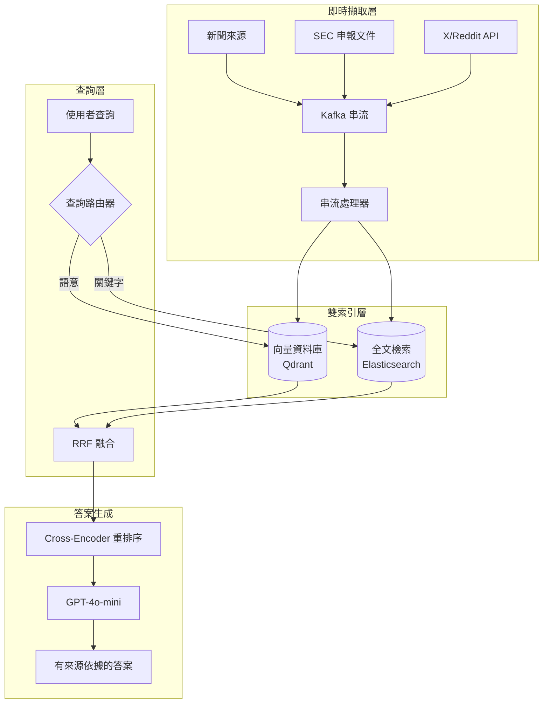

# 案例研究：即時 AI 搜尋引擎

## 問題情境

一家金融科技新創公司需要打造一個**即時市場情報平台**，讓分析師能用自然語言對即時市場數據、新聞與公司申報文件提出問題。

**面試中給定的限制條件：**
- 資料新鮮度：查詢必須反映最近 5 分鐘內的資訊
- 規模：10,000 名同時在線使用者，每小時 50,000 次查詢
- 準確性：金融資料不可出現幻覺
- 延遲：p95 回應時間低於 3 秒

---

## 面試題目

> 「設計一套系統，讓使用者能提問『過去一小時內關於 Tesla 的市場情緒如何？』，並在 3 秒內取得準確且有來源依據的答案。」

---

## 解決方案架構



---

## 關鍵設計決策

### 1. 為什麼用 Kafka 做擷取？

面試官想知道你是否理解**串流與批次的差異**。

**答案：** Kafka 提供恰好一次（exactly-once）的傳遞保證，並允許多個消費者。我們有一個消費者寫入向量資料庫，另一個寫入 Elasticsearch。如果向量索引進度落後，全文檢索索引仍可服務查詢。這就是用於提升韌性的**雙寫入模式（dual-write pattern）**。

### 2. 為什麼用混合搜尋（向量 + 全文檢索）？

**答案：** 金融查詢混合了語意（「關於 Tesla 的市場情緒」）與關鍵字（「TSLA 10-K 申報文件」）。純向量搜尋會遺漏精確的股票代號比對。我們使用**倒數排名融合（Reciprocal Rank Fusion，RRF）**來結合結果。

### 3. 為什麼用 GPT-4o-mini 而不是 GPT-4o？

**答案：** 為了在每小時 50K 次查詢下達到 3 秒的 p95 延遲目標，我們需要快速的生成。GPT-4o-mini 提供每秒 100+ token，而 GPT-4o 只有每秒 40 token。重排序器負責準確性，LLM 只負責綜整已經過驗證的內容。

---

## 處理新鮮度需求

這個問題最困難的部分，在於確保索引反映最近 5 分鐘內的資料。

**解決方案：以 TTL 為基礎的索引**

```python
# Each document gets a timestamp field
doc = {
    "content": "Tesla announces new factory...",
    "timestamp": datetime.now(UTC),
    "source": "Reuters",
    "ttl_hours": 24  # Auto-delete after 24 hours
}

# Query filters to last N minutes
def search_recent(query: str, minutes: int = 60):
    cutoff = datetime.now(UTC) - timedelta(minutes=minutes)
    return vector_db.search(
        query=query,
        filter={"timestamp": {"$gte": cutoff}}
    )
```

---

## 成本分析

| 元件 | 每月成本（每小時 50K 次查詢） |
|-----------|-----------------------------------|
| Kafka (MSK) | $2,500 |
| Qdrant（代管） | $1,800 |
| Elasticsearch | $2,000 |
| GPT-4o-mini（生成） | $3,500 |
| Cross-encoder 重排序 | $800 |
| **總計** | **$10,600/月** |

---

## 面試延伸問題

**問：你如何防止金融資料出現幻覺？**

答：三層機制：(1) LLM 只負責摘要檢索到的內容，絕不自行生成事實。(2) 每一項主張都必須引用一份來源文件。(3) 生成後的驗證器會檢查回應中的任何數字是否逐字存在於某份來源中。

**問：如果在新聞爆量時 Kafka 進度落後了怎麼辦？**

答：我們透過消費者延遲（consumer lag）監控來實作背壓（backpressure）。如果延遲超過 2 分鐘，我們會在擷取端使用抽樣來卸載負載。即時查詢會打向只含最近一小時資料的「近期」索引；批次作業則回填完整索引。

---

## 面試重點整理

1. **即時 AI 搜尋需要串流基礎設施**，而非批次 ETL
2. 對於結構化領域，**混合搜尋（語意 + 關鍵字）優於純向量搜尋**
3. **延遲預算驅動模型選擇**：用快速模型做綜整，把昂貴的模型留給推理
4. **新鮮度是一個過濾條件，而非一項功能**：在索引層實作，而非在提示層實作

---

*相關章節：[混合搜尋](../06-retrieval-systems/05-hybrid-search.md)、[服務基礎設施](../04-inference-optimization/06-serving-infrastructure.md)*
