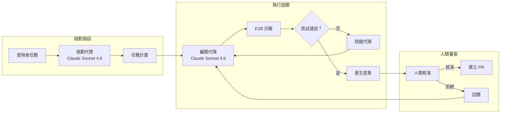
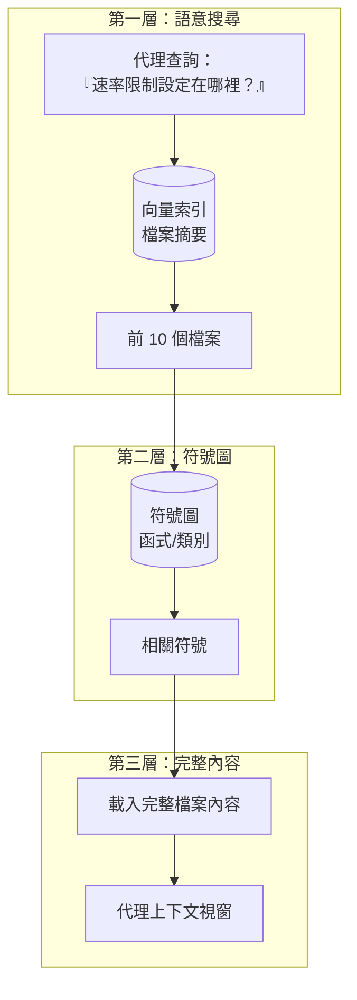

# 案例研究：自主編碼代理

## 問題

一家開發者工具公司想要打造一個能自主完成跨多檔任務的 **AI 編碼助理**，例如：「為這個 Express API 加上身分驗證」或「把這個模組重構成使用依賴注入」。

**面試中給定的限制條件：**
- 必須能在擁有 1,000 個以上檔案的程式碼庫上運作
- 不能破壞既有功能（測試必須通過）
- 人類必須在提交前核准變更
- 預算：每完成一項任務的成本低於 $0.50

---

## 面試問題

> 「請設計一個編碼代理，它能接下像是『為所有 API 端點加上速率限制』這樣的任務，並產出一個可運作、已通過測試的拉取請求（pull request）。」

---

## 解決方案架構



---

## 關鍵設計決策

### 1. 為什麼要把規劃代理和編碼代理分開？

**解答：** 規劃任務需要**對整個程式碼庫進行推理**（要動哪些檔案、存在哪些依賴關係）。編碼任務則需要**精準的語法生成**。把兩者分開後，我們就能在規劃時使用延伸思考模式，在編碼時使用快速生成。這也讓我們可以在規劃後建立檢查點，讓人類在執行前先審查整體做法。

### 2. 為什麼用 E2B 沙箱而不是在本機執行？

**解答：** 為了安全。代理會生成並執行程式碼。在本機執行會讓主機系統暴露於風險之中。E2B 提供一個隔離的容器，且每次工作階段結束後都會重置。如果代理生成了 `rm -rf /`，它只會摧毀沙箱本身。

### 3. 為什麼兩者都用 Claude Sonnet 4.6？

**解答：** Claude Opus 4.7 在 SWE-bench Pro 上以 64.3% 領先，而 Claude Sonnet 4.6 以約 40% 的價格交付了大約 90% 的品質，對於一個每項任務要跑很多回合的代理來說，這正是最佳平衡點。我們只在除錯迴圈上啟用「延伸思考（Extended Thinking）」，而不在初次生成時啟用，以控制成本。

---

## 程式碼庫理解問題

代理無法把 1,000 個檔案塞進上下文視窗。我們用**分層檢索（Tiered Retrieval）**來解決這個問題：



**實作方式：**
1. **建立檔案摘要索引**（在導入階段由較小的模型生成）
2. **建立符號圖**，使用 tree-sitter 進行 AST 剖析
3. **分階段檢索**：摘要 → 符號 → 完整內容

---

## 自我修正迴圈

代理會失敗。可靠性的關鍵在於**結構化的自我修正**：

```python
async def execute_with_retry(task: str, max_attempts: int = 3):
    for attempt in range(max_attempts):
        # Generate code
        code_changes = await coder_agent.generate(task)
        
        # Apply to sandbox
        sandbox.apply_changes(code_changes)
        
        # Run tests
        test_result = await sandbox.run_tests()
        
        if test_result.passed:
            return code_changes
        
        # Feed failure back to agent
        task = f"""
        Previous attempt failed. Error:
        {test_result.error}
        
        Original task: {task}
        
        Fix the issue.
        """
    
    raise MaxRetriesExceeded()
```

---

## 成本拆解

| 階段 | 模型 | 詞元數（平均） | 成本 |
|-------|-------|--------------|------|
| 規劃 | Claude Sonnet 4.6（延伸思考） | 輸入 8,000 / 輸出 2,000 | $0.06 |
| 檔案檢索 | Embeddings | 50,000 | $0.01 |
| 編碼（每次嘗試） | Claude Sonnet 4.6 | 輸入 15,000 / 輸出 3,000 | $0.09 |
| 測試（平均 3 次執行） | - | - | $0.00 |
| **總計（平均 1.5 次嘗試）** | | | **$0.21** |

每項任務 $0.21，控制在預算之內。

---

## 面試延伸問題

**問：對於需要跨 20 個以上檔案進行變更的任務，你會怎麼處理？**

答：我們會在規劃階段把它們拆解成子任務。規劃器會輸出一個帶有依賴關係的變更 DAG（有向無環圖）。執行器會依拓撲順序處理這些子任務，並逐步執行測試。如果第 5 步出錯，我們只會重跑第 5 步以後的步驟，而不是整個任務。

**問：如果代理陷入無限重試迴圈該怎麼辦？**

答：有三道防護機制：(1) 最大嘗試次數上限（3 次）。(2) 如果同一個測試以相同的錯誤連續失敗兩次，就升級交由人類處理。(3) 每項任務的總詞元預算（$0.50）一旦觸及就觸發終止。

**問：你如何防止代理引入安全漏洞？**

答：我們會在沙箱中執行一個靜態分析工具（Semgrep），作為測試套件的一部分。安全規則的違規會被視為測試失敗，並回饋給代理進行修正。

---

## 面試重點整理

1. **將規劃與執行分開**，以利建立檢查點與控制成本
2. **將所有生成的程式碼放進沙箱**以確保安全（E2B、Docker 等）
3. **分層檢索可解決大型程式碼庫的規模問題**：摘要 → 符號 → 內容
4. **自我修正迴圈需要硬性上限**：嘗試次數、詞元數、時間

---

*相關章節：[工具使用與 MCP](../07-agentic-systems/03-tool-use-and-mcp.md)、[錯誤處理](../07-agentic-systems/07-error-handling-and-recovery.md)*
