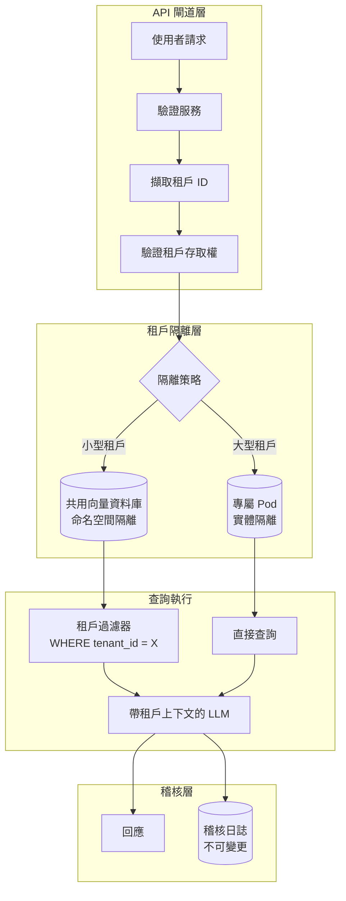
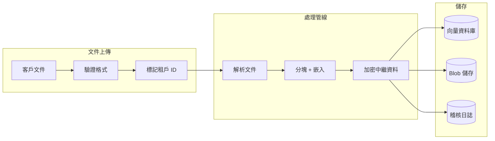

# 案例研究：多租戶 AI SaaS 平台

## 問題

一家 B2B 新創公司正在打造一個 **AI 驅動的文件分析平台**，每位客戶上傳自己的合約，由 AI 回答關於合約的問題。客戶當中包含彼此競爭的對手，他們的資料絕對不能被對方看到。

**面試中給定的限制條件：**
- 500 家企業客戶，每家擁有 10,000 到 100,000 份文件
- 絕對的資料隔離：客戶 A 的資料不能外洩給客戶 B
- 共用基礎設施以提升成本效率
- 合規：SOC 2 Type II、GDPR
- 查詢延遲低於 2 秒

---

## 面試題目

> 「設計一套多租戶 RAG 系統，讓 Coca-Cola 和 Pepsi 都能成為客戶，且跨租戶資料外洩的風險為零。」

---

## 解決方案架構



---

## 關鍵設計決策

### 1. 混合式隔離：命名空間 vs 實體

**解答：** 純實體隔離（每個租戶一個資料庫）成本高昂。純命名空間隔離（共用資料庫搭配 tenant_id 過濾）一旦發生過濾器錯誤就有外洩風險。我們採用**分層作法**：

| 層級 | 租戶規模 | 隔離方式 | 原因 |
|------|-------------|------------------|-----|
| Standard | <50K 份文件 | 共用 Qdrant 中的命名空間 | 成本效率高 |
| Premium | 50K-500K 份文件 | 專屬 Qdrant collection | 效能隔離 |
| Enterprise | >500K 份文件 | 專屬 Qdrant pod | 實體隔離加上法規要求 |

### 2. 資料隔離的縱深防禦

**解答：** 我們絕不信任單一層級。我們的隔離堆疊如下：

1. **API 閘道**：從 JWT 驗證 tenant_id，拒絕跨租戶請求
2. **資料庫層**：列級安全性（RLS）在資料庫層級強制執行 tenant_id 過濾
3. **應用層**：ORM 包裝器自動注入租戶過濾器
4. **LLM 層**：系統提示明確聲明「你只在為 Tenant X 回答」
5. **輸出層**：生成後過濾器掃描是否有任何不屬於該租戶的文件 ID

### 3. 為什麼不為每個租戶各配一個向量資料庫？

**解答：** 500 個租戶 × 每個受管實例每月 $100 = 光是資料庫每月就要 $50K。對 80% 的租戶採用命名空間隔離，可將這筆費用降到每月 $8K。剩下 20% 採用專屬基礎設施的租戶，則支付進階層級的價格。

---

## 資料導入管線



**關鍵：** tenant_id 在**最早可能的時間點**（上傳驗證階段）就附加上去，並隨著文件流經每一個階段。它不會在之後才被推導或查找。

---

## 處理合規要求

### SOC 2 Type II

| 控制項 | 實作方式 |
|---------|----------------|
| 存取日誌 | 每次查詢都記錄 tenant_id、user_id、時間戳記 |
| 靜態加密 | Blob 儲存採用 AES-256，向量資料庫採用資料庫原生加密 |
| 傳輸加密 | 全程使用 TLS 1.3 |
| 存取審查 | 從稽核日誌自動產生每季報告 |

### GDPR 刪除權

```python
async def delete_tenant_data(tenant_id: str):
    # 1. Delete from vector DB
    await vector_db.delete(filter={"tenant_id": tenant_id})
    
    # 2. Delete from blob storage
    await blob_storage.delete_prefix(f"tenants/{tenant_id}/")
    
    # 3. Anonymize audit logs (cannot delete for compliance)
    await audit_log.anonymize(tenant_id=tenant_id)
    
    # 4. Generate deletion certificate
    return generate_deletion_certificate(tenant_id)
```

---

## 成本分析（500 個租戶）

| 元件 | 每月成本 |
|-----------|--------------|
| 共用向量資料庫（Qdrant Cloud） | $2,500 |
| 專屬 pod（20 個 enterprise 租戶） | $4,000 |
| LLM 成本（共用池，GPT-4o-mini） | $8,000 |
| Blob 儲存（S3） | $1,500 |
| 稽核日誌（CloudWatch） | $500 |
| **總計** | **$16,500/月** |
| **每租戶平均** | **$33/月** |

---

## 面試延伸問題

**問：如果你的 ORM 出現錯誤，繞過了租戶過濾器怎麼辦？**

答：縱深防禦。即使 ORM 失效，資料庫仍會強制執行 RLS（列級安全性）。查詢 `SELECT * FROM documents` 在內部會變成 `SELECT * FROM documents WHERE tenant_id = current_tenant()`。這是在 Postgres 層級強制執行的，而非應用層級。

**問：如果某個租戶想要匯出他們所有的資料，你會怎麼處理？**

答：我們提供資料可攜性 API，可串流匯出所有文件連同其嵌入與中繼資料。匯出由管理員觸發，記錄在稽核軌跡中，並交付到客戶自行掌控的 S3 儲存桶（而非我們的基礎設施）。

**問：如果 LLM 從訓練資料中產生幻覺，而那段內容恰好與某個競爭對手的機密資訊相符怎麼辦？**

答：這是真實存在的風險。我們透過以下方式緩解：(1) 只使用以檢索為接地基礎的生成（LLM 在沒有檢索到文件的情況下無法作答）。(2) 過濾輸出，剔除任何無法追溯回該租戶上傳文件的內容。(3) 提供「私有模型」層級，我們僅在該租戶自己的資料上微調出專屬於該租戶的模型。

---

## 面試重點整理

1. **多租戶的核心在於分層**：絕不依賴單一隔離機制
2. **分層隔離能在成本與安全之間取得平衡**：並非所有租戶都需要專屬基礎設施
3. **租戶 ID 必須不可變更且盡早建立**：在上傳時標記，而非查詢時才標記
4. **合規是架構層面的課題**：從第一天起就為稽核、刪除與可攜性而設計

---

*相關章節：[LLM 安全](../12-security-and-access/01-llm-security.md)、[存取控制與多租戶隔離](../12-security-and-access/02-access-control.md)*
