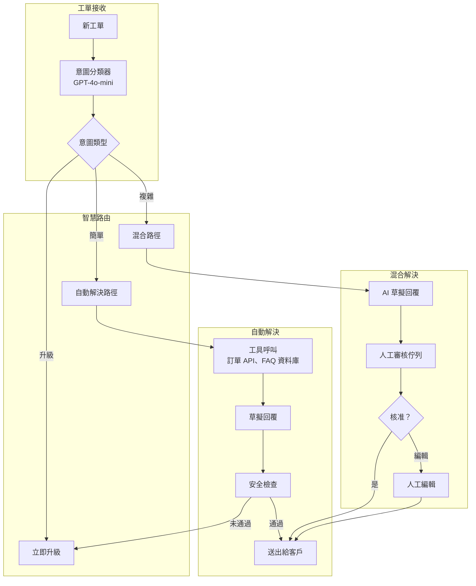
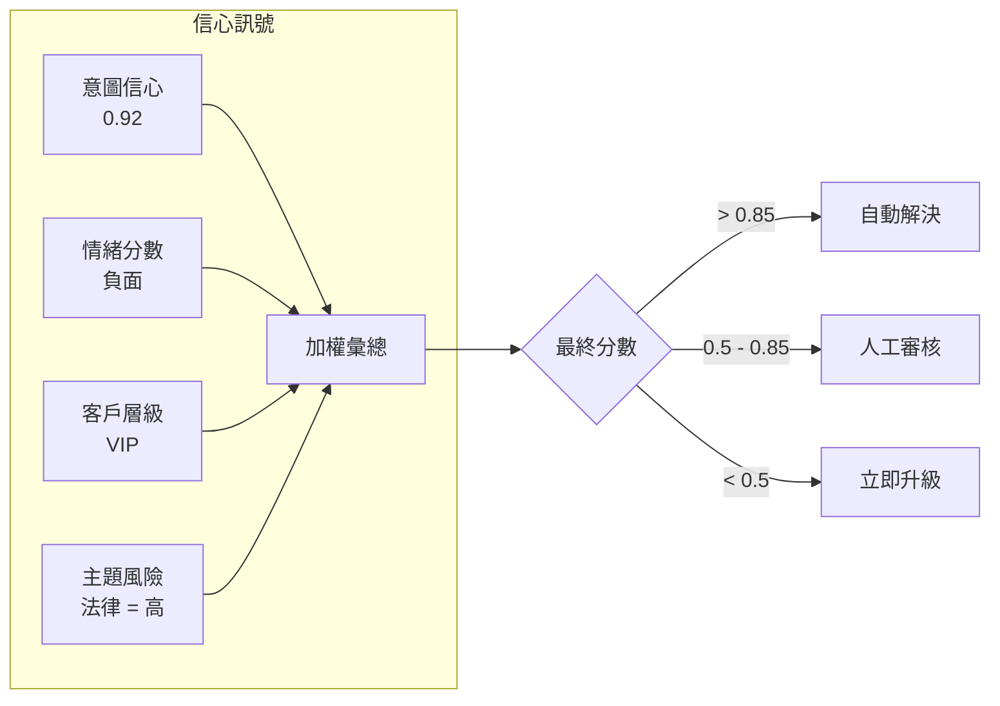
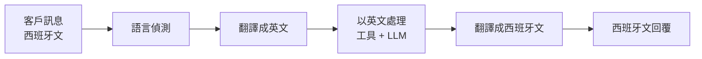

# 案例研究：AI 驅動的客戶支援

## 問題背景

一家電商公司每月需處理 **200 萬張支援工單**。他們希望打造一套 AI 系統，能在無須人工介入的情況下自動解決 60% 的工單，同時將複雜問題無縫升級給人工處理。

**面試中給定的限制條件：**
- 全年無休 24/7 運作，涵蓋 12 種語言
- 必須與既有的 Zendesk 和 Salesforce 整合
- 不能做出無法兌現的承諾（退款、出貨日期）
- 人工客服必須能夠在對話進行到一半時接手
- 成本目標：每張已解決工單 $0.05

---

## 面試題目

> 「設計一套客戶支援 AI，能自動處理『我的訂單在哪？』，但又懂得在遇到『我要告你詐欺』時把工單升級給人工。」

---

## 解決方案架構



---

## 關鍵設計決策

### 1. 三層路由（自動 / 混合 / 升級）

**解答：** 並非所有工單都一視同仁。我們將工單分類為三條路徑：

| 路徑 | 判斷標準 | 範例 | 人工參與程度 |
|------|----------|---------|-------------------|
| **自動** | 高信心、低風險 | 「我的訂單在哪？」 | 無 |
| **混合** | 中等信心或中等風險 | 「我要退款」 | 審核 AI 草稿 |
| **升級** | 法律、威脅、VIP、低信心 | 「這是詐欺」 | 完全由人工處理 |

### 2. 以工具為基礎的解決方式，而非純粹生成

**解答：** AI 並不「知道」訂單在哪裡，它會呼叫訂單 API 工具。這對準確性至關重要：

```python
@tool
def get_order_status(order_id: str) -> dict:
    """Retrieve real-time order status from OMS."""
    order = oms_client.get_order(order_id)
    return {
        "status": order.status,
        "shipped_date": order.shipped_at,
        "estimated_delivery": order.eta,
        "tracking_url": order.tracking_url
    }
```

LLM 負責編排工具，但絕不捏造資料。

### 3. 為什麼要在送出前做安全檢查？

**解答：** 即使是自動解決的工單，也要通過一道安全過濾：

1. **承諾偵測**：標記出像「我保證」或「我們會賠償」這類陳述
2. **情緒落差**：偵測 AI 是否在客戶生氣時聽起來很開心
3. **PII 外洩**：確保不會出現任何內部備註或其他客戶的資料
4. **競爭對手提及**：標記 AI 是否推薦了競爭對手

---

## 升級判斷的智慧

最困難的部分是知道**何時**該升級。我們使用一個結合多重訊號的信心分數：



**關鍵洞察：** 一位 VIP 客戶即使只是問一個簡單問題，仍會走混合路徑，因為一旦出錯所付出的代價更高。

---

## 多語言支援

不需要 12 個獨立模型就能支援 12 種語言：



**為什麼不用原生多語言模型？**

成本考量。GPT-4o 能良好處理全部 12 種語言。若為每種語言使用專門模型，就需要 12 套部署。翻譯雖然增加延遲，但能讓基礎設施保持簡單。

---

## 人工接手（對話進行中）

當人工接手時，他們需要完整的上下文：

```python
def handoff_to_human(conversation_id: str, agent_id: str):
    conversation = get_conversation(conversation_id)
    
    # Generate summary for human agent
    summary = llm.generate(f"""
    Summarize this conversation for a human agent:
    - Customer issue
    - What AI already tried
    - Why escalation happened
    
    Conversation:
    {conversation.messages}
    """)
    
    # Create handoff package
    return {
        "summary": summary,
        "customer_sentiment": conversation.sentiment,
        "attempted_solutions": conversation.tool_calls,
        "full_transcript": conversation.messages,
        "customer_tier": conversation.customer.tier
    }
```

---

## 成本分析

| 元件 | 每張工單成本 |
|-----------|-----------------|
| 意圖分類（GPT-4o-mini） | $0.002 |
| 工具呼叫（訂單 API、FAQ 搜尋） | $0.001 |
| 回覆生成（GPT-4o-mini） | $0.008 |
| 安全檢查 | $0.003 |
| 翻譯（若需要，佔 30% 的工單） | $0.004 |
| **平均總計** | **$0.018** |

在 60% 的自動解決率下：**每張已解決工單 $0.03**（遠低於 $0.05 的目標）

---

## 面試延伸問題

**問：如果 AI 一直道歉卻從來沒真正幫上忙怎麼辦？**

答：我們追蹤的是「解決有效性」，而不只是「回覆已送出」。如果客戶在 24 小時內針對同一問題再次回覆，該工單就會被標記為「未解決」，且該 AI 模式會被標記以供審查。我們也會進行每週分析：「哪些用語與客戶再次回覆有關聯？」

**問：你如何處理一位堅持要跟真人對話的客戶？**

答：明確的升級用語（「找真人」、「找主管」）會觸發立即接手，不論信心分數為何。我們絕不會與升級要求爭辯。

**問：那些試圖越獄（jailbreak）支援 AI 的客戶該怎麼辦？**

答：輸入清理（input sanitization）加上嚴格的純工具回覆。AI 無法被誘導透露系統提示，因為它不會生成自由形式的答案：它只呼叫工具並彙總工具的輸出。系統提示本身也極度狹窄：「你協助處理 [Company] 的訂單問題，你不能討論其他主題。」

---

## 面試重點整理

1. **分層路由在自動化與風險之間取得平衡**：並非每張工單都該自動解決
2. **以工具為基礎的接地可防止幻覺**：AI 是檢索事實，而非生成事實
3. **信心是多維度的**：意圖清晰度 + 情緒 + 客戶層級 + 主題風險
4. **人工接手需要上下文**：要彙總，而不是單純把對話記錄丟過去

---

*相關章節：[Human-in-the-Loop 模式](../07-agentic-systems/08-human-in-the-loop-patterns.md)、[防護機制實作](../13-reliability-and-safety/01-guardrails.md)*
