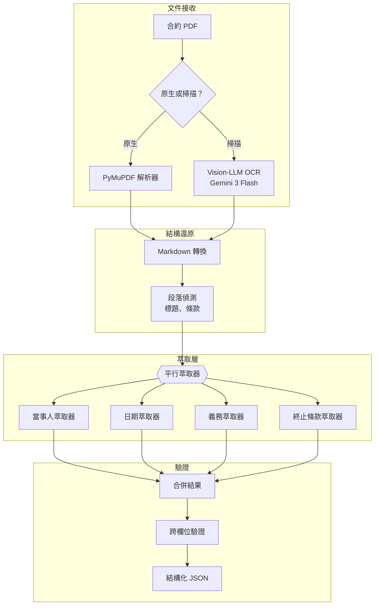
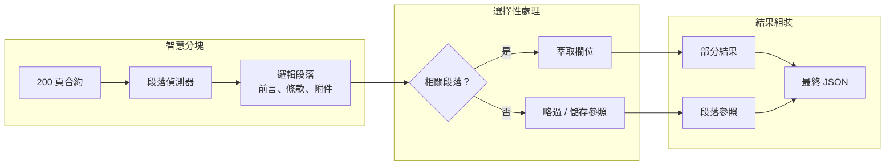

# 案例研究：文件智慧管線

## 問題

一家法律科技公司需要每月處理 **50,000 份合約**，從中萃取關鍵條款（當事人、日期、義務、終止條款），並載入可搜尋的資料庫。

**面試中給定的限制條件：**
- 文件長度介於 2 到 200 頁
- 混合掃描 PDF 與原生數位檔
- 多語言（英文、德文、法文、西班牙文）
- 萃取準確率：關鍵欄位達 95%+
- 成本目標：每份文件低於 $0.50

---

## 面試題目

> 「設計一個管線，輸入一份 100 頁的合約 PDF，把當事人、生效日、終止條件與付款條款等結構化資料萃取成 JSON。」

---

## 解決方案架構



---

## 關鍵設計決策

### 1. 以 Vision-LLM 取代傳統 OCR

**解答：** 掃描合約常有印章、手寫註記與複雜版面（表格、多欄）。傳統 OCR（Tesseract）會產生亂碼輸出。Gemini 3 Flash 能「看見」版面，並產出表格完整保留的乾淨 Markdown。成本較高，但準確率的提升值得這個代價。

| 方法 | 100 頁掃描合約 | 準確率 | 成本 |
|--------|---------------------------|----------|------|
| Tesseract | 雜訊多、表格破碎 | 60% | $0.02 |
| AWS Textract | 較佳，但版面仍有困難 | 75% | $0.15 |
| Gemini 3 Flash | 乾淨 Markdown，表格完整 | 92% | $0.35 |

### 2. 平行萃取器 vs 單次萃取

**解答：** 用單一提示要求所有欄位，效果比專用萃取器差。每個萃取器都有聚焦的提示與 schema：

```python
parties_schema = {
    "type": "object",
    "properties": {
        "party_a": {"type": "object", "properties": {
            "name": {"type": "string"},
            "role": {"type": "string"},
            "address": {"type": "string"}
        }},
        "party_b": {"type": "object", "properties": {...}}
    }
}

# Each extractor runs in parallel
async def extract_all(document: str):
    results = await asyncio.gather(
        extract_parties(document, parties_schema),
        extract_dates(document, dates_schema),
        extract_obligations(document, obligations_schema),
        extract_termination(document, termination_schema)
    )
    return merge_results(results)
```

### 3. 跨欄位驗證

**解答：** 萃取錯誤往往透過不一致性而暴露出來：
- 若 `effective_date` 晚於 `termination_date`，就出了問題
- 若 `party_a` 名稱出現在 `obligations` 中但拼法不同，標記以供審查
- 若萃取到 `payment_amount` 但 `payment_frequency` 為 null，代表不完整

---

## 處理 200 頁文件

上下文視窗的挑戰：



**關鍵洞見：** 並非所有 200 頁都含有可萃取的欄位。附件（隨附的原始文件）以參照方式儲存，不進行處理。「條款與條件」段落常佔文件的 80%，但包含了大多數關鍵欄位。

---

## 多語言處理

德文合約使用的結構與英文不同。我們維護針對各語言的萃取器：

```python
EXTRACTORS = {
    "en": {
        "parties": EnglishPartiesExtractor(),
        "dates": StandardDatesExtractor(),
        "termination": EnglishTerminationExtractor()
    },
    "de": {
        "parties": GermanPartiesExtractor(),  # Handles "GmbH", "AG" patterns
        "dates": GermanDatesExtractor(),       # DD.MM.YYYY format
        "termination": GermanTerminationExtractor()  # "Kündigung" patterns
    }
}
```

---

## 成本拆解

| 階段 | 每份 100 頁文件成本 |
|-------|----------------------|
| OCR（Gemini 3 Flash，若為掃描檔） | $0.18 |
| 段落偵測（GPT-4o-mini） | $0.03 |
| 欄位萃取（4 個平行，GPT-4o-mini） | $0.12 |
| 驗證 | $0.02 |
| **總計（掃描檔）** | **$0.35** |
| **總計（原生 PDF）** | **$0.17** |

平均（60% 原生、40% 掃描）：**每份文件 $0.24**（低於 $0.50 目標）

---

## 面試追問

**問：如果萃取信心度偏低怎麼辦？**

答：我們會為每個欄位輸出一個信心分數。低於 0.8 的欄位會被標記以供人工審查。UI 會顯示一個「審查佇列」，讓人類只驗證不確定的欄位，而非整份文件。這把人工投入降到平均每份文件 30 秒。

**問：你們如何處理版面非標準的合約？**

答：我們維護一個由已知合約範本構成的「版面庫」。段落偵測器會先嘗試比對已知範本。若無法比對，則退而採用啟發式偵測（尋找有編號的段落、全大寫標題等）。未知版面會被標記，並在人工審查後加入版面庫。

**問：那些關鍵條款定義在附件中的合約怎麼辦？**

答：我們會偵測交叉參照（「如 Exhibit A 所定義」）並予以解析。當主文件參照到附件時，萃取提示會納入相關的附件內容。這可避免在答案位於附件中時出現「null」萃取結果。

---

## 面試重點整理

1. **Vision-LLM 在複雜版面上勝過傳統 OCR**（表格、註記）
2. **平行的專用萃取器在結構化萃取上優於單次萃取**
3. **跨欄位驗證能在錯誤進入資料庫前攔截萃取錯誤**
4. **並非所有頁面都需要處理**：偵測相關段落，略過附件

---

*相關章節：[OCR 與版面](../10-document-processing/01-ocr-and-layout.md)、[結構化生成](../05-prompting-and-context/06-structured-generation.md)*
