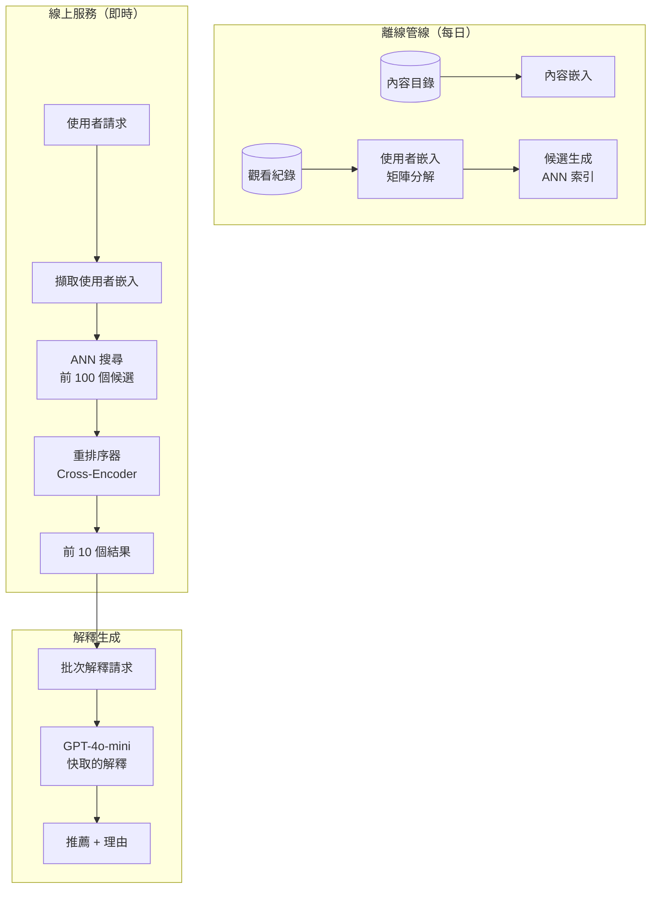
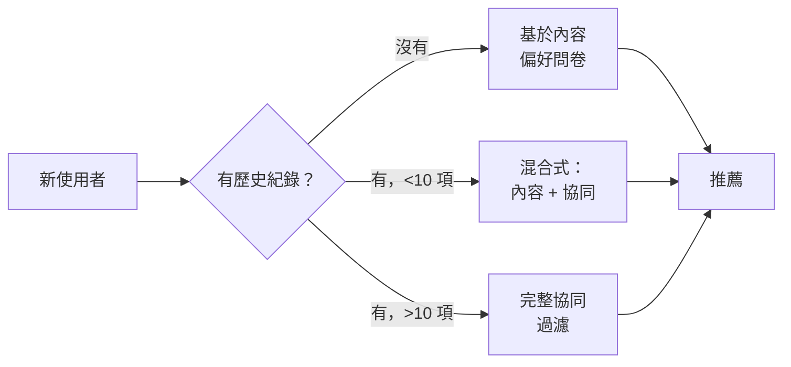

# 案例研究：AI 驅動的推薦引擎

## 問題

一個擁有 **5,000 萬名使用者** 的串流平台，需要打造一套推薦系統，將協同過濾（collaborative filtering）與 LLM 生成的解釋結合在一起：「因為你喜歡《全面啟動》（Inception），你可能會喜歡《天能》（Tenet），因為它有令人燒腦的時間機制。」

**面試中給定的限制條件：**
- 即時推薦（p95 低於 200ms）
- 必須解釋為什麼做出每一項推薦
- 處理新使用者的冷啟動（cold-start）
- 隱私：不可在使用者之間洩漏觀看紀錄
- 每日活躍：500 萬名使用者，每人瀏覽 10 組以上的推薦集

---

## 面試題目

> 「設計一套系統，能在大規模下推薦電影「並且」用自然語言解釋這項推薦。」

---

## 解決方案架構



---

## 關鍵設計決策

### 1. 為什麼不乾脆全部都用 LLM？

**解答：** 規模經濟。為 5,000 萬名使用者 × 每天 10 組推薦集呼叫 LLM，等於每天 5 億次 LLM 呼叫。以每次呼叫 $0.001 計算，那就是每天 $500K。改採以下做法：

| 元件 | 角色 | 每位使用者每日成本 |
|-----------|------|-------------------|
| 嵌入查詢 | 擷取預先計算的向量 | $0.00001 |
| ANN 搜尋 | 找出候選 | $0.0001 |
| Cross-encoder 重排序 | 為前 100 個評分 | $0.001 |
| LLM 解釋 | 自然語言 | $0.005 |
| **總計** | | **$0.006** |

LLM 只用於最後的解釋，而非排序本身。

### 2. 解釋快取

**解答：** 大多數解釋都可以被快取。「因為你看過《全面啟動》」適用於數千名使用者。我們在 (content_pair, reason_type) 這個層級快取解釋：

```python
cache_key = f"{source_movie}:{target_movie}:{reason_type}"
# Example: "inception:tenet:time_mechanics"

explanation = cache.get(cache_key)
if not explanation:
    explanation = generate_explanation(source_movie, target_movie, reason_type)
    cache.set(cache_key, explanation, ttl=86400)
```

快取命中率：暖機後達 85% 以上。

### 3. 冷啟動處理

**解答：** 新使用者沒有可供協同過濾的歷史紀錄。我們採用 **混合式做法（Hybrid Approach）**：



---

## 個人化解釋的挑戰

解釋必須讓人感覺是針對個人的，而不是制式通用的：

**不好的：** 「《天能》是一部熱門驚悚片。」
**好的：** 「因為你喜歡《全面啟動》燒腦的劇情，《天能》提供了同一位導演類似的時間操弄謎題。」

我們透過在提示中納入使用者情境來達成這一點：

```python
prompt = f"""
Generate a 1-sentence explanation for why this user would enjoy {target_movie}.

User context:
- Recently watched: {recent_movies}
- Preferred genres: {genres}
- Dislikes: {dislikes}

Source movie that triggered this recommendation: {source_movie}
Reason category: {reason_type}

Explanation:
"""
```

---

## 延遲預算

| 階段 | 目標 | 實際 p95 |
|-------|--------|------------|
| 使用者嵌入查詢 | 5ms | 3ms |
| ANN 搜尋（前 100） | 20ms | 15ms |
| Cross-encoder 重排序 | 50ms | 45ms |
| LLM 解釋（已快取） | 10ms | 8ms |
| LLM 解釋（未命中） | 500ms | 450ms |
| **總計（快取命中）** | **85ms** | **71ms** |
| **總計（快取未命中）** | **575ms** | **513ms** |

為了達到 200ms p95，我們確保解釋的快取命中率達 95% 以上，並針對新的內容配對非同步地生成解釋。

---

## 面試延伸問題

**Q：你如何防止 LLM 對電影捏造（hallucinating）事實？**

A：LLM 會收到每部電影的結構化事實表（導演、卡司、主題、獎項）作為情境。它只能使用這份表單上的資訊。我們還有一個生成後驗證器，會比對我們目錄的中繼資料（metadata）來檢查各項聲明。

**Q：如果某位使用者的口味快速改變怎麼辦？**

A：我們採用 **近期加權嵌入更新（recency-weighted embedding update）**。近期的觀看會比舊的加權 3 倍。為了即時反應，我們維護一個「工作階段嵌入（session embedding）」，用以捕捉當前工作階段的行為，並將它與歷史嵌入混合。

**Q：你如何對推薦演算法進行 A/B 測試？**

A：我們對 user_id 做雜湊（hash），以一致的方式將使用者分配到實驗分組。每個分組可以有不同的候選生成、排序或解釋策略。我們依分組追蹤互動指標（點擊率、觀看時間、跳過率）。

---

## 面試重點整理

1. **LLM 用於解釋，而非排序**：以傳統 ML 應付規模，以 LLM 處理個人化
2. **積極快取**：內容配對的解釋可在使用者之間重複使用
3. **冷啟動是一個光譜**：新使用者 → 基於內容；有部分歷史 → 混合式；完整歷史 → 協同過濾
4. **延遲預算需要快取命中率目標**：圍繞你的延遲 SLA 來設計快取

---

*相關章節：[語意快取](../08-memory-and-state/05-semantic-caching.md)、[成本最佳化](../04-inference-optimization/07-cost-optimization-playbook.md)*
