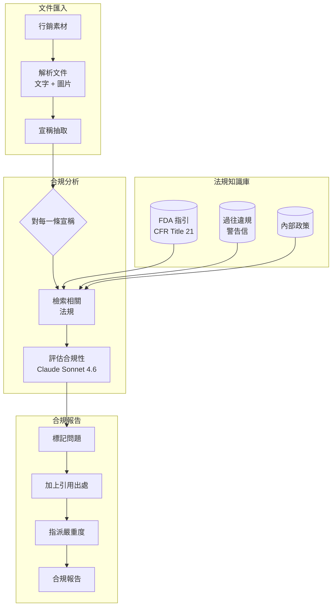
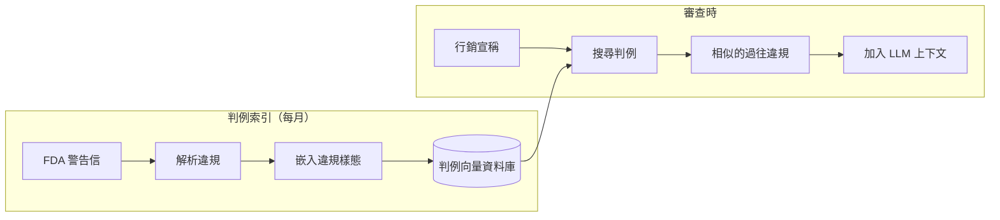
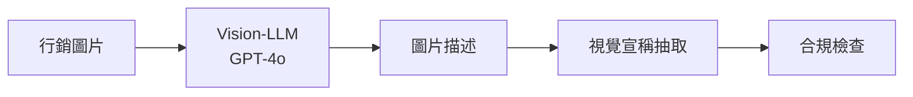

# 案例研究：法規合規自動化

## 問題

一家製藥公司必須確保所有行銷素材都符合 **FDA 法規**。目前每份素材的法務審查需要 2 週。他們希望用 AI 預先篩查素材並標記問題，把法務審查縮短到 2 天。

**面試中給定的限制條件：**
- 必須引用特定的法規條款，而不只是「這看起來不對」
- 偽陰性（漏掉的違規）是不可接受的
- 偽陽性（過度標記）應低於 20%
- 每月 500 份行銷素材
- 需要稽核軌跡以供法規檢查

---

## 面試題目

> 「設計一套系統，審查製藥行銷素材，並以引用出處的方式找出特定的法規違規。」

---

## 解決方案架構



---

## 關鍵設計決策

### 1. 合規檢查前先做宣稱抽取

**解答：** 行銷素材內容密集。把整份文件拿去對照法規效率很差。我們先抽取出個別的**宣稱**：

```python
claims = extract_claims(document)
# Example output:
# [
#   {"text": "Reduces symptoms by 80%", "type": "efficacy", "location": "page 2, para 3"},
#   {"text": "No side effects reported", "type": "safety", "location": "page 3, header"},
#   {"text": "Recommended by doctors", "type": "endorsement", "location": "page 1, image"}
# ]
```

接著每一條宣稱都會獨立地對照相關法規進行檢查。

### 2. 為什麼法規用 RAG 而非微調？

**解答：** 法規會變動。FDA 每月更新指引文件。微調會需要在每次更新後重新訓練。RAG 讓我們能夠：
- 在新指引發布時立即更新法規索引
- 追蹤每次審查使用的是哪個版本的法規（稽核軌跡）
- 向法務審查人員展示確切的來源段落

### 3. 保守的標記策略

**解答：** 偽陰性（漏掉的違規）是災難性的；偽陽性（額外審查）只是花費時間而已。我們採用一套**門檻層級**：

| 信心度 | 行動 |
|------------|--------|
| >90% 違規 | 標記為 HIGH 嚴重度 |
| 70-90% 可能違規 | 標記為 MEDIUM，引用疑慮 |
| 50-70% 不明確 | 標記為 LOW，註記模稜兩可之處 |
| <50% 可能合規 | 不標記，但記錄以供稽核 |

我們從不在未記錄推理過程的情況下輸出「合規」。

---

## 判例資料庫

法規往往模稜兩可。過往的 FDA 警告信能釐清規則實際上是如何執行的：



**為什麼這很重要：** 像「臨床證實」這樣的宣稱，光看法規本身可能覺得沒問題。但如果我們找到 5 封警告信，當中 FDA 都因為公司在沒有具體試驗數據的情況下使用「臨床證實」而提出指正，那就是一個警訊。

---

## 稽核軌跡需求

每一個決策都必須可追溯：

```python
compliance_decision = {
    "claim_id": "claim_003",
    "claim_text": "No side effects reported",
    "decision": "VIOLATION",
    "severity": "HIGH",
    "regulation_cited": "21 CFR 202.1(e)(5)",
    "regulation_text": "Advertisements shall not contain claims that...",
    "precedent_cited": "Warning Letter 2023-FDA-04521",
    "reasoning": "Claim implies absolute safety, which contradicts...",
    "model_used": "claude-3-7-sonnet-20251022",
    "timestamp": "2025-12-21T10:30:00Z",
    "reviewer_id": null,  # Filled when human reviews
    "final_decision": null  # Filled after legal review
}
```

---

## 處理圖片與影片

製藥行銷包含視覺上的宣稱（開心的病患、前後對比的圖片）：



**範例：** 一張顯示病患在跑步的圖片暗示了療效。如果該藥物是治療關節炎的，我們就要檢查臨床試驗是否支持「改善行動力」的宣稱。

---

## 成本分析

| 階段 | 每份素材成本 |
|-------|----------------|
| 文件解析 | $0.05 |
| 宣稱抽取 | $0.15 |
| 法規檢索 | $0.02 |
| 合規評估（每條宣稱，平均 12 條） | $1.80 |
| 圖片分析（平均 5 張圖片） | $0.75 |
| 報告生成 | $0.10 |
| **總計** | **$2.87** |

以每月 500 份素材計算：**每月 $1,435**（相較於同等法務工時的每月 $50K 以上）

---

## 面試追問

**問：法規需要人類判斷時，你怎麼處理？**

答：我們不取代人類；我們做分流。系統會以信心分數來標記問題。低信心的標記交給資深法律顧問。高信心且明確無虞的項目則略過詳細審查。這把原本 2 週的審查縮短到 2 天，方法是讓人類的注意力聚焦在邊界案例上。

**問：如果 FDA 在月中更新了某條法規怎麼辦？**

答：我們有一個「Regulation Watch」服務，會監控 FDA 的 RSS feed 與 Federal Register 更新。當偵測到相關更新時，我們會重新建立索引，並標記任何可能受該變動影響的近期審查。

**問：稽核時你如何向監管機關解釋 AI 的推理？**

答：每一個決策都包含完整的推理鏈：抽取出的宣稱、檢索到的法規、引用的判例，以及模型的評估。我們可以向監管機關精確展示某個決策為何如此判定，並附上所有元件的版本號。

---

## 面試重點整理

1. **先做宣稱抽取**：把複雜文件拆解成可審查的單元
2. **判例資料庫勝過純法規文字**：規則實際如何被執行才是重點
3. **高風險領域採用保守門檻**：優化召回率，而非精確率
4. **稽核軌跡就是架構**：從第一天起就為可解釋性而設計

---

*相關章節：[RAG 基礎](../06-retrieval-systems/01-rag-fundamentals.md)、[防護機制實作](../13-reliability-and-safety/01-guardrails.md)*
