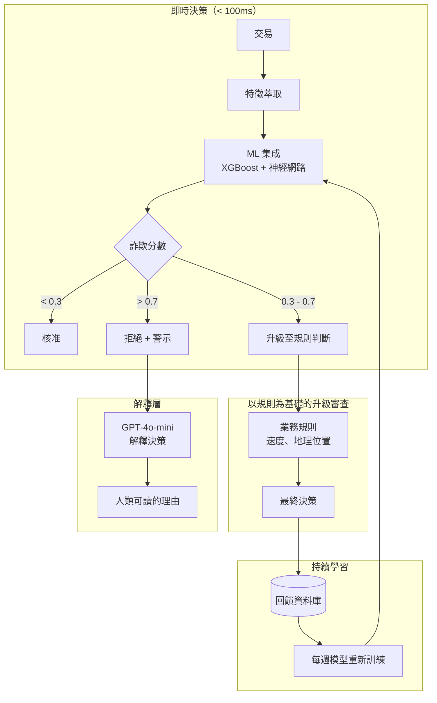
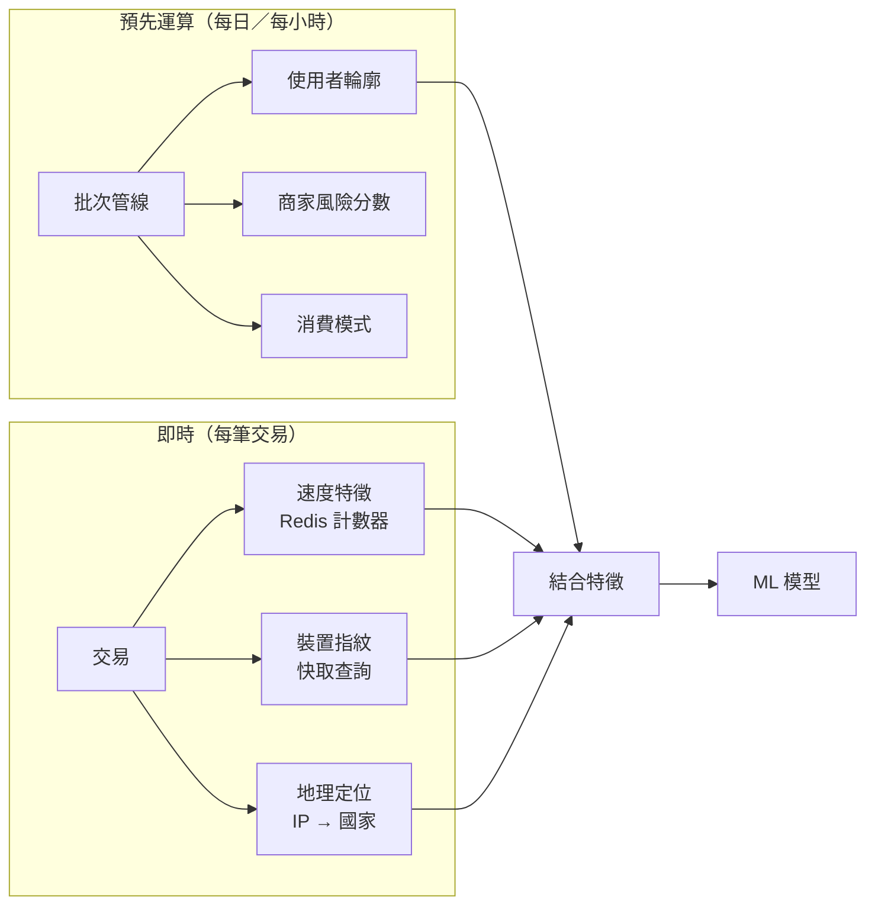
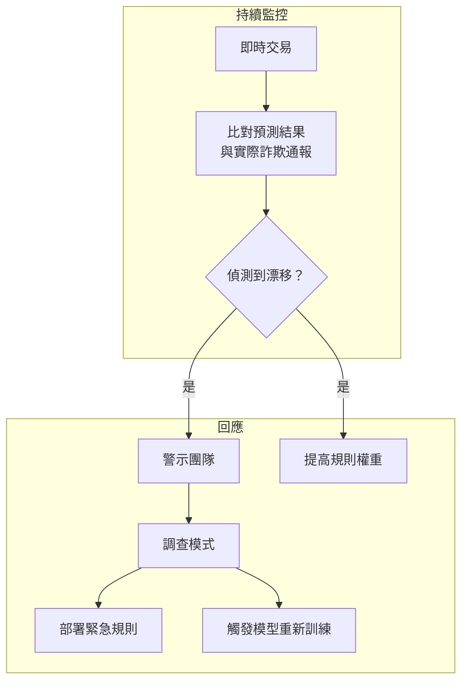

# 案例研究：即時詐欺偵測

## 問題

一家支付處理商每天處理 **1,000 萬筆交易**。他們需要即時偵測詐欺交易，在交易完成前加以攔截，同時盡量降低會讓正當客戶感到困擾的誤報率。

**面試中給定的限制條件：**
- 決策延遲：低於 100ms
- 誤報率：低於 0.1%（千分之一）
- 必須能解釋為何某筆交易被標記
- 法規要求保留 7 年的稽核軌跡
- 詐欺手法持續不斷演變

---

## 面試題目

> 「設計一套系統，在 100ms 內決定要核准、拒絕，還是升級審查一筆信用卡交易，並且能夠解釋該決策。」

---

## 解決方案架構



---

## 關鍵設計決策

### 1. 為什麼用 ML + 規則，而不是只用 ML？

**解答：** 純 ML 模型是黑盒子。監理機關要求對爭議交易提供可解釋的決策。我們用 ML 來評分，接著套用透明的規則來做出最終決策：

| 層級 | 角色 | 速度 | 可解釋性 |
|-------|------|-------|----------------|
| ML 集成 | 捕捉複雜的模式 | 10ms | 低 |
| 業務規則 | 編碼已知的詐欺類型 | 5ms | 高 |
| 兩者結合 | 兼具雙方優點 | 15ms | 中高 |

規則範例：「若在 1 小時內出現 5 筆以上來自不同國家的交易則加以攔截」對監理機關來說是可解釋的。

### 2. 三向決策：核准／升級審查／拒絕

**解答：** 二元的核准／拒絕太過粗糙。「灰色地帶」（0.3 至 0.7 分）會交由以規則為基礎的升級審查，或對高價值交易進行人工審查：

```python
def decide(transaction, fraud_score):
    if fraud_score < 0.3:
        return "APPROVE", None
    elif fraud_score > 0.7:
        reason = explain_rejection(transaction, fraud_score)
        return "REJECT", reason
    else:
        # Gray zone: apply business rules
        if check_velocity_rules(transaction):
            return "REJECT", "Velocity limit exceeded"
        if check_geography_rules(transaction):
            return "ESCALATE", "Unusual location"
        return "APPROVE", None
```

### 3. 為什麼用 LLM 來做解釋，而不是 SHAP/LIME？

**解答：** SHAP 值會告訴你「特徵 X 對分數貢獻了 0.3」。客戶和監理機關想要的是「這筆交易之所以被標記，是因為它來自一台新裝置、發生在一個你從未造訪過的國家，且金額是你平常消費的 10 倍。」

我們以特徵重要性作為輸入，產生自然語言的解釋：

```python
prompt = f"""
Explain why this transaction was flagged as potentially fraudulent.

Transaction details:
- Amount: ${amount}
- Merchant: {merchant}
- Location: {location}
- Device: {device}

Top contributing factors:
1. {factors[0]['feature']}: {factors[0]['contribution']}
2. {factors[1]['feature']}: {factors[1]['contribution']}
3. {factors[2]['feature']}: {factors[2]['contribution']}

Write a 2-sentence explanation for the cardholder.
"""
```

---

## 為了速度而做的特徵工程

100ms 的預算意味著特徵必須事先運算好：



**關鍵洞見：** 使用者輪廓（平均消費、慣用商家、居住地理位置）是離線運算的。即時階段只會加上交易專屬的特徵。

---

## 處理持續演變的詐欺手法

詐欺者會適應變化。上個月的模型抓不到這個月的攻擊手法。



**緊急規則**可在幾分鐘內部署完成（只需更新組態）。模型重新訓練需要數天，但能捕捉到更細微的模式。

---

## 面試延伸問題

**問：你如何處理模型延遲的突增？**

答：我們有一套**備援堆疊**。如果 ML 模型在 50ms 內沒有回應，我們就退回到只用規則評分。這些規則涵蓋了最常見的詐欺手法。我們也針對低於 $10 的交易設有「預設核准」機制，以因應所有系統都變慢的情況。

**問：那協同式的詐欺攻擊呢？**

答：我們維護全域速度計數器（不只是針對個別使用者）。如果我們看到 1 分鐘內有 100 筆來自不同卡片、流向同一個冷門商家的交易，即使個別交易看起來都很乾淨，也會觸發商家層級的攔截。

**問：你如何在防詐與客戶體驗之間取得平衡？**

答：我們追蹤「冒犯率」（insult rate）：被攔截的正當客戶所佔的百分比。每個產品團隊都有一份冒犯預算。如果詐欺模型的冒犯率超出預算，我們會自動放寬門檻並警示團隊。寧可多接受一點詐欺，也不要惹惱忠誠的客戶。

---

## 面試重點整理

1. **以 ML 評分、以規則做解釋**：在受監理的領域中兩者並用
2. **三向決策可降低誤報**：灰色地帶會受到額外審視
3. **盡可能預先運算一切**：即時預算只留給特徵結合使用
4. **持續重新訓練至關重要**：詐欺手法每週都在演變

---

*相關章節：[評估與可觀測性](../14-evaluation-and-observability/)、[可靠性模式](../13-reliability-and-safety/03-reliability-patterns.md)*
