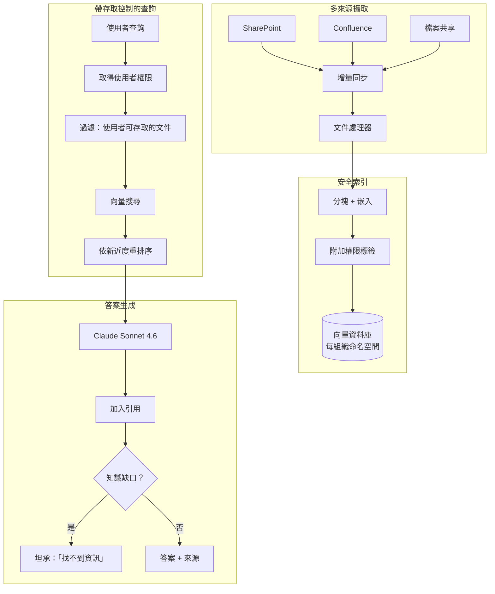
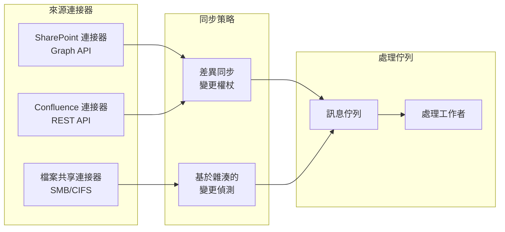

# 案例研究：企業知識管理

## 問題

一家擁有 **10,000 名員工** 的顧問公司，數十年累積的專案報告、方法論文件與專業知識散落在 SharePoint、Confluence 與檔案共享之間。他們想要一套 AI 系統，讓顧問可以詢問「我們過去是如何為汽車產業客戶處理供應鏈最佳化的？」並從內部知識中綜合出答案。

**面試中給定的限制條件：**
- 橫跨 15 個資料來源、共 200 萬份文件
- 存取控制：助理級人員不能看到合夥人層級的內容
- 每一項主張都必須引用來源
- 過時資料的處理：舊的方法論不應蓋過新的方法論
- 知識缺口應被指出，而不是被捏造（幻覺）

---

## 面試題目

> 「設計一套內部知識助理，讓資淺顧問可以提問，並且只根據他被授權檢視的文件得到答案。」

---

## 解決方案架構



---

## 關鍵設計決策

### 1. 權限感知的檢索

**解答：** 每個區塊都從來源系統帶著它的權限中繼資料：

```python
chunk = {
    "content": "Our approach to automotive supply chain...",
    "source": "sharepoint://projects/acme-motors/final-report.docx",
    "permissions": {
        "read_groups": ["partners", "managers", "automotive-team"],
        "classification": "confidential"
    },
    "last_modified": "2024-03-15",
    "author": "jane.doe@firm.com"
}
```

在查詢時，我們在檢索之前就先過濾：

```python
def search(query: str, user: User):
    user_groups = get_user_groups(user.id)
    
    return vector_db.search(
        query=query,
        filter={
            "permissions.read_groups": {"$in": user_groups}
        }
    )
```

### 2. 新近度加權的排序

**解答：** 對於同一個主題，2024 年的方法論文件應該排得比 2019 年的更前面。我們使用一個 **衰減函式**：

```python
def recency_boost(doc_date):
    age_days = (today - doc_date).days
    # Half-life of 365 days
    return 0.5 ** (age_days / 365)

final_score = semantic_score * 0.7 + recency_boost(doc.date) * 0.3
```

這可避免過時的做法淹沒當前的指引。

### 3. 知識缺口偵測

**解答：** 我們必須區分「我什麼都沒找到」與「我在捏造東西」：

```python
def generate_answer(query: str, retrieved_docs: list):
    if len(retrieved_docs) == 0 or max_relevance_score < 0.5:
        return {
            "answer": "I could not find relevant information in our knowledge base for this query.",
            "confidence": "low",
            "suggestion": "Try contacting the Automotive Practice lead directly."
        }
    
    # Generate from retrieved content
    answer = llm.generate(query, context=retrieved_docs)
    return {"answer": answer, "confidence": "high", "sources": [d.source for d in retrieved_docs]}
```

---

## 多來源同步



**關鍵洞見：** SharePoint 與 Confluence 支援變更權杖（差異同步）。檔案共享則需要雜湊比對。兩者都餵入同一個統一的處理佇列。

---

## 處理相互衝突的資訊

不同文件之間可能有相互衝突的指引。我們會把它呈現出來：

```python
def detect_conflicts(retrieved_docs):
    # Group by topic
    topics = cluster_by_topic(retrieved_docs)
    
    for topic, docs in topics.items():
        if has_contradictions(docs):
            return {
                "warning": "Found conflicting guidance",
                "perspectives": [
                    {"source": d.source, "date": d.date, "view": summarize(d)}
                    for d in docs
                ],
                "recommendation": "Defer to most recent document or consult practice lead."
            }
```

---

## 成本分析

| 元件 | 每月成本 |
|-----------|--------------|
| 嵌入（200 萬份文件 × 更新） | $500 |
| 向量資料庫（Pinecone Enterprise） | $2,000 |
| LLM 生成（5 萬次查詢） | $3,000 |
| 同步基礎設施（連接器） | $500 |
| **總計** | **$6,000/月** |

ROI：顧問平均每週省下 2 小時的資訊搜尋時間。以 10,000 名顧問 × $100/小時 × 2 小時 × 4 週計算，等於每月 $8M 的生產力。系統的投資報酬是其成本的 1,300 倍。

---

## 面試延伸追問

**問：權限混合的文件你怎麼處理？**

答：我們在章節層級進行分塊，而每個章節會從它的上層繼承最嚴格的權限。在一份原本屬於「內部」的文件中，位於「機密」章節內的一個段落，會被標記為「機密」。

**問：那即時協作文件（Google Docs、即時 Confluence 頁面）呢？**

答：我們有一條獨立的「即時文件」管線，採用更頻繁的同步（每 5 分鐘一次，相較於靜態檔案的每日一次）。這些文件在被定稿之前，會在搜尋結果中被標記為「草稿」。

**問：你如何防止這套系統變成未授權資料的漏洞抽象層（leaky abstraction）？**

答：我們絕不把未授權的內容放進 LLM 的上下文，即使只是為了說「我不能讓你看這個」也不行。系統的行為就如同那些未授權的文件根本不存在。這能防止推論攻擊，也就是使用者透過試探「你有沒有關於 X 的資訊？」來推測出機密專案是否存在。

---

## 面試重點整理

1. **權限必須在檢索時強制執行，而非在生成時**：在 LLM 看到內容之前就先過濾
2. **新近度加權可避免過時知識**：舊文件的相關性會隨時間衰減
3. **坦承缺口，而非產生幻覺**：信心門檻與後備訊息機制
4. **多來源同步很複雜**：不同的 API 需要不同的策略

---

*相關章節：[RAG 基礎](../06-retrieval-systems/01-rag-fundamentals.md)、[多租戶隔離](../12-security-and-access/02-access-control.md)*
