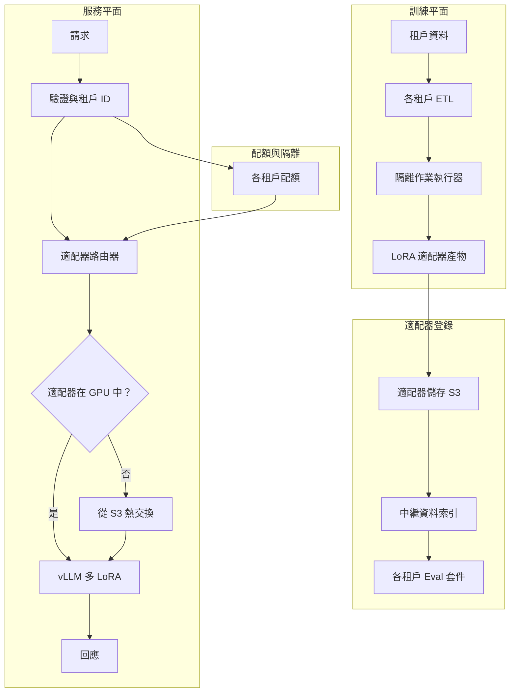
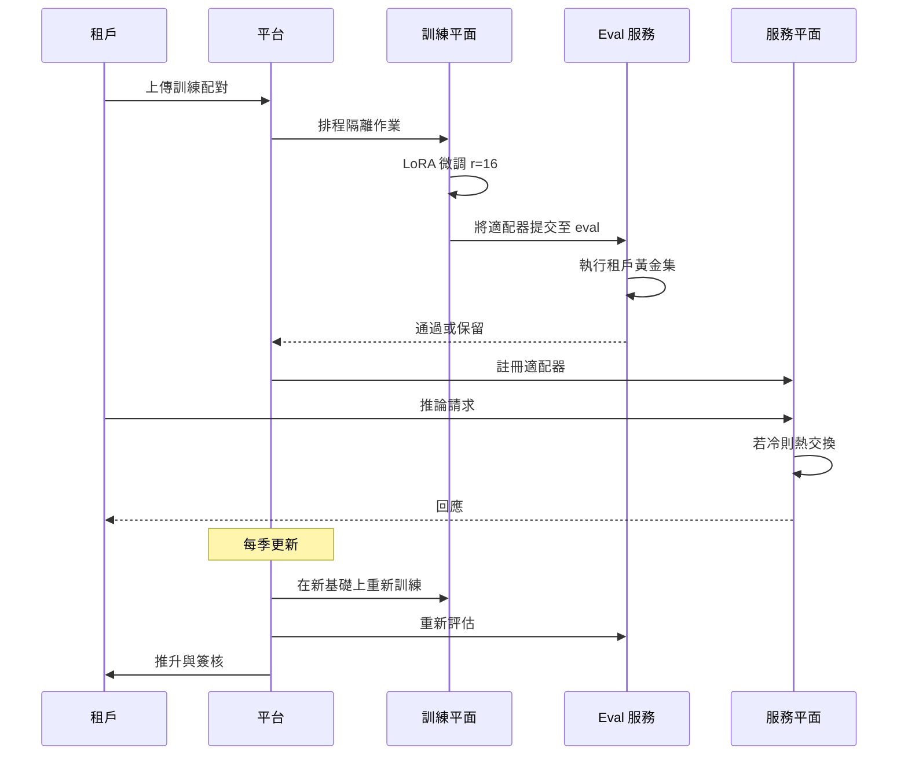

# 案例研究：多租戶微調平台

某垂直 AI 廠商以單一基礎模型搭配各租戶專屬的 LoRA 適配器服務 280 家客戶，具備隔離訓練、各租戶 eval-as-PRD，以及讓 p99 延遲維持在 1.2 秒以下的吵鬧鄰居（noisy-neighbor）緩解機制。

## 業務問題

一家法律科技領域的垂直 SaaS 廠商經營合約分析產品。它的 280 家企業客戶每一家都期望模型遵循自家的範本、自家的判例語料庫，以及自家偏好的草擬風格。現成的提示工程並不足夠：客戶會針對通用模型進行盲測 A/B test，一旦輸出偏離自家風格就拒絕採用產品。為每個租戶各訓練一個獨立的微調模型同樣不可行：在 70B 參數下，每個模型在磁碟上佔 140 GB，且服務時需要一張專屬的 H100，會徹底破壞單位經濟效益。

來自 2026 年 5 月現實的限制：

- 280 家付費租戶，每年翻倍
- 每個租戶有 1,000 到 250,000 組歷史合約配對（輸入加上偏好的修訂）
- 租戶要求 eval 報告，以證明模型在自家測試集上的契合度
- 每次查詢的延遲預算：p99 在 1.2 秒以下
- 租戶分屬不同的合規制度：SOC 2、ISO 27001、HIPAA、FedRAMP Moderate

團隊選擇在共享基礎模型上採用各租戶專屬的 LoRA 適配器。LoRA（[Hu et al., 2021](https://arxiv.org/abs/2106.09685)）與 QLoRA（[Dettmers et al., 2023](https://arxiv.org/abs/2305.14314)）已相當成熟；vLLM 的多 LoRA 服務（[docs](https://docs.vllm.ai/en/latest/models/lora.html)）與 SGLang 的適配器交換，讓眾多適配器在 GPU 記憶體中共享一個基礎模型。Anyscale 與 Together AI 都發表過此模式的生產環境案例研究（[Anyscale 2024 貼文](https://www.anyscale.com/blog/fine-tuning-llms-lora-or-full-parameter-an-in-depth-analysis)、[Together AI 多 LoRA 服務](https://www.together.ai/blog/multi-lora-inference)）。

## 架構

### 元件

| 層 | 技術 | 用途 |
|-------|------|---------|
| 基礎模型 | Llama 4 70B int8 | 所有租戶共享 |
| 適配器 | 注意力層上 LoRA r=16，每租戶約 120 MB | 各租戶專屬適配 |
| 訓練 | 8x H100 節點上的 DeepSpeed ZeRO-3 | 租戶隔離作業 |
| 服務 | 搭配 PagedAttention 與多 LoRA 的 vLLM 0.7+ | 一個基礎、多個適配器 |
| 適配器儲存 | 搭配各租戶 KMS 金鑰的 S3 | 靜態加密 |
| Eval 儲存 | 各租戶黃金集，每次重訓都執行 | 各租戶 eval-as-PRD |

### 訓練時的資料流

1. 客戶透過具備專屬 IAM 角色的各租戶 S3 bucket 上傳訓練配對；KMS 金鑰為各租戶專屬。
2. ETL 作業在以該租戶為範圍的 Kubernetes namespace 中執行；node selector 確保它不會與另一個租戶的作業共同排程。
3. 訓練在 8x H100 pod 上執行，每個租戶通常需 4 到 10 小時；r=16 的 LoRA 可塞進每張 H100 的 80 GB，並為激活記憶體留有餘裕。
4. Eval 會自動針對該租戶的黃金集執行；如果指標退化超過門檻，產物會被保留在 staging。
5. 適配器產物（70B 基礎搭配 r=16 注意力適配器約 120 MB）被上傳至登錄，並更新中繼資料索引。

### 服務時的資料流

1. 請求帶著租戶 JWT 抵達閘道。
2. 路由器解析該租戶的適配器版本。
3. 如果適配器在 GPU 記憶體中是熱的（每節點 200 個適配器的 LRU 快取），推論即進行。
4. 如果是冷的，適配器會在 200 到 600 ms 內從 S3 熱交換進來。我們依租戶流量模式進行預熱以隱藏此延遲。
5. vLLM 套用該適配器執行請求；PagedAttention 安全地在租戶間共享 KV cache，因為 KV 是以請求為範圍、而非以適配器為範圍。

## 關鍵設計決策

### 1. LoRA r=16 而非完整微調

為每個租戶做完整 70B 微調，運算成本約 $4,500，產出 140 GB 產物，並佔死一張 H100。r=16 的 LoRA 每租戶每次重訓成本為 $80 到 $400，產出 120 MB 產物，且共享 GPU。在我們內部合約分析 eval 上的準確度差距，在 100 分的綜合分數上為 1.6 分。我們接受這個差距，因為成本差異達 50 倍，且維運故事（熱交換、短暫存活的產物）大幅簡化。上面連結的 Anyscale 貼文做過類似的比較，並得出相同結論。

### 2. 適配器交換預算與吵鬧鄰居問題

vLLM 的多 LoRA 支援會把適配器保留在 GPU 記憶體中，但每個適配器消耗數百 MB。在一張以 int8 執行 70B 基礎（約 40 GB）的 80 GB H100 上，我們大約有 30 GB 留給適配器與 KV cache。這大致可編列同時駐留約 200 個適配器的預算。我們採用搭配流量感知預熱與長尾租戶釘選（tail-tenant pinning）的 LRU：30 家有嚴格延遲 SLA 的租戶被釘選且永不逐出；其餘則輪替。適配器處於冷狀態的租戶會付出 200 到 600 ms 的長尾代價。我們在租戶 SLA 中明確將其揭露為冷啟動預算。

吵鬧鄰居故障：某個租戶突然爆量到正常流量的 10 倍，把其他適配器擠出快取。緩解措施：在閘道對各租戶採用 token-bucket 速率限制，外加對任何在過去 60 秒內服務過流量的適配器提供動態適配器逐出保護。

### 3. 各租戶 eval 套件作為閘門

我們把租戶的黃金集當作產品需求文件（PRD）。訓練管線在每次重訓後，會以新適配器針對該集合執行；如果在綜合分數上退化超過 2 分，產物會被保留，並向該租戶的 CSM 發出 Slack 通知。這就是 Hamel Husain 寫過的「eval-as-PRD」模式（[How to construct domain-specific evals](https://hamel.dev/blog/posts/evals/)），而我們將其延伸為各租戶專屬。每個租戶的黃金集是在導入期間（一場 60 到 90 分鐘的工作坊）與其法務團隊共同策劃，並每季更新。

### 4. 透過 Kubernetes namespace 加上網路政策達成訓練時隔離

多租戶是一個縱深防禦問題。訓練作業在各租戶專屬的 namespace 中執行；網路政策禁止對該租戶 S3 前綴與中央指標服務以外的任何目的地進行 egress；node selector 防止共同排程。我們也為每個租戶使用專屬的 KMS 金鑰，同時用於 bucket 加密與模型產物加密。一把外洩的產物解密金鑰只會暴露一個租戶，而非全部。

### 5. 服務時隔離：共享 GPU 沒問題，KV cache 不行

基礎模型是共享的。適配器是各租戶專屬的。KV cache 是各請求專屬的。PagedAttention（[vLLM 論文](https://arxiv.org/abs/2309.06180)）確保 KV 區塊以請求為單位隔離，因此即使租戶 A 與租戶 B 在單一推論批次中共享一張 GPU，它們的注意力計算與 KV 狀態也不會混合。我們以紅隊提示審計過這一點：在 5 萬組對抗配對中沒有跨租戶外洩。

### 6. 模型生命週期與基礎模型更新

基礎模型每 6 到 9 個月升級一次。升級發生時，所有適配器都必須針對新基礎重新訓練。我們使用各租戶儲存的訓練資料自動執行重訓；執行其 eval 套件；並在推升前請租戶簽核。完整的基礎更新週期，在 4 個專屬訓練節點上為 280 個租戶處理約需 3 週；我們會公開分享排程。未通過 eval 的適配器會被標記交由人工審查，而先前的「基礎加適配器」配對會持續在服務中，直到問題解決為止。

### 7. 為什麼偏偏是 r=16

草率地閱讀 LoRA 論文會讓人以為 r=4 或 r=8 是標準選擇。我們在自家領域做了掃描：r=4 在訓練配對超過 5 萬組的租戶上欠擬合；r=8 尚可接受；r=16 擷取了從升到 r=32 所能獲得增益的 95%。r=32 讓產物大小與訓練成本翻倍，換來的指標卻不到 1 分。我們在注意力層（Q、K、V、O）上標準化為 r=16，並略過 MLP 層。這正是 [Anyscale 貼文](https://www.anyscale.com/blog/fine-tuning-llms-lora-or-full-parameter-an-in-depth-analysis)為類似工作負載所建議的相同配置。

### 8. 冷啟動工程

從 S3 熱交換在冷狀態下需 200 到 600 ms。我們以流量感知預熱來隱藏這點：一個 sidecar 程序讀取租戶過去 60 分鐘的流量，並在每分鐘的邊界預載前 50 個冷適配器。針對長尾延遲衡量的預熱命中率為 78%；剩餘的冷未命中通常是新租戶，或從閒置返回的租戶，這兩者被懲罰都可以接受。

## 租戶生命週期序列

## 故障模式與緩解措施

### F1：重訓後適配器品質退化

某次重訓在租戶的黃金集上產出比前一版更差的模型。緩解措施：eval 閘門阻擋推升；前一版適配器維持上線；向團隊與租戶發出警報。我們為每個租戶保留前 3 個適配器版本以供回滾。回滾中位時間：6 分鐘。

### F2：訓練時跨租戶資料外溢

ETL 管線中的某個 bug 從錯誤租戶的 S3 bucket 讀取。緩解措施：IAM 角色按租戶設範圍；訓練作業在啟動時承接該租戶的角色，且對其他 bucket 沒有任何憑證。一項回歸測試驗證以租戶 A 角色執行的作業無法列出租戶 B 的 bucket；它在每次 CI 建置時執行。

### F3：流量尖峰下的適配器快取抖動

一場展會驅使 30 個租戶同時尖峰，逐出大多數其他適配器。p99 延遲從 1.1 秒飆升到 4.8 秒。緩解措施：閘道對每個租戶限速；快取為頂層租戶使用釘選槽位；我們保留 20% 的快取容量作為儲備。當行事曆上有已知活動時，我們會在離峰時段預熱。

### F4：不良訓練資料毒化適配器

某個租戶不慎上傳了含有客戶 PII，或來自錯誤司法管轄區的合約。適配器對不良模式過擬合。緩解措施：訓練前對輸入執行自動化 PII 偵測器；eval 套件捕捉司法管轄區特定案例上的漂移；租戶可在啟動重訓前，於儀表板中抽樣檢視自己的訓練集。

### F5：基礎模型升級破壞舊有適配器

新基礎模型有不同的 tokenizer 或層命名，而適配器的矩陣形狀不再適用。緩解措施：每次基礎升級都被視為強制重訓。我們絕不讓適配器針對它未曾受訓的基礎進行服務。服務平面中的一道防護會拒絕載入沒有相符基礎版本的適配器。

### F6：訓練平面的成本失控

一個配置錯誤的作業在某個訓練步驟中迴圈，消耗了 80 H100 小時卻未產出任何 checkpoint。緩解措施：各租戶每月訓練預算；每作業逾時（24 小時硬上限）；一個 watchdog，當偵測到 loss 停滯超過 2 小時就呼叫 SRE。在過去 6 個月中我們已中止 14 個這類作業。

### F7：訓練中途 GPU 節點故障

8 張 H100 其中之一在訓練中途的硬體故障使作業崩潰。緩解措施：DeepSpeed 每 30 分鐘做 checkpoint；在全新節點上自動恢復；我們維持一個小型的溫熱備援節點儲備池。平均復原時間：18 分鐘。作業層級重試預算：3 次嘗試後通報人類。

### F8：適配器簽章金鑰輪替破壞舊有客戶端

我們對適配器 manifest 簽章以偵測竄改。未經協調就輪替簽章金鑰會破壞服務平面的驗證步驟。緩解措施：在輪替視窗期間雙重簽章；客戶端在 7 天內可接受舊金鑰或新金鑰；唯有在所有客戶端都以新金鑰驗證後，我們才淘汰舊金鑰。

### F9：透過共享 eval 基礎設施造成租戶交叉污染

eval 執行器不慎把 eval 結果寫到錯誤租戶的指標 bucket。緩解措施：eval 結果發布採用各租戶專屬憑證；一項寫入時的租戶 ID 檢查驗證目的地與執行中作業的租戶相符；不相符就拒絕寫入並發出警報。

### F10：適配器版本氾濫

歷經 3 年與 280 個租戶後，我們在登錄中有超過 10,000 個適配器版本。儲存很便宜，但中繼資料服務不堪負荷。緩解措施：分層儲存，舊版本在 90 天後自動封存至冷儲存；中繼資料服務只索引每個租戶的當前版本加上前 3 個版本；冷封存取回在回滾情境下有 1 分鐘的 SLA。

### F11：服務載入時適配器 checksum 不符

S3 熱交換期間的網路瞬斷使適配器位元組毀損；vLLM 載入了它，但推論產出無意義的結果。緩解措施：每個適配器在中繼資料中都有一個 SHA-256 checksum；服務平面在載入時驗證 checksum，並拒絕服務不相符的適配器；一則警報呼叫 SRE，且該載入會被重試。

## 維運考量

### 監控與 SLO

| SLO | 目標 | 我們衡量的內容 |
|-----|--------|-----------------|
| 服務 p99 延遲 | 暖快取下 1.2 秒以下 | 任何時刻有 95% 的租戶處於暖快取 |
| 冷啟動 p99 | 額外 1.0 秒以下 | 適配器 S3 載入時間 |
| 訓練作業成功率 | 98% 以上 | 抵達適配器推升的作業 |
| Eval 閘門通過率 | 90% 以上 | 通過租戶黃金集的適配器 |
| 跨租戶審計發現項 | 0 | 自動化的每季紅隊演練 |

### 成本模型

在我們混合流量下的各租戶經濟效益：

- 訓練：每次重訓 $80 到 $400；每季更新
- 服務：共享 GPU；每 token 成本為每百萬輸入 $0.18、每百萬輸出 $0.36（在 Llama 4 上接近廠商對等水準）
- 適配器儲存：在 120 MB 下每租戶每月 $0.04
- Eval：每次重訓 $5
- 每租戶總計：每季 $80 到 $800，視流量而定

在 280 個租戶下，每月運算成本約為 $180K，對應毛收入 $720K，符合 75% 毛利率的計畫。

### 待命手冊

- 跨多租戶的 p99 尖峰：檢查適配器快取命中率；若偏低，限制爆量租戶並預熱熱集。
- 單一租戶退化警報：檢查 eval 差異；若屬實，回滾至前一版適配器；通知 CSM。
- 訓練佇列積壓：擴增訓練節點（我們保留 2 台待命）；若持續，通報平台團隊進行容量規劃。
- 訓練作業卡住：檢查 checkpoint 時間戳；若 2 小時內無進展，終止並從最後一個 checkpoint 恢復；loss 曲線異常可能代表不良資料。
- 租戶導入瓶頸：eval 工作坊是最長的環節；我們以 3 週前置時間排程，並保有一批預建的黃金集範本作為儲備。

### 導入儀式

新租戶導入需 4 到 6 週：1 週用於法務與 DPA 審查、1 週用於 eval 集工作坊、2 週用於首次訓練、1 週用於 canary 推出。我們把每個租戶的導入過程記錄於 runbook，並由 CSM 掌管行事曆。eval 工作坊是槓桿最高的一小時：它是客戶的領域專家把自身判斷編碼進我們測試集的場合。

### 租戶退出

退出是一套乾淨的操作：我們刪除該租戶的訓練資料，把所有適配器版本退役至 90 天冷封存（以防爭議），在 90 天後撤銷其 KMS 金鑰，並提供一份刪除證明。此管線是自動化的；由 CSM 簽核。

### 合規態勢

我們持有 SOC 2 Type II，並通過 ISO 27001 認證。客戶審計包包含：各租戶資料駐留證明、附 KMS 金鑰 ID 的靜態加密證據、訓練作業日誌，以及 eval 報告。我們每月從平台自動產生此審計包。

## 強面試候選人會涵蓋的內容

- 他們會指名引用 vLLM 的多 LoRA 服務與 PagedAttention，並解釋為何 KV cache 隔離是共享 GPU 多租戶的關鍵樞紐。
- 他們會區分各租戶 eval-as-PRD 與單一全域 eval；前者對垂直 AI 而言是必備的。
- 他們會用具體數字（成本比、準確度差距、產物大小）來衡量 LoRA 與完整微調的取捨。
- 他們會指出吵鬧鄰居問題，並提出至少三項緩解措施（速率限制、釘選、逐出保護）。
- 他們會走過一遍基礎模型更新儀式；這是區分已上線平台與原型的、不光鮮卻真實的維運現實。
- 他們會明確處理 rank 選擇問題（為何是 r=16 而非 r=4 或 r=32），憑藉的是實證數字而非道聽塗說。

## 參考資料

- Hu et al., [LoRA: Low-Rank Adaptation of Large Language Models](https://arxiv.org/abs/2106.09685)
- Dettmers et al., [QLoRA: Efficient Finetuning of Quantized LLMs](https://arxiv.org/abs/2305.14314)
- [vLLM Multi-LoRA serving docs](https://docs.vllm.ai/en/latest/models/lora.html)
- Kwon et al., [Efficient Memory Management for LLM Serving with PagedAttention](https://arxiv.org/abs/2309.06180)
- Anyscale, [Fine-tuning LLMs: LoRA or full-parameter](https://www.anyscale.com/blog/fine-tuning-llms-lora-or-full-parameter-an-in-depth-analysis)
- Together AI, [Multi-LoRA inference at scale](https://www.together.ai/blog/multi-lora-inference)
- Hamel Husain, [How to construct domain-specific evals](https://hamel.dev/blog/posts/evals/)
- Eugene Yan, [Evals: Constructed for LLM Apps](https://eugeneyan.com/writing/evals/)
- Microsoft, [DeepSpeed ZeRO-3](https://www.deepspeed.ai/training/)
- [SGLang adapter swapping](https://github.com/sgl-project/sglang)
- [Kubernetes Multi-Tenancy WG patterns](https://github.com/kubernetes-sigs/multi-tenancy)

相關章節：[LoRA 與微調](../03-training-and-adaptation/03-lora-qlora-peft.md)、[多租戶隔離](../12-security-and-access/02-access-control.md)、[推論最佳化](../04-inference-optimization/01-inference-fundamentals.md)。
