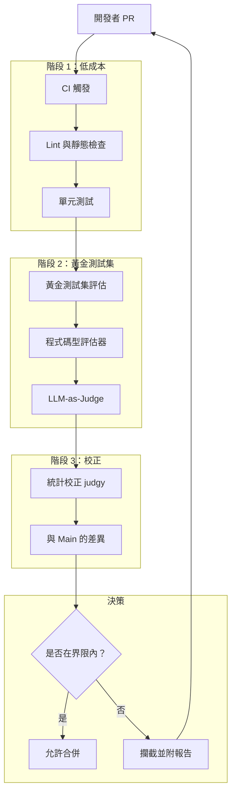
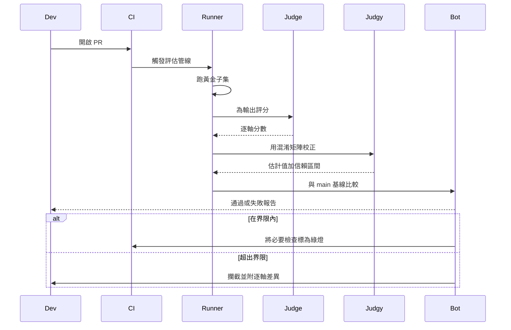

# 案例研究：為 AI 產品打造 Eval-Gated CI/CD

一支 28 人的 AI 產品工程團隊，把合併後才在找回歸問題的做法，換成了 eval-gated CI：每個 PR 在出現合併按鈕之前，都會跑黃金測試集（golden sets）、帶統計校正的 LLM-as-judge，以及失敗模式分類（failure-mode taxonomies）。

## 商業問題

一家 AI 優先的 SaaS 公司推出了一款面向客戶的答覆機器人（answer-bot），底層建構於 RAG 管線加上一個代理迴圈（agent loop）。六個月前，團隊推出了一個「小小的」提示變更，結果在某個特定合約類型的問題上造成了答案品質回歸，等到客戶發現時，已經損失了一筆 400 萬美元的續約。事後檢討找出三件事：這項變更從未針對該合約專屬的測試集做過評估；spot check 所用的 LLM-as-judge 指標已經漂移了 11 分卻沒人察覺；而一個本來只要 2 天就能回退的修復，因為沒有人準備好可安全回退的基線（safe-to-revert baseline），最後花了 9 天。

來自 2026 年 5 月現實的限制條件：

- 4 個團隊共 28 名工程師；每週約有 50 個 PR 觸及 AI 表面（AI surface）
- 受監管產業的客戶拒絕接受其領域專屬查詢上的任何回歸
- 每個 PR 的評估預算：模型花費低於 40 美元；完整跑一輪的預算：低於 1,200 美元
- p95 的 PR 到合併時間目標：含評估在內低於 90 分鐘
- 評估方法論需每季通過稽核員簽核

2026 年 5 月的現實是，eval-gated CI 已經不再是「有更好」的東西。Hamel Husain 的 [eval 部落格系列](https://hamel.dev/blog/posts/evals/)、Eugene Yan 的著作（[evals](https://eugeneyan.com/writing/evals/)），以及用於統計校正的 [judgy 函式庫](https://github.com/ai-evaluation/judgy)，全都匯聚成了一套操作手冊。Phoenix、Langfuse、Braintrust 和 Galileo 也都推出了 CI 整合。現在的問題不再是「我們該不該做這件事」，而是「我們要怎麼做才不會讓週期時間翻倍」。

## 架構

### 元件

| 層 | 技術 | 用途 |
|-------|------|---------|
| 黃金測試集 | repo 中的 YAML，每個表面 1,200 到 4,000 個案例 | 穩定的測試基底 |
| 程式碼評估器 | 帶自訂斷言的 Pytest | 低成本、確定性的檢查 |
| LLM judges | 用 Claude Sonnet 4.7 做判斷 | 主觀品質 |
| 統計校正 | [judgy](https://github.com/ai-evaluation/judgy) | 把 judge 分數轉換成帶信賴區間（CI）的估計值 |
| 管線 | GitHub Actions 加上自訂 runner | CI 編排 |
| 追蹤儲存 | Langfuse | 每個 PR 的可觀測性 |
| 標註 | 自架的 Argilla | 為 judge 校準做的人工重新標註 |

### 資料流

1. PR 開啟；GitHub Actions 觸發；階段 1（lint、單元測試、型別檢查）在 2 分鐘內跑完。
2. 階段 2 啟動黃金測試集評估，針對一個有代表性的子集（預設為完整測試集的 10 到 25 個百分點；在受保護分支上，或當標籤標示 `full-eval` 時則為 100 個百分點）。
3. 每個黃金測試集案例都會跑過新的 build、產生一份輸出，並由以下兩者評分：(a) 在確定性檢查適用之處（JSON schema、regex、事實查找）使用程式碼型評估器，以及 (b) 針對品質維度使用 LLM judge。
4. 階段 3 使用 `judgy`，搭配 judge 提示的 train/dev/test 切分來校正 judge 分數。
5. 把校正後的估計值（含信賴區間）與 `main` 最近一次綠燈 build 做比較；如果信賴區間的下界落在容差範圍內，PR 即可合併；否則就攔截，並附上一份詳細報告。

## 關鍵設計決策

### 1. 黃金測試集的建構與輪替

每個黃金測試集都來自三個來源建構而成：過去 90 天的生產環境追蹤樣本（依錯誤分析得出的失敗模式做分層）、由獨立的 red-team LLM 產生的合成對抗案例（synthetic adversarial cases），以及從客戶支援工單精選出的邊界案例（edge cases）。我們每季輪替 10 到 15 個百分點的案例；我們從不刪除案例（案例會被歸檔到一個凍結的「歷史回歸（historical regressions）」集合，該集合只在夜間跑）。這避免了過度擬合（over-fitting）的陷阱，也就是評估集隨著產品一起漂移。

規模設定：每個表面 1,200 個案例是下限；低於此數，校正後分數的信賴區間會太寬，無法在 95 個百分點的信心水準下偵測到 2 分的回歸。Eugene Yan 涵蓋了這套規模計算；我們針對自己的指標重新推導了一遍。

### 2. judge 的 train/dev/test 切分

LLM judge 本身就是一個模型，帶有提示參數與少樣本（few-shot）範例。我們把 judge 提示當成一個模型，並施加 train/dev/test 紀律：60 個百分點的人工標註案例用來調整 judge 提示，20 個百分點用來挑選最佳的提示變體，20 個百分點則是保留集（hold-out），我們只在做重大的 judge 提示變更之前才查閱。這個模式是 [judgy 方法論](https://github.com/ai-evaluation/judgy)與 Hamel 的 eval 貼文的核心。

重新校準的節奏：每 30 天，有 50 個新案例由 2 位人類重新標註（要求 Cohen's kappa 超過 0.7）；如果 judge 在 dev 集上的準確率掉到 80 個百分點以下，我們就重新調整。

### 3. 用 judgy 做統計校正

在我們的領域中，LLM-as-judge 在主觀類別上的原始（naive）準確率約落在 75 到 88 個百分點之間。原始的 judge 分數是有偏差的。`judgy` 會利用 judge 在保留集上的混淆矩陣（confusion matrix），計算出真實通過率的校正估計值，並回傳一個信賴區間。我們以信賴區間的下界是否落在容差範圍內作為閘門（gate）。這意味著我們從不單憑 judge 雜訊就攔截一個 PR，也從不放行一個只是 judge 剛好沒抓到的回歸。

數學：如果 judge 在保留集上有 85 個百分點的精確率（precision）和 92 個百分點的召回率（recall），而新 build 的 judge 回報通過率為 89 個百分點，那麼校正後的估計值約為 87 個百分點，其 95 個百分點信賴區間大致落在 83 到 91 個百分點之間。只要信賴區間下界至多比 `main` 低 2 分，我們就允許合併。（[參考：judgy README 的數學](https://github.com/ai-evaluation/judgy#statistical-correction)）。

### 4. 以失敗模式分類作為斷言表面

我們不會把「品質」當成單一數字來評分。我們沿著從失敗模式分類得出的各個軸線來評分：幻覺（hallucination）、檢索遺漏（retrieval-miss）、格式違規、拒答（refusal）、人設破裂（persona break）、引用錯誤。這套分類是把錯誤分析（[Hamel 的開放編碼 + 軸向編碼管線](https://hamel.dev/blog/posts/field-guide/)）套用在 6 個月內 800 個生產環境失敗案例上的產出。逐軸（per-axis）的分數讓我們即使整體品質有所改善，也能因為幻覺回歸而攔截。

### 5. 每個 PR 的評估預算

完整跑一輪評估集要花 80 到 200 美元，視模型花費而定。以每週 50 個 PR 計算，原始成本是每週 4K 到 10K 美元。我們把它框住：

- 預設的 PR 跑黃金測試集的 10 到 25 個百分點，依失敗模式分層（讓所有失敗模式都有代表）。
- `full-eval` 標籤觸發 100 個百分點。
- 夜間 cron 在 `main` 上跑 100 個百分點，以抓出任何我們漏掉的漂移。
- 新的 judge 提示變更會觸發在凍結的歷史集合上跑 100 個百分點。

這把每個 PR 的成本框在 40 美元以下，每週總成本框在 1,200 美元以下。

### 6. judge 提示漂移偵測

即使有校準，judge 提示仍會漂移：底層模型更新、少樣本範例變得較不具代表性、提示用語對模型來說顯得過時。我們透過以下方式監控漂移：

- 每月重跑保留集，並回報與前一個月的準確率差異。
- 追蹤 judge 之間的一致性（我們並行跑兩個 judge 提示；隨時間出現的分歧代表其中一個發生了漂移）。
- 在 git 中對 judge 提示做版本控制；回退是一次 commit 就能完成的操作。

當漂移超過 3 分，或 kappa 掉到 0.65 以下時，我們就開一張維護工單。

### 7. 為評估管線做快取

一個典型的黃金測試集案例會先產生一份輸出，接著再被評判。在提示與模型版本給定的情況下，輸出是確定性的。我們把（prompt-hash、model-version）快取對應到（output、judge-score），如此一來重跑同一份評估幾乎是免費的。在只觸及編排程式碼（而非提示）的 PR 上，快取命中率約為 70 個百分點；對這一類變更而言，這帶來 3 倍的成本縮減。

### 8. PR 層級的儀表化

每個 PR 的評估報告包含：與 main 比較的逐軸通過率、各軸線上新增失敗的範例、各軸線上新增通過的範例、judge 校正的信賴區間界限、總成本，以及一個指向追蹤儲存的連結，讓工程師可以重播任何失敗案例。報告會在跑完後 3 分鐘內，以 GitHub 留言的形式張貼。

## CI 管線序列

## 失敗模式與緩解措施

### F1：judge 提示漂移無人察覺

在一次模型升級之後，judge 逐漸對幻覺的偵測不足。緩解：每月重播保留集；追蹤 judge 之間的一致性；為受保護分支設一個「凍結 judge」模式，即使有更新的模型可用，也把 judge 的模型版本釘住。先前打垮我們的那次漂移事故，正是由這個原因造成；我們現在能在一個週期之內就抓到漂移。

### F2：評估集變得過度擬合

少數案例被反覆除錯，提示就在不知不覺中被調得專門對付它們。緩解：每季輪替；保留一批對抗案例，永遠不在失敗報告中向工程師展示（只給結果）。由一支獨立的 red-team 團隊掌管保留集。

### F3：單一 PR 只跑到評估的一個角落，漏掉了回歸

分層抽樣：我們確保每個 PR 的 10 個百分點樣本，至少包含 12 種失敗模式中每一種的 1 個案例。完整的夜間跑批仍然在 `main` 上進行。每個 PR 的覆蓋是有上限的，但不會是零。

### F4：意外的完整跑批導致成本超支

每個 PR 都掛上 `full-eval` 標籤，會讓成本變成三倍。緩解：這個標籤需要來自 CODEOWNERS 檔案的核准；一個自動化提醒會 ping 掛上標籤的人。我們也對每月評估花費設了一個 5K 美元的硬上限，並拒絕啟動任何會超過此上限的作業。

### F5：攔截率太高，開發者學會無視

如果有 35 個百分點的 PR 被攔截，開發者就會不再讀報告，並開始找繞過的辦法。緩解：我們調整閘門容差，把攔截率維持在 5 到 12 個百分點之間；我們把攔截率當成一項 SLI；當它飆高時，我們就去調查原因（往往是 judge 對某個新的失敗模式太嚴格）。目標是浮現真正的回歸，而不是當一個把關用的玩具。

### F6：保留集洩漏進訓練或提示

一個保留案例最後變成了少樣本範例。緩解：保留集存放在一個獨立的 repo 中，搭配獨立的存取清單；工程師無法讀取它；只有評估 runner 有 deploy key。對於保留集的失敗，失敗報告中只包含雜湊（hash），而非原始案例。

### F7：judge 模型被淘汰

供應商宣布 judge 模型的終止生命週期（end-of-life）。緩解：我們至少並行校準兩個 judge 模型；當淘汰落地時，我們有一個 60 天的視窗可以在保留 kappa 門檻的前提下完成替換。judge 提示的 git 歷史，加上校準資料，讓這件事成為例行公事。

### F8：評估 runner 佇列飽和

發布前後湧入的一波 PR，把評估佇列塞到 30 分鐘深。緩解：專屬的評估 runner GPU 池搭配自動擴展；為受保護分支設優先車道；如果佇列深度超過 20，我們就自動把非受保護的 PR 降級為 5 個百分點的樣本，以更快清掉積壓。

## 營運考量

### 監控

| SLO | 目標 |
|-----|--------|
| PR 到合併 p95 | 低於 90 分鐘 |
| 每個 PR 的評估成本 p95 | 低於 40 美元 |
| 攔截率（偽陰性 + 真實回歸） | 5 到 12 個百分點 |
| judge 評分者間 kappa | 超過 0.7 |
| 保留集重播準確率的逐月差異 | 低於 3 分 |
| 生產環境回歸逃逸（部署後） | 每季低於 1 次 |

### 成本模型

以每週 50 個 PR 計算：

- 預設抽樣：平均每個 PR 25 美元；每週 1,250 美元
- 完整評估跑批（每週約 8 次）：每次 100 美元；每週 800 美元
- 夜間 cron：每次 200 美元；每週 1,400 美元
- judge 重新校準：每月 50 美元
- 總計：每月約 14K 美元

只要避免一次回歸，這筆投資就回本了。我們對先前損失那筆 400 萬美元續約的事後估算顯示，即使一年只擋下一次，這個成本也綁得很穩。

### 待命（on-call）操作手冊

- 攔截率飆高：檢查近期是否有任何對 judge 提示或黃金測試集的變更導致此情況；把逐軸分數與基線比較。
- 評估成本飆高：檢查抽樣率設定；對 `full-eval` 標籤做速率限制。
- judge 漂移警報：觸發校準週期；若漂移嚴重，把 judge 輪替到備援模型。
- 保留集破口（雜湊碰撞）：立即隔離，重新產生受影響的案例。
- 評估 runner 故障：PR 以清楚的「評估待處理（eval pending）」狀態排入佇列；當 runner 停擺時我們絕不自動合併；SRE 在 15 分鐘內收到呼叫。

### 每季檢討

每一季 AI 團隊都會檢討：失敗模式分類（這些類別是否仍與真實的生產環境錯誤相符？）、黃金測試集輪替（哪 10 到 15 個百分點過時了？）、judge 校準歷史（漂移是否在加速？），以及攔截率趨勢（這個閘門是否正在變成做樣子？）。這份檢討會餵進下一季的評估路線圖。我們採用 [Hamel field-guide](https://hamel.dev/blog/posts/field-guide/) 的儀式：對最近的 50 個失敗做開放編碼（open-coding）工作坊，接著做軸向編碼（axial coding）以更新分類。

### 稽核員資料包

評估管線會產出一份每季的稽核員資料包：方法論文件（在 git 中做版本控制）、黃金測試集摘要（各失敗模式的數量）、judge 校準結果（隨時間變化的 Cohen's kappa）、攔截率直方圖，以及一批附有理由的失敗 PR 樣本。這份資料包會自動產生，並由工程主管簽署。

### 為什麼我們不採用單一綜合品質分數

誘惑在於把所有軸線揉成一個數字，然後用它來設閘門。我們不這麼做。綜合分數會藏住回歸：一個幻覺回歸可能被一個格式合規的改善所掩蓋。我們以逐軸分數來設閘門，讓每個軸線都有自己的信賴區間和自己的攔截。代價是報告的雜訊變多；好處是我們永遠不會在某個關鍵維度上悄悄地回歸。

## 優秀面試候選人會涵蓋哪些內容

- 他們會區分程式碼型評估器（低成本、確定性）與 LLM-as-judge（高成本、主觀），並在不同階段中各取所用。
- 他們會明確點名統計校正；他們理解原始的 judge 分數是一個有偏差的估計值，而信賴區間才是用來設閘門的正確抽象。
- 他們會從錯誤分析定義出一套失敗模式分類，並以逐軸分數設閘門，而非單一綜合分數。
- 他們會為 judge 本身指定 train/dev/test 紀律，包含用於重新校準的 kappa 門檻。
- 他們會明確框住評估成本；他們知道對每個 PR 都做完整跑批成本太高，而分層抽樣正是那個槓桿。
- 他們對 judge 提示漂移有一套說法：他們會監控它、對提示做版本控制，並備有回退計畫。
- 他們會用雜湊和獨立的存取清單來保護保留集，以防止洩漏。

## 參考資料

- Hamel Husain，[Your AI product needs evals](https://hamel.dev/blog/posts/evals/)
- Hamel Husain，[A field guide to rapidly improving AI products](https://hamel.dev/blog/posts/field-guide/)
- Eugene Yan，[Evals: Constructed for LLM apps](https://eugeneyan.com/writing/evals/)
- Eugene Yan，[LLM-as-judge](https://eugeneyan.com/writing/llm-evaluators/)
- [judgy 函式庫](https://github.com/ai-evaluation/judgy)
- [Phoenix evals](https://docs.arize.com/phoenix/evaluation/concepts-evals)
- [Langfuse evaluations](https://langfuse.com/docs/scores/overview)
- [Braintrust](https://www.braintrust.dev/docs)
- [Galileo evaluate](https://www.rungalileo.io/blog/llm-evaluation)
- Zheng 等人，[Judging LLM-as-a-Judge](https://arxiv.org/abs/2306.05685)
- [Argilla 標註平台](https://docs.argilla.io/)
- [pytest-html 報告整合](https://pytest-html.readthedocs.io/)

相關章節：[評估與可觀測性](../14-evaluation-and-observability/01-llm-evaluation.md)、[可靠性與安全](../13-reliability-and-safety/01-guardrails.md)、[AI Evals 完整指南](../ai_evals_comprehensive_study_guide.md)。
