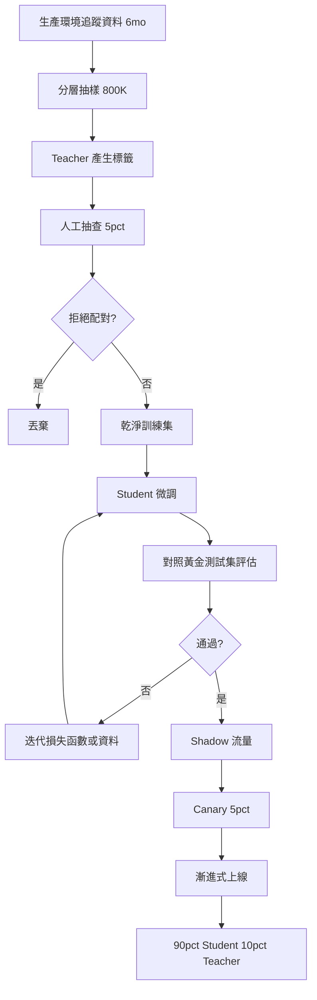

# 案例研究：客戶專屬的蒸餾管線

一家 Series-B 階段的 AI 產品，透過在 6 個月的生產環境追蹤資料上蒸餾出一個 7B 的 student 模型，把前沿模型支出從每月 $50K 降到 $4 到 6K，回收期為 3 個月，重新蒸餾的週期為 4 到 6 個月。

## 業務問題

一個已具規模的 AI 產品（每月約 8M 次使用者請求）跑在前沿模型上。成本在 2026 年初突破每月 $50K，成長率為每季 18 percent，財務部門要求提出一份方案。團隊有一個清楚的領悟：大約 90 percent 的生產環境流量落在少數幾種反覆出現的任務模式上（意圖分類、結構化萃取、文件摘要、三類分流）。對這些任務來說，前沿模型過於大材小用；一個在前沿模型自身輸出上微調過、體積小得多的模型，就能以一小部分的成本來服務它們。

來自 2026 年 5 月現實的限制條件：

- 每月 $50K 的前沿模型支出，且持續成長
- 延遲預算：高流量任務的 p95 要低於 350 ms
- 品質門檻：在客戶的黃金測試集（golden set）上回歸幅度要小於 2 percent
- 法遵：客戶資料不得離開特定的雲端區域
- 人力：1 名 ML 工程師加上兼職的平台支援

蒸餾這個模式已經很成熟：DistilBERT（[Sanh et al., 2019](https://arxiv.org/abs/1910.01108)）、TinyBERT、Alpaca 風格的指令蒸餾（[Taori et al., 2023](https://github.com/tatsu-lab/stanford_alpaca)），以及更近期關於 chain-of-thought 蒸餾的研究（[Hsieh et al., 2023](https://arxiv.org/abs/2305.02301)），全都顯示一個 7 到 13B 的 student 在聚焦的任務上能回復 92 到 98 percent 的 teacher 表現。前沿實驗室的 FDE 團隊（Anthropic Field Engineering、OpenAI Solutions）已在多場研討會演講中公開講解過這套預算數學；下面的數字與這些團隊向客戶提出的數字一致。

## 架構

```mermaid
flowchart LR
    subgraph Collect["追蹤資料收集"]
        PROD[生產環境流量] --> TRACES[追蹤資料儲存]
        TRACES --> SAMPLER[分層抽樣器]
        SAMPLER --> CURATE[策展佇列]
    end

    subgraph Label["標註"]
        CURATE --> TEACHER[Teacher 前沿模型]
        TEACHER --> LABELS[蒸餾配對]
        LABELS --> HUMAN[人工抽查]
        HUMAN --> CLEAN[乾淨配對]
    end

    subgraph Train["蒸餾"]
        CLEAN --> FT[Student 微調 8x H100]
        FT --> EVAL[評估套件]
        EVAL --> CANARY[Canary 群組]
    end

    subgraph Serve["服務"]
        CANARY --> SHADOW[Shadow 流量]
        SHADOW --> ROLLOUT[漸進式上線]
        ROLLOUT --> STUDENT[Student 模型服務]
    end
```

### 元件

| 層級 | 技術 | 用途 |
|-------|------|---------|
| Teacher | 前沿模型（Claude Opus 4.7 或同等模型） | 標籤來源 |
| Student | Llama 4 7B int4 或 Qwen 3.6 7B | 生產環境服務 |
| 追蹤資料儲存 | S3 加上 Langfuse | 抽樣與重放 |
| 訓練器 | DeepSpeed 加上 FSDP，跑在 8x H100 上 | 一週的訓練作業 |
| 評估 | 每個任務一套黃金測試集，回歸時呼叫待命人員 | 品質關卡 |
| 服務 | vLLM 搭配 FP8 | 350 ms p95 |

### 資料流

1. 6 個月的生產環境追蹤資料累積在 Langfuse 加上 S3 中。
2. 抽樣器依任務類別做分層抽樣，並重新平衡，以確保稀有類別有被涵蓋到。
3. teacher（前沿模型）為每個樣本產生目標輸出，如果該任務能從推理蒸餾受益，通常會帶上 chain-of-thought 推理痕跡。
4. 由領域專家進行 5 percent 的人工抽查，抓出 teacher 的錯誤；我們套用拒絕抽樣（rejection sampling），只保留人工審查者與 teacher 意見一致的配對。
5. student 在 8x H100 上微調約 1 週（約 $22K 算力），產出一個 7B 的模型。
6. 模型通過各任務的評估後，會以 shadow 模式對著生產環境跑 2 週，接著漸進式上線：在 3 週內依序為 5 percent、20 percent、50 percent、90 percent，並把自動回滾（auto-rollback）接到即時品質指標上。

## 關鍵設計決策

### 1. 在真實的生產環境追蹤資料上蒸餾，而非合成資料

一個很誘人的做法是透過 LLM 產生合成提示，再用 teacher 來標註它們。我們試過這個做法；它產出的模型在合成提示上表現出色，但在真實流量上會退步 4 到 7 個百分點。生產環境追蹤資料捕捉到了真正重要的分布偏移、各種怪異情況與長尾案例。我們收集 6 個月的追蹤資料，依任務類別做分層抽樣，並用真實提示作為蒸餾來源。這與前沿實驗室 FDE 團隊建議的做法一致。

### 2. 用人工抽查做拒絕抽樣

teacher 的錯誤會傳播進 student。如果你拿每一筆 teacher 輸出來訓練，92 percent 的 teacher 精確率會變成 90 percent 的 student 精確率。我們對 teacher 標籤的隨機樣本做 5 percent 的人工抽查，並拒絕掉人工不同意的配對。這會抓出大約 4 percent 的標籤，並讓最終 student 在我們的綜合指標上提升 2 到 4 個百分點。成本：每次重新蒸餾約 $1,800 的人工標註費，外加算力費用。

### 3. 在划算的地方做 chain-of-thought 蒸餾

對於推理量大的任務（在我們的情況中是分流類別），我們採用 Hsieh et al. 的[帶推理依據的蒸餾](https://arxiv.org/abs/2305.02301)做法：teacher 同時產出答案與一段推理痕跡；student 則被訓練成同時產出兩者。這讓 student 具備了它光靠輸入-輸出配對無法發展出的結構化思考。我們不會在分類或萃取任務上使用這個做法（沒有增益，反而增加延遲）。

### 4. 用人工標註建構評估集

我們的評估集與訓練集是分開策展的。它包含跨高流量任務類別的 1,800 個案例，由 3 位領域專家以多數決標註。我們每季重新標註 200 個案例，以追蹤分布漂移。評估集是 canary 上線的把關訊號；在綜合指標上回歸 2 個百分點就會封鎖生產環境部署。我們在抽樣訓練資料時絕不去看評估集的範例。

### 5. Canary 上線與 shadow 流量

即使評估通過，生產環境仍有評估集漏掉的長尾行為。我們的上線流程：

- 第 1 週：只跑 shadow 流量，不影響使用者。我們在 100 percent 的流量上比較 student 與 teacher 的輸出，並以一個差異分類器（delta classifier）標出分歧處，交由人工審查。
- 第 2 週：5 percent 的即時流量。出現以下任一情況就自動回滾：(a) 延遲 p95 超過 500 ms、(b) 即時使用者按讚率下降超過 1 個百分點、(c) 某個領域專屬的防護機制以更高的比率被觸發。
- 第 3 週：20 percent。相同的防護機制。
- 第 4 週：50 percent。
- 第 5 週：90 percent。剩下 10 percent 永久導向 teacher，用於持續的追蹤資料收集與重新蒸餾。

這種保守的爬升方式，在過去一年裡抓到了兩個評估集漏掉的回歸。

### 6. 重新蒸餾的週期

世界會漂移。新的產品功能會改變任務分布；使用者會學到新的行為；teacher 自身也會隨著新模型的發布而進步。我們每 4 到 6 個月重新蒸餾一次。這條管線是部分自動化的：追蹤資料抽樣、teacher 標註與訓練都已腳本化；人工抽查與評估審查仍然需要人來做。每次重新蒸餾的全包成本約為 $26K（$22K 算力、$1,800 標註、加上額外開銷），需時 4 到 6 週。

### 7. 何時蒸餾「不」合理

蒸餾並不總是對的。不利的訊號：

- 流量低（每月低於 200K 次請求）。回收期永遠不會實現。
- 任務高度多變。如果每個請求都是獨一無二的，student 學不到一個有用的分布。
- teacher 自身不穩定或快速演進。對著一個移動的目標反覆蒸餾是白費力氣。
- 品質門檻非常嚴格（要求超過 99 percent 的擬真度）。蒸餾落差是真實存在的；如果你無法容忍它，就乖乖用 teacher。

我們用一套快速篩選的經驗法則：至少 60 percent 的流量落在 5 種或更少的任務模式上，且這些任務的每月支出超過 $20K。如果兩個條件都不成立，我們就放棄蒸餾。

### 8. 量化的選擇

我們以 int4 服務這個 7B 的 student（透過 vLLM 搭配 FP8 KV cache 的 GPTQ）。int4 把記憶體大約砍掉 4x，並在 H100 上相對於 FP16 把吞吐量提升約 2.3x。我們量測到在綜合指標上的準確度損失為 0.4 個百分點，遠在容忍範圍內。我們也考慮過 int8（損失較小、加速也較小）與 FP8（生態系較不成熟）；在每次請求成本上，int4 勝出。

### 9. 訓練資料的隱私考量

生產環境追蹤資料就定義而言含有使用者 PII。在訓練前我們會跑一道遮蔽流程：一個微調過的 NER 模型標出 PII 區段，我們再用類別 token（`[EMAIL]`、`[PERSON_NAME]`）取代它們。student 學到的是結構性的模式，而不會記住特定的身分。遮蔽模型自身會在一個已標註的樣本上評估，其精確率超過 98 percent、召回率超過 95 percent。

## 成本與回收

| 項目 | 金額 |
|-----------|--------|
| 追蹤資料收集（6 個月） | 已作為可觀測性支出的一部分支付 |
| Teacher 標註（約 800K 配對） | $42K 一次性 |
| 人工抽查 | $8K 一次性 |
| 算力（8x H100 跑 1 週，加上重試） | $32K 一次性 |
| 評估集策展 | $14K 一次性 |
| 平台工程（額外開銷） | $24K 一次性 |
| **前期總計** | **$120K** |

| 每月經常性支出 | 之前 | 之後 |
|------------------|--------|-------|
| 前沿模型（10 percent 的流量，加上重新蒸餾的相關設施） | $50K | $5K |
| Student 模型服務（在專屬 H100 上跑 vLLM） | $0 | $1,200 |
| **每月總計** | **$50K** | **$6.2K** |

每月節省：約 $44K。回收期：120K / 44K，約 2.7 個月。為了財務溝通，我們捨入為「3 個月回收期」。

重新蒸餾平均每 5 個月花費 $26K，我們把它攤提到同一條節省金額上。年度淨節省：約 $470K。

## 蒸餾管線

## 失效模式與緩解措施

### F1：Teacher 升級使 student 過時

前沿模型廠商發布了新一代，teacher 品質跳升，於是我們的 student 相對於市場其他產品出貨的水準，現在低於使用者的期待。緩解：我們每月監控一份 teacher 對 student 的對照評估；當落差超過 4 個百分點時，就加速重新蒸餾的排程。對著一個更強的 teacher 重新蒸餾很直接；管線是一樣的。

### F2：訓練與服務之間的分布偏移

一個新的產品功能在一夜之間改變了使用者行為（一波通知活動帶來不尋常的查詢、一個新的訂價層級改變了使用者類型）。student 的訓練分布不再吻合生產環境。緩解：一個線上漂移監控器會在輸入嵌入分布的移動超過某個門檻時發出警示；如果漂移是結構性的，我們就觸發一次緊急重新蒸餾；如果是暫時性的，我們就把受影響的切片導向 teacher。

### F3：Teacher 的幻覺被烤進 student 裡

teacher 偶爾會產生幻覺；拒絕抽樣能抓到大部分但非全部。於是 student 會更有自信地產生幻覺，因為那個模式就在訓練分布裡。緩解：在評估集上做一道忠實度檢查；只要幻覺率相對基準有任何成長，就觸發一次訓練資料的重新清理。

### F4：過度導向 teacher 造成的成本回歸

隨著工程師為各種邊角情況加上後備（fallback），那 10 percent 的 teacher 後備會逐漸往上爬。緩解：對 teacher 支出設定預算警報；每季稽核後備路由；每一條後備規則都需要有理由說明與到期時限。

### F5：Canary 上線漏掉一個長尾回歸

評估集與 shadow 流量看起來都沒問題，但 5 percent 的即時流量暴露出一個傷害特定客戶區隔的回歸。緩解：在即時流量上做每個區隔的品質指標，並做每個區隔的自動回滾；我們依客戶層級、依語言、依任務類別進行區隔監看。

### F6：法遵違規：訓練資料的駐留地

客戶的合約要求資料駐留在特定區域；而我們預設的訓練算力在另一個區域。緩解：我們維持區域本地的訓練容量；每個客戶的訓練資料都綁定到該客戶的區域；我們絕不把原始追蹤資料複製到區域之外。編排器會拒絕啟動任何會違反駐留規定的作業。

### F7：在罕見任務上的災難性遺忘

student 把一個它在訓練中只見過兩次的類別給忘了。緩解：分層抽樣保證對稀有類別有最低限度的涵蓋；評估套件明確納入稀有類別的案例；canary 上線會分別監控每個類別的品質。

### F8：跨 teacher 與 student 的成本追蹤失效

有些查詢會同時導向 student 與 teacher（在 shadow 期間）；除非明確處理，否則成本核算會重複計算。緩解：在每一次呼叫上打成本標籤（shadow、primary、fallback），並以每日對帳報告抓出標籤打錯的流量。

## 維運考量

### 監控

| SLO | 目標 |
|-----|--------|
| Student p95 延遲 | 低於 350 ms |
| 對 teacher 的品質差距（已校正） | 在 2 個百分點以內 |
| Teacher 後備率 | 目標 10 percent，超過 15 percent 時告警 |
| 每 1K 次請求成本 | 低於蒸餾前的 30 percent |
| 重新蒸餾週期 | 每 4 到 6 個月 |

### 成本模型

每月穩態：$6.2K 服務費加上攤提後的重新蒸餾費用（每月 $5.2K）。相較於只用 teacher 的 $50K，在完全攤提後每月約節省 $38K。年化計算：淨節省約 $456K。

### 待命處置手冊

- 品質回歸告警：以人工重放評估集來確認；若屬實，把受影響的區隔導向 teacher 直到下一個訓練週期；開一張高優先級工單。
- 成本超支：檢查後備路由；若流量模式改變了，安排重新蒸餾；必要時做節流。
- 延遲尖峰：檢查 GPU 使用率；若是吵鬧鄰居（noisy neighbor），就隔離該 student 節點。
- 漂移告警：檢查輸入嵌入的直方圖；若漂移大且持續，就觸發緊急重新蒸餾。
- 評估集外洩：若發現某個保留的評估案例出現在訓練資料中，立即退役該案例並跑一道去重流程；在當季內刷新評估集。

### 對照評估的週期

我們每月跑一次對照評估：一個 500 案例的樣本，student 對 teacher，由 LLM-as-judge 加上一個 50 案例的人工樣本評分。產出是一塊由 AI 團隊負責的單一儀表板磚（dashboard tile）。逐漸拉開的落差，就是該重新蒸餾的早期警訊。

### 重新蒸餾的儀式

當排定一次重新蒸餾時，我們遵循一套 4 週的儀式：第 1 週，抽樣新的追蹤資料並用當前的 teacher 標註；第 2 週，訓練與評估；第 3 週，shadow 流量；第 4 週，漸進式上線。整套儀式都有檢查清單；由 ML 工程師獨力執行，在漸進式上線階段有平台支援。

### 面向客戶的溝通

當我們把某個客戶的流量切換到一個蒸餾出的 student 時，我們會告知對方。面向客戶的措辭：「您的高流量查詢現在改由一個我們在您的流量上微調過、針對延遲與成本最佳化的模型來服務。您季度報告中的評估證據顯示，品質與前沿基準相差在 2 個百分點以內。」只要品質維持住，大多數客戶並不在意；少數客戶（金融服務、醫療照護）需要明確的簽核，除非他們選擇加入，否則我們會把那些查詢導向 teacher。

## 強的面試候選人會涵蓋哪些重點

- 他們會把預算數學講清楚並把這段對話提到前面：前期成本、回收期、持續的重新蒸餾成本。
- 他們會點名引用蒸餾論文（DistilBERT、Alpaca、帶推理依據的蒸餾），並使用「student」、「teacher」、「拒絕抽樣」的語彙。
- 他們會解釋為什麼生產環境追蹤資料勝過合成資料，以及為什麼對 teacher 標籤做人工抽查很重要。
- 他們會用具體的百分比與自動回滾關卡走過一遍 canary 上線；他們會點名只跑 shadow 流量會漏掉哪些類型的回歸。
- 他們會說出蒸餾在哪些地方「沒」幫助，顯示他們真的做過這件事，而不只是讀過。
- 他們會處理 teacher 升級的情境：當前沿模型進步時，與 student 的落差會拉大，而重新蒸餾就是解法。
- 他們會把隱私工作（訓練資料中的 PII 遮蔽）納入管線的一部分，而不是事後才補。

## 參考資料

- Sanh et al., [DistilBERT, a distilled version of BERT](https://arxiv.org/abs/1910.01108)
- Hinton et al., [Distilling the Knowledge in a Neural Network](https://arxiv.org/abs/1503.02531)
- Taori et al., [Stanford Alpaca: An Instruction-following LLaMA model](https://github.com/tatsu-lab/stanford_alpaca)
- Hsieh et al., [Distilling Step-by-Step](https://arxiv.org/abs/2305.02301)
- Jiao et al., [TinyBERT: Distilling BERT for Natural Language Understanding](https://arxiv.org/abs/1909.10351)
- Anthropic, [On distillation patterns](https://www.anthropic.com/research)
- OpenAI, [Distillation in the platform](https://platform.openai.com/docs/guides/distillation)
- [vLLM FP8 inference](https://docs.vllm.ai/en/latest/quantization/fp8.html)
- [Langfuse trace sampling](https://langfuse.com/docs/observability/sampling)
- Hamel Husain, [Field guide to rapidly improving AI products](https://hamel.dev/blog/posts/field-guide/)
- [DeepSpeed for training](https://www.deepspeed.ai/training/)
- [Together AI distillation case study](https://www.together.ai/blog/distillation)

相關章節：[微調與蒸餾](../03-training-and-adaptation/05-knowledge-distillation.md)、[推論最佳化](../04-inference-optimization/01-inference-fundamentals.md)、[成本管理](../04-inference-optimization/07-cost-optimization-playbook.md)。
