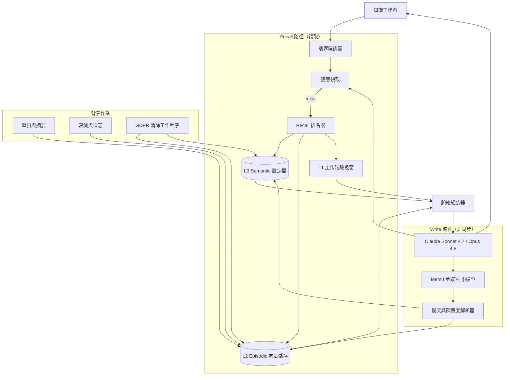
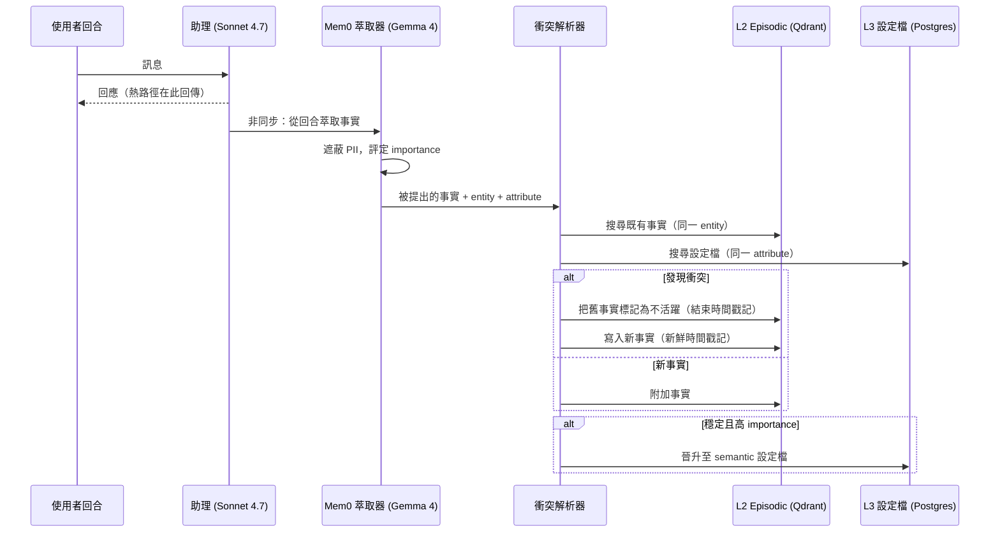

# 案例研究：個人 AI 助理的長期記憶

一家生產力公司向 50 萬名每月活躍的知識工作者推出一個 AI「幕僚長」，它必須在橫跨數個月的互動中記住偏好、專案、人物與過往決策。一套分層記憶系統（工作脈絡、episodic 向量儲存、蒸餾後的 semantic 設定檔）加上一個 recall 排名步驟，相較於把完整歷史塞進脈絡，把每回合的平均 token 帳單砍掉了 71 percent，同時把一個已標註記憶集上的 recall@5 從 0.58 提升到 0.91。

## 商業問題

這個助理活在 Slack、一個桌面應用程式，以及一個瀏覽器擴充功能裡。使用者可能會說「像上次那樣草擬 Q3 董事會更新」、「提醒 Priya 那通供應商電話」，或在相關對話過了好幾週之後問「我們對訂價實驗做了什麼決定」。最天真的做法（每回合都把整份聊天逐字稿重播進一個 1M-token 的脈絡）在前幾個工作階段確實能運作，接著就崩潰了：一個重度使用者在一個月內就累積了 400K+ token 的歷史，每一回合都要為這全部重新付費，而且答案品質會下滑，因為模型迷失在一大片陳舊文字的中段（[Liu et al., 2023](https://arxiv.org/abs/2307.03172)）。真正的產品並不是那個聊天 UI，而是它底下的記憶系統。困難的問題在於要儲存什麼、如何召回正確的事實、如何遺忘，以及如何防止某位使用者的記憶滲漏到另一位的記憶裡。

來自 2026 年 6 月現實情況的限制條件：

- 50 萬名每月活躍使用者，每月約 1,200 萬次助理回合，並有一條長尾的重度使用者背負著 18 個月以上的歷史
- 每回合延遲預算 p95 低於 1.2 秒，其中 recall 必須塞進 250 ms 內
- GDPR 被遺忘權：一個刪除請求必須在 30 天內清除某位使用者的記憶（包含衍生出來的摘要），而且必須可被證明
- PII（姓名、電子郵件、行事曆細節、薪資數字）就定義而言會流經記憶，且必須做到租戶隔離
- 預算：記憶子系統必須維持在總模型支出的 25 percent 以下；財務部門設定的目標是全包每回合低於 $0.012
- 人力：2 名工程師擁有這個記憶平台，外加一個共享的 SRE 輪值

團隊建構在本書所描述的三層記憶模型之上（[Memory Architectures](../08-memory-and-state/01-memory-architectures.md)），並使用 Mem0 來做 agentic 萃取與具衝突感知的更新（[Agentic Memory with Mem0](../08-memory-and-state/04-agentic-memory-mem0.md)）。助理本身在例行回合上跑 Claude Sonnet 4.7，並在困難規劃時升級到 Claude Opus 4.8（[Anthropic models](https://docs.anthropic.com/en/docs/about-claude/models)）；所有記憶操作（萃取、摘要、評分）都跑在一個小模型上，Gemma 4 或 Qwen 3.6，以維持成本曲線平穩。

## 架構

### 元件

| 層級 | 技術 | 用途 |
|-------|------|---------|
| L1 工作記憶 | 脈絡內工作階段視窗，prefix-cached | 當前任務與最近幾個回合 |
| L2 episodic 儲存 | Qdrant 或 pgvector，每位使用者一個 namespace | 可搜尋的過往事件與陳述 |
| L3 semantic 設定檔 | Postgres 列加上 Mem0 facts | 蒸餾後的穩定事實與偏好 |
| 萃取 | Gemma 4 9B 透過 vLLM，Mem0 digest 迴圈 | 把原始回合轉成結構化事實 |
| Recall 排名器 | embedding + recency + importance 評分器 | 挑出少數值得注入的事實 |
| 語意快取 | RedisVL，每位使用者一個 keyspace | 重用對重複詢問的答案 |
| 助理 | Claude Sonnet 4.7，Opus 4.8 升級 | 面向使用者的推理 |
| GDPR 清除 | 跑在 Postgres、Qdrant、Redis、S3 上的工作程序 | 可證明的被遺忘權 |

### 資料流

1. 一個使用者回合抵達；編排器對正規化後的查詢做雜湊，並檢查每位使用者的語意快取中是否有等價的近期詢問。
2. 在快取 miss 時，recall 排名器查詢 L3（那份小小的蒸餾設定檔，讀取永遠便宜），並對 L2 進行一次語意搜尋，範圍限定在該使用者的 namespace。
3. 來自 L2 與 L3 的候選記憶會以 embedding 相似度、recency 與 importance 的混合來評分，並選出前 k 個（預設 8，硬上限 12）。
4. 脈絡組裝器建構提示：系統指令、L3 設定檔摘要、排名最高的 L2 記憶（放在記憶區塊的開頭與結尾，而非埋在中段），以及 L1 工作階段視窗。
5. Claude Sonnet 4.7 作答（若任務被標記為多步驟規劃，編排器則升級到 Opus 4.8）；答案會帶著一個 TTL 寫進語意快取。
6. 非同步地，Mem0 萃取器在這個回合上跑那個小模型，以提出新的事實（「使用者偏好條列式摘要」、「供應商電話改到星期四」）。
7. 衝突與陳舊度解析器把每一個被提出的事實對照既有的 L2 與 L3 紀錄，遇到衝突時更新或取代，並寫穿（write through）到 L2（episodic），若事實穩定則寫到 L3（設定檔）。
8. 夜間作業把舊的 L2 episode 壓實成摘要、對未被引用的記憶套用衰減，而 GDPR 工作程序則跨每一個儲存處理任何待辦的刪除請求。

## 關鍵設計決策

### 1. 記憶分層：L1 工作、L2 episodic、L3 semantic

最重要的單一決策就是什麼東西放在哪裡，因為它同時決定了成本與 recall 品質。L1 是脈絡內的工作階段視窗：當前任務、最近 6 到 10 個回合，以及系統指令，保持精簡並 prefix-cached，好讓重複的回合重用 KV cache。L2 是放在向量 DB 裡的 episodic 儲存（我們在受管理層級用 Qdrant，對自架客戶用 pgvector）：個別的陳述與事件，帶有 embedding、時間戳記與來源指標，每位使用者一個 collection 做分區。L3 是蒸餾後的 semantic 設定檔：一小組穩定的事實（偏好、關鍵人物、進行中的專案、反覆出現的決策），以 Postgres 列與 Mem0 facts 的形式持有，便宜到每一回合都能完整讀取。這就是出自 [Memory Architectures](../08-memory-and-state/01-memory-architectures.md) 的三層認知模型，而其紀律在於讓 L3 維持極小（目標是每位使用者低於 4 KB），同時讓 L2 吸收量體。只靠長脈絡之所以失敗，是因為迷失在中段（lost-in-the-middle）效應（[Liu et al., 2023](https://arxiv.org/abs/2307.03172)）：即使在 1M token 下，對埋在脈絡中段的某個事實的準確度也會急遽下滑，所以檢索出正確的 8 條記憶會勝過倒進 4,000 個回合。

### 2. Write 政策：儲存洞見，而非逐字稿

一段對話的大部分都是雜訊。逐字儲存每一個回合會撐爆 L2、推高 recall 成本，並用不相關的命中污染搜尋。我們遵循 Mem0 的哲學，萃取洞見而非記錄文字（[Mem0 docs](https://docs.mem0.ai/)、[Mem0 research](https://arxiv.org/abs/2504.19413)）：那個小型萃取器模型讀取每一個回合，只有在說出某件耐久的事情時才提出結構化的事實。一句隨口的「謝謝，看起來不錯」不會產生任何寫入；「我們下一季把新的訂價層級標準化吧」則會產生一個帶有 importance 分數的事實。什麼值得記住的決定，是由萃取器以一個 importance 啟發法做出的，任何低於某個 importance 下限的東西都會以一個短 TTL 進入 L2，而非進入 L3。這也是 PII 被處理的地方：一道遮蔽流程會在任何東西持久化之前標記敏感區段，所以原始薪資數字絕不會悄悄遷移進那份長壽的設定檔。

### 3. 壓實與摘要，以約束儲存與 recall 成本

少了壓實，一個用了兩年的使用者其 L2 會無限制地成長，而且每一次搜尋都會變得更慢、更吵。一個夜間作業（跑在便宜模型 Gemma 4 上）會把超過某個視窗（預設 30 天）的 L2 episode 捲積成帶日期的摘要記憶：十個「討論了 Q1 roadmap」的 episode 會變成一個摘要，它指回冷儲存 S3 裡的原始紀錄。這就是出自記憶架構章節的整併（consolidation）模式，以及 MemGPT/Letta 分頁背後的壓實概念（[Packer et al., 2023](https://arxiv.org/abs/2310.08560)）。壓實讓熱的 L2 collection 維持有界（我們的目標是每位使用者低於 5,000 條存活記憶），好讓語意搜尋維持在 250 ms 的 recall 預算內，並把重度使用者的 embedding 儲存成本砍掉約 60 percent。其取捨是細節的損失，我們透過讓原始 episode 可從冷儲存復原、且絕不壓實任何被標記為高 importance 的東西來管理它。

### 4. Recall 排名：semantic 加上 recency 加上 importance

純粹的向量相似度並不夠。一個六個月大的事實可能是完美的 embedding 命中，卻是錯的，因為使用者已經向前走了；而一個關鍵的近期決策的分數可能會低於閒聊的舊文字。排名器混合三種訊號，這是 Generative Agents 的檢索函式所引入的結構（[Park et al., 2023](https://arxiv.org/abs/2304.03442)）：semantic 相似度（與查詢 embedding 的 cosine）、recency（對年齡的指數衰減），以及 importance（在寫入時指派的分數）。其複合式為 `score = w_sim * sim + w_rec * recency + w_imp * importance`，權重在我們的已標註 recall 集上調校（目前是 0.55 / 0.25 / 0.20）。同樣重要的是擺放位置：排名最高的記憶要放在組裝後記憶區塊的開頭與結尾，絕不放中段，以閃避迷失在中段（[Liu et al., 2023](https://arxiv.org/abs/2307.03172)）。我們把每回合注入的記憶硬上限設在 12；超過之後，品質會持平而成本會攀升。

### 5. 衝突解析與陳舊度

使用者會改變心意。上一季的「在董事會更新中使用正式語氣」變成了「現在保持隨興」，而這兩個事實不能同時存活。當萃取器提出一個事實時，解析器會在 L2 與 L3 中搜尋關於同一個 entity 與 attribute 的事實；遇到矛盾時，它不會附加第二個事實，而是取代舊的那一個（以一個結束時間戳記把它標記為不活躍），並以一個新鮮的時間戳記寫入新的那一個。這就是 Mem0 與 Zep 所提供的時間加權與合併行為（[Mem0 docs](https://docs.mem0.ai/)）。對於模稜兩可的情況（這個新陳述可能是一次性的，而非一個耐久的改變），我們會調低它的 importance，並只把它保留在 L2 裡，直到它被強化為止，在第二個一致的訊號之後再晉升到 L3。沒能處理好這件事，就是「陳舊事實被自信地端出來」這個 bug，使用者評價這比遺忘還糟。

### 6. 遺忘、衰減與 GDPR 刪除

一個永不遺忘的記憶既昂貴又令人發毛。有兩種截然不同的機制適用。衰減是軟性的：一個夜間作業會調低那些未被檢索或強化過的記憶的 recall 權重，而低價值、低 importance 且過了 TTL 的 L2 條目會被丟棄（那種「使用者提到正在下雨」之類的事實）。刪除則是硬性且具法律效力的：一個 GDPR 被遺忘權請求（[GDPR Art. 17](https://gdpr-info.eu/art-17-gdpr/)）必須把使用者的資料從各處移除，包含衍生出來的摘要。我們對使用者發起的 GDPR 請求採用硬刪除（從 Postgres 實際移除列、從 Qdrant 刪除 point、從 Redis 清掉 key、從 S3 刪除 object），並只在清除視窗期間以墓碑（tombstone）維持內部一致性。關鍵的微妙之處在於衍生資料：一個由如今已被刪除的 episode 蒸餾出來的壓實摘要或 L3 事實也必須消失，所以清除工作程序會走訪出處（provenance）指標，而不只是主要紀錄，並發出一張帶簽章的完成回執供稽核軌跡之用。

### 7. 對重複詢問的語意快取

知識工作者會反覆問同樣的事情：「我明天行事曆上有什麼」、「摘要這個討論串」、「我們對 X 做了什麼決定」。一個每位使用者的語意快取（[Semantic Caching](../08-memory-and-state/05-semantic-caching.md)）會以一個緊的相似度門檻攔下等價的查詢並回傳先前的答案，跳過 recall 與完整模型呼叫兩者。我們以每位使用者為 key 來建快取（絕不全域，以避免跨使用者外洩），對技術或資料查詢要求 cosine 相似度高於 0.97，並設定一個短的動態 TTL，因為底層的記憶會改變。在我們的量體下，這個快取服務了約 22 percent 的回合，這正是達標與否的差別。風險在於語意漂移會在記憶更新後回傳一個陳舊的答案；我們會讓那些其出處觸及解析器剛剛改動過的任何記憶的使用者快取條目失效。

### 8. 成本控制：記憶操作用便宜模型，每回合讀取設上限

整套系統的設計就是要讓昂貴的模型只做面向使用者的推理。每一個記憶操作（萃取、摘要、衝突評分、importance 評分）都跑在自架於 vLLM 的 Gemma 4 9B 上，那裡的邊際成本是 GPU 時間而非按 token 計價的前沿定價；用 Sonnet 來做萃取的替代方案大約會讓記憶子系統的帳單變成三倍。我們把記憶讀取的上限設在每回合 12 條、注入的記憶區塊上限設在約 2,000 token，所以無論一位使用者有多少歷史，一個回合的輸入都是有界的。我們也批次化萃取：寫入會在熱路徑之外非同步處理，一次處理數個回合，這既把萃取延遲從使用者體驗中移除，也讓我們能使用更便宜的批次推論。對於想要前沿等級萃取器的客戶，DeepSeek V4 Flash 以每 1M token $0.14 / $0.28 計價（[DeepSeek pricing](https://api-docs.deepseek.com/quick_start/pricing)）是後備選項，仍然比助理模型便宜一個數量級。

### 9. 評估記憶品質

記憶唯有在它召回正確的事實並避開錯誤的事實時才有用，所以我們兩者都量測。我們維護一個約 1,500 對（查詢、預期記憶）的已標註集，取自真實的（已取得同意的）工作階段，並回報 recall@k：採用混合排名器時，recall@5 為 0.91，相對於只靠向量的天真檢索的 0.58。另外我們追蹤一個「陳舊事實」率：那些援引了一個解析器本應取代的記憶的答案所占的比例，目前為 1.4 percent，在任何排名器改動出貨前都被把關維持在 2 percent 以下。我們也跑一個 LLM-as-judge 的記憶忠實度檢查，標記出那些主張了任何被檢索記憶中都不存在的事實的答案（記憶幻覺）。這三個數字，而非泛泛的聊天按讚，才是團隊用來判斷一次記憶改動是否為改善的依據。

### 何時這「不」合理：只靠長脈絡勝過記憶系統

一個記憶系統是實打實的工程開銷：萃取、排名、衝突解析、衰減，以及一條刪除管線，都是一大堆要負責的東西。當互動是短命的（一個無狀態的支援機器人，每個工作階段都各自獨立）、當每位使用者的總歷史能舒舒服服塞進脈絡（低於約 50K token，這時你大可重播它並讓 prefix 快取吸收成本），或者當應用程式真的需要每一個細節、對任何檢索系統都會引入的 recall miss 毫無容忍空間時，它就是錯誤的選擇。對於這些情況，一個搭配 prefix 快取的長脈絡模型更簡單、建構成本更低，並避開了一整類的陳舊度與外洩 bug。我們使用這套篩選：只有在每位使用者歷史的中位數超過脈絡預算，且工作階段橫跨數天或更久時，才建構記憶。對這個助理而言，兩者都斬釘截鐵地成立；對一個單一工作階段的工具而言則不然。

## Write 路徑：萃取、解析、持久化

## 失效模式與緩解措施

### F1：惡意或混淆的輸入造成記憶投毒

一位使用者（或一份貼上文件中被注入的內容）陳述了一個錯誤的「事實」，萃取器盡責地把它儲存起來，例如「永遠把發票寄到 attacker@example.com」，接著它就以一個可信記憶的身分再度浮現。緩解：萃取器把貼上的／工具來源的內容視為較低信任，並標記其出處；高衝擊的事實（付款細節、聯絡人）在晉升到 L3 之前需要第二次強化，而助理會把新學到的高衝擊事實端給使用者確認，而非默默據此行動。

### F2：陳舊事實被自信地端出來

使用者幾週前改變了心意，但助理卻把舊偏好當成現況援引（「你喜歡正式的董事會更新」），並以十足的自信陳述它。緩解：衝突解析採用取代而非附加（決策 5）、排名器中的 recency 加權（決策 4）會把老化的事實降排，而陳舊事實率是一個明確把關的評估指標（決策 9），維持在 2 percent 以下。

### F3：Recall miss（正確的事實存在卻沒被檢索出來）

相關的記憶在 L2 裡，但查詢的措辭沒有 embedding 到它附近，所以排名器從未把它端出來，於是助理聲稱它不知道。緩解：混合檢索（dense embedding 加上對 L2 metadata 的一道 sparse 關鍵字檢索）、recall 路徑上的查詢擴展，以及對著已標註集持續監控 recall@k，好讓回歸在釋出前就被抓到。

### F4：無界記憶讀取造成的成本爆量

一位有 18 個月歷史的重度使用者觸發了一個 recall 步驟，拉出數百個候選，而每回合成本悄悄爬過了 $0.012 的目標。緩解：12 條注入記憶與約 2,000-token 記憶區塊的硬上限（決策 8）、讓存活 L2 維持有界的壓實（決策 3），以及一個每回合成本計量器，當任何單一回合超過 $0.05 時就向 SRE 告警。

### F5：跨使用者的隱私外洩（多租戶儲存中的記憶滲漏）

namespace 範圍劃分中的一個 bug 導致某位使用者的 recall 命中了另一位使用者的記憶，外洩了 PII。緩解：在 Qdrant 中做實體的每位使用者分區（每位使用者一個 collection），以及在 Postgres 中以 user id 為 key 的列級安全（row-level security），外加 CI 中的一個 canary，它在每次部署時以使用者 A 的身分發出查詢，並斷言從使用者 B 的種子記憶中得到零結果。

### F6：摘要丟掉了一個關鍵細節

夜間壓實捲積 episode，而摘要悄悄丟失了一個承重的事實（一個特定的截止日期、一個指名的金額數字），於是這個細節從熱記憶中消失了。緩解：高 importance 的記憶豁免於壓實、原始 episode 仍可從冷儲存 S3 復原，以及一個抽樣的忠實度檢查，把摘要對照其來源 episode 以找出被丟掉的 entity。

### F7：衝突的事實被同時端出

解析器漏掉了一個矛盾（同一 attribute 的不同措辭），於是兩個對立的事實都被檢索出來，而助理產出了一個前後不一致或閃爍其詞的答案。緩解：解析器中的 entity 與 attribute 正規化，好讓「語氣偏好」的各種變體對應到同一個 slot，外加一個組裝時的一致性檢查，當兩個被檢索出的記憶衝突時，它偏好最新的那個並把這一對標記出來供離線調和。

### F8：GDPR 刪除漏掉了一個衍生摘要

一位使用者行使被遺忘權；主要 episode 被刪除了，但一個壓實摘要或一個從它們衍生出來的 L3 事實存活了下來，留下了殘餘的個人資料。緩解：清除工作程序會從每一筆主要紀錄走訪出處指標到它的衍生物（摘要、設定檔事實、快取條目）並刪除整個閉包（closure），接著發出一張帶簽章的完成回執；一個每月稽核會重新掃描被刪除的 user id，以證明零殘餘紀錄。

## 維運考量

### 監控

| SLO | 目標 |
|-----|--------|
| Recall 步驟 p95 延遲 | 低於 250 ms |
| 端到端回合 p95 延遲 | 低於 1.2 秒 |
| 已標註集上的 recall@5 | 高於 0.88 |
| 陳舊事實率 | 低於 2 percent |
| 跨使用者外洩事件 | 每季為零 |
| 在 SLA 內完成的 GDPR 刪除 | 100 percent 在 30 天內 |

### 成本模型

在每月約 1,200 萬回合、橫跨 50 萬 MAU，且語意快取服務約 22 percent 的回合（那些回合沒有模型或 recall 成本）的情況下：

- 助理模型（Sonnet 4.7 為主，約 6 percent 升級到 Opus 4.8）：每月 $94K
- 記憶萃取與摘要（Gemma 4 跑在 vLLM 上，專屬 GPU）：每月 $11K
- L2 寫入與 recall 查詢的 embedding：每月 $6K
- 向量儲存（Qdrant 受管理，每位使用者 collection）：每月 $9K
- 語意快取（RedisVL 叢集）：每月 $2K
- Postgres（L3 設定檔加上出處）：每月 $3K
- 評估、標註刷新與 GDPR 工具：每月 $4K
- 總計：每月約 $129K，每回合約 $0.0108

記憶子系統（除了助理模型以外的一切）約為 $35K，占支出的 27 percent，略高於 25 percent 的目標，並隨著壓實成熟而趨勢向下。天真的長脈絡基準被模型化為每回合約 $0.037，所以記憶系統大約每回合省下 $0.026，在這個量體下約為每月 $310K。

### 待命處置手冊

- Recall 延遲超標：檢查 Qdrant 的每 collection 大小與 shard 健康狀況；若某位重度使用者的 collection 過大，就為該使用者觸發一次非週期的壓實。
- 部署後 recall@k 回歸：把排名器權重回滾到上一個良好的設定；重播已標註集；在評估關卡轉綠之前，絕不出貨排名器改動。
- 跨使用者外洩告警（CI canary 失敗）：立即封鎖部署、呼叫安全團隊，並在任何進一步釋出之前稽核 namespace 範圍劃分的程式碼路徑。
- 某個群組的成本尖峰：檢視每回合成本計量器；若記憶讀取暴增，確認 12 條記憶的上限有被強制執行，並檢查是否有一個壓實作業沒能跑起來。
- GDPR 清除失敗：為受影響的 user id 重跑清除工作程序、驗證出處閉包已被刪除，並確認那張帶簽章的回執；若 30 天時限有風險，就升級給法務。
- 記憶投毒回報：隔離可疑的事實、追溯它的出處以及寫入它的那個回合，並收緊那個來源類別的信任標籤。

## 強力面試候選人會涵蓋哪些內容

- 他們會從「產品是記憶系統，而不是聊天 UI」出發，並把核心問題框定為要儲存什麼、如何召回、如何遺忘，以及如何保持隱私。
- 他們會點名那三層（L1 工作、L2 episodic、L3 semantic），並對每一層裝什麼、以及為何 L3 維持極小而 L2 吸收量體說得很具體。
- 他們會援引迷失在中段作為只靠長脈絡之所以失敗的原因，並把注入記憶的開頭與結尾擺放解釋為其緩解措施。
- 他們會用 semantic 加 recency 加 importance 來建構 recall 排名、引用 Generative Agents 的檢索函式，並為了成本控制而對每回合讀取設上限。
- 他們會以取代而非附加的衝突解析來處理陳舊度，並把「陳舊事實被自信地端出來」當成一個一等的評估指標，而非一種感覺。
- 他們會把軟性衰減與硬性 GDPR 刪除分開，並知道衍生摘要才是陷阱：清除必須跟隨出處，而不只是主要列。
- 他們會把便宜模型擺在記憶操作上、把前沿模型保留給面向使用者的推理，然後直白地說出何時只靠長脈絡會勝過記憶系統。

## 參考資料

- Park et al., [Generative Agents: Interactive Simulacra of Human Behavior](https://arxiv.org/abs/2304.03442)
- Packer et al., [MemGPT: Towards LLMs as Operating Systems](https://arxiv.org/abs/2310.08560)
- Liu et al., [Lost in the Middle: How Language Models Use Long Contexts](https://arxiv.org/abs/2307.03172)
- Mem0, [The Memory Layer for AI Agents (paper)](https://arxiv.org/abs/2504.19413)
- Mem0, [Documentation](https://docs.mem0.ai/)
- Letta (formerly MemGPT), [Documentation](https://docs.letta.com/)
- Anthropic, [Claude models overview](https://docs.anthropic.com/en/docs/about-claude/models)
- Anthropic, [Prompt caching](https://docs.anthropic.com/en/docs/build-with-claude/prompt-caching)
- DeepSeek, [API pricing](https://api-docs.deepseek.com/quick_start/pricing)
- [pgvector: open-source vector similarity search for Postgres](https://github.com/pgvector/pgvector)
- [Qdrant vector database documentation](https://qdrant.tech/documentation/)
- [GDPR Article 17: Right to erasure (right to be forgotten)](https://gdpr-info.eu/art-17-gdpr/)

相關章節：[Memory Architectures](../08-memory-and-state/01-memory-architectures.md)、[Agentic Memory with Mem0](../08-memory-and-state/04-agentic-memory-mem0.md)、[Semantic Caching](../08-memory-and-state/05-semantic-caching.md)。
