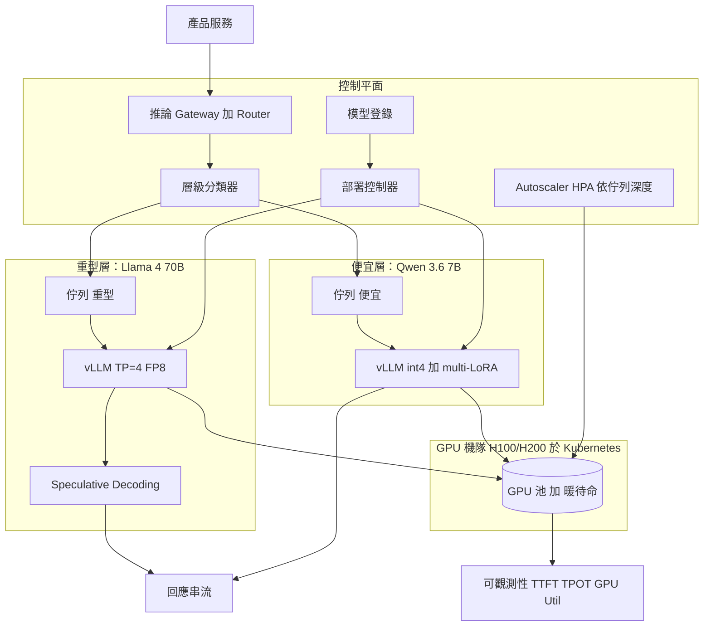
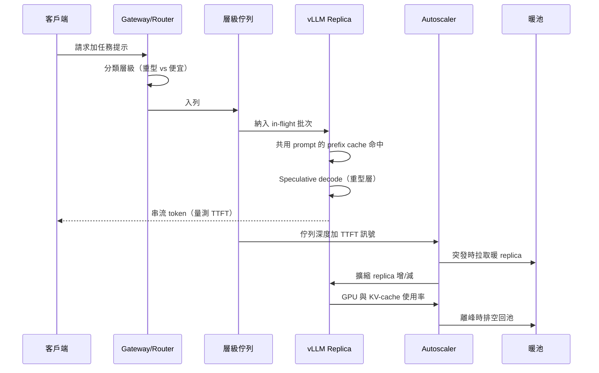

# 案例研究：大規模自架 LLM 推論平台

一家已具規模的公司，每月支付約 $85K 給某前沿 API 廠商以服務高流量、對延遲敏感的產品流量，於是在一支 H100/H200 機隊上自建推論平台，重型層服務 Llama 4、便宜層服務 Qwen 3.6，並搭配 [vLLM](https://docs.vllm.ai/)、continuous batching 與 PagedAttention，把每 token 成本砍掉 5 到 8x，同時把 p95 延遲控制在預算之內。

## 商業問題

一家已具規模的產品公司，每月以前沿 API 跑約 1.4B 的輸出 token，用於分類、結構化萃取、摘要與 RAG 答案合成。帳單在 2026 年初突破每月 $85K，並以每季 12 percent 的速度成長。這個領悟跟驅動大多數自建決策的領悟一樣：這些任務並不需要前沿模型。一個夠強的開源模型（難的那一片用 Llama 4 70B、量大而簡單的那一片用 Qwen 3.6 7B）在黃金測試集上的表現落在容忍範圍內，而流量也夠穩定，足以讓一支自架的 GPU 機隊攤平成本。難的部分不是「模型做不做得到」；而是吞吐量（batching）、記憶體（KV cache）、在不為閒置 H100 付錢的前提下對尖峰流量自動擴縮，以及運行那套過去由廠商代管的服務基礎設施所帶來的維運負擔。

來自 2026 年 6 月現實的限制條件：

- 每月 $85K 的廠商支出，以每季 12 percent 成長，每月約 1.4B 輸出 token
- 延遲預算：p95 的 time-to-first-token（TTFT）低於 400 ms，RAG 合成的 p95 端到端低於 2.5 s
- 流量是尖峰型的：日內有 4x 的擺盪，再加上活動驅動、會在 60 秒內湧入的 8x 突發
- H100 80GB 在雲端的隨需價約 $2.50 到 $3.50/GPU-hour；保留／承諾用量的定價落在 $1.80 附近；機隊必須維持在 55 percent 以上的使用率才能勝過廠商
- 品質門檻：在各任務各自的黃金測試集上，相對前沿基準的回歸幅度低於 2 percent
- 團隊：2 名平台／ML 工程師加上共用的 SRE 待命，所以這個平台維運起來必須夠無聊

自建或外購的對標基準很具體。[DeepSeek V4 Flash](https://api-docs.deepseek.com/quick_start/pricing) 以每 1M token $0.14 input／$0.28 output，是最便宜的認真代管選項；DeepSeek V4 Pro 則是 $0.435／$0.87。唯有當混合後的每 token 成本在公司的流量規模下能明顯壓在 Flash 那條線之下，且團隊能讓 GPU 持續忙碌，自架才說得通。服務堆疊採用 [vLLM](https://docs.vllm.ai/) 來做 continuous batching 與 [PagedAttention](https://arxiv.org/abs/2309.06180)，這正是讓高吞吐量開源模型服務變得實用的技術。

## 架構

### 元件

| 層級 | 技術 | 用途 |
|-------|------|---------|
| Gateway/router | Envoy 加上一個小型層級分類器 | 路由到重型 vs 便宜層，強制執行預算 |
| 服務引擎 | [vLLM](https://docs.vllm.ai/)（continuous batching、PagedAttention） | 高吞吐量 token 生成 |
| 重型層 | Llama 4 70B，tensor parallel = 4，FP8，speculative decoding | 困難的萃取與 RAG 合成 |
| 便宜層 | Qwen 3.6 7B，int4（AWQ），multi-LoRA | 分類與高流量的量大部分 |
| 編排 | Kubernetes 加上 [KServe](https://kserve.github.io/website/)（評估過 Ray Serve） | 上線、擴縮、流量切分 |
| Autoscaler | HPA 依佇列深度加上暖池，離峰時 scale-to-zero | 讓容量匹配尖峰需求 |
| GPU 機隊 | H100 80GB 與 [H200 141GB](https://www.nvidia.com/en-us/data-center/h200/) | 算力，H200 用於大批次的重型層 |
| 模型登錄 | MLflow 風格的登錄加上簽章的 artifact | 有版本的 checkpoint、安全部署 |
| 可觀測性 | Prometheus 加上 Grafana、vLLM 指標 | TTFT、TPOT、tokens/sec、佇列深度、GPU util |

### 資料流

1. 產品服務帶著任務提示（classify、extract、summarize、rag_synth）向推論 gateway 發出請求。
2. 層級分類器進行路由：分類與短萃取送往 Qwen 3.6 便宜層；長萃取與 RAG 合成送往 Llama 4 70B 重型層。
3. 請求落進各層各自的佇列。vLLM 透過 continuous batching 把它拉進當前的 in-flight 批次，因此它不必等待一個 batch window 被填滿。
4. PagedAttention 依需求配置 KV-cache 區塊；如果該請求與其他 in-flight 請求共用一段 system prompt，prefix caching 就會重用那段共用 prefix 已算好的 KV。
5. 重型層執行 speculative decoding：一個小型的 drafter 每步提出數個 token，由 70B 在一次 forward pass 中驗證它們，藉此降低延遲關鍵路徑上的 tokens-per-output-token（TPOT）。
6. 便宜層若該請求指向某個微調變體，就透過 multi-LoRA 服務把對應的 LoRA adapter 熱插到共用的 int4 base 上，於是一個 base 模型即可服務眾多微調版本。
7. token 透過 gateway 串流回呼叫端；autoscaler 監看佇列深度與 TTFT，並增添或排空 GPU replica，從暖池中取用以避免冷啟動。
8. 每一次請求都會把 TTFT、TPOT、tokens/sec、批次大小與 GPU 使用率送往 Prometheus；成本模型每晚對帳 GPU-hours 與已服務的 token。

## 關鍵設計決策

### 1. 兩個層級：難的那一片用 Llama 4 70B，量大部分用 Qwen 3.6 7B

我們是依難度切分，而非依產品切分。大約 80 percent 的請求（分類、短萃取）很簡單，送往 int4 的 Qwen 3.6 7B，它以重型層成本的極小一部分來服務它們。其餘 20 percent（長文件萃取、RAG 答案合成）需要 [Llama 4](https://ai.meta.com/blog/llama-4/) 70B 的推理餘裕。重型層的尺寸拿捏很重要：一個 70B 等級的模型在 FP8 下光是權重就需要約 70GB，所以它放不進單張 80GB H100 還留有可用的 KV cache 空間；我們以 tensor-parallel 跨 4 張 GPU 來跑它（或用 2x H200 141GB 以支援更大的批次）。便宜層的 7B 可以舒服地放進單張 H100，把 80GB 的大部分都留給 KV cache，而這才是真正驅動吞吐量的東西。這個切分是最大的單一成本槓桿：把那 80 percent 的簡單流量放到 7B 而非 70B，在那一片上大約是每次請求 10x 的節省。

### 2. continuous batching 的設定，以及吞吐量對延遲的取捨

vLLM 的核心是 continuous（in-flight）batching：排程器不等待一個固定批次被填滿，而是在每個 decode step 把新請求納入正在運行的批次，並把已完成的逐出（[Orca, OSDI 2022](https://www.usenix.org/conference/osdi22/presentation/yu)；[Anyscale 的 continuous batching 說明](https://www.anyscale.com/blog/continuous-batching-llm-inference)）。這就是為什麼開源模型的吞吐量相對於天真的靜態 batching 跳升了 10 到 20x。可調的旋鈕是 `max_num_seqs`（並行的序列數）與 `max_num_batched_tokens`（每步的 token 預算）。更大的預算會拉高 tokens/sec 與 GPU 使用率，但會推高 TTFT，因為新到的請求得排在一個肥批次後面。我們依層級調校：便宜層跑大的 token 預算（高吞吐量，對非同步的分類而言 TTFT 並非使用者可見），重型層跑較緊的預算加上 chunked prefill，好讓一個長的 RAG prompt 不會卡住短的。這裡的教訓是，TTFT、TPOT 與吞吐量是一個三方取捨；你要把批次調校到該層的 SLO，而不是調到單一的全域數字。

### 3. 以 PagedAttention 加上 prefix caching 做 KV cache 管理

在負載下，記憶體瓶頸是 KV cache，而不是權重。[PagedAttention](https://arxiv.org/abs/2309.06180) 把 KV cache 當作作業系統的虛擬記憶體來對待：它以固定大小的區塊來儲存，而非一整塊連續的記憶體，這把碎片化浪費從約 60 到 80 percent 砍到 4 percent 以下，讓我們能在每張 GPU 上塞進多得多的並行序列。在此之上我們啟用 [prefix caching](https://docs.vllm.ai/en/latest/features/automatic_prefix_caching.html)：我們的 RAG 與分類呼叫共用很大段的 system prompt 與 few-shot 範例，所以那段共用 prefix 的 KV 只算一次，並跨請求重用。以我們的工作負載而言，搭配一段約 1,800-token 的共用 system prompt，prefix caching 把重型層的 prefill 算力砍掉約 35 percent，並把 p95 TTFT 明顯往下拉。更深入的機制請見 [PagedAttention](../04-inference-optimization/05-paged-attention.md) 與 [KV cache](../04-inference-optimization/02-kv-cache-and-context-caching.md)。

### 4. 量化：重型層用 FP8、便宜層用 int4

量化是我們塞進大模型並拉高吞吐量的手段，但它會犧牲準確度，所以我們依層級挑選。重型層跑 [FP8](https://docs.vllm.ai/en/latest/quantization/fp8.html)（在 H100/H200 Hopper tensor core 上原生支援）：它相對 FP16 大約把權重記憶體砍半，並把吞吐量拉高約 1.6 到 1.8x，而我們在黃金測試集上量到的準確度損失低於 0.3 個百分點，對合成品質而言可以忽略。便宜層透過 [AWQ](https://arxiv.org/abs/2306.00978) 跑 int4（GPTQ 也很接近）：int4 把 7B 的權重記憶體砍掉約 4x，並在 H100 上相對 FP16 把吞吐量提升約 2.2x，準確度成本約 0.5 個百分點，分類與短萃取完全能容忍。我們「不」在 70B 重型層上跑 int4；在長 RAG 合成上的準確度回歸是看得見的（約 1.4 個百分點），會把我們推向黃金測試集的極限，所以 FP8 才是那一層正確的下限。在任務簡單的地方積極量化，在任務困難的地方保守量化。

### 5. 對尖峰流量自動擴縮：暖池勝過天真的 scale-to-zero

流量有一個會在一分鐘內湧入的 8x 活動突發，而一個 H100 replica 載入一個 70B FP8 checkpoint 加上暖機 CUDA graph 冷啟動要花 90 到 180 秒。天真的 scale-to-zero 會讓每一次突發都吃到一個數分鐘的冷啟動，這會炸掉 TTFT SLO。我們以 HPA 依佇列深度與 TTFT（不是 CPU，CPU 對 GPU 服務毫無意義）來擴縮，並搭配一個暖池：N 個已載入但僅輕度負載的待命 replica，其數量足以吸收突發的第一波，同時 autoscaler 在它們後面拉起冷的 replica。離峰時（夜間）我們確實會把重型層往零的方向縮，因為當流量只剩涓流時暖池的成本並不划算，我們接受罕見夜間請求的較慢首次回應。冷啟動的緩解也包括：預先烘好的容器映像，把權重放在快速的本地 NVMe 快取上，而非在開機時從物件儲存拉取，光這一點就把冷啟動砍掉了約 40 秒。

### 6. 為延遲關鍵層做 speculative decoding

RAG 答案合成是使用者可見且對延遲敏感的，而 70B 的 TPOT 主導了端到端延遲。我們使用 [speculative decoding](https://arxiv.org/abs/2211.17192)：一個小而便宜的 drafter 提出 k 個 token，70B 在單一 forward pass 中驗證全部 k 個，相對於每個 token 都跑大模型，被接受的 token 等於是免費得來的。搭配一個匹配良好的 drafter，我們在合成路徑的 TPOT 上看到約 1.8 到 2.4x 的加速，這正是 2.5 s 與低於 1.5 s p95 之間的差別。需要注意的是 speculative decoding 幫的是延遲，不是吞吐量；在一個飽和的批次下，那些額外的驗證工作反而會降低 tokens/sec，所以我們只在延遲關鍵的重型層啟用它，並在以吞吐量為王的非同步便宜層停用它。細節請見 [speculative decoding](../04-inference-optimization/03-speculative-decoding.md)。

### 7. multi-LoRA 熱插：一個 base 服務眾多微調

產品團隊想要微調變體（一個帶客服語氣的萃取器、一個帶財務風味的摘要器），又不想為每個變體立一張 GPU。我們以 multi-LoRA 來服務它們：記憶體中一個 int4 的 Qwen 3.6 base，搭配每次請求熱插的 LoRA adapter（每個數十 MB），這正是 vLLM 原生實作的 [S-LoRA](https://arxiv.org/abs/2311.03285) 模式。這讓單一 base 能以接近 base 的吞吐量並行服務數十個微調，而不是把機隊碎裂成一機一模型的孤島、各自處在低使用率。取捨是每次請求有一點 adapter 切換的開銷，以及對能保持熱在記憶體中的 adapter 數量設有上限；冷的 adapter 在首次使用時從登錄分頁載入。這個決策正是讓便宜層保持密實、機隊使用率保持高檔的關鍵。

### 8. 建立在服務專屬訊號之上的可觀測性

對 GPU 服務來說，通用的 CPU/記憶體儀表板毫無用處。真正重要的訊號是 TTFT（排隊加上 prefill 的健康度）、TPOT（decode 速度，speculative decoding 與批次的故事）、每張 GPU 的 tokens/sec（吞吐量，成本的故事）、GPU 使用率與 KV-cache 使用率（我們是塞滿了還是在浪費機隊），以及佇列深度（autoscaler 的輸入）。vLLM 開箱即把這些匯出為 Prometheus 指標。我們對 KV-cache 使用率高於 90 percent（OOM 風險）、佇列深度成長（容量不足），以及 TPOT 回歸（糟糕的批次設定或 speculative decoding 接受率下降）設定告警。若沒有依層級切分的 TTFT/TPOT，我們就會對哪一層在受傷一無所知；有了它，一位待命工程師看一眼儀表板就知道該加 replica、重新調校批次，還是回滾一個 checkpoint。

### 9. 何時自架「不」合理

自架並非免費；它是用廠商帳單去換一筆工程與待命的帳單。不利的訊號：

- 流量低。低於約 150 到 200M 輸出 token/月時，機隊無法維持在勝過 DeepSeek V4 Flash 所需的約 55 percent 使用率，而閒置的 GPU 會讓每 token 成本比廠商更糟，而非更好。
- 只有尖峰、沒有穩定基底。如果流量是純突發、夾著長段的死寂期，你要嘛為暖容量多付錢，要嘛吃冷啟動；代管 API 會替你吸收這個。
- 團隊很小。運行 vLLM、Kubernetes、一個 autoscaler 與一個 GPU 待命輪值是實打實的工作。在低於約 1.5 名專職工程師的情況下，維運負擔會壓過節省，而且一旦出事，你沒有廠商的 SLA 可以靠。
- 需要前沿品質。如果任務真的需要 Claude Opus 4.8 或 GPT-5.6 的推理，沒有任何開源 70B 能補上落差，自架只是給了你一個更便宜但更差的答案。

我們的快速篩選：穩態流量超過 300M 輸出 token/月、其中至少 60 percent 能由某個開源模型在黃金測試集上以可接受的方式服務，以及一個能扛起 GPU 待命的團隊。只要任一項不成立，我們就留在 API 上，或改用代管的開源模型端點（Together、Fireworks、DeepSeek），而不是自己運行一支機隊。

## 請求生命週期與自動擴縮

## 失效模式與緩解措施

### F1：負載下因 KV cache 造成的 GPU OOM

一波長 context 的 RAG 請求把 KV cache 撐大，直到 vLLM 無法配置區塊而 replica OOM，丟掉 in-flight 請求。緩解：設定 `max_num_seqs` 與 `max_model_len` 的上限，讓最差情況的 KV 佔用能放進預算；啟用 vLLM 的搶佔/重算，讓排程器優雅地卸掉最長的序列而不是崩潰；在 90 percent KV-cache 使用率時告警，讓 autoscaler 在觸頂之前加上容量。

### F2：擴增時的冷啟動延遲尖峰

一個活動突發觸發了擴增，但新的 replica 需要 90 到 180 秒來載入 70B checkpoint 並暖機 CUDA graph，於是第一波的 TTFT 飆升。緩解：一個大小匹配第一波突發的暖池（關鍵設計決策 5）、把權重放在本地 NVMe 而非物件儲存，以及在容器映像中預先暖好的 CUDA graph。autoscaler 以一個領先指標（佇列深度成長）而非以已經炸掉的 TTFT 來觸發。

### F3：糟糕的批次設定造成的吞吐量崩潰

有人把 `max_num_batched_tokens` 設得太低（小批次餓著 GPU）或太高（TTFT 與 OOM），於是 tokens/sec 崩跌，而 GPU 使用率看起來卻很忙。緩解：批次設定隨部署一起版本化，並在上線前於 staging 對著一段錄製的生產環境 trace 做負載測試；一道 TPOT/吞吐量回歸關卡會封鎖部署；儀表板顯示每張 GPU 的 tokens/sec，讓回歸在數分鐘內就一目了然。

### F4：太晚才抓到的量化回歸

便宜層模型的一個新 int4 量化通過了 smoke test，卻在某個特定任務類別（例如數值萃取）上回歸，而這只在生產環境才會浮現。緩解：每一個量化 artifact 都跑完整的各任務黃金測試集，而非一個 smoke set，並設一道硬性的 2 個百分點關卡；shadow 流量比較量化版與 FP16 的輸出長達一週；即時流量上的各任務品質指標，在某個類別回歸時自動回滾該特定層級。

### F5：共享服務中的吵鬧鄰居延遲

一個重度的 LoRA 租戶，或一波灌進共享便宜層 base 的長 prompt，餓死了其他租戶，使他們的 TTFT 飆升。緩解：在 gateway 做每租戶的 token 速率限制；公平分享排程，讓沒有單一 adapter 能獨佔批次；當某個熱租戶的負載足以正當化時，把它隔離到一個專屬 replica；對並行活躍的 LoRA adapter 數量設上限，讓 base 保持有回應。

### F6：模型登錄部署了一個糟糕的 checkpoint

部署控制器出貨了一個損毀或標錯的 checkpoint，於是整個層級開始回傳垃圾。緩解：簽章的 artifact 加上載入時的 checksum 驗證；登錄釘住一個已知良好的「last good」版本；在全機隊上線前先 canary 一個 replica，並對輸出品質做自動健康檢查；一鍵回滾到那個釘住的版本。

### F7：閒置 GPU 造成的成本回歸

流量下滑但機隊沒有縮減（一個卡住的 autoscaler、一個過大的暖池，或一個被遺忘的除錯 replica），使用率掉到損益平衡線之下，於是每 token 成本悄悄地超過了它所取代的廠商。緩解：一個使用率 SLO，當機隊使用率掉到 55 percent 之下時有每日警報；每晚的成本對帳把實際的每 token GPU-hours 拿來跟 DeepSeek V4 Flash 那條線比較，並在我們輸掉自建或外購這筆帳時呼叫待命人員；暖池大小本身會依近期的尖峰需求自動擴縮。

### F8：流量突發超過容量（負載卸除）

一個突發跑贏了連暖池加上擴增都跟不上的程度，佇列無上限地成長，於是所有人的延遲都朝著逾時惡化。緩解：在 gateway 做明確的負載卸除：當佇列深度跨過某個門檻時，先卸掉優先級最低的非同步分類流量（稍後重試），保護使用者可見的 RAG 路徑，並在最後手段時把溢出量導向 DeepSeek V4 API，讓使用者得到一個降級但有服務的答案，而非一個逾時。刻意地卸除或溢出，好過悄無聲息地崩潰。

## 維運考量

### 監控

| SLO | 目標 |
|-----|--------|
| 重型層 p95 TTFT | 低於 400 ms |
| RAG 合成 p95 端到端 | 低於 2.5 s |
| 便宜層吞吐量 | 每張 H100 超過 3,500 tokens/sec |
| 機隊 GPU 使用率 | 超過 55 percent（低於則警報） |
| KV-cache 使用率 | 穩態低於 90 percent |
| 對前沿基準的品質差距 | 每任務在 2 個百分點以內 |

### 成本模型

以保留／承諾用量定價（約 $1.80/H100-hour）計的穩態機隊：

- 重型層：平均 12x H100（3 個 TP=4 replica），約 $15,600/月
- 便宜層：平均 8x H100（int4 加 multi-LoRA），約 $10,400/月
- 暖池加上突發餘裕（攤提後）：約 $6,000/月
- 可觀測性、登錄、控制平面節點：約 $2,500/月
- 平台工程與待命（已加負擔，部分）：約 $9,000/月
- 總計：約 $43,500/月

這服務的是同樣那約 1.4B 的輸出 token，而它們在廠商那邊要花 $85K，所以這個平台大約是帳單的一半，全包約 2x 的節省，在把維運開銷加回去之前、就原始的每 token 成本而言則更接近 5 到 8x。在便宜層上，混合後的成本落在每 1M 輸出 token 約 $0.031 的 GPU 算力，遠在 [DeepSeek V4 Flash](https://api-docs.deepseek.com/quick_start/pricing) 的 $0.28 output 線之下，這正是在這個流量規模下運行自己的機隊說得通的理由。一旦掉到約 300M token/月之下，固定的工程與暖池成本就會抹掉這個贏面。

### 待命處置手冊

- KV-cache/OOM 警報：確認 KV-cache 使用率與佇列深度；加 replica 或降低 `max_num_seqs`；若是單一租戶造成的，就隔離它。
- 冷啟動 TTFT 尖峰：確認暖池被排空了，或某次部署把它逐出了；補滿暖池；檢查權重是從本地 NVMe 載入，而非物件儲存。
- 吞吐量崩潰：把每張 GPU 的 tokens/sec 跟基準比較；回滾上一次的批次設定或量化變更；重跑 staging 的負載測試。
- 品質回歸：重放各任務的黃金測試集；自動把受影響的層級回滾到登錄的 last-good 版本；在修好之前，把該任務類別導向重型層或 API。
- 使用率低於損益平衡：檢查是否有卡住的 autoscaler 或被遺忘的 replica；把暖池重設到近期的尖峰；若流量是結構性下滑，就縮減保留的機隊。
- 容量被超過：確認負載卸除已啟動且 RAG 路徑受到保護；啟用 API 溢出；向相依團隊溝通降級的非同步 SLA。

## 強力面試候選人會涵蓋哪些內容

- 他們會點名 vLLM、continuous batching 與 PagedAttention，並解釋為何在負載下驅動吞吐量的記憶體瓶頸是 KV cache 而非權重。
- 他們會把 TTFT、TPOT 與吞吐量當作一個三方取捨來對待，並依層級、依 SLO 調校批次，而不是報出單一的全域延遲數字。
- 他們會誠實拿捏重型模型的尺寸：一個 FP8 的 70B 放不進單張 80GB GPU 還留有可用的 KV cache，所以 tensor parallelism 是必需的，而且他們知道 FP8 對 int4 在不同任務上有不同的準確度成本。
- 他們會以暖池與基於佇列深度的 HPA 來解決尖峰自動擴縮，並能解釋為何天真的 scale-to-zero 會在突發時炸掉 TTFT SLO。
- 他們會在延遲層使用 speculative decoding，並知道它幫的是延遲、不是吞吐量，所以在飽和的非同步批次下會停用它。
- 他們會把自建對外購的帳明確攤開來對著 DeepSeek V4 Flash 定價算，並說出自架失利的使用率下限（約 55 percent）。
- 他們會清楚說出自架在哪些情況「不」合理（流量低、只有尖峰、團隊很小、需要前沿品質），展現的是判斷力，而非反射性的內包。

## 參考資料

- [vLLM documentation](https://docs.vllm.ai/)
- Kwon et al., [Efficient Memory Management for LLM Serving with PagedAttention](https://arxiv.org/abs/2309.06180)
- Yu et al., [Orca: A Distributed Serving System for Transformer-Based Generative Models (OSDI 2022)](https://www.usenix.org/conference/osdi22/presentation/yu)
- Anyscale, [How continuous batching enables 23x throughput in LLM inference](https://www.anyscale.com/blog/continuous-batching-llm-inference)
- Leviathan et al., [Fast Inference from Transformers via Speculative Decoding](https://arxiv.org/abs/2211.17192)
- Sheng et al., [S-LoRA: Serving Thousands of Concurrent LoRA Adapters](https://arxiv.org/abs/2311.03285)
- Lin et al., [AWQ: Activation-aware Weight Quantization](https://arxiv.org/abs/2306.00978)
- [vLLM FP8 quantization](https://docs.vllm.ai/en/latest/quantization/fp8.html)
- [vLLM automatic prefix caching](https://docs.vllm.ai/en/latest/features/automatic_prefix_caching.html)
- [Ray Serve documentation](https://docs.ray.io/en/latest/serve/index.html)
- [KServe documentation](https://kserve.github.io/website/)
- [NVIDIA H200 GPU](https://www.nvidia.com/en-us/data-center/h200/)
- [DeepSeek V4 pricing](https://api-docs.deepseek.com/quick_start/pricing)
- Meta, [Llama 4](https://ai.meta.com/blog/llama-4/)

相關章節：[Serving Infrastructure](../04-inference-optimization/06-serving-infrastructure.md)、[Batching Strategies](../04-inference-optimization/04-batching-strategies.md)、[Cost Optimization Playbook](../04-inference-optimization/07-cost-optimization-playbook.md)。
