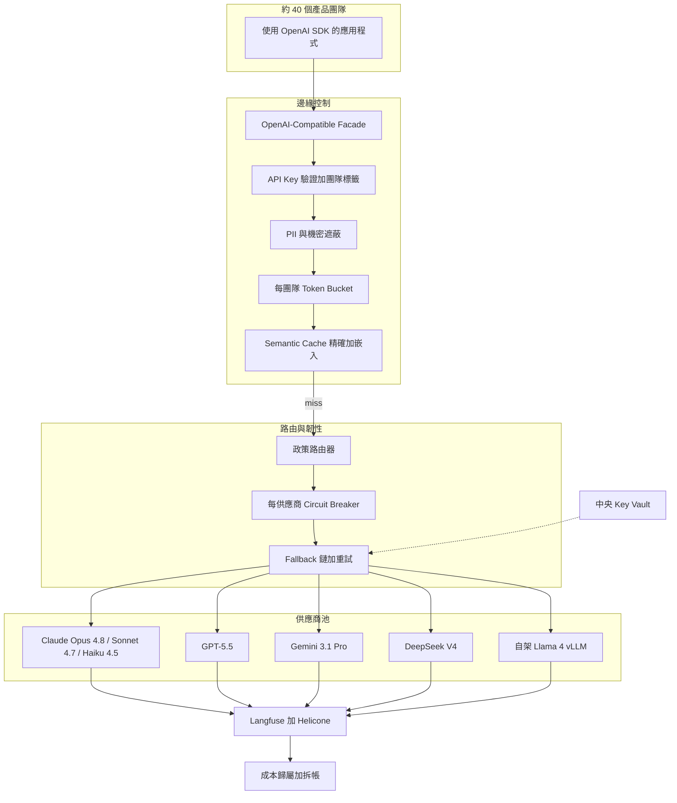
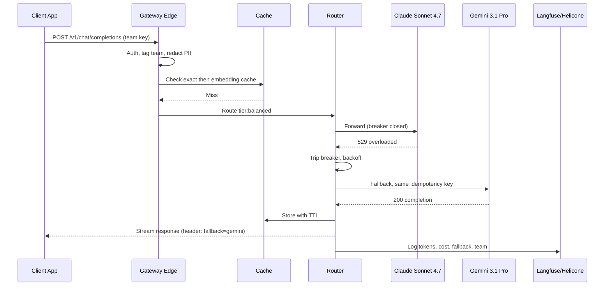

# 案例研究：具路由與容錯的多模型 AI Gateway

一家擁有 1,200 名工程師的公司打造了一個內部 AI gateway，讓約 40 個產品團隊只需打一個 OpenAI-compatible API，而不必各自分別整合 Claude、GPT、Gemini、DeepSeek 與一個自架的 Llama 4 機群，並在廠商中斷時自動 fallback、提供 semantic caching、各團隊配額與成本歸屬。驅動因素：2026 年初一次長達 4 小時的前沿廠商中斷，一口氣讓 9 個產品同時掛掉，而財務部門無法把每月 $300K 的 AI 帳單歸屬到各團隊頭上。

## 商業問題

40 個產品團隊各自整合了自己的 LLM SDK。當某個前沿廠商在 2026 年 2 月發生 4 小時中斷時，9 個產品同時陷入停擺，因為它們每一個都把單一供應商寫死、毫無 fallback。同一季中，財務部門收到一張每月 $300K 的整併 AI 發票，卻說不出哪個團隊花了多少錢，於是成本控管無從談起，也沒人為超支負責。平台團隊接到的任務：打造一個每個團隊都已經會呼叫的 OpenAI-compatible 端點，把路由、fallback、快取、配額與成本拆帳（chargeback）集中處理，好讓 40 個團隊不再把同一個問題重複解決 40 次。

來自 2026 年 6 月現實的限制條件：

- 橫跨 6 個供應商每月 $300K 的支出，無法歸屬到各團隊，且以每季約 20 percent 的速度成長。
- 不能再讓單一廠商中斷拖垮超過一個產品；爆炸半徑（blast radius）必須被收斂。
- 各團隊不會去重寫能用的程式碼，所以這層 facade 必須是 drop-in 的 OpenAI-compatible（[OpenAI API reference](https://platform.openai.com/docs/api-reference/chat)）。
- 各廠商價格相差達 30x：DeepSeek V4 Flash 為每 1M input/output tokens $0.14 / $0.28（[DeepSeek pricing](https://api-docs.deepseek.com/quick_start/pricing)），而 Claude Opus 4.8 為 $5 / $25（[Anthropic pricing](https://www.anthropic.com/pricing)），因此把錯的任務路由到錯的層級，是最大的單一浪費來源。
- 6 家廠商的 API key 絕不能出現在用戶端程式碼或 repo 裡；一把外洩的金鑰已在整個業界燒掉過五位數的帳單。
- 各團隊預算與橫跨 40 個租戶的公平性必須被落實，好讓某個吵鬧的團隊無法餓死其他人或炸掉共用的帳單。

團隊選擇建立在一個自架的 gateway（LiteLLM，[docs](https://docs.litellm.ai/docs/)）之上，而非各團隊各自的 SDK，因為它在每個供應商之上提供了單一的 OpenAI-compatible 介面、原生的 fallback 鏈，以及開箱即用的預算原語（budget primitives），並把路由政策保留在單一可稽核的位置。可觀測性則流向 Langfuse（[docs](https://langfuse.com/docs)）與 Helicone（[docs](https://docs.helicone.ai/)），用於追蹤與每次呼叫的成本歸屬。

## 架構

### 元件

| 層級 | 技術 | 用途 |
|-------|------|---------|
| Facade | LiteLLM proxy，OpenAI-compatible | 為所有團隊提供 drop-in 的 `/v1/chat/completions` |
| 驗證 | 每團隊虛擬 API key | 每次呼叫的身分與配額錨點 |
| 遮蔽 | Microsoft Presidio 加上 regex | 在送出前剝除 PII 與機密 |
| 快取 | Redis 精確加上 pgvector 嵌入快取 | 削減重複請求的支出與延遲 |
| 路由器 | 政策引擎（能力、成本、延遲、router model） | 挑選最便宜且能通過的模型 |
| 韌性 | Circuit breaker 加上 retry/backoff | 收斂廠商中斷 |
| Key vault | HashiCorp Vault | 金鑰絕不離開 gateway |
| 可觀測性 | Langfuse 加 Helicone | 每次呼叫的成本、延遲、歸屬 |

### 資料流

1. 一個產品應用程式以每團隊虛擬金鑰與一個模型別名（例如 `tier:fast` 或 `task:summarize`）呼叫 gateway 的 OpenAI-compatible `/v1/chat/completions`。
2. 邊緣對金鑰進行驗證，把請求標記為所屬團隊，並拒絕未知或已撤銷的金鑰。
3. 遮蔽流程掃描訊息中的 PII 與機密模式，並在任何內容離開邊界之前將其遮蔽。
4. 每團隊的 token bucket 依該團隊的速率限制與剩餘預算，決定放行或排隊該請求。
5. semantic cache 先檢查精確比對的鍵，再做嵌入相似度查找；命中時立即回傳，附上 `cache: hit` 標頭，且供應商成本為零。
6. 未命中時，政策路由器依能力層級、成本與近期延遲挑選目標模型，並從 vault 拉取即時金鑰。
7. 若供應商的 circuit breaker 為開啟或呼叫出錯，fallback 鏈會以指數退避（exponential backoff）與一個 idempotency key 重試下一個供應商，使重試絕不會重複計費或重複產生副作用。
8. 回應以串流方式傳回；Langfuse 與 Helicone 記錄 tokens、模型、延遲、快取狀態與成本，並彙整為每團隊的拆帳。

## 關鍵設計決策

### 1. OpenAI-compatible facade 讓團隊不必重寫程式碼

每個團隊都已經在用 OpenAI SDK 的形狀。gateway 講的是與 `/v1/chat/completions` 和 `/v1/embeddings` 完全相同的契約（[OpenAI API reference](https://platform.openai.com/docs/api-reference/chat)），所以遷移一個產品就是改一行 base-URL 加上換掉金鑰。各團隊保留 streaming、tool-calling 與結構化輸出。LiteLLM 在那單一介面背後把各供應商的怪癖（Anthropic 的 `system` 處理、Gemini 的 `contents` 形狀）正規化，因此一個團隊能瞄準 Claude 或 DeepSeek，而不必去學任一廠商的原生 API。正是這一個決策，讓 40 個團隊在一季內採用了 gateway，而不是抗拒它。

### 2. 路由政策：能力層級、成本、延遲，以及一個 router model

路由是一套分層政策，而非單一規則。各團隊呼叫一個邏輯別名，由 gateway 解析它：

- 能力層級：`tier:frontier`（Claude Opus 4.8、GPT-5.5）、`tier:balanced`（Claude Sonnet 4.7、Gemini 3.1 Pro）、`tier:fast`（Claude Haiku 4.5、DeepSeek V4 Flash）、`tier:local`（Llama 4）。參見[模型選擇指南](../02-model-landscape/04-model-selection-guide.md)。
- 成本導向：在同一層級內，偏好符合延遲 SLO 的最便宜供應商。DeepSeek V4 Flash 以 $0.14 / $0.28（[DeepSeek pricing](https://api-docs.deepseek.com/quick_start/pricing)）成為預設的高流量主力；而我們 vLLM 機群上的 Llama 4（[vLLM docs](https://docs.vllm.ai/en/latest/)）一旦 GPU 攤提完畢還更便宜。
- 延遲導向：對每個供應商 p95 的 EWMA，會把一個暫時變慢的廠商降低優先級。
- Router model：對於 `task:auto`，一個 Claude Haiku 4.5 分類器會讀取提示，並挑出預測能通過該任務 eval 的最便宜層級。這個「最便宜且能通過 eval 的模型」路由器由離線 evals 把關（見決策 7），因此只有在便宜的模型過去在該任務類別歷史上失敗時，它才會升級到前沿模型。在我們的流量上，它把約 70 percent 的請求路由到 `fast` 或 `local`，且沒有可量測的品質損失。

### 3. Fallback 鏈、circuit breaker、retry/backoff 與 idempotency

每個別名都有一條有序的 fallback 鏈，例如 `[Claude Sonnet 4.7, Gemini 3.1 Pro, GPT-5.5]`。一個每供應商的 circuit breaker（Nygard 模式，[Release It!](https://pragprog.com/titles/mnee2/release-it-second-edition/)，由 [Fowler](https://martinfowler.com/bliki/CircuitBreaker.html) 摘要說明）會在滾動錯誤門檻被突破後跳脫，並在一段冷卻窗口內停止把流量送往一個已死的廠商，於是 2 月的中斷情境會降級為「在另一個供應商上稍微慢一點」，而不是「9 個產品掛掉」。重試使用帶 jitter 的指數退避，並設上限（每個供應商 2 次重試），以避免放大一場中斷。每個請求都帶著一個用戶端提供的 idempotency key，因此一個其實已在上游成功的重試呼叫會被去重，而不是被計費並執行兩次。

### 4. Semantic caching：精確加嵌入，以及它的過時風險

兩層快取。一個精確比對層以正規化請求的雜湊為鍵，免費服務相同的提示（在以系統提示為主的模板化呼叫中很常見）。一個嵌入式層（GPTCache 做法，[docs](https://gptcache.readthedocs.io/)）會把提示嵌入、在 pgvector 中查找最近鄰，並在 cosine 超過某門檻時回傳一個快取答案（我們用 0.97，調校到讓誤命中趨近於零）。在我們的流量組成上，合併命中率約為 28 percent，而由於命中偏向重複的便宜層級呼叫，這個快取移除了每月供應商支出的約 22 percent，並把命中時的 p50 延遲削減到個位數毫秒。風險在於過時：當底層事實改變後，一個快取答案可能會變錯。緩解措施是短 TTL（預設 15 分鐘）、針對任何時間敏感內容（價格、庫存、任何 tool-augmented 的東西）的每路由 `no-cache` 退出機制，以及依提示模板版本對快取鍵做命名空間切分，好讓一次模板變更使舊條目失效。

### 5. 橫跨 40 個團隊的速率限制與公平性

每把虛擬金鑰都拿到一個以每分鐘 tokens（而非每分鐘 requests）為單位的 token bucket，因為一次 200K-token 的 Opus 呼叫和一次 200-token 的 Haiku 呼叫並非同等負載（[token bucket algorithm](https://en.wikipedia.org/wiki/Token_bucket)）。在每把金鑰的 bucket 之上，共用上游處的一個加權公平佇列（weighted fair queue）會防止某個團隊獨佔某供應商帳號層級的速率限制：當某廠商的容量出現競用時，請求會以 round-robin 在各團隊之間出列，好讓一個團隊的批次作業無法餓死另一個團隊的互動式流量。超出預算的團隊會被排隊或回 429，並附上清楚的 `X-Budget-Exceeded` 標頭，而不是無聲地失敗。

### 6. 成本歸屬與拆帳

每次呼叫都會被標記上所屬團隊（來自虛擬金鑰）、所解析出的模型、token 計數與快取狀態，接著依供應商定價，並寫入 Helicone 與 Langfuse（[Helicone cost tracking](https://docs.helicone.ai/features/advanced-usage/custom-properties)）。一個每晚的作業會把支出依團隊彙整成一份財務真正會用的拆帳報告。每個團隊都有一個每月預算，在 80 percent 時有軟性告警，並有一個硬上限會在 100 percent 時把該團隊切換為只能用 `tier:fast`，好讓一個失控者絕不會炸掉共用的帳單。這就是 [FinOps 與 Token 經濟學](../11-infrastructure-and-mlops/04-finops-and-token-economics.md)中所涵蓋的 FinOps 標籤紀律：若一次呼叫未被標記，它就無法歸屬，所以 gateway 會拒絕任何金鑰未對應到成本中心的請求。

### 7. 模型版本 canary 與晉升前的 eval gate

廠商不斷推出新的模型版本，而一次「drop-in」升級可能會無聲地讓某個任務回歸。在通過一套離線 eval 套件（每任務的 golden set 由 LLM-as-judge 加上一份人工樣本評分）之前，沒有任何新模型或版本能進入某個路由層級；通過後，它會以 canary 形式在該層級 5 percent 的即時流量上運行，並把自動回滾（auto-rollback）接到即時品質與延遲訊號上。路由器只有在通過這道閘門之後，才會把某個模型視為對某任務類別「通過 eval」。正是這一點，讓成本路由器能在不輕信廠商基準宣稱的情況下積極往下降檔。

### 8. 安全性：key vault、遮蔽、用戶端不持有金鑰

全部 6 家供應商的 API key 都存放在 HashiCorp Vault（[docs](https://developer.hashicorp.com/vault/docs)）；gateway 取用短期參照，而用戶端從不會看到一把真正的廠商金鑰，只有一把可撤銷的虛擬金鑰。邊緣處的一道遮蔽流程（Microsoft Presidio，[docs](https://microsoft.github.io/presidio/)）會在任何提示送出到第三方廠商之前，遮蔽電子郵件、token 與明顯的機密，緩解 OWASP LLM 的敏感資訊揭露風險（[OWASP LLM Top 10](https://genai.owasp.org/llm-top-10/)）。自架的 Llama 4 是最敏感工作負載的路由目標，好讓它們完全不離開我們的基礎設施。

### 9. 自建 vs 採購（LiteLLM vs Portkey vs 雲端原生）

- LiteLLM 自架（已選）：開源、OpenAI-compatible、原生 fallback 與預算原語，跑在我們的 VPC 內，因此提示與金鑰絕不會經過第三方。成本在維運面：我們要自行負責 proxy 的可用時間與擴展。
- Portkey（[docs](https://portkey.ai/docs)）：一個受管 gateway，具備相同的路由／快取／可觀測性功能，要維運的東西較少，但它是資料路徑上的另一個廠商，且按請求收費在我們的量級下會累積成可觀的金額；對於一個沒有平台工程師的較小團隊，它是正確的選擇。
- 雲端原生（AWS Bedrock，[docs](https://docs.aws.amazon.com/bedrock/)；Google Vertex AI，[docs](https://cloud.google.com/vertex-ai/docs)）：如果你只活在單一雲裡會很出色，但每一個在跨雲、跨廠商這個案例上都最弱，而那正是我們的全部重點（Bedrock 不會路由到 Gemini；Vertex 不會在對等基礎上路由到 Claude），而且自架的 Llama 4 落在兩者之外。

我們選擇自架 LiteLLM，因為我們本來就在運行平台基礎設施、我們需要金鑰與提示留在 VPC 內，而跨廠商需求排除了任何單一雲的原生 gateway。更深入的取捨分析在 [AI Gateways 與模型路由](../11-infrastructure-and-mlops/03-ai-gateways-and-model-routing.md)。

## 失效模式與緩解措施

### F1：重試風暴放大廠商中斷

某個供應商劣化；用戶端與 gateway 的積極重試把負載加倍，把一次 brownout 變成排在它後面的所有人都掛掉的全面中斷。緩解：circuit breaker 快速停止送往失敗供應商的流量、重試上限為 2 次並搭配帶 jitter 的指數退避，且每供應商的全域並發上限能防止 gateway 自身成為驚群效應（thundering herd）（[Release It! 穩定性模式](https://pragprog.com/titles/mnee2/release-it-second-edition/)）。

### F2：快取提供過時或錯誤的答案

一次嵌入命中回傳了一個自信卻錯誤的答案，因為提示在語意上很接近，但正確答案已經改變。緩解：高相似度門檻（0.97）、短 TTL（15 分鐘）、針對時間敏感或 tool-augmented 呼叫的每路由 `no-cache`，以及依提示模板版本對快取鍵做命名空間切分，好讓模板變更使過時條目失效。

### F3：某個團隊餓死其他人

某團隊啟動了一個 backfill，吃掉了共用供應商帳號的速率限制，於是其他 39 個團隊的互動式流量停滯。緩解：以每分鐘 tokens 為單位的每金鑰 token bucket，加上上游的加權公平佇列，好讓容量在競用時以 round-robin 共享，且批次流量被標記為較低優先級。

### F4：被路由到的較便宜模型無聲地讓品質回歸

成本路由器把一個任務降檔到 DeepSeek V4 或 Llama 4，品質在沒有錯誤的情況下悄悄下降。緩解：eval gate（決策 7）只有在離線 evals 之後才把某個模型標記為對某任務類別「通過」、一個 5 percent 的 canary 監看即時品質，且帶有自動回滾的每路由品質抽樣會在即時倒讚率上升時把層級升級。

### F5：廠商更改 API 契約而打壞 facade

某個供應商重新命名了一個欄位或改變了 streaming framing，而正規化層對該供應商失效。緩解：CI 中針對每個供應商、每晚對著各廠商 sandbox 跑的契約測試、版本釘選的供應商 adapter，以及在 adapter 被修補期間透過 fallback 快速繞過壞掉供應商的路徑。

### F6：成本歸屬漂移（未標記的呼叫）

一個新服務以一把未對應到成本中心的金鑰呼叫 gateway，於是它的支出落入一個「未歸屬」的桶子裡，這個桶子會持續成長到拆帳變得毫無意義。緩解：拒絕任何金鑰未對應到團隊的請求、一份每日對帳報告會標出任何未歸屬的支出，以及一套會在佈建時就鑄造一把已標記金鑰的上線自動化。

### F7：機密被穿透傳給廠商

一個提示含有一把 API key 或客戶 PII，被送往一個第三方模型並在其端被記錄下來。緩解：送出前的邊緣遮蔽（Presidio 加上機密模式 regex）、把最敏感的工作負載路由到自架的 Llama 4，以及一個對出站酬載的偵測器，會在高信心機密比對上進行阻擋並告警（[OWASP LLM Top 10](https://genai.owasp.org/llm-top-10/)）。

### F8：Fallback 在兩個失敗供應商之間迴圈

鏈從 A 故障切換到 B，B 也掛了，而一條設定錯誤的鏈又彈回 A 形成迴圈，燒掉延遲與重試。緩解：fallback 鏈是無環且深度設上限的、一個請求層級的總嘗試預算會硬性中止該鏈，且如果某條鏈中的每個供應商都處於 breaker 開啟狀態，gateway 會以清楚的 503 快速失敗，而非陷入迴圈。

## 維運考量

### 監控

| SLO | 目標 |
|-----|--------|
| Gateway 增加的延遲（p99，快取未命中） | 低於 30 ms |
| 可用性（任一供應商可服務） | 99.95 percent |
| 供應商錯誤時的成功 fallback 率 | 超過 99 percent |
| Semantic cache 命中率 | 25 至 30 percent |
| 每團隊預算告警準確度 | 100 percent 的超支都被抓到 |
| 未歸屬支出 | 低於總額的 0.5 percent |

### 成本模型

gateway 自身每月約跑 $4K（proxy 算力、Redis、pgvector、Vault、可觀測性），相對於 $300K 的供應商帳單微不足道。它以兩種方式回本。Semantic caching 透過免費服務重複請求，移除約 22 percent 的供應商支出（每月約 $66K）。成本感知路由把約 70 percent 的合格流量從前沿層級移到 DeepSeek V4 Flash 與自架的 Llama 4，在我們的任務組成上，把被路由流量的每 1K tokens 平均成本削減了約 55 percent。第一季之後的淨效果：在請求量成長的同時，整併帳單從 $300K 降到每月約 $190K，且每一塊錢現在都可歸屬到某個團隊，於是一旦拆帳讓支出變得可見，各團隊自己就開始最佳化。

### 待命處置手冊

- 供應商中斷：確認 circuit breaker 已跳脫且 fallback 正在服務；若整個層級都掛了，把鏈擴大到一個同級層級並張貼狀態；只有在可用性 SLO 有風險時才呼叫待命人員。
- 懷疑快取中毒：清空受影響的命名空間、提高相似度門檻，並把抽樣請求對著即時供應商重放以確認，再重新啟用。
- 團隊餓死告警：找出那把吃重的金鑰、確認公平佇列權重，並暫時節流那把違規的批次金鑰；若屬正當，就在做過預算檢查後調高它的 bucket。
- 被路由模型的品質回歸：把受影響的路由釘回前一個層級、撤下 canary，並開一張工單去重跑 eval gate。
- 未歸屬支出尖峰：找出那把未對應的金鑰、把它阻擋，並引導擁有者走一遍金鑰佈建。
- 預算突破：確認硬上限已把該團隊切換為 `tier:fast`、通知團隊擁有者，並檢視該預算是否需要調整。

## 強力面試候選人會涵蓋哪些內容

- 他們會以 OpenAI-compatible facade 作為採用槓桿來開場，因為一個沒人用的 gateway 什麼都解決不了，並解釋為何一個 drop-in 契約勝過一個「更好」的自訂 API。
- 他們會把路由拆成能力、成本與延遲層級，並能描述一個「最便宜且能通過 eval 的模型」路由器，以及為何它必須由離線 evals 把關。
- 他們會點名 circuit breaker 模式（Nygard、Fowler）、把它與設上限的重試和 idempotency 配對，並解釋它如何收斂一場中斷而非放大它。
- 他們會用具體的相似度門檻與 TTL 來設計 semantic caching，且會主動提出過時這個失效模式，而不是只談成本上的勝利。
- 他們會以每分鐘 tokens 的 bucket 與公平佇列來處理橫跨眾多租戶的公平性，而不只是每請求的速率限制。
- 他們會把成本歸屬當成一項硬性需求（拒絕未標記的呼叫、拆帳、帶硬上限的預算），而非事後才補的儀表板。
- 他們會就資料路徑控制、跨廠商觸及範圍與維運成本，推理一遍自建 vs 採購（LiteLLM vs Portkey vs Bedrock/Vertex），而非比較功能清單。

## 參考資料

- [LiteLLM documentation](https://docs.litellm.ai/docs/)
- [Portkey AI gateway](https://portkey.ai/docs)
- [Helicone documentation](https://docs.helicone.ai/)
- [Langfuse documentation](https://langfuse.com/docs)
- [OpenAI API reference (chat completions)](https://platform.openai.com/docs/api-reference/chat)
- [AWS Bedrock documentation](https://docs.aws.amazon.com/bedrock/)
- [Google Vertex AI documentation](https://cloud.google.com/vertex-ai/docs)
- Martin Fowler, [CircuitBreaker](https://martinfowler.com/bliki/CircuitBreaker.html)
- Michael Nygard, [Release It! (stability patterns)](https://pragprog.com/titles/mnee2/release-it-second-edition/)
- [GPTCache documentation](https://gptcache.readthedocs.io/)
- [Token bucket algorithm](https://en.wikipedia.org/wiki/Token_bucket)
- [DeepSeek API pricing](https://api-docs.deepseek.com/quick_start/pricing)
- [Anthropic pricing](https://www.anthropic.com/pricing)
- [Microsoft Presidio (PII redaction)](https://microsoft.github.io/presidio/)
- [OWASP LLM Top 10](https://genai.owasp.org/llm-top-10/)

相關章節：[AI Gateways and Model Routing](../11-infrastructure-and-mlops/03-ai-gateways-and-model-routing.md)、[FinOps and Token Economics](../11-infrastructure-and-mlops/04-finops-and-token-economics.md)、[Model Selection Guide](../02-model-landscape/04-model-selection-guide.md)。
