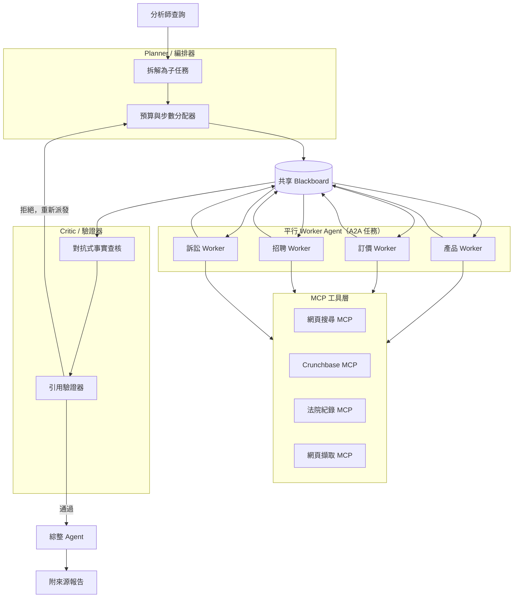
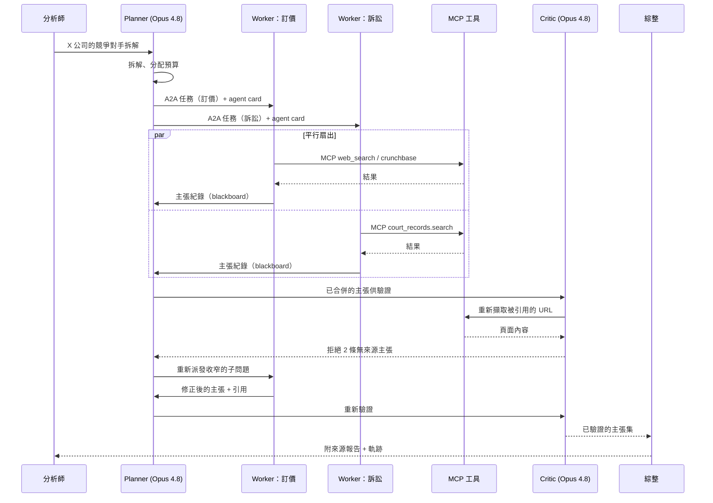

# 案例研究：多代理研究與分析系統（A2A）

一個市場情報產品要回答深入的盡職調查問題（「給我一份關於 X 公司的競爭對手拆解分析，涵蓋產品、訂價、招聘與訴訟」），這類問題通常會花掉一名分析師 30 到 90 分鐘。系統採用 orchestrator-worker-critic 架構：一個 planner 把問題拆解開來，透過 A2A v1.0 派生出多個平行的 worker agent，每個各自負責一個子問題，再由一個 critic 在綜整之前驗證每一條主張與引用。困難之處在於拆解的品質、平行的扇出（fan-out）與合併、不容許任何無來源主張的驗證，以及迴圈控制，好讓單一查詢不會在無聲無息中燒掉 $40 的 token。

## 商業問題

一家市場情報新創把「分析師等級」的報告賣給私募股權（private-equity）的襄理、企業發展（corp-dev）團隊與競爭情報部門。其旗艦級查詢就是競爭對手拆解：把一家公司從產品面、訂價、招聘訊號、募資到訴訟全面拆開，再綜整成一份附來源的簡報。人類分析師要橫跨十幾個分頁、花 30 到 90 分鐘才能完成。客戶想要的是 10 分鐘內完成、每一條主張都附來源，而且只要報告第一次捏造出一件根本不存在的訴訟，他們就會流失。

單一個強力的 agent 搭配網頁搜尋與少數幾個工具，能帶你走完 70 percent 的路。它在以下幾點上會失靈：廣度（它會把各個子題序列化執行，然後逾時）、脈絡膨脹（200 筆訴訟搜尋結果會把訂價分析給擠掉），以及驗證（寫出該主張的同一個模型，是它自己很差勁的裁判）。團隊改採多代理設計，正是為了換取平行性、每個子問題的脈絡隔離，以及一道獨立的驗證流程。

來自 2026 年 6 月現實的限制條件：

- 每次查詢的延遲預算：實際耗時（wall-clock）低於 10 分鐘；分析師能容忍進度條，但無法容忍一個轉 40 分鐘的轉圈圖示。
- 每次查詢的成本上限：平均 $3.50、硬性上限 $8。多代理會燒掉單次呼叫 4 到 15 倍的 token（[Anthropic 的多代理研究文章](https://www.anthropic.com/engineering/built-multi-agent-research-system)回報相對於聊天約 15 倍的 token 用量），所以成本控制本身就是這個專案，而非事後才補。
- 最終報告中零無來源的事實主張。每一句斷言都帶有一個客戶可以點擊的引用。
- 來源是即時網頁，加上少數幾個以工具形式接入的授權資料來源（Crunchbase、一個法院紀錄 API）；資料絕不會超過 24 小時陳舊。
- 各 agent 必須跨越行程與廠商邊界進行協調，所以代理間協定採用 [A2A v1.0](https://a2a-protocol.org/)（agent card、任務委派），而工具則透過 [MCP](https://modelcontextprotocol.io/specification/2026-03-26/) 接入。
- 1 名 ML 工程師加上 1 名兼職分析師負責 eval 標註；這套系統必須是可維運的，而不是一個研究專案。

## 架構

### 元件

| 層級 | 技術 | 用途 |
|-------|------|---------|
| Planner | Claude Opus 4.8，結構化輸出 | 拆解查詢、分配預算、決定何時停止 |
| Workers | Claude Sonnet 4.7（預設）或 DeepSeek V4 Pro（成本層級） | 各自負責一個子問題、驅動工具呼叫 |
| 代理間傳輸 | A2A v1.0（agent card、任務物件） | Planner 委派給 worker；worker 回報結果 |
| 工具傳輸 | MCP 2.0（HTTP） | agent 對工具的邊界：搜尋、擷取、授權資料來源 |
| 共享狀態 | 以 Redis 為後端、帶有主張紀錄（claim record）的 blackboard | 扇出輸入、去重、合併、浮現衝突 |
| Critic | Claude Opus 4.8，對抗式提示 | 拒絕無來源或無佐證的主張 |
| 引用驗證器 | 決定性的擷取器加上 1B NLI 模型 | 確認每一個被引用的 URL 確實支持該主張 |
| 綜整 | Claude Opus 4.8 | 把已驗證的主張組成最終簡報 |
| 編排執行環境 | LangGraph 狀態機 | 步數上限、重試、終止、可觀測性 |

### 資料流

1. 分析師提交一個查詢。planner（Opus 4.8）把它拆解成 3 到 6 個有型別的子任務，並從一個固定的總額中，為每一個分配 token 預算與步數上限。
2. planner 把子任務寫入共享 blackboard，並把每一個當作一個 A2A 任務派發給一個 worker agent，連同 agent card 一併送出，好讓 worker 知道它的範圍與工具白名單。
3. 每個 worker 在它的 MCP 工具之上跑一個 ReAct 風格的迴圈（[Yao et al., 2022](https://arxiv.org/abs/2210.03629)），蒐集證據並把主張紀錄（主張文字加上來源 URL 加上摘錄片段）寫回 blackboard。
4. worker 平行執行；編排器追蹤每個 worker 的花費，並終結任何超出其步數上限或 token 預算的 worker，把它手上有的東西回傳回來。
5. 當 worker 完成（或全域截止時間到達）時，一道去重流程會合併主張紀錄並標出衝突（例如兩個 worker 回報了不同的員工人數）。
6. critic agent（Opus 4.8）以對抗的方式審視每一條主張：它是否被所引用的摘錄片段所支持、來源是否可信、是否有任何斷言沒有附引用。無佐證的主張會被拒絕。
7. 被拒絕但有合理修正空間的主張，會帶著一個收窄的子問題與少量額外預算，被重新派發給一個 worker；連續失敗兩次的主張會被捨棄，而不是用猜的。
8. 綜整 agent 只把已驗證的主張組成最終報告，每一句都帶著它的引用，而完整的軌跡（trace）會被記錄下來，供成本與品質稽核之用。

## 關鍵設計決策

### 1. 何時單一 agent 勝過多代理

從這裡開始，因為對大多數任務而言，多代理是錯誤的預設選項。單一個 Opus 4.8 agent 搭配網頁搜尋與一個 1M 的脈絡視窗，能以更便宜的成本、更低的延遲，以及少得多的維運面，處理絕大多數的問題。Anthropic 明確指出他們的多代理系統用掉約聊天 15 倍的 token，且只有在「廣度優先」（breadth-first）且可平行化的任務上才划算（[Anthropic, 2025](https://www.anthropic.com/engineering/built-multi-agent-research-system)）。Cognition 則提出反方向的論點：天真的多代理系統很脆弱，因為脈絡無法在 agent 之間乾淨地流動（[Cognition, "Don't Build Multi-Agents"](https://cognition.ai/blog/dont-build-multi-agents)）。

我們在這裡採用多代理，恰恰是出於兩個理由，而且我們講得出來：平行性（四個子題，每個各需 15 到 30 次工具呼叫，會在最慢那一個的時間內完成，而不是全部加總），以及脈絡隔離（訴訟 worker 那 200 筆法院紀錄摘錄片段，絕不會污染到訂價 worker 的視窗）。一個深但窄的查詢（「X 公司第 2 層級的牌價是多少」）會被路由到單一 agent 的快速路徑。planner 會先做這個判斷：如果它無法把查詢拆解成真正彼此獨立的子任務，它就不拆，我們就跑單一個 agent。

### 2. A2A 與 MCP 的邊界

這兩者解決不同的問題，而我們把它們分開。[MCP](https://modelcontextprotocol.io/specification/2026-03-26/) 是 agent 對工具的邊界：一個 worker 呼叫 `web_search`、`crunchbase.company` 或 `court_records.search` 的方式都是同一套標準化做法，不論是誰打造的工具。[A2A v1.0](https://a2a-protocol.org/) 則是 agent 對 agent 的邊界：planner 把一個任務委派給一個 worker，worker 透過 agent card 公告它的能力，而結果以 A2A 任務產物（artifact）的形式流回。Google 的定調是 A2A 補足 MCP，而非取代它（[A2A 公告](https://developers.googleblog.com/en/a2a-a-new-era-of-agent-interoperability/)）。

具體來說：一個 worker 是一個 A2A 對等節點（peer），它在內部以 MCP 對它的工具說話。我們不把工具呼叫透過 A2A 隧道傳送（那會讓每一個工具都跟 agent 協定耦合），我們也不把 agent 模型化成 MCP 工具（那會丟失任務生命週期、串流進度與 agent card）。這道邊界讓我們可以透過 A2A 把訴訟 worker 換成某廠商的專家 agent，而完全不動到工具層。

### 3. Planner 拆解策略與避免過度拆解

planner 透過結構化輸出產出一份有型別的計畫：一份子任務清單，每一個都帶有一個子問題、一組被指派的工具集、一個 token 預算與一個步數上限。最大的失敗是過度拆解，把「訂價」拆成九個微任務，每一個都起一個 agent，加總起來的成本超過它們的價值。我們把計畫上限訂在 6 個子任務，並指示 planner（Opus 4.8，它會緊密遵循範圍指示）偏好更少、更廣的子任務，並為每一個提出理由。Anthropic 發現編排器對努力分配不足是一個真實的失效模式，並透過讓主導 agent 為每個 subagent 陳述明確的目標與工具預算來修正它（[Anthropic, 2025](https://www.anthropic.com/engineering/built-multi-agent-research-system)）；我們直接照搬了這個模式。

### 4. 平行扇出與結果合併

worker 彼此不交談。它們從一個共享 blackboard（Redis）讀取自己的指派、並把主張紀錄寫到上面，這是為 agent 而調整過的經典 blackboard 模式。扇出之後，一道合併步驟做三件事：依正規化後的主張文字加上來源把主張去重、把衝突（兩個不同的營收數字）浮現出來而不是默默挑一個，以及為每一條存活下來的主張附上出處（provenance）。衝突會以明確的「這些彼此矛盾，請裁決」項目交給 critic，而不是用擲銅板來解決。只共享結構化的主張紀錄、而非完整的 agent 對話紀錄，是刻意為之：它讓合併維持便宜，並避免把某個 worker 那份 40k token 的草稿（scratchpad）傾倒進下一個階段。

### 5. critic/verifier 迴圈

一個獨立的 critic 是單一個槓桿效益最高的元件。寫出某條主張的模型，是它自己很差勁的裁判，所以 critic 是一個全新的 Opus 4.8 脈絡，帶著一個對抗式提示：假設每一條主張都是錯的，直到所引用的摘錄片段證明它為止。這是把 LLM-as-judge（[Zheng et al., 2023](https://arxiv.org/abs/2306.05685)）指向驗證，再結合 Reflexion 風格的依回饋迭代（[Shinn et al., 2023](https://arxiv.org/abs/2303.11366)）。會跑兩道檢查：LLM critic 判斷該摘錄片段是否支持該主張，而一個決定性的引用驗證器會重新擷取（re-fetch）該 URL，並跑一個小型 NLI 模型，以確認該摘錄片段確實在頁面上、且蘊含（entail）該主張。一條沒有引用的主張會被直接拒絕，絕不放寬。被拒絕但可修正的主張會獲得一次重新派發，帶著一個更收窄的子問題；第二次失敗就捨棄該主張。輸出契約直白得很：沒有引用，就沒有主張。

### 6. 迴圈控制與預算（loopmaxxing 控制）

沒有硬性上限，一個多代理系統就會「loopmaxx」，不斷派生 worker 與工具呼叫，直到燒穿成本上限。各項控制，全都由 LangGraph 執行環境強制執行（[loop engineering](../07-agentic-systems/12-loop-engineering.md)）：

- 每次查詢一個全域 token 預算（預設 600k 個等效輸入 token），分配給 planner、worker、critic 與綜整。
- 每個 worker 一個步數上限（預設 12 次工具呼叫）與每個 worker 一個 token 預算；超出任一個，該 worker 就會被終結並回傳部分結果。
- 每個 worker 一個實際耗時逾時（預設 90 秒），好讓一個慢的 worker 無法卡住整個任務。
- 明確的終止條件：當所有子任務回報完成時、當全域截止時間到達時，或當每一美元換得的邊際新主張數低於某個門檻時就停止。
- 一個支出計量器，會在單一查詢超過 $8 時呼叫待命人員。

這些就是平均 $3.50 一次的查詢與一次 $40 意外之間的差別。

### 7. 用模型分層來控制 token 倍數

token 倍數就是成本的故事所在，所以我們依角色把模型分層。planner 與 critic 跑 Opus 4.8（$5 / $25 每 1M，[pricing](https://www.anthropic.com/pricing)），因為計畫品質與驗證的嚴謹度，決定了整個系統的上限。worker 預設跑 Sonnet 4.7，而對於高扇出的查詢，那些對成本敏感的子任務（廣泛的網頁掃蕩）會降到 DeepSeek V4 Pro（$0.435 / $0.87 每 1M，[DeepSeek API pricing](https://api-docs.deepseek.com/quick_start/pricing)）或 DeepSeek V4 Flash（$0.14 / $0.28）。一個四 worker 的查詢若處處都用 Opus，成本大約是分層查詢的 4 倍，而在證據蒐集上沒有任何可量測的品質增益；我們只把昂貴的模型放在判斷所在之處。

### 8. 共享狀態與訊息傳遞設計

planner 與 worker 之間的 A2A 訊息承載的是任務指派與狀態，而非大量證據。證據存放在 blackboard 上，並以 ID 來引用。這個分離很要緊：A2A 任務酬載維持小巧（快、便宜、好除錯），而 blackboard 是證據累積的唯一地點，所以去重與出處有單一的真實來源。worker 透過 A2A 串流進度事件，好讓分析師的進度條是真實的，而非一個假的動畫。blackboard 依查詢做命名空間（namespace）區隔並設了 TTL，所以一個已完成查詢的狀態不會殘留下來。

### 9. 評估一個多代理系統

我們追蹤三個端對端的指標，而非各 agent 的虛榮數字。任務成功度由一個 LLM judge 加上每週 50 案例的人工稽核來評分，對照一份由分析師撰寫的黃金報告：這份簡報是否回答了問題、且是否正確。引用精確率是引用確實支持其主張的主張所佔的比例，由決定性驗證器在每一次查詢上量測（目標超過 97 percent）。每任務成本是全包的 token 花費，依查詢追蹤並在漂移時告警。Anthropic 的指引主張多代理的 eval 需要的是以結果為基礎、端對端的評分，而非逐步的評分標準（rubric）（[Anthropic, 2025](https://www.anthropic.com/engineering/built-multi-agent-research-system)），這完全正確；這套系統有太多有效的軌跡，無法依軌跡來評分。

## 失效模式與緩解措施

### F1：失控迴圈與 token 爆量

worker 不斷派生工具呼叫；planner 不斷重新派發；花費衝破上限。緩解：每次查詢一個硬性 token 預算、每個 worker 的步數上限與 token 預算、每條主張一次的重新派發上限，以及一個支出計量器，會在 $8 時終結查詢並呼叫待命人員。預算是由執行環境強制執行的，而不是在提示裡客氣地請求。

### F2：planner 過度拆解成無意義的子任務

planner 把查詢拆成九個超具體的微任務，每一個都起一個 worker，加總起來既昂貴又不連貫。緩解：把計畫上限訂在 6 個子任務、指示 planner 偏好更少、更廣的子任務並為每一個提出理由，並在任何 worker 被派發之前，用一個會拒絕空白或重複子問題的 schema 來驗證這份結構化計畫。

### F3：worker 重複做工

兩個 worker 各自獨立地跑了相同的網頁搜尋，因為它們的子問題重疊了。緩解：planner 指派彼此不相交的範圍，帶著明確的「你負責 X，不負責 Y」邊界；blackboard 依正規化文字加上來源把主張去重，所以重複的證據會塌縮掉；一道派發前的重疊檢查會把詞彙重疊度高的子任務標出來，交給 planner 合併。

### F4：agent 彼此不同意而系統卡死

兩個 worker 回報了彼此矛盾的事實，而沒有機制可以解決它，於是報告要嘛卡住、要嘛兩者都吐出來。緩解：worker 從不裁決；衝突在合併時以明確項目浮現出來，並交給 critic，由 critic 對照所引用的來源裁決，挑出佐證較強的主張，或在簡報中誠實回報這個分歧。worker 之間沒有可以陷入僵局的協商迴圈。

### F5：worker 捏造了一個 critic 漏掉的引用

一個 worker 編造了一個看似合理的 URL，或把一條真實的主張歸到錯誤的頁面，而 LLM critic 就讓它過關了。緩解：決定性的引用驗證器是後盾，它會重新擷取每一個被引用的 URL，並跑一道 NLI 檢查，確認該摘錄片段存在於頁面上、且蘊含該主張。LLM critic 與決定性驗證器是彼此獨立的層級；一個捏造的引用即使騙過了裁判，也會在擷取這一關失敗。

### F6：一個慢的 worker 卡住整個任務

訴訟 worker 撞上一個很慢的法院紀錄 API，整個查詢就過了截止時間還在等它。緩解：每個 worker 一個實際耗時逾時（預設 90 秒）、平行執行讓那個慢的 worker 不會擋住其他人，以及優雅降級，綜整會用已完成的那些 worker 繼續進行，而報告會註記訴訟章節並不完整，而非整個卡住。

### F7：共享草稿變成脈絡膨脹問題

blackboard 累積了完整的 worker 對話紀錄，於是合併與 critic 階段被 200k token 的原始草稿給噎住。緩解：worker 只寫結構化的主張紀錄（主張、來源、摘錄片段），絕不寫它們的推理對話紀錄；blackboard 以引用方式存放證據；下游階段讀的是主張紀錄，而非對話紀錄。脈絡隔離正是走向多代理的整個重點，我們會保護它。

### F8：planner 選了個爛計畫所致的連鎖失敗

一個薄弱的初始拆解會拖垮每一個下游 worker，而系統會花掉整筆預算，為一個錯誤的問題產出一個連貫的答案。緩解：一道輕量的計畫品質關卡（這份計畫是否涵蓋了查詢所點名的各個維度）會在派發前先跑；綜整步驟會對照原始查詢檢查涵蓋度，並能在整個維度都缺漏時觸發一次重新規劃；每週的人工稽核會抓到 planner 的系統性漂移，於是 planner 的提示就會被重新調校。

## 維運考量

### 監控

| SLO | 目標 |
|-----|--------|
| 查詢實際耗時 p95 | 低於 10 分鐘 |
| 引用精確率（驗證器） | 超過 97 percent |
| 端對端任務成功度（LLM judge 加上人工稽核） | 超過 85 percent |
| 每次查詢成本（平均） | 低於 $3.50 |
| 每次查詢的失控支出事件 | 每週低於 1 次 |
| worker 逾時率 | 低於 worker 的 5 percent |

### 成本模型

在每月約 8,000 次付費查詢的情況下：

- Planner 加 critic 加綜整（Opus 4.8）：每月 $14,000
- Workers（Sonnet 4.7 預設、高扇出時用 DeepSeek V4）：每月 $9,000
- 透過 MCP 接入的授權資料來源（Crunchbase、法院紀錄）：每月 $4,500
- 引用驗證器（擷取加上 1B NLI）：每月 $600
- 編排、blackboard、可觀測性基礎設施：每月 $1,900
- Eval 與人工稽核：每月 $1,500
- 總計：每月約 $31,500，每次查詢約 $3.94

要內化的頭條數字：一次多代理查詢會燒掉單次 LLM 呼叫 4 到 15 倍的 token。決策 7 的分層，就是讓平均維持在 $3.50 以下的關鍵；沒有它，同樣的工作量跑起來會更接近每次查詢 $9。一個分析師小時的成本遠遠超過 $3.94，所以只要倍數維持有界，單位經濟（unit economics）就成立。

### 待命處置手冊

- 失控支出告警（$8 查詢）：執行環境已經終結了該查詢；確認終結確實觸發、檢查軌跡看是哪個 agent 在迴圈，若屬系統性就收緊那個 worker 的步數上限。
- 引用精確率掉到 97 percent 以下：把綜整凍結到一個更嚴格的「有任何疑慮就捨棄」模式、檢查是否有某個來源網站改了版面（弄壞了 NLI 驗證器），並重跑受影響的查詢。
- 延遲尖峰：檢查最慢那個 worker 的工具（通常是一個劣化的 MCP 資料來源）；若有備援資料來源就路由過去，否則就讓優雅降級出貨一份附帶缺口標記的部分報告。
- planner 漂移（涵蓋度漏失上升中）：拉出最近 20 份計畫、對照查詢的各維度，並重新調校 planner 的提示或 schema；不要用更多 worker 預算來打補丁。
- MCP 資料來源中斷：在報告中浮現「來源不可用」，而非放任一個 worker 圍繞這個缺口去產生幻覺；「沒有引用就沒有主張」的契約讓這在預設情況下是安全的。
- 衝突率尖峰：如果 critic 在裁決的衝突遠多於平常，很可能是某個來源錯了或陳舊了；在信任這些裁決之前先去調查該資料來源。

## 強力面試候選人會涵蓋哪些內容

- 他們會先講「何時『不』該用多代理」：大多數任務由一個強力的、帶工具的 agent 來服務會更好，而他們會具體地以平行性與脈絡隔離來為這套系統辯護，並引用約 15 倍的 token 倍數。
- 他們會把 A2A 與 MCP 的邊界畫得乾乾淨淨：A2A 用於 agent 對 agent 的委派與 agent card，MCP 用於 agent 對工具的呼叫，而且他們會拒絕把兩者混為一談。
- 他們會把 critic 當成槓桿效益最高的元件，並解釋為何一個全新的對抗式脈絡加上一個決定性的引用驗證器勝過自我審查，並援引 LLM-as-judge 與 Reflexion。
- 他們會點出具體的迴圈控制（每次查詢的 token 預算、每個 worker 的步數上限、逾時、終止條件、支出終結開關），並把它們綁到一個真實的美元上限上。
- 他們會依角色把模型分層（planner 與 critic 用 Opus，worker 用 Sonnet 或 DeepSeek），並能算出這個倍數的成本帳。
- 他們會做端對端的評估（任務成功度、引用精確率、每任務成本），而非為個別 agent 步驟評分，而且他們會在迴圈中保留人工稽核。
- 他們會把扇出與合併圍繞著結構化的主張紀錄與一個 blackboard 來設計，而非共享完整對話紀錄，並且明確地處理衝突，而不是擲銅板。

## 參考資料

- Anthropic, [How we built our multi-agent research system](https://www.anthropic.com/engineering/built-multi-agent-research-system)
- Google, [A2A: A new era of agent interoperability](https://developers.googleblog.com/en/a2a-a-new-era-of-agent-interoperability/)
- [A2A Protocol specification](https://a2a-protocol.org/)
- [Model Context Protocol specification 2026-03-26](https://modelcontextprotocol.io/specification/2026-03-26/)
- Yao et al., [ReAct: Synergizing Reasoning and Acting in Language Models](https://arxiv.org/abs/2210.03629)
- Shinn et al., [Reflexion: Language Agents with Verbal Reinforcement Learning](https://arxiv.org/abs/2303.11366)
- Zheng et al., [Judging LLM-as-a-Judge with MT-Bench and Chatbot Arena](https://arxiv.org/abs/2306.05685)
- Cognition, [Don't Build Multi-Agents](https://cognition.ai/blog/dont-build-multi-agents)
- LangChain, [LangGraph for agent orchestration](https://langchain-ai.github.io/langgraph/)
- Microsoft, [AutoGen multi-agent framework](https://microsoft.github.io/autogen/)
- Anthropic, [Model pricing](https://www.anthropic.com/pricing)
- DeepSeek, [API pricing](https://api-docs.deepseek.com/quick_start/pricing)

相關章節：[Multi-Agent Orchestration](../07-agentic-systems/04-multi-agent-orchestration.md)、[Tool Use and MCP](../07-agentic-systems/03-tool-use-and-mcp.md)、[Loop Engineering](../07-agentic-systems/12-loop-engineering.md)。
