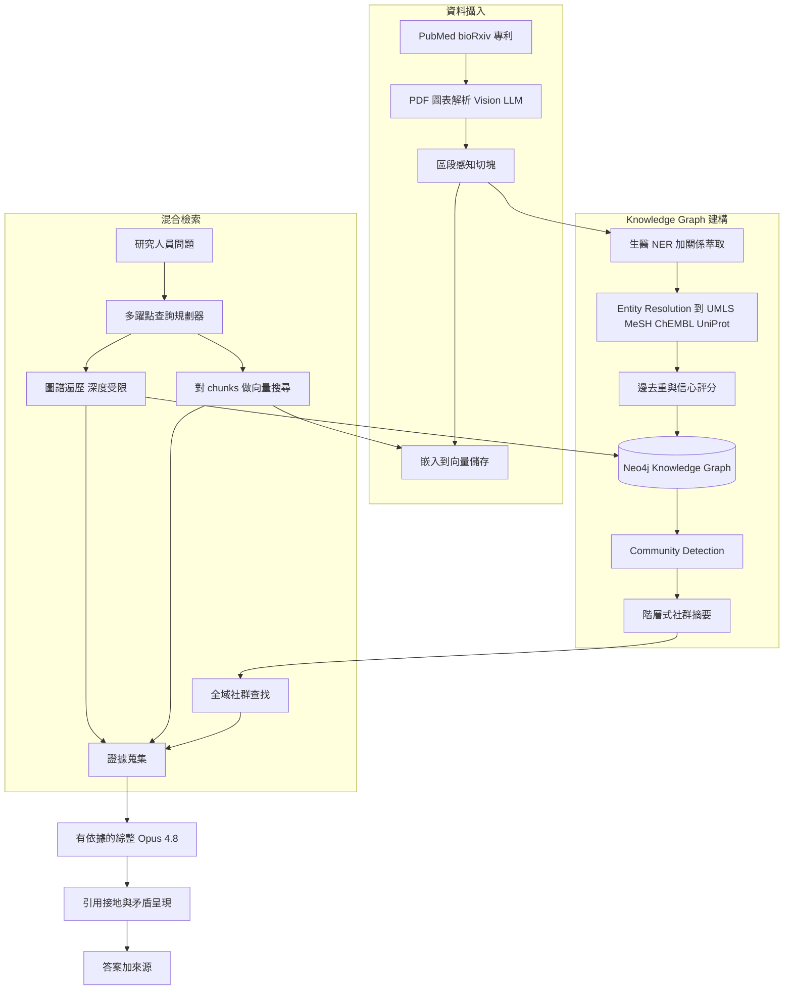
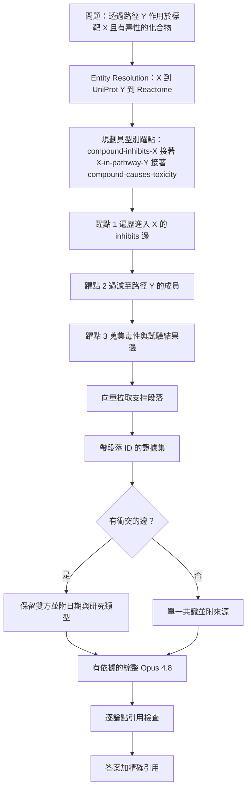

# 案例研究：用於藥物發現的科學文獻 GraphRAG

一個生技研究平台在大約 3,000 萬篇論文、專利與預印本之上建構 GraphRAG，讓研究人員能提出多躍點（multi-hop）的問題，例如「哪些化合物會透過路徑 Y 來調節標靶蛋白 X，又有哪些已被報告的毒性或失敗的試驗」。純向量 RAG 在這裡會失效，因為答案存在於一連串具型別的關係之中（化合物到標靶、到路徑、到疾病、到試驗結果），而沒有任何單一 chunk 能涵蓋這整條鏈；而且研究人員在拿到能精確回溯到來源段落的引用之前，是不會根據某個論點採取行動的。

## 商業問題

一家中型生技公司的藥物發現團隊，在人工文獻回顧上耗費數月。一位研究激酶（kinase）標靶的藥物化學家需要知道：哪些化合物已知會作用於它、透過哪些路徑、已被報告的脫靶（off-target）毒性有哪些、以及哪些臨床試驗失敗了又是為什麼。那個答案散落在 PubMed 摘要、bioRxiv 預印本、藏在圖表背後的全文 PDF，以及專利申請文件之中。單一個問題就可能讓一位研究助理花上兩到三週，而且在他們完成的隔天答案就已經過時，因為每天都有數千篇新論文發表。

團隊建構 GraphRAG：從語料庫中萃取實體與具型別的關係，建成一個 knowledge graph，把實體正規化到規範的生醫本體論（ontology），再透過遍歷圖譜加上對底層段落做向量搜尋來回答問題。目標是把一場三週的文獻回顧，變成一個三分鐘、有依據、附帶化學家會信任的引用的答案。

來自 2026 年 6 月現實的限制條件：

- 語料庫約有 3,000 萬份文件（PubMed 摘要、bioRxiv/medRxiv 預印本、全文 PDF、USPTO 與 EPO 專利語料），每天約成長 4,000 份文件
- 答案必須帶有指向來源段落的精確引用；一個沒有出處的論點對化學家而言毫無價值，在法規申報文件中更是一種風險
- 同一個生物實體有數十種表面形式（基因 `ERBB2` 也叫 `HER2`、`NEU`、`CD340`、`p185`）；entity resolution 才是整場比賽的勝負關鍵
- 文獻會公然自相矛盾；系統必須把雙方都呈現出來，而不是把它們平均成一個虛假的共識
- 在 3,000 萬份文件的規模下做萃取，無法為每份文件都跑前沿模型；每 token 的成本會高到難以負擔
- 撤稿與試驗失敗必須快速傳播；一個仍然斷言著某個已撤稿發現的過時圖譜，比沒有答案更糟

團隊選擇微軟的 GraphRAG 做法（[Edge et al., 2024](https://arxiv.org/abs/2404.16130)、[GraphRAG repo](https://github.com/microsoft/graphrag)）來做 community detection 與階層式摘要，採用 Neo4j（[docs](https://neo4j.com/docs/)）作為圖譜儲存，並把每一個實體正規化到 UMLS、MeSH、ChEMBL 與 UniProt。萃取在較便宜的模型上以語料庫規模執行（DeepSeek V4 Flash，[docs](https://api-docs.deepseek.com/)）；最終的綜整在推理品質與引用紀律最為要緊之處，跑在 Claude Opus 4.8 上（[model card](https://www.anthropic.com/claude/opus)）。

## 架構

### 元件

| 層級 | 技術 | 用途 |
|-------|------|---------|
| 文件解析 | Vision LLM（Gemini 3.1 Pro）加上 GROBID 做版面分析 | 從 PDF 中萃取文字、圖、表 |
| 切塊與嵌入 | 區段感知切分器、voyage-3 嵌入 | 對段落做向量召回 |
| 實體與關係萃取 | 微調過的 BioBERT NER 加上 DeepSeek V4 Flash 做關係 | 在語料庫規模下做便宜的萃取 |
| Entity resolution | UMLS Metathesaurus、MeSH、ChEMBL、UniProt 連結器 | 把表面形式正規化為規範 ID |
| 圖譜儲存 | Neo4j 搭配 APOC 與 GDS | 具型別的多躍點遍歷 |
| 社群層 | Leiden detection 加階層式摘要 | 全域性問題（微軟 GraphRAG） |
| 查詢規劃器 | Opus 4.8 搭配結構化工具呼叫 | 拆解多躍點問題 |
| 綜整 | Claude Opus 4.8 | 附帶引用、有依據的答案 |

### 資料流

1. 新文件每小時抵達；解析器使用 vision LLM 加上 GROBID，從純文字萃取會漏掉的 PDF 中還原出文字、圖說與表格儲存格。
2. 每份文件被切成區段感知的 chunks、做嵌入，並以一個穩定的段落 ID 寫入向量儲存。
3. 萃取階段先跑生醫 NER（微調過的 BioBERT）找出實體，再用 DeepSeek V4 Flash 萃取它們之間具型別的關係（例如 `inhibits`、`upregulates`、`causes_toxicity`）。
4. Entity resolution 把每個表面形式對應到一個規範 ID：基因／蛋白質對應到 UniProt、藥物對應到 ChEMBL、概念對應到 UMLS/MeSH；未能解析的實體會被隔離，而不是被合併。
5. 邊會被去重，每一條都帶有一個信心分數以及指回確切來源段落的反向指標；圖譜寫入 Neo4j。
6. Leiden community detection 把密集連接的實體分群；一個 LLM 為每個社群寫一份階層式摘要，用於回答全域性的「這個領域目前的狀態如何」這類問題。
7. 在查詢時，規劃器把問題拆解成圖譜躍點加上向量子查詢，以受限的深度遍歷 Neo4j，並從圖譜的邊與向量搜尋兩邊蒐集段落。
8. Opus 4.8 綜整出答案，把每一個論點接地到一個段落 ID，並把矛盾以明確的「衝突證據」區塊呈現出來，而不是把它們壓平。

## 關鍵設計決策

### 1. 為何純向量 RAG 在這裡會失效

向量 RAG 檢索與查詢最相似的 top-k chunks，並把它們塞進提示。當答案就坐落在某個 chunk 之內時，這個做法行得通。但它在這個領域上會因為三件事而失效。第一，多躍點：「透過路徑 Y 作用於標靶 X 且有已報告毒性的化合物」需要串接 `compound -> target -> pathway -> disease -> trial`，而沒有任何單一 chunk 會陳述整條鏈。第二，關係的型別化：向量相似度能找到同時提及某個化合物與某個蛋白質的段落，但它分不出 `inhibits`、`is_inhibited_by` 與 `unrelated_to` 的差別，而方向性正是全部的臨床意義所在。第三，全域性問題：「整份文獻對於機制 Z 的共識是什麼」需要在數千份文件上做聚合，而 top-k 檢索在結構上根本做不到（這正是微軟 GraphRAG 論文（[Edge et al., 2024](https://arxiv.org/abs/2404.16130)）所要解決的失效）。圖譜把關係明確地編碼進去，於是遍歷能回答相似度做不到的事。

### 2. KG 建構管線與雜訊問題

建構就是萃取、然後正規化、然後去重，而雜訊會在每一步進入。科學文本充滿了有所保留的論點（「X 在缺氧條件下可能會調節 Y」）、否定（「X 並未抑制 Y」）與臆測。天真的萃取會把「並未抑制」變成一條 `inhibits` 邊，這是一個自信滿滿的謊言。我們先跑 NER（在生醫語料上微調過的 BioBERT）來錨定實體，再在 DeepSeek V4 Flash 上跑一道關係萃取，並提示它去捕捉極性（polarity）與情態（modality），輸出 `{subject, relation, object, polarity, confidence, passage_id}`。低於信心下限的邊會被保留但標記為低信任，而不是被丟棄，因為對探索性研究而言召回很重要。我們絕不讓萃取寫出一條沒有段落反向指標的邊；沒有出處的邊會被丟掉。

### 3. 對規範本體論做 entity resolution

這是成敗攸關的決策。`HER2`、`ERBB2`、`NEU`、`CD340` 與 `p185` 是同一個基因；如果它們以五個節點的形式存在，圖譜就被打碎了，遍歷會漏掉三分之二的證據。我們把每一個被萃取出的實體正規化為一個規範 ID：蛋白質與基因對應到 UniProt（[uniprot.org](https://www.uniprot.org/)）與 HGNC 符號、藥物與化合物對應到 ChEMBL（[chembl](https://www.ebi.ac.uk/chembl/)）、一般生醫概念對應到 UMLS（[UMLS](https://www.nlm.nih.gov/research/umls/index.html)）與 MeSH（[MeSH](https://www.nlm.nih.gov/mesh/meshhome.html)）。連結器使用 scispaCy（[scispaCy](https://allenai.github.io/scispacy/)）做候選生成，加上一個嵌入式重排器，並設有一個棄答門檻。關鍵在於，當連結器沒有信心時，它不會用猜的；一個含糊的提及會變成它自己的暫定節點並標記待審，而不是被合併到錯誤的規範實體裡。一個錯誤的合併，遠比一個漏掉的合併更具破壞性。

### 4. 混合的圖譜加向量檢索

圖譜與向量解決的是不同的問題，所以我們兩者都跑。圖譜對結構是精確的：它透過跟隨具型別的邊、帶著確切的方向與出處，來回答「什麼會抑制這個激酶」。向量搜尋對措辭是寬容的：它能召回那些用萃取器從未轉成一條邊的語言來描述某個機制的段落，從而捕捉到圖譜漏掉的長尾。規劃器先用圖譜找出相關的實體鄰域，再用向量搜尋把那些實體周圍的支持段落拉進來，然後合併並重排。這正是 HippoRAG（[Gutierrez et al., 2024](https://arxiv.org/abs/2405.14831)）那種把圖譜結構與稠密召回結合起來的直覺，而在我們的多躍點評估集上，它一貫地勝過單獨使用任一者。

### 5. 用於全域性問題的 community detection 與階層式摘要

局部遍歷回答的是特定問題。「某個標靶類別的整體研究狀態如何」是一個沒有任何局部鄰域能涵蓋的全域性問題。依循微軟 GraphRAG，我們在圖譜上跑 Leiden community detection，然後讓一個 LLM 為每個社群寫一份摘要，再把那些摘要彙整成一個階層。一個全域性問題會路由到階層的頂端再往下鑽，於是模型是在預先摘要過的群集上推理，而不是試圖去讀三萬個段落。我們以比圖譜本身更慢的節奏（每週）刷新社群摘要，因為它們重新生成的代價很高，而且全域結構移動得很慢。

### 6. 多躍點查詢規劃與遍歷深度控制

無上限的遍歷是一顆組合爆炸的炸彈：一個從像 `TP53` 這樣連接緊密的樞紐出發的三躍點查詢，可能會碰到數十萬個節點。規劃器（Opus 4.8）把問題拆解成一個具型別的遍歷計畫，帶有明確的深度上限（預設 3 躍點）與每躍點的扇出（fan-out）上限。我們利用邊的信心與關係型別過濾器來積極剪枝，讓一個關於抑制的查詢不會跑去 `co-mentioned-with` 的邊上遊蕩。如果一個計畫會超出節點預算，規劃器會收窄關係型別，或是請研究人員去約束問題，而不是去跑一個會花掉 $40 又逾時的查詢。

### 7. 引用接地與回溯到來源段落的出處

化學家不會信任一個沒有出處的論點，而且這完全合理。每一條邊都帶有一個 `passage_id`，指向它所來自的確切句子，而綜整被約束成必須把每一句陳述接地到一個被檢索出的段落。輸出會渲染出內嵌的引用，連結到來源論文與被標出的片段。我們會跑一道綜整後的驗證，檢查每一個被引用的段落是否真的支持該論點；如果一句話沒有支持它的段落，它就會被剪掉，而不是出貨。這就是把一個研究工具與一台聽起來煞有介事的幻覺引擎區分開來的紀律。

### 8. 呈現矛盾，而不是把它們平均掉

文獻不斷地彼此不一致：一篇 2019 年的論文報告某個化合物是安全的，一篇 2023 年的論文報告了肝毒性。把這些平均成「可能有些毒性」是最糟糕的答案。當圖譜在相同的實體之間持有衝突的邊時（相反的極性，或矛盾的結果），綜整會把雙方連同它們的證據、日期、樣本數與研究類型一併呈現，並讓研究人員自行判斷。我們會明確地對時近性（recency）與撤稿狀態加權，但絕不悄悄丟掉少數方的觀點；衝突本身就是訊號。

### 9. 增量式的新鮮度與 KG 重建成本

每天四千份文件意味著完整重建永遠不被接受；從頭重建 3,000 萬份文件的圖譜，在算力上是五到六位數，牆鐘時間是好幾天。我們改採增量式攝入：新文件流經萃取與 entity resolution，寫入新的節點與邊，而不去動圖譜的其餘部分。只有成員顯著變動的社群，其摘要才會被重新計算。撤稿是一條特別的快速路徑：一則撤稿通知會在一小時內把受影響的邊翻轉成 `retracted` 狀態，好讓綜整能立即把它們降權或排除。

## 失效模式與緩解措施

### F1：萃取造出一條假的邊

關係萃取器讀到「X 並未抑制 Y」卻寫出一條 `inhibits` 邊，斷言了與事實相反的內容。緩解措施：萃取提示明確捕捉極性與情態；一個否定與保留語氣分類器作為第二道而執行；低信心的邊被標記為低信任，並從高風險的綜整中排除；我們每週對新邊做隨機抽樣，對照來源段落稽核，並追蹤萃取精確率（目前約 91 percent，目標超過 90）。

### F2：Entity resolution 把兩個不同的蛋白質合併

連結器把兩個共享某個表面形式的不同蛋白質塌縮成一個節點，於是現在每一個下游遍歷都把它們的證據混在一起。緩解措施：一個棄答門檻使含糊的提及變成暫定節點，而不是被強制合併；合併是可逆且有記錄的；我們維護一份經策展的已知含糊符號封鎖清單，這些符號在合併前永遠需要人工確認。

### F3：多躍點遍歷組合式地爆炸

一個從樞紐節點出發的查詢扇出到數十萬個節點，查詢逾時，成本飆升。緩解措施：深度上限（預設 3）、每躍點扇出上限、關係型別剪枝，以及一個會中止計畫並請研究人員收窄範圍的節點預算，而不是去跑一個失控的查詢。任何碰到超過 50,000 個節點的查詢我們都會發出警報。

### F4：過時的圖譜漏掉一則撤稿

一篇論文被撤稿了，但圖譜仍然斷言著它的發現，於是系統自信地引用了已被否定的科學。緩解措施：一條撤稿快速路徑每小時攝入 Retraction Watch 與 PubMed 的撤稿通知，並在一小時內把受影響的邊翻轉成 `retracted`；綜整預設排除已撤稿的邊，並對任何原本會依賴某一條的答案加以標示。

### F5：矛盾的發現被塌縮成虛假的共識

系統挑了一個真實科學分歧中的一方，並把它當作既定事實呈現。緩解措施：對相同實體之間相反極性與衝突結果的邊做矛盾偵測（關鍵設計決策 8）；綜整器被要求把雙方連同日期、研究類型與樣本數一併呈現；我們在一個有標註的爭議集上，專門評估「我們是否藏起了一個已知的矛盾」。

### F6：幻覺出來的引用

模型憑空捏造一個引用，或是把一個真實的引用附到一個該段落並不支持的論點上。緩解措施：綜整只能引用實際被檢索出來的段落 ID；一個綜整後的驗證器會對照其被引用的段落檢查每一個論點，並剪掉任何不被支持的句子；引用渲染為指向來源片段的即時連結，好讓審查者能一鍵抽查。這與 RAG faithfulness 研究所要求的接地嚴謹度相同。

### F7：純文字攝入漏掉圖與表的資料

一個關鍵的劑量反應結果只存在於一張圖或一張表裡，而一個純文字的解析器永遠看不到它，於是圖譜在無聲無息中變得不完整。緩解措施：攝入管線使用一個 vision LLM 來解析圖、圖說與表格儲存格（驅動更豐富攝入的長脈絡限制，記載於 Lost in the Middle,[Liu et al., 2023](https://arxiv.org/abs/2307.03172)）；表格儲存格變成結構化的邊；我們抽樣文件來量測圖／表萃取的涵蓋率，並把涵蓋率下降視為一次管線回歸。

### F8：KG 重建的停機時間

一次 schema 變更或一次重新萃取迫使圖譜重建，服務黑掉好幾個小時。緩解措施：增量更新是預設，所以完整重建很罕見；當重建無可避免時，我們建構到一個影子（shadow）圖譜裡，並以一個讀取別名（read alias）原子式地切換，好讓研究人員永遠看不到停機；影子建構在切換前會對照活躍圖譜，在一組金絲雀（canary）查詢集上做驗證。

## 維運考量

### 監控

| SLO | 目標 |
|-----|--------|
| 查詢 p95 延遲（多躍點） | 低於 8 s |
| 萃取精確率（每週抽樣） | 超過 90 percent |
| Entity resolution 準確率（抽樣） | 在已連結的提及上超過 95 percent |
| 引用忠實度（每一論點皆接地） | 超過 99 percent |
| 撤稿傳播延遲 | 低於 1 小時 |
| 攝入新鮮度（從發表到可查詢） | 低於 6 小時 |

### 成本模型

在一個約 3,000 萬份文件圖譜上的穩態：

- 初始 KG 建構（一次性，萃取加解析加社群摘要）：約 $180K 算力
- 增量攝入（每天約 4,000 份文件，萃取跑在 DeepSeek V4 Flash 上）：每月約 $6,500
- Neo4j 託管（圖譜加 GDS，大型實例）：每月約 $9,000
- 向量儲存與嵌入刷新：每月約 $3,500
- 社群摘要重新生成（每週）：每月約 $2,000
- 綜整（Opus 4.8 跑在研究人員查詢上）：以目前的量計算每月約 $5,000
- 總運行費率：每月約 $26,000，視遍歷深度而定，每次多躍點查詢約 $0.45 到 $1.20

對照研究助理在每個深度文獻問題上花費的兩到三週時間，單一個被回答的問題就抵得上好幾週的平台成本。

### 待命處置手冊

- 萃取精確率下降：暫停寫入新邊，對照來源段落抽樣出問題的文件類別，回滾這個壞掉的批次，在恢復前重新訓練或重新提示萃取器。
- 失控查詢／成本尖峰：殺掉超出節點預算的查詢，收緊扇出上限，找出樞紐節點並把它加入高成本觀察清單。
- 撤稿延遲警報：確認撤稿來源正在流動；若停滯，手動跑一次撤稿掃描，並立即排除受影響的邊。
- Entity resolution 事故（回報了一個錯誤合併）：透過可逆合併日誌取消合併，把該符號加入人工確認封鎖清單，對受影響的鄰域重新跑一次解析。
- 攝入積壓：擴增萃取 worker；若 vision 解析器是瓶頸，就退回到純文字並附上一個涵蓋率旗標，而不是讓新鮮度滑出 SLO 之外。
- 需要重建：建構到影子圖譜裡，在金絲雀查詢集上驗證，原子式地切換讀取別名，讓舊圖譜保持熱備以便快速回滾。

## 強力面試候選人會涵蓋哪些內容

- 他們會精確地解釋為何純向量 RAG 會失效（多躍點鏈、關係的型別化與方向、全域性聚合），而不只是斷言「圖譜比較好」。
- 他們會把對規範本體論做 entity resolution（UniProt、ChEMBL、UMLS、MeSH）當作核心風險，並論證一個錯誤的合併比一個漏掉的合併更糟。
- 他們會把圖譜遍歷與向量召回結合起來，並闡述每一者各自貢獻了什麼，點名引用 GraphRAG 與 HippoRAG。
- 他們會用深度上限、扇出上限、關係剪枝與節點預算來控制組合式爆炸，並為一個失控的查詢標上一個美元數字。
- 他們會把引用接地視為不可妥協：每一個論點都回溯到一個段落，並有一道會剪掉不被支持句子的驗證。
- 他們會連同日期與研究類型一起呈現矛盾，而不是把它們平均掉，並以一條快速路徑處理撤稿。
- 他們會誠實地估量建構與運行成本，並設計增量式攝入加上影子圖譜切換，好讓新鮮度永遠不會逼出停機。

## 參考資料

- Edge et al., [From Local to Global: A Graph RAG Approach to Query-Focused Summarization](https://arxiv.org/abs/2404.16130)
- Microsoft, [GraphRAG repository](https://github.com/microsoft/graphrag)
- Gutierrez et al., [HippoRAG: Neurobiologically Inspired Long-Term Memory for LLMs](https://arxiv.org/abs/2405.14831)
- Liu et al., [Lost in the Middle: How Language Models Use Long Contexts](https://arxiv.org/abs/2307.03172)
- [Neo4j documentation](https://neo4j.com/docs/)
- [UMLS Metathesaurus](https://www.nlm.nih.gov/research/umls/index.html)
- [Medical Subject Headings (MeSH)](https://www.nlm.nih.gov/mesh/meshhome.html)
- [ChEMBL database](https://www.ebi.ac.uk/chembl/)
- [UniProt](https://www.uniprot.org/)
- [scispaCy: biomedical NER and entity linking](https://allenai.github.io/scispacy/)
- Lee et al., [BioBERT: a pre-trained biomedical language representation model](https://arxiv.org/abs/1901.08746)
- [Retraction Watch database](https://retractionwatch.com/)

相關章節：[GraphRAG](../06-retrieval-systems/07-graph-rag.md)、[Agentic RAG](../06-retrieval-systems/08-agentic-rag.md)、[Data Engineering for AI](../06-retrieval-systems/15-data-engineering-for-ai.md)。
