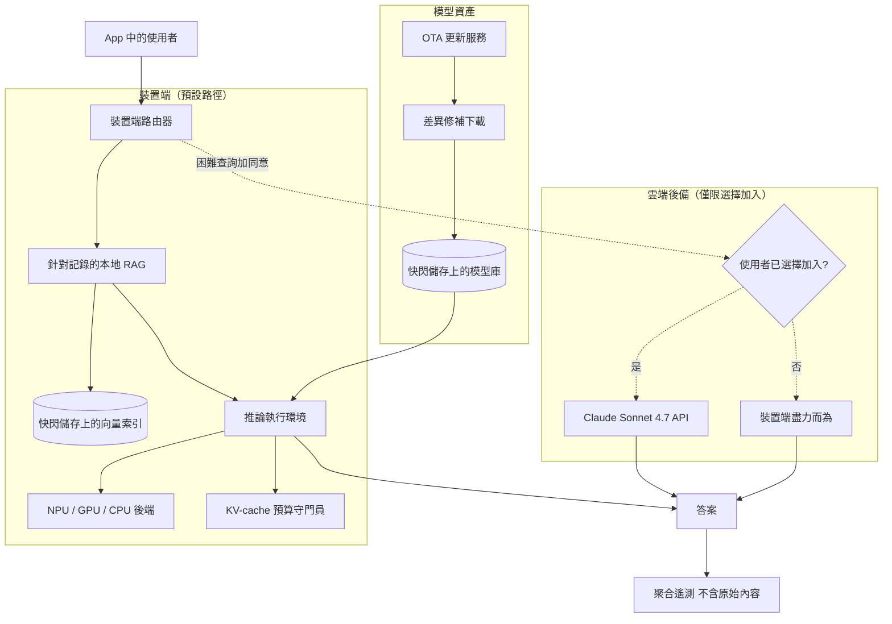
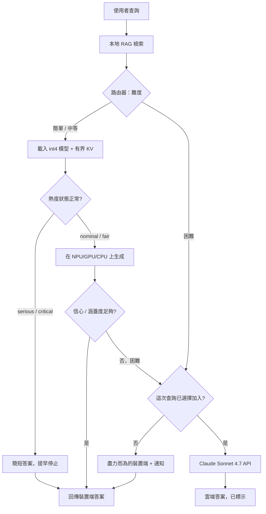

# 案例研究：隱私優先行動 App 的裝置端 AI 助理

一款擁有約 5M 安裝量的消費型健康記錄 App，推出了一個 on-device AI 助理，讓使用者資料永遠不離開手機，這個功能在沒有訊號的飛機上也能運作，而且每次查詢的雲端成本為零。它透過 llama.cpp 與 Core ML 執行一個 GGUF int4 的量化小模型，並且只在使用者明確選擇加入時，才針對困難查詢採用一條通往前沿模型的可選雲端後備路徑。

## 商業問題

這款 App 讓使用者記錄症狀、情緒、睡眠與用藥備註。產品團隊想要一個助理，能夠摘要「我這個月的睡眠趨勢如何」、根據過去 90 天草擬一份就診準備筆記，並回答「我在換新藥之後有沒有記錄過頭痛」。這些資料相當私密，其中大部分可說是 GDPR 第 9 條所定義的健康資料，也正是一旦外洩使用者就會刪除 App 的那種東西。隱私團隊的底線是：在預設情況下，原始記錄內容絕對不能離開裝置。這排除了預設架構（把每一個 prompt 都送往雲端 API），並迫使助理必須跑在手機上，連同這所隱含的一切限制。

來自 2026 年 6 月現實的限制條件：

- 約 5M 安裝量，分布在一條長尾的裝置上：安裝基數中位數的 Android 手機只有 6 GB RAM 與一顆 3 年前的 SoC，而非配備 NPU 的旗艦機
- 隱私預設為 on-device；雲端後備是逐次查詢選擇加入的，而且必須毫不含糊，因為整個品牌承諾就是「你的記錄留在你的手機上」
- 這個功能必須能完全離線運作，所以一次伺服器來回不能落在熱路徑（hot path）上
- 在這個規模下，每次查詢的雲端成本必須趨近於零：5M 使用者就算每天只查幾次前沿 API，也會是免費方案無法吸收的六位數月帳單
- App Store 與 Play Store 的審查者會懲罰耗電與龐大的 App 體積；一個 4 GB 的模型不可能隨二進位檔一起夾帶
- iOS 與 Android 在加速堆疊上分歧得很厲害（透過 Core ML 的 Apple Neural Engine，相對於透過 QNN 與 Android NNAPI 的 Qualcomm Hexagon），所以「模型跑得快」其實是兩個不同的工程問題

團隊選擇了一個在本地執行的量化小模型。基底是針對廣大裝置長尾的 [Gemma 4 2B](https://ai.google.dev/gemma)，以及一個閘控給 12 GB 以上 RAM 手機的 [Gemma 4 9B](https://ai.google.dev/gemma) 變體，兩者都是 GGUF int4。執行環境在 Android 上是 [llama.cpp](https://github.com/ggml-org/llama.cpp)（在有 NNAPI/QNN 的地方做卸載），在 iOS 上則是 [Core ML](https://developer.apple.com/documentation/coreml) 加上 [Apple Foundation Models](https://developer.apple.com/documentation/foundationmodels)。當使用者選擇加入時，雲端後備會透過 API 走向 Claude Sonnet 4.7。

## 架構

### 元件

| 層級 | 技術 | 用途 |
|-------|------|---------|
| 裝置端模型 | [Gemma 4 2B / 9B](https://ai.google.dev/gemma)，GGUF int4 | 無需網路的本地生成 |
| 執行環境（Android） | [llama.cpp](https://github.com/ggml-org/llama.cpp)，已評估 [MLC LLM](https://llm.mlc.ai/) | 可攜的 GGUF 推論加上 NPU 卸載 |
| 執行環境（iOS） | [Core ML](https://developer.apple.com/documentation/coreml) 加上 [Foundation Models](https://developer.apple.com/documentation/foundationmodels) | ANE 加速的推論 |
| 加速 | [Apple Neural Engine](https://developer.apple.com/documentation/coreml)、[Qualcomm QNN/Hexagon](https://www.qualcomm.com/developer/software/qualcomm-ai-engine-direct-sdk)、[Android NNAPI](https://developer.android.com/ndk/guides/neuralnetworks) | 把 matmul 從 CPU 上卸載出去 |
| 本地 RAG | 小型 embedding 模型加上快閃儲存上的向量索引 | 把答案紮根在使用者自己的記錄上 |
| 路由器 | 裝置端啟發式分類器 | 決定 on-device 還是選擇加入雲端 |
| 雲端後備 | 透過 [API](https://docs.anthropic.com/en/api/overview) 的 Claude Sonnet 4.7 | 困難查詢，僅在同意下 |
| OTA 更新 | 差異/修補下載服務加上[分階段推出](https://developer.android.com/guide/playcore/in-app-updates) | 不靠 4 GB 的 App 更新就能推送新權重 |
| 遙測 | 聚合計數器，不含原始文字 | 隱私保護的評估與維運 |

### 資料流

1. 使用者在 App 中提出問題。路由器完全在裝置端執行，且永不因網路而阻塞。
2. 本地 RAG 從快閃儲存上的向量索引取出相關的記錄條目，並以一個小型的裝置端 embedding 模型把查詢嵌入。
3. 路由器對難度進行分類。簡單與中等的查詢（摘要、趨勢查找、以檢索為基礎的紮根答案）留在裝置端。
4. 執行環境從模型庫載入量化模型，配置一個有界的 KV cache 並進行生成，在裝置有提供 NPU 或 GPU 後端時卸載過去，沒有時則退回到 CPU。
5. 如果路由器把查詢標記為困難（多步推理、小模型無法勝任的長篇綜整），它會檢查逐次查詢的雲端同意狀態。在沒有同意的情況下，它會降級為裝置端盡力而為的答案並告知使用者。
6. 在明確的逐次查詢同意下，遮蔽後的查詢加上一個最小的脈絡視窗會被送往 Claude Sonnet 4.7；回應傳回後，會帶著清楚的「於雲端回答」標記呈現出來。
7. 答案呈現出來。OTA 服務在背景檢查是否有新的模型修訂版，若有，則只下載相對於已安裝權重的差異修補。
8. App 只送出聚合遙測：延遲分桶、tokens/sec、後備率、按讚/按倒讚、電池等級。記錄內容、prompt 與 completion 都不會透過遙測離開裝置。

## 關鍵設計決策

### 1. 依行動裝置 RAM 而非依跑分來決定模型大小

具約束力的限制不是品質，而是在 OS、App 與一個可用的 KV cache 旁邊還能塞下什麼。在一支 6 GB 的 Android 手機上，OS 與其他 App 通常會占用 3.5 到 4.5 GB，而 Android 的低記憶體終結者（low-memory killer）會在 RAM 觸底前就先收割前景 App。一個 int4 的 [Gemma 4 2B](https://ai.google.dev/gemma) 大約是 1.4 到 1.6 GB 的權重，這替幾千個 token 的 KV cache 以及 App 本身留下了餘裕。一個 9B int4 約是 5 GB 的權重，在 6 GB 上根本行不通，只有在 12 GB 以上的裝置上才安全。所以我們把 2B 作為通用預設，並把 9B 閘控給在執行期偵測到的高 RAM 手機。從 [llama.cpp 的行動裝置指引](https://github.com/ggml-org/llama.cpp/discussions)以及更廣大的 edge 社群得到的教訓是：你要對齊最差的常見裝置來決定大小，而不是 demo 裡的那支旗艦機。

### 2. 量化：int4 GGUF，以及品質實際上是在哪裡崩掉的

我們量化到 4-bit（GGUF `Q4_K_M`），因為那是曲線的拐點：它相對於 FP16 把權重記憶體砍掉約 4x，並且是在裝置長尾上塞得下與塞不下之間的差別。品質代價是真實的，但取決於任務。在我們的黃金測試集（golden set）上，int4 的 Gemma 4 2B 在摘要與以檢索為基礎的紮根答案上，相對於 FP16 的 2B 損失約 0.5 到 1.0 分，使用者不會注意到，但它在跨許多條目的多步算術上損失明顯更多，而那正是我們導向雲端後備的那一類。讓 4-bit 權重得以可接受背後的技術是 activation-aware 量化（[AWQ, arXiv 2306.00978](https://arxiv.org/abs/2306.00978)）；GGUF 的 k-quants 實作了一個類似的「保護顯著權重」想法。我們不會在 2B 上低於 4-bit：3-bit 與 2-bit 能省記憶體，但在這個模型大小上的品質懸崖陡到足以讓這個功能不再值得信賴。

### 3. on-device 與雲端後備之間的界線

這是整個品牌賴以為繫的決策。預設一切都在 on-device，沒有例外，沒有靜默的網路呼叫。路由器只在以下情況才提議雲端後備：(a) 查詢被分類為困難，且 (b) 裝置端的草稿未通過一道內部的信心/涵蓋度檢查。即便如此，沒有一個明確的、逐次查詢的、會點名目的地的同意點按，任何東西都不會離開手機（「把這個問題送往雲端以取得更好的答案？這次查詢所涉及的記錄條目將會被送出」）。同意是逐次查詢的，而不是一個全域開關，因為一個一次性的「允許雲端」切換正是使用者會被嚇到的方式。經濟形狀也很重要：讓預設保持 on-device 正是讓每次查詢的雲端成本趨近於零的原因，因為只有一小片選擇加入的切片會真正打到 API。

### 4. 電池與熱度預算

手機不是伺服器：持續的推論會讓 SoC 發熱、OS 會把時脈降頻，而在負載超過 30 到 60 秒之後 tokens/sec 會斷崖式下滑。一顆旗艦 NPU 在一個 2B int4 上一開始或許能做到 20 到 40 tokens/sec，接著在熱節流（thermal throttling）下穩定到那個的一半；一條中階純 CPU 的路徑可能從 6 到 10 tokens/sec 起跳並節流到更低。我們明確為此編列預算：在裝置端限制生成長度（長篇綜整是雲端後備的候選），偏好 NPU/GPU 後端，因為它每 token 遠比 CPU 更省電，並且盯著 OS 的熱度狀態。在 iOS 上我們讀取 [ProcessInfo thermalState](https://developer.apple.com/documentation/foundation/processinfo/thermalstate)，在 Android 上讀取[熱度 API](https://developer.android.com/games/optimize/adpf/thermal)；在 `serious`/`critical` 時我們停止串流、回傳我們手上已有的內容，並浮現「你的手機有點熱，提早結束」。為了回答一個問題就耗掉 8 percent 的電量，會換來一星評價，所以能量預算是一個一等公民等級的 SLO，而非事後才補的東西。

### 5. 針對使用者本地資料的裝置端 RAG

這個助理只有在它紮根於使用者自己的記錄時才有用，而那個索引也必須留在裝置上。我們執行一個小型的 embedding 模型（一個量化過、約 100M 參數的句子嵌入器，幾百 MB），並維護一個放在快閃儲存上、隨著使用者記錄而增量重建的使用者條目向量索引。在幾千條條目的規模下這非常小，所以我們在儲存於 App 本地資料庫的嵌入上，使用一個 flat 或 [HNSW](https://arxiv.org/abs/1603.09320) 索引，並以 OS keystore 在靜態時加密。檢索讓 prompt 保持簡短，這直接幫助了 on-device 路徑：更少的脈絡 token 意味著更少的 prefill 運算、更小的 KV cache，以及更少的耗電。embedding 模型是預算中便宜的部分；真正需要紀律的是把索引維持得小、把取出的脈絡維持得緊，這樣 2B 才不會被要求去讀它負擔不起的 8K token。

### 6. 採用差異下載的 OTA 模型更新

我們會在 App 的生命週期裡多次改進模型，而我們不可能在每一次 App 商店更新裡都夾帶一個 1.5 GB 的權重大塊。所以模型權重是一個帶外（out-of-band）資產，透過 OTA 服務獨立於二進位檔之外下載與更新。更新是差異/修補下載（相對於已安裝權重的 binary diff），所以一次只觸及一小部分 tensor 的刷新，在使用者的行動數據上是數十 MB，而非完整的 1.5 GB。推出是分階段的：1 percent，接著 10 percent，再到全面，並以裝置端的聚合指標（後備率、按倒讚率、當機率）為每一步把關，這與 [Play in-app updates](https://developer.android.com/guide/playcore/in-app-updates) 是同一套分階段推出的紀律。每一次更新都會在磁碟上保留前一個已知良好的權重，這樣一個壞掉的模型只需要一步在地回滾，而不是強制重新安裝。

### 7. 隱私保護的遙測與評估

我們仍然需要知道這個功能是否管用，但我們不能去讀那些資料，而這正是整件事的重點。所以遙測在設計上就是聚合且不含內容的：延遲直方圖、依裝置等級的 tokens/sec、後備率、按讚/按倒讚計數、當機與 OOM 率，以及電池影響等級。prompt、completion、記錄文字與嵌入都不會離開裝置。在品質評估方面，我們在 App 內隨附一個固定的合成黃金測試集，並在每次模型更新後於本地執行，只回報通過/失敗計數，這樣我們在量測回歸時完全不碰真實的使用者內容。在我們想要母體層級訊號的地方，我們依[差分隱私（differential privacy）](https://desfontain.es/blog/differential-privacy-awesomeness.html)的精神靠帶有隱私預算的聚合來取得。這個限制是真實的：你飛行時所擁有的可觀測性遠少於一個雲端服務，所以你要過度投資在發布前的裝置實驗室測試來彌補。

### 8. 跨平台的現實：iOS 與 Android 是兩個產品

不存在單一的「行動」目標。在 iOS 上，致勝點是 [Core ML](https://developer.apple.com/documentation/coreml) 編譯到 Apple Neural Engine，而在較新的 OS 版本上，Apple 自家的裝置端 [Foundation Models](https://developer.apple.com/documentation/foundationmodels) 框架免費提供了一個系統模型，但 ANE 對運算子（op）很挑，你有時會退回到 GPU 或 CPU。在 Android 上，地貌是破碎的：[NNAPI](https://developer.android.com/ndk/guides/neuralnetworks) 是那個可攜的介面，但它的品質因廠商而天差地遠，[Qualcomm 的 QNN/Hexagon SDK](https://www.qualcomm.com/developer/software/qualcomm-ai-engine-direct-sdk) 能取得最佳的 Snapdragon 效能，卻幫不上 MediaTek 或更舊的晶片，而長尾中有很大一片完全沒有可用的 NPU，只能透過 llama.cpp 純跑 CPU。我們把加速當成盡力而為，並保證一個 CPU 底線：在執行期偵測後端、使用可用範圍內最快的，並且永不假設 NPU 存在。跑分來自 [MLPerf Mobile/Client](https://mlcommons.org/benchmarks/inference-mobile/)，而不是廠商的投影片。

### 9. 何時 on-device 是錯誤的選擇

老實說：對許多產品而言，on-device 是錯誤的判斷，雲端才會贏。代表你不該這麼做的訊號：

- 你需要前沿品質。如果這個任務真的需要 Claude Opus 4.8 或 GPT-5.6 等級的推理，沒有任何手機上的 2B 或 9B 能補上那個落差，而推出一個孱弱的本地模型比一次誠實的雲端來回更糟。
- 你需要龐大的脈絡或重度工具。一份 200K token 的文件、多工具的代理式工作流，或 [Computer Use](https://docs.anthropic.com/en/docs/build-with-claude/computer-use)，都塞不進一支手機的 RAM 或電池；那是伺服器的工作。
- 你的資料其實並不私密。如果內容正當地可以送往伺服器，那麼雲端路徑更簡單、品質更高、打造起來更便宜，也遠遠更容易觀測與改進。on-device 的正當理由是隱私限制，而不是趕流行。
- 你的安裝基數又舊又低階。如果大多數裝置都塞不下一個帶可用 KV cache 的 2B int4，你就會推出一個對多數人會當機或龜速的功能。一個受管的 API 對每一台裝置都一視同仁地服務。

我們的快速篩選法：一個硬性的隱私或離線需求、一個在黃金測試集上夠用的小模型，以及一個中位數裝置能塞下 2B 且還有餘裕的安裝基數。只要其中任何一項不成立，我們就用雲端（或一個以雲端為預設、而非例外的混合架構）。

## 裝置端推論與後備路徑

## 失效模式與緩解措施

### F1：低 RAM 裝置上的 OOM 當機

一支 6 GB 手機載入了模型，使用者貼上一則很長的條目，KV cache 增長，而 OS 的低記憶體終結者在答案進行到一半時收割了 App。緩解措施：把模型大小閘控到偵測到的 RAM（2B 通用，9B 只在 12 GB 以上），對 `n_ctx` 與最大生成長度設上限，讓最差情況的 KV 佔用是有界的，在助理閒置時把模型從記憶體釋放，並在當機前先降級到一個較小的脈絡。在遙測中追蹤每個裝置等級的 OOM 率，並封鎖任何在分階段推出時 OOM 率上升的 OTA 模型。

### F2：熱節流把 tokens/sec 打趴

在生成 45 秒之後，SoC 觸及它的熱度上限、時脈下降，一個從 25 tokens/sec 起跳的回應以 8 收尾，於是一個長答案感覺像壞了。緩解措施：讀取 OS 的熱度狀態、在裝置端對生成長度設上限、偏好省電的 NPU 路徑，並在 `serious`/`critical` 時停止串流，回傳一個完整但較短的答案，附上「為保護你的手機而提早結束」的註記。把本質上就很長的綜整導向選擇加入的雲端路徑，而不是去輾壓 CPU。

### F3：在某個關鍵任務上的量化回歸

一個新的 int4 建置在摘要上表現良好，卻悄悄地在藥名萃取上回歸，而那恰恰是使用者所倚賴的，因為 4-bit 傷到了一條顯著權重的路徑。緩解措施：在每次模型更新後執行完整的裝置端黃金測試集（而非冒煙測試），並以每個任務的通過率（而非一個聚合分數）為 OTA 推出把關；保留前一版權重以便即時回滾；並把已知脆弱的任務類別（多步算術、精確萃取）預設導向雲端後備，這樣那裡的量化回歸就被圍堵住。

### F4：一次模型更新讓功能變磚

一次 OTA 差異修補錯誤，或一個新的架構修訂版與一個仍在現場的較舊執行環境建置不相容，於是助理對某個世代的使用者無法載入。緩解措施：在啟用修補後的權重之前，以一個 checksum 與一次性的自我測試來驗證它們；在磁碟上保留上一個已知良好的權重，並在載入失敗時自動在地回滾；把模型格式相容性釘選（pin）到執行環境版本；並把每一次推出分階段為 1/10/100，加上當機率關卡，這樣一個壞掉的建置打到的是 1 percent，而不是 5M 的使用者。

### F5：耗電抱怨

評價開始把這個助理說成耗電大戶，於是商店排名受害，即使每個答案其實很便宜，只因為使用者一個接一個地連跑。緩解措施：把電池做成一個被追蹤的 SLO（依裝置等級的每答案電量中位數）、偏好每 token 比 CPU 省電數倍的 NPU/GPU 後端、對生成長度設上限、永不在背景執行推論，並露出一個清楚的 App 內指示器。如果裝置處於低耗電模式，就預設給較短的答案並跳過投機性的工作。

### F6：舊與低階裝置不受支援

安裝基數中有相當一片塞不下一個帶可用 KV cache 的 2B int4，或者沒有 NPU 且 CPU 很慢，於是這個功能對他們而言不堪使用。緩解措施：在執行期偵測能力，並提供一個優雅而誠實的體驗：在太弱的裝置上，把助理呈現為僅限雲端並明確選擇加入，或者隱藏生成式功能並保留確定性的非 AI 記錄功能，而不是推出一個會當機或每秒 3 個 token 的體驗。坦白地溝通裝置需求，而不是靜默地失敗。

### F7：裝置端索引損毀

App 在寫入到一半時被終結，快閃儲存上的向量索引被留在寫了一半的狀態，於是檢索回傳垃圾，或者助理找不到使用者明明記錄過的條目。緩解措施：以交易方式寫入索引（write-ahead log 或原子檔案置換）、在開啟時對索引做 checksum，並在任何完整性失敗時從來源記錄條目（真正的真實來源）重建它。讓索引嚴格地由記錄資料衍生，這樣重建永遠是可能的，而且永不遺失使用者內容。

### F8：雲端後備外洩了使用者以為留在本地的資料

最糟糕的單一失效：一個使用者相信是在 on-device 的查詢，悄悄地走向了 API，打破了核心承諾，對健康資料來說也很可能違法。緩解措施：雲端後備只在明確的逐次查詢同意加上清楚的目的地通知之後才觸發；沒有任何會產生靜默送出的全域「永遠允許」；遮蔽並最小化酬載，使其只剩該次查詢所需的條目；雲端路徑是一個獨立、受稽核的程式碼模組，沒有同意 token 在物理上就無法被觸及；而且不存在任何能虹吸 prompt 內容的分析、當機回報器或第三方 SDK。我們特別針對同意流程與網路出流（egress）做紅隊演練，把一次未經同意的送出當成 sev-1 事件處理。參見 [LLM Security](../12-security-and-access/01-llm-security.md)。

## 維運考量

### 監控

| SLO | 目標 |
|-----|--------|
| 裝置端 p50 time-to-first-token（旗艦機） | 低於 600 ms |
| 裝置端 tokens/sec，中階裝置 | 持續高於 8 tokens/sec |
| 每答案電量，中階裝置 | 低於 1.5 percent |
| 熱節流提早停止率 | 低於 5 percent 的答案 |
| OOM / 當機率，6 GB 裝置等級 | 低於 0.5 percent 的工作階段 |
| 雲端後備率（已選擇加入的使用者） | 低於 8 percent 的查詢 |

### 成本模型

頭條是邊際雲端成本趨近於零，這正是整件事的重點，但整體而言它並非免費：

- 裝置端推論：每次查詢的運算成本為 $0；成本是使用者的電池，我們把它編列為一個 SLO
- 雲端後備：只有那一小片選擇加入的切片會打到 Claude Sonnet 4.7，所以以譬如 5 percent 的查詢、來自選擇加入的一小部分使用者來算，API 帳單是每月幾千美元，而非一個預設走雲端的設計在 5M 安裝量下會花掉的六位數
- OTA 投遞：差異下載讓 CDN 出流維持在不大的程度；一年幾次、對幾百萬台裝置各 30 MB 的差異，是真實但有界的頻寬成本
- 大頭成本是工程與支援：打造兩套加速堆疊（iOS 與 Android）、一個裝置實驗室、那條 OTA 管線、那套同意與出流稽核，以及對電池與舊裝置抱怨的持續支援

換句話說，on-device 是用一筆經常性的逐次查詢雲端帳單，去換一筆龐大的前期與持續的工程與支援帳單。這筆交易之所以划算，只是因為隱私與離線需求沒有商量餘地，而且安裝基數大到足以攤提工程成本。

### 待命處置手冊

- 某個裝置等級的 OOM/當機尖峰：透過聚合當機遙測確認，停下當前的 OTA 推出，把受影響的裝置回滾到上一個已知良好的權重，並收緊 RAM 閘控。
- 耗電抱怨激增：檢查依裝置等級的每答案電量中位數，確認 NPU 路徑確實在啟用（而非靜默地掉回 CPU），縮短預設生成長度，並推送一個設定更新。
- 壞掉的模型更新：立即暫停分階段推出，觸發自動的在地回滾到前一版權重，並在重試前先於裝置實驗室重現。
- 品質回歸回報：在受影響的模型建置上重放裝置端黃金測試集，檢查每個任務的通過率，回滾該模型，並把失敗的任務類別暫時導向雲端後備作為權宜之計。
- 疑似未經同意的雲端送出：當成 sev-1 處理，全機隊關閉雲端後備的功能旗標（feature flag），稽核出流模組與第三方 SDK，並在重新啟用前通知隱私/法務。
- 索引損毀回報：確認「開啟時重建」的路徑有觸發，若沒有，推送一個強制一次性從記錄條目重建索引的建置。

## 強力面試候選人會涵蓋哪些內容

- 他們會依最差常見裝置的 RAM 來決定模型大小（一個帶有界 KV cache 的 2B int4），而非依跑分，而且他們知道一個 9B int4 塞不進一支 6 GB 手機與 OS 並存。
- 他們會把 int4 量化當成一個逐任務的取捨：對摘要與檢索沒問題，對多步算術與精確萃取則很脆弱，而那恰恰是他們導向雲端後備的東西。
- 他們會把 on-device 與雲端之間的界線做成一個隱私決策：預設 on-device、逐次查詢選擇加入並帶清楚的目的地通知、沒有靜默的網路呼叫，而且他們會把這一點繫到那趨近於零的邊際成本上。
- 他們會明確編列電池與熱度預算，讀取 OS 的熱度狀態並對生成設上限，因為持續推論會節流並耗盡裝置。
- 他們會以差異下載、分階段推出與一步在地回滾來設計 OTA 模型更新，這樣改進模型就不必意味著一次 1.5 GB 的 App 更新或一個變磚的世代。
- 他們會讓遙測保持聚合且不含內容，並執行一個合成的裝置端黃金測試集，接受他們所擁有的可觀測性遠少於一個雲端服務，並以裝置實驗室測試來彌補。
- 他們會坦白地說出何時 on-device 是錯誤的選擇（前沿品質、龐大脈絡、重度工具、非私密資料，或一個老舊的安裝基數），而不是反射性地伸手去拿它。

## 參考資料

- [llama.cpp](https://github.com/ggml-org/llama.cpp)
- [GGUF file format specification](https://github.com/ggml-org/ggml/blob/master/docs/gguf.md)
- [MLC LLM](https://llm.mlc.ai/)
- Apple, [Core ML](https://developer.apple.com/documentation/coreml)
- Apple, [Foundation Models framework](https://developer.apple.com/documentation/foundationmodels)
- [ONNX Runtime Mobile](https://onnxruntime.ai/docs/tutorials/mobile/)
- [Qualcomm AI Engine Direct (QNN) SDK](https://www.qualcomm.com/developer/software/qualcomm-ai-engine-direct-sdk)
- Android, [Neural Networks API (NNAPI)](https://developer.android.com/ndk/guides/neuralnetworks)
- Google, [Gemma open models](https://ai.google.dev/gemma)
- [MLPerf Mobile / Client inference benchmarks](https://mlcommons.org/benchmarks/inference-mobile/)
- Lin et al., [AWQ: Activation-aware Weight Quantization for LLM Compression and Acceleration](https://arxiv.org/abs/2306.00978)
- Frantar et al., [GPTQ: Accurate Post-Training Quantization for Generative Pre-trained Transformers](https://arxiv.org/abs/2210.17323)
- Malkov and Yashunin, [Efficient and robust approximate nearest neighbor search using HNSW graphs](https://arxiv.org/abs/1603.09320)

相關章節：[On-Device and Edge Deployment](../04-inference-optimization/09-on-device-and-edge-deployment.md)、[Inference Fundamentals](../04-inference-optimization/01-inference-fundamentals.md)、[LLM Security](../12-security-and-access/01-llm-security.md)。
