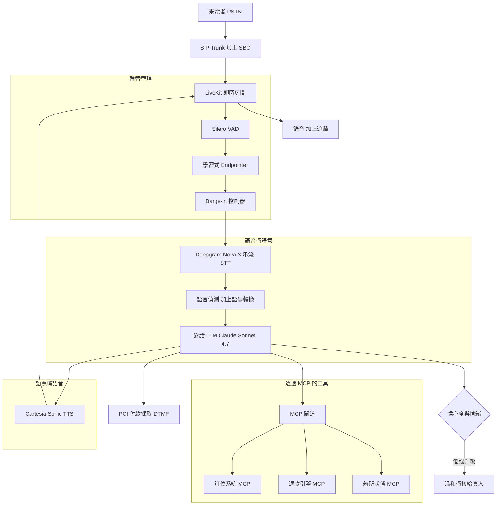
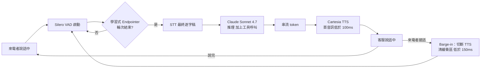

# 案例研究：多語即時語音客服中心

一家全球航空公司營運一套跨 22 種語言的來電語音客服，即時處理改票、行李理賠、退款與航班狀態查詢。它必須有真人般的體驗（回應低於 800ms、支援 barge-in、乾淨的輪替接話），透過 MCP 呼叫訂位與退款系統，能辨識出自己力有未逮的時刻並溫和轉接給真人專員，並在卡號進入對話的那一刻維持 PCI 合規。

## 商業問題

這家航空公司在各樞紐機場每天處理約 90,000 通來電。真人專員的全包成本約為每通 $6（薪資、福利、BPO 利潤、佔線時間）。平均處理時間為 7 分鐘，而 40 percent 的話務量是重複性的：「我的行李在哪裡」、「LH438 航班準時嗎」、「幫我改到早班」。任務目標是在不動用真人的情況下端到端解決 55 percent 的來電，成本只需 $6 的一小部分，同時保護那種被一通糟糕 IVR 就能在一通電話裡摧毀的顧客體驗。

來自 2026 年 6 月現實的限制條件：

- 22 種語言並帶有即時的語碼轉換（一位印地語來電者切換成英語報出訂位代號，然後又切回印地語），所以靜態的逐語言路由並不足夠。
- 電話音訊是 8kHz 窄頻 G.711，通常有雜訊，並帶有強烈的地區口音。字錯誤率（WER）直接驅動任務成功率，而航班號上的不良 ASR 會取消到錯誤的航段。
- 對話延遲必須維持在 800ms 回應時間以內（從來電者說話結束到第一個音訊），否則來電者會與客服搶話，真人般的錯覺就此瓦解（[Daily 延遲研究](https://www.daily.co/blog/the-worlds-fastest-voice-bot/)）。
- 付款發生的那一刻起就適用 PCI DSS v4.0：客服絕不能聽到或儲存原始卡號（[PCI DSS v4.0](https://www.pcisecuritystandards.org/document_library/)）。
- 雙方同意制的司法管轄區要求在通話開始時揭露錄音，而錄音必須依各地區規定保留與遮蔽。
- 工具是真實且有狀態的：取消航班或核發退款是不可逆的動作，所以在任何寫入之前都強制要求確認覆誦。

## 架構

### 元件

| 層級 | 技術 | 用途 |
|-------|------|---------|
| 電信 | SIP trunk 加上 SBC、LiveKit Agents | PSTN 接入、媒體路由、低抖動傳輸 |
| 輪替偵測 | Silero VAD 加上學習式 endpointer | 判斷來電者何時說完話 |
| STT | Deepgram Nova-3 串流 | 跨口音的部分與最終逐字稿 |
| 語言辨識 | 對前 1.5s 做串流 LID 加上每句重新檢查 | 挑選語音與提示語系、捕捉語碼轉換 |
| 對話 | Claude Sonnet 4.7（GPT-5.5 作為後備） | 推理、工具呼叫、確認覆誦 |
| 工具傳輸 | MCP 2.0 閘道走 HTTP | 訂位、退款、狀態，搭配受眾綁定的 token |
| TTS | Cartesia Sonic 加上 ElevenLabs Flash | 逐語言語音、首位元組低於 100ms |
| 轉接 | 技能制 ACD 加上情境封包 | 帶完整對話摘要的溫和轉接 |
| 合規 | DTMF 擷取、錄音保險庫、遮蔽 | PCI 範圍隔離、同意、保留 |

### 資料流

1. PSTN 來電落在 SBC 上，被正規化為媒體串流，並與語音客服 worker 一起加入一個 LiveKit 房間。
2. Silero VAD 把關音訊；學習式 endpointer 判斷來電者的輪次是否真的結束，而不是等待固定的靜音計時器。
3. Deepgram 在來電者說話時串流部分逐字稿；語言辨識在最初幾個字上執行，並逐句重新檢查語碼轉換。
4. 在 endpoint 時，最終逐字稿加上滾動的對話狀態會送進 Claude Sonnet 4.7，由它回答、提出釐清問題，或發出工具呼叫。
5. 工具呼叫透過 MCP 閘道帶著受眾綁定的 token 進行路由；讀取（航班狀態）立即執行，寫入（取消、退款）則需要先做口語確認覆誦。
6. LLM 回應逐 token 串流進 Cartesia，它會在完整句子尚未成形之前就開始合成音訊，把首音訊延遲壓低。
7. 如果來電者在客服說話時開口，barge-in 控制器會在約 150ms 內切斷 TTS、清掉排隊的音訊，並重新開啟 STT 串流。
8. 當信心度、情緒，或重複失敗的訊號觸發時，客服會組裝一個情境封包並溫和轉接給真人；整通電話都會依各地區規定錄音與遮蔽。

## 關鍵設計決策

### 1. Cascade 對 speech-to-speech

這兩種架構是一個真正的分岔。speech-to-speech 模型（GPT-5.5 realtime、Gemini Live）直接吸收音訊並產出音訊，具有最低的延遲與最自然的韻律，因為沒有任何東西需要繞經文字往返（[OpenAI Realtime API](https://platform.openai.com/docs/guides/realtime)、[Gemini Live API](https://ai.google.dev/gemini-api/docs/live)）。cascade（STT 然後 LLM 然後 TTS）會因為 150 到 300ms 的管線開銷而較慢，但換來三件這個產品不能沒有的東西：完整的可除錯性（每個輪次都有一份逐字稿，當錯誤的航班被取消時你可以稽核）、獨立的語言涵蓋（22 種語言是一個逐元件解決的 STT 與 TTS 問題，而非受制於單一模型的音訊訓練），以及一顆可抽換的對話大腦（我們跑 Claude Sonnet 4.7，並能在不重訓音訊堆疊的情況下故障轉移到 GPT-5.5）。我們選擇了 cascade。對於付款子流程，我們做得更加確定性，把 LLM 完全排除在迴路之外。一個純 speech-to-speech 的設計會更快，但會讓 PCI 範圍界定與逐語言 QA 困難得多。

### 2. 輪替偵測與 endpointing（延遲稅）

固定靜音計時器是經典的 IVR 失敗。把計時器設在 700ms，客服感覺遲鈍；設在 300ms，它會打斷一個停下來思考的來電者。我們跑 Silero VAD（[Silero VAD](https://github.com/snakers4/silero-vad)）做原始的語音活動偵測，然後用一個學習式 endpointer，它運用聲學與詞彙線索（上揚對下降的語調、逐字稿是否為一個完整子句）來預測輪次結束，這正是 LiveKit 作為輪替偵測外掛出貨的做法（[LiveKit turn detection](https://docs.livekit.io/agents/build/turns/)）。相較於固定的 700ms 計時器，這把感知到的回應延遲削減了 200 到 400ms，同時減少誤打斷。endpointer 是逐語言的，因為停頓分布各異：日語來電者句中停頓的時間比德語來電者更長，而單一的全域門檻會把兩者都搞錯。

### 3. Barge-in（讓來電者打斷）

真實的對話是可被打斷的。如果客服正覆誦「我幫您訂的是 14:05 飛慕尼黑的班機」而來電者插話說「不，我要早班的」，客服必須立刻停下。我們的 barge-in 控制器在 TTS 播放期間監看 VAD；一偵測到語音就取消 TTS 串流、把緩衝的音訊從 LiveKit 抖動緩衝區清出（否則來電者在自己開口後還會聽到半秒鐘過時的客服語音），並重新開啟 STT。目標的 stop-to-silence 為 150ms 以內。困難之處在於那個競態：把真正的打斷與一個不該停下客服的應答聲（「嗯哼」、「好的」）區分開來。我們用一個短的 250ms 確認窗口加上一個應答聲分類器，讓一句禮貌性的「嗯哼」不會打亂覆誦。

### 4. 通話中途的語言偵測與語碼轉換

來電者不會固定使用一種語言。我們對最初約 1.5 秒做串流語言辨識來挑選初始語系（語音、提示、STT 模型），接著逐句重新檢查。當一位印地語講者說出訂位代號「PNR six-X-ray-mike」時，數字與 NATO 字母是以英語抵達的；ASR 設定必須同時接受兩者。對於高度混用的語言配對（印地語-英語、西班牙語-英語、阿拉伯語-法語），我們讓 STT 維持在容忍語碼轉換的模式，而不是鎖定單一語言。TTS 為求自然會維持在主導語言，但會正確發出嵌入的英語 token（機場代碼、人名）。誤判是前三大失效模式之一，所以語系永遠是可確認的：「我會繼續用英語，可以嗎？」

### 5. 跨口音與雜訊線路的 ASR 準確度

電話音訊是大敵。8kHz 窄頻、有損編解碼器、機場背景噪音，以及一條長長的口音長尾，把 WER 推高，而 WER 幾乎是線性對應到任務失敗：航班號上 12 percent 的 WER 意味著大約每八位來電者就有一位被覆誦了錯誤的航段。我們以一個為電話調校的串流模型（Deepgram Nova-3，[Deepgram docs](https://developers.deepgram.com/docs)）、針對領域詞彙的關鍵字加權（機場代碼、艙等、「rebook」、「voucher」），以及針對高風險欄位的受限文法來緩解：訂位代號與日期會對著一個經 checksum 驗證的樣式來擷取，而我們會逐位數覆誦它們。我們逐語言並逐口音叢集追蹤 WER，因為一個平均 8 percent 的模型，對於某個佔話務量 4 percent 的口音仍可能高達 18 percent。

### 6. 透過 MCP 並帶確認覆誦的工具呼叫

對話 LLM 透過一個 MCP 2.0 閘道驅動真實系統（[MCP specification](https://modelcontextprotocol.io/specification/2026-03-26/)）：`booking.search`、`booking.rebook`、`refund.quote`、`refund.issue`、`status.lookup`。讀取立即執行。寫入絕不在首次提及時觸發。客服必須陳述動作與後果，並取得明確的「是」：「我會取消您 14:05 飛慕尼黑的班機，並把您改訂到 09:10，票價差額為 40 歐元。需要我確認嗎？」唯有肯定的回答才會釋放 `booking.rebook`。每個工具 token 都是受眾綁定的，所以一個為狀態服務鑄造的 token 無法呼叫退款引擎（[RFC 8707](https://www.rfc-editor.org/rfc/rfc8707.html)）。工具呼叫帶有 idempotency key，所以超時後的重試不會重複核發退款。

### 7. 何時轉接給真人

這個客服被設計成見好就收。我們會在以下任一情況觸發溫和轉接：高風險動作上的工具呼叫信心度低於門檻、情緒偵測標記出憤怒或苦惱、在同一個欄位上連續兩次 ASR 釐清迴圈、一句明確的「請轉真人」，或一個落在支援範圍之外的主題（醫療緊急狀況、法律申訴）。轉接是溫和的，而非冷冰冰地丟出去。客服會建構一個情境封包（來電者身分、已驗證的訂位、嘗試過什麼、即時逐字稿摘要、偵測到的語言、偵測到的情緒），而真人專員在接起電話前就會在螢幕上看到它，所以來電者絕不需要重複自己說過的話。冷轉接是讓自動化前台被人厭惡最快的單一手段；我們衡量轉接後的重複率，並把任何回歸視為 sev-2。

### 8. 合規：錄音同意與 PCI

兩道合規關卡。第一，錄音：在雙方同意制的地區，客服會在第一句話揭露錄音，而同意狀態會隨錄音一併記錄。第二，付款。當票價差額或一筆付費異動需要刷卡時，我們絕不讓卡號抵達 LLM 或逐字稿。客服會暫停錄音，把來電者交給一個 DTMF 擷取流程（來電者在鍵盤上按出卡號，音調由一個 PCI 範圍內的服務擷取並 token 化），而客服永遠只看到一個 token 與一個授權結果（[PCI DSS v4.0](https://www.pcisecuritystandards.org/document_library/)、[Twilio PCI patterns](https://www.twilio.com/docs/voice/tutorials/pci-compliance)）。客服執行環境完全處於 PCI 範圍之外。錄音會經過一道遮蔽流程，在儲存前剝除任何看起來像卡片或 CVV 資料的 DTMF 音調與口語數字序列。

### 9. 延遲預算工程（守住低於 800ms）

從說話結束到首音訊的 800ms 是頭號 SLO，而它是一筆你橫跨整條管線去花的預算。Endpointing 決策：約 100ms。Endpoint 後的 STT 最終結果：約 150ms（部分結果早已串流）。LLM 首 token：約 250ms。TTS 首音訊位元組：約 90ms。網路與抖動緩衝區：約 100ms。這留下約 110ms 的餘裕。讓它塞得下的槓桿：串流 STT 讓逐字稿在 endpoint 時幾乎已完成、串流 LLM 讓 TTS 在第一個子句而非完整回應上就開始、推測式 TTS 暖機，以及讓 LLM 提示保持精簡（不要每個輪次都把完整的 22 語言政策手冊倒進情境裡，只檢索相關的政策）。當 p95 漂出預算時，通話會感覺像機器人且 barge-in 競態增加，所以延遲是主要告警，而非虛榮指標。

## 失效模式與緩解措施

### F1：延遲尖峰讓客服感覺像機器人

一個 GPU 佇列塞住或 LLM 廠商變慢，p95 首音訊跳過 1.2s，來電者開始與客服搶話，barge-in 競態倍增，對話劣化。緩解：逐階段的延遲預算搭配告警、當對話模型變慢時改用更快的後備模型（簡單輪次用 Claude Haiku 4.5）、推測式 TTS 暖機，以及一句在 300ms 內發出的「讓我幫您查一下」填補語句，讓線路在一個緩慢的工具呼叫執行時永不沉默。

### F2：ASR 錯誤觸發了錯誤的動作

來電者說「取消 LH438」，ASR 聽成「LH434」，客服準備取消錯誤的航段。緩解：每一個高風險欄位在可能時都經 checksum 驗證，並在寫入工具觸發前一律逐位數覆誦；寫入唯有在明確肯定時才會釋放；idempotency key 防止重試的呼叫加劇錯誤。

### F3：Barge-in 競態條件

來電者與客服同時說話，抖動緩衝區仍持有排隊的客服音訊，而來電者在自己已經打斷後還聽到客服說完一句話，這感覺很故障。緩解：在 barge-in 時立即取消 TTS 串流並清掉 LiveKit 播放緩衝區；使用一個 250ms 的應答聲窗口加上一個分類器，讓「嗯哼」不會停下客服，但「不，停」會。

### F4：語言誤判用錯誤的語言回答

語言辨識在一段有雜訊的開場上鎖定了葡萄牙語，來電者其實在說西班牙語，客服用錯誤的語言回應。緩解：逐句的語言重新檢查，而非只在通話開始時做一次；一個可確認的語系（「我會繼續用西班牙語，好嗎？」）；以及一條快速切換路徑，在不中斷輪次的情況下於通話中途重新選取 STT 模型、提示語系與 TTS 語音。

### F5：來電者已升溫而客服不轉接

一位行李裡裝著藥物的苦惱來電者愈來愈憤怒，而客服還在試圖解決，而不是升級。緩解：每個輪次都做情緒偵測，並對苦惱與憤怒設定低門檻；一條硬規則，連續兩次失敗的釐清或任何偵測到的苦惱都會觸發溫和轉接；一個永遠可用的「真人」意圖，可繞過一切。

### F6：PCI 外洩（卡號出現在逐字稿）

一位來電者把卡號唸出來而不是用鍵盤，它落進了 STT 逐字稿與錄音。緩解：客服主動把付款導向 DTMF 並指示來電者不要把卡號唸出來；一個即時遮蔽器從逐字稿與錄音中刷掉符合卡片或 CVV 樣式的數字序列；在付款子流程期間暫停錄音，讓 PCI 範圍內的服務是唯一接觸到那些音調的東西。

### F7：通話中途的工具超時

退款引擎在一次後端事故期間花了 9 秒，而來電者枯坐在沉默中，納悶線路是否斷了。緩解：工具呼叫有一個 3 秒的軟性截止時限，會觸發一句口語的「這需要一點時間，請稍候」；一個硬性截止時限會優雅地讓工具失敗並提供回撥或真人轉接；idempotency key 讓最終的完成不會重複動作；斷路器在後端大範圍故障時路由到真人。

### F8：幻覺的政策（編造出一條退款規則）

被問到一條客服不知道的票價規則時，LLM 自信地編造出一條不適用於這個票價的 24 小時免費取消政策。緩解：政策答案以檢索到的票價規則為依據，而非模型記憶；客服被指示在無法依據資料的政策上要拒答並轉接，而不是用猜的；退款與改票金額一律來自 `refund.quote` 工具，絕不來自 LLM 自己的算術。

## 維運考量

### 監控

| SLO | 目標 |
|-----|--------|
| 回應延遲（從說話結束到首音訊）p95 | 低於 800 ms |
| 自含率（不動用真人即解決） | 超過 55 percent |
| 高風險欄位的 ASR WER | 低於 5 percent |
| Barge-in stop-to-silence p95 | 低於 200 ms |
| 溫和轉接的情境封包送達 | 超過 99 percent 在專員接話之前 |
| 錯誤動作事件（在聽錯的欄位上寫入） | 低於每 10 萬通 1 次 |

### 成本模型

在每天 90,000 通（每月約 2.7M 通）、自含率 55 percent 的情況下，約 1.5M 通完全由客服處理，平均 4 分鐘的音訊：

- STT（Deepgram，約 $0.0077/min）：每月約 $46,000
- TTS（Cartesia 加上 ElevenLabs，生成每分鐘約 $0.015）：每月約 $45,000
- 對話 LLM（Claude Sonnet 4.7，串流，短輪次）：每月約 $120,000
- LiveKit 加上 SIP 加上 SBC 媒體：每月約 $35,000
- 電信分鐘數（PSTN 終端）：每月約 $60,000
- 錄音、遮蔽、PCI 範圍內擷取、儲存：每月約 $18,000
- 總計：每月約 $324,000，每通自含來電約 $0.22，每分鐘音訊約 $0.054

相較於一通 $6 的真人來電，每一通自含來電省下約 $5.78。在 1.5M 通自含來電下，那是每月約 $8.4M 的避免專員成本，對比約 $0.32M 的平台成本。

### 待命處置手冊

- 延遲違規（p95 超過 800ms）：檢查 GPU 佇列深度與 LLM 廠商狀態；把簡單輪次轉到 Claude Haiku 4.5；啟用填補語句；若是上游問題就呼叫廠商。
- 自含率下降：拉出最近一小時的轉接原因；若某個意圖暴增，檢查對應的工具或後端是否故障，並把該意圖直接路由到真人。
- 錯誤動作告警：凍結受影響的寫入工具，重放通話逐字稿與音訊，確認覆誦邏輯有觸發，若覆誦被略過則透過訂位系統反轉該動作。
- PCI 遮蔽失敗：隔離受影響的錄音，強制所有付款只走 DTMF，並通知合規負責人；視為 sev-1。
- 後端（退款或訂位）故障：跳開斷路器，把受影響的意圖切換到真人轉接，搭配一句誠實的「我們的系統出了點問題」訊息，而不是劣化的自動化答案。
- 語言回歸：若某個語言的 WER 或誤判暴增，把該語言的 STT 模型釘在上一個良好版本，並在調查期間把它的來電路由到真人。

## 強力面試候選人會涵蓋哪些內容

- 他們會把 cascade 對 speech-to-speech 當成一個真正的取捨來推理（延遲與自然度，對上可除錯性、22 語言涵蓋，以及可抽換的對話模型），而不是預設選用比較新的那個。
- 他們會把 endpointing 與 barge-in 當成第一等的延遲問題，點名學習式輪替偵測勝過固定靜音，並解釋打斷時清掉抖動緩衝區的細節。
- 他們會把 WER 連結到任務成功，並為高風險欄位設計受限文法加上覆誦，而不是信任原始 ASR。
- 他們會以 DTMF token 化把對話模型擋在 PCI 範圍之外，並解釋為什麼客服絕不能聽到卡號。
- 他們會讓工具寫入變安全：確認覆誦、idempotency key、受眾綁定的 MCP token，以及來自工具而非模型算術的報價。
- 他們會以一個情境封包設計溫和轉接，並衡量轉接後的重複率，把冷轉接視為一個產品失敗。
- 他們會逐階段估算延遲預算，並逐通自含來電估算成本模型，對著 $6 的真人基準線來證成這次建置。

## 參考資料

- OpenAI, [Realtime API guide](https://platform.openai.com/docs/guides/realtime)
- Google, [Gemini Live API](https://ai.google.dev/gemini-api/docs/live)
- Radford et al., [Robust Speech Recognition via Large-Scale Weak Supervision (Whisper)](https://arxiv.org/abs/2212.04356)
- [Silero VAD](https://github.com/snakers4/silero-vad)
- [Deepgram streaming STT documentation](https://developers.deepgram.com/docs)
- [ElevenLabs text-to-speech](https://elevenlabs.io/docs/api-reference/text-to-speech)
- [Cartesia Sonic TTS](https://docs.cartesia.ai/)
- [LiveKit Agents framework](https://docs.livekit.io/agents/)
- [LiveKit turn detection](https://docs.livekit.io/agents/build/turns/)
- [Daily: building a sub-second voice bot](https://www.daily.co/blog/the-worlds-fastest-voice-bot/)
- [PCI DSS v4.0 document library](https://www.pcisecuritystandards.org/document_library/)
- [Model Context Protocol specification 2026-03-26](https://modelcontextprotocol.io/specification/2026-03-26/)
- IETF, [RFC 8707: Resource Indicators for OAuth 2.0](https://www.rfc-editor.org/rfc/rfc8707.html)

相關章節：[Real-Time Voice Agents](../18-voice-and-audio-agents/01-realtime-voice-agents.md)、[Voice AI in Healthcare](13-voice-ai-healthcare.md)、[Tool Use and MCP](../07-agentic-systems/03-tool-use-and-mcp.md)。
