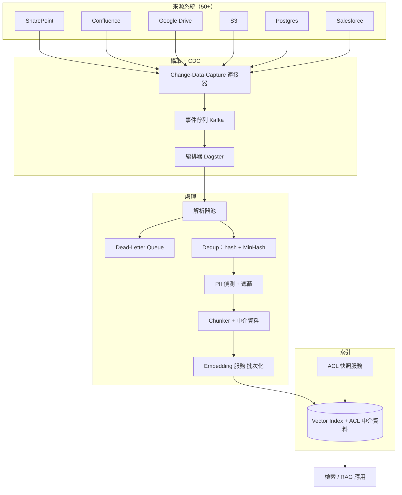
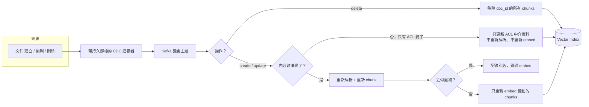

# 案例研究：RAG 的企業級資料攝取管線

企業 RAG 背後那層不起眼的工作：在來自 50 多個異質來源的 1.2 億份文件上，維持檢索索引的新鮮度，同時做到正確的存取控制、去重、解析品質、PII 處理與增量更新，讓一份在早上 9:00 編輯過的文件，在 9:15 就能被搜尋到。多數 RAG 系統並不是死在檢索演算法上，而是死在這裡。本篇是與 [Enterprise RAG](01-enterprise-rag.md) 中檢索品質工作互補的資料管線篇。

## 商業問題

一家 12,000 人規模的公司想要一個能搜尋所有東西的搜尋框：SharePoint、Confluence、Google Drive、S3 buckets、三個 Postgres 資料庫、Salesforce、企業電子郵件封存，以及客服工單系統。50 多個連接器、約 1.2 億份文件，外加一長串的格式長尾（掃描成 PDF 的合約、Excel 財務模型、HTML 知識庫頁面、PowerPoint、內嵌圖片）。檢索團隊已經做出一套強大的重排序堆疊，在 demo 裡運作得很漂亮。但在生產環境裡，答案會因為一些無聊的理由而出錯：某個連接器三週前無聲無息地停掉了，所以索引過時了；某個解析器把一張訂價表壓平成一團文字湯；還有兩次，業務代表檢索到了一份他從來不該看到的 HR 文件。修法不是換一個更好的 embedding 模型，而是一條把資料當成產品來對待的攝取管線。

來自 2026 年 6 月現實情況的限制條件：

- 跨 50 多個來源的 1.2 億份文件，每月淨增約 300 萬份
- 新鮮度 SLO：在來源中被編輯或刪除的文件，必須在 15 分鐘內反映到索引中（針對 tier-1 來源），長尾來源則為 4 小時
- 存取控制沒有妥協空間：查詢時的結果絕不能包含發問使用者在來源系統中看不到的文件
- 從零重新 embedding 全部 1.2 億份文件要花真金白銀（在每百萬 token $0.12 的託管 embedding API 上，跑完一輪約 $14K），因此把全量重新爬取（full re-crawl）當成例行操作是不可行的
- PII 與受監管資料（PCI、PHI、員工紀錄）會流經同一批管路，必須在它們落入共享索引之前被偵測並遮蔽
- 一名資料平台工程師，外加一個共用的平台團隊；這條管線必須是可維運的，而不是靠英雄主義硬撐的

## 架構

### 元件

| 層級 | 技術 | 用途 |
|-------|------|---------|
| 連接器 + CDC | 各來源專屬連接器、Postgres 用 Debezium、SaaS 用 webhooks 加 delta API | 在不做全量爬取的情況下偵測新增、編輯、刪除 |
| 事件匯流排 | Kafka | 把擷取與處理解耦，可重放的變更日誌 |
| 編排器 | Dagster（asset-based） | 排程、重試、回填（backfill）、每份文件 asset 的血緣 |
| 解析器池 | 困難 PDF 與表格用 Reducto 與 LlamaParse，office 與 HTML 用 Docling 與 unstructured.io，Apache Tika 作為後備 | 把位元組轉成乾淨的文字加結構 |
| Dedup | xxhash 內容雜湊加上 MinHash/LSH | 丟棄完全相同與近似重複的樣板內容 |
| PII | Microsoft Presidio 加上一道微調過的 NER | 偵測並遮蔽受監管的片段 |
| Chunker | 帶中介資料的結構感知 chunking | 攜帶出處的檢索尺寸單位 |
| Embedding 服務 | 對 Voyage voyage-3 或 text-embedding-3-large 做批次呼叫，或在 GPU 上自架 BGE-M3 | 在受控成本下產出帶版本的向量 |
| Vector index | Postgres pgvector 或專用儲存，每個 chunk 帶 ACL 中介資料 | 可過濾且帶權限的檢索 |
| ACL 服務 | 為每個來源做週期性權限快照 | 讓每個 chunk 的 ACL 與來源保持同步 |

### 資料流

1. 連接器透過 CDC 偵測來源中的變更（一個新的 SharePoint 檔案、一個被編輯的 Confluence 頁面、一筆被刪除的 Salesforce 紀錄）：Postgres WAL 上的 Debezium、SaaS 的 webhooks 加 delta-token API、buckets 的 S3 事件通知。
2. 變更事件帶著穩定的文件 id、來源、操作（create、update、delete）以及內容 checksum 落到 Kafka 上。Kafka 是可重放的主幹：如果下游壞了，我們就從 offset 重新處理。
3. Dagster 取走該事件並把文件具現化（materialize）為一個 asset，從來源抓取原始位元組與當前的 ACL 清單。
4. 解析器池把位元組轉成結構化文字。路由會依內容類型挑選解析器；表格與掃描 PDF 走具備視覺能力的解析器，純 HTML 走便宜路徑。失敗的會被路由到 dead-letter queue，而不是被無聲丟棄。
5. Dedup 開始執行：一道完全相同的內容雜湊先殺掉位元組層級完全相同的重複上傳，接著 MinHash/LSH 抓出近似重複（同一份政策文件被複製到 40 個團隊空間）。
6. PII 偵測與遮蔽在任何東西被 embedding 之前執行；受監管的片段會被遮蔽，或整份文件依政策被隔離。
7. Chunker 把乾淨文字切成檢索單位，並為每個 chunk 蓋上中介資料：來源、文件 id、ACL principals、最後修改時間、embedding 模型版本。
8. Embedding 服務把 chunks 批次化、呼叫帶版本的 embedding 模型，並把向量加中介資料 upsert 進索引。一個 delete 事件會移除該文件 id 的所有 chunks。

## 關鍵設計決策

### 1. 增量同步，而非全量重新爬取

每晚對 1.2 億份文件做一次全量爬取是預設會犯的錯。它很慢（爬取窗口在開始之前就已經超過 SLO）、很貴（你每晚都對沒變的文件重新 embedding），而且會把來源系統的 API 打進 rate-limit 的牢裡。我們改用 change-data-capture。Postgres 來源使用 write-ahead log 上的 Debezium（[Debezium docs](https://debezium.io/documentation/reference/stable/index.html)）。SaaS 來源依各廠商使用正確的原生機制：SharePoint 用 Microsoft Graph delta queries 與 webhooks、Confluence 用 content audit 與 CQL since-last-sync、Google Drive 用帶有已儲存 page token 的 Changes API、Salesforce 用 CDC 加 Bulk API 做回填。每個連接器都追蹤一個持久游標（一個 offset、一個 delta token、一個高水位時間戳），所以重啟時會接續而非重新爬取。全量回填是存在的，但它是一個明確且罕見的操作：上線一個新來源，或是一次重新索引（決策 7）。在穩態下，我們只碰那大約 1 到 2 percent 有變動的文件。

### 2. 解析品質是隱藏的瓶頸

最大宗的錯誤答案來源是糟糕的解析，而不是糟糕的檢索。一張被壓平成一句連寫句的訂價表，檢索起來毫無問題，答案卻是錯的。掃描的合約是圖片；一個天真的文字萃取器會回傳一片空白。我們在一個橫跨帶表格 PDF、掃描文件、多欄版面與投影片的 2,000 份文件黃金測試集（golden set）上，跑了一場解析器對決（bake-off），針對每個解析器的表格結構保真度、閱讀順序與 OCR 準確度評分。形塑路由的發現：Reducto 與 LlamaParse（[LlamaParse](https://docs.cloud.llamaindex.ai/llamaparse/getting_started)）在表格與複雜 PDF 上決定性地勝出，但每 1,000 頁約要花 $3 到 $10；Docling（[Docling](https://github.com/docling-project/docling)）與 unstructured.io（[unstructured](https://docs.unstructured.io/)）在乾淨的 office 與 HTML 上表現強勁且更便宜；Apache Tika（[Tika](https://tika.apache.org/)）是免費的後備，能把 80 percent 的格式處理到尚可接受，但沒有任何一種處理得好。於是我們依內容類型與難度做路由：乾淨的 HTML 與 DOCX 走便宜路徑、表格與掃描 PDF 走具備視覺能力的解析器，並把一道 Gemini 3.1 Pro 的視覺處理（[Gemini docs](https://ai.google.dev/gemini-api/docs)）當成那一小撮打敗其他所有方法的文件的升級手段。把長尾解析好，正是預算與品質兩者所在之處。

### 3. 去重：完全相同加近似重複

企業裡到處都是副本。同一份新人簡報住在 40 個團隊空間裡；一條郵件討論串引用了前五封訊息；一份合約範本衍生出 300 份只差兩個欄位的合約。沒有 dedup，索引就會被樣板內容塞滿，而檢索回傳的會是十個近乎相同的 chunks，而不是十個不同的事實。我們分兩階段做 dedup。完全相同：對正規化內容做的 xxhash 會便宜地丟掉位元組層級完全相同的重複上傳。近似重複：帶 LSH banding 的 MinHash（[Broder, On the resemblance and containment of documents](https://www.cs.princeton.edu/courses/archive/spr04/cos598B/bib/Broder.pdf)）會把 Jaccard 相似度約 0.85 以上的文件聚成一群，保留一個正規代表，並把重複者記錄為別名（alias）以保住出處。這在第一輪就把我們的 chunk 數量砍掉了 22 percent，並可量測地改善了檢索的多樣性。

### 4. 把存取控制傳播進索引

這是讓專案不會變成一份事故報告的決策。有兩種架構存在。後過濾（post-filtering）：依相似度檢索 top-k，再對每個命中項對照使用者的權限檢查，並丟掉他們看不到的。它會外洩，因為一個已刪除但仍被索引的權限、一個過時的 ACL，或一個聰明到回傳了沒有任何可見項的 top-k，都會無聲地劣化，而更糟的是，一份文件的存在與摘要片段，可能在過濾器執行之前就透過排序訊號與計數外洩出去。我們改做前過濾（pre-filtering）：每個 chunk 都攜帶該文件的 ACL principals（user ids、group ids、role ids）作為被索引的中介資料，而查詢會在相似度排序之前，先以發問使用者已解析的 principal 集合來過濾。一個 ACL 快照服務會依排程（以及在來源會發出權限變更事件時）為每個來源刷新權限，所以一個被撤銷的分享會傳播到索引，而不只是傳播到來源。困難之處在於 ACL 是獨立於內容而變動的：一個檔案的權限可以在檔案沒變的情況下改變，所以 ACL 服務必須在不重新解析或重新 embedding 該文件的情況下更新 chunk 中介資料。我們正是為了這個理由，把 ACL 存成一個可獨立更新的中介資料欄位。參見 [Access Control](../12-security-and-access/02-access-control.md)。

### 5. Chunking 與中介資料策略

Chunking 是解析品質開花結果、或被白白丟掉的地方。我們做結構感知的 chunking：依解析器給出的標題與章節邊界切分、把表格當成單一單位保持完整而不是把列切散到不同 chunk、並以一個小重疊（overlap）瞄準 400 到 800 tokens。每個 chunk 都攜帶在查詢時對得起自己分量的中介資料：來源系統、文件 id 與版本、ACL principals、最後修改時間戳、內容類型，以及產出其向量的 embedding 模型版本。中介資料不是裝飾；ACL principals 驅動前過濾、最後修改時間驅動新鮮度感知的排序，而 embedding 模型版本讓決策 7 的重新索引成為可能。細節與表格處理的取捨都在 [Chunking Strategies](../06-retrieval-systems/02-chunking-strategies.md) 裡。

### 6. Embedding 服務：批次化、rate limits、版本控管

對 1.2 億份文件做 embedding 是一個吞吐量與成本問題，而不是模型品質問題。有三件事重要。批次化：託管 embedding API 依請求計價並做 rate-limit，所以我們把批次堆到提供者的上限（Voyage 與 OpenAI 都接受大批次），並以管線化（pipeline）方式送出請求，在不觸發限制的情況下把 rate limit 跑滿。成本控制：在 text-embedding-3-large 每百萬 token $0.13 的訂價（[OpenAI embeddings](https://platform.openai.com/docs/guides/embeddings)）或 Voyage voyage-3 的類似級距（[Voyage docs](https://docs.voyageai.com/docs/embeddings)）下，把整個語料庫 embedding 一次約為 $13 到 $16K；至於穩態的增量負載，則是一個月幾百美元。對於非常高量的情境，我們會用 GPU 上自架的 BGE-M3（[BGE-M3](https://huggingface.co/BAAI/bge-m3)）做基準測試，它用 GPU 支出與維運負擔換掉 API 支出。版本控管：每個向量都蓋上 embedding 模型 id 與版本。你不能混用向量空間（決策 7 仰賴這點），而且如果不知道是哪個模型產出的向量，你在六個月後就無法除錯一個檢索回歸。

### 7. Embedding 模型升級與重新索引問題

一個更好的 embedding 模型出貨了，於是你現在有 1.2 億個落在舊空間裡的向量，以及一個想用新模型的渴望。你不能把它們混在一起：一個 voyage-3 向量與一個 voyage-3.5 向量之間的 cosine similarity 是沒有意義的，所以一個遷移到一半的索引，在跨空間比較時會回傳垃圾。天真的「直接全部重新 embedding」是一個跨越數週、$14K 的工程，而你不會想對著生產環境索引即時跑它。我們使用 blue/green 重新索引：架起一個新的 green 索引、從可信來源（source-of-truth）的文件儲存回填它（不是從舊索引回填，所以我們也順便撿起任何漂移）、用新模型重新 embedding 進 green，同時 blue 持續服務，對著檢索黃金測試集驗證 green，接著切換，並讓 blue 保持熱機以便回滾。重新 embedding 的成本是真實的，也是我們不去追逐每一個新 embedding 模型的主因；當我們的評估集上的檢索品質增益，跨過了一個值得 $14K 加上一週管線注意力的門檻時，我們才升級。

### 8. 管線中的 PII 偵測與遮蔽

受監管資料流經的連接器，與其他所有東西一樣，而一個共享的檢索索引，正是最不該拿來記住某人社會安全碼的地方。我們在 embedding 之前用 Microsoft Presidio（[Presidio](https://microsoft.github.io/presidio/)）加上一道為我們領域實體微調過的 NER 來做 PII 偵測。政策是分類別的：低風險 PII（一般商業文件裡的姓名、email）會被保留，因為遮蔽它會破壞檢索；高風險的受監管資料（PCI、PHI、政府 id）會被以類別 token 遮蔽，而來自受監管來源、超過某個敏感度門檻的文件，會被整個隔離到共享索引之外，並改路由到一個 ACL 更緊的受限索引。遮蔽模型會在一個已標註的樣本上評估，其精確率超過 98 percent、召回率超過 95 percent，因為這裡的一次召回失誤就是一個法遵稽核發現項。

### 9. 可觀測性與 dead-letter queue

1.2 億份文件裡大約有 2 percent 解析失敗：損毀的檔案、有密碼保護的 PDF、不支援的格式、回傳空白的 OCR。無聲地把它們丟掉，正是索引悄悄變得不完整、而且沒人注意到的方式，直到某個答案缺漏為止。每一次失敗都會帶著文件 id、來源、失敗的解析器與錯誤，進入一個 dead-letter queue。這個 DLQ 會被分流處理：對於暫時性與格式路由失敗，以替代解析器自動重試；對於頑固的殘餘，每週做一次人工審查；並有一塊把 DLQ 深度當成一級指標來追蹤的儀表板。DLQ 的突增，是某個來源改了它的匯出格式、或某個解析器發生回歸的最早訊號。

## 增量更新路徑（CDC）

## 失效模式與緩解措施

### F1：某個來源連接器無聲地停止，索引變得過時

一個連接器的 auth token 過期了、一個 API 悄悄改了它的 delta endpoint，於是連接器停止發出變更卻沒有報錯。索引持續服務著愈來愈過時的結果，而沒人在數週內注意到。緩解措施：每來源的新鮮度心跳。每個連接器都必須在它的 SLO 窗口內發出一個變更、或一個明確的「沒有變更，仍然活著」的心跳；一個遺失的心跳會呼叫待命人員。我們也跑一個每日對帳，逐來源比對來源文件數與已索引文件數，並在漂移超過 0.5 percent 時告警。

### F2：解析器毀掉表格，答案因而出錯

一張財務表格被壓平成散文；檢索看起來很健康，但答案在數值上是錯的。緩解措施：解析器對決與內容類型路由（決策 2），外加一個解析品質金絲雀（canary），每週把黃金測試集跑過即時的解析器池，並在表格保真度回歸時告警。便宜解析器以低結構信心處理的文件，會被自動升級到具備視覺能力的路徑。

### F3：Dedup 漏掉近似重複，稀釋了檢索

MinHash 門檻設得太嚴，近似重複的樣板內容溜了過去，於是 top-k 被同一份政策的十份副本塞滿。緩解措施：對著一個已標註的重複集調校 LSH banding、把檢索多樣性（top-k 中相異的文件 id 數）當成一個指標來監控，並加上一道查詢時的 dedup，在結果集中把近乎相同的 chunks 收合起來作為兜底。

### F4：ACL 未傳播，使用者檢索到一份他看不到的文件

一個分享在 SharePoint 被撤銷了，ACL 快照還沒刷新，於是那份文件仍可被一個已失去存取權的人檢索到。這是一個安全事故，而不是一個品質 bug。緩解措施：對每個 chunk 的 ACL 做前過濾（決策 4）、在來源會發出權限變更事件時刷新 ACL（否則就用一個緊湊的排程刷新），以及一個 fail-closed 的預設：一個帶有缺失或過時 ACL 中介資料的 chunk，會被排除在結果之外，而不是被顯示出來。我們每週對著即時的來源權限稽核一個檢索樣本。

### F5：Embedding 模型升級卻不重新索引，造成混合的向量空間

有人為了新的攝取而換掉 embedding 模型，卻沒有重新索引舊有的庫存；現在索引裡有兩個不相容的向量空間，而跨空間的相似度是雜訊。緩解措施：每個向量上的 embedding 模型版本戳記（決策 6）、一道硬性防護，拒絕 upsert 任何模型版本與當前索引版本不符的向量，以及把 blue/green 重新索引協定（決策 7）當成唯一被核准的換模型方式。

### F6：CDC 漏掉刪除，一份已刪除的文件仍可被檢索

一份文件在來源被刪除了，但 delete 事件被丟掉、或來源從不發出這種事件，於是那些 chunks 滯留在索引裡。緩解措施：把刪除當成一級 CDC 事件，給它自己的處理路徑，並對刪除語意薄弱的來源，跑一個週期性的墓碑（tombstone）對帳，把來源文件集合與索引比對，並移除孤兒。先在索引裡做軟刪除（排除在結果之外）、過了一個寬限窗口後再硬刪除，這樣一次意外的對帳是可復原的。

### F7：一波毒化或重複的洪流淹沒索引

一個設定錯誤的連接器、或一次大批匯入，傾倒了數百萬份垃圾或重複文件，而索引品質直線崩塌。緩解措施：每來源的攝取速率限制與異常警報（變更量 10 倍的突增會在它落地之前呼叫人員）、把 dedup 當成一道硬性閘門（決策 3），以及一個給大批匯入用的隔離暫存區，它必須通過品質檢查才能晉升到即時索引。

### F8：對 1.2 億份文件重新索引，炸掉了預算

一個工程師啟動了一次全量重新 embedding，卻沒意識到這是一個 $14K、跨越數週的工程，或是一個失控的回填迴圈反覆地對語料庫重新 embedding。緩解措施：重新索引是一個有閘門、有成本估算的操作，需要簽核，而且對著 green 索引跑、絕不對著即時索引跑；一個 embedding API 上的支出警報，會在達到預估重新索引預算 1.5 倍時觸發；而以內容雜湊加模型版本為鍵的冪等（idempotent）upsert，意味著一次重跑不會對沒變的 chunks 重新 embedding。

## 維運考量

### 監控

| SLO | 目標 |
|-----|--------|
| 新鮮度延遲（tier-1 來源，從編輯到可搜尋） | p95 低於 15 分鐘 |
| 新鮮度延遲（長尾來源） | p95 低於 4 小時 |
| 解析成功率 | 超過 98 percent，低於 97 percent 時告警 |
| Dead-letter queue 深度 | 低於每日量的 0.5 percent |
| 來源到索引的對帳漂移 | 每來源低於 0.5 percent |
| ACL 刷新過時度 | tier-1 來源低於 30 分鐘 |

### 成本模型

穩態每月，以每百萬份增量攝取文件正規化（在完整規模下，每月約淨增 300 萬份再加上編輯）：

- Embedding（增量，託管 API，約每百萬 token $0.13）：在穩態變更量下每月約 $350 到 $500；一次全量重新索引是一個獨立、約 $14K 的一次性事件
- 解析（困難長尾用具備視覺能力的解析器，其餘走便宜路徑，混合計算）：每月約 $2,200
- 儲存（向量加中介資料加供重新索引用的原始位元組快取，約 1.2 億個 chunks）：每月約 $1,800
- 算力（Kafka、Dagster、解析器池、dedup、PII）：每月約 $3,500
- PII 工具與自架的 NER GPU：每月約 $600
- 穩態總計：每月約 $8,600，由解析與算力主導，而非 embedding

以每百萬份增量攝取文件來看，邊際成本由解析困難長尾所主導；乾淨的 HTML 與 office 文件只要幾分錢，透過視覺解析器處理的掃描 PDF 則要好幾美元。這就是為什麼解析器路由（決策 2）也是一個成本槓桿，而不只是一個品質槓桿。

### 待命處置手冊

- 某來源的新鮮度警報：檢查連接器心跳與游標；如果 auth token 過期了，就輪替它；如果來源改了它的 delta API，就改用一個有界的回填，並開一張連接器工單。
- DLQ 突增：抽樣那些失敗；如果某一個來源佔了大宗，它八成是改了匯出格式，所以更新解析器路由；以替代解析器重試那些暫時性的殘餘。
- ACL 事故（使用者看到了他不該看的東西）：凍結受影響來源的服務、強制刷新一次 ACL 快照、從檢索日誌稽核波及範圍，然後再重新啟用；當成一個安全事故來處理並寫報告。
- 對帳漂移：辨別它是缺漏的新增（連接器落後了）還是缺漏的刪除（墓碑缺口）；對該來源跑一次針對性的對帳。
- Embedding 支出警報：確認沒有未經核准的重新索引在跑；檢查是否有回填迴圈；如果有一次換模型正在進行，確認它是跑向 green、而非即時索引。
- 金絲雀上的解析品質回歸：釘住解析器版本、把受影響的內容類型路由到視覺路徑，並在晉升任何新解析器版本之前開一張對決工單。

## 強力面試候選人會涵蓋哪些內容

- 他們會以 CDC 與增量同步開場，並能解釋每來源的機制（WAL 上的 Debezium、Graph delta queries、Drive change tokens），而不是含糊地說「我們每晚爬取」。
- 他們會把解析點名為隱藏的瓶頸、描述一場帶黃金測試集的解析器對決，並依內容類型與難度做路由，而不是為所有東西挑一個解析器。
- 他們會憑設計把存取控制做對：每個 chunk 的 ACL 前過濾，並具體解釋為什麼後過濾會外洩、以及為什麼 ACL 必須在不重新 embedding 的情況下更新。
- 他們會把 embedding 模型升級當成一個重新索引問題、為它估算成本，並提出帶有每個向量版本戳記的 blue/green。
- 他們會涵蓋 dedup 的兩半（完全相同雜湊加 MinHash/LSH），並把它連結到檢索多樣性，而不只是儲存節省。
- 他們會明確處理刪除與墓碑，明白一個漏掉的刪除是一個安全與正確性的 bug，而不是一個無關緊要的過時問題。
- 他們會把可觀測性講得很具體：把新鮮度延遲、解析成功率、一個 dead-letter queue，以及來源到索引的對帳當成一級 SLO。

## 參考資料

- [unstructured.io documentation](https://docs.unstructured.io/)
- [LlamaParse documentation](https://docs.cloud.llamaindex.ai/llamaparse/getting_started)
- [Reducto](https://reducto.ai/)
- [Docling (IBM / open source)](https://github.com/docling-project/docling)
- [Apache Tika](https://tika.apache.org/)
- [Dagster documentation](https://docs.dagster.io/)
- [Apache Airflow documentation](https://airflow.apache.org/docs/)
- [Debezium change-data-capture](https://debezium.io/documentation/reference/stable/index.html)
- Broder, [On the resemblance and containment of documents (MinHash)](https://www.cs.princeton.edu/courses/archive/spr04/cos598B/bib/Broder.pdf)
- [OpenAI text-embedding-3 guide](https://platform.openai.com/docs/guides/embeddings)
- [Voyage AI embeddings](https://docs.voyageai.com/docs/embeddings)
- [BAAI BGE-M3 embedding model](https://huggingface.co/BAAI/bge-m3)
- [Microsoft Presidio (PII detection and redaction)](https://microsoft.github.io/presidio/)
- Microsoft, [SharePoint and Graph delta query](https://learn.microsoft.com/en-us/graph/delta-query-overview)

相關章節：[Data Engineering for AI](../06-retrieval-systems/15-data-engineering-for-ai.md)、[Chunking Strategies](../06-retrieval-systems/02-chunking-strategies.md)、[Production RAG at Scale](../06-retrieval-systems/14-production-rag-at-scale.md)。
