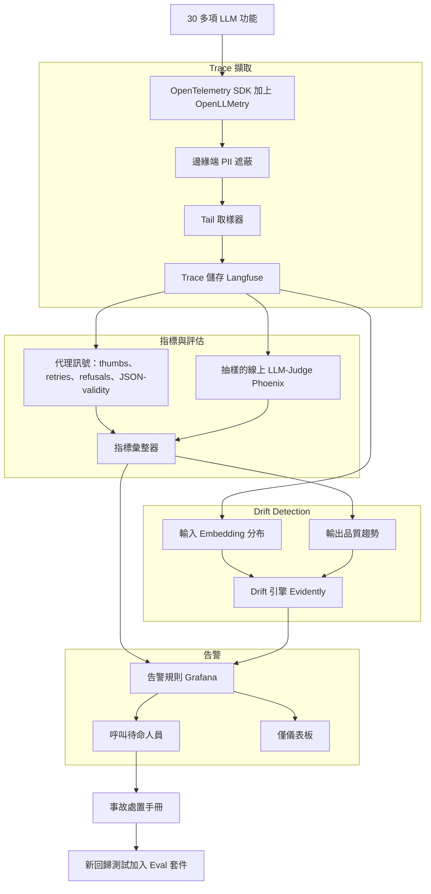
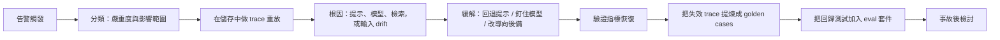

# 案例研究：LLM 可觀測性與事故應變

一家在生產環境跑了 30 多項 LLM 功能的公司，總是從客戶抱怨而非儀表板得知品質問題。他們以 OpenTelemetry GenAI 慣例搭配一個 tracing 平台，建立起 LLM observability 的實務做法，再疊上線上品質訊號與 drift detection，並寫出一份事故應變手冊，讓 AI 特有的失效能在數分鐘內被捕捉，並透過 trace 重放追出根因。

## 商業問題

一家中型 SaaS 公司在生產環境有 30 多項 LLM 功能：一個 RAG 求助中心、三個 agent 工作流、一群分類器（意圖、情緒、PII），以及一個面向客戶的聊天機器人。在一季之內他們被燒到五次。一次提示重構悄悄讓退款政策的答案回歸了，客服 11 天都沒注意到。他們的廠商在一個釘住的別名（alias）底下換上了新的模型 build，萃取 agent 的 JSON 有效性一夜之間從 99.3 percent 掉到 94 percent。一個提示樣板（templating）的 bug 在每一輪都把完整的對話歷史接了上去，每日的模型帳單從 $1,900 跳到 $7,400，才終於有人去看。一個外洩了系統提示的 jailbreak 出現在社群媒體上。上述每一件事都是 200 OK。傳統 APM（延遲、錯誤率、CPU）什麼異常都沒看到，因為對你的負載平衡器而言，一個自信地錯了的 LLM 回應，就是一個完全健康的 200。

來自 2026 年 6 月現實的限制條件：

- 30 多項 LLM 功能，橫跨 Claude、GPT 與 Gemini 端點，每日約 4.2M 次模型呼叫
- 生產環境沒有 ground truth 標籤；只有在使用者告訴你、或下游系統拒絕它時，你才會發現某個答案是錯的
- GDPR 與 SOC 2 範疇：提示與回應經常含有 PII，所以你不能就這樣把所有東西以明文記錄下來
- 可觀測性預算上限約為模型支出的 8 percent；在這個流量下若把每一筆完整 trace 都記下來，會直接爆掉
- 廠商會把模型更新藏在穩定的別名背後（[Anthropic model deprecations](https://docs.anthropic.com/en/docs/about-claude/model-deprecations)、[OpenAI model versioning](https://platform.openai.com/docs/models)），所以「我們把模型釘住了」並不是大家以為的那種保證
- MTTD 目標：品質回歸要低於 10 分鐘，相對於啟動這個專案的那個 11 天基線

團隊以 [OpenTelemetry GenAI semantic conventions](https://opentelemetry.io/docs/specs/semconv/gen-ai/) 作為 trace schema 的標準，以免被綁死在單一廠商，並把這些 trace 導向一個平台。他們在落腳於自架的 Langfuse（負責 trace 儲存）加上 Phoenix（負責評估）、並以 [OpenLLMetry](https://github.com/traceloop/openllmetry) 作為自動 instrumentation 層之前，先評估過 [Langfuse](https://langfuse.com/docs)、[LangSmith](https://docs.smith.langchain.com/)、[Arize Phoenix](https://docs.arize.com/phoenix) 與 [Helicone](https://docs.helicone.ai/)。

## 架構

### 元件

| 層級 | 技術 | 用途 |
|-------|------|---------|
| Instrumentation | OpenTelemetry SDK 加上 OpenLLMetry | 廠商中立的 GenAI spans |
| 遮蔽 | 以 Presidio 為基礎的邊緣端清理器 | 在儲存前剝除 PII |
| 取樣 | OTel tail 取樣器，自訂規則 | 把成本控制住，絕不丟棄錯誤 |
| Trace 儲存 | 自架 Langfuse | 完整的提示、回應、tokens、成本、模型版本 |
| 代理指標 | 在 trace 事件上的串流處理器 | Thumbs、retries、refusal rate、JSON-validity |
| 線上 judge | Arize Phoenix，Claude Haiku 4.5 judge | 無標籤的抽樣品質評分 |
| Drift 引擎 | Evidently 加上 embedding 監控 | 輸入偏移與輸出品質 drift |
| 告警 | Grafana 加上 PagerDuty | 呼叫與儀表板的分流 |
| Eval 回饋 | Eval-gated CI repo | 每一次事故都變成一個測試 |

### 資料流

1. 每一項 LLM 功能會為每次呼叫發出一個 OpenTelemetry span，帶有 GenAI 屬性：`gen_ai.request.model`、`gen_ai.response.model`（廠商實際服務的那個 build）、提示、回應、被呼叫的 tools、`gen_ai.usage.input_tokens`、`gen_ai.usage.output_tokens`、計算出的成本，以及延遲。
2. 一個遮蔽 sidecar 會在任何東西被持久化之前，從提示與回應欄位中清理 PII（姓名、email、卡號、自訂 regex）；原始文字永遠不會抵達 trace 儲存。
3. tail 取樣器決定保留策略：100 percent 的錯誤與 refusals、100 percent 被 judge 標記的 trace，以及 5 percent 的健康流量，並以 head-sampled 的方式做確定性取樣，讓一段完整對話被整體保留或整體丟棄。
4. 儲存下來的 trace 餵入兩條平行路徑：一個串流處理器近乎即時地計算代理品質訊號，另有一個抽樣子集由一個線上 LLM-judge 評分。
5. 彙整後的指標與原始輸入 embeddings 餵入 drift 引擎，後者分別追蹤輸入分布偏移與輸出品質趨勢。
6. 告警規則評估這些彙整值與 drift 分數；一小組會呼叫待命人員，其餘則更新儀表板。
7. 當一次呼叫觸發時，待命人員依手冊行事：分類嚴重度、重放出問題的 trace、隔離根因、緩解（回退提示、釘住模型、改導向後備）。
8. 事故後，失效的 trace 會被提煉成 golden cases，並推送到把關 CI 的 eval 套件，讓同一個回歸不會出貨兩次。

## 關鍵設計決策

### 1. 該記錄什麼，以及把所有東西都記下來的成本

在每日 4.2M 次呼叫下，對每次呼叫都記錄完整的提示與回應，既是成本問題也是法遵問題。一筆含有提示、回應與 tool 參數的完整 trace 平均落在 6 到 14 KB；在每日 4.2M 次下，那就是每日 25 到 60 GB 的熱 trace 儲存，而在這個量上自架 Langfuse 並不免費。我們的決定：在 100 percent 的呼叫上記錄一個結構化的封套（模型、tokens、成本、延遲、span 樹、代理指標旗標），但只在抽樣與錯誤的 trace 上保留完整的提示與回應文字。封套很便宜，且足以讓你計算每一項指標；完整文字才是你重放時所需的，而你只需要在真正重要的呼叫上做重放。保留採分層：完整 trace 熱存 30 天、封套 13 個月、錯誤與事故 trace 在冷儲存中無限期凍結。

### 2. Tracing 標準：採用 OpenTelemetry GenAI，讓你不被廠商綁死

團隊以 [OpenTelemetry GenAI semantic conventions](https://opentelemetry.io/docs/specs/semconv/gen-ai/) 而非某個廠商 SDK 來做 instrumentation。這是最重要的可攜性決策。這套慣例定義了穩定的屬性名稱（`gen_ai.system`、`gen_ai.request.model`、`gen_ai.usage.*`），讓同一套 instrumentation 今天餵 Langfuse，明天只要改個設定就能餵 [Datadog LLM Observability](https://docs.datadoghq.com/llm_observability/) 或 Grafana，而不是重寫。[OpenLLMetry](https://github.com/traceloop/openllmetry) 提供了為各大 SDK 發出這些 spans 的自動 instrumentation。當聊天機器人團隊想平行試用 Helicone 以 proxy 為基礎的擷取時，那只是加一個 OTLP exporter，而不是一場重新 instrumentation 的工程。

### 3. 在沒有 ground truth 的情況下做線上品質量測

這是核心問題：生產環境沒有標籤，所以「品質」必須從各種代理訊號推估。團隊使用一套分層的訊號堆疊，最便宜的優先：

- 確定性、免費：JSON-schema 有效性、regex/格式檢查、refusal 用語偵測、tool-call 成功率。JSON-validity 下降是模型被換掉最快的前導指標。
- 使用者行為、免費：thumbs up/down、重試率（使用者在 60 秒內重問）、對話放棄、把複製按鈕點擊當成一個正向訊號。
- 抽樣的 LLM-judge、付費：一個 [Claude Haiku 4.5](https://docs.anthropic.com/en/docs/about-claude/models) judge 以一份無參照（reference-free）的評分準則為 2 percent 的流量評分（對檢索脈絡的忠實度、指令遵循度、安全性）。偏差與成本的取捨是明擺著的：一個線上 judge 是有偏差的估計器，而且 judge 會隨著自身的模型更新而漂移，所以它設定的是趨勢，而非絕對真相。judge 提示有版本控制，並會週期性地對齊人工標籤來做校準，做法與 [eval-gated CI case study](18-eval-gated-cicd.md) 校準其離線 judge 的方式相同。這套方法論及其已知偏差來自 [Zheng et al., Judging LLM-as-a-Judge](https://arxiv.org/abs/2306.05685)。用 Haiku 4.5 評判 4.2M 次呼叫的 2 percent，每日約花 $40；評判 100 percent 則每日約花 $2,000，不值得。

真正重要的紀律：沒有任何單一代理訊號可以被單獨採信。一個 refusal-rate 尖峰加上一個 thumbs-down 尖峰再加上一個 judge-score 下滑，才是真的回歸；任一個單獨出現都是雜訊。

### 4. Drift detection：輸入分布相對於輸出品質

這是兩個不同的偵測器，把它們混為一談是常見的錯誤。輸入 drift 代表你的流量變了：一個新的客戶區隔、一次產品發布、一種不同的語言組成。偵測器會把進來的提示做 embedding，並用 population stability index 加上一個距離檢定，盯著 embedding 分布相對於一個滾動基線的變化，做法依循 [Evidently AI drift guide](https://docs.evidentlyai.com/) 與 [Arize embedding-drift methodology](https://docs.arize.com/arize/machine-learning/how-to-ml/drift-tracing)。輸入 drift 本身通常不是一次事故；它是用來解釋某個品質指標為何移動的脈絡。輸出品質 drift 代表你的答案在同一類輸入上變糟了：judge 分數、JSON-validity 或 refusal rate 趨勢往下。團隊強制執行的規則：對輸出品質 drift 呼叫待命人員、對輸入 drift 標註（不呼叫），而當兩者一起觸發時，輸入偏移就是可能的成因，手冊也這麼寫。

### 5. 不造成告警疲勞的告警

扼殺一套可觀測性實務最快的方式，就是對每件事都呼叫待命人員。團隊把訊號狠狠分流。會呼叫（把人挖起來）的：任一萃取功能的 JSON-validity 低於 97 percent、refusal rate 達 7 天基線的 3x、judge 分數週對週下降超過 8 分、每小時成本達尾隨平均的 2x、聊天機器人上任何安全分類器的命中。其他所有東西（延遲百分位、token 分布、輸入 drift、各功能流量）都僅供儀表板，並在每週的儀式中檢視。每一條呼叫規則都有一個最短持續時間條件（持續 10 分鐘，而非單一尖峰）與一個清楚的手冊連結，做法依循 [Google SRE workbook on alerting](https://sre.google/workbook/alerting-on-slos/)。他們把每週呼叫次數當成一項 SLI 追蹤；當它爬過 5 時，他們就把告警設定本身當成 bug 來處理。

### 6. 當廠商在你底下悄悄換掉模型

這是大家低估的失效。你釘住 `claude-sonnet-4-7` 或某個 GPT 別名，並假設行為已被凍結，但廠商會出貨新的 build 並把穩定的別名導向它們，而且淘汰日程會變動（[Anthropic deprecations](https://docs.anthropic.com/en/docs/about-claude/model-deprecations)、[OpenAI versioning](https://platform.openai.com/docs/models)）。偵測有三層。第一，記錄 `gen_ai.response.model`（被服務的 build 字串），而不只是被請求的別名，並對任何變動發出告警。第二，只要廠商有提供，就釘到一個帶日期的 snapshot id，而非一個浮動的別名。第三，廠商端 canary 模式：一組固定的 200 個 golden 提示每小時對著每個生產環境的模型別名跑一次，輸出會與一個儲存好的基線做 diff；行為偏移會在客戶流量受影響之前就觸發。當萃取的 JSON-validity 一夜之間下降時，這個 canary 本可在一小時內抓到那次換模，而不是透過客服佇列。

### 7. 針對 AI 特有事故的事故應變手冊

通用的 SRE 手冊假設失效是一次當機（outage）。AI 事故通常是降級（degradation），所以這份手冊是專門打造的，嚴重度繫於影響範圍（blast radius）。Sev1：面向客戶介面上的安全/jailbreak，或一個影響付費客戶的旗艦功能上的回歸。Sev2：非旗艦功能上一個可量測的品質回歸，或一個超過 $1,000/小時的成本異常。Sev3：drift 警告與緩慢的趨勢。每個嚴重度都有一個固定的首要動作（Sev1 聊天機器人安全命中：立刻把該功能導向一個更嚴格的 guardrail 設定，然後再調查）。分類一律從 trace 儲存開始：篩選到受影響的功能與時間窗、拉出抽樣的失效 trace，然後重放。標準的緩解措施是回退提示（一次 commit）、把模型釘到上一個已知良好的 snapshot，或改導向另一家廠商的後備模型。

### 8. 閉合迴路：每一次事故都變成一個回歸測試

一次你沒有編入 eval 套件的事故，就是一次你會再次出貨的事故。每一次事故後檢討的最後一步都是機械式的：從 trace 儲存中取出失效的 trace、遮蔽並最小化成 golden cases，然後把它們推進把關 CI 的 eval 集合，也就是 [eval-gated CI/CD pipeline](18-eval-gated-cicd.md)。那次花了 11 天才找到的退款政策回歸，變成了 14 個標記為 `incident-2026-q2-refund` 的 golden cases；任何未來會讓它們回歸的提示變更，現在都會擋住合併。這就是把可觀測性從一塊儀表板變成一個棘輪（ratchet）的迴路：生產環境教導離線套件，而離線套件防止重蹈覆轍。這個模式依循 [Hamel Husain's field guide](https://hamel.dev/blog/posts/field-guide/) 中的「錯誤分析到 eval」飛輪。

### 9. 可觀測性自身的成本

可觀測性並不免費，而在這個量上它可能悄悄成為前五大的支出項目。可用的槓桿：狠狠取樣健康流量（5 percent），同時保留 100 percent 的錯誤與被 judge 標記的 trace；對所有東西儲存便宜的封套，只在重放有可能發生的地方儲存昂貴的完整文字；以及只評判一小撮抽樣而非全部流量。團隊把可觀測性預算編在模型支出的 8 percent 以下，並把它當成一等的成本來追蹤。取樣的取捨是真實且被明確點名的：5 percent 取樣意味著一個發生在 0.5 percent 流量上、罕見但嚴重的失效可能被低估，這正是為什麼錯誤與安全 trace 完全繞過取樣、永遠被保留。

## 失效模式與緩解措施

### F1：藏在 200 OK 背後的無聲品質回歸

一次提示變更讓答案變得微妙地錯了；延遲與錯誤率都完美，所以 APM 默不作聲。緩解：代理訊號堆疊（JSON-validity、refusal rate、thumbs、retries）加上抽樣的線上 judge，能獨立於 HTTP 狀態偵測到品質的移動；canary golden 集則會在流量之前就抓到行為偏移。

### F2：告警疲勞埋掉了真正的告警

太多低價值的呼叫，訓練待命人員把它們一揮而過，於是唯一一個真正的呼叫被忽略了。緩解：呼叫與儀表板的分流、最短持續時間條件、一個上限為 5 的每週呼叫次數 SLI，以及一個每月檢討，會刪除或降級任何呼叫了卻沒有任何動作被採取的規則。

### F3：廠商一夜之間換掉模型 build

一個穩定的別名開始導向一個新的 build，而某個功能降級了。緩解：對 `gen_ai.response.model` 的變動發出告警、釘到帶日期的 snapshot，並跑每小時的廠商端 canary golden 集，讓行為偏移在一小時內被抓到。

### F4：提示長度 bug 造成的成本尖峰

一個 templating bug 在每一輪都把歷史接上去，token 用量爆炸。緩解：一個以尾隨平均 2x 為界的每小時成本呼叫、一個各功能的 token 預算告警，以及一個自動化的每日 diff，比對各功能的平均輸入 token 數，標出階梯式變化。

### F5：PII 被記進 trace，一場來自可觀測性系統自身的法遵事故

那個本該給你安全的工具，反而成了破口：帶有卡號的原始提示落進了 trace 儲存。緩解：遮蔽在持久化之前就於邊緣端執行（以 Presidio 為基礎）、trace 儲存的 schema 禁止在已遮蔽欄位之外出現原始文字欄位，並有一個夜間掃描器抽樣已儲存的 trace 檢查 PII 外洩，對任何命中發出告警。

### F6：取樣漏掉一個罕見但嚴重的失效

一個災難性但低頻的失效落在 5 percent 抽樣之外。緩解：錯誤、refusals、安全分類器命中，以及被 judge 標記的 trace 全都繞過取樣，以 100 percent 保留；只有健康、不起眼的流量會被取樣。

### F7：Drift 偵測器對良性的流量偏移誤報

一次產品發布改變了輸入組成，drift 偵測器尖叫，但其實沒有任何東西出錯。緩解：輸入 drift 採標註而非呼叫；只有輸出品質 drift 會呼叫；手冊中把相關聯的輸入加輸出 drift 標記為「可能是良性成因」，讓待命人員不會去追一個非事故。

### F8：Trace 量讓可觀測性帳單暴增

在一個高 QPS 功能上的冗長 tracing，悄悄讓儲存成本翻三倍。緩解：封套相對於完整文字的分層、對健康流量做積極取樣、分層保留（熱存 30 天、封套 13 個月），以及一個每月的可觀測性成本檢討，對著「模型支出的 8 percent」預算強制執行一個硬上限。

## 維運考量

### 監控

| SLO | 目標 |
|-----|--------|
| 品質回歸的 MTTD | 低於 10 分鐘 |
| 萃取 JSON-validity | 超過 99 percent |
| Trace 擷取完整度（封套） | 超過 99.9 percent |
| 每週呼叫次數 | 低於 5 |
| 已儲存 trace 中的 PII 外洩 | 每次掃描 0 |
| 線上 judge 對人工的校準（kappa） | 超過 0.7 |

### 成本模型

在每日 4.2M 次呼叫下：

- Trace 儲存（自架 Langfuse，運算加上熱儲存）：$3,200/月
- 線上 LLM-judge（Haiku 4.5，2 percent 抽樣）：$1,200/月
- Drift 與 embedding 運算（Evidently 加上 embedding 作業）：$700/月
- 遮蔽與串流處理：$900/月
- 事故與錯誤 trace 的冷封存：$300/月
- 總計：約 $6,300/月，低於模型支出的 8 percent

以金額計的取樣取捨：從 5 percent 提到 100 percent 的完整文字保留，會把 trace 儲存推過 $20K/月、把 judge 推過 $60K/月，換來的卻只是在已被涵蓋的健康流量上的邊際增益。5 percent 的下限加上 100 percent 的錯誤/安全保留，就是這條曲線的拐點。

### 待命處置手冊

- 某個萃取功能的 JSON-validity 下降：檢查 `gen_ai.response.model` 看是否有廠商換模；若有變動，就釘到上一個已知良好的 snapshot，並重跑 canary 集。
- 聊天機器人的 refusal-rate 尖峰：重放被標記的 trace；若與某次提示變更相關，就回退那次提示 commit；若是輸入驅動的，就檢查是否有 adversarial/jailbreak 攻勢。
- 每小時成本 2x 告警：拉出過去一小時內 token 數最高的 trace，找出失控的提示樣板，或一個不會終止的 agent 迴圈。
- 生產環境的安全分類器命中：立刻把該功能導向更嚴格的 guardrail 設定、擷取那筆 trace，然後再分類；這是 Sev1。
- 在代理訊號穩定的情況下出現 judge-score drift：懷疑是 judge drift，而非產品 drift；在宣告為一次產品事故之前，先對著新鮮的人工標籤重新校準 judge。
- 與輸入偏移相關聯的 drift 呼叫：當成可能良性處理、在儀表板上標註、降級，除非輸出品質也在劣化。

## 強力面試候選人會涵蓋哪些內容

- 他們會解釋為什麼傳統 APM 對 LLM 失效是盲的：一個 200 OK 可能自信地錯了，所以你需要的是品質訊號，而不只是延遲與錯誤率。
- 他們會為了可攜性而以 OpenTelemetry GenAI 慣例做 instrumentation，並能說出關鍵屬性（`gen_ai.request.model`、`gen_ai.response.model`、`gen_ai.usage.*`）。
- 他們會用一套分層的代理堆疊（確定性檢查、使用者行為、抽樣 LLM-judge）在沒有標籤的情況下做線上品質量測，並誠實地承認 judge 是一個有偏差的趨勢訊號，而非真相。
- 他們會區分輸入分布 drift 與輸出品質 drift，並對它們做不同的告警。
- 他們會把告警設計成避免疲勞：對一小組呼叫、其餘上儀表板，並把每週呼叫次數當成一項 SLI 追蹤。
- 他們對廠商換模有一個具體的答案：記錄被服務的 build、釘住帶日期的 snapshot，並每小時在廠商端跑一個 canary golden 集。
- 他們會藉由把每一次事故變成 eval-gated CI 套件中的一個回歸測試來閉合迴路，並用取樣與分層保留來框住可觀測性自身的成本。

## 參考資料

- OpenTelemetry, [GenAI semantic conventions](https://opentelemetry.io/docs/specs/semconv/gen-ai/)
- [Langfuse documentation](https://langfuse.com/docs)
- [LangSmith documentation](https://docs.smith.langchain.com/)
- [Arize Phoenix documentation](https://docs.arize.com/phoenix)
- [Helicone documentation](https://docs.helicone.ai/)
- Traceloop, [OpenLLMetry](https://github.com/traceloop/openllmetry)
- Datadog, [LLM Observability](https://docs.datadoghq.com/llm_observability/)
- [Evidently AI: data and ML drift detection](https://docs.evidentlyai.com/)
- Arize, [Embedding drift tracing](https://docs.arize.com/arize/machine-learning/how-to-ml/drift-tracing)
- Google SRE, [Alerting on SLOs](https://sre.google/workbook/alerting-on-slos/)
- Zheng et al., [Judging LLM-as-a-Judge with MT-Bench and Chatbot Arena](https://arxiv.org/abs/2306.05685)
- Anthropic, [Model deprecations](https://docs.anthropic.com/en/docs/about-claude/model-deprecations)
- Hamel Husain, [A field guide to rapidly improving AI products](https://hamel.dev/blog/posts/field-guide/)

相關章節：[LLM Evaluation](../14-evaluation-and-observability/01-llm-evaluation.md)、[AI Evals Guide (Phoenix, LangWatch & Langfuse)](../ai_evals_comprehensive_study_guide.md)、[Case Study: Eval-Gated CI/CD](18-eval-gated-cicd.md)。
