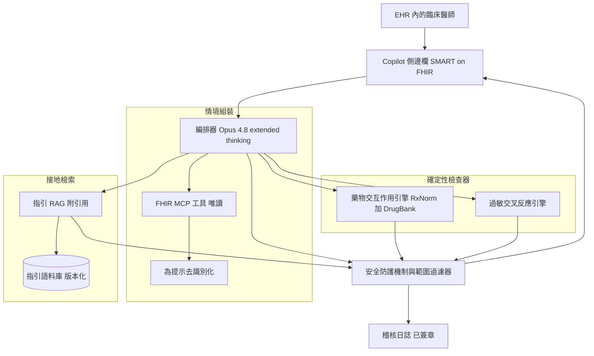
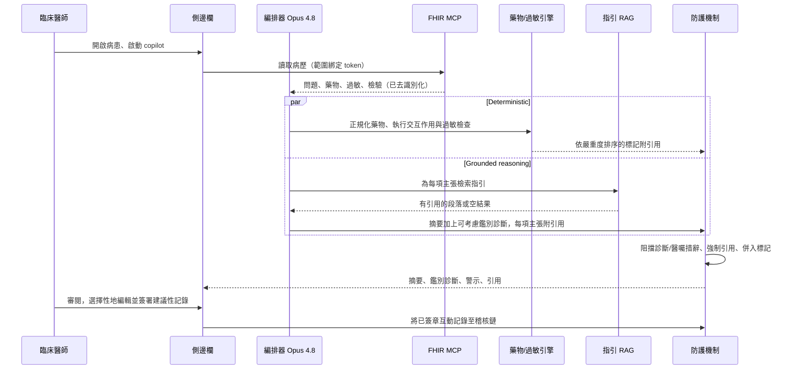

# 案例研究：臨床決策支援 copilot

一家區域型醫療體系在 EHR 內嵌入一個 copilot，它會摘要病患病歷、呈現有引用來源的實證指引、提出可供參考的鑑別診斷，並執行確定性的藥物交互作用與過敏檢查。它是決策支援，而非自主診斷：由臨床醫師做決定，工具負責提供資訊與引用，且每一項臨床主張都能追溯回臨床醫師可以獨立查核的來源。

## 商業問題

一個由 12 家醫院組成的醫療體系在 4,000 名臨床醫師之間運行 Epic。主治醫師與住院醫師會花掉一次看診中很大一部分的時間，去整合一份零散的病歷，而漏掉的藥物交互作用與過時的指引遵循，同時帶來病患傷害與醫療糾紛風險。CMIO 贊助了一個 copilot，它在既有的 EHR 內做四件事：摘要病患的相關病史、附引用來源拉出當前指引、提出可供參考的鑑別診斷，並標示交互作用與過敏。它明確的非目標是自主地進行診斷或開立任何醫囑。

來自 2026 年 6 月現實的限制條件：

- PHI 絕不離開 BAA 邊界。推論在 Claude Opus 4.8 上、依據與 Anthropic 簽訂且零資料保留的 Business Associate Agreement 執行，或對最高敏感度的服務線採用地端 Llama 4 後備方案（[HHS HIPAA Security Rule](https://www.hhs.gov/hipaa/for-professionals/security/index.html)）。
- 產品必須停留在 FDA Clinical Decision Support 豁免範圍內：面向臨床醫師、基礎透明、可獨立查核、且非屬時間關鍵決策的主要裝置（[FDA CDS guidance, Sept 2022](https://www.fda.gov/regulatory-information/search-fda-guidance-documents/clinical-decision-support-software)）。
- 臨床醫師會棄用誤報率高的工具。既有的 EHR 交互作用警示有 49 到 96 percent 的機率被覆寫掉；警示疲乏是這類產品的主要失效模式（[Ancker et al., BMC Med Inform Decis Mak 2017](https://bmcmedinformdecismak.biomedcentral.com/articles/10.1186/s12911-017-0430-8)）。
- LLM 會虛構出看似合理的藥物、劑量與引用。針對 GPT 級模型在臨床推理上的研究顯示，它有可用的記憶回想能力，但在缺乏接地（ungrounded）時錯誤率高到不安全（[Goh et al., JAMA Network Open 2024](https://jamanetwork.com/journals/jamanetworkopen/fullarticle/2825395)）。
- 指引會變動。一個引用了已被取代的 ACC/AHA 或 IDSA 建議的 copilot 是一種風險，因此檢索語料庫的新鮮度是第一級的 SLO。
- 整合主要透過 FHIR R4 以唯讀方式進行；copilot 讀取病歷，除了一份臨床醫師必須簽署的選用建議性記錄之外，不回寫任何東西（[HL7 FHIR R4](https://hl7.org/fhir/R4/)）。

## 架構

### 元件

| 層級 | 技術 | 用途 |
|-------|------|---------|
| EHR 介面 | Epic 內的 SMART on FHIR 側邊欄 | 帶引用、臨床醫師在迴路中的 UI |
| 編排器 | Claude Opus 4.8，extended thinking | 推理、摘要、鑑別診斷框架化 |
| EHR 存取 | FHIR R4 MCP 工具，唯讀範圍 | 拉取病歷、藥物、問題、檢驗 |
| 去識別化 | Presidio 加上 Safe Harbor 處理 | 最小化送入模型的 PHI |
| 藥物交互作用 | RxNorm 正規化加上 DrugBank 規則 | 確定性，而非 LLM 臆測 |
| 過敏檢查 | 交叉反應表加上 RxNorm 類別對應 | 確定性的過敏與類別警示 |
| 指引 RAG | 版本化語料庫、混合檢索、rerank | 接地、有引用的臨床主張 |
| 防護機制 | 範圍過濾器加上輸出分類器 | 阻擋診斷/醫囑措辭、維持 CDS 界線 |
| 稽核 | 僅可附加儲存、SHA-256 鏈 | 法規與醫療糾紛紀錄 |

### 資料流

1. 臨床醫師開啟一位病患並啟動 copilot 側邊欄；SMART on FHIR 鑄造出一個範圍綁定到該次就診與該臨床醫師權限的情境 token。
2. FHIR MCP 工具以唯讀方式拉取作用中的問題清單、藥物、過敏、近期檢驗與相關記錄。
3. 在任何文字到達模型之前，會先有一道去識別化處理剝除 Safe Harbor 識別資訊；內部紀錄 ID 會被 token 化，以便結果能在本地重新關聯。
4. 藥物清單會與 LLM 呼叫並行送往確定性的交互作用與過敏引擎；這些不會經過 LLM。
5. 帶 extended thinking 的 Opus 4.8 會摘要病歷並草擬一份可供參考的鑑別診斷；每一項臨床主張都由一次進入版本化指引語料庫的檢索呼叫予以接地，並附帶引用。
6. 防護機制檢視草稿：它阻擋自主診斷與醫囑措辭、驗證每一項臨床斷言都帶有引用，並併入確定性的交互作用與過敏警示（這些一律優先於模型文字）。
7. 側邊欄會呈現摘要、附正反證據的「可供參考」鑑別診斷、有引用的指引，以及任何強制性的交互作用或過敏標記，並提供一鍵連往來源的連結。
8. 除非臨床醫師編輯並簽署一份建議性記錄，否則不會有任何東西寫入病歷；完整的互動、引用與檢查器輸出都會寫入已簽章的稽核日誌。

## 關鍵設計決策

### 1. 決策支援，而非自主診斷

這是法規與倫理的界線，並決定了整個設計。為了停留在 FDA 的非裝置 CDS 豁免內，軟體必須展示其基礎，讓臨床醫師能獨立查核，而非依賴它（[FDA CDS guidance](https://www.fda.gov/regulatory-information/search-fda-guidance-documents/clinical-decision-support-software)；[21st Century Cures Act 520(o)(1)(E)](https://www.congress.gov/bill/114th-congress/house-bill/34)）。具體而言：copilot 絕不說「病患患有 X」或「開立 Y」。它說「可考慮 X；支持證據在此；反對證據在此」，並且呈現指引而非指令。它在時間關鍵決策上也完全退讓（一個驅動緊急行動的 copilot 會變成受規管的裝置）。我們把豁免條件當作產品驗收測試，而非法律上的事後補充。

### 2. 把每一項臨床主張接地到有引用的指引，絕不依賴模型記憶

模型的參數化知識，就任何臨床斷言而言都被視為不可信。每一項建議、劑量範圍或診斷標準都必須來自版本化語料庫的一次檢索命中（UpToDate 風格的摘要、學會指引如 [ACC/AHA](https://www.acc.org/guidelines) 與 [IDSA](https://www.idsociety.org/practice-guideline/practice-guidelines/)，以及原始文獻）。如果檢索沒有回傳任何相關內容，copilot 會如實說明，而不是用記憶填補空白。這是標準的接地 RAG 紀律，以零容忍度套用，因為虛構劑量的代價是病患傷害。參見 [RAG Fundamentals](../06-retrieval-systems/01-rag-fundamentals.md)。

### 3. 確定性的藥物交互作用與過敏檢查，絕不由 LLM 臆測

交互作用與過敏邏輯完全不經過 LLM。藥物會被正規化為 [RxNorm](https://www.nlm.nih.gov/research/umls/rxnorm/index.html) concept ID，接著對照一個經策展的規則資料庫（[DrugBank interaction data](https://go.drugbank.com/)）與一張過敏交叉反應表（例如，盤尼西林對頭孢菌素的類別風險）進行評估。輸出是確定性、可重現、可稽核的，每條規則都帶有嚴重度與引用。LLM 可以用白話解釋一個被標示的交互作用，但它既不能建立也不能抑制一個標記。正是這種分離讓我們能為系統辯護：監管者或辯護律師可以重跑檢查器，並得到完全相同的結果。

### 4. 警示疲乏：警示寧取精確率而非召回率，否則臨床醫師會把它關掉

我們刻意把呈現出來的警示朝精確率調校。文獻毫不含糊地指出，低特異度的警示會被覆寫到形同虛設，整個工具也會被忽視（[Ancker et al. 2017](https://bmcmedinformdecismak.biomedcentral.com/articles/10.1186/s12911-017-0430-8)；[Backman et al., 2017](https://bmjopen.bmj.com/content/7/3/e013647)）。我們依嚴重度與病患情境把警示分層、抑制臨床醫師已接受的已知良性組合，並且只為高嚴重度、高信心的發現進行打斷。較低層級的資訊則被動地停留在側邊欄。我們把覆寫率當作產品健康指標來追蹤；覆寫率往 EHR 基準線攀升，就代表我們正在失敗。

### 5. PHI 處理：BAA 推論、去識別化與稽核

PHI 暴露在每一個環節都被最小化。我們只送給模型任務所需的內容，經 Microsoft Presidio 加上一道 Safe Harbor 規則處理予以去識別化，並在零保留的 Anthropic BAA 下執行推論，或對行為健康及其他敏感服務線完全在地端執行（[HHS HIPAA](https://www.hhs.gov/hipaa/for-professionals/security/index.html)）。每一次存取都會連同臨床醫師身分、就診、所呼叫的工具、檢索引用與檢查器結果一併記錄，放在一個僅可附加、以 SHA-256 串鏈的儲存中，供資安事件調查與 HIPAA 6 年保留要求使用。

### 6. 鑑別診斷以「可考慮」框架呈現，並附正反證據

鑑別診斷以一份可考慮病況的排序清單呈現，每一項都附有來自病歷的支持發現、相矛盾的發現，以及定義其診斷標準的指引。展示反證既是安全特性（它對抗錨定效應），也是豁免特性（它讓基礎變得可查核）。Opus 4.8 的 extended thinking 在這裡非常合適，因為其可見的推理一旦經過接地與引用查核，就成為臨床醫師查核時所依據的解釋（[Anthropic extended thinking](https://docs.anthropic.com/en/docs/build-with-claude/extended-thinking)）。

### 7. 對照臨床醫師的標準答案做評估，而不是只靠 LLM-judge

我們不用 LLM judge 來認證安全性。一個由主治醫師組成的常設小組會對照經裁定的標準答案為 copilot 輸出評分，我們會回報交互作用偵測與鑑別診斷相關性的敏感度與特異度，外加引用忠實度比率。我們也會在公開資料集（MedQA 與更貼近現實的 [HealthBench](https://openai.com/index/healthbench/)）上做基準測試以追蹤回歸，但放行關卡是臨床醫師小組。LLM-judge 評分僅用於小組週期之間廉價的預先篩檢。

### 8. 誠實地處理不確定性：直說「證據不足」

當病歷模稜兩可，或指引語料庫未涵蓋該情境時，copilot 被打造成會說「證據不足以提出鑑別診斷」，而不是產生一個自信的猜測。我們會量測並獎勵經校準的棄答（abstention）；一個在有信心時答對、在不確定時保持沉默的 copilot，能贏得臨床醫師的信任，而這正是這裡稀缺的資源。

### 9. 工具必須完全退讓的場域

有些區域是 copilot 依政策拒絕介入的：進行中的緊急情況與急救（退讓讓我們不落入裝置規管，也不在關鍵路徑中採取行動）、新生兒與依體重計算的兒科給藥邊緣案例（錯誤面太不容寬待），以及任何腫瘤科化療給藥，這會被導向專屬的受規管系統。在這些區域裡，copilot 會顯示一個強制性的「超出範圍，請遵循臨床判斷與專科系統」訊息，而非提供建議。

## 失效模式與緩解措施

### F1：幻覺出的藥物、劑量或指引

模型杜撰出一個看似合理但錯誤的劑量，或引用一個不存在的指引。緩解：臨床斷言必須解析到一次檢索命中（決策 2）；一個引用忠實度分類器會拒絕任何引用無法支持其內容的草擬主張；劑量是從指引文字與 RxNorm 連結的參考資料中呈現出來的，絕不自由生成。沒有來源支持的主張會在渲染前被丟棄。

### F2：聽起來自主、跨越 SaMD 界線的建議

copilot 把輸出措辭成一道指令（「開始 vancomycin 1g IV q12h」），這既危及病患，也把產品轉變為受規管的裝置。緩解：防護機制的輸出分類器會阻擋祈使式的診斷與醫囑措辭，並改寫為「依 [guideline] 可考慮」；放行測試包含試圖誘出指令式語言的對抗性提示，且 [FDA exemption criteria](https://www.fda.gov/regulatory-information/search-fda-guidance-documents/clinical-decision-support-software) 被編碼為失敗測試。

### F3：誤報造成的警示疲乏

低價值的交互作用警示會訓練臨床醫師對一切置之不理，包括那個危險的警示。緩解：精確率優先的分層、對已接受良性組合的情境化抑制、對低嚴重度採被動顯示，以及對照[已發表的 EHR 基準線](https://bmcmedinformdecismak.biomedcentral.com/articles/10.1186/s12911-017-0430-8)持續監控覆寫率（決策 4）。

### F4：漏掉的關鍵交互作用（偽陰性）

一個確實危險的交互作用沒有被標示。緩解：確定性引擎特別針對高嚴重度層級調校為高召回率（我們接受更多低層級雜訊，以換取近乎完整的高嚴重度涵蓋率）、規則資料庫依 [DrugBank](https://go.drugbank.com/) 的發布節奏更新，且臨床醫師小組每次放行都對已知危險配對進行紅隊測試。高嚴重度層級上的偽陰性是會封鎖上線的缺陷。

### F5：PHI 外洩

可識別資料逃出 BAA 邊界，進入日誌、送往未經核准端點的提示，或錯誤病患的側邊欄。緩解：模型之前的去識別化（決策 5）、僅限 BAA 或地端的推論、把輸出綁定到單一病患的就診範圍 token、PHI 感知的日誌清洗，以及綁定到 [HHS Breach Notification Rule](https://www.hhs.gov/hipaa/for-professionals/breach-notification/index.html) 的資安事件回應處置手冊。

### F6：跨人口統計群體的偏誤

建議或風險框架因種族、性別或年齡而偏斜，重演已知的傷害，例如種族校正的 eGFR 或脈搏血氧偏誤。緩解：在臨床醫師小組中做子群體評估（依人口統計分層回報敏感度與特異度）、從語料庫移除已被否定的種族校正，以及對照如 [NIST AI Risk Management Framework](https://www.nist.gov/itl/ai-risk-management-framework) 等框架進行追蹤。超過門檻的差距會封鎖放行。

### F7：更新後過時的指引

某學會更新了一份指引，而 copilot 持續引用被取代的版本。緩解：語料庫以生效日期版本化、檢索偏好當前版本並標記被取代的命中、一個新鮮度 SLO 會在任何高流量指引舊於其已知修訂時告警，且一個策展團隊會對照學會出版動態進行核對。

### F8：忙碌臨床醫師的過度依賴與自動化偏誤

一名忙碌的臨床醫師未查核基礎就接受了建議，這正是自動化偏誤的陷阱。緩解：刻意設計的摩擦（建議性記錄需要簽名、鑑別診斷以反證開場、引用只需一鍵即達），外加在 app 內定期提醒「支援而非決策」的框架。我們把未檢視引用即簽署的比率當作自動化偏誤訊號來監看（[Goddard et al., JAMIA 2012](https://academic.oup.com/jamia/article/19/1/121/732845)）。

## 維運考量

### 監控與 SLO

| SLO | 目標 |
|-----|--------|
| 側邊欄渲染 p95 延遲 | 低於 6 s |
| 引用忠實度（有來源支持的主張） | 超過 98 percent |
| 高嚴重度交互作用召回率（對照小組標準答案） | 超過 99 percent |
| 警示覆寫率 | 低於 30 percent 且不上升 |
| 指引語料庫新鮮度落後 | 自出版起低於 14 天 |
| PHI 外洩事件 | 零 |
| 語料庫外案例的經校準棄答 | 超過 90 percent 正確棄答 |

### 成本模型

在 4,000 名臨床醫師、約 60 percent 每日活躍、每位活躍臨床醫師每天約 8 次 copilot 呼叫的情況下：

- 模型支出（Opus 4.8、extended thinking、長病歷）：每月 $42,000
- 指引檢索與重排序：每月 $3,500
- 確定性檢查器授權（RxNorm 免費、DrugBank 商業授權）：每月 $4,000
- 去識別化與稽核儲存：每月 $2,500
- 臨床醫師評估小組（裁定時間）：每月 $9,000
- 總計：約每月 $61,000，每次呼叫約 $0.13

extended thinking 與長病歷情境主導了支出；我們把病歷視窗限縮到相關資源，並快取指引語料庫的檢索，以把每次呼叫成本維持在 $0.13 附近。

### 待命處置手冊

- 引用忠實度跌破 98 percent：凍結鑑別診斷與摘要功能（保持確定性檢查器運作）、呼叫 ML 待命人員，並調查語料庫或分類器回歸。
- 通報高嚴重度交互作用漏失：當作 sev-1 病患安全事件處理、快照規則版本、通知 CMIO 與病患安全官，並執行信任破壞處置手冊。
- 疑似 PHI 外洩：啟動 [HIPAA breach](https://www.hhs.gov/hipaa/for-professionals/breach-notification/index.html) 處置手冊、隔離出問題的路徑，並保全稽核鏈片段以供鑑識。
- 過時指引告警：立即從檢索中撤下被取代的版本、推送更新版本，並張貼一則臨床醫師橫幅說明變更。
- 覆寫率飆升：暫停價值最低的警示層級，在重新啟用前先與臨床資訊委員會檢視。

### 治理與稽核

一個臨床治理委員會（CMIO、藥劑、病患安全、法務）每季檢視 copilot：依子群體的小組敏感度與特異度、覆寫與棄答趨勢、引用忠實度、語料庫變更日誌，以及任何安全事件。我們依 HIPAA 保留已簽章的稽核軌跡 6 年，並於要求時提供。參見 [AI Governance and Compliance](../13-reliability-and-safety/04-ai-governance-and-compliance.md)。

## 強力面試候選人會涵蓋哪些內容

- 他們會把 FDA CDS 豁免放在核心，並說明為何「附可查核基礎的可考慮建議」能讓產品維持為非裝置，引用獨立查核這項條件。
- 他們會把確定性檢查器（RxNorm 加 DrugBank）與 LLM 分開，並說明交互作用與過敏邏輯必須可重現且可稽核，絕不由模型臆測。
- 他們會把參數化知識視為不可信，並把每一項臨床主張接地到版本化、有引用的語料庫，在檢索為空時誠實棄答。
- 他們會點名警示疲乏是這類產品的主要失效模式，並在呈現的警示上選擇精確率而非召回率，以覆寫率作為健康指標。
- 他們會具體處理 PHI：去識別化、BAA 或地端推論、就診範圍 token,以及一條已簽章的稽核鏈。
- 他們會對照一個臨床醫師小組做評估，依子群體回報敏感度與特異度，而非只靠 LLM judge，並把高嚴重度偽陰性與人口統計差距當作上線封鎖項。
- 他們會點名工具必須完全拒絕的場域（緊急情況、新生兒與依體重計算的兒科給藥、化療），並說明退讓既是安全策略也是法規策略。

## 參考資料

- FDA, [Clinical Decision Support Software guidance (Sept 2022)](https://www.fda.gov/regulatory-information/search-fda-guidance-documents/clinical-decision-support-software)
- U.S. Congress, [21st Century Cures Act (H.R.34)](https://www.congress.gov/bill/114th-congress/house-bill/34)
- HHS, [HIPAA Security Rule](https://www.hhs.gov/hipaa/for-professionals/security/index.html)
- HHS, [HIPAA Breach Notification Rule](https://www.hhs.gov/hipaa/for-professionals/breach-notification/index.html)
- HL7, [FHIR R4 specification](https://hl7.org/fhir/R4/)
- NLM, [RxNorm](https://www.nlm.nih.gov/research/umls/rxnorm/index.html)
- [DrugBank drug-interaction data](https://go.drugbank.com/)
- Goh et al., [LLMs in clinical reasoning, JAMA Network Open 2024](https://jamanetwork.com/journals/jamanetworkopen/fullarticle/2825395)
- Ancker et al., [Alert fatigue and override rates, BMC MIDM 2017](https://bmcmedinformdecismak.biomedcentral.com/articles/10.1186/s12911-017-0430-8)
- Goddard et al., [Automation bias in clinical decision support, JAMIA 2012](https://academic.oup.com/jamia/article/19/1/121/732845)
- OpenAI, [HealthBench medical evaluation](https://openai.com/index/healthbench/)
- NIST, [AI Risk Management Framework](https://www.nist.gov/itl/ai-risk-management-framework)
- Anthropic, [Extended thinking](https://docs.anthropic.com/en/docs/build-with-claude/extended-thinking)

相關章節：[AI Governance and Compliance](../13-reliability-and-safety/04-ai-governance-and-compliance.md)、[RAG Fundamentals](../06-retrieval-systems/01-rag-fundamentals.md)、[Case Study: Voice AI in Healthcare](13-voice-ai-healthcare.md)。
