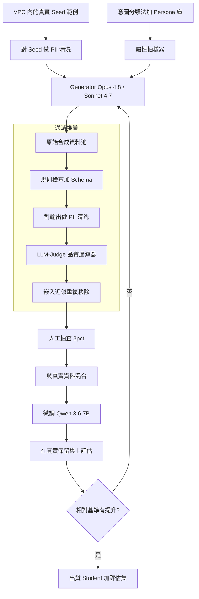
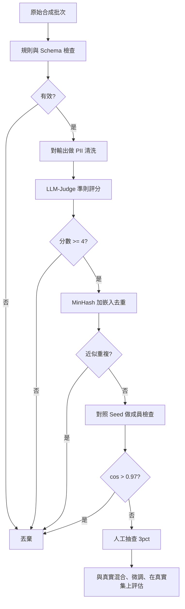

# 案例研究：合成資料生成管線

一支 AI 團隊在某個真實標註資料稀缺、私密或昂貴的領域中，需要訓練與評估資料。他們打造了一條管線，先用 Opus 4.8 與 Sonnet 4.7 生成合成範例，再積極地過濾、去重，並對照真實 seed 做驗證，讓微調後的 7B 分類器與一套保留的評估集，在真實任務上真正有所提升。這是[客戶專屬的蒸餾管線](19-customer-distillation-pipeline.md)的姊妹篇：在那邊，teacher 標註的是真實追蹤資料，而在這邊，generator 製造的是全新的輸入。

## 商業問題

一支金融科技客服團隊正在為一項受監管的產品（貸款服務、爭議處理、財務困難申請）打造意圖分類器。真實標註資料很單薄：意圖大約有 40 種，但其中 12 種在 6 個月的日誌裡出現不到 30 次，而最敏感的對話無法匯出給標註廠商。團隊需要每個意圖約 8K 筆平衡的範例，來微調一個 Qwen 3.6 7B 分類器，外加一套 1,500 個案例的評估集，而純靠人工標註會花掉超過 $90K 並耗時一季。合成生成看似是那根槓桿，但前提是合成的分布要吻合現實。

來自 2026 年 6 月現實的限制條件：

- 40 種意圖中有 12 種的真實範例不到 30 筆；長尾正是整個專案的重點所在。
- 最敏感的對話逐字稿（PII、帳號、財務困難揭露）不能離開 VPC，所以 generator 必須在真實 seed 上執行，而不能逐字複誦它們。
- 品質門檻：微調後的 student 必須在一套真實的保留集上勝過 few-shot 的 Opus 4.8 基準，而不是在合成資料上。
- 預算：生成加過濾合計低於 $6K，相對於 $90K 的人工標註替代方案。
- 法遵：稽核員必須能確認任何一筆合成訓練資料列裡都沒有出現真實的客戶 PII。
- 模型崩塌（model collapse）風險：團隊不能在未經過濾的 AI 輸出上遞迴訓練，那會在一代代之間使品質劣化。

這套做法奠基於十年來的指令資料合成研究：Self-Instruct（[Wang et al., 2022](https://arxiv.org/abs/2212.10560)）、Alpaca（[Taori et al., 2023](https://github.com/tatsu-lab/stanford_alpaca)）與 Evol-Instruct（[Xu et al., 2023](https://arxiv.org/abs/2304.12244)），再加上「Textbooks Are All You Need」的結論：經過策展的合成資料能以小搏大（[Gunasekar et al., 2023](https://arxiv.org/abs/2306.11644)）。硬性的限制則來自 Shumailov et al. 的模型崩塌發現（[Nature, 2024](https://www.nature.com/articles/s41586-024-07566-y)）：在生成資料上遞迴訓練，尾端就會消失。

## 架構

### 元件

| 層級 | 技術 | 用途 |
|-------|------|---------|
| Seed | 真實逐字稿，已清洗，在 VPC 內 | 錨定分布 |
| 屬性抽樣器 | 分類法加 persona 庫（YAML） | 涵蓋率與多樣性 |
| Generator | Opus 4.8（困難意圖）、Sonnet 4.7（大宗） | 產出候選資料列 |
| 規則與 schema 過濾器 | Pydantic 加 regex | 駁回格式錯誤與離題 |
| PII 清洗 | Microsoft Presidio 加微調過的 NER | 不外洩身分 |
| LLM-judge 過濾器 | Sonnet 4.7 評分準則 | 駁回低品質與離分布 |
| 去重 | `bge-large` 嵌入加 MinHash | 消除近似重複 |
| 訓練器 | 在 Qwen 3.6 7B 上做 LoRA，1x H100 | Student 分類器 |
| 評估關卡 | 真實保留集，1,500 個案例 | 唯一算數的指標 |

### 資料流

1. 團隊為每個意圖抽取一份分層的真實 seed 樣本，並在它們碰到 generator 提示之前先跑一道 PII 清洗。
2. 屬性抽樣器抽出一個 persona（管道、情緒、財務素養、地區）與一個分類法節點，讓每一次生成請求都被限定在單一意圖與單一 persona 組合上。
3. Generator 拿到 3 到 5 個清洗過的 seed 範例加上抽到的屬性，並以 temperature 0.9 產出一批結構化資料（通常每次呼叫 20 個候選）以求多樣性。
4. 規則檢查強制 schema、長度界限、語言，以及所宣稱的意圖標籤必須是 40 種有效意圖之一；格式錯誤的資料列會被丟棄。
5. 第二道 PII 清洗在生成輸出上執行，以攔截任何被背下來的、或幻覺出來的、看似真實的識別資訊。
6. 一個 LLM-judge 依一套評分準則（擬真度、標籤正確性、是否在分布內）以 1 到 5 分為每個候選評分；只有 4 分與 5 分存活（拒絕抽樣）。
7. 嵌入近似重複移除會丟棄與既有保留列在 cosine 0.92 之內的候選，以此強制多樣性，並設下每個意圖的數量上限。
8. 一道 3 percent 的人工抽查會稽核存活者；清理後的資料集與所有可用的真實資料混合，並用來微調 student，而 student 最終只在真實保留評估集上接受評判。

## 關鍵設計決策

### 1. 把生成錨定到真實 seed 資料，讓分布相吻合

純靠提示的合成會漂向一種乾淨的、教科書式的腔調，而那是真實客戶從不會用的。我們的第一批（無 seed）在合成評估上得到 91 percent，但在真實流量上只有 68 percent，正是蒸餾案例研究用合成提示時踩到的同一個陷阱。我們改採有 seed 的生成：每一次請求都帶著 3 到 5 個目標意圖的真實（清洗過）範例，並在提示中指示模型去吻合它們的語氣、長度與雜亂程度（錯字、不完整的句子、語碼轉換）。有 seed 的生成把真實評估的落差收斂到 4 個百分點。Seed 就是分布的錨；少了它們，你抽樣的是模型的先驗，而不是客戶的現實。

### 2. 用多樣性與涵蓋率控制來避免千篇一律的資料

天真的迴圈會產出成千上萬筆幾乎一模一樣的「我要爭議一筆扣款」資料列。我們用三種方式強制多樣性。第一，一套分類法：40 種意圖 x 子原因，而抽樣器會追蹤每個格子的計數，讓填得不足的格子被優先處理（主動涵蓋，而非隨機）。第二，一個 persona 庫：管道（聊天、電子郵件、電話逐字稿）、情緒、財務素養與地區（en-US、es-US、Spanglish），每次請求各自抽樣，這是出自 Persona-Hub 的 persona 條件化構想（[Chan et al., 2024](https://arxiv.org/abs/2406.20094)）。第三，temperature 0.9 搭配明確的「讓這筆和 seed 不一樣」指示。涵蓋率是一個被追蹤的指標：在每個分類法格子都至少有 200 筆存活列之前，我們不會出貨。

### 3. 用規則、LLM-judge 與人工抽查做品質過濾

生成很便宜；壞資料很昂貴，所以我們過量生成並狠狠駁回。三道關卡串接。規則檢查（schema、長度、有效標籤、語言辨識）幾乎免費，能攔下 8 到 12 percent。LLM-judge（Sonnet 4.7 對照一套 4 項準則的評分準則）是主力：它為擬真度、標籤正確性、政策合規與是否在分布內評分，而我們只保留 4 分與 5 分的列，這會再駁回 20 到 30 percent。一道對存活者做 3 percent 的人工抽查，驗證 judge 是否校準良好；當人工與 judge 的一致度掉到 90 percent 以下，我們就重新調整評分準則。從原始生成到可出貨的淨良率大約是 55 到 65 percent。正是這套拒絕抽樣的紀律，把有用的合成資料和雜訊區分開來（[Liu et al. 資料品質綜述， 2024](https://arxiv.org/abs/2406.15126)）。

### 4. 避免模型崩塌

模型崩塌是會搞垮天真合成管線的失效模式：在一個模型自己（或另一個模型）未經過濾的輸出上訓練，再用那個模型來生成下一批，於是一代代之間尾端消失，分布收窄到均值（[Shumailov et al., 2024](https://www.nature.com/articles/s41586-024-07566-y)）。我們用三條規則來避免它。我們絕不把微調後 student 的輸出回灌作為訓練資料。我們把每一個可用的真實範例都保留在訓練混合裡作為分布的錨（真實資料不會崩塌）。而且我們在每一次生成執行時都從真實逐字稿重新取 seed，而非從先前的合成批次，讓每一次生成都奠基在人類資料上，而不是前一個模型的猜測上。過濾堆疊也有幫助：積極的去重與「是否在分布內」的 judge，直接對抗驅動崩塌的變異流失。我們把「訓練 token 中屬於真實資料的比例」當作一個被追蹤的防護指標，並讓它維持在 15 percent 以上。

### 5. 透過嵌入與 MinHash 做去重

即使有多樣性控制，generator 還是會自我重複。我們用 `bge-large` 為每個候選做嵌入，並用一個 FAISS 索引丟棄任何與保留列在 cosine 0.92 之內的列，再加上一道更便宜的 MinHash/LSH 流程（[Broder, 1997](https://dl.acm.org/doi/10.5555/829502.830043)），在嵌入步驟之前先攔下完全與近乎完全的字面重複。去重不是可有可無的修飾：一份未去重的資料集有 31 percent 是近似重複，這既浪費多樣性預算，又會在一筆重複橫跨訓練與評估時膨脹評估分數。我們依意圖調整門檻；罕見意圖容忍 0.94，常見意圖則用 0.90。

### 6. 對生成資料做 PII 與安全清洗

兩道清洗流程，因為 generator 既可能複誦一個被背下來的 seed 識別資訊，也可能幻覺出一個看似真實的。Microsoft Presidio（[文件](https://microsoft.github.io/presidio/)）加上一個微調過的 NER 模型，會標出區段（姓名、帳號、SSN、電子郵件、地址），並用類別 token（`[ACCOUNT]`、`[PERSON]`）取代它們。這個遮蔽模型在一份標註樣本上被要求達到精確率超過 98 percent、召回率超過 95 percent。我們也跑一道成員檢查：任何與真實 seed 在 cosine 0.97 以上的合成列都會被當成很可能的近似複本而丟棄，以因應隱私文獻針對生成式模型所指出的背誦風險（[Carlini et al., 2021](https://arxiv.org/abs/2012.07805)）。稽核員會拿到清洗設定、NER 評估數字，以及成員檢查的日誌。

### 7. 下游評估迴圈是唯一算數的指標

合成資料若不能提升真實任務就一文不值。評估集是用真實的保留逐字稿建構的，由 3 位領域專家以多數決標註，而且它從不被生成、也從不被 generator 或 judge 看到。這個迴圈是：在當前的合成混合上微調，在真實集上評估，而且只有在真實 F1 提升時才去迭代生成提示。我們追蹤 macro-F1（讓罕見意圖也算數）並對照 few-shot 的 Opus 4.8 基準；只有當 7B 的 student 在真實資料上勝過那個基準時，專案才會出貨。中途的合成評估分數是診斷用，不是目標；直接去最佳化它們，正是團隊自我欺騙的方式。

### 8. 合成對真實的混合比例

我們不會只在合成資料上訓練。我們掃描混合比例並量測真實評估的 F1：全合成表現不佳，而曲線在常見意圖約 70 percent 合成 / 30 percent 真實處達到高峰，至於罕見意圖（幾乎沒有真實資料）則更靠近 90 percent 合成，並把那少數幾筆真實範例大幅上採樣。真實資料是讓 student 維持在真分布上的錨；合成資料則提供量體與尾端涵蓋。這個比例是依意圖而定，不是全域的，而且它本身就是一個在真實評估集上驗證過的、被調校過的超參數。

### 9. 何時合成資料是錯的答案

合成生成既非免費，也並不總是對的。不利的訊號如下。如果你能以合理成本取得真實資料，就去取得：在相同預算下，真實標註範例幾乎每一次都勝過合成。如果領域太過細膩而難以偽造（專科醫療推理、會適應你防禦的對抗式詐欺模式、任何模型先驗以你偵測不到的方式出錯的情況），generator 就會自信滿滿地產出貌似合理但其實錯誤的資料，而你會在缺乏正是你所欠缺的那種專業之下抓不出來。如果你特別需要的是評估資料，就傾向採用真實的保留資料；一套合成評估可能被污染，也可能去吹捧一個只不過吻合 generator 風格的模型。我們的篩選標準是：當任務界定清楚、瓶頸是資料稀缺而非概念難度，且你至少有幾百筆真實範例可供取 seed 與驗證時，合成才有幫助。如果這些都不成立，那就把錢花在人工標註上。

## 失效模式與緩解措施

### F1：分布錯配（在合成上很好，在真實上很差）

Student 在合成評估上拿高分，卻在真實流量上失敗，因為合成的腔調太乾淨了。緩解措施：錨定到真實逐字稿的有 seed 生成（決策 1）、提示中的「雜亂程度」指示，以及唯一出貨關卡是真實評估 F1 的規則（決策 7）。我們盯著合成減真實的 F1 落差，並把任何超過 5 個百分點的情況都視為分布警報。

### F2：一代代之間的模型崩塌

在 AI 輸出上遞迴訓練會收窄分布並抹除尾端。緩解措施：絕不把 student 輸出回灌作為訓練資料、永遠把真實資料保留在混合裡達到 token 的 15 percent 以上，並在每一次執行時都從真實逐字稿重新取 seed，而非從先前的合成批次（決策 4）。我們監控各意圖跨世代的嵌入變異；持續下降就是早期訊號。

### F3：低多樣性 / 近似重複氾濫

Generator 反覆重複少數幾種樣板，膨脹了計數卻沒有資訊量。緩解措施：分類法與 persona 抽樣（決策 2）、temperature 0.9，以及嵌入加 MinHash 去重（決策 5）。我們追蹤有效樣本數（去重後的唯一嵌入數除以原始計數），並在良率掉到 60 percent 以下時發出警報。

### F4：Generator 外洩 PII 或被背下來的資料

模型複誦了一個被背下來的真實識別資訊，或近乎逐字地再現了一筆 seed。緩解措施：雙重 PII 清洗（對 seed 與對輸出），搭配一個精確率超過 98 percent 的遮蔽模型，再加上一道把與任何 seed 在 cosine 0.97 之內的列丟棄的成員檢查（決策 6）。稽核員會收到清洗日誌與 NER 評估報告。

### F5：有偏的合成資料放大偏誤

Generator 過度呈現某種族群腔調或使情緒偏斜，而 student 會繼承並放大它。緩解措施：persona 抽樣強制跨地區與管道的平衡；我們在真實評估集上依地區與語言做切片分析，若任一切片低於 macro 平均超過 4 個百分點就封鎖出貨。合成資料中的偏誤是一個已知且受過研究的風險（[Wyllie et al. 論偏誤放大， 2024](https://arxiv.org/abs/2410.04840)）。

### F6：來自 generator 的標籤雜訊

Generator 為一則看似合理的訊息指派了錯誤的意圖。緩解措施：LLM-judge 明確地為標籤正確性評分、人工抽查量測殘餘的標籤錯誤率（目標低於 3 percent），而有爭議的列會被丟棄而非更正。某個意圖出現雜訊，就會觸發針對該意圖的評分準則收緊。

### F7：評估集污染（合成評估與訓練重疊）

一筆合成列同時外洩進訓練與評估，膨脹了分數。緩解措施：評估集 100 percent 是真實的且在生成之前就建好，而一道污染檢查流程會以嵌入與精確比對逐一檢查每個評估案例對照訓練池，並丟棄任何與某個評估案例在 cosine 0.95 之內的訓練列。我們在每一次訓練集重建時都重跑這道污染檢查。

### F8：在沒能提升指標的生成上超支

團隊燒掉預算去生成數以百萬計、卻從未推動真實 F1 的資料列。緩解措施：下游評估迴圈為支出把關（決策 7）；我們以每輪約 20K 列的方式生成、量測真實評估的提升，並停掉任何邊際提升不到 0.5 個 F1 點的生成路線。每輪預算警報在 $1.5K 時觸發。

## 維運考量

### 監控

| SLO | 目標 |
|-----|--------|
| 真實評估 macro-F1 對照 Opus 4.8 few-shot 基準 | 出貨前須勝過基準 |
| 合成減真實的 F1 落差 | 低於 5 個百分點 |
| 過濾良率（原始到可出貨） | 55 到 65 percent |
| 去重後的近似重複率 | 低於 3 percent |
| 抽查上的人工與 judge 一致度 | 超過 90 percent |
| 出貨列中的 PII 外洩率 | 0 確認，每批稽核 |
| 每意圖涵蓋率（已填滿的分類法格子） | 100 percent 且每格超過 200 列 |

### 成本模型

以 320K 個原始候選、橫跨 40 種意圖產出約 200K 筆可出貨列計：

- 生成（Sonnet 4.7 大宗加上在 12 種困難意圖用 Opus 4.8）：$2,600 一次性
- LLM-judge 過濾（Sonnet 4.7）：$900 一次性
- 嵌入加去重（`bge-large`，自建 GPU）：$150 一次性
- PII 清洗算力（Presidio 加 NER）：$200 一次性
- 人工抽查（3 percent，領域專家）：$1,400 一次性
- 微調（在 Qwen 3.6 7B 上做 LoRA，1x H100，約 10 小時）：$250 一次性
- 總計：約 $5,500，相對於 $90K 的人工標註替代方案

每批的定價遵循當前公告的費率：Sonnet 4.7 與 Opus 4.8 見 [Anthropic 定價頁](https://www.anthropic.com/pricing)；我們在共用的 seed 與指令前綴上，透過 Batch API 與提示快取（prompt caching）把生成成本砍了約 40 percent。

### 待命處置手冊

- 新批次出現真實評估回歸：凍結該批次，把生成提示與上一個良好版本做 diff，重放真實評估，若落差超過 5 個百分點就把提示回滾。
- 多樣性崩塌：拉出有效樣本數的儀表板；若良率低於 60 percent，就調高 temperature、放寬 persona 抽樣，並用新的真實逐字稿刷新 seed 池。
- 稽核中發現 PII 外洩：立即隔離該批次，以收緊過的設定重跑兩道清洗流程，並連同成員檢查日誌通報該事件。
- Judge 失準（人工一致度低於 90 percent）：暫停過濾，在一份新鮮的人工標註樣本上重新調整評分準則，並重新為受影響的批次評分。
- 污染命中：退役外洩的評估案例，對整個訓練池跑一遍「去重對照評估」的流程，並在當季內刷新評估集。

## 強力面試候選人會涵蓋哪些內容

- 他們會把生成新輸入（本案例）與標註真實追蹤資料（蒸餾案例研究）區分開來，並說明各自何時適用。
- 他們會把生成錨定到真實 seed，並解釋純合成資料會漂離真實分布，且以真實評估的落差作為佐證。
- 他們會以 Shumailov 的結論點名模型崩塌，並給出具體的防禦：不做遞迴訓練、把真實資料保留在混合裡、從真實資料重新取 seed。
- 他們會把過濾當成一連串關卡（規則、LLM-judge、去重、人工抽查），並引用一個務實的良率，而不是「模型會生成乾淨的資料」。
- 他們會堅持唯一的出貨關卡是一套真實的保留評估，並明確點出評估污染與合成評估的吹捧。
- 他們會用雙重清洗加成員檢查來處理 PII，而且能向稽核員交代清楚。
- 他們會說出何時合成資料是錯的答案（真實資料拿得到、領域太過細膩，或你需要一套可信賴的評估集）。

## 參考資料

- Shumailov et al., [AI models collapse when trained on recursively generated data (Nature, 2024)](https://www.nature.com/articles/s41586-024-07566-y)
- Wang et al., [Self-Instruct: Aligning Language Models with Self-Generated Instructions](https://arxiv.org/abs/2212.10560)
- Taori et al., [Stanford Alpaca: An Instruction-following LLaMA model](https://github.com/tatsu-lab/stanford_alpaca)
- Xu et al., [WizardLM: Evol-Instruct for complex instruction synthesis](https://arxiv.org/abs/2304.12244)
- Gunasekar et al., [Textbooks Are All You Need (Phi)](https://arxiv.org/abs/2306.11644)
- Chan et al., [Scaling Synthetic Data Creation with 1B Personas (Persona-Hub)](https://arxiv.org/abs/2406.20094)
- Liu et al., [A survey on data quality for synthetic and curated training data](https://arxiv.org/abs/2406.15126)
- Carlini et al., [Extracting Training Data from Large Language Models](https://arxiv.org/abs/2012.07805)
- Broder, [On the resemblance and containment of documents (MinHash)](https://dl.acm.org/doi/10.5555/829502.830043)
- Wyllie et al., [Fairness Feedback Loops and bias amplification in synthetic data](https://arxiv.org/abs/2410.04840)
- Microsoft, [Presidio PII detection and anonymization](https://microsoft.github.io/presidio/)
- Anthropic, [Model pricing](https://www.anthropic.com/pricing)

相關章節：[Knowledge Distillation](../03-training-and-adaptation/05-knowledge-distillation.md)、[Data Engineering for AI](../06-retrieval-systems/15-data-engineering-for-ai.md)、[Case Study: Customer Distillation Pipeline](19-customer-distillation-pipeline.md)。
