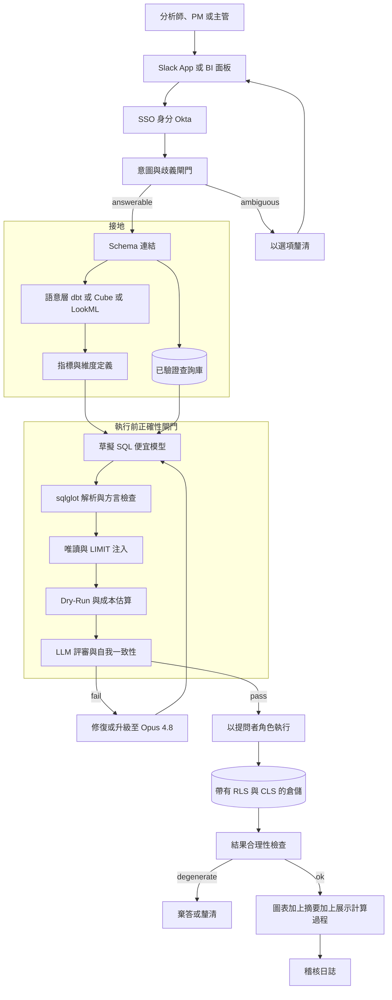
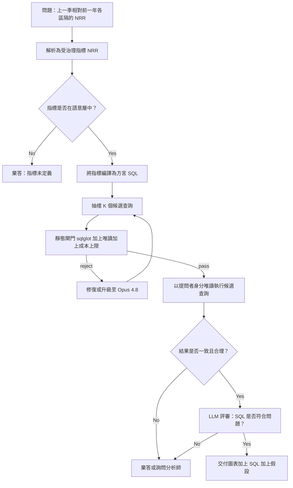

# 案例研究：對話式分析與 Text-to-SQL BI Copilot

一家 4,000 人公司的資料平台團隊推出了一個自然語言分析 copilot：分析師、PM 或主管在 Slack 或 BI 工具裡問「上一季相對前一年，各區隔的淨營收留存率是多少」，系統就對 Snowflake、BigQuery 或 Databricks 寫出 SQL、執行它，並回傳一張圖表加上一段淺白的文字摘要。最困難的單一限制不是涵蓋率，而是這個系統**絕不可回傳一個自信卻錯誤的數字**，因為一個幻覺出的 JOIN 或一個誤讀的指標定義，會產生一張看似合理、讓某位 VP 據以行動的圖表，而這嚴格來說比「我不知道」更糟。

## 商業問題

每一家大公司都有一疊自助式分析的待辦積壓。分析師是瓶頸、儀表板回答的是昨天的問題，而主管們現在就想在 Slack 裡得到答案。顯而易見的做法是把一個 LLM 指向倉儲的 schema，讓它寫 SQL。這種天真的設計會以最危險的方式失敗：它很流暢。它會樂呵呵地對一個原始的 `revenue` 欄位做 `SUM`、發明一個會扇出並重複計算的 JOIN、在財務指的是財務季時把「上一季」讀成日曆季，然後遞回一張乾淨的圖表，帶著一個錯誤的數字且沒有任何看得見的破綻。在原始企業 schema 上做 text-to-SQL 是真正尚未解決的問題：在使用真實倉儲資料庫與方言的 [Spider 2.0](https://arxiv.org/abs/2411.07763) 上，原始評測中最好的 agentic 方法也只解出約 17 percent 的任務，而 [BIRD](https://arxiv.org/abs/2305.03111) 顯示人類專家的執行準確度接近 93 percent，模型在貼近現實、髒亂的資料庫上則遠遠落後。

於是團隊把目標反轉過來。這個產品不是「回答任何問題」，而是「回答那些能對應到受治理指標的問題，並且可驗證地正確，其餘的則誠實棄答」。接下來的架構圍繞三個構想打造：一個作為每項指標意義之單一真實來源的**語意層**，讓模型去組合經核可的定義，而不是去猜 SQL；一個把生成的 SQL 當作待驗證假設、而非可信任答案的**執行前正確性閘門**；以及**在提問者本人身分下執行**，讓 copilot 永遠無法洗白權限。

這刻意不是一個 RAG 系統。它不像 [Enterprise RAG](01-enterprise-rag.md) 那樣在非結構化文件上檢索段落並摘要，也不是一個像 [MCP Knowledge Agent](20-mcp-knowledge-agent.md) 那樣橫跨多個 SaaS 系統讀取的工具呼叫型知識 agent。它的核心問題是在一個受治理指標層背後、對結構化資料的查詢正確性，而它決定性的失效模式，就是那個默默出錯的數字。

來自 2026 年 6 月現實的限制條件：

- 約 4,000 名內部使用者（分析師、PM、主管）；主管簡報裡的一個錯誤數字比一次拒答更糟，所以產品最佳化的目標是「驗證正確或棄答」，而非問題涵蓋率。
- 倉儲是 Snowflake、BigQuery 或 Databricks；查詢要花真金白銀，而單一次無邊界的掃描就可能燒掉數百美元，所以成本防護機制（BigQuery [dry run](https://cloud.google.com/bigquery/docs/estimate-costs) 加上 [`maximum_bytes_billed`](https://cloud.google.com/bigquery/docs/best-practices-costs)、Snowflake [resource monitors](https://docs.snowflake.com/en/user-guide/resource-monitors) 加上 `STATEMENT_TIMEOUT_IN_SECONDS`）是強制性的。
- 指標是有爭議的：「營收」、「活躍使用者」與「淨營收留存率」各自只有一個由財務與分析部門所擁有的、經核可的定義；copilot 必須編譯那個定義，而不是發明一個 `SUM`。
- 治理是絕對的：[row-level](https://docs.snowflake.com/en/user-guide/security-row-intro) 與 [column-level](https://docs.snowflake.com/en/user-guide/security-column-intro) 安全性必須套用在提問的人身上，而非一個共享的服務帳戶。
- 模型陣容：草擬用 Claude Haiku 4.5 或 [DeepSeek V4 Flash](https://api-docs.deepseek.com/)；困難查詢、修復與驗證用 [Claude Opus 4.8](https://www.anthropic.com/claude/opus)；透過一個依難度路由的 [AI gateway](../11-infrastructure-and-mlops/03-ai-gateways-and-model-routing.md) 提供服務。
- 既有先例驗證了這個形態：Snowflake [Cortex Analyst](https://docs.snowflake.com/en/user-guide/snowflake-cortex/cortex-analyst) 與 Databricks [AI/BI Genie](https://docs.databricks.com/aws/en/genie/) 都把生成接地於一個語意模型，而非原始 DDL，正是出於這些理由。
- 一個唯讀的倉儲角色與一個已驗證的查詢庫已經存在，否則就必須先建好；沒有語意層，這個專案就不該上線。

## 架構

### 元件

| 層級 | 技術 | 用途 |
|-------|------|---------|
| 介面層 | Slack app 加上內嵌 BI 面板 | 提出問題與顯示圖表的地方 |
| 身分 | Okta SSO 加上倉儲 OAuth token 交換 | 把每一次查詢綁定到真正的提問者，而非服務帳戶 |
| 歧義閘門 | Claude Haiku 4.5 分類器 | 判定可回答、有歧義或超出範圍 |
| 語意層 | dbt Semantic Layer (MetricFlow)、Cube 或 LookML | 每個指標與維度各一個經核可的定義 |
| Schema 連結 | 建於資料表與欄位中繼資料上的向量儲存 | 只檢索相關實體，絕不取整份 DDL |
| 查詢庫 | 經策展、已驗證的問題對 SQL 配對 | 以已知正確的查詢做 few-shot 接地 |
| 草擬模型 | Claude Haiku 4.5 或 DeepSeek V4 Flash | 便宜的第一遍 SQL 或指標查詢組合 |
| 修復與驗證模型 | Claude Opus 4.8 | 困難查詢、自我修復，以及 LLM 評審 |
| 靜態閘門 | [sqlglot](https://github.com/tobymao/sqlglot) 解析加上最佳化器 | 方言感知的 AST 驗證、唯讀強制 |
| 成本閘門 | BigQuery dry run 或 Snowflake `EXPLAIN` | 在花費運算前估算位元組與列數 |
| 執行 | 帶有 RLS 與 CLS 的唯讀角色 | 在倉儲治理下以提問者身分執行查詢 |
| 驗證 | 確定性的結果檢查 | 捕捉空的、null 的與量級荒謬的結果 |
| 快取與稽核 | 語意快取加上僅可附加日誌 | 削減成本與延遲；記錄 SQL、成本與裁定 |

### 資料流

1. 使用者在 Slack 或 BI 面板裡問一個問題；SSO 附上提問者的身分，以及一個範圍限定到那個人角色的倉儲 token。
2. 歧義閘門把問題分類：可從受治理指標回答、有歧義（需要一個釐清選擇），或超出範圍（棄答並如實說明）。
3. Schema 連結從語意層檢索候選的指標與維度，加上從查詢庫取出的 top-k 個已驗證範例配對；整份倉儲 DDL 絕不會被傾倒進提示裡。
4. 一個便宜的草擬模型組合出一個語意層查詢（或一段接地到檢索出的指標定義的 SQL），而不是在原始資料表上自由書寫 SQL。
5. 語意層把指標編譯成方言專屬的 SQL（MetricFlow、Cube 或 LookML），所以粒度、過濾條件與公式都來自登錄表，而非模型。
6. 執行前閘門開始運作：sqlglot 針對目標方言解析並驗證 SQL、確認它是單一的唯讀 `SELECT`、注入一個 `LIMIT`，接著一次 dry run 或 `EXPLAIN` 估算位元組與列數；一個 LLM 評審與一次自我一致性檢查確認這段 SQL 確實回答了問題。任何失敗都會被導向修復、升級至 Opus 4.8，或導向一次釐清。
7. 查詢在提問者的唯讀角色下執行，所以 row-level 與 column-level 安全性由倉儲強制執行，並附帶一個陳述式逾時與一個位元組或列數上限。
8. 結果驗證以確定性方式執行：空的、全為 null 的，或量級荒謬的結果會被標記，「沒有資料」會與「值為零」區分開來，而對照指標已知界限而超出範圍的值會觸發棄答。
9. 系統渲染出一張圖表加上一段淺白的文字摘要，並且總是展示它的計算過程：使用的 SQL、用到的指標與資料表，以及它所做的任何假設；完整的互動會被寫入稽核日誌。

## 關鍵設計決策

### 1. 語意層是每一項指標的單一真實來源

整個設計都建立在這一點上。「淨營收留存率」不是 `SUM(revenue)`；它是一條世代公式（一個世代的起始 ARR，加上擴張、減去縮減與流失，除以起始 ARR，並排除新客營收）。一個從原始資料表推斷出這條公式的模型，會以看似合理、充滿自信的方式出錯。所以指標要住在一個語意層裡，由擁有它們的人定義一次就好：[dbt Semantic Layer with MetricFlow](https://docs.getdbt.com/docs/build/about-metricflow)、[Cube](https://cube.dev/) 或 [LookML](https://cloud.google.com/looker/docs/what-is-lookml)。模型的工作是挑對指標、挑對維度與時間粒度；由這一層把它編譯成正確的 SQL。這正是為什麼 Snowflake [Cortex Analyst](https://docs.snowflake.com/en/user-guide/snowflake-cortex/cortex-analyst/semantic-model-spec) 要求一份語意模型 YAML，而不是指向原始 schema。語意層在這裡不是一個「有了更好」的加分項，它是把一個開放式的幻覺表面，轉化成一個有界、受治理表面的關鍵所在。

### 2. 檢索 schema 與已驗證範例，絕不傾倒整份倉儲 DDL

一個真實的倉儲有數千張資料表與數萬個欄位。把 DDL 貼進提示裡既太龐大又有實質危害：它會誘使模型去 JOIN 那些它永遠不該碰的資料表。我們改為做 schema 連結，這是 text-to-SQL 文獻（[DIN-SQL](https://arxiv.org/abs/2304.11015)、[DAIL-SQL](https://arxiv.org/abs/2308.15363)）證明對準確度有支配性影響的檢索步驟。一個建於資料表與欄位描述上的 [vector index](../06-retrieval-systems/04-vector-databases.md) 只回傳與問題相關的那少數幾個實體，而一個由已驗證的問題對 SQL 配對所組成、經策展的**查詢庫**，則供應那些已知正確、而非憑空捏造的 few-shot 範例。從一個經核可查詢所組成的庫中檢索，比起開放式生成，更接近在一個受信任語料庫上做 [hybrid search](../06-retrieval-systems/05-hybrid-search.md)，而大部分的正確性正是由此而來。

### 3. 在執行前把關 SQL 正確性，並盡可能以確定性方式進行

生成的 SQL 是一個假設。在花掉任何一分點數之前，它要先通過一道由程式碼、而非感覺構成的閘門。[sqlglot](https://github.com/tobymao/sqlglot) 針對確切的目標方言（Snowflake、BigQuery 或 Databricks）解析 SQL，並檢視其 AST 以確認它是單一陳述式、只有一個 `SELECT`、沒有任何 DDL 或 DML 節點。若缺少 `LIMIT` 就注入一個。一次 BigQuery [dry run](https://cloud.google.com/bigquery/docs/estimate-costs) 或一次 Snowflake `EXPLAIN` 估算位元組與列數，任何超出預算的都會在它執行之前被拒絕。只有在這些確定性檢查通過之後，機率性的檢查才會執行（決策 5）。把便宜、確定的檢查擺在最前面，是 [guardrails](../13-reliability-and-safety/01-guardrails.md) 的紀律：絕不花一次 LLM 呼叫或一次倉儲掃描，去捕捉一個解析器免費就能捕捉的東西。

### 4. 以提問者身分執行，而非服務帳戶

copilot 絕不可變成一個洗白權限的側通道。如果它以一個具特權的服務帳戶去查詢倉儲、再於 app 內過濾結果，一個 bug 或一次提示注入就可能外洩提問者看不到的資料。反之，提問者的身分會（透過 Okta 與倉儲 OAuth）被交換成一個唯讀角色，而查詢就在那個角色下執行，因此 Snowflake [row access policies](https://docs.snowflake.com/en/user-guide/security-row-intro) 與 [masking policies](https://docs.snowflake.com/en/user-guide/security-column-intro)、BigQuery [row-level security](https://cloud.google.com/bigquery/docs/row-level-security-intro)，或 Databricks [Unity Catalog row filters and column masks](https://docs.databricks.com/en/data-governance/unity-catalog/row-and-column-filters.html) 都由倉儲本身來強制執行。copilot 繼承了治理，而不是重新實作它。參見 [Access Control](../12-security-and-access/02-access-control.md)。

### 5. 自我一致性加上一個 LLM 評審：錯誤數字的防線

這是「絕不出現一個自信的錯誤數字」的核心。對任何非瑣碎的問題，草擬模型會在非零溫度下抽樣 K 個候選查詢（[self-consistency](https://arxiv.org/abs/2203.11171)）；通過靜態閘門之後，存活下來的候選會以唯讀方式執行，並比較它們的結果。如果 K 條獨立的推導在數字上取得一致，信心就高；如果它們彼此不一致，那就是棄答或升級至 Opus 4.8 的訊號，而不是挑一個然後祈禱。另外，一個 Opus 4.8 評審會讀取問題、編譯後的 SQL 與結果，並回答一個狹窄的問題：這段 SQL 是否用了對的指標與粒度、算出了所問的東西？這個評審不被信任去寫 SQL，只被信任去捕捉不相符之處。這個迴圈中任何地方的不一致，都會被導向棄答或一個真人，而這正是全部的重點。

### 6. 釐清相對假設，並總是展示你的計算過程

「上一季」是財務季還是日曆季；「營收」是毛額還是淨額；「活躍」是 DAU 還是 MAU。歧義閘門會判定一個問題是只有一種受治理的解讀，還是有好幾種。當有好幾種時，它會帶著具體選項問一個簡短的釐清問題，而不是默默地猜，這就是 [human-in-the-loop](../07-agentic-systems/08-human-in-the-loop-patterns.md) 模式。當它確實做出假設時（因為指標登錄表有一個有記錄的預設值），它會在答案中顯著地陳述這個假設。每一則回應都會展示它的計算過程：確切的 SQL、用到的指標與資料表，以及那些假設，全都只在一鍵之遙，好讓分析師能去稽核那個數字，而不是信任它。展示 SQL 不是一個給進階使用者的功能，它是讓 copilot 能被安心據以行動的稽核軌跡。

### 7. 驗證結果，而不只是 SQL

有效的 SQL 仍可能回傳一個垃圾答案：一個打錯字的過濾條件產出零列、一個扇出的 JOIN 灌大了總數、一個時區邊界把日期挪動了一天。所以一個確定性的驗證器會檢視結果集，而不只是查詢。空的或全為 null 的結果絕不會被渲染成「值為 0」；它們會被呈現為「沒有相符的資料」，這是一個不同而誠實的答案。量級會對照登錄表中指標的已知界限來檢查（一個落在 0 到 200 percent 之外的留存率是不可能的；一個負的計數是不可能的），而違規會觸發棄答。答案也會引用是哪些指標與資料表產出了它，所以這個數字是可追溯的。這是把 [RAG-evaluation](../06-retrieval-systems/13-rag-evaluation-patterns.md) 的直覺套用到結構化輸出上：在出貨之前為主張接地並做合理性檢查。

### 8. 模型分層、快取，以及倉儲支出防護機制

大多數問題都簡單且重複，所以大多數草擬都跑在 Claude Haiku 4.5 或 DeepSeek V4 Flash 上，只有困難的、有歧義的或失敗的那些，才會升級到 Opus 4.8 去做修復與評審，並透過 [AI gateway](../11-infrastructure-and-mlops/03-ai-gateways-and-model-routing.md) 路由。一個以問題加上提問者權限集合為鍵的 [semantic cache](../08-memory-and-state/05-semantic-caching.md)，會為近乎重複的問題回傳先前已驗證的答案，而結果快取則避免重跑一模一樣的 SQL。微妙的成本重點：在這個規模下，模型帳單是比較小的那一條，**倉儲運算**帳單才是會突然飆高的那一條，而單一次失控的 cross join 可能比一整個月的 token 還貴。決策 3 的位元組與列數上限，既是一個 [FinOps](../11-infrastructure-and-mlops/04-finops-and-token-economics.md) 控制，也同樣是一個正確性控制。

### 9. 何時 text-to-SQL 是錯誤的選擇

誠實面對這套架構不適用的地方。如果沒有語意層，就不要出貨這套東西；你會打造出一個上面加了圖表的流暢幻覺產生器，而正確的做法是先投資在指標層上。如果問題無法被表達成一個跨維度的指標，例如一個因果性的「為什麼營收掉了」，或任何關於非結構化文字的問題，那這就是錯的工具：那是 [RAG](../06-retrieval-systems/01-rag-fundamentals.md) 或一位分析師的工作，而不是 text-to-SQL。對於真正一次性的探索式分析，一位分析師在 notebook 裡反覆試作，會比跟防護機制搏鬥更快，而 copilot 的價值在那些重複、已被良好建模、堵塞著分析佇列的問題上最高。copilot 是一台受治理指標的回答機器，而不是資料科學的替代品。

## 正確性閘門與驗證迴圈

## 失效模式與緩解措施

### F1：幻覺 JOIN 或錯誤的指標定義

模型發明了一個 JOIN，或把「營收」算成一個原始的 `SUM`，產生一張帶著錯誤數字的看似合理圖表。緩解：指標是從語意層編譯出來的，而非自由書寫（決策 1）；LLM 評審會檢查 SQL 用了對的指標與粒度（決策 5）；而答案會展示所用的 SQL 與指標，好讓分析師能抓到它。

### F2：粒度或過濾條件上的無聲語意錯配

有效的 SQL 在錯誤的粒度上算出了一個看起來對的東西：一個扇出的 JOIN 重複計算、一個缺少的去重灌大了總數，或「上一季」被解析成日曆季而非財務季。緩解：語意層擁有粒度與時間定義；跨 K 條推導的自我一致性會標記出不一致；而一個黃金查詢回歸集會在每一次語意模型變更時捕捉已知的粒度陷阱。

### F3：失控或昂貴的查詢

一個 cross join 或一次全資料表掃描會累積出數百美元的倉儲運算。緩解：一次 dry run 或 `EXPLAIN` 在執行前估算位元組與列數，`maximum_bytes_billed`（BigQuery）或一個資源監控器加上 `STATEMENT_TIMEOUT_IN_SECONDS`（Snowflake）為支出設下硬上限，而且一律會注入一個 `LIMIT`。

### F4：透過服務帳戶繞過權限

copilot 回傳了提問者無權看到的資料列，因為它以一個具特權的帳戶去查詢。緩解：執行是在提問者自己的唯讀角色下進行，所以 RLS 與 CLS 由倉儲強制執行（決策 4）；沒有服務帳戶的退路，而權限繞過事件是一個會封鎖上線、零容忍的指標。

### F5：破壞性或被注入的 SQL

一個嵌在共享儀表板標題或欄位註解裡的提示注入，誘使模型寫出 `DROP`、`DELETE` 或一段多陳述式酬載。緩解：執行角色在物理上就是唯讀的，所以寫入無法成功，而 sqlglot 會在查詢抵達倉儲之前，拒絕任何不是單一 `SELECT` 的 AST。參見 [LLM Security](../12-security-and-access/01-llm-security.md)。

### F6：空結果被呈現為零

一個過濾條件的打字錯誤回傳了零列，而 copilot 回報「營收是 0」，這讀起來像是一個真實而令人警覺的數字。緩解：驗證器會區分「沒有相符的資料」與「計算出的值為零」、絕不把一個空集合渲染成數值零，並把這個落差呈現出來讓使用者去修正。

### F7：陳舊的語意模型或查詢庫

一個指標定義變了（財務重新定義了 NRR），但一個被快取的答案或一個查詢庫範例仍編碼著舊的公式。緩解：語意模型與查詢庫都有版本控管，快取條目會在任何模型變更時失效，而一個黃金查詢 CI 套件會在每一次語意層部署時重跑，以在使用者看到之前抓出漂移。

### F8：以無聲假設回答了有歧義的問題

系統挑了一個有歧義問題的其中一種解讀，卻從不告訴使用者。緩解：當一個問題有多種受治理的讀法時，歧義閘門會用明確的選項來釐清（決策 6）；當它套用一個有記錄的預設值時，它會在答案中陳述這個假設，好讓使用者永遠知道被假設了什麼。

## 維運考量

### 監控

| SLO | 目標 |
|-----|--------|
| 範圍內黃金測試集上的驗證正確率 | 超過 95 percent |
| 出貨的自信錯誤數字率（抽樣加上爭議案例） | 低於 0.5 percent |
| 模型外或有歧義評估集上的正確棄答率 | 超過 90 percent |
| 問題到圖表 p95 延遲（未快取） | 低於 10 s |
| 已快取答案 p95 延遲 | 低於 3 s |
| 超過位元組或列數上限卻抵達倉儲的查詢 | 零 |
| 權限繞過事件 | 零 |
| 語意快取命中率 | 超過 30 percent |

### 成本模型

在約 4,000 名使用者、約 35 percent 每週活躍（約 1,400 名）、每位使用者每月平均約 12 個問題（約 17,000 個問題）的情況下：

- 倉儲運算（主導且最善變的一條）：每月 $8,000 到 $14,000，而且它就是那個會因一個糟糕查詢模式而飆高的數字。
- 模型支出（便宜草擬加上 Opus 4.8 修復與評審，混合計算）：每月 $4,000 到 $6,000，大約每個問題 $0.30。
- Schema 連結的嵌入加上查詢庫代管：每月約 $1,500。
- 語意層代管與評估或黃金測試集維護：每月約 $2,000。
- 總計：每月約 $18,000，大約每個問題 $1.05，其中倉儲運算是要盯著看的那一條。

這套經濟帳之所以成立，全靠位元組上限與快取把倉儲支出壓下來；把它們拿掉，單一次無邊界的掃描就能讓每月帳單暴增數倍。

### 待命處置手冊

- 錯誤數字通報：當作一次 sev-1 信任事件處理、從稽核日誌重現確切的 SQL、把這個案例加進黃金測試集，並在評審或語意模型修好之前，停用受影響指標上的自動執行。
- 倉儲成本飆高：從查詢標籤找出查詢模式、收緊位元組或列數上限，並檢查是否有一個語意模型變更擴大了某次掃描。
- 權限繞過告警：立即撤銷受影響的路徑、為那個資料集凍結 copilot，並在重新開放之前稽核身分交換與角色綁定的邏輯。
- 部署後黃金測試集準確度回歸：回滾語意模型或提示的變更、把更多流量路由到 Opus 4.8 驗證，並在恢復之前重跑完整的黃金套件。
- 棄答率飆高：檢查是否有一個 schema 或指標的更名弄壞了 schema 連結，並刷新查詢庫與嵌入。

## 強力面試候選人會涵蓋哪些內容

- 他們會把「絕不出現一個自信的錯誤數字」放在核心，並把模型的 SQL 當作一個待驗證的假設，而非答案，選擇「驗證正確或棄答」而非涵蓋率。
- 他們會讓語意層成為真實來源，使每個指標都有一個受治理的定義，並且編譯指標，而不是讓模型對一個原始欄位做 `SUM`。
- 他們會做 schema 連結，加上來自查詢庫的已驗證 few-shot，而不是傾倒整份倉儲 DDL，而且他們知道檢索品質對 text-to-SQL 準確度具有支配性。
- 他們會打造一個確定性的執行前閘門（sqlglot 解析、唯讀 AST 檢查、`LIMIT`、dry run 或 `EXPLAIN` 成本上限），並在任何機率性檢查之前先跑那些便宜又確定的檢查。
- 他們會以提問者身分執行，好讓 RLS 與 CLS 由倉儲強制執行，並解釋為何一條服務帳戶的查詢路徑是一種洗白權限的危害。
- 他們會用自我一致性加上一個 LLM 評審來防範語意錯配的失效、驗證結果集（空相對於零、量級界限），並把誠實棄答當作一個第一級的輸出。
- 他們知道會飆高的帳單往往是倉儲運算，而不是 token，並且圍繞著位元組上限、快取與模型分層來估算成本。
- 他們會點名何時 text-to-SQL 是錯的工具（沒有語意層、模糊或未建模的領域、一次性探索），並乾淨地把這件事與 RAG 以及工具呼叫型知識 agent 區分開來。

## 參考資料

- Yu et al., [Spider: A Large-Scale Human-Labeled Dataset for Text-to-SQL](https://arxiv.org/abs/1809.08887)
- Li et al., [BIRD: Can LLMs Already Serve as a Database Interface?](https://arxiv.org/abs/2305.03111)
- Lei et al., [Spider 2.0: Evaluating Language Models on Real-World Enterprise Text-to-SQL](https://arxiv.org/abs/2411.07763)
- Wang et al., [Self-Consistency Improves Chain of Thought Reasoning](https://arxiv.org/abs/2203.11171)
- Pourreza and Rafiei, [DIN-SQL: Decomposed In-Context Learning of Text-to-SQL](https://arxiv.org/abs/2304.11015)
- Gao et al., [Text-to-SQL Empowered by Large Language Models (DAIL-SQL)](https://arxiv.org/abs/2308.15363)
- [sqlglot: SQL parser, transpiler, and optimizer](https://github.com/tobymao/sqlglot)
- dbt Labs, [dbt Semantic Layer](https://docs.getdbt.com/docs/use-dbt-semantic-layer/dbt-sl) and [MetricFlow](https://docs.getdbt.com/docs/build/about-metricflow)
- [Cube: the semantic layer for data apps](https://cube.dev/)
- Google, [LookML overview](https://cloud.google.com/looker/docs/what-is-lookml)
- Snowflake, [Cortex Analyst and semantic model spec](https://docs.snowflake.com/en/user-guide/snowflake-cortex/cortex-analyst/semantic-model-spec)
- Snowflake, [Resource monitors](https://docs.snowflake.com/en/user-guide/resource-monitors) and [row access policies](https://docs.snowflake.com/en/user-guide/security-row-intro)
- Google, [BigQuery cost estimation and dry runs](https://cloud.google.com/bigquery/docs/estimate-costs) and [row-level security](https://cloud.google.com/bigquery/docs/row-level-security-intro)
- Databricks, [AI/BI Genie](https://docs.databricks.com/aws/en/genie/) and [Unity Catalog row and column filters](https://docs.databricks.com/en/data-governance/unity-catalog/row-and-column-filters.html)

相關章節：[Access Control](../12-security-and-access/02-access-control.md)、[Guardrails](../13-reliability-and-safety/01-guardrails.md)、[AI Gateways and Model Routing](../11-infrastructure-and-mlops/03-ai-gateways-and-model-routing.md)、[Case Study: MCP Knowledge Agent](20-mcp-knowledge-agent.md)、[Case Study: Enterprise RAG](01-enterprise-rag.md)。
