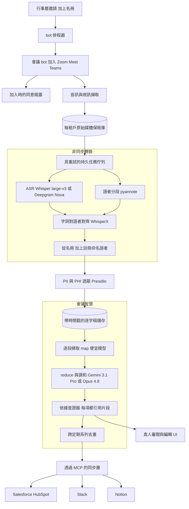
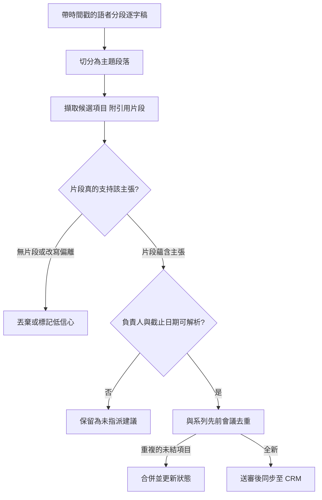

# 案例研究：非同步會議智慧平台

一款屬於 Granola、Fireflies、Otter 與 Gong 這一類的產品：一個 bot 加入 Zoom、Google Meet 與 Teams 通話，把它們錄音並轉錄，接著產出一份摘要、做成的決策，以及帶有負責人與截止日期的行動項目，並把它們同步到 Salesforce、Slack 與 Notion。在每天約 200,000 場會議的規模下，最主要的成本是對數小時音訊做 ASR，但真正決定這款產品能否被信任的限制條件卻是另一回事：**一則被同步進 CRM 的幻覺行動項目（「John 會在週五前把合約寄出」，但 John 根本沒這麼說）就是信任殺手**，所以每一個被擷取出來的項目都必須引用一段真實的逐字稿片段。與即時語音代理不同，這是一條非同步的批次管線，因此主導一切的是吞吐量與忠實度，而非延遲。

## 商業問題

每一位知識工作者都坐在自己記不全的會議裡，而其中有一半根本不該參加。這個賣點很簡單：讓一個 bot 出席，然後拿回一份乾淨的逐字稿、真正做成的決策，以及一份帶有正確負責人與截止日期的行動項目清單，並串接進工作實際發生的那些工具裡。天真的設計只有兩行：把 Whisper 對準錄音，然後要一個 LLM「摘要並列出行動項目」。它會以四種昂貴的方式失敗。它完全不知道是*誰*說了什麼，所以無法指派負責人。它會興高采烈地捏造出沒有人承諾過的行動項目，因為流暢的摘要與忠實的擷取是兩種不同的任務。它忽略了錄下一通通話在法律上是受規範的。而且它撐不過每天 200,000 場會議的實戰考驗。

把這件事做對的團隊，會把一般語音代理的直覺整個反過來。即時語音代理（見 [Multilingual Real-Time Voice Contact Center](30-multilingual-voice-contact-center.md) 與 [Real-Time Voice Agents](../18-voice-and-audio-agents/01-realtime-voice-agents.md)）受制於延遲：低於 800ms 的輪替、barge-in、speech-to-speech 捷徑、對音訊只有一次處理機會，因為沒有第二次。這款產品恰恰相反。沒有任何東西是即時的。在智慧處理開始執行之前，會議早已結束。這讓架構得以成為一條**持久的批次管線**：一個帶重試的任務佇列，有本錢去跑最大的 ASR 模型、做語者分段再重做一次、先摘要再查證摘要，還能讓一個任務失敗後重跑而完全不被真人察覺。整個設計拿延遲（反正已經不重要）去換吞吐量與忠實度（這兩者才是一切）。

因此這套架構是圍繞三個想法打造的。第一，**把轉錄與智慧處理分開**：在任何人要 LLM 對逐字稿進行推理之前，先取得一份帶時間戳、標註了說話者的逐字稿。第二，**讓每一項結構化輸出都以一段逐字稿片段為依據**，如此一來，一個行動項目、一項決策或一項風險，永遠都能回指到是誰在什麼時候說的，而任何無法取得依據的東西寧可丟棄也不出貨。第三，**把同意與保留當成管線的環節，而非事後才想到的補救**，因為原料是別人被錄下來的對話。

來自 2026 年 6 月現實的限制條件：

- 所有客戶合計每天約 200,000 場會議，平均約 35 分鐘，因此每月約有 3.5M 小時的音訊；ASR 是最主要的成本項，而 LLM 只佔支出的一小部分。
- 非同步，而非即時：沒有低於 800ms 的預算，所以這條管線可以跑 `large-v3` 等級的 ASR、以重疊處理做語者分段，並在失敗時重新摘要；SLO 是「在會議結束後幾分鐘內產出逐字稿與摘要」，而不是以毫秒計。
- 在真實會議音訊上做語者分段才是難處：交談串音與重疊語音、通話中途有人加入與離開，以及名冊上沒有登錄的未知撥入者，全都會推高語者分段錯誤率（DER）。
- 一則被同步進 CRM 的幻覺行動項目，比完全沒有摘要還糟，所以每一個行動項目都必須引用一段逐字稿片段（說話者加上時間戳），並對應到一位真實的與會者。
- 雙方同意制的司法管轄區要求有口頭且可見的「本次會議正在錄音」揭露；逐字稿帶有 PII 與 PHI，保留期限與資料落地是逐客戶而定，而客戶音訊不得用於訓練模型。
- 一份 60 分鐘的逐字稿只有約 12,000 到 16,000 個 token，任何現代的上下文視窗（Gemini 3.1 Pro、Claude Opus 4.8）都塞得下，所以真正困難的問題是對逐字稿的忠實度，而不是把它塞進上下文。
- 同步是透過 MCP 2.0 連接器接到 Salesforce、HubSpot、Slack 與 Notion，而行動項目必須跨定期會議去重，這樣每週的站立會議才不會把同一個未結任務建立 12 次。

## 架構

### 元件

| 層級 | 技術 | 用途 |
|-------|------|---------|
| bot 機群 | 自架會議 bot（Recall.ai 式基礎設施） | 加入 Zoom、Meet、Teams；擷取音訊與視訊；發布同意揭露 |
| 排程器 | 行事曆 webhook 加上名冊擷取 | 得知該加入哪些會議、有誰受邀 |
| 媒體保險庫 | 具落地釘選的每租戶物件儲存 | 依保留與資料落地政策存放原始錄音 |
| 任務佇列 | 持久佇列（Temporal 或 SQS 加上 worker） | 具重試、idempotency、背壓的批次管線 |
| ASR | 自架 Whisper `large-v3`，或 Deepgram Nova / AssemblyAI Universal | 轉錄數小時的音訊；依級別與語言分層 |
| 語者分段 | pyannote.audio（可感知重疊） | 依說話者輪次切分音訊，含重疊 |
| 對齊 | WhisperX 字詞級時間戳 | 把每個字詞綁定到一位說話者與一個時間位移 |
| 語者命名 | 名冊比對加上選用的語音註冊 | 把語者分段的叢集對應到真實與會者姓名 |
| 遮蔽 | Microsoft Presidio 加上自訂辨識器 | 在儲存與同步之前剝除 PII 與 PHI |
| Map 擷取器 | Claude Haiku 4.5 或 DeepSeek V4 Flash | 逐段產生帶片段的候選決策與行動項目 |
| Reduce 與查證 | Gemini 3.1 Pro 或 Claude Opus 4.8 | 調和、去重，並為最終結構化輸出建立依據 |
| 同步 | MCP 2.0 連接器 | 把結構化項目推送到 Salesforce、HubSpot、Slack、Notion |

### 資料流

1. 一個行事曆 webhook 觸發；排程器檢查租戶政策，並派遣一個 bot 前往會議，該 bot 在加入時發布錄音揭露，並開始把音訊與視訊擷取進每租戶媒體保險庫。
2. 會議結束時，錄音會被排入一個持久任務；佇列掌管重試、idempotency key 與背壓，這樣下午 5 點爆量的會議也不會漏掉工作。
3. ASR 以一個 `large-v3` 等級的模型轉錄完整音訊，而 pyannote 把同一段音訊做語者分段、切成說話者輪次，包含重疊語音的區段；兩者並行執行。
4. WhisperX 把字詞對齊到說話者輪次與毫秒級時間位移，產出一份每個字詞都帶有說話者標籤與時間戳的逐字稿。
5. 語者分段的叢集會用行事曆名冊解析成真實姓名，並在有註冊的情況下用聲紋；比對不到的說話者會被標為「未知說話者 2」，絕不用猜的。
6. 一道遮蔽流程（Presidio 加上領域辨識器）會在逐字稿被持久化或離開租戶邊界之前，依租戶政策遮蔽 PII 與 PHI。
7. 智慧處理階段執行 map 然後 reduce：一個便宜的模型逐主題段落擷取候選的決策、行動項目與風險，每一項都標上支持它的逐字稿片段，接著一個長上下文模型把它們調和成單一份結構化輸出。
8. 依據查證器會檢查每一個行動項目、決策與風險，是否都引用了一段其文字確實支持該主張的真實片段；無支持的項目會被丟棄或標為低信心，而負責人與截止日期會對照名冊來解析。
9. 存活下來的項目會對照同一個定期系列中先前的會議去重，然後透過 MCP 同步到客戶的 CRM、Slack 與 Notion，並依租戶偏好在同步前或同步後提供一個真人審閱與編輯 UI。

## 關鍵設計決策

### 1. 非同步批次管線，而非即時語音堆疊

這是形塑其餘一切的決策。即時語音代理會把整份工程預算都花在延遲上：串流 STT、學習式 endpointing、barge-in、speech-to-speech 模型，以及對音訊那唯一一次不可逆的處理。在這裡，會議早就結束了。這個反轉是一份大禮。我們可以跑最大的 ASR 模型而不是串流版本、以完整檔案的上下文對整份錄音做語者分段（串流語者分段嚴格來說更難也更不準）、先摘要再跑第二個模型來查證摘要，而且當一個任務失敗時，就只要重試即可。這條管線是一個帶有 idempotency key 與背壓的 [durable job queue](../07-agentic-systems/11-durable-execution.md)，而不是一個低延遲的媒體迴圈。唯一的延遲 SLO 是「在會議結束後幾分鐘內交付」，那是以分鐘計的餘裕，而非毫秒。接下來的一切，都把那份餘裕花在準確度上。

### 2. ASR 的選擇，以及數小時音訊上的準確度對成本取捨

ASR 是最主要的成本項，所以這個選擇是一個真正的預算決策，而不是預設值。三個認真的選項是自架 Whisper `large-v3`（[Radford et al.](https://arxiv.org/abs/2212.04356)、[openai/whisper](https://github.com/openai/whisper)）、Deepgram Nova，以及 AssemblyAI Universal。因為工作負載是批次的，在自有或 spot GPU 上批次處理的自架 `large-v3`，在規模化時每分鐘成本最低（實際約每分鐘十分之一美分），而且把音訊保留在租戶邊界內，這對不訓練與落地這兩項限制很重要。代管 API（Deepgram、AssemblyAI）每分鐘較貴，但內建了語者分段、字詞時間戳與語言涵蓋，對於一個新產品，或是自架調校過的模型並不划算的長尾語言而言，是正確的選擇。我們分層：主要的英語與主要語言流量用自架 `large-v3`，長尾與指定特定廠商的客戶則用代管 API。WER 會逐語言、逐音訊條件追蹤，因為一個平均 8 percent 字錯誤率的模型，在有雜訊的會議室麥克風上可能落在 20 percent，而姓名與數字上的 WER 會直接傳播成錯誤的負責人與錯誤的截止日期。

### 3. 語者分段才是關鍵功能，也是難處

「把這通會議摘要一下」是大宗商品；「誰承諾了什麼」才是產品，而那需要知道每個字是誰說的。真實會議上的語者分段是真的難：兩個人互相搶話、第四個人在 20 分鐘時才加入，而一位撥入的參與者在名冊上沒有登錄。我們跑 pyannote.audio（[Bredin et al.](https://arxiv.org/abs/1911.01255)、[pyannote-audio](https://github.com/pyannote/pyannote-audio)）並採用可感知重疊的模式（powerset 的表述法會處理同時說話的人，而非強迫每一影格只有一個標籤，[Plaquet and Bredin](https://arxiv.org/abs/2310.13025)），然後以 WhisperX（[Bain et al.](https://arxiv.org/abs/2303.00747)）把字詞綁定到說話者輪次與時間戳。語者分段的叢集會用行事曆名冊對應到姓名，而對於重複出現的參與者，一個選用的聲紋註冊能收緊歸屬。維繫信任不破的規則：未解析的叢集會被標為「未知說話者」，絕不猜成一個真實姓名，因為行動項目上出現錯誤姓名是一種具體而令人難忘的失敗。DER，尤其是重疊語音上的 DER，是第一等的評測指標。

### 4. 會議 bot 基礎設施：買來啟動，自建以擴展

一個能可靠加入 Zoom、Meet 與 Teams、撐過等候室，並擷取乾淨的逐參與者音訊的 bot，是數量驚人的無差異化基礎設施。Recall.ai 與類似的廠商正是把這個當成 API 來賣，也是啟動時的正確選擇：它們把三個平台的怪癖抽象掉，並在數週內就能上線。但它們的定價約為每 bot 小時一美元，而在每月 3.5M bot 小時的規模下，那是一條讓其餘技術堆疊相形見絀的數百萬美元成本項。所以這個平台一開始用 bot 廠商，並在流量足以證成投入工程之後，把流量最高的平台（Zoom、Meet）遷移到自架 bot，同時保留廠商來服務長尾與韌性。這是一條經典的自建對外購曲線，其交叉點是由 bot 小時決定，而不是由功能攀比決定。

### 5. 長上下文摘要成有依據的結構化輸出

輸出不是一個段落，它是結構化的：決策、行動項目（負責人、截止日期、來源片段），以及風險。一份 60 分鐘的逐字稿在現代上下文視窗裡輕鬆就塞得下，所以誘惑是對整份東西下一個單一提示。我們大多抵抗這股誘惑。忠實度會在長輸入上劣化（迷失在中間效應），而單次處理不會給你逐項的來源出處。所以預設是 map 然後 reduce（[LangChain summarization patterns](https://python.langchain.com/docs/tutorials/summarization/)）：把逐字稿依主題或議程項目分段，用一個便宜的模型逐段擷取候選的結構化項目連同其支持片段，然後在一個長上下文模型（Gemini 3.1 Pro 或 [Claude Opus 4.8](https://www.anthropic.com/claude/opus)）上調和，由它解決矛盾（「我們決定了 X」然後「其實，先擱著 X」）並合併重複項。對於一場簡短、單一主題的會議，一次有依據的處理更簡單也夠用；階層式摘要則在數小時的工作坊，以及跨會議彙總（把一整季的定期同步濃縮成單一狀態）上展現其價值。這裡的提示與上下文建構是 [context engineering](../05-prompting-and-context/05-context-engineering.md)，而不是散文寫作。

### 6. 每個行動項目都要引用一段逐字稿片段，否則就不出貨

這是這款產品可信度的核心。流暢的摘要器會產生幻覺，捏造出聽起來合理、卻從未做出的承諾，而抽象式摘要眾所周知會偏離來源（[Maynez et al.](https://arxiv.org/abs/2005.00661)）。防線是先擷取再查證：擷取時必須為每一個行動項目、決策與風險，發出支持它的那一段確切逐字稿片段（說話者加上時間戳）。接著一個獨立的依據查證器會檢查被引用的片段是否真的蘊含該主張、負責人是否是一位接受或被指派了該任務的真實與會者，以及任何截止日期是否真的被說出口。未通過依據查證的項目會被丟棄或降級為低信心建議，絕不悄悄出貨。在 UI 裡，每一個項目都能點擊直達逐字稿中的那個時刻，所以真人可以一鍵稽核。這就是把 [guardrails](../13-reliability-and-safety/01-guardrails.md) 與源自 [RAG evaluation](../06-retrieval-systems/13-rag-evaluation-patterns.md) 的有依據生成紀律，套用到會議輸出上：為主張建立依據、查證它，並寧可誠實地留下缺口，也不要自信地捏造。

### 7. 同意、保留、遮蔽、落地與不訓練

原料是別人被錄下來的對話，所以法遵是一個管線環節，而不是一個打勾方塊。加入時，bot 會發布一則可聽見且可見的「本次會議正在錄音」揭露，因為許多司法管轄區要求全體同意或雙方同意（[Reporters Committee recording guide](https://www.rcfp.org/reporters-recording-guide/)）；在嚴格地區的租戶可以要求明確選擇加入，或完全封鎖錄音。逐字稿帶有 PII 與 PHI，所以一道遮蔽流程（Microsoft [Presidio](https://github.com/microsoft/presidio) 加上領域辨識器）會在儲存或同步之前遮蔽敏感片段。保留期限與資料落地是逐客戶而定：一位醫療客戶的音訊可能是 30 天後刪除並釘選在單一地區，而另一位則保留一年。客戶音訊絕不用於訓練模型，這靠自架 ASR 以及與任何代管供應商簽訂零保留協議來強制執行。這一切都置於正式的 [AI governance and compliance](../13-reliability-and-safety/04-ai-governance-and-compliance.md) 之下，因為「我們錄下並儲存了一段你未同意的對話」是一起法規與名譽事件，而不是一個 bug。

### 8. 透過 MCP 的 CRM 與工具同步，並跨定期會議去重

如果行動項目死在一封摘要電子郵件裡，那它們就毫無價值，所以這個平台會把結構化項目推送進工作實際發生的那些工具，透過 MCP 2.0 連接器（[spec 2026-03-26](https://modelcontextprotocol.io/specification/2026-03-26/)）接到 Salesforce、HubSpot、Slack 與 Notion。有兩件事讓這並不簡單。第一，對應：一個「帶有負責人與截止日期的行動項目」必須變成一個帶有正確關聯的 Salesforce Task 或 HubSpot Engagement，而一項決策要變成正確商機上的一則備註，全都在受眾綁定的 token 之下，這樣一個連接器就無法寫到它的授權範圍之外。第二，跨定期系列的去重：一場連續三週都說「Priya 會把簡報定稿」的每週站立會議，絕不能建立三個未結任務。我們以會議系列 ID 加上對項目的語意比對作為去重的鍵，並把狀態往前帶（未結、進行中、完成）而不是重新建立，這樣定期會議就更新同一個任務，而不是生出一堆。參見 [Tool Use and MCP](../07-agentic-systems/03-tool-use-and-mcp.md)。

### 9. 何時純逐字稿工具會勝過完整的智慧處理管線

要誠實面對這套架構在哪裡是殺雞用牛刀。對於一位只想要自己筆記的單人使用者而言，Granola 風格的模型（一份輕量的本機逐字稿加上三點式摘要，沒有 bot、沒有 CRM 同步）往往更好：它更便宜、它避開了「一個 bot 加入了我們的通話」那種同意上的摩擦，而且它沒有把一個錯誤的行動項目同步進共享記錄系統的途徑。完整的決策加負責人加 CRM 管線，唯有在會議屬於交易性且多方（銷售通話、專案站立會議、客戶導入）且輸出會餵進一個共享工作流時，才值回它的複雜度。對於一場腦力激盪、一場一對一或一場隨意的同步而言，完整管線的失效模式（一個自信卻錯誤、還指派給一位真實同事的行動項目）可能比乾脆沒有它還糟。這款產品的強力版本，知道哪些會議值得完整處理，而哪些只需要一份乾淨的逐字稿。

## 依據與查證迴圈

## 失效模式與緩解措施

### F1：語者分段把字詞指派給錯誤的說話者

兩個人互相搶話，而行動項目「我會負責這次遷移」被歸屬到錯誤的與會者，於是指派錯了人。緩解：可感知重疊的語者分段（pyannote powerset）、逐輪次帶上歸屬信心、用「未知說話者」標籤而非猜出來的姓名，以及在審閱中呈現一份真人可編輯的說話者對應表。

### F2：幻覺行動項目

模型發出「John 會在週五前把合約寄出」，但 John 根本沒這麼說，而它同步進了 CRM。緩解：擷取必須引用一段支持的逐字稿片段、由一個依據查證器確認片段蘊含該主張且負責人是一位真實與會者、無支持的項目會被丟棄，而行動項目精確率是一個把關上線的評測指標。

### F3：姓名、數字或日期上的 ASR 錯誤

逐字稿把「星期二 14 號」聽成「4 號」，或把一個姓氏弄糊了，於是截止日期或負責人就錯了。緩解：對照行事曆名冊而非原始 ASR token 來解析負責人、以信心檢查正規化日期、對領域詞彙做關鍵字加權，並且一律把項目連結到那個音訊時刻，好讓真人能抓到它。

### F4：bot 加入失敗或被移除

bot 卡在等候室裡、被主持人拒絕，或會議超過排定結束時間 40 分鐘而 bot 提早離開了。緩解：帶有重試與重新准入邏輯的加入健康檢查、退回到主持人上傳的雲端錄影、對部分錄音的優雅處理，以及當加入成功率下降時的告警（通常是平台 API 變動）。

### F5：未取得有效同意的錄音

bot 在雙方同意制的司法管轄區裡沒有做必要的揭露就錄音，或是一位參與者提出反對卻被忽略。緩解：加入時自動化的可聽見且可見揭露、可要求選擇加入或封鎖錄音的逐地區政策、一個會停止擷取的會議中選擇退出，以及與錄音一併不可變地記錄的同意狀態。

### F6：PII 或 PHI 外洩到儲存、同步或訓練中

一份含有病患識別碼或卡號的逐字稿在未經遮蔽的情況下被儲存、被同步到 CRM，或更糟，被用來訓練模型。緩解：在持久化之前與任何外流之前的一道 Presidio 遮蔽階段、逐租戶的保留與落地強制執行、自架 ASR 加上零保留供應商協議讓音訊絕不進入訓練集，若遭破壞則視為 sev-1。

### F7：重複的行動項目灌爆 CRM

一場每週定期的會議每週都重新建立同一個未結任務，把真正的訊號埋沒在重複項裡。緩解：以會議系列 ID 加上對項目文字的語意比對作為鍵的去重、狀態往前帶（更新既有任務而非建立新的），以及一份逐系列的未結項目帳本。

### F8：無聲的部分管線失效

ASR 在一個損壞的區段上逾時，逐字稿被截斷，然後一份自信的摘要從半場會議中被生成出來。緩解：比對已轉錄時長與會議長度的完整性檢查、每份逐字稿的品質分數（估計 WER、語者分段信心）、遇到劣化輸入就明確報錯而非靜默，以及在沒有審閱標記的情況下不同步低信心輸出。

## 維運考量

### 監控

| SLO | 目標 |
|-----|--------|
| 摘要與行動項目在會議結束後送達（p95） | 低於 5 分鐘 |
| 管線任務完成（含重試） | 超過 99.5 percent |
| bot 加入成功率 | 超過 98 percent |
| 多說話者評測集上的語者分段錯誤率（DER） | 低於 12 percent |
| 商務英語評測集上的字錯誤率（WER） | 低於 8 percent |
| 行動項目精確率（出貨項目確實有承諾） | 超過 95 percent |
| 行動項目召回率（真實承諾被捕捉到） | 超過 85 percent |
| 無依據行動項目觸及同步 | 低於每 10,000 項 1 項 |
| 錄音會議上的同意揭露送達 | 100 percent |

### 成本模型

在每天約 200,000 場會議（每月約 6M 場）、平均約 35 分鐘（每月約 210M 分鐘、約 3.5M 小時）的情況下：

- ASR（最主要的成本項）：在 GPU 上批次處理的自架 Whisper `large-v3`，每分鐘約 $0.001 到 $0.002，每月約 $250k 到 $450k；代管 API 會是這個的 2 到 4 倍。
- 語者分段（GPU 上的 pyannote）：每分鐘約 $0.0005 到 $0.001，每月約 $120k 到 $200k。
- 會議 bot 媒體擷取：另一條大成本項；一家廠商以每 bot 小時約 $1 計，每月會是數百萬美元，這正是為什麼高流量平台會轉向自架 bot。
- LLM 智慧處理（便宜的 map 加上長上下文的 reduce 與查證）：每場會議約 $0.005 到 $0.02，每月約 $30k 到 $120k，只佔總支出的一小部分。
- 儲存、保留與落地外流：可觀且反覆發生，以原始音訊為主，所以依租戶政策分層並自動過期。
- 全部算進去，這落在每場會議遠低於一美元，主要由 ASR 與 bot 小時主導，而不是 token；見 [cost optimization playbook](../04-inference-optimization/07-cost-optimization-playbook.md) 與 [batching strategies](../04-inference-optimization/04-batching-strategies.md)。

### 待命處置手冊

- bot 加入失敗激增：檢查 Zoom、Meet 或 Teams 的 API 或驗證是否變動、把受影響的流量故障轉移到 bot 廠商，並退回到主持人雲端錄影的擷取。
- 模型或基礎設施變動後的 ASR 品質回歸：把 ASR 模型釘在上一個良好版本、重跑 WER 黃金集，並從保險庫中的原始音訊重新處理受影響的會議。
- 有幻覺行動項目被回報：視為一起信任事件、從稽核日誌拉出逐字稿與那個（缺失的）被引用片段、收緊依據查證器，並把這個案例加進行動項目評測集。
- 同意或遮蔽失敗：隔離受影響的錄音、停止該租戶的同步、通知法遵負責人，並視為 sev-1。
- 佇列積壓成長（下午 5 點的暴增）：擴充 ASR 與語者分段的 worker、把爆量分流到代管 ASR API，並以背壓保護完成 SLO，而不是丟棄任務。
- 重複任務的客訴：檢查系列去重鍵與語意比對器，並調和受影響定期系列的未結項目帳本。

## 強力面試候選人會涵蓋哪些內容

- 他們會把這件事框定為一條非同步批次管線，並與即時語音形成鮮明對比：沒有延遲預算，所以把省下來的算力花在更大的 ASR 模型、可感知重疊的語者分段，以及一道查證流程上，並以重試取代那唯一一次不可逆的即時處理。
- 他們知道對數小時音訊做 ASR 才是最主要的成本，而不是 LLM，而且他們會在成本、落地與語言涵蓋的基礎上，把自架 `large-v3` 與代管的 Deepgram 或 AssemblyAI 分層取捨。
- 他們把語者分段當成真正的產品面，處理重疊、加入與離開，以及未知的說話者，拒絕猜測姓名，並讓 DER 與 WER 並列為第一等的指標。
- 他們把轉錄與智慧處理分開，並使用 map 然後 reduce，讓摘要忠實且每一項都有來源出處，同時指出一份 60 分鐘的逐字稿塞得進單一上下文視窗，而困難之處在於忠實度，而非長度。
- 他們讓依據落實成為不可妥協之事：每一個行動項目都引用一段逐字稿片段、無依據的項目會被丟棄，而一則被同步進 CRM 的捏造承諾，就是那個會殺死產品的失敗。
- 他們把同意、遮蔽、保留、落地與不訓練當成正式治理下的管線環節，而不是事後補救。
- 他們設計 CRM 同步時會做適當的物件對應與跨定期會議去重，而且他們會指出何時純逐字稿工具會勝過完整管線。

## 參考資料

- Radford et al., [Robust Speech Recognition via Large-Scale Weak Supervision (Whisper)](https://arxiv.org/abs/2212.04356) and [openai/whisper](https://github.com/openai/whisper)
- Bain et al., [WhisperX: Time-Accurate Speech Transcription of Long-Form Audio](https://arxiv.org/abs/2303.00747) and [m-bain/whisperX](https://github.com/m-bain/whisperX)
- Bredin et al., [pyannote.audio: neural building blocks for speaker diarization](https://arxiv.org/abs/1911.01255) and [pyannote/pyannote-audio](https://github.com/pyannote/pyannote-audio)
- Plaquet and Bredin, [Powerset multi-class cross-entropy loss for neural speaker diarization](https://arxiv.org/abs/2310.13025)
- Bredin, [pyannote.metrics and the definition of diarization error rate](https://github.com/pyannote/pyannote-metrics)
- [Deepgram Nova speech-to-text documentation](https://developers.deepgram.com/docs) and [AssemblyAI documentation](https://www.assemblyai.com/docs)
- [jiwer: word error rate computation](https://github.com/jitsi/jiwer)
- Maynez et al., [On Faithfulness and Factuality in Abstractive Summarization](https://arxiv.org/abs/2005.00661)
- Zhong et al., [QMSum: query-based meeting summarization benchmark](https://arxiv.org/abs/2104.05938) and Hu et al., [MeetingBank](https://arxiv.org/abs/2305.17529)
- [AMI Meeting Corpus](https://groups.inf.ed.ac.uk/ami/corpus/)
- LangChain, [summarization (map-reduce and refine) patterns](https://python.langchain.com/docs/tutorials/summarization/)
- Google, [Gemini long-context guide](https://ai.google.dev/gemini-api/docs/long-context) and Anthropic, [Claude Opus 4.8](https://www.anthropic.com/claude/opus)
- [Recall.ai meeting-bot API](https://www.recall.ai/) and [Microsoft Presidio PII redaction](https://github.com/microsoft/presidio)
- [Reporters Committee: recording guide and two-party-consent map](https://www.rcfp.org/reporters-recording-guide/)
- [Model Context Protocol specification 2026-03-26](https://modelcontextprotocol.io/specification/2026-03-26/)

相關章節：[Real-Time Voice Agents](../18-voice-and-audio-agents/01-realtime-voice-agents.md)、[Case Study: Multilingual Real-Time Voice Contact Center](30-multilingual-voice-contact-center.md)、[AI Governance and Compliance](../13-reliability-and-safety/04-ai-governance-and-compliance.md)、[Context Engineering](../05-prompting-and-context/05-context-engineering.md)、[Tool Use and MCP](../07-agentic-systems/03-tool-use-and-mcp.md)。
