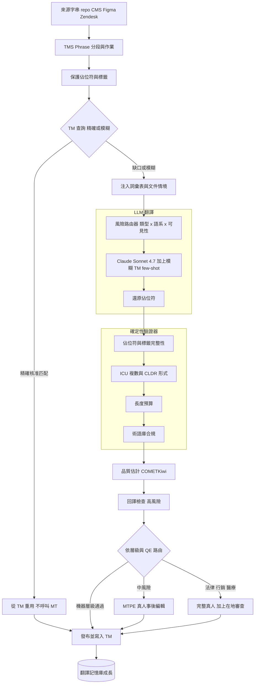
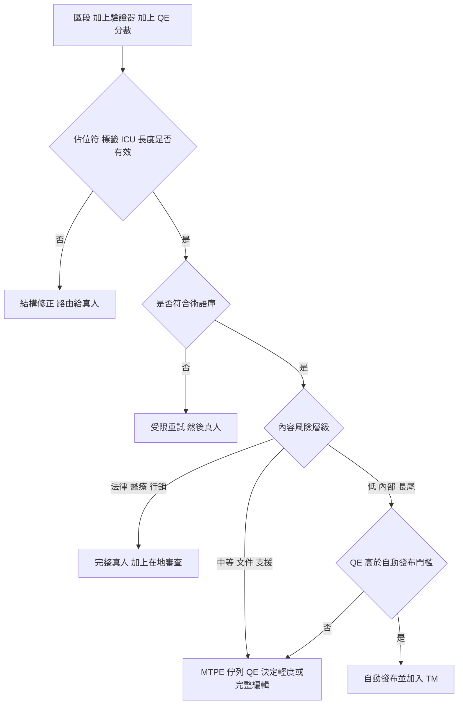

# 案例研究：企業翻譯與在地化管線

一家全球軟體公司每月以數百萬字的規模，把它的產品 UI、說明中心、文件與行銷內容在地化成 40 多種語言。它用一條 LLM 管線取代了傳統 TMS 加上真人翻譯工作流程的大部分，但在高能見度的表層仍保留真人。最艱難的單一限制條件：在沒有任何真人閱讀每一個字串的情況下維持大規模的品質與一致性，而且絕不把法律、醫療或品牌關鍵術語翻錯。

## 商業問題

舊的管線是一套翻譯管理系統（TMS），例如 [Phrase](https://phrase.com/) 或 [Smartling](https://www.smartling.com/)，透過 CAT 編輯器驅動自由接案者與語言服務供應商（LSP）的真人譯者，並以一個由已核准過往區段組成的翻譯記憶庫（TM）以及一個已核准術語的術語庫作為後盾。真人翻譯每字大約 $0.10 到 $0.25，且需時數天，所以在持續發布節奏下無法擴展到橫跨 40 個語系的數百萬字。團隊早已用類神經 MT（DeepL、Google Cloud Translation）做預翻譯並由真人事後編輯，但通用 NMT 忽略詞彙表與周圍情境，所以事後編輯的負擔依然沉重。

天真的 LLM 替代方案是把每個字串都丟進「把這個翻譯成法文」。它會以五種具體方式失敗。它忽略 TM 並重新翻譯已核准的字串，破壞一致性又為已完成的工作重複付費。它不強制術語庫，所以一個藥名或「Account」這個字在不同字串間會譯得不一樣。它會悄悄損壞 `%1$s`、ICU 複數與 `<a>` 標籤，進而弄壞建置或讓 UI 崩潰。沒有人能讀完數百萬個字串，所以糟糕的翻譯會在無人檢視下出貨。而機密的未發布字串會外洩到公開 API。

所以團隊把 TM 與術語庫當作事實基準，只讓 LLM 填補缺口，並在提示中附上最接近的模糊 TM 匹配、相關的詞彙表術語，以及文件層級的情境。確定性驗證器把關機械式的正確性（佔位符、標籤、複數形式、長度），因為那不是可以託付給模型的事。一個無參考的品質估計（QE）模型為每一個區段評分，只把有風險的區段路由給真人，而一個內容風險層級決定純機器、事後編輯，還是完整真人。這是 [text-to-SQL 分析](39-conversational-analytics-text-to-sql.md)中語意層的在地化對應版本：一個精心策劃的事實來源約束模型，而不是寄望模型自己做對。

來自 2026 年 6 月現實的限制條件：

- 規模是每月橫跨 40 多個語系的數百萬字，處於每週發布節奏，所以沒有真人能讀完每一個字串，機器涵蓋是強制性的。
- 真人翻譯每字成本大約 $0.10 到 $0.25，且週轉需時數天，這無法配合這樣的量或速度。
- TM 利用率是最大的成本槓桿：精確匹配是免費重用，而業界定價把 100% 匹配歸零、對模糊區間打折，所以一個全部重譯的設計是純粹的浪費。
- 術語沒有商量餘地：一個藥名、一個法律術語，或「Account」，必須在各處都呈現得一模一樣，而在禁譯清單上的品牌名稱絕不能被翻譯。
- 字串是程式碼，不是散文：像 `%1$s` 這樣的 `printf` 引數、[ICU MessageFormat](https://unicode-org.github.io/icu/userguide/format_parse/messages/) 複數 `{count, plural, one {# file} other {# files}}`，以及行內 HTML 都必須完好無損地存活下來。
- 複數與性別規則因語系而異：[CLDR](https://cldr.unicode.org/) 定義了多達六種複數形式（阿拉伯語），而德語與芬蘭語會讓文字膨脹 30% 以上並溢出固定寬度的 UI。
- 機密性：未發布的 UI 字串會洩漏產品藍圖，不能觸及公開的 MT API，而有些市場強制要求資料落地。
- QE 並不完美，而且恰恰在風險最高之處最弱（低資源語言、否定、具名實體），所以純機器永遠無法涵蓋法律或醫療內容。

## 架構

### 元件

| 層級 | 技術 | 用途 |
|-------|------|---------|
| 來源連接器 | Git i18n 檔案（JSON、PO、XLIFF、`strings.xml`）、CMS、Figma、Zendesk | 連同情境擷取來源字串 |
| TMS 編排 | Phrase（或 Smartling、Lokalise） | 分段、作業、TM 與術語庫、工作流程狀態 |
| 翻譯記憶庫 | TM 儲存（精確與模糊）、供語意模糊匹配的嵌入索引 | 免費重用已核准的過往翻譯 |
| 術語庫 | 詞彙表 加上禁譯清單 | 強制一致、品牌與法律關鍵的術語 |
| 風險路由器 | 依內容類型、語系、可見性的分類器 | 指派層級與翻譯路徑 |
| LLM MT | Claude Sonnet 4.7 為主、Gemini 3.1 Pro 為替代、Haiku 4.5 或 Gemma 4 用於大量處理 | 情境感知翻譯、術語遵循 |
| NMT 後備 | DeepL、Google Cloud Translation | 便宜的比較與部分語言對的後備 |
| 驗證器 | 佔位符、標籤、ICU、CLDR、長度檢查（程式碼） | 結構正確性的硬性關卡 |
| 品質估計 | COMETKiwi、自架、無參考 | 供路由用的逐區段風險分數 |
| 回譯 | 透過第二個模型來回 | 捕捉否定、數字與實體錯誤 |
| 事後編輯 | TMS 中的 CAT 編輯器 | 真人修正被標記的區段，編輯回饋至 TM |
| 在地審查 | 語系審查者、各市場風格指南 | 文化與法律適切性 |
| 評測與可觀測性 | 對抽樣參考跑 COMET、MQM LQA、儀表板 | 校準 QE、追蹤合規與逸出 |

### 資料流

1. 一個連接器以 [XLIFF](https://docs.oasis-open.org/xliff/xliff-core/v2.1/xliff-core-v2.1.html) 格式，從 repo、CMS 或設計工具拉取變更過的來源字串；TMS 把它們分段，並對照既有的記憶庫計算 TM 利用率。
2. 每個區段的佔位符與行內標籤都會被抽取成受保護的 token；系統對 TM 查詢精確與模糊匹配、拉取相關的詞彙表術語，並收集相鄰區段加上鍵值或截圖中繼資料作為文件情境。
3. 一個高於門檻、已核准的精確 TM 匹配會被重用，完全不呼叫 MT；其餘一切都繼續進入模型路徑。
4. 風險路由器依內容類型乘以語系乘以可見性指派一個內容層級，據此選擇路徑（純機器、MT 加上 QE、MTPE，或完整真人）。
5. LLM 以一個提示進行翻譯，內容包含來源、文件情境、詞彙表術語、作為情境內範例的最接近模糊 TM 匹配，加上目標語系、正式度與風格指南；受保護的佔位符會被還原回輸出中。
6. 確定性驗證器以硬性關卡的形式執行：佔位符與標籤完整性、ICU 與 CLDR 複數形式完整性、長度預算、數字與日期格式，以及術語庫合規。
7. QE 模型為區段的風險評分，而回譯交叉檢查會在高風險或含數字的區段上執行，以捕捉否定翻轉與遺漏的實體。
8. 路由關卡會發布通過每一項檢查且達到該層級 QE 門檻的區段，並把它們寫入 TM；其餘的則帶著預先填好的草稿進入 MTPE 或完整真人佇列。
9. 真人的編輯被核准後進入 TM（讓可重用的資產成長），並記錄為 QE 校準與評測資料，而已核准的目標譯文會被推回資源檔案與 CMS。

## 關鍵設計決策

### 1. TM 加上術語庫作為事實基準，LLM 只填補缺口

TM 與術語庫才是語意層，而不是模型。精確的 TM 匹配會被逐字重用（免費，而且完全一致），模糊匹配會作為情境內範例餵給 LLM，而詞彙表會被注入每一個相關的提示。把最接近的模糊匹配餵給模型，相較於冷翻譯，能可衡量地改善術語與風格的遵循度（[Moslem et al., Adaptive MT with LLMs, arXiv:2301.13294](https://arxiv.org/abs/2301.13294)）。關鍵在於，我們不信任提示去強制術語：一個確定性的事後檢查會把每一個術語實例對照術語庫及其禁譯清單，任何違規都會阻擋發布。提示層級的「請使用這份詞彙表」是一個提示，而合規檢查才是保證。

### 2. 選擇 LLM MT 而非純 NMT，為了情境、語氣與術語

經典 NMT（DeepL、Google）每字又快又便宜，但它逐區段翻譯，沒有文件情境、沒有品牌聲音，詞彙表控制也很弱，所以它把事後編輯負擔最大化。LLM MT 是相反的取捨：它讀整份文件、尊重正式度與風格，並遵循被注入的詞彙表，而這正是驅動面向顧客內容品質的關鍵。我們用 Claude Sonnet 4.7 作為主力、Gemini 3.1 Pro 作為它得分較高的語言對的替代，以及 Haiku 4.5 或自架的 Gemma 4 用於低風險的大量內容。DeepL 仍接在系統中作為便宜的後備，以及評測中的比較基準線。LLM 每 token 的成本比 NMT 高，但真正重要的槓桿是省下的事後編輯工時，而更好的原始 MT 會直接削減它們。

### 3. 由品質估計來調度真人，因為你無法審查每一件事

核心的規模化手段是無參考的 QE。你無法為數百萬個字串產生真人參考譯文，所以一個 QE 模型（COMETKiwi，自架）僅憑來源與假設譯文為每一筆翻譯的風險評分，只把低信心的區段路由給人（[Rei et al., CometKiwi, arXiv:2209.06243](https://arxiv.org/abs/2209.06243)）。像 [COMET](https://arxiv.org/abs/2009.09025) 這樣基於參考的指標會用在我們確實有參考譯文的評測裡，但生產環境的路由用的是 QE。自動發布門檻不是模型的預設值，它是對照 MTPE 產能，更重要的是對照機器路徑上實測的重大錯誤逸出率來校準：把它調高，更多工作維持純機器，但更多錯誤會溜過去；把它調低，真人佇列就會變大。那個門檻是逐層級且逐語系的。

### 4. 機械式正確性是確定性程式碼，絕不託付給模型

這正是天真的 LLM 翻譯出錯的地方。一個丟掉 `%1$s`、重排位置引數、為需要六種複數形式的語言只發出五種，或把 `<a href>` 弄爛的模型，會產出一個讓 App 崩潰或破壞版面的字串，而 QE 無法可靠地抓到它。所以佔位符與標籤完整性、ICU MessageFormat 可解析性、CLDR 複數形式完整性，以及長度預算，都在程式碼中被驗證為硬性關卡，區段必須通過它們才有資格進行任何後續處理（[ICU MessageFormat](https://unicode-org.github.io/icu/userguide/format_parse/messages/)、[CLDR plural rules](https://www.unicode.org/cldr/charts/latest/supplemental/language_plural_rules.html)）。這與[護欄](../13-reliability-and-safety/01-guardrails.md)是同一套紀律：在模型之外強制執行的結構性約束。受限解碼與保護再還原能減少違規，但真正讓它安全的是那道檢查。

### 5. 內容風險分層驅動整條管線

經濟效益與安全性兩者都源自分層。低風險內容（內部文件、支援 KB 的長尾、低流量語系）在通過 QE 後走純機器。中風險內容（產品文件、說明中心、主要語系 UI）一律經過真人事後編輯，由 QE 排序佇列並決定輕度或完整編輯。高風險內容（法律、行銷、醫療）是完整真人翻譯加上審查，無論 QE 如何都不自動發布。這個切分刻意做成不對稱，就像保險業的直通式關卡：一個錯誤的內部文件字串成本很低，一個錯誤的用藥指示或一句搞砸的品牌標語則不然，所以機器路徑被限制在尾端成本有界的內容上。

### 6. 人機協作是高價值內容的設計核心

對大多數面向顧客的表層而言，路由給真人是預期的結果，而非失敗，所以它被打造得很快（[Human-in-the-Loop Patterns](../07-agentic-systems/08-human-in-the-loop-patterns.md)）。事後編輯者打開被標記的區段時，MT 草稿、模糊 TM 匹配、詞彙表以及 QE 的理由都已預先填好，所以他們是確認或修正，而不是從零翻譯。每一筆核准的編輯都會回流到 TM，所以資產會成長，下一次出現時就是一個免費的精確匹配，而 MT 草稿與最終定稿之間的編輯距離會記錄為基準真值以校準 QE。行銷內容採用創譯（創意改寫，而非翻譯），由真人從頭到尾負責。

### 7. 成本工程：免費的 TM、批次 API、模型分層、已快取的情境

在地化是一個批次問題，而非即時問題，所以它就以批次的方式來最佳化（[Cost Optimization Playbook](../04-inference-optimization/07-cost-optimization-playbook.md)）。TM 精確匹配從不觸及模型，是單一最大的節省。新的與模糊的區段會以折扣層級跑批次 API，並依風險分層到最便宜而足夠的模型。詞彙表、風格指南與各語系指示都很龐大，且在整個作業中重複出現，所以它們被放在情境快取之後、在整個批次間重用，而不是逐區段重新送出，而 TM 本身對翻譯而言就表現得像一個[語意快取](../08-memory-and-state/05-semantic-caching.md)。結果是，模型花費相較於真人事後編輯這條開銷只是個零頭，這正是為什麼 QE 路由（讓真人遠離機器路徑）才是真正的成本槓桿。

### 8. 治理：機密字串、資料落地與文化審查

未發布的產品字串涉及產品藍圖敏感資訊，不能送往公開端點，所以禁發內容會被路由到零留存的企業端點，或路由到公司自有租戶環境中的自架模型（Gemma 4、Llama 4），而資料落地規範會把某些語系釘在區域內處理（[AI Governance and Compliance](../13-reliability-and-safety/04-ai-governance-and-compliance.md)）。在資料處理之外，面向市場的內容會接受在地審查以確認文化與法律契合度：慣用語、意象、範例、貨幣，以及那些作為翻譯正確、對市場卻錯誤的法律聲明。沒有任何行銷或法律字串會在未經該審查的情況下自動發布。

### 9. 何時完整真人翻譯沒有商量餘地

有些內容無論 QE 分數如何都絕不走純機器。法律合約與條款具有約束力，往往需要認證或宣誓翻譯。醫療的使用說明與劑量涉及病患安全且受監管（一個誤譯就是一次召回，甚至更糟），所以它們基於政策一律交給合格的醫療譯者並做回譯審查。高風險的行銷與品牌標語需要創譯，在這裡一個字面正確卻錯誤的譯法是一種著名的失效模式。而低資源語言正是 LLM 品質急遽下降之處，更糟的是，也正是 QE 本身最不可靠之處，所以你想用來路由的信心訊號，恰恰在你最需要它的地方不可信。對於以上所有情況，誠實的答案是：這條管線是輔助真人，而不是取代他們。

## 區段路由流程

## 失效模式與緩解措施

### F1：佔位符或標籤損壞

模型丟掉一個 `%1$s`、重排位置引數，或弄壞一個 `<a href>`，於是建置失敗或 UI 在執行期崩潰。緩解：在模型呼叫前後對佔位符做保護再還原、一個確定性的完整性檢查來計數並比對來源與目標之間的每一個佔位符與標籤，以及在任何不符時的硬性阻擋加上真人路由（絕不自動發布）。

### F2：術語漂移或被翻譯的品牌名稱

同一個術語在不同字串間譯得不一樣，或一個必須維持英文的品牌名稱被翻譯了。緩解：把詞彙表注入提示、一個對照已核准術語與禁譯清單的確定性術語庫合規檢查、失敗時的受限重試，以及若重試仍不合規時的真人路由。

### F3：QE 漏掉一個自信地翻錯的翻譯

QE 給一個區段打了高分，而該翻譯卻翻轉了一個否定或替換了一個具名實體，於是它就自動發布了。緩解：一道逐層級的底線，讓法律與醫療無論 QE 如何都絕不自動發布、一個在高風險與含數字區段上的回譯交叉檢查、確定性的數字與實體檢查，以及對機器路徑持續進行、以逸出率衡量的真人 LQA 抽樣。

### F4：錯誤或缺失的複數與性別形式

一個語系需要六種 CLDR 複數形式卻只得到三種，或文法性別不一致。緩解：對每個目標語系做 ICU 解析加上 CLDR 複數完整性驗證作為硬性關卡、在格式支援時進行性別感知的處理，以及對複數複雜的語系（阿拉伯語、波蘭語、俄語）固定開啟母語者審查。

### F5：長度溢出與 RTL 破版

德語或芬蘭語膨脹超出一個固定寬度的控制項，或一個由右至左的語系把雙向文字算繪錯誤。緩解：一個以檢查形式強制執行的逐字串長度預算（最大字元數或膨脹比例）、在 CI 中做偽在地化以在翻譯前就讓溢出浮現、給模型一個維持在預算內的指示，以及對無法安全縮短的字串採用真人路由。

### F6：把未發布字串外洩到公開 API

禁發的預發布 UI 被送到一個第三方 MT 端點，產品藍圖就此洩漏。緩解：禁發內容只路由到零留存的企業端點或公司租戶環境中的自架模型、對預發布命名空間停用第三方 NMT，而資料落地路由會把受監管的語系釘在區域內。

### F7：來自不良過往翻譯的 TM 汙染

一個已經在 TM 裡的錯誤翻譯會透過重用擴散，更糟的是，會作為一個模糊的情境內範例，教會模型同樣的錯誤。緩解：只有經過審查、已核准的區段才能進入 TM、以 QE 評分定期做 TM QA 掃描來隔離低品質的條目，以及 TM 版本控管，讓一次不良的匯入可以被回滾。

### F8：通過 MT 與 QE 的文化或法律不適切性

一個區段是正確的翻譯，但對市場而言是錯的（一句慣用語、一個圖像指涉、一句在該司法管轄區違法的聲明）。緩解：對面向市場的內容強制在地審查、把文化與法律規則編入各語系的風格指南，以及對行銷或法律內容不設自動發布路徑。

## 維運考量

### 監控

| SLO | 目標 |
|-----|--------|
| 佔位符與標籤完整性（機器路徑） | 100 percent（硬性關卡） |
| 術語庫合規率 | 超過 99.5 percent |
| 自動發布區段的重大錯誤逸出率（LQA 抽樣） | 低於 0.5 percent |
| QE 對真人 MQM 相關性（每月抽樣、區段層級） | 超過 0.5 |
| TM 利用率（重用字數佔比） | 超過 35 percent |
| MTPE 週轉時間 p95 | 低於 24 小時 |
| 每 1000 字混合成本 | 持續追蹤，對比全真人基準線下降 |

### 成本模型

在每月橫跨 40 多個語系約 500 萬字的情況下（這些數字是此規模下的概略量級，真人費率為業界區間）：

- 約 40 percent 的 TM 利用率免費重用了約 200 萬字，不呼叫 MT，這是單一最大的節省。
- 純機器層級（約占 300 萬個新字的 55 percent）透過批次 API 以 Haiku 4.5 與 Sonnet 4.7 的混合搭配加上 QE 運算來執行：每月低至數千美元，實際上是個零頭。
- MTPE 層級（約占新字的 35 percent）主要由每字大約 $0.04 到 $0.06 的真人事後編輯主導：每月約 $50,000 量級。
- 完整真人層級（約占新字的 10 percent）每字大約 $0.15 到 $0.22：每月約 $50,000 到 $60,000 量級。
- QE、驗證器與回譯的運算：不高，每月低至數千。
- 總計落在每月約 $110,000 到 $120,000，由真人這幾條開銷主導。對同樣的 300 萬個新字全用真人、以每字約 $0.15 計算大約會是 $450,000，所以這條管線是 3x 到 4x 的縮減，而槓桿在於 QE 路由讓真人遠離機器路徑。

### 待命處置手冊

- 模型或提示變更後佔位符錯誤暴增：凍結自動發布、回滾提示或模型版本，並讓受影響的批次重新跑過驗證器。
- 術語庫合規率下降：檢查術語庫是否已同步到提示建構器、重新注入，並針對出問題的術語掃描受影響的區段。
- QE 校準漂移（LQA 抽樣中的逸出率上升）：調低自動發布門檻、擴大 LQA 抽樣，並對照近期的事後編輯重新校準或重新訓練 QE 模型。
- 疑似機密外洩：終止受影響命名空間的第三方 MT 路由、把禁發內容切換到自架，並拉出請求記錄以供稽核。
- 語系投訴（在地審查者標記出一個系統性錯誤）：把該語系釘在 MTPE 或完整真人、修正風格指南與詞彙表，並重新翻譯受影響的語料。

## 強力面試候選人會涵蓋哪些內容

- 他們會把 TM 與術語庫當成作為事實基準的語意層，讓 LLM 填補缺口，並以一個確定性的合規檢查（而非提示中的暗示）來強制術語。
- 他們會讓無參考的 QE（COMETKiwi）成為路由的大腦、把自動發布門檻校準到 MTPE 產能與實測逸出率，並且知道 BLEU 很弱、而 COMET 對真人的追蹤要好得多。
- 他們會把 LLM MT 真正的優勢（文件情境、語氣、術語）與機械式正確性分開，後者是確定性程式碼，也是天真的 LLM 翻譯出錯之處。
- 他們會把內容風險分層（純機器、MTPE、完整真人）設計成一道不對稱的關卡，讓法律、醫療與行銷絕不自動發布。
- 他們會把佔位符、ICU 複數、CLDR 複數形式與長度溢出當成硬性驗證器來處理，並且知道德語膨脹與 RTL 是真實的破版。
- 他們會點名治理面向：未發布字串的禁發、零留存或自架端點、資料落地，以及強制的在地文化與法律審查。
- 他們會辨識出成本槓桿（免費的 TM 命中、批次 API、模型分層、已快取的詞彙表情境），並看出真人事後編輯這條開銷才是成本所在，所以 QE 路由才是 ROI 的槓桿。
- 他們會誠實面對：低資源語言以及法律、醫療與高風險品牌內容仍舊由真人處理，而 QE 恰恰在風險最高之處最不可靠。

## 參考資料

- Rei et al., [COMET: A Neural Framework for MT Evaluation (arXiv:2009.09025)](https://arxiv.org/abs/2009.09025)
- Rei et al., [CometKiwi: IST-Unbabel 2022 Submission for the QE Shared Task (arXiv:2209.06243)](https://arxiv.org/abs/2209.06243)
- Moslem et al., [Adaptive Machine Translation with Large Language Models (arXiv:2301.13294)](https://arxiv.org/abs/2301.13294)
- Papineni et al., [BLEU: a Method for Automatic Evaluation of Machine Translation (ACL 2002)](https://aclanthology.org/P02-1040/)
- [Conference on Machine Translation (WMT) shared tasks](https://www2.statmt.org/wmt24/)
- [Multidimensional Quality Metrics (MQM)](https://themqm.org/)
- Unicode, [ICU MessageFormat](https://unicode-org.github.io/icu/userguide/format_parse/messages/) and [CLDR Language Plural Rules](https://www.unicode.org/cldr/charts/latest/supplemental/language_plural_rules.html)
- OASIS, [XLIFF 2.1 specification](https://docs.oasis-open.org/xliff/xliff-core/v2.1/xliff-core-v2.1.html)
- [Phrase TMS](https://phrase.com/), [Smartling](https://www.smartling.com/), [Lokalise](https://lokalise.com/)
- [DeepL API documentation](https://developers.deepl.com/docs)
- Anthropic, [Claude models overview](https://docs.anthropic.com/en/docs/about-claude/models/overview)
- Google, [Gemini API translation and multilingual](https://ai.google.dev/gemini-api/docs)

相關章節：[Human-in-the-Loop Patterns](../07-agentic-systems/08-human-in-the-loop-patterns.md)、[Cost Optimization Playbook](../04-inference-optimization/07-cost-optimization-playbook.md)、[AI Governance and Compliance](../13-reliability-and-safety/04-ai-governance-and-compliance.md)、[LLM Evaluation](../14-evaluation-and-observability/01-llm-evaluation.md)、[Multilingual Real-Time Voice Contact Center](30-multilingual-voice-contact-center.md)。
