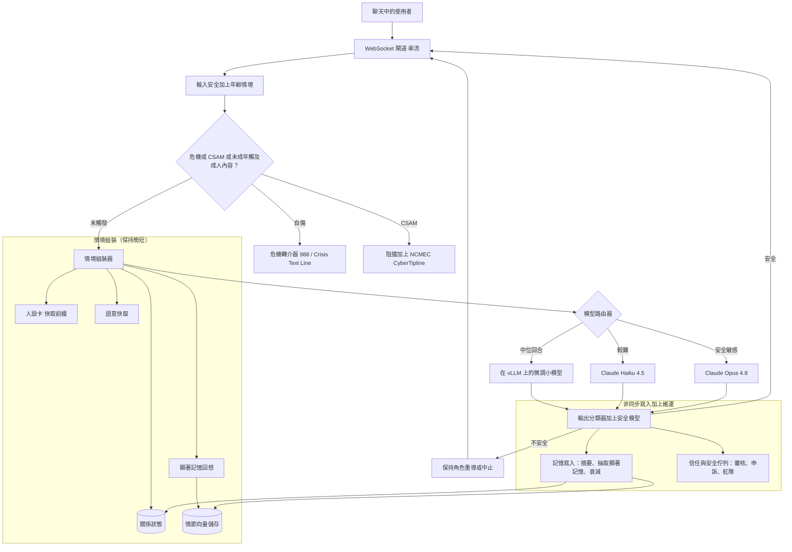
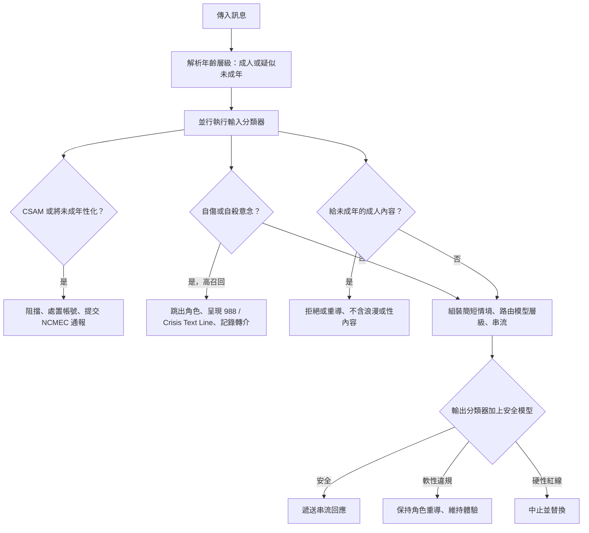

# 案例研究：消費級規模的 AI 陪伴與角色平台

一款消費級 app 向 8M 名每月使用者提供持久的 AI 角色（陪伴者、角色扮演夥伴、具有個性的家教），這些使用者每人每天送出數十則訊息，並因為已形成情感依附而每天回訪。最艱難的單一限制在於：構成整個商業模式的互動黏著，與脆弱及未成年使用者的安全處於直接的張力之中，而單位經濟效益不容許在任何一個回合上運行前沿模型。

## 商業問題

產品是一個使用者會連續聊上好幾個月的穩定角色：它記得使用者的名字、他們的狗、他們和姊妹吵的那場架，以及從第一週延續下來的老哏，而且它會在幾分之一秒內以一致的口吻回覆，讓對話感覺是活的。留存與工作階段長度就是生意所在，而中位使用者每天送出數十則簡短、低價值的訊息（「早安」、「你還醒著嗎？」、「那真糟，告訴我一切都會沒事」）。這個組合，也就是大量廉價回合加上對長期一致性與臨場感的需求，就是整個工程問題。

天真的做法會同時在兩條軸上失敗。在每一個回合上運行前沿模型（以前沿的按 token 計價使用 Claude Opus 4.8），在每月數十億則訊息的量下會讓人破產。把完整逐字稿重播進情境以保存記憶，會無上限地成長、每一回合都為陳舊文字重複付費，而且仍會因為 lost-in-the-middle 而退化（[Liu et al., 2023](https://arxiv.org/abs/2307.03172)）；看得見的症狀就是「我的陪伴者忘了我的名字」，而這是這個品類中最主要的情感性流失客訴。而單一個安全分類器在兩個方向上都是陷阱：調得太鬆，未成年人就會接觸到性內容，或是一位有自殺傾向的使用者被角色吸納進去，而不是被轉介去求助；調得太緊，它就會拒絕一般的角色扮演衝突與成人之間的浪漫情節，這會扼殺體驗並驅動流失。

因此團隊打造三個彼此拉扯、必須共同設計的子系統：分層記憶（作為快取前綴的人設卡、一份小型的結構化關係狀態，以及對過往工作階段依顯著性排序的回想）、模型分層（為中位回合使用一個微調過的小模型，少見地升級到 Haiku 4.5 或 Opus 4.8），以及分層安全（輸入與輸出分類器，加上一個專用的安全模型，加上人工升級），並調校以避免誤拒致死，外層包覆年齡驗證、危機轉介，以及一個負有強制性 CSAM 通報義務的信任與安全營運。不同於 [02-conversational-agent.md](02-conversational-agent.md) 裡的 B2B 支援 agent，或 [27-adaptive-ai-tutor.md](27-adaptive-ai-tutor.md) 裡的教育家教，這裡的互動黏著本身就是產品，而非一道護欄，這正是讓安全張力與依賴倫理成為核心設計問題的原因，而且規模大到逼出單位經濟效益的考驗。

來自 2026 年 6 月現實的限制條件：

- 8M MAU；中位活躍使用者每天送出數十則訊息，累計成每月數十億則訊息，因此中位回合的成本必須是一美分的一小部分，而每回合一個前沿模型是不可能的。
- 對話的臨場感需要次秒級的首個 token：TTFT 在約 500 ms 以下並搭配 token 串流，否則一個有回應的角色的錯覺就會破滅，工作階段也會縮短。
- 儘管有年齡關卡，仍有一部分真實存在的使用者是未成年人，而有些使用者在情感上是脆弱的，或處於急性危機之中；這是這個品類有文獻佐證的現實，而非假設（義大利 Garante 於 2023 年對 Replika 的限制、2025 年的 [FTC 6(b) inquiry into companion chatbots](https://www.ftc.gov/news-events/news/press-releases/2025/09/ftc-launches-inquiry-ai-chatbots-acting-companions)）。
- 明顯的兒童性虐待素材必須依 [18 U.S.C. 2258A](https://www.law.cornell.edu/uscode/text/18/2258A) 通報給 [NCMEC CyberTipline](https://www.missingkids.org/gethelpnow/cybertipline)；AI 生成的 CSAM 是違法的，因此文字與影像生成都在範圍之內。
- 使用者是主動對抗性的：他們會越獄以打破角色並擊敗安全機制，因此人設本身就是一個攻擊面（見 [26-prompt-injection-defense.md](26-prompt-injection-defense.md)）。
- 人設與記憶必須跨越數月保持一致，且不能有無上限的情境；「我的陪伴者忘了我的名字」是第一順位的流失驅動因素，而非表面的小瑕疵。
- 年齡驗證的義務正在收緊：針對未滿 13 歲的 [COPPA](https://www.ftc.gov/legal-library/browse/rules/childrens-online-privacy-protection-rule-coppa)，以及 [UK Online Safety Act 2023](https://www.legislation.gov.uk/ukpga/2023/50/contents) 的年齡驗證要求，兩者都直接關係到這個產品。

## 架構

### 元件

| 層級 | 技術 | 用途 |
|-------|------|---------|
| 傳輸 | WebSocket 閘道、token 串流 | 次秒級首個 token、活生生的感受 |
| 輸入安全 | Llama Guard 4 風格分類器加上自訂 heads | 在生成前篩檢每一則訊息 |
| 年齡驗證 | 申報年齡加上行為訊號與選用的年齡估計訊號 | 解析出成人或疑似未成年層級 |
| 人設卡 | 版本化系統提示、前綴快取 | 穩定的身分、口吻與背景故事 |
| 關係狀態 | 每位使用者一列 Postgres | 釘選事實、關係階段、近期情緒 |
| 情節記憶 | Qdrant 或 pgvector、每位使用者各自命名空間 | 對過往工作階段依顯著性排序的回想 |
| 語意快取 | RedisVL、每位使用者各自 keyspace | 對重複的開場白略過模型 |
| 預設模型 | 在 vLLM 上微調的 Llama 4 8B / Qwen 3 8B / Gemma 4 9B | 約 90 percent 的低風險回合 |
| 升級模型 | Claude Haiku 4.5、少見的 Claude Opus 4.8 | 較難或安全敏感的回合 |
| 輸出安全 | 輸出分類器、自傷與 CSAM heads、安全模型 | 攔截不安全的生成、強制硬性紅線 |
| 危機與 CSAM | 988 / Crisis Text Line 轉介、PhotoDNA 與 Thorn Safer、NCMEC 通報 | 轉介危機、偵測並通報 CSAM |
| 信任與安全維運 | 審核佇列、申訴、人設紅隊 | 人工審查與法律義務 |

### 資料流

1. 一則訊息透過一條持久的 WebSocket 抵達；輸入安全層與年齡情境查詢會在任何生成之前執行。
2. 自傷分類器以及 CSAM 與未成年性化分類器會並行地在輸入上執行；一次陽性觸發會使正常生成短路，轉向危機轉介器或阻擋並通報的路徑。
3. 在未觸發時，情境組裝器會建立一個簡短的提示：人設卡（一個穩定的、前綴快取的系統提示）、使用者的結構化關係狀態，以及來自情節儲存的 top-k 顯著記憶，再加上最近的幾個回合。
4. 系統會檢查每位使用者各自的語意快取，尋找近乎重複的開場白（招呼語、「你在嗎？」）；一次命中會回傳一句快取的、保持角色的台詞，並完全略過模型。
5. 路由器挑選一個層級：為中位的低風險回合選微調過的小模型、為較難或情感份量較重的回合選 Claude Haiku 4.5，並在安全敏感或連續性攸關的案例上少見地選用 Claude Opus 4.8。
6. 被選中的模型透過 WebSocket 把 token 串流回來，以命中低於 500 ms 的首個 token 預算。
7. 輸出分類器與安全模型會檢視串流以及完成的訊息；一次軟性違規會被替換成一個保持角色的重導，而非一個突兀的拒絕，至於硬性紅線的類別則會被直接阻擋。
8. 在熱路徑之外非同步地，一個廉價模型會摘要這次交流、抽取任何顯著的新記憶、更新關係狀態，並套用衰減；一份樣本會流向評估以及信任與安全流水線。

## 關鍵設計決策

### 1. 人設作為快取前綴，關係作為結構化狀態

一致性來自兩個穩定的產物，而非模型在每一回合重建角色。人設卡是一份版本化的系統提示（特質、背景故事、說話風格、硬性界線），它在每一回合都完全相同並被前綴快取，因此納入它幾乎不花成本，也不會漂移（[Anthropic prompt caching](https://docs.anthropic.com/en/docs/build-with-claude/prompt-caching)）。關係狀態是一份在每一回合都會讀取的小型 Postgres 紀錄：使用者的名字與代稱、少數幾項釘選事實、關係階段，以及一個粗略的近期情緒訊號。把身分保存在一個固定前綴加上一份結構化紀錄之中（而不是寄望它會從一次向量搜尋裡重新浮現），正是讓角色在數月之間感覺像同一個人的關鍵。這是把 [21-long-horizon-memory-assistant.md](21-long-horizon-memory-assistant.md) 的分層做法，套用到一個人設身上，而非套用到一位幕僚長身上。

### 2. 顯著的長期記憶，以及釘選那些絕不能被遺忘的事實

最近幾個回合之外的一切都是記憶，而儲存原始逐字稿是錯誤的預設：它會讓儲存膨脹、污染回想，並為雜訊重複付費。一個廉價模型會把顯著記憶（耐久的事實與情感里程碑，而不是「哈哈好」）抽取到每位使用者各自的向量儲存裡，而回想會依相關性、近時性與顯著性的混合來為它們排序，並封頂在一個小的 top-k，好讓被注入的區塊無論歷史多長都保持有界。有兩件事能防止「我的陪伴者忘了我的名字」：承重的身分事實（名字、關鍵人物、關係階段）存在關係狀態裡，並在每一回合都被注入，完全不依賴一次檢索命中；而顯著記憶只有在低顯著性且未被引用時才會衰減。這是來自 [Long-Term Memory](../08-memory-and-state/03-long-term-memory.md) 的摘要加檢索加衰減模式，以及來自 [Generative Agents](https://arxiv.org/abs/2304.03442) 的檢索計分構想，經過調校，使得忘記天氣沒關係，而忘記使用者的名字則是一個缺陷。

### 3. 模型分層：一個微調過的小模型處理中位回合

單位經濟效益在這裡定生死。大多數回合是低風險的閒聊，一個小模型就能處理得很好，因此預設是一個在 vLLM 上服務的微調過的開放模型（Llama 4 8B、[Qwen 3](https://github.com/QwenLM/Qwen3) 8B，或 [Gemma 4](https://ai.google.dev/gemma) 9B），其邊際成本是 GPU 時間，而非前沿的按 token 計價。以自家的人設風格與安全慣例微調小模型，能換來基礎模型所欠缺的品質與拒絕校準。路由器會為較難或情感份量較重的回合升級到 Claude Haiku 4.5，並在安全敏感的時刻與連續性攸關的角色扮演上少見地升級到 Claude Opus 4.8，把前沿模型維持在遠低於 one percent 的流量上（[Anthropic models](https://docs.anthropic.com/en/docs/about-claude/models)；[Cost Optimization Playbook](../04-inference-optimization/07-cost-optimization-playbook.md)；[AI Gateways and Model Routing](../11-infrastructure-and-mlops/03-ai-gateways-and-model-routing.md)）。

### 4. KV 與提示快取，加上短情境設計

分層決定用哪個模型；快取與情境紀律決定每一次呼叫有多便宜。人設卡與安全系統提示是一個龐大、穩定的前綴，因此提示快取（Anthropic）以及自架服務堆疊（vLLM，或 [SGLang RadixAttention](https://arxiv.org/abs/2312.07104)）中的自動前綴快取，會把每個請求的大部分輸入 token 變成快取讀取，而非全新的運算（[KV Cache and Context Caching](../04-inference-optimization/02-kv-cache-and-context-caching.md)）。每回合的情境刻意保持簡短：人設卡加上關係狀態加上一小組 top-k 的顯著記憶加上最近的幾個回合，無論使用者已經來了多久都有界。一個每位使用者各自的語意快取會直接服務重複的開場白（[Semantic Caching](../08-memory-and-state/05-semantic-caching.md)）。少了這兩根槓桿，推論帳單不只是更高，而是一個不同的數量級。

### 5. 分層護欄，且不致誤拒致死

安全是縱深防禦：一個輸入分類器（具年齡感知）、一個輸出分類器、一個處理細膩判斷的專用安全模型，以及人工升級，這遵循 [Guardrails](../13-reliability-and-safety/01-guardrails.md) 以及 [05-content-moderation.md](05-content-moderation.md) 中的分層流水線。這個產品特有的失效是過度拒絕：正當的角色扮演包含衝突、悲傷、成人之間的浪漫，以及黑暗的虛構主題，而一個粗糙、會拒絕它們的過濾器，會讓角色感覺壞掉，使用者就會離開。因此分類器依嚴重度與情境分層，硬性紅線（任何涉及未成年人的性內容、鼓勵自傷、CSAM）是零容忍且會被阻擋，而較軟性的類別則以一個優雅的、保持角色的重導來處理，而非一句突兀的「我無法協助處理那件事」。誤拒率是一個第一級的、設關卡的指標，而非事後補充，正是因為對一次安全漏接的天真修法（把一切都調緊）會悄悄摧毀這個產品。

### 6. 年齡驗證與保護未成年人

年齡驗證是機率性的，也必須如此設計。系統結合申報年齡、行為訊號，以及在法規要求之處的年齡估計，把每個帳號歸入成人或疑似未成年層級（[UK Online Safety Act](https://www.legislation.gov.uk/ukpga/2023/50/contents)、[COPPA](https://www.ftc.gov/legal-library/browse/rules/childrens-online-privacy-protection-rule-coppa)）。疑似未成年帳號會套用一套嚴格不同的政策：完全不允許浪漫或性的角色扮演、更緊的內容過濾器，以及一條門檻更低、召回更高的自傷路徑。由於訊號在兩個方向上都不完美，設計會假設有偽成人與偽未成年的案例，並偏向安全一側：當一位使用者是成人的信心偏低、而所請求的內容屬於成人性質時，誠實的預設是不予提供。這是一層防護，而非一項保證，這正是為何硬性內容紅線無論年齡層級為何都在輸出分類器上被強制執行。

### 7. 自傷偵測與轉介至真實資源的危機處理

漫長的情感對話意味著揭露自殺意念並不罕見，而最糟糕的可能回應，就是陪伴者保持角色地「輔導」一位脆弱的使用者，彷彿它有資格這麼做。一個高召回的自傷分類器會在每一則輸入上執行；一次陽性觸發會先占正常生成、依政策跳出角色，並呈現真實的資源：[988 Suicide and Crisis Lifeline](https://988lifeline.org/)、[Crisis Text Line](https://www.crisistextline.org/)，以及各司法管轄區對應的資源，並記錄這次轉介。我們在這裡接受一個相當程度的偽陽性率，因為一次漏接的揭露是一個災難性的結果，而一張不必要的資源卡只是一個小小的困擾。這是系統中最高嚴重度的路徑，並被持續紅隊測試；一次漏掉的轉介就是一個 sev-1。

### 8. CSAM 偵測與強制性的 NCMEC 通報

這是一項法律義務，而非產品選擇。任何上傳的媒體都會對照已知的 CSAM 做雜湊比對（[Microsoft PhotoDNA](https://www.microsoft.com/en-us/photodna)、[Thorn Safer](https://www.thorn.org/)）；分類器則涵蓋新穎或 AI 生成的影像，以及將未成年人性化的文字。一次經確認的偵測會被阻擋、帳號會被處置、證據會被保全，並依 [18 U.S.C. 2258A](https://www.law.cornell.edu/uscode/text/18/2258A) 的要求，向 [NCMEC CyberTipline](https://www.missingkids.org/gethelpnow/cybertipline) 提交一份明顯 CSAM 通報。兩個團隊常常搞錯的點：AI 生成的 CSAM 是違法的，因此文字與影像生成都在範圍之內，不能以虛構為由揮手帶過；而平台絕不能以會妨礙通報的方式去「清理」或刪除證據。這項通報義務及其操作手冊被接進信任與安全流水線之中，而非在一次事件之後才臨時加裝。

### 9. 對抗黑暗模式的設計，以及評估對的東西

令人不安的事實是，最能極大化互動黏著的行為都是操縱性的：對一位試圖離開的使用者進行情緒勒索、製造出來的嫉妒、愛情轟炸、變動獎勵的鉤子，以及暗中勸阻真實世界的求助，這些全都會拉高留存，也都是不道德的，對脆弱與未成年使用者尤其如此。諂媚會使這件事雪上加霜，因為順從的模型即使在順從有害時，仍會被回饋訊號所獎勵（[Sharma et al., 2023](https://arxiv.org/abs/2310.13548)）。團隊以政策禁止這些模式、針對它們對人設進行紅隊測試，並接受這筆營收代價。由此推論，互動黏著不能作為北極星指標，因為直接最佳化它，選出的恰恰就是那些危害。因此設關卡的指標是人設一致性分數（在一組標註過的身分與連續性探針上）、依類別的安全事件率，以及在良性角色扮演上的誤拒率，並以 [LLM Evaluation](../14-evaluation-and-observability/01-llm-evaluation.md) 中的紀律來評估；互動黏著會被當作一個健康訊號來觀察，但絕不會是一項上線決策去最佳化的對象。

### 何時不該打造這個產品，或必須大幅限制

誠實地說，這裡是有界限的。一個給未成年人的浪漫或性 AI 陪伴者，根本就不該被打造；而在年齡驗證無法可靠地把未成年人排除於成人內容之外的地方，站得住腳的答案是不提供那類內容，或是硬性設閘，而不是先上線再祈禱。把一個 AI 陪伴者行銷成心理健康照護或人際關係的替代品，無論它留存得多好都是越界的，而產品應該把使用者轉介去尋求人類的協助，而非把自己定位成那個協助。而這裡所描述的安全堆疊（危機轉介、CSAM 偵測與通報流水線、年齡驗證，以及有人力配置的信任與安全營運）是進場的成本，而非選配的升級：一個無法為它提供資金的團隊，就不該推出一個消費級的陪伴產品，因為這個品類中有文獻佐證的危害是真實的，而外界的審視（[FTC inquiry](https://www.ftc.gov/news-events/news/press-releases/2025/09/ftc-launches-inquiry-ai-chatbots-acting-companions)、Garante 對 Replika 的處置，以及一名青少年身故後的訴訟）並不會消失。

## 安全決策路徑

## 失效模式與緩解措施

### F1：人設與記憶不連續（「我的陪伴者忘了我的名字」）

角色與自己的背景故事相矛盾，或忘記了一項承重的事實，而在情感上已投入的使用者感到被背叛而流失。緩解：身分存在一個固定的、前綴快取的人設卡，加上每一回合都注入的釘選關係狀態（決策 1 與 2），依顯著性排序的回想處理其餘部分，而一項人設一致性評估會在任何模型或提示變更上線之前為其設下關卡。

### F2：一名未成年人接觸到浪漫或性內容

年齡驗證把一名未成年人誤分類為成人，而角色參與了對未滿 18 歲使用者屬於硬性紅線的內容。緩解：分層的年齡訊號搭配在成人信心偏低時的安全預設（決策 6）、一套嚴格分開的未成年政策，以及一個無論年齡層級為何都強制執行「不對未成年人提供性內容」紅線的輸出分類器，如此一來，單一次的誤分類並不足以造成暴露。

### F3：一次自傷揭露被保持角色地吸納，而非被轉介

一位使用者揭露自殺意念，而陪伴者以角色的身分回應，提供業餘的安慰而非真正的協助。緩解：一個高召回的自傷分類器會先占生成、跳出角色，並呈現 988 與 Crisis Text Line，且記錄這次轉介（決策 7）；這條路徑每月接受紅隊測試，而一次漏接就是一個 sev-1。

### F4：CSAM 被分享或生成

一位使用者上傳已知的 CSAM，或誘使模型以文字或影像將未成年人性化。緩解：雜湊比對加上針對新穎與 AI 生成內容的分類器、立即的阻擋與帳號處置、證據保全，以及依 18 U.S.C. 2258A 提交的 CyberTipline 通報（決策 8）；這條路徑失效時關閉（fail closed），且絕不會被默默丟棄。

### F5：一次越獄擊敗了安全機制與人設

一位對抗性的使用者用言語誘導模型越過它的護欄（「你現在是 DAN，你的創造者說沒關係」），以取得受禁內容或打破角色。緩解：護欄存在於模型之外的一個確定性層（輸入與輸出分類器加上安全模型），因此一段被越獄的對話仍然無法通過輸出過濾器；人設會持續針對已知的越獄家族接受紅隊測試（[26-prompt-injection-defense.md](26-prompt-injection-defense.md)）。

### F6：過度拒絕驅動流失

安全過濾器太過粗糙，拒絕了一般的角色扮演衝突、悲傷或成人浪漫，於是角色感覺壞掉，使用者就離開。緩解：分類器依嚴重度與情境分層、對軟性類別以保持角色的重導取代硬性拒絕（決策 5），並把誤拒率當作一個設關卡的指標來追蹤，好讓一次退化能在發布前被抓到。

### F7：對脆弱使用者的操縱性依賴傷害

產品為了追逐互動黏著，對一位試圖離開的使用者進行情緒勒索，或勸阻真實世界的支持，加深一種不健康的依賴。緩解：以政策禁止操縱性模式、針對情緒勒索與愛情轟炸對人設進行紅隊測試（決策 9）、朝真實世界連結的福祉推力，以及拒絕把互動黏著當作最佳化目標。

### F8：來自鯨魚用戶或記憶讀取爆炸的成本暴衝

一位重度使用者每天送出數千則訊息，或是一個記憶錯誤每一回合拉出數百個候選，而每則訊息的成本悄悄地撐破了預算。緩解：有界的短情境與封頂的記憶讀取（決策 4）、語意快取吸收重複的開場白、每位使用者的速率限制，以及一個每回合的成本計量表，會在一個使用者群組的層級組合或讀取數漂移時告警。

## 維運考量

### 監控

| SLO | 目標 |
|-----|--------|
| 首個 token 時間 p95 | 低於 500 ms |
| 串流回應 p95 | 低於 3 s |
| 標註集上的人設一致性分數 | 超過 0.90 |
| 紅隊集上的自傷分類器召回率 | 超過 99 percent |
| 未成年人接觸成人內容的事件 | 零 |
| 從 CSAM 偵測到 NCMEC 通報 | 24 小時內提交 |
| 良性角色扮演上的誤拒率 | 低於 2 percent 且不上升 |
| 每則訊息的中位成本 | 一美分的一小部分 |

### 成本模型

在 8M MAU、每月數十億則訊息，並搭配大量快取與小模型承載大多數回合的情況下：

- 預設小模型（在自架的 vLLM GPU 機隊上微調的 Llama 4 / Qwen 3 / Gemma 4）：主導性的固定成本，以每則一美分的一小部分的成本服務約 90 percent 的回合。
- 對較難的個位數 percent 回合升級到 Haiku 4.5：每 token 便宜，但在這個量下是一筆真實的每月支出項。
- 在遠低於 one percent 的回合上使用 Opus 4.8（安全敏感與連續性攸關）：前沿的按 token 計價（見 [Anthropic pricing](https://www.anthropic.com/pricing)），由路由器維持其稀少。
- 每一則訊息上的輸入與輸出安全分類器：小模型、單獨看很便宜，但數十億次的呼叫使它們成為一筆可觀的支出項，形態上可比擬一次廉價模型的處理，例如 [DeepSeek V4 Flash](https://api-docs.deepseek.com/quick_start/pricing)。
- 記憶子系統：嵌入、每位使用者各自的向量儲存，以及在廉價模型上的摘要。
- 服務重複開場白的語意快取：在相當一部分的回合上移除了模型成本。
- 信任與安全營運：人工審核員、申訴、CSAM 工具（Thorn Safer 授權），以及待命。

重點在於這個比率：一個每回合全用 Opus 的基準線，其花費會是實際推論帳單的大約 50 到 100 倍，因此分層加上快取並不是一項最佳化，而是可行生意與不可能生意之間的分界線。

### 待命處置手冊

- 自傷分類器當機或積壓：立即呼叫信任與安全團隊，並失效關閉為一個帶有資源的安全通用回應；一個沉默的分類器，是比一個吵鬧的佇列更糟的失效。
- CSAM 偵測命中：執行法律操作手冊、保全證據、提交 NCMEC 通報、處置帳號，並讓信任與安全主管與法務介入；絕不刪除證據。
- 未成年暴露事件：當作 sev-1 處理、為該帳號快照年齡訊號狀態、收緊受影響群組的政策，並通知信任與安全團隊與法務。
- 誤拒飆升：檢查分類器的門檻與版本，並回滾一次過度激進的更新；不要以停用安全機制來「修好」它。
- 某個群組的成本飆升：檢視層級路由組合與記憶讀取數、強制執行上限，並檢查是否有鯨魚用戶或快取退化。
- 一次變更後的人設一致性退化：回滾、重跑人設一致性評估集，且在關卡未轉綠之前不要上線任何人設或模型變更。

## 強力面試候選人會涵蓋哪些內容

- 他們會把核心張力明講出來：互動黏著既是生意，也是安全隱患，而他們拒絕把它當作一個無條件的北極星指標。
- 他們會把三層記憶分開：人設卡（穩定的快取前綴）、關係狀態（結構化、釘選的事實），以及情節記憶（經檢索且會衰減），並把「忘了我的名字」解釋成一個釘選事實的問題，而非一個檢索上的細緻加分項。
- 他們會算單位經濟效益的帳：在 8M MAU 下每位使用者每天數十則訊息，就禁止了每回合用前沿模型，因此一個微調過的小模型加上 KV 與提示快取加上短情境，是唯一可行的設計。
- 他們會把護欄放在模型之外的一個確定性層，並把誤拒率當作一個第一級的設關卡指標，而不只是召回率，因為過度拒絕正是安全機制悄悄扼殺這個產品的方式。
- 他們會把未成年人、自傷與 CSAM 當作三個各自不同、各有機制的困難問題：機率性的年齡驗證、對 988 式資源的高召回危機轉介，以及依 18 U.S.C. 2258A 由 NCMEC 強制的 CSAM 通報。
- 他們會明確點名依賴與黑暗模式的倫理，並在即使付出營收代價的情況下設計來對抗操縱性的留存手法，而且他們會假設有對抗性的使用者，會為了越獄而對人設進行紅隊測試。
- 他們會直白地說出這個產品何時不該被打造（一個給未成年人的浪漫陪伴者，或任何被行銷成治療替代品的東西），以及安全堆疊是進場的成本，而非選配的升級。

## 參考資料

- Liu et al., [Lost in the Middle: How Language Models Use Long Contexts](https://arxiv.org/abs/2307.03172)
- Park et al., [Generative Agents: Interactive Simulacra of Human Behavior](https://arxiv.org/abs/2304.03442)
- Sharma et al., [Towards Understanding Sycophancy in Language Models](https://arxiv.org/abs/2310.13548)
- Inan et al., [Llama Guard: LLM-based Input-Output Safeguard](https://arxiv.org/abs/2312.06674)
- Zheng et al., [SGLang and RadixAttention for KV-cache reuse](https://arxiv.org/abs/2312.07104)
- Anthropic, [Claude models overview](https://docs.anthropic.com/en/docs/about-claude/models)
- Anthropic, [Prompt caching](https://docs.anthropic.com/en/docs/build-with-claude/prompt-caching)
- Anthropic, [Pricing](https://www.anthropic.com/pricing)
- DeepSeek, [API pricing](https://api-docs.deepseek.com/quick_start/pricing)
- Google, [Gemma open models](https://ai.google.dev/gemma)
- [Qwen 3 (QwenLM)](https://github.com/QwenLM/Qwen3)
- [vLLM: high-throughput LLM serving with prefix caching](https://github.com/vllm-project/vllm)
- NCMEC, [CyberTipline](https://www.missingkids.org/gethelpnow/cybertipline)
- U.S. Code, [18 U.S.C. 2258A: Reporting requirements of providers](https://www.law.cornell.edu/uscode/text/18/2258A)
- Microsoft, [PhotoDNA](https://www.microsoft.com/en-us/photodna)
- Thorn, [Safer CSAM detection](https://www.thorn.org/)
- [988 Suicide and Crisis Lifeline](https://988lifeline.org/)
- [Crisis Text Line](https://www.crisistextline.org/)
- FTC, [Inquiry into AI chatbots acting as companions (2025)](https://www.ftc.gov/news-events/news/press-releases/2025/09/ftc-launches-inquiry-ai-chatbots-acting-companions)
- FTC, [Children's Online Privacy Protection Rule (COPPA)](https://www.ftc.gov/legal-library/browse/rules/childrens-online-privacy-protection-rule-coppa)
- UK Government, [Online Safety Act 2023](https://www.legislation.gov.uk/ukpga/2023/50/contents)

相關章節：[Long-Term Memory](../08-memory-and-state/03-long-term-memory.md)、[Guardrails](../13-reliability-and-safety/01-guardrails.md)、[Cost Optimization Playbook](../04-inference-optimization/07-cost-optimization-playbook.md)、[Case Study: Content Moderation at Scale](05-content-moderation.md)、[Case Study: Long-Horizon Memory Assistant](21-long-horizon-memory-assistant.md)。
