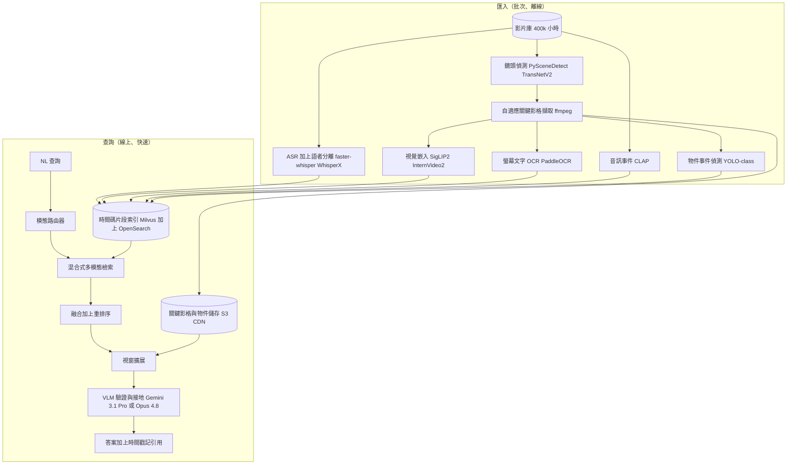
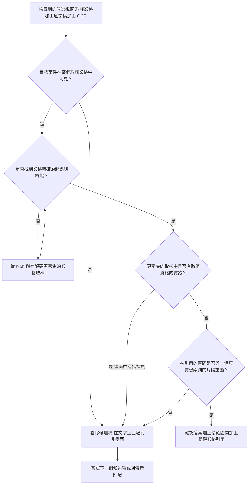
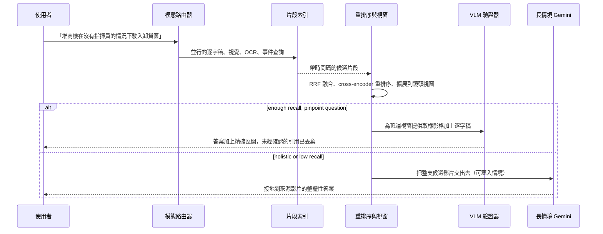

# 案例研究：長影片理解與搜尋平台

一家媒體與企業學習公司讓一個 400,000 小時的影片庫（講座、全員大會錄影、研討會演講、產品展示，再加上一家物流子公司的廠區與行車記錄器影像）能以自然語言搜尋，回傳精確的帶時間戳記時刻，外加一個有接地的答案。單一最困難的限制條件是影格經濟學：一支 30fps 的 1 小時影片有 108,000 個影格，因此你無法把整個影片庫餵給視覺模型，而整個設計的重點就在於把影片轉成一種廉價、可搜尋的表示法，同時保留足夠的保真度來回答有時間接地的問題。本案例談的是*理解*既有影片，恰是 [Brand-Safe Image and Video Generation](24-multimodal-generation-pipeline.md) 的鏡像對照，後者是*生成*影片。

## 商業問題

三個不同的族群想從迥異的影像中得到同一件事。一位公關主管輸入「找出 CEO 談到毛利的那一刻」，需要從一場 3 小時的財報電話會議中取出那段 40 秒的區間。一位學生問「哪些課程涵蓋反向傳播」，期待一份帶有可跳轉時間戳記的演講排序清單。一位安全主管查詢「顯示堆高機在沒有指揮員的情況下駛入卸貨區的片段」，需要跨越數千小時攝影機影像中每一個符合的事件。那個天真的設計，「把影片送給 VLM 然後發問」，在這種規模下無論在財務上或物理上都不可能：400,000 小時大約是 430 億個影格，而即使是一個以 1fps 取樣的長情境模型，每小時影片也要花掉將近一百萬個 token（[Gemini video understanding](https://ai.google.dev/gemini-api/docs/video-understanding)）。把整個語料庫預先透過 VLM 編碼會耗費數千億個 token，而且每次更換模型你都得再付一次。

於是團隊把問題反轉過來。匯入是一次性的批次作業，會把每支影片轉換成一份廉價、時間對齊的多模態索引；音訊逐字稿（ASR）是骨幹，因為語音承載了大多數可搜尋的意義，且計算成本近乎免費，而視覺理解則是*選擇性地*疊加上去，並非逐格處理。查詢時再讀取這份預先建好的索引，檢索出那少數幾個相關的片段，並且只為了在那幾個視窗上驗證與接地答案，才付費使用昂貴的 VLM。這就是 Video RAG：先檢索再閱讀，下方會與「把整支影片餵給原生長情境模型」做對照。參見 [Multi-Modal RAG](../06-retrieval-systems/12-multimodal-rag.md)。

經濟效益完全取決於每小時的匯入成本，以及查詢路徑必須重新讀取多少影片（愈少愈好）。把每格的保真度推得太高，索引整批既有積存就要花上七位數；推得太低，你就會漏掉堆高機越線的那個 0.8 秒視窗。

來自 2026 年 6 月現實的限制條件：

- 規模：一個 400,000 小時的影片庫，每天約新增 1,500 小時；橫跨內部與產品使用者，每天大約 500,000 次自然語言查詢。
- 影格經濟學：1 小時 30fps 就是 108,000 個影格；整個典藏約 430 億個影格。逐格 VLM 推論根本行不通。
- 長情境 VLM 的成本形態：Gemini 3.1 Pro 以接近 1fps 取樣影片，在預設解析度下每格花費約 258 個 token（低解析度下約 66 個），因此一小時接近一百萬個 token（[Gemini docs](https://ai.google.dev/gemini-api/docs/video-understanding)）。
- ASR 又便宜又快：`faster-whisper` large-v3 在一張普通的 L4 上能以數倍於實時的速度運行，因此轉錄整批積存是一筆有上限的一次性帳單，量級約在 20,000 GPU 小時（[Whisper](https://arxiv.org/abs/2212.04356)）。
- 時間精度：答案必須回傳一個區間，以時間 IoU 評分（例如 R@1 at IoU >= 0.5），而不是是非題。目標可能是一個 3 小時檔案裡的 20 秒視窗。
- 隱私與保留（安全監控影像）：臉孔、車牌與 PII 必須在匯入時遮蔽；敏感場所留在地端，且影像帶有保留與監管鏈規則。
- 模型汰換：嵌入、描述生成與 VLM 模型每隔幾個月就會進步；索引必須能在不重新解碼 400,000 小時來源影片的情況下遷移。

## 架構



### 元件

| 層級 | 技術 | 用途 |
|-------|------|---------|
| 匯入編排 | 在 spot GPU 上的 Temporal workers | 持久、可續跑的逐支影片作業 |
| 鏡頭偵測 | PySceneDetect 加上 TransNetV2 | 場景/鏡頭邊界作為關鍵影格錨點 |
| 關鍵影格擷取 | ffmpeg、自適應影格率 | 在剪接點與動作峰值取廉價影格 |
| ASR 與語者分離 | faster-whisper large-v3 加上 WhisperX | 字詞級時間戳記、說話者輪替 |
| 螢幕文字 OCR | 在關鍵影格上跑 PaddleOCR | 投影片文字、字幕、標示、UI |
| 視覺嵌入 | SigLIP 2（圖像）、InternVideo2（片段） | 可用文字搜尋的視覺索引 |
| 音訊事件 | CLAP 加上聲音事件分類器 | 非語音事件（警報、撞擊、音樂） |
| 物件/事件偵測 | YOLO-class 偵測器 | 常時運行的廉價事件（人、堆高機） |
| 片段索引 | Milvus（密集）加上 OpenSearch（BM25/OCR） | 混合式時間碼檢索 |
| 關鍵影格/物件儲存 | S3 加上 CDN | 影格只儲存一次，避免重新解碼 |
| 重排序器 | Cross-encoder / Cohere Rerank | 融合並排序候選區間 |
| 查詢推理 | Gemini 3.1 Pro（原生影片）、Claude Opus 4.8（取樣影格） | 驗證、接地、引用時間戳記 |
| 廉價層 | Claude Haiku 4.5 / DeepSeek V4 Flash | 路由掉大多數簡單的查詢 |

### 資料流

1. 一個查詢抵達（「堆高機在沒有指揮員的情況下駛入卸貨區」）；一個輕量的模態路由器會分類意圖（語音、視覺、螢幕文字或事件），並把它改寫成各索引各自的子查詢。
2. 系統會並行執行密集逐字稿搜尋、對逐字稿與 OCR 文字的 BM25、SigLIP 文字轉視覺搜尋，以及一個物件/音訊事件過濾器；每一項都回傳帶分數的帶時間碼候選片段。
3. 倒數排名融合（reciprocal-rank fusion）會把各模態的候選清單合併成單一份排序好的片段集合，並去除重疊區間的重複項。
4. 一個 cross-encoder 會利用每個片段的逐字稿片段、描述與 OCR 文字，對前約 100 個融合後的候選項重新排序。
5. 每個存活下來的候選項都會被擴展到其所屬的鏡頭再加上幾秒；系統會從 blob 儲存中拉取預先儲存的關鍵影格（只有在該視窗需要時才解碼更密集的取樣）。
6. 檢索到的視窗（取樣影格加上逐字稿與 OCR）會送往查詢時的 VLM，由它驗證該事件確實存在、剔除錯誤的候選項，並挑出精確的起點與終點。
7. VLM 會回傳一個帶引用、有接地的答案：影片 id、精確的時間戳記區間，以及證據（一張關鍵影格、一行逐字稿）。
8. 一道接地檢查會確認每個被引用的區間確實存在且與某個被檢索到的片段重疊；未經確認的引用會在渲染前被丟棄。
9. UI 會為每個時刻渲染深層連結（`video?t=1h02m14s`），並將查詢、候選項與答案記錄下來，供評估與成本核算之用。

### 一個實作範例：一個「堆高機無指揮員」查詢的端到端全流程

以那位安全主管的查詢「找出堆高機在沒有指揮員的情況下駛入卸貨區的片段」為例，對 `DOCK-CAM-03_2026-06-08` 執行，那是一個涵蓋 08:00:00 到 11:00:00 的固定攝影機檔案（3 小時、30fps 下 324,000 個影格）。

**匯入（已完成、離線）。** 靜態攝影機上的鏡頭偵測是因活動而觸發，而非電影式剪接，因此自適應關鍵影格擷取在閒置、空無一物的碼頭區段每 10 秒保留約一格，並在常時運行的 YOLO-class 偵測器所標記的 22 個動作爆發處（一台堆高機、一輛卡車或一個人進入畫面）加密到 2fps。那 324,000 個原始影格塌縮成約 4,900 個儲存的關鍵影格（66x 的縮減），分組成大約 470 個帶時間碼的片段。ASR 在這裡幾乎是靜默的（引擎噪音、倒車嗶嗶聲、偶爾一聲喊出的指示），因此逐字稿骨幹很單薄，而由視覺、OCR 與事件模態承載這個查詢，正是決策 9 所說值得動用完整視覺技術堆疊的那種內容類型。PaddleOCR 讀取燒錄進畫面的壁鐘與「DOCK 3 / SPOTTER REQUIRED」標示；物件偵測器為每個關鍵影格標上標籤與計數。

**檢索（線上）。** 模態路由器把這分類為一個帶否定的視覺與事件查詢（「沒有指揮員」是一個組合式的限制條件，而非關鍵字），並向外扇出：一個針對堆高機越過碼頭區的片段的物件過濾器、一個堆高機附近人數的過濾器，以及一個針對「卸貨區門口的堆高機」的 SigLIP 文字轉視覺搜尋。倒數排名融合回傳三個 20 秒的候選視窗：`09:14`（堆高機越線，第一張關鍵影格顯示 0 個其他人）、`10:41`（堆高機駛入，第一張關鍵影格同樣顯示 0 個其他人），以及 `08:52`（一台堆高機在碼頭附近）。

**VLM 驗證（Gemini 3.1 Pro 只讀取這三個視窗）。** 候選項 `09:14` 被確認（CONFIRMED）：堆高機在壁鐘 09:14:07 越過畫上的碼頭線，且在該次進入的任何取樣影格中都沒有出現第二個人，這是一個真正的違規，精修為精確區間 09:14:05 到 09:14:19。候選項 `10:41` 被剔除（REJECTED），屬於一次擦身而過的誤判：第一張關鍵影格漏掉了它，但更密集的取樣影格顯示一位指揮員在 10:41:39 從左側踏入畫面，走在堆高機前方，因此當時確實有指揮員在場。候選項 `08:52` 被剔除（REJECTED）：堆高機在線外怠速、從未越線，而某張關鍵影格中的「堆高機」其實是一台棧板車。答案回傳一個片段，引用到 `DOCK-CAM-03_2026-06-08` 的 09:14:05 到 09:14:19，附一個深層連結 `video?t=1h14m05s`。

重點在於：檢索提出了三個視窗，全都在物件與第一格人數上匹配，但影格級的 VLM 驗證，讀取比單一被索引關鍵影格更密集的取樣，正是把真正的違規與那個「指揮員剛好落在第一格之外」的擦身誤判區分開來的關鍵。

### 片段索引與檢索到的答案

匯入為每個片段產出一筆經 schema 驗證的紀錄；查詢路徑產出一筆有接地的答案紀錄，其中帶著它被剔除的候選項，如此稽核人員便能看出一個片段為何被保留或被丟棄。

```json
{
  "video_id": "DOCK-CAM-03_2026-06-08",
  "segment_id": "DOCK-CAM-03_2026-06-08#00417",
  "t_start": 4440.0,
  "t_end": 4460.0,
  "transcript": "",
  "visual_caption": "yellow forklift approaches and crosses the loading-dock threshold, roll-up door open, no other person in frame",
  "on_screen_text": ["2026-06-08 09:14:07", "DOCK 3", "SPOTTER REQUIRED"],
  "objects": [{"label": "forklift", "count": 1}, {"label": "person", "count": 0}],
  "audio_events": ["reversing_beep"],
  "embedding_id": "siglip2_9f13c0a4",
  "keyframe_uri": "s3://kf/DOCK-CAM-03/0914-07.jpg",
  "index_version": "v7"
}
```

```json
{
  "query": "forklift enters the loading dock without a spotter",
  "video_id": "DOCK-CAM-03_2026-06-08",
  "window": {"t_start": 4445.0, "t_end": 4459.0},
  "vlm_verdict": "confirmed",
  "confidence": 0.91,
  "reason": "forklift crosses the painted dock line at t=4447s; person count 0 across every sampled frame of the entry",
  "citation": {
    "deep_link": "video?t=1h14m05s",
    "keyframe_uri": "s3://kf/DOCK-CAM-03/0914-07.jpg",
    "wall_clock": "2026-06-08 09:14:07"
  },
  "rejected_candidates": [
    {"window": {"t_start": 9696.0, "t_end": 9716.0}, "verdict": "rejected",
     "reason": "spotter enters frame from left at t=9699s, walking ahead of the forklift"},
    {"window": {"t_start": 3130.0, "t_end": 3150.0}, "verdict": "rejected",
     "reason": "forklift idles outside the dock line and never crosses; pallet jack misread as forklift in one keyframe"}
  ]
}
```

## 關鍵設計決策

### 1. ASR 逐字稿是廉價的骨幹，而非事後追加之物

在大多數長影片內容中，語音承載了大部分可搜尋的意義，而且計算成本近乎免費。`faster-whisper` large-v3 在 L4 上能以數倍於實時的速度運行，而 `WhisperX` 透過強制對齊加上字詞級時間戳記與語者分離，這正好是時間接地所需的粒度（[WhisperX](https://arxiv.org/abs/2303.00747)）。逐字稿被切成互相重疊的視窗並嵌入後，就是索引的脊柱：它不需要任何像素就能回答「CEO 談到毛利」與「哪些課程涵蓋反向傳播」。所有視覺相關的東西都是這條骨幹的*附加*，只在文字不足之處才疊加上去。

### 2. 鏡頭偵測與自適應關鍵影格取樣，絕不用固定影格率取影格

你無法每小時嵌入 108,000 個影格，也不該平白以 1fps 取樣：大多數影格都與鄰近影格幾乎重複。團隊用 PySceneDetect（快速、以閾值為基礎）偵測鏡頭邊界，並以 TransNetV2 支援像交叉淡出這類漸變轉場（[TransNetV2](https://arxiv.org/abs/2008.04838)），為每個鏡頭取代表性的關鍵影格，並在高動作或高物件密度的片段上自適應地*提高*取樣率（一張靜態的課程投影片只需要一格；一個繁忙的碼頭則需要許多格）。這在保留承載資訊的影格的同時，把視覺工作量壓縮了一到兩個數量級。在上面的堆高機查詢中，它正是把一個 3 小時檔案的 324,000 個影格變成約 4,900 個儲存的關鍵影格（66x 的縮減）與大約 470 個片段的關鍵，取樣器只在物件偵測器所標記的 22 個動作爆發處加密到 2fps，並在空無一物的碼頭區段維持每 10 秒一格。關鍵影格用 ffmpeg 擷取一次並儲存，因此下游任何步驟都不會再重新解碼來源。

### 3. 一份時間對齊的多模態片段索引

原子單位是一個*片段*（一個鏡頭或一個固定的逐字稿視窗），它承載對齊到同一時間區間的每一種模態：逐字稿文字及其密集嵌入、一個或多個視覺嵌入（每個關鍵影格的 SigLIP 2、用於片段級動作的 InternVideo2）、OCR 文字、偵測到的音訊事件，以及偵測到的物件。查詢文字透過一個共享或橋接的向量空間命中它們全部，接著混合式檢索融合密集與詞彙命中（[Hybrid Search](../06-retrieval-systems/05-hybrid-search.md)）。這就是 [Multi-Modal RAG](../06-retrieval-systems/12-multimodal-rag.md) 中「描述並索引」加上「統一嵌入」的模式，而編碼器的選擇（CLIP 家族對比 SigLIP 對比一個原生影片模型）是影響視覺召回率的單一最大槓桿（[Embedding Models](../06-retrieval-systems/03-embedding-models.md)）。

### 4. 先檢索再閱讀的 Video RAG：VLM 只讀取被檢索到的視窗

昂貴的模型永遠看不到整個語料庫。檢索會把一支 3 小時的檔案縮窄到寥寥幾個、總長僅數秒影像的候選視窗，而只有那些取樣影格加上它們的逐字稿會送到 Gemini 3.1 Pro 或 Claude Opus 4.8。這使查詢成本不論來源長度都有上限：無論匹配落在一段 5 分鐘的短片還是一段 4 小時的錄影裡，VLM 讀取的都是同樣少量的影格預算。VLM 的工作既狹窄又可驗證：確認被檢索到的事件確實存在、剔除那些在文字上匹配但在畫面上不匹配的偽陽性，並產出一個引用到精確時間戳記的答案。在這個實作範例中，檢索把一個 3 小時的檔案縮窄到三個 20 秒的視窗（總共 60 秒的影像），而 Gemini 3.1 Pro 只讀取那些，確認一個、剔除兩個，因此查詢成本是由所讀取的 60 秒決定，而非所搜尋的 3 小時。

### 5. 時間接地是第一級的輸出，會精修到一個精確的區間

檢索能帶你找到正確的約 30 秒片段；但它無法帶你找到影格精確的邊界。系統會把每個候選項擴展到它的鏡頭視窗，接著要求 VLM 挑出精確的起點與終點，並以借自時刻檢索研究的時間 IoU 指標來評估那個區間（R@1 at IoU >= 0.5 與 >= 0.7，如同 Ego4D NLQ 與 Charades-STA 風格的基準；[Ego4D](https://arxiv.org/abs/2110.07058)）。一個沒有可確認區間的回傳答案會被視為失敗，而不是部分成功：當檔案長達三小時，「對，它就在裡面某處」是毫無用處的。那個堆高機答案的 09:14:05 到 09:14:19 區間正是這種精修，而那次擦身而過的剔除（一位指揮員剛好落在第一格之外）正是為什麼 VLM 會重新讀取一份更密集的取樣來修正邊界，而不是信任單一被索引的關鍵影格。

### 6. 長情境影片模型對比檢索：依問題選擇，然後混合

當影片短到足以塞入情境，而問題又是*整體性*的時候，一個原生長情境影片模型（Gemini 的長情境）勝出：「摘要這場講座」、「論點如何演變」、「講者是否自相矛盾」。而當你必須*橫跨*一個龐大的影片庫搜尋（你無法把 400,000 小時放進情境）、當你需要精準的時刻檢索、以及當重複的廉價查詢命中一個預先建好的索引時，先檢索再閱讀勝出。團隊兩者都用：檢索找出候選影片，若問題屬整體性且某個候選影片夠短，就把*整支*候選影片交給 Gemini，而非拼接起來的視窗。由路由器決定，而後備路徑（見下方）則涵蓋低召回的查詢。

| 條件 | 原生長情境影片模型勝出 | 先檢索再閱讀（Video RAG）勝出 |
|---|---|---|
| 範圍內的語料庫 | 一支影片，或少數幾支，能塞入情境 | 橫跨整個 400,000 小時影片庫搜尋 |
| 問題形態 | 整體性（摘要、論點是否演變、整體語氣） | 精準時刻檢索（找出確切的片段） |
| 來源長度對比情境 | 塞得下，在 1fps 取樣下大約一小時以內 | 任何長度，包含多小時的檔案 |
| 所需的時間精度 | 粗略、整支影片的推理 | 影格精確的區間（IoU >= 0.7），如同堆高機查詢 |
| 該語料庫上的查詢量 | 一次性或寥寥幾次 | 對一個預先建好的索引做許多重複的廉價查詢 |
| 成本形態 | 每小時約一百萬個 token，每次查詢都要付 | 索引一次，每次查詢只讀取被檢索到的視窗 |

當任何一列指向那個方向、且答案需要引用時，就傾向退回檢索。上面的堆高機查詢在每一列上都是先檢索再閱讀（龐大語料庫、精準時刻、多小時來源、需要一個影格精確的帶引用區間），而「摘要這場 40 分鐘的全員大會」則在每一列上都是原生長情境。

### 7. 模型分層與選擇性描述生成讓匯入與查詢成本維持合理

用 VLM 為每一個關鍵影格生成描述會主導整筆匯入帳單（數千萬個關鍵影格，即使每個只算一美分的零頭也是六位數），因此描述僅以小模型（Gemma 4 27B vision 或某個 Qwen 3-VL）批次生成，而對於長尾則在查詢時*按需*生成並快取。查詢路由是分層的：大多數查詢由檢索加上一個廉價的驗證器（Haiku 4.5 或 DeepSeek V4 Flash）回答，只有模稜兩可或整體性的問題才升級到 Gemini 3.1 Pro 或 Opus 4.8。這就是 [Cost Optimization Playbook](../04-inference-optimization/07-cost-optimization-playbook.md) 中標準的「只在需要時才升級」原則。

### 8. 增量匯入，以及更換模型的重新嵌入代價

新上傳的內容會持續流經同一條批次管線；SLO 是一支影片在上傳後約兩小時內變得可搜尋。更棘手的成本是模型汰換。當你採用一個更好的視覺編碼器時，你必須重新嵌入，但因為關鍵影格與逐字稿早已擷取並儲存，你是從儲存的影格重新嵌入（一個有上限的 GPU 批次）而非重新解碼影片，而且你保留逐字稿，所以 ASR 永遠不會重跑。重新生成描述這個昂貴的部分，則以惰性方式在存取時完成。索引會版本化並在遷移期間雙讀，如此一來，一個糟糕的新嵌入空間就能在零停機的情況下回滾。

### 9. 何時「只用逐字稿搜尋」才是正解（而視覺管線是浪費的成本）

對於談話人頭鏡頭內容、podcast、訪談、大多數講座、財報電話會議、全員大會錄影而言，資訊幾乎完全在語音裡。逐字稿 ASR 加上良好的切塊再加上混合式搜尋，就能以近乎零的邊際成本回答「CEO 何時談到毛利」，而加上 SigLIP 嵌入、逐關鍵影格描述生成與 VLM 驗證，幾乎買不到任何召回率卻讓帳單翻倍。在這裡建置完整的視覺技術堆疊是*錯誤*的選擇。團隊會依內容類型對這條昂貴的管線設下閘門：視覺層只在畫面承載了文字所沒有的資訊之處才運行（監控、運動賽事、螢幕錄影與展示、製造、醫療處置影片、無聲的 B-roll 素材）。知道哪個典藏是哪一類，正是一個廉價產品與一個破產產品之間的差別。

## VLM 驗證閘門

檢索提出候選視窗；這道閘門就是昂貴的 VLM 對它們做出裁決之處，也是上面實作範例中把真正的違規與擦身誤判區分開來的那一步。它對每個候選項執行一次，而每一條路徑的結局都是一個帶引用的已確認區間，或是一個剔除，絕不會停在一個未經驗證的「大概吧」。



## 帶長情境後備的查詢路徑



## 失效模式與緩解措施

### F1：口音、行話、交叉談話或音樂造成的 ASR 錯誤

糟糕的轉錄會悄悄毒害骨幹：一個聽錯的「反向傳播」會讓那場講座無法被找到。緩解：`WhisperX` 搭配領域詞彙偏置與語者分離、逐片段的信心分數、把低信心的逐字稿標記以待重新處理，以及退回 OCR/視覺索引，如此一來當語音失效時查詢仍能匹配投影片文字。

### F2：關鍵影格取樣漏掉一個短暫但關鍵的事件

堆高機在畫面上出現 0.8 秒，落在兩個關鍵影格之間，於是這個事件從未被索引。緩解：在動作與物件活動上加密的自適應取樣，加上一個為安全監控影像常時運行的輕量物件偵測器（而不只是週期性的關鍵影格），如此一來短暫事件就會觸發一個旗標，進而觸發密集影格擷取。

### F3：時間漂移，對的影片但錯的分鐘

檢索找到了正確的檔案，但回傳的區間與真正的時刻有偏移。緩解：字詞級的 ASR 時間戳記、把 OCR 與描述對齊到鏡頭邊界、視窗擴展，以及一個 VLM 區間精修步驟，全部以 IoU 而非二元的命中/未命中來衡量（決策 5）。

### F4：查詢意圖被錯誤的模態回答

一個視覺查詢（「顯示堆高機」）僅由逐字稿回答，或是一個語音查詢淹沒在視覺雜訊裡。緩解：模態路由器會分類意圖並總是搜尋所有索引，並以倒數排名融合，讓任何單一模態都無法壟斷候選集合。

### F5：過度讀取造成的查詢時成本暴增

一個模稜兩可的查詢把太多影像升級到長情境 VLM，帳單因而飆升。緩解：對每次查詢的影格與視窗設硬性上限、廉價驗證器優先的分層、一個對照支出預算調校的升級分類器，以及對重複查詢做語意快取。

### F6：更換模型後過時或未遷移的索引

一個新的嵌入模型上線，但一半的語料庫仍在舊的空間上，於是檢索品質分裂。緩解：帶雙讀的版本化索引、從儲存的關鍵影格重新嵌入（絕不重新解碼影片）、保留逐字稿以避免重跑 ASR，以及在接地準確度退步時立即回滾查詢端的模型。

### F7：安全監控或行車記錄器影像中的隱私外洩

臉孔、車牌或 PII 到達雲端 VLM 或錯誤的觀看者手中。緩解：在任何影格被儲存或送出之前，於匯入時進行遮蔽（臉孔與車牌模糊化、PII 清除）、為敏感場所做地端推論、逐攝影機與逐場所的存取控制，以及一條帶保留規則的稽核軌跡（[Access Control](../12-security-and-access/02-access-control.md)）。

### F8：幻覺的時間戳記或無法確認的引用

VLM 斷言了一個影像實際上並不包含的時刻。緩解：每個答案都必須引用一個被檢索到的片段 id 與區間，一道接地檢查會確認被引用的視窗與一個真實被檢索到的片段重疊，任何未通過檢查的引用都會被丟棄而非顯示。

## 維運考量

### 監控

| SLO | 目標 |
|-----|--------|
| 查詢 p95 延遲（檢索加上驗證） | 低於 3.5 s |
| 查詢 p50 延遲 | 低於 1.2 s |
| 時間接地 R@1 at IoU >= 0.5 | 超過 80 percent |
| 片段檢索 recall@20 | 超過 92 percent |
| 答案忠實度（被引用的區間支持主張） | 超過 95 percent |
| 匯入吞吐量 | 每 GPU 超過 12x 實時 |
| 匯入延遲（從上傳到可搜尋） | 低於 2 小時 |
| 每索引小時的混合成本 | 低於 $0.60 |
| 每次查詢的混合成本 | 低於 $0.02 |

### 成本模型

在一個 400,000 小時、每天約新增 1,500 小時、每天約 500,000 次查詢的影片庫下：

- 一次性的積存匯入：ASR 在 spot L4 GPU 小時上大約是 $10,000 到 $20,000；關鍵影格擷取與視覺嵌入再加上數千美元。為全部內容批次生成描述會是六位數，因此描述改為按需生成並快取。
- 新影片的持續匯入：以混合的每小時費率計算，每天大約 $1,000 到 $2,000。
- 儲存：S3 上數 TB 的關鍵影格加上嵌入與逐字稿，以及向量索引，每月數千美元。
- 查詢時推論：由升級到長情境 VLM 的那部分所主導；廉價層路由讓混合的每次查詢成本維持在接近 $0.01 到 $0.02。
- 更換模型時的重新索引：從儲存的關鍵影格重新嵌入是一個有上限的 GPU 批次；ASR 永不重跑；重新生成描述採惰性方式。保留原始影格與逐字稿，正是讓更換模型負擔得起的關鍵。

### 待命處置手冊

- 匯入延遲超過 2 小時：檢查 spot GPU 的搶占、擴大 ASR/嵌入資源池，並把回填的優先序降到新上傳之後。
- 模型或索引變更後的接地準確度退步：用旗標把新索引凍結起來、對舊與新做雙讀、回滾查詢模型，並在重新啟用前重跑時刻檢索評估集。
- 查詢延遲飆升：檢視重排序器與 VLM 佇列；藉由降低送往 VLM 的 top-k 來卸載，並提供僅檢索的結果搭配一個「驗證」操作選項。
- VLM 成本飆升：檢查升級率；飆升通常代表路由器把太多內容送往長情境層，因此要限制每次查詢的影格數並收緊升級分類器。
- 針對某內容類型的 ASR 抱怨：啟用領域詞彙偏置與語者分離，並把低信心的逐字稿標記以待重新處理。
- 安全監控影像的隱私事件：撤銷對受影響攝影機或場所的存取權、驗證遮蔽已在匯入時執行、保全稽核軌跡，並遵循保留與外洩處置手冊。

## 強力面試候選人會涵蓋哪些內容

- 他們會以影格經濟學開場：每小時 108,000 個影格讓逐格 VLM 推論變得荒謬，因此 ASR 逐字稿是廉價的骨幹，而視覺理解則選擇性地加入。
- 他們會建立一份時間對齊的多模態片段索引（逐字稿加上視覺嵌入加上 OCR 加上音訊與物件事件），而不是只用逐字稿的搜尋，也不是傾倒一堆影格。
- 他們會把龐大的離線匯入批次與快速的、由索引服務的查詢路徑分開，並且只把昂貴的 VLM 放在那少數幾個被檢索到的視窗上，絕不放在整個語料庫上。
- 他們能說出何時原生長情境影片模型勝過檢索（短、整體性）以及何時先檢索再閱讀勝出（橫跨龐大影片庫搜尋、精準時刻），並且設計出混合方案。
- 他們會把時間接地當作以 IoU 衡量的第一級輸出（R@1 at IoU >= 0.5），用 VLM 精修區間，並拒絕無法確認的引用。
- 他們會為更換模型的重新嵌入與重新生成描述代價編列預算，並保留原始關鍵影格與逐字稿，如此便永遠不需要重新解碼 400,000 小時。
- 他們知道何時*不該*建置視覺管線：談話人頭鏡頭內容僅靠逐字稿搜尋就能回答，而 VLM 是浪費的成本。
- 他們會處理領域細節：為安全監控影像做隱私遮蔽與常時運行的事件偵測，為講座做章節切分與投影片 OCR。

## 參考資料

- Fu et al., [Video-MME: comprehensive evaluation of multimodal LLMs in video analysis, arXiv 2405.21075](https://arxiv.org/abs/2405.21075)
- Mangalam et al., [EgoSchema: long-form video QA benchmark, arXiv 2308.09126](https://arxiv.org/abs/2308.09126)
- Wang et al., [LVBench: extreme long video understanding, arXiv 2406.08035](https://arxiv.org/abs/2406.08035)
- Grauman et al., [Ego4D and the Natural Language Queries grounding task, arXiv 2110.07058](https://arxiv.org/abs/2110.07058)
- Radford et al., [Whisper: robust speech recognition, arXiv 2212.04356](https://arxiv.org/abs/2212.04356)
- Bain et al., [WhisperX: word-level timestamps and diarization, arXiv 2303.00747](https://arxiv.org/abs/2303.00747)
- Radford et al., [CLIP: learning transferable visual models, arXiv 2103.00020](https://arxiv.org/abs/2103.00020)
- Zhai et al., [SigLIP: sigmoid loss for language-image pretraining, arXiv 2303.15343](https://arxiv.org/abs/2303.15343)
- Wang et al., [InternVideo2: video foundation models, arXiv 2403.15377](https://arxiv.org/abs/2403.15377)
- Wu et al., [CLAP: contrastive language-audio pretraining, arXiv 2211.06687](https://arxiv.org/abs/2211.06687)
- Souček and Lokoč, [TransNetV2: shot boundary detection, arXiv 2008.04838](https://arxiv.org/abs/2008.04838)
- Breakthrough, [PySceneDetect](https://www.scenedetect.com/)
- Google, [Gemini API video understanding](https://ai.google.dev/gemini-api/docs/video-understanding)

相關章節：[Multi-Modal RAG](../06-retrieval-systems/12-multimodal-rag.md)、[Embedding Models](../06-retrieval-systems/03-embedding-models.md)、[Cost Optimization Playbook](../04-inference-optimization/07-cost-optimization-playbook.md)、[Hybrid Search](../06-retrieval-systems/05-hybrid-search.md)、[Case Study: Brand-Safe Image and Video Generation](24-multimodal-generation-pipeline.md)。
