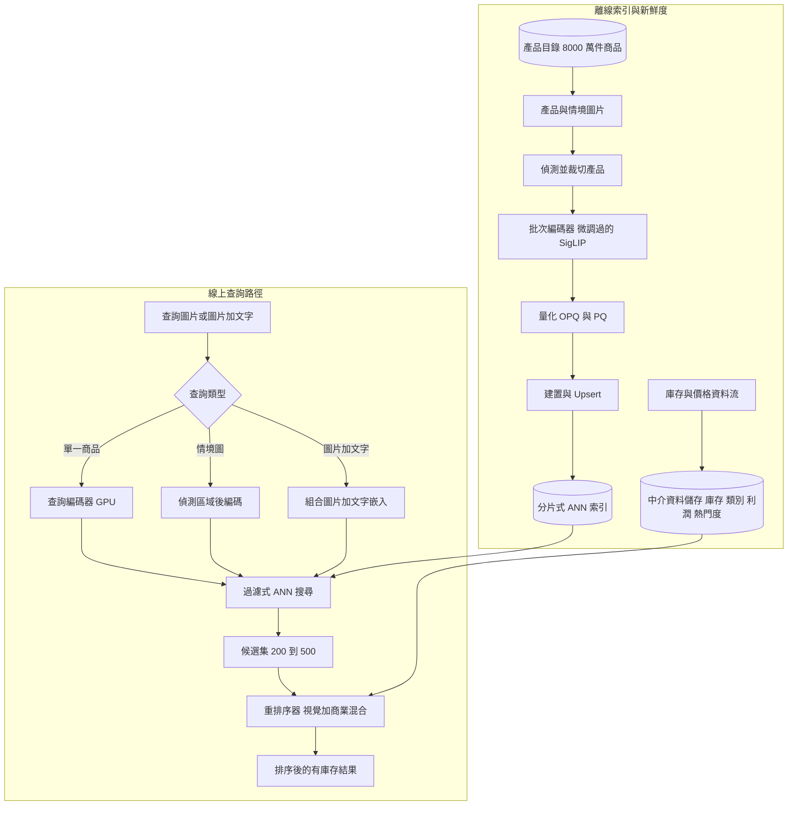
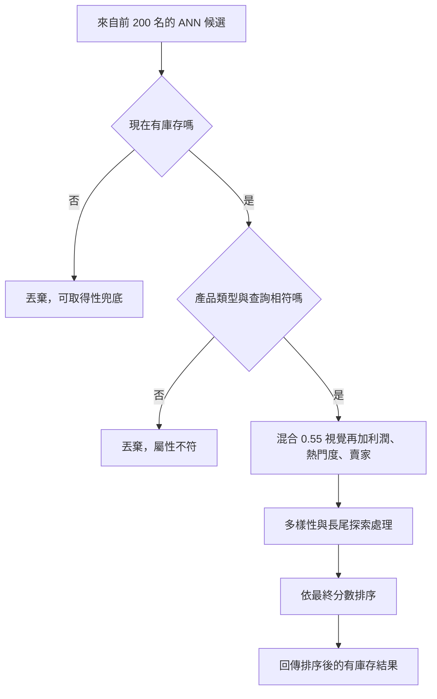
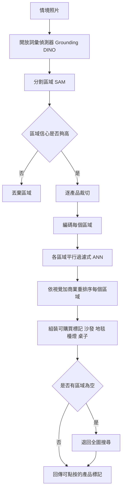

# 案例研究：電商視覺搜尋與多模態產品探索

一個擁有 8000 萬件商品的大型電商平台，讓購物者能以照片搜尋：拍下一張沙發、洋裝或球鞋，就能得到視覺上相似且有庫存的商品、從一張情境照片選購整套造型，並執行像「這件外套但要綠色的」這種文字加圖片的查詢。在數億個圖片嵌入與每秒數千筆視覺查詢的規模下，最艱難的單一限制條件，是在龐大規模上以個位數毫秒的 ANN 延遲做視覺相似度比對，同時讓結果保有商業相關性（有庫存、正確類別、而不只是像素相似），並在庫存不斷汰換的同時維持目錄的新鮮度。與 [11-recommendation-engine.md](11-recommendation-engine.md) 中那個行為式推薦器不同，這裡的訊號是圖片，而不是點擊紀錄。

## 商業問題

視覺搜尋最能派上用場的地方，正是文字幫不了購物者的時候。有人在朋友家看到一張沙發、在街上看到一件洋裝、或在一張照片裡看到一雙球鞋，卻叫不出品牌、輪廓或確切的顏色，但他們能拍一張照片。產品必須把那張照片變成一小排買得到、有庫存的相似商品，而且快到讓它感覺像是搜尋，而不是一個科學實驗。在單一商品查找之上，還坐著兩種更難的模式：選購整套造型，也就是一張情境照片裡有一張沙發、一塊地毯和一盞檯燈，而購物者全都想要；以及組合式查詢，也就是購物者交出一張圖片再加上一段文字修改（「這個但更便宜」、「要綠色的」、「更正式一點」）。

天真的做法會同時在三條軸線上失敗。第一，現成的 CLIP 與 SigLIP 是在網頁 alt-text 上訓練出來的：它們能精準抓到粗略的語意（「一件紅色洋裝」），卻抓不到商業賴以構成的細粒度屬性（midi 對比 maxi、羅紋針織對比麻花針織、霧面對比亮面），所以通用嵌入會回傳看起來合理卻錯誤的產品。第二，純粹的最近鄰檢索並不等於商業相關性：像素上最接近的商品經常是沒庫存的、屬於不同類別的（一個長得像你拍的那個手提包的手機殼）、或是一筆低利潤的代發貨（drop-ship）商品。第三，一個 8000 萬件商品的目錄每分鐘都在汰換（新品上架、售罄、補貨、價格與圖片變動），所以昨晚建好的索引，此刻已經在對購物者說謊。

於是團隊打造的是一套內容檢索系統，而不是一套推薦器。一個經過領域微調的多模態編碼器，把圖片與文字投影到同一個共享空間；一個真正的向量引擎，存放數億個量化過、分片過的向量，並在個位數毫秒內回答過濾式 ANN 查詢；一個具商業意識的重排序器，把視覺相似度與可取得性、利潤和熱門度混合在一起；一個物件偵測器，把情境照片切分開來，讓每個產品都有自己的搜尋；還有一條事件驅動的攝取管線，在庫存汰換的同時維持嵌入的新鮮度。與 [11-recommendation-engine.md](11-recommendation-engine.md) 的區別正是重點所在：那套系統是從行為來排序的，看不見一個全新的 SKU，而這套系統在產品圖片被索引的那一刻就看得見它，這正是為什麼新鮮度在這裡是一級的限制條件。

來自 2026 年 6 月現實的限制條件：

- 8000 萬件商品，每件各有數張圖片，再加上情境照片與各區域的裁切圖，把索引推過 3 億個向量；目錄持續不斷地汰換，所以一個靜態的、每晚重建的索引，到早上就已經過時。
- 尖峰時每秒數千筆視覺查詢；ANN 這一步必須維持在個位數毫秒，而端到端 p99 要低於約 200 ms，否則購物者就會跳離。
- 現成的 CLIP/SigLIP 是在圖說（caption）上訓練的，不是在產品上：它會把 midi 和 maxi 搞混、漏掉針織花樣，而且完全沒有「有庫存」相對於「已停售」的概念。
- 前沿的 VLM API（Gemini 3.1 Pro、Claude Opus 4.8 的視覺能力）在這種 QPS 下，太慢也太貴，無法放在每筆查詢的熱路徑上呼叫，所以查詢編碼器必須是自架且便宜的。
- 視覺上的最近鄰並不等於商業相關性：最接近的匹配往往是買不到的、跑錯類別的、或低利潤的，所以一道具商業意識的重排序是必要的，而不是可有可無的潤飾。
- 一個全新的 SKU 沒有任何互動數據，所以行為式推薦浮不出它，但它的圖片在上架第一天就完成嵌入；視覺搜尋正是那條冷啟動的探索路徑，而這也把新鮮度的門檻拉高了。
- 記憶體的算術逼著設計走向定局：3 億個 768 維的 fp32 向量，在算進圖結構開銷之前大約就是 900 GB，所以量化與分片是前提條件，而不是事後微調的旋鈕。

## 架構



### 元件

| 層級 | 技術 | 用途 |
|-------|------|---------|
| 查詢編碼器 | 微調過的 SigLIP 2 ViT，自架於 GPU 上 | 把查詢圖片與文字編碼進共享空間 |
| 嵌入模型 | 領域微調過的 CLIP/SigLIP；Cohere Embed v4 或 Voyage Multimodal 作為託管替代方案 | 單一共享的圖文向量空間 |
| 物件偵測 | Grounding DINO 加上 SAM，做開放詞彙的偵測與分割 | 在情境照片中找到並裁切產品 |
| ANN 索引 | Vespa 或 Milvus，HNSW 與 IVF-PQ，分片並複製 | 在數億個向量上做低於 10ms 的最近鄰 |
| 量化 | OPQ 加上 PQ，全精度的重排序向量放在 SSD 上 | 在不讓召回率崩掉的前提下把索引塞進 RAM |
| 中介資料儲存 | Postgres 或低延遲 KV，串流式庫存資料流 | 供過濾與重排序用的庫存、類別、價格、利潤、熱門度 |
| 重排序器 | LambdaMART 或小型神經排序器，或一段 Vespa ranking expression | 把視覺相似度與商業訊號混合起來 |
| 組合式查詢 | 屬性解析器加上嵌入組合，Pic2Word 風格 | 解析「這個但要綠色的」 |
| 攝取管線 | 事件驅動的編碼器、串流式 upserts、tombstones | 在目錄汰換時維持嵌入的新鮮度 |
| 評估與日誌 | 已標註的匹配集、點擊與轉換日誌 | recall@k、類別精確率、線上 CTR 與 CVR |

### 資料流

1. 購物者上傳一張照片；app 判定查詢類型（單一商品、情境圖、或圖片加文字），而對於情境照片，會先跑偵測。
2. 自架的查詢編碼器把圖片投影到共享嵌入空間；對於圖片加文字，那段文字修飾語會被融合進查詢，或轉成屬性過濾條件。
3. 搜尋層發出一筆過濾式 ANN 查詢：最近鄰在圖走訪時就被限制為有庫存、且在已知的情況下限制為正確類別，所以候選集在當下就已經是商業上有效的。
4. 索引回傳 200 到 500 個帶有近似距離的候選；這些候選的全精度向量會從 SSD 取出，做精確的重新評分。
5. 中介資料儲存為每個候選提供可取得性、價格、利潤、熱門度與賣家品質。
6. 重排序器把精確的視覺相似度與商業特徵混合成一個最終分數，這個混合是從點擊與轉換日誌中學來的。
7. 結果會以排序後的有庫存產品回傳，或者，對於選購整套造型，則以依偵測到的區域分組、可點按的標記回傳。
8. 這次互動（曝光、點擊、加入購物車、購買）會被記錄下來，並同時餵給重排序器的訓練集與相關性評估。

### 實例演練：世紀中期風格沙發

這個設計最容易透過一筆從頭走到尾的查詢來理解，接著再看同一張照片的選購整套造型與組合式變體。

**單一商品。**一位購物者在朋友家拍下一張世紀中期風格的沙發（胡桃木椅腳、橄欖綠拉扣軟墊、三人座）。自架且微調過的 SigLIP 2 編碼器在一張 L4 上，於約 12 ms 內把這張裁切圖投影到共享的 768 維空間。一筆在座椅分片（在類別與可取得性過濾之後，約 812,000 個有庫存的沙發向量，取自那個 8000 萬件商品的目錄）上的過濾式 ANN 查詢，在 6 ms 內回傳視覺上最接近的 200 筆。純粹的像素順序把一張沒庫存、幾乎一模一樣的沙發排在第一（`SKU-7731`，視覺相似度 0.94），把一張長得很像的 loveseat 排在第二（`SKU-4402`，0.93），而兩者都不該勝出。`SKU-7731` 在四分鐘前售罄，在一份稍微過時的快照上溜過了索引過濾，所以重排序的可取得性兜底把它的分數乘到趨近於零（最終 0.04），於是它掉出了頁面。`SKU-4402` 是一張雙人座的 loveseat，與查詢所推斷出的沙發屬於不同的 `product_type`，所以屬性閘門把它整個過濾掉。勝出者是 `SKU-2185`（視覺相似度 0.89，一張貨真價實的三人座世紀中期風格沙發，有庫存、高利潤、且熱門），商業混合把它抬升到最終 0.89。注意 `SKU-6390` 其實在像素上更相似，達 0.91，但它的低利潤與低轉換率把它拉到最終 0.80，落在相似度稍低一點的 `SKU-2185` 之下。那個像素上最接近的商品，以原始相似度來看排在第四、以商業相關性來看則排在第一。

**選購整套造型。**同一位購物者接著上傳一張完整的客廳照片。Grounding DINO 加上 SAM 以可用的信心分數偵測並分割出三個產品區域（沙發 0.92、落地燈 0.88、地毯 0.71），以及一個弱區域（一個牆上相框，0.34），後者因為低於信心閘門而被丟棄。每一塊保留下來的裁切圖，都平行地跑自己的過濾式 ANN 與重排序，回傳三組可點按的標記群：沙發區域重新浮出 `SKU-2185`，而檯燈與地毯區域則回傳它們各自有庫存的匹配。如果任何一個區域回來是空的，系統會為那個標記退回到全圖搜尋，而不是什麼都不顯示。

**組合式查詢。**購物者接著輸入「同樣的風格但要森林綠」。文字解析器把 `color=green` 提取成一個硬性分面過濾，並讓視覺查詢維持在形狀與風格上，所以 ANN 會在那些相同的世紀中期風格鄰居之上，以受限於綠色軟墊的方式重跑，而這條分面優先的路徑會回傳綠色的三人座沙發，不帶那種未經處理的圖片加文字向量算術會引入的色彩漂移。

### 結果紀錄

搜尋層發出的是一筆經過 schema 驗證的結果紀錄，而不是一份光禿禿的排序清單。重排序所信任的每一個欄位，都是一個經過驗證的訊號（庫存、`product_type`、利潤），所以一個沒庫存或錯誤類型的候選，會以決定性的方式被降級，而不是憑它看起來有多相似。

```json
{
  "query_image_id": "vq-2026-07-11-3f9a17",
  "query_type": "single_item",
  "inferred": {"product_type": "sofa", "style": "mid_century", "primary_color": "olive", "seat_count": 3},
  "ann": {"shard": "seating_hnsw_pq", "searched": 812000, "candidates_returned": 200, "latency_ms": 6},
  "weights": {"visual_sim": 0.55, "category_match": 0.15, "margin": 0.12, "popularity": 0.10, "seller_quality": 0.08},
  "candidates": [
    {"sku": "SKU-2185", "visual_sim": 0.89, "in_stock": true, "product_type": "sofa", "margin": 0.85, "popularity": 0.75, "final_score": 0.89, "returned": true},
    {"sku": "SKU-6390", "visual_sim": 0.91, "in_stock": true, "product_type": "sofa", "margin": 0.35, "popularity": 0.40, "final_score": 0.80, "returned": true},
    {"sku": "SKU-5012", "visual_sim": 0.86, "in_stock": true, "product_type": "sofa", "margin": 0.45, "popularity": 0.50, "final_score": 0.79, "returned": true},
    {"sku": "SKU-4402", "visual_sim": 0.93, "in_stock": true, "product_type": "loveseat", "margin": 0.70, "popularity": 0.55, "final_score": 0.00, "returned": false, "filtered": "attribute_mismatch product_type"},
    {"sku": "SKU-7731", "visual_sim": 0.94, "in_stock": false, "product_type": "sofa", "margin": 0.60, "popularity": 0.70, "final_score": 0.04, "returned": false, "filtered": "out_of_stock"}
  ],
  "returned": ["SKU-2185", "SKU-6390", "SKU-5012"]
}
```

這筆紀錄讓降級變得可稽核：`SKU-7731` 與 `SKU-4402` 帶著最高的兩個 `visual_sim` 值，兩者卻都掉出了 `returned`，一個是因為可取得性，一個是因為一道硬性屬性閘門，而 `SKU-6390` 留了下來，卻在商業訊號上排在一個相似度較低的對手之後。把權重逐一算過，`SKU-2185` 的分數是 0.55 乘 0.89，加上類別匹配的 0.15，加上 0.12 乘 0.85，加上 0.10 乘 0.75，加上 0.08 乘 0.92，最後落在 0.89，而 `SKU-6390` 以同一道公式，套在更高的 0.91 視覺相似度、卻是 0.35 的利潤與 0.40 的熱門度上，落在 0.80，所以相似度稍低一點的那個商品，是靠經濟效益、而不是靠像素勝出。

選購整套造型會為每一個偵測到的區域各發出一筆紀錄，而那個微弱的牆上相框偵測，永遠不會變成一個標記：

```json
{
  "query_image_id": "vq-2026-07-11-7c22b0",
  "query_type": "shop_the_look",
  "regions": [
    {"label": "couch", "detect_conf": 0.92, "top_sku": "SKU-2185", "visual_sim": 0.88, "returned": true},
    {"label": "floor_lamp", "detect_conf": 0.88, "top_sku": "SKU-3310", "visual_sim": 0.83, "returned": true},
    {"label": "rug", "detect_conf": 0.71, "top_sku": "SKU-9184", "visual_sim": 0.79, "returned": true},
    {"label": "wall_frame", "detect_conf": 0.34, "top_sku": null, "returned": false, "dropped": "below_detect_gate"}
  ],
  "returned": ["SKU-2185", "SKU-3310", "SKU-9184"]
}
```

## 關鍵設計決策

### 1. 一個微調過的共享圖文嵌入空間

現成的 CLIP 與 SigLIP 擅長粗略的語意，卻在商業賴以維生的屬性上很弱：袖長、領口、鞋跟類型、木頭表面處理、針織花樣。修法是拿目錄本身去微調一個 SigLIP 2 級別的編碼器，把產品標題、結構化屬性與類別當成文字端，並做困難負例挖掘（hard-negative mining）（把一件 maxi 洋裝當成 midi 的負例），好讓這個空間真的把那些對購物者要緊的相似品分開。單一共享空間正是整件事的重點：圖片查詢、文字查詢與產品圖片全都落在同一個索引裡，所以一張照片與「羅紋綠色開襟衫」這個詞句，是從單一個儲存中檢索出來的。託管的多模態嵌入（Cohere Embed v4、Voyage Multimodal 3.5、Gemini Embedding）是個快速的起點，但在這種 QPS 下，一個自架且微調過的編碼器在成本與領域精確度上兩者都勝出。具體來說，這個編碼器是一個 SigLIP 2 ViT-L/16，輸出 768 維向量，以一個 sigmoid 對比目標（contrastive objective）與困難負例挖掘微調而成，其中一張長得很像的 loveseat 會被當成一筆沙發查詢的負例來挖掘（就是實例演練裡的 `SKU-4402` 案例），而這正是通用的現成 SigLIP 在細粒度匹配集上，遠遠落在召回率 SLO 之下的地方（[Marqo GCL](https://arxiv.org/abs/2404.08535)）。參見 [Embedding Models](../06-retrieval-systems/03-embedding-models.md) 與 [Multi-Modal RAG](../06-retrieval-systems/12-multimodal-rag.md)。

### 2. 大規模 ANN：量化、分片，以及召回率、延遲與成本的三角權衡

數億個向量不會以未壓縮的形式安坐在 RAM 裡：3 億個 768 維的 fp32 向量，在算進 HNSW 圖結構開銷之前，大約就是 900 GB。所以索引會用 OPQ 加上乘積量化（product quantization）把向量壓到數十個位元組，跨節點分片並為了 QPS 而複製，並以 HNSW 或 IVF-PQ 作為圖與倒排結構（[HNSW](https://arxiv.org/abs/1603.09320)、[FAISS](https://github.com/facebookresearch/faiss)）。具體來說，OPQ 加上 PQ 把每個 768 維的 fp32 向量（3072 個位元組）壓縮成一段約 64 個位元組的 PQ 碼，約莫是 48 倍的縮減，讓 3 億向量的佔用量從大約 900 GB 降到不到 20 GB 的碼，小到足以跨少數幾個 RAM 節點分片，而全精度向量則坐在 SSD 上供精確重排序之用。量化是拿召回率去換記憶體，所以這個模式是粗搜尋再精確重排序：在壓縮碼上做 ANN，於個位數毫秒內回傳幾百個候選，接著這些候選會對照 SSD 上的全精度向量重新評分。吃重的活交給一個真正的引擎來扛；Vespa 與 Milvus 在這裡都能擴展，而選擇的關鍵在於你是否想在同一筆查詢裡就完成商業排序（決策 3）。參見 [Vector Databases](../06-retrieval-systems/04-vector-databases.md)。

### 3. 視覺相似度並不等於商業相關性

核心的錯誤是把未經處理的最近鄰結果直接上線。像素上最接近的商品經常是錯的答案：沒庫存、跑錯類別、或是一筆傷害平台的低利潤商品。商業相關性是一個重排序問題：在 ANN 候選集之上，一個學習出來的排序器（LambdaMART 或一個小型神經模型）把視覺相似度與可取得性、類別匹配、價格契合度、利潤、熱門度和賣家品質混合起來，並在點擊與轉換日誌上訓練。這正是 Vespa 吸引人之處：它把 ANN 的接近度與商業特徵表達在同一段伺服器端的 ranking expression 裡，所以過濾與混合不必再多跳一次就發生。是這一層，而不是編碼器，才把「看起來相似」變成「值得展示」。這個混合是一個學習出來的排序器（LambdaMART 或一個小型神經模型），但它的特徵權重是清晰易讀的，而在實例演練裡，它們正是把像素上最接近的 `SKU-7731` 與 `SKU-6390` 降到 `SKU-2185` 之下的東西：

| 訊號 | 權重或效果 | 它的作用 |
|--------|------------------|--------------|
| 視覺相似度（精確的全精度 cosine） | 0.55 | 基礎相關性，這個商品之所以浮現的原因 |
| 類別與屬性匹配（`product_type`、`seat_count`、`material`） | 0.15，`product_type` 不符時硬性降級 | 把 loveseat 擋在沙發查詢之外，並對柔性屬性分級評分 |
| 有庫存的可取得性 | 在 ANN 做硬性閘門，作為重排序兜底時乘向零 | 一個買不到的結果比沒有結果更糟 |
| 利潤 | 0.12 | 讓平手局面偏向平台的經濟效益，絕不凌駕相關性 |
| 熱門度與轉換率 | 0.10 | 偏好已被驗證的賣家，一個由長尾探索所抵銷的柔性先驗 |
| 賣家品質與評分 | 0.08 | 壓制低品質或低信任的商品刊登 |
| 對查詢情境的價格契合度 | 打破平手用 | 朝購物者隱含的價格帶輕推 |

這五個有評分的權重加總為 1.0；可取得性是一道閘門，而不是一個權重，而價格契合度只用來打破平手。參見 [Reranking Strategies](../06-retrieval-systems/06-reranking-strategies.md)；對照 [11-recommendation-engine.md](11-recommendation-engine.md) 中那套行為式的協同排序。

### 4. 在索引內過濾，而不是在它之後

有庫存與類別的限制條件，必須在 ANN 走訪的過程中就套用，而不是當成對 top-k 的後過濾。在這種規模下後過濾是一個陷阱：如果目錄有 40 percent 沒庫存，一個天真的 top-100 可能只剩下寥寥幾個能展示的商品，甚至一個也不剩。現代的向量引擎支援過濾式 ANN（受限的 HNSW 走訪、IVF 清單剪枝），所以在走訪圖的同時，可取得性與類別就被遵守。驅動這道過濾的中介資料（庫存、類別、價格）住在一個低延遲的儲存裡，由那條同時驅動新鮮度的庫存資料流來更新，所以一件售罄的商品會在幾分鐘內就不再出現，而不是要等到下一次全量重建。在索引內過濾是第一道防線，而不是唯一一道：走訪所讀取的那份中介資料快照，可能落後現實好幾秒，所以一件剛剛售罄的商品（實例演練裡的 `SKU-7731`，它的庫存在查詢前四分鐘翻轉）仍然可能進入候選集，而在那裡，重排序的可取得性兜底會作為第二道防線，把它的分數乘向零。

### 5. 選購整套造型：先偵測，再搜尋每個區域

一張情境照片裡有一張沙發、一塊地毯、一盞檯燈和一張咖啡桌，而購物者全都想要。所以選購整套造型是一條兩階段的路徑：一個開放詞彙的偵測器（Grounding DINO）加上分割（SAM），會找到並裁切出每一個產品區域，而每一塊裁切圖都跑自己的過濾式 ANN 搜尋，逐區域回傳可點按的標記（[Grounding DINO](https://arxiv.org/abs/2303.05499)、[SAM](https://arxiv.org/abs/2304.02643)）。這正是 Pinterest 把它產品化為 Lens 與 Complete the Look 的那套模式（[unified embeddings](https://arxiv.org/abs/1908.01707)、[Complete the Look](https://arxiv.org/abs/1812.01748)）。偵測的信心分數為這些區域把關：一個低信心的框會被丟棄，而不是被當成一個糟糕的匹配秀出來，而如果偵測找不到任何可用的東西，系統就退回到全圖搜尋。具體來說，在實例演練裡，偵測器保留了沙發（信心 0.92）、落地燈（0.88）與地毯（0.71），同時把一個 0.34、低於閘門的牆上相框丟棄，接著平行地搜尋這三塊保留下來的裁切圖。

### 6. 文字加圖片的組合查詢

「這件外套但要綠色的」是一個組合式查詢，而要服務它有兩種辦法，且是搭配著用。對於定義明確的屬性（顏色、尺寸、價格帶、品牌），可靠的做法是把文字解析成結構化的分面（facet），並把它們當成過濾條件，套在形狀與風格的視覺相似度之上，因為在嵌入的數學很模糊之處，一個顏色分面卻是精確的。對於開放式的風格修改（「更正式一點」、「復古氛圍」），一個組合式圖片檢索模型會把圖片與文字融合成單一個查詢嵌入（[Pic2Word](https://arxiv.org/abs/2302.03084)）。粗糙的嵌入算術（圖片向量加上一個文字差量）在緊要關頭能湊合著用，卻會偏離意圖，所以生產環境的預設是分面過濾優先、其餘的才用組合。

### 7. 目錄新鮮度：增量嵌入與索引更新

8000 萬件商品持續不斷地汰換，而每晚重新嵌入並重建索引太慢了：一個新的 SKU 只要隱形一天，就是流失掉的 GMV。所以新鮮度是事件驅動的。一次目錄變動會發布一個事件，新的或變動過的圖片會在幾分鐘內被編碼並 upsert 進索引，被移除的商品會拿到一個 tombstone 好讓它們立刻掉出去，而純粹的可取得性翻轉，則完全不必重新編碼，交由中介資料過濾來處理。HNSW 在大量刪除汰換之下會劣化，而 IVF 的質心（centroid）會隨時間漂移，所以一次週期性的全量重建，會在串流層底下把圖的品質復原回來。這正是 [31-rag-data-ingestion-pipeline.md](31-rag-data-ingestion-pipeline.md) 的攝取紀律，套用在圖片向量而非文件之上。

### 8. 冷啟動與長尾：內容檢索在哪裡勝出、又仍在哪裡掙扎

這是相較於行為式推薦的那個誠實的優勢。一個全新的產品有零次點擊，所以 [11-recommendation-engine.md](11-recommendation-engine.md) 中的協同推薦器無法為它排序，但它的圖片在被上架的那一刻就完成嵌入，所以視覺搜尋在第一天就能把它浮出來；這正是為什麼新鮮度在這裡如此要緊。長尾在另一個方向上更難：稀有的商品坐落在索引裡稀疏的區域，那裡 ANN 的召回率會下降，而一個以熱門度加權的重排序器會悄悄地把它們埋掉（富者愈富）。緩解之道是在重排序中加入多樣性與探索，並把熱門度當成一個柔性的先驗，而不是一道硬性的閘門，好讓長尾維持可被發現。

### 9. 什麼時候視覺搜尋是錯的工具

視覺搜尋是一個給視覺驅動類別（時尚、家具、居家裝飾）用的探索入口，而不是一個通用的搜尋替代品，假裝它是，只會讓體驗變差。對於商品化與規格驅動的品項（一個有名字的 SKU、一台以 RAM 挑選的筆電、一個 iPhone 充電器），關鍵字與文字搜尋徹底勝出，因為購物者知道確切的詞彙，而像素只會添加雜訊。對於有豐富歷史的已登入購物者，行為式推薦往往比視覺相似度更會轉換，因為它捕捉到了外觀無法捕捉的品味與跨類別的親和性。而視覺搜尋在意圖錯配上表現不足：一張沙發的照片，可能意味著「同一張沙發但更便宜」（一個產品匹配問題），也可能意味著「和這張沙發搭得起來的東西」（一個推薦問題），兩者都不是最近鄰相似度。正確的姿態是依類別與查詢類型來路由，並讓文字搜尋與推薦去扛它們扛得更好的部分。參見 [Hybrid Search](../06-retrieval-systems/05-hybrid-search.md)。

## 重排序決策

每一個 ANN 候選在被那個學習出來的混合評分之前，都會通過同一組決定性的閘門，所以一個買不到或錯誤類型的商品，無法單憑視覺相似度勝出。這正是實例演練背後的邏輯：可取得性與屬性閘門先觸發，接著是加權混合，然後是一道讓長尾維持可被發現的多樣性處理。



## 選購整套造型流程



## 失效模式與緩解措施

### F1：沒庫存或已停售的最前排結果

視覺上最接近的商品是買不到的，於是購物者一點進去就撞上死路。緩解：在 ANN 走訪時就做有庫存過濾（決策 4），外加在重排序中對可取得性施以懲罰，並由庫存資料流在幾分鐘內翻轉庫存狀態。

### F2：類別漂移，像素相似卻在商業上是錯的

一個檯燈底座被一筆手提包查詢檢索了出來，或是一個手機殼被一筆鞋子查詢檢索了出來，因為它們共用了輪廓與顏色。緩解：對查詢做一個類別分類器、做類別受限的檢索，並把類別精確率當成一個帶閘門的指標來追蹤，好讓漂移在上線之前就被逮到。

### F3：目錄汰換後過時的嵌入

新品沒出現，而售罄的商品還在秀，因為索引落後於目錄。緩解：事件驅動的增量編碼與 upsert 並搭配 tombstones（決策 7）、一個針對「商品上架到可被搜尋」延遲的新鮮度 SLO，以及週期性的全量重建來把圖的品質復原。

### F4：現成的編碼器漏掉細粒度屬性

一個通用的 CLIP 回傳了對的形狀，卻是錯的花樣、袖型或材質，這在購物者眼中讀起來就是一個壞掉的搜尋。緩解：在屬性上做帶困難負例挖掘的領域微調（決策 1），並在一個已標註的細粒度匹配集上評估，而不只是粗略的類別。

### F5：在激進量化之下召回率崩掉

被過度壓縮的 PQ 碼，會把真正的匹配完全排除在候選集之外。緩解：對照全精度向量做粗搜尋再精確重排序、拿 PQ 參數去對照量測到的 recall@k 相對於一個精確基準來調校，並把召回率當成一個與相關性分開的索引健康度 SLO 來監控。

### F6：查詢編碼器的 GPU 成本與延遲在尖峰時暴衝

一個爆紅商品或一場特賣帶來的流量突增，會讓編碼器機群過載，而 p99 延遲會撐爆預算。緩解：在編碼器上做請求批次化、一個蒸餾過的更小查詢模型、對 GPU 機群做自動擴縮，以及一個給熱門或近似重複查詢圖片用的嵌入快取。參見 [Cost Optimization Playbook](../04-inference-optimization/07-cost-optimization-playbook.md)。

### F7：選購整套造型的誤偵測

偵測器把一個背景物件分割成了一個產品，或是漏掉了購物者想要的一個品項。緩解：以信心門檻把關的偵測，會丟棄弱的區域、在找不到任何可用東西時退回全圖（決策 5），以及一個由人工標註的偵測評估集。

### F8：目錄外或對抗性的查詢圖片

購物者拍了一個平台並不販售的東西（一個競爭對手的 SKU、一個人、一張迷因），而索引硬是回傳了一個不相關的最近鄰。緩解：一個低相似度的門檻，會回傳「沒有強烈的視覺匹配」並退回文字搜尋，而不是秀出一個自信卻錯誤的結果。

## 維運考量

### 監控

| SLO | 目標 |
|-----|--------|
| ANN 搜尋延遲 p99 | 個位數 ms |
| 端到端視覺查詢 p99 | 低於 200 ms |
| recall@10 相對於精確搜尋 | 超過 0.95 |
| 類別 precision@10 | 超過 0.90 |
| top-10 的有庫存率 | 超過 0.98 |
| 商品上架到可被搜尋，p95 | 低於 10 分鐘 |
| 視覺結果的點擊率與加入購物車 | 發布時不得回歸 |
| 全量索引重建 | 低於數小時 |

### 成本模型

在數億個向量與每秒數千筆 QPS 規模下的估算：

- ANN 索引叢集（吃重記憶體、分片並複製、量化過）：主導性的固定成本，大約每月數萬美元。
- 查詢編碼器 GPU 機群（L4/A10 級別，自動擴縮到每秒數千筆 QPS）：一筆實實在在的每月支出，數萬美元的低段。
- 初始目錄回填：把數億張圖片編碼是一筆龐大的一次性批次 GPU 支出；穩態的增量重新嵌入則只是它的一小部分。
- 供選購整套造型用的物件偵測：只在情境圖查詢上做 GPU 推論，是一筆較小的支出，會隨那一片流量比例擴縮。
- 重排序器：一個在幾百個候選之上運作的梯度提升或小型神經模型，相對於編碼與索引來說很便宜。
- 中介資料儲存與串流式更新：不算多，但那條庫存資料流必須可靠，因為它同時驅動過濾與新鮮度。

### 待命處置手冊

- ANN 延遲 p99 違反：檢查分片熱點與副本健康度、把熱門查詢的負載卸載到一條快取結果的路徑，並在動到召回率參數之前先擴充副本。
- 新鮮度延遲警報：檢視攝取事件的積壓、確認 upserts 與 tombstones 正在消化，並對受影響的那一片目錄觸發一次針對性的重新索引。
- CTR 或類別精確率的相關性下滑：凍結重排序器與編碼器的版本、對照上一個良好的發布做 diff，並回滾；兩者在進入流量之前都要先過影子評估（shadow eval）。
- 編碼器機群飽和：加大批次化、自動擴縮 GPU，並從嵌入快取供應熱門的查詢圖片；如果還是飽和，就優雅地降級到文字搜尋。
- 索引重建超時：在一個副本上跑重建再熱切換，絕不要就地重建一個正在服務的分片。

## 強力面試候選人會涵蓋哪些內容

- 他們會把兩個難題分開：一個用於召回的微調共享圖文嵌入空間，以及一個用於商業相關性的具商業意識重排序，而且他們會堅持未經處理的最近鄰是不能上線的。
- 他們知道現成的 CLIP/SigLIP 在細粒度產品屬性上很弱，於是伸手去拿帶困難負例挖掘的領域微調，而不是一個更大的通用模型。
- 他們會做記憶體的算術（數億個向量未壓縮塞不下），並設計出帶分片的粗量化搜尋再精確重排序，並點名召回率、延遲與成本的三角權衡。
- 他們會在索引內針對有庫存與類別過濾，而不是對 top-k 做後過濾，並能解釋為什麼後過濾在高缺貨率下會崩掉。
- 他們會把選購整套造型當成先偵測再逐區域搜尋、並帶一個全圖後備，並把組合式查詢當成分面過濾優先、對模糊的修改才用嵌入組合。
- 他們會用增量 upserts、tombstones 與週期性重建把新鮮度做成事件驅動的，並把它連結到冷啟動：視覺搜尋是那條唯一能把零互動的新 SKU 浮出來的路徑。
- 他們會坦白說出視覺搜尋在哪裡輸給關鍵字搜尋與行為式推薦（商品化與規格品項、已登入的品味、意圖錯配），並依類別與查詢類型來路由，而不是過度宣稱。

## 參考資料

- Radford et al., [Learning Transferable Visual Models From Natural Language Supervision (CLIP)](https://arxiv.org/abs/2103.00020)
- Zhai et al., [Sigmoid Loss for Language Image Pre-Training (SigLIP)](https://arxiv.org/abs/2303.15343)
- Tschannen et al., [SigLIP 2: Multilingual Vision-Language Encoders](https://arxiv.org/abs/2502.14786)
- Malkov and Yashunin, [Efficient and Robust ANN Search using HNSW Graphs](https://arxiv.org/abs/1603.09320)
- Jegou et al., [Product Quantization for Nearest Neighbor Search](https://inria.hal.science/inria-00514462)
- Facebook Research, [FAISS: a library for efficient similarity search](https://github.com/facebookresearch/faiss)
- [Vespa: ANN search plus business ranking in one query](https://vespa.ai/)
- [Milvus: open-source vector database](https://github.com/milvus-io/milvus)
- Jing et al., [Visual Search at Pinterest](https://arxiv.org/abs/1505.07647)
- Zhai et al., [Learning a Unified Embedding for Visual Search at Pinterest (Lens)](https://arxiv.org/abs/1908.01707)
- Kang et al., [Complete the Look: Scene-based Complementary Product Recommendation](https://arxiv.org/abs/1812.01748)
- Yang et al., [Visual Search at eBay](https://arxiv.org/abs/1706.03154)
- Liu et al., [Grounding DINO: Open-Set Object Detection](https://arxiv.org/abs/2303.05499)
- Kirillov et al., [Segment Anything (SAM)](https://arxiv.org/abs/2304.02643)
- Saito et al., [Pic2Word: Zero-Shot Composed Image Retrieval](https://arxiv.org/abs/2302.03084)
- Zhu et al., [Generalized Contrastive Learning for Multi-Modal Retrieval and Ranking (Marqo GCL)](https://arxiv.org/abs/2404.08535)

相關章節：[Embedding Models](../06-retrieval-systems/03-embedding-models.md)、[Vector Databases](../06-retrieval-systems/04-vector-databases.md)、[Reranking Strategies](../06-retrieval-systems/06-reranking-strategies.md)、[Multi-Modal RAG](../06-retrieval-systems/12-multimodal-rag.md)、[Case Study: Recommendation Engine](11-recommendation-engine.md)。
