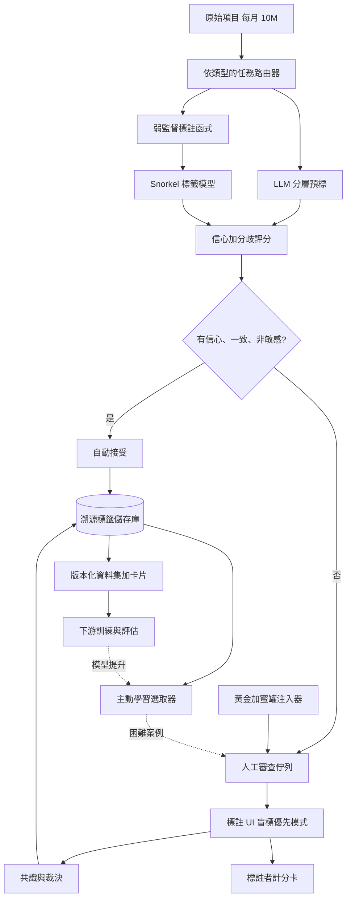
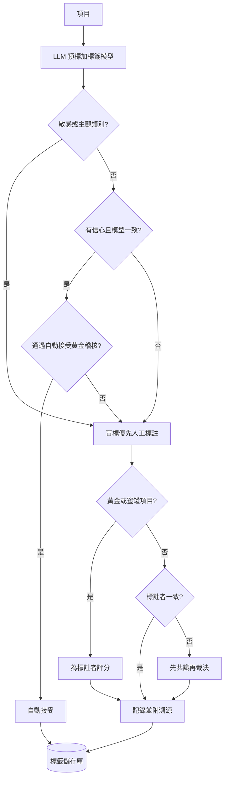

# 案例研究：LLM 輔助的資料標註與標記平台

一個資料標註平台（可能是內部 AI 團隊，也可能是標註廠商）每月把大約 10M 筆原始項目，轉換成橫跨分類、萃取、排序，以及 RLHF 式偏好比較的訓練與評估標籤：LLM 先預標以降低成本，人工再審查與修正，而修正後的標籤就成為下一個模型的標準答案。關鍵的限制在於，標籤品質是每一個下游模型的上限，而一個 LLM 預標器可能會大規模地、無聲地注入相互關聯的錯誤與偏誤，所以整件工作的重點，就是便宜地買到高品質的標籤，同時不讓模型自己的錯誤變成標準答案。這是[合成資料生成管線](37-synthetic-data-generation.md)的標註版姊妹篇：那邊製造的是全新的輸入，而不是為真實資料標註。

## 商業問題

這個平台服務多個都需要標註資料的下游團隊：一個意圖分類器、一個處理文件的萃取模型、一個排序模型，以及一個給 RLHF 用的獎勵模型。過去這一切都是全人工標註，準確但又慢又貴，每個資料集以數週計、要價五到六位數。便宜的 LLM 改變了成本結構：一個小模型能以不到一美分的代價把大多數項目正確地預標，所以在容易的多數項目上請人工從頭標註如今是一種浪費。這個平台的價值，在於只把人力花在真正能提升品質的地方。

那些天真的設計全都以很有啟發性的方式失敗。全盤自動接受每一個 LLM 標籤，你會得到便宜的資料，卻把模型的盲點當成標準答案固化進去，錯誤率你甚至看不見，而下一個模型會原封不動地繼承並放大那些錯誤。讓人工把全部 10M 筆項目都標一遍，品質是高，但成本與交付週期又回到了舊世界。把 LLM 建議的標籤秀給人看、讓他們去「審查」，自動化偏誤會讓他們蓋橡皮圖章：你付了全額的人工成本，卻只換到自動接受的品質，因為審查者的判斷此刻已與模型的錯誤相互關聯。

團隊選的架構，是以信心路由、並以品質量測為骨幹的 human-in-the-loop。一個便宜的 LLM 為所有項目預標；一個路由器自動接受有信心且彼此一致的多數，只把低信心與有分歧的項目送給人工；黃金與蜜罐項目即時量測人工與模型雙方的品質；Snorkel 式的弱監督加入一個失敗方式與 LLM 不同的便宜訊號；主動學習把人力預算瞄準最能撼動下游模型的項目；而每一筆標籤都帶有完整溯源。北極星指標是下游模型的提升，而不是內部的一致度。

來自 2026 年 6 月現實的限制條件：

- 每月橫跨四個任務族（分類、萃取、成對偏好、RLHF 比較）約 10M 筆項目；這個組合每週都在變。
- LLM 預標很便宜（Haiku 4.5、Gemma 4 27B、DeepSeek V4 Flash，每則短項目只要不到一美分的零頭）；人工審查才是主要成本，每則已審查項目約 $0.10 到 $0.60。
- 自動化偏誤是真實且可量測的：把模型的答案秀給人看，會把他們錨定到傾向接受它（[Parasuraman & Manzey, 2010](https://doi.org/10.1177/0018720810376055)）。
- 標籤品質是那道硬上限：一個在 88 percent 準確標籤上訓練的模型，在同一個任務上很少能超過那個準確率。
- 一致度目標：資料集出貨前，客觀任務上的 Cohen's 或 Fleiss' kappa 須高於 0.75。
- 偏好資料必須挺過 LLM-judge 的偏誤（位置、長度、諂媚），且不得把可被獎勵駭入的替代指標編碼進去。
- 每一筆標籤都要有完整溯源，供資料集卡片與稽核使用：由誰或由什麼產生、在多少信心下、用什麼方法、對照哪一版指引。
- 交付 SLA 以天計，而不是全人工標註所花的數週。

## 架構

### 元件

| 層級 | 技術 | 用途 |
|-------|------|---------|
| 攝取與路由 | Kafka 加任務資料庫 | 為項目分類並排定佇列順序 |
| 預標模型 | Haiku 4.5、Gemma 4 27B、DeepSeek V4 Flash；困難項目用 Gemini 3.1 Pro 或 Opus 4.8 | 便宜的首輪標籤 |
| 弱監督 | Snorkel 標註函式加標籤模型 | 獨立的便宜訊號 |
| 信心與分歧 | Token logprobs、自我一致性樣本、集成變異 | 決定人工會看到什麼 |
| 標註 UI | Label Studio 或 Argilla | 人工審查與修正 |
| QA | 黃金與蜜罐注入、kappa 引擎 | 抓出差勁的人與差勁的模型 |
| 共識 | Dawid-Skene 或貝氏聚合 | 融合多標註者的投票 |
| 溯源與版本控制 | DVC 或 LakeFS 加逐筆標籤來歷 | 可重現、可稽核的資料集 |
| 主動學習 | 不確定性與分歧抽樣器 | 把預算花在能撼動模型之處 |

### 資料流

1. 一筆項目被攝取、判定類型（分類、萃取、偏好、RLHF 配對），並放入它所屬的任務管線。
2. 一個便宜的 LLM 為它預標，並回傳一個標籤、一段理由，以及一個信心訊號（token logprobs 加上幾個自我一致性樣本）；弱監督標註函式則平行投票。
3. 一個 Snorkel 標籤模型把標註函式的投票轉成一個機率式標籤；此刻平台握有三份便宜的意見（LLM、標籤模型、任何規則）以及它們之間的一致程度。
4. 一個路由器為信心與分歧評分。如果模型有信心、彼此一致，且該類別既非政策敏感也非主觀，這筆項目就被自動接受；否則它會進到人工佇列，並依主動學習價值排定優先序。
5. 黃金項目（已知答案）與蜜罐（所顯示的預標被故意設成錯的項目）會以 5 到 10 percent 的比例被植入人工佇列，以即時為標註者評分。
6. 對於敏感或主觀的類別，UI 採盲標優先：人工在 LLM 建議被揭露之前先給定一個標籤，然後再對照調和，讓模型無法錨定他們。
7. 分歧（人對模型，或標註者對標註者）會被導向共識，若仍僵持不下，就交給一位裁決者；最終標籤會連同完整溯源一起寫入：來源、信心、方法、模型版本、審查者。
8. 修正後的標籤會更新標註者計分卡並重新訓練標籤模型；不確定與高分歧的項目餵入主動學習佇列；一份帶卡片的版本化資料集匯出到下游訓練，而它帶來的模型提升，就成為那個重新排定未來標註優先序的指標。

## 關鍵設計決策

### 1. 以信心與分歧來分配稀缺的人力關注，而非齊頭式分配

核心的經濟操作。一個便宜的 LLM 為全部 10M 筆項目預標；路由器自動接受有信心且彼此一致的多數，只把不確定且有爭議的少數送給人工。自動接受門檻直接在成本與品質之間做取捨，所以要以經驗來設定它：挑出那個「經稽核、對照黃金的自動接受準確率仍維持在資料集品質門檻（比方說 98 percent）之上」的最高門檻，並把低於它的一切都路由出去。實務上 55 到 75 percent 的自動接受是常態，而這正是「為 10M 筆項目付人工錢」和「只為 3M 筆付錢」之間的差別。這是教科書式的 human-in-the-loop 路由；參見 [Human-in-the-Loop Patterns](../07-agentic-systems/08-human-in-the-loop-patterns.md)。

### 2. 用 kappa、黃金與共識持續量測標籤品質

你無法管理你沒有量測的東西，而「這個 LLM 看起來不錯」並不是一種量測。三種儀器。標註者間一致度（兩位評分者用 Cohen's kappa，多位用 Fleiss'）會告訴你這個任務究竟有沒有被好好定義：kappa 低於約 0.6 意味著指引壞了，而不是標註者偷懶（[Landis & Koch, 1977](https://www.jstor.org/stable/2529310) 的分級）。帶有已知答案、盲注入每一條佇列的黃金項目，會給你一個獨立於一致度之外的、逐位標註者的即時準確率。共識則用一個 Dawid-Skene 模型（[Dawid & Skene, 1979](https://www.jstor.org/stable/2346806)）而非天真多數決來融合多次標註，讓可靠的標註者拿到更多權重，為困難項目產出定案標籤外加一個不確定性估計。這三者就是骨幹；其餘一切都是水電管線。

### 3. 打破循環性，讓 LLM 與人工的錯誤保持獨立

正是這個陷阱讓整個領域變得危險。如果人工只是看一眼並確認 LLM 的標籤，他們的「審查」就與模型的錯誤相互關聯：任何模型自信犯下的錯誤都會一路通關，變成訓練下一個模型的標準答案，並以更高的信心被重複。這不是模型崩塌（在生成資料上遞迴訓練，[Shumailov et al., 2024](https://www.nature.com/articles/s41586-024-07566-y)，參見 [Synthetic Data Generation](37-synthetic-data-generation.md)）；這是在標註真實資料，而標註者與審查者共用了同一個盲點。防禦措施：對主觀與敏感類別採盲標優先審查、用會翻轉預標的蜜罐來抓橡皮圖章，以及一條常設規則：凡是預標器與你想量測的失效模式相同的類別，一律不自動接受。注意，這裡高的 LLM 與人工 kappa 並不能讓人安心：如果雙方共用同一種文化偏誤，他們會為了錯誤的理由而一致，kappa 卻看起來很漂亮。

### 4. 以弱監督作為便宜的獨立第三訊號

Snorkel 式的弱監督（[Ratner et al., 2017](https://arxiv.org/abs/1711.10160)）在建置完成後幾乎免費，而且關鍵在於，它失敗的方式和 LLM 不一樣。領域專家撰寫標註函式（regex、查表、啟發式規則、一個小模型），每一個都既有雜訊又不完整；一個標籤模型會估計每個函式的準確率與相關性，並在沒有標準答案的情況下把它們融合成一個機率式標籤。因為這些函式編碼的是明確的人類領域規則，而不是 LLM 學來的先驗，它們的錯誤與 LLM 的錯誤大致上不相關，所以弱監督與 LLM 之間的一致是真正的證據，而分歧則是一個送交人工的高價值路由訊號。它也在通用 LLM 最弱的長尾上提供了涵蓋率。

### 5. 主動學習：把標註預算花在能撼動模型之處

人工標籤是稀缺資源，所以要把它們花在最能改變下游模型的地方，而不是齊頭式地花。不確定性抽樣（標註模型最沒把握的項目）與委員會查詢（query-by-committee，標註 LLM 與標籤模型分歧之處）是經典的槓桿（[Settles, 2009](https://burrsettles.com/pub/settles.activelearning.pdf)）。這道飛輪是：標註一批、訓練、把新模型跑過未標註資料、找出困難與新近變得不確定的案例，然後把那些下一輪送給人工。這和評估堆疊用來尋找失效切片的，是同一個不確定性訊號；參見 [LLM Evaluation](../14-evaluation-and-observability/01-llm-evaluation.md)。做得好的話，主動學習只需要隨機抽樣所需標籤的一小部分，就能達到目標準確率。

### 6. 偏好與 RLHF 資料：成對比較、校準過的 judge、防獎勵駭入

偏好資料有它自己的失效面。相較於絕對的 1 到 5 分，偏好成對比較（A 對 B），因為人類在相對判斷上一致得多，再用一個 Bradley-Terry 模型（[Bradley & Terry, 1952](https://www.jstor.org/stable/2334029)）把它們融合成一個獎勵訊號。一個 LLM judge 能為偏好預標，並在約 80 percent 的時候與人類一致，與人對人的一致度相當（[Zheng et al., 2023](https://arxiv.org/abs/2306.05685)），但它帶有位置、冗長與自我增強偏誤（[Wang et al., 2023](https://arxiv.org/abs/2305.17926)），外加諂媚（[Sharma et al., 2023](https://arxiv.org/abs/2310.13548)）。用位置互換的雙重評判、長度受控的提示，以及一組常設的人工錨定集來緩解。更深層的風險是獎勵駭入：若標籤把長度或自信的語氣當成品質的替代指標來獎勵，經過 RLHF 的模型就會正好去鑽那個替代指標並過度最佳化（[Gao et al., 2022](https://arxiv.org/abs/2210.10760)）。保留一組人工偏好保留集，作為驗證 judge 所對照的標準答案，絕不反過來。

### 7. 可稽核性與標註者管理：每筆標籤都有溯源

每一筆標籤都帶有不可變的來歷：由哪個模型或哪個人產生、在多少信心下、用什麼方法（自動接受、共識、裁決）、對照哪一版指引、在什麼時間。正是這一點，讓你能出貨一張資料集卡片、回答稽核員，並重現某個模型訓練時所用的確切資料集版本（DVC 或 LakeFS）。在人的這一側，標註者計分卡會追蹤黃金準確率、對照群體的 kappa、蜜罐攔截率與吞吐量；低於門檻的標註者會被重新訓練或停權，且其近期標籤會被重新裁決。在這本帳上，模型只是另一位標註者：它也有一張計分卡，而當它的黃金準確率下滑時，它也可以被「停權」（把它負責的類別降級為強制人工審查）。

### 8. 成本與延遲：模型分層與自動接受這個槓桿

在每月 10M 筆項目之下，預標的花費很小（用 Haiku 4.5、Gemma 4 27B 或 DeepSeek V4 Flash，每筆只要不到一美分的零頭），人工審查才是全部的成本。兩個槓桿。把模型分層：預設用最便宜的，只有在便宜模型沒把握的那一小部分項目上，才升級到 Gemini 3.1 Pro 或 Opus 4.8。以及調校自動接受門檻這個最大的單一成本驅動因子：把自動接受從 60 percent 提高到 75 percent，能把人工量砍掉約 40 percent，但只有在經稽核的自動接受精確率仍守得住時才這麼做。批次預標並快取共用的指令前綴；兩者都能實質降低預標成本。參見 [FinOps and Token Economics](../11-infrastructure-and-mlops/04-finops-and-token-economics.md)。

### 9. 何時 LLM 預標是錯的選擇

別讓 LLM 在它的建議會汙染你所需的那個訊號的地方預標。三個禁區。安全關鍵的標準答案（醫療、法律，或會成為其他系統評測基準的 trust-and-safety 標籤）：一個自信而相互關聯的錯誤，代價太高，所以這些要以盲標優先方式交由人工標註，並只把 LLM 當作事後的分歧旗標。主觀或文化性的判斷（冒犯性、幽默、政治傾向、美感品質）：模型的先驗是把某一個族群的觀點包裝成客觀，而把它秀出來會把標註者錨定到那個觀點，所以要收集獨立的人工標籤並回報分歧，而不是把分歧消解掉。以及任何模型與你想量測的失效模式相同的情況：如果你正在打造一套評估，要找出某類模型會在哪裡產生幻覺，一個同源模型會在同樣的地方產生幻覺，並自信地把它們標成正確。篩選標準：當任務是客觀的、模型的錯誤與人工的錯誤獨立且能對照黃金被偵測出來，且一個錯誤標籤很便宜就能抓到時，LLM 預標才有幫助。只要其中任一項不成立，就付錢請人工。

## 逐項路由與 QA 流程

## 失效模式與緩解措施

### F1：相互關聯的 LLM 錯誤變成標準答案

預標器在一整個類別上自信地犯錯，自動接受讓它通關，而這個錯誤訓練了下一個模型，模型又重複它。緩解：為自動接受率設上限，並持續拿新鮮的黃金稽核自動接受的資料流（決策 1）、絕不自動接受模型與失效模式相同的類別（決策 9），並在黃金上的自動接受精確率掉到門檻以下時發出告警。

### F2：自動化偏誤，人類對模型蓋橡皮圖章

審查者瞥一眼 LLM 的建議就接受它，於是你付了人工審查的錢，卻得到自動接受的品質。緩解：對重要的類別採盲標優先審查、用會翻轉預標的蜜罐（接受了蜜罐的審查者就是在蓋橡皮圖章），以及一個被追蹤的人工編輯率。如果審查者幾乎從不更動標籤，這場審查就是一齣戲。

### F3：差勁的標註者（人或模型）悄悄毒化標籤

某一位標註者，或某個已漂移的模型版本，悄悄地連續好幾週注入錯誤標籤。緩解：黃金項目會給出逐位標註者的即時準確率、kappa 會標出對照群體的離群者，而計分卡會在低於門檻時自動停權並觸發對近期工作的重新裁決（決策 7）。模型也坐在同一張計分卡上。

### F4：偏好標籤有偏誤或可被獎勵駭入

LLM judge 偏好較長或列在前面的答案，或者標籤獎勵了一個 RLHF 模型接著就去鑽的替代指標。緩解：位置互換的雙重評判、長度控制、一組作為標準答案的人工錨定集，以及監控已接受的偏好裡是否出現像長度或自信語氣這類替代指標的相關性（決策 6）。過度最佳化的表徵，就是獎勵一路攀升、而人工評定的品質卻在下滑。

### F5：信心校準失準

LLM 又自信又錯，於是原始的 logprobs 會把太多容易的項目路由去自動接受，又把危險的項目路由得太少。緩解：用可靠度曲線與溫度縮放（temperature scaling）對照黃金來校準信心（[Guo et al., 2017](https://arxiv.org/abs/1706.04599)），並把「與標籤模型的分歧」當成一道獨立的第二道關卡，而不是單獨信任 logprobs。

### F6：預標器沒見過的分布漂移

新的項目類型湧入（一項新產品、一種新語言、一種新的濫用樣態），而預標器無聲地落在分布之外。緩解：對輸入嵌入做漂移偵測、把新奇的叢集直接路由給人工，並讓主動學習把這個新區域浮現出來，以便更新指引（決策 5）。

### F7：評估污染，機器標籤外洩進黃金評估集

被自動標註的項目同時落進訓練切分與可信的評估集，膨脹了下游模型的表現。緩解：黃金評估集是 100 percent 由人工驗證、獨立建構、且從不被自動標註；一道去重流程會以嵌入與精確比對，逐一檢查每個評估案例對照訓練池。這呼應了 [Eval-Gated CI/CD](18-eval-gated-cicd.md) 中的評估把關紀律。

### F8：溯源缺口破壞可稽核性

一個資料集出貨了，卻沒有人說得出某個有爭議的標籤是怎麼產生的，也重現不了某個模型訓練時所用的確切版本。緩解：不可變的逐筆標籤來歷與資料集版本控制（決策 7）、每次匯出都附一張資料集卡片，以及一條規則：沒有完整溯源的批次一律不出貨。

## 維運考量

### 監控

| SLO | 目標 |
|-----|--------|
| 標籤準確率對照可信黃金集 | 出貨的客觀標籤須超過 98 percent |
| 出貨前的標註者間 kappa（Fleiss） | 客觀任務超過 0.75；主觀任務照實回報 |
| 盲測黃金稽核上的自動接受精確率 | 達到或高於資料集品質門檻（例如 98 percent） |
| 對顯示的預標之人工編輯率 | 超過 8 percent（趨近於零代表橡皮圖章） |
| 每位在線標註者的黃金通過率 | 超過 92 percent，否則停權 |
| 每筆已驗證標籤的成本 | 在預算內，依任務類型追蹤 |
| 偏好 judge 對照人工的一致度 | 超過 80 percent 且位置互換後一致 |
| 每批標註帶來的下游模型提升 | 為正，否則重新排定優先序 |

### 成本模型

以每月約 10M 筆項目計：

- 在便宜層上的 LLM 預標（Haiku 4.5、Gemma 4 27B、DeepSeek V4 Flash）：每則短項目不到一美分的零頭，每月低五位數美元；在不確定的那幾個 percent 上升級到 Gemini 3.1 Pro 或 Opus 4.8，會再多一點點。
- 人工審查是主導的項目：以每則已審查項目 $0.10 到 $0.60 計，把 10M 的 30 percent 路由給人工就是 3M 次審查，佔平台開銷的大宗；自動接受的比例對這一項的影響大過任何其他因素。
- 弱監督：標註函式一旦寫好，邊際成本趨近於零。
- QA 開銷：把人工產能的 5 到 10 percent 花在黃金與蜜罐上，沒有商量餘地。
- 每筆已驗證標籤的混合成本，落在遠低於全人工標註之處，而且隨著自動接受精確率提升，這個差距還會擴大。token 的算法參見 [FinOps and Token Economics](../11-infrastructure-and-mlops/04-finops-and-token-economics.md)。

### 待命處置手冊

- 某個任務上的 kappa 下滑：拉出標註者計分卡與指引版本 diff；全群體的下滑通常是指引或預標器的變更，單一標註者的下滑則是一次停權。
- 黃金稽核上的自動接受精確率下滑：立刻調低門檻，把更多項目路由給人工，然後找出那個已漂移的類別或模型版本。
- 某位標註者的黃金通過率崩跌：停權、重新裁決他們的近期標籤，並從共識池回填。
- 偏好資料上 judge 與人工的分歧：暫停自動偏好標註、重跑人工錨定集，並在恢復之前重新校準。
- 成本尖峰：檢查是不是自動接受掉了（漂移把更多項目路由給人工），還是人工佇列塞住了（吞吐量或人力配置）。

## 強力面試候選人會涵蓋哪些內容

- 他們會以「標籤品質就是上限」開場，並把這個平台定調為便宜地買到品質，同時不讓模型的錯誤變成標準答案。
- 他們會以信心與分歧來分配人力關注，並從對照黃金的、經稽核的精確率來設定自動接受門檻，而不是憑感覺抓一個數字。
- 他們會堅持 LLM 與人工的錯誤保持獨立，並用盲標優先審查與蜜罐來對抗自動化偏誤，且把它點名為一個被量測到的效應。
- 他們會把 kappa、黃金項目與 Dawid-Skene 共識當成量測的骨幹，並知道當兩位評分者共用同一種偏誤時，kappa 也可能看起來很漂亮。
- 他們會加入弱監督（Snorkel）作為一個失敗方式與 LLM 不同的便宜訊號，並把 LLM 對標籤模型的分歧當成一個路由訊號。
- 他們知道偏好資料是成對的、LLM judge 帶有位置與長度偏誤，而且標籤本身可能被獎勵駭入。
- 他們會保留完整溯源，以及一套從不被自動標註、由人工驗證的評估集，並能點名那些 LLM 根本不該預標的類別。

## 參考資料

- Ratner et al., [Snorkel: Rapid Training Data Creation with Weak Supervision](https://arxiv.org/abs/1711.10160)
- Cohen, [A Coefficient of Agreement for Nominal Scales (1960)](https://doi.org/10.1177/001316446002000104)
- Fleiss, [Measuring Nominal Scale Agreement Among Many Raters (1971)](https://doi.org/10.1037/h0031619)
- Landis & Koch, [The Measurement of Observer Agreement for Categorical Data (1977)](https://www.jstor.org/stable/2529310)
- Dawid & Skene, [Maximum Likelihood Estimation of Observer Error-Rates Using the EM Algorithm (1979)](https://www.jstor.org/stable/2346806)
- Settles, [Active Learning Literature Survey (2009)](https://burrsettles.com/pub/settles.activelearning.pdf)
- Zheng et al., [Judging LLM-as-a-Judge with MT-Bench and Chatbot Arena](https://arxiv.org/abs/2306.05685)
- Wang et al., [Large Language Models are not Fair Evaluators](https://arxiv.org/abs/2305.17926)
- Sharma et al., [Towards Understanding Sycophancy in Language Models](https://arxiv.org/abs/2310.13548)
- Christiano et al., [Deep Reinforcement Learning from Human Preferences](https://arxiv.org/abs/1706.03741)
- Stiennon et al., [Learning to Summarize from Human Feedback](https://arxiv.org/abs/2009.01325)
- Gao et al., [Scaling Laws for Reward Model Overoptimization](https://arxiv.org/abs/2210.10760)
- Bradley & Terry, [Rank Analysis of Incomplete Block Designs (1952)](https://www.jstor.org/stable/2334029)
- Guo et al., [On Calibration of Modern Neural Networks](https://arxiv.org/abs/1706.04599)
- Parasuraman & Manzey, [Complacency and Bias in Human Use of Automation (2010)](https://doi.org/10.1177/0018720810376055)
- Shumailov et al., [AI Models Collapse When Trained on Recursively Generated Data (Nature, 2024)](https://www.nature.com/articles/s41586-024-07566-y)
- [Label Studio](https://labelstud.io/)、[Argilla](https://argilla.io/) 與 [Snorkel](https://github.com/snorkel-team/snorkel) 等工具

相關章節：[Human-in-the-Loop Patterns](../07-agentic-systems/08-human-in-the-loop-patterns.md)、[LLM Evaluation](../14-evaluation-and-observability/01-llm-evaluation.md)、[Case Study: Synthetic Data Generation](37-synthetic-data-generation.md)、[Case Study: Eval-Gated CI/CD](18-eval-gated-cicd.md)。
