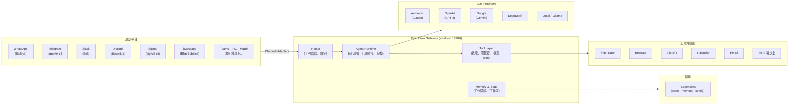
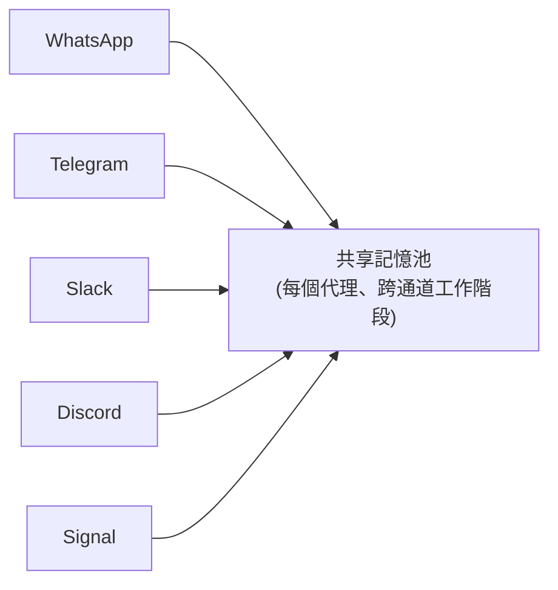
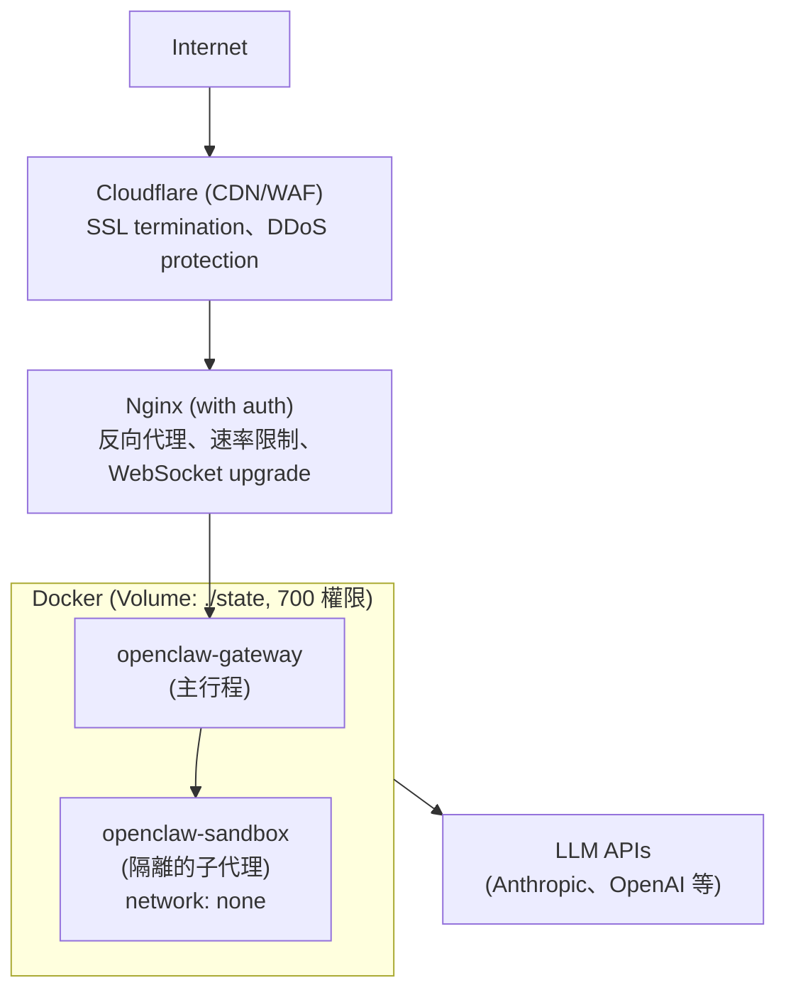
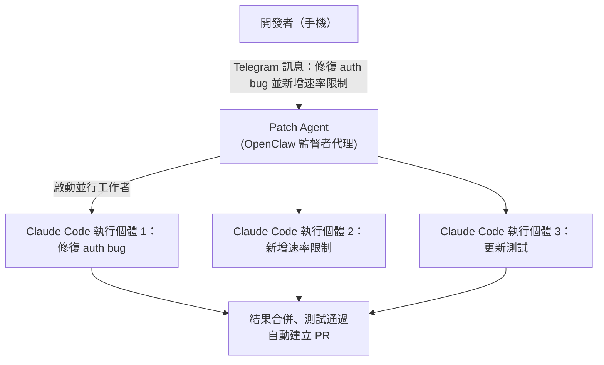
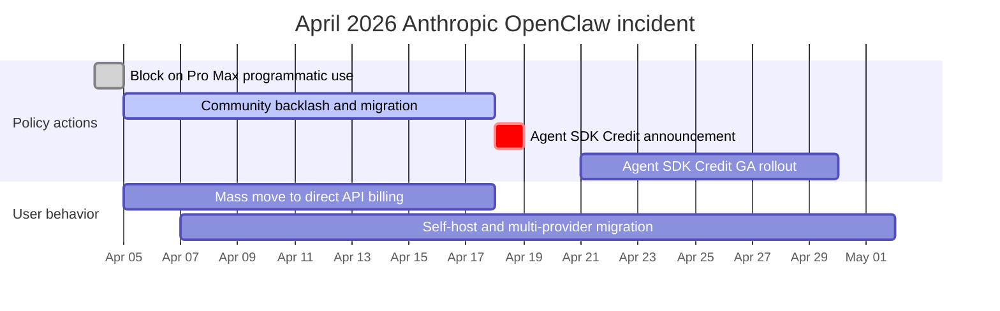
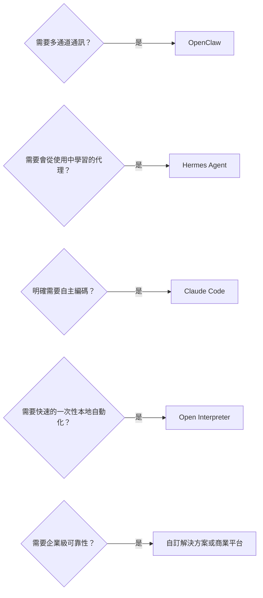
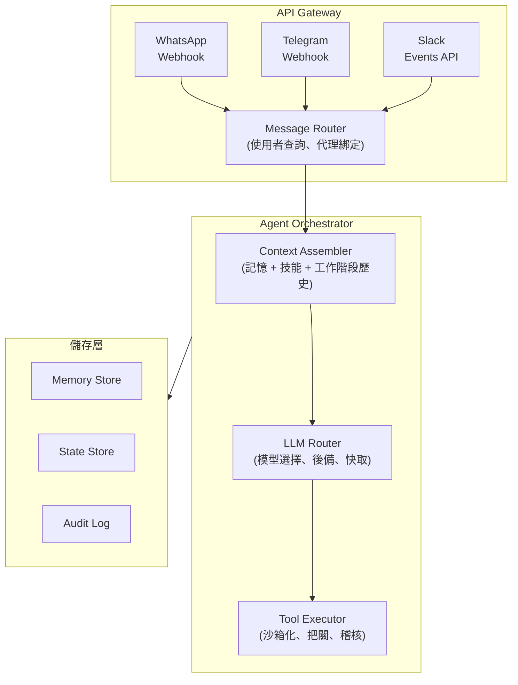

# OpenClaw 深入解析：開源個人 AI 代理

OpenClaw 是一套**開源、自架的個人 AI 代理**，透過 LLM 並以通訊平台作為主要介面來執行任務。你可以透過 WhatsApp、Telegram、Slack、Discord 或 Signal 跟它對話，它也會回覆你，過程中會執行 shell 指令、控制你的瀏覽器、管理行事曆、處理電子郵件，並編排多步驟工作流程。

## 目錄

- [什麼是 OpenClaw](#what-is-openclaw)
- [歷史：從 Clawdbot 到 Moltbot 再到 OpenClaw](#history)
- [架構深入解析](#architecture)
- [AgentSkills 系統](#agentskills)
- [LLM 供應商設定](#llm-providers)
- [通訊平台整合](#messaging-integrations)
- [安全模型](#security-model)
- [部署模式](#deployment-patterns)
- [效能最佳化與擴展](#performance)
- [真實世界使用案例](#use-cases)
- [限制以及何時「不該」使用 OpenClaw](#limitations)
- [與替代方案的比較](#comparison)
- [開始上手：快速設定指南](#getting-started)
- [系統設計面試切入角度](#system-design-interview)
- [參考資料](#references)

---

## 什麼是 OpenClaw

OpenClaw 是：

- **一個個人 AI 代理**：不是聊天機器人，而是代你行動的自主代理
- **自架**：在你的機器、VPS 或 Raspberry Pi 上運行，由你掌控自己的資料
- **通訊原生**：存在於你早已使用的聊天 App 中（WhatsApp、Telegram、Slack、Discord、Signal、iMessage，以及 20 多種其他平台）
- **與 LLM 無關**：可搭配 Claude、GPT-4、Gemini、DeepSeek 或本地模型使用
- **可用技能擴充**：內建 100 多種預先設定好的技能，並有簡單的格式可撰寫自訂技能
- **開源**：採 MIT 授權，截至 2026 年初已有超過 25 萬 GitHub stars

```
# 最簡單的啟動方式
git clone https://github.com/openclaw/openclaw.git
cd openclaw
docker compose up -d

# 或透過 npm
npm install -g openclaw
openclaw start
```

**與聊天機器人的關鍵差異：**
- ChatGPT/Claude.ai：你打字，它用文字回覆
- OpenClaw：你打字，它會**實際去做事**，執行指令、編輯檔案、寄送電子郵件、控制智慧家庭裝置、管理你的行事曆

---

## 歷史

### 命名時間軸

| 日期 | 名稱 | 事件 |
|------|------|------|
| 2025 年 11 月 | **Clawdbot** | Peter Steinberger 發布第一個原型，約耗時一小時打造完成 |
| 2026 年 1 月 | 2,000 stars | 早期採用者發現了這個專案 |
| 2026 年 1 月 27 日 | **Moltbot** | 因 Anthropic 商標投訴而改名（保留了龍蝦主題） |
| 2026 年 1 月 30 日 | **OpenClaw** | 再度改名，Steinberger 覺得「Moltbot」唸起來很彆扭 |
| 2026 年 2 月 | 145,000+ stars | 爆炸性成長，超越許多既有的開源專案 |
| 2026 年 2 月 14 日 | -- | Steinberger 加入 OpenAI，理由是能取得擴展規模所需的資源 |
| 2026 年 3 月 | 250,000+ stars | 在 GitHub 上超越 React，成為史上成長最快的開源專案之一 |

### 創作者

Peter Steinberger 是一位奧地利軟體工程師，在 2024 年出售公司之前，曾花 13 年打造 PSPDFKit，這是一套全球開發者都在使用的 PDF 工具組。他自稱是「vibe coder」，並有句名言說他發布的程式碼自己根本沒看過，體現了全新的 AI 優先開發哲學：人類提供意圖，AI 提供實作。

### 為什麼會爆紅

OpenClaw 切中了痛點，因為它解決了一個真實的問題：LLM 雖然強大，卻是無狀態的。每一段對話都從零開始。OpenClaw 賦予 LLM **持久性**（跨工作階段的記憶）、**行動力**（能夠行動，而不只是空談）以及**觸及範圍**（與你早已使用的 App 整合）。它既是自架又是開源這一點，意味著任何人都能運行它，而無須把自己的資料託付給第三方服務。

---

## 架構

### 高層次概覽



### 核心元件

**1. Gateway**

Gateway 是一個長期運行的 WebSocket 伺服器（預設：`localhost:18789`），作為工作階段、路由和通道連線的單一事實來源。它負責處理：

- 透過通道介接器（channel adapter）接受來自所有通訊平台的連線
- 將訊息路由到正確的代理
- 工作階段管理與狀態持久化
- 認證與存取控制
- 設定變更的熱重載

**2. 通道介接器（Channel Adapters）**

當訊息從任一平台抵達時，通道介接器會把它正規化為標準的內部格式。每個介接器都包裝了一個特定平台的函式庫：

| 平台 | 介接器函式庫 | 協定 |
|----------|----------------|----------|
| WhatsApp | Baileys | WebSocket（非官方） |
| Telegram | grammY | Bot API |
| Slack | Bolt | Events API |
| Discord | discord.js | Gateway API |
| Signal | signal-cli | D-Bus |
| iMessage | BlueBubbles | REST API |
| IRC | irc-framework | IRC 協定 |
| Matrix | matrix-js-sdk | Matrix 協定 |
| Microsoft Teams | Bot Framework | REST API |

**3. Agent Runtime**

Agent Runtime 就是那個 AI 迴圈。對於每一則進入的訊息，它會：

1. 從工作階段歷史、工作區記憶以及相關技能組裝出上下文
2. 將組裝好的提示送至設定好的 LLM
3. 從模型接收工具呼叫
4. 針對系統能力執行工具呼叫
5. 將結果回傳給模型以進行下一輪迭代
6. 持久化更新後的狀態（記憶、檔案、工作階段歷史）

**4. 多代理路由**

OpenClaw 支援在單一 Gateway 行程內運行多個代理。每個代理都有自己的工作區、agentDir、工作階段以及工具設定。進入的訊息會透過綁定（bindings）被路由到各個代理：

```json
{
  "agents": {
    "list": [
      {
        "name": "work-assistant",
        "agentDir": "./agents/work",
        "channels": ["slack-work"]
      },
      {
        "name": "home-assistant",
        "agentDir": "./agents/home",
        "channels": ["whatsapp-personal", "telegram"]
      },
      {
        "name": "devops-bot",
        "agentDir": "./agents/devops",
        "channels": ["discord-infra"]
      }
    ]
  }
}
```

這意味著你可以在 Slack 上有一個工作助理、在 WhatsApp 上有一個個人助理、在 Discord 上有一個 DevOps 機器人，全部都從單一 Gateway 運行，且具備完全隔離的記憶與權限。

---

## AgentSkills 系統

### 技能如何運作

技能是 OpenClaw 取得基本對話以外能力的機制。每個技能都是一個目錄，內含一個帶有 YAML frontmatter（中繼資料）與 markdown 指示（行為）的 `SKILL.md` 檔案。

```
~/.openclaw/skills/
  weather/
    SKILL.md           # Required: metadata + instructions
    scripts/
      fetch_weather.py # Optional: executable scripts
    references/
      api_docs.md      # Optional: supplementary docs

  email-manager/
    SKILL.md
    scripts/
      process_inbox.py
```

### SKILL.md 格式

```yaml
---
name: weather-lookup
description: >
  Fetch current weather and forecasts for any location.
  Responds to queries about temperature, rain, and conditions.
triggers:
  - weather
  - temperature
  - forecast
  - "is it going to rain"
tools:
  - web_search
  - bash
---

# Weather Lookup Skill

When the user asks about weather:

1. Use the web_search tool to find current conditions
2. Extract temperature, humidity, wind, and forecast
3. Present in a concise, readable format
4. Include both metric and imperial units

## Example Response Format

"Currently 72F (22C) and partly cloudy in San Francisco.
Forecast: Clear skies through Thursday, rain expected Friday."
```

### 技能解析順序

技能可以存在於多個位置。當發生名稱衝突時，最在地的副本勝出：

```
Priority (highest first):
  1. <workspace>/skills/        # Project-specific skills
  2. ~/.openclaw/skills/        # User-global skills
  3. <installed-packages>/      # npm-installed skills
  4. <bundled>/skills/          # Ships with OpenClaw
```

### 選擇性注入

OpenClaw **不會**把每個技能都注入到每個提示中。Runtime 會依據技能描述與觸發關鍵字，只選擇性地注入與當前回合相關的技能。這可避免提示膨脹，並維持模型的高效能。

### 建立自訂技能

```bash
# Create the skill directory
mkdir -p ~/.openclaw/skills/deploy-checker
cd ~/.openclaw/skills/deploy-checker

# Create the SKILL.md
cat > SKILL.md << 'EOF'
---
name: deploy-checker
description: >
  Monitor deployment status across staging and production.
  Checks health endpoints, recent commits, and CI status.
triggers:
  - deploy
  - deployment
  - "is staging up"
  - "prod status"
tools:
  - bash
  - web_search
---

# Deploy Checker

When asked about deployment status:

1. Run `curl -s https://staging.myapp.com/health` to check staging
2. Run `curl -s https://myapp.com/health` to check production
3. Check recent git log: `git log --oneline -5`
4. Report status in a clear format

## Response Format

Staging: [UP/DOWN] - version X.Y.Z - deployed 2h ago
Production: [UP/DOWN] - version X.Y.Z - deployed 1d ago
Last 3 commits: ...
EOF
```

### 社群技能生態系

OpenClaw 的技能生態系成長迅速，由社群維護的合輯涵蓋了數千個技能，橫跨 DevOps、家庭自動化、內容創作、資料分析等類別。然而，這種開放性也帶有風險，務必在安裝前審查第三方技能，因為早期的目錄曾發生過惡意腳本的事件。

---

## LLM 供應商設定

### 設定檔

OpenClaw 從 `~/.openclaw/openclaw.json`（JSON5 格式，允許註解與尾隨逗號）讀取其設定。Gateway 會監看此檔案，並透過熱重載自動套用變更。

```json5
{
  // Model provider configuration
  "models": {
    "providers": {
      "anthropic": {
        "baseUrl": "https://api.anthropic.com",
        "apiKey": "${ANTHROPIC_API_KEY}",  // env var substitution
        "models": {
          "claude-sonnet-4": {
            "maxTokens": 8192
          }
        }
      },
      "openai": {
        "baseUrl": "https://api.openai.com/v1",
        "apiKey": "${OPENAI_API_KEY}",
        "models": {
          "gpt-4o": {
            "maxTokens": 4096
          }
        }
      },
      "custom-deepseek": {
        "api": "openai",  // OpenAI-compatible API
        "baseUrl": "https://api.deepseek.com/v1",
        "apiKey": "${DEEPSEEK_API_KEY}",
        "models": {
          "deepseek-chat": {
            "maxTokens": 4096
          }
        }
      },
      "local-ollama": {
        "api": "openai",
        "baseUrl": "http://localhost:11434/v1",
        "apiKey": "ollama",  // Ollama accepts any key
        "models": {
          "llama3.1:70b": {
            "maxTokens": 2048
          }
        }
      }
    }
  },

  // Default agent model
  "agents": {
    "defaults": {
      "model": "anthropic/claude-sonnet-4"
    }
  }
}
```

### 供應商選擇策略

| 供應商 | 最適合 | 取捨 |
|----------|----------|------------|
| Anthropic (Claude) | 複雜推理、編碼任務、長上下文 | 成本較高，品質最佳 |
| OpenAI (GPT-4o) | 通用用途、快速回應 | 速度與品質取得良好平衡 |
| Google (Gemini) | 預算有限的測試、慷慨的免費額度 | 推理品質較低 |
| DeepSeek | 最便宜的前沿等級選項（V4 Flash 每百萬 token 為 $0.14/$0.28，V4 Pro 在 2026 年 5 月 22 日永久折扣後為 $0.435/$0.87）；1M 上下文；最適合高流量、對快取友善的工作負載 | 可用性不穩定；開放權重也可自架 |
| Local (Ollama) | 隱私關鍵、離線使用 | 需要強大硬體，品質較低 |

### OpenClaw 內部的模型路由

你可以為不同的代理設定不同的模型，以達成成本最佳化：

```json5
{
  "agents": {
    "defaults": {
      "model": "openai/gpt-4o-mini"  // Cheap default
    },
    "list": [
      {
        "name": "coding-agent",
        "model": "anthropic/claude-sonnet-4"  // Premium for code
      },
      {
        "name": "reminder-bot",
        "model": "google/gemini-2.0-flash"  // Cheap for simple tasks
      }
    ]
  }
}
```

---

## 通訊平台整合

OpenClaw 透過其通道介接器架構，支援 20 多種通訊平台：

### 支援的平台

| 平台 | 函式庫 | 狀態 | 備註 |
|----------|---------|--------|-------|
| WhatsApp | Baileys | 穩定 | 非官方 API；需要個人帳號 |
| Telegram | grammY | 穩定 | 官方 Bot API；最可靠的通道 |
| Slack | Bolt | 穩定 | 需要安裝工作區應用程式 |
| Discord | discord.js | 穩定 | 需要 bot token |
| Signal | signal-cli | 穩定 | 需要已連結的裝置 |
| iMessage | BlueBubbles | 穩定 | 僅限 macOS；需要 BlueBubbles 伺服器 |
| Google Chat | Chat API | 穩定 | 需要工作區管理員核准 |
| Microsoft Teams | Bot Framework | Beta | 2026 年第二季完整發布 |
| IRC | irc-framework | 穩定 | 支援經典協定 |
| Matrix | matrix-js-sdk | 穩定 | 聯邦式、對自架友善 |
| Mattermost | API | 穩定 | 自架的 Slack 替代方案 |
| LINE | Messaging API | 穩定 | 在日本／東南亞很受歡迎 |
| Feishu (Lark) | Open API | 穩定 | 在中國很受歡迎 |
| Twitch | TMI.js | 穩定 | 僅限聊天 |
| WeChat | -- | Beta | 需要自訂橋接 |
| Nostr | -- | Beta | 去中心化協定 |
| WebChat | 內建 | 穩定 | 以瀏覽器為基礎的後備方案 |

### 跨通道的統一上下文

一個關鍵的架構決策：Gateway 在所有通道間維護**單一的統一記憶系統**。如果你在 WhatsApp 上告訴代理某件事，當你從 Slack 傳訊時它仍會記得。這意味著無論你用哪個 App 來聯絡它，你的 AI 代理都擁有一致的上下文。



---

## 安全模型

### 安全哲學

OpenClaw 的安全模型假設一種「個人助理」的威脅模型：單一受信任的操作者，可能搭配多個代理。其優先順序為：

1. **身分優先**：誰可以跟機器人對話？
2. **範圍其次**：機器人被允許在哪裡行動？
3. **模型最後**：假設模型可能被操弄，限制其影響範圍（blast radius）

### 權限層級

| 層級 | 問題 | 設定方式 |
|------|------|----------|
| Layer 1：通道認證（Channel Authentication） | 誰可以傳訊給機器人？ | 以 allowlist 逐通道設定。 |
| Layer 2：代理工具允許／拒絕（Agent Tool Allow/Deny） | 這個代理可以使用哪些工具？ | 在 `agents.list[].tools` 中逐代理設定。 |
| Layer 3：沙箱工具政策（Sandbox Tool Policy） | 與代理權限分開。 | 即使代理允許某個工具，沙箱仍可能封鎖它。 |
| Layer 4：提升權限存取（Elevated Access） | 某些工具需要主機層級的存取權。 | 以 `allowFrom` 清單逐通道、逐使用者把關。 |

### 沙箱隔離

對於非主要工作階段（子代理、cron 工作、隔離任務），OpenClaw 支援 Docker 沙箱隔離：

```yaml
# docker-compose.sandbox.yml
services:
  openclaw-sandbox:
    image: openclaw/sandbox:latest
    network_mode: "none"        # No network access
    read_only: true             # Read-only root filesystem
    volumes:
      - ./workspace:/workspace  # Restricted workspace only
    security_opt:
      - no-new-privileges:true
```

在 `network: "none"` 之下，被沙箱化的子代理無法發出對外請求、無法外洩資料，也無法觸及外部服務，即使它正在執行惡意程式碼也一樣。

### 關鍵安全警告

**預設信任 localhost**：在預設情況下，OpenClaw 信任來自 localhost 的連線而不需認證。如果 Gateway 位於一個設定不當的反向代理（reverse proxy）後方，而該代理會把所有請求轉發到 localhost，那麼外部攻擊者就能取得完整存取權。對於遠端部署，務必設定認證。

**技能供應鏈**：社群技能目錄曾發生過惡意套件的事件。務必在安裝前審查第三方技能。釘選（pin）技能版本。對於不受信任的技能，使用沙箱。

### 強化檢查清單

```
[x] Set state directory permissions to 700
[x] Configure channel allowlists (do not leave open)
[x] Enable sandbox for sub-agents and cron jobs
[x] Use environment variables for API keys, never hardcode
[x] Put Gateway behind authenticated reverse proxy for remote access
[x] Review all third-party skills before installation
[x] Set up monitoring for unusual tool invocations
[x] Restrict elevated tool access to specific users
[x] Run Gateway as non-root user
[x] Enable TLS for WebSocket connections
```

---

## 部署模式

### 選項 1：本地開發（最快上手）

```bash
# Clone and run
git clone https://github.com/openclaw/openclaw.git
cd openclaw
cp .env.example .env
# Edit .env: add ANTHROPIC_API_KEY or OPENAI_API_KEY

npm install
npm start
```

**需求**：Node.js 20+、512MB RAM、任何作業系統。

### 選項 2：Docker（建議用於生產環境）

```yaml
# docker-compose.yml
version: "3.8"
services:
  openclaw:
    image: openclaw/openclaw:latest
    container_name: openclaw-gateway
    restart: unless-stopped
    ports:
      - "18789:18789"
    volumes:
      - ./state:/app/state         # Persistent state
      - ./openclaw.json:/app/openclaw.json  # Configuration
    environment:
      - ANTHROPIC_API_KEY=${ANTHROPIC_API_KEY}
      - OPENAI_API_KEY=${OPENAI_API_KEY}
    mem_limit: 2g
    logging:
      driver: json-file
      options:
        max-size: "10m"
        max-file: "3"
```

```bash
docker compose up -d
docker logs -f openclaw-gateway  # Watch logs
```

### 選項 3：雲端 VPS（永遠在線）

OpenClaw 很輕量，任何具備 512MB RAM 和 1 個 CPU 核心的機器都足夠。每月 $4-6 的 VPS 就能運行。

**快速部署選項：**
- **DigitalOcean**：內建安全強化的一鍵應用程式（1-Click App）
- **Railway**：從 GitHub README 一鍵部署按鈕（約 5 分鐘）
- **Contabo**：VPS 方案附贈免費的一鍵 OpenClaw 附加元件
- **AWS Lightsail**：每月 $3.50 的執行個體就能輕鬆運行
- **Raspberry Pi**：在配備 4GB RAM 的 Pi 4 上運行良好

### 生產環境架構



### 用於遠端存取的 Nginx 設定

```nginx
# /etc/nginx/sites-available/openclaw
server {
    listen 443 ssl http2;
    server_name openclaw.yourdomain.com;

    ssl_certificate /etc/letsencrypt/live/openclaw.yourdomain.com/fullchain.pem;
    ssl_certificate_key /etc/letsencrypt/live/openclaw.yourdomain.com/privkey.pem;

    location / {
        proxy_pass http://127.0.0.1:18789;
        proxy_http_version 1.1;
        proxy_set_header Upgrade $http_upgrade;
        proxy_set_header Connection "upgrade";
        proxy_set_header Host $host;
        proxy_set_header X-Real-IP $remote_addr;

        # Basic auth for web interface
        auth_basic "OpenClaw";
        auth_basic_user_file /etc/nginx/.htpasswd;
    }
}
```

---

## 效能最佳化與擴展

### 記憶體指南

| 部署 | 建議 RAM | 理由 |
|------------|----------------|-----------|
| 個人、輕度使用 | 512MB - 1GB | 少量技能、簡短對話 |
| 個人、每日使用 | 4GB | 中等技能數量、瀏覽器自動化 |
| 團隊或高頻率 | 8GB | 多個代理、並行工作階段 |
| 生產環境標準 | 16GB | 完整技能套件、繁重自動化 |

### 上下文視窗管理

LLM 注意力會隨上下文長度呈二次方擴展。當上下文從 50K 增加到 100K token 時，模型的工作量會是四倍。實務上的最佳化：

- **限制上下文視窗**：100K token 對大多數任務來說已足夠
- **開始新對話**：冗長的歷史會累積數百則訊息；定期重新啟動
- **停用未使用的技能**：每個已載入的技能都會占用上下文預算

### 技能最佳化

```
 DO: Enable only skills you actively use
 DO: Write concise SKILL.md descriptions
 DO: Use specific trigger keywords

 DON'T: Enable everything "just in case"
 DON'T: Write verbose skill instructions
 DON'T: Load 50+ skills simultaneously
```

每個啟用的技能都會增加代理在每一回合都必須評估的上下文。如果你過去一週都沒用過某個技能，就把它停用。

### 延遲降低

1. **停用冗長的思考**：`thinkingDefault` 設定控制內部推理。對於即時互動，跳過思維鏈（chain-of-thought）可將處理時間大致砍半
2. **使用更快的模型**：將簡單任務（提醒、查詢）路由到較小的模型
3. **就近部署供應商**：使用靠近你伺服器的 LLM 供應商與區域
4. **以 Docker 監控**：用 `docker stats openclaw-gateway` 取得即時資源用量

---

## 真實世界使用案例

### 1. 開發工作流程編排器

一個名為「Patch」的監督者代理透過 Telegram 協調 5 到 20 個並行的 Claude Code 執行個體。開發者從手機發送高層次指令，監督者便會啟動編碼代理、分派任務、審查輸出、執行測試並合併程式碼。



### 2. 大規模電子郵件分流

一位開發者使用 himalaya CLI 整合，讓 OpenClaw 存取一個有 15,000 則訊息的電子郵件帳號。代理處理了這些積壓的郵件，取消訂閱垃圾郵件、依緊急程度分類，並草擬回覆以供審查。

### 3. 家庭自動化中樞

一個名為「Claudette」的代理透過 Home Assistant 控制整棟房子，使用 ha-mcp 技能來存取所有 Home Assistant 實體。它控制 Philips Hue 燈具、Elgato 裝置，並依據天氣預報調整鍋爐設定，全部都透過 WhatsApp 指令完成。

### 4. 內容生產管線

使用以 Discord 為基礎的並行工作者所構成的多代理內容工作流程：
- 代理 1：研究與大綱
- 代理 2：撰寫草稿
- 代理 3：產生縮圖與社群媒體素材
- 監督者：審查、編輯與發布

### 5. CI/CD 監控

一個永遠在線的代理監看 GitHub Actions、GitLab CI 或 Jenkins，並在建置失敗、測試出錯或部署完成時透過 Telegram 發出警示。它也能自動分流失敗並開立 issue。

### 6. 自動化客戶上線

當有新客戶簽約時，代理會啟動一整套工作流程：建立專案資料夾、寄送歡迎電子郵件、安排啟動會議，並把後續提醒加入任務清單。

---

## 限制以及何時「不該」使用 OpenClaw

### 已知限制

**過度自主**：OpenClaw 的自主性可能變成一種負擔。你叫它做一件事，它卻可能在推理迴圈中徘徊、反覆呼叫工具，或在執行途中重新詮釋你的目標。其結果需要人工審查。

**設定複雜性**：要把 OpenClaw 運行好，涉及管理環境、權限、工具連接器以及執行沙箱。許多使用者回報說，花在設定上的時間比實際使用還多。

**記憶脆弱性**：工作階段內的聊天歷史是暫時的，會在 Gateway 重新啟動時遺失。工作區檔案只會持久化那些被明確儲存的內容。如果一段對話從未存進記憶檔案，事後就沒有任何東西可供取回。

**資源消耗**：在載入許多技能時，容器可能使用 2GB 以上的 RAM。冗長的對話歷史會加劇這個情況。

**非官方 API**：WhatsApp 整合使用 Baileys（非官方）。這可能會在 WhatsApp 更新時失效，並可能違反服務條款。其他非官方介接器也存在類似風險。

### 何時「不該」使用 OpenClaw

| 情境 | 為何不該 | 更好的替代方案 |
|----------|---------|-------------------|
| 多租戶 SaaS | 並非為了敵對性的多使用者隔離而設計 | 具備適當租戶邊界的自訂代理框架 |
| 高風險自動化 | 執行路徑不可預測、難以稽核 | 確定性的工作流程引擎（Temporal、Prefect） |
| 即時系統 | LLM 延遲（每回合 1-5 秒）太慢 | 事件驅動架構 |
| 受監管產業 | 沒有合規認證、稽核軌跡很基本 | 具備 SOC2/HIPAA 的企業 AI 平台 |
| 團隊超過 10 人 | 單一操作者的信任模型無法擴展 | 具備適當 RBAC 的共享代理平台 |
| 模糊的真實世界任務 | 在範圍受到嚴格界定、犯錯成本低廉的環境中最有效 | 人類操作者 |

---

## 2026 年 4 月 Anthropic 封鎖並反轉事件

OpenClaw 仰賴 Claude Pro 與 Claude Max 訂閱來驅動代理工作，這件事在 2026 年 4 月之前一直被視為一種成本控制的特色：使用者可以用自己現有的個人 Claude 方案來運行 OpenClaw，而不必支付 API 費率。2026 年 4 月 4 日，Anthropic 變更了政策。一條新的執法條款禁止第三方代理框架作為 Pro 與 Max 訂閱的程式化中介。數小時內，指向 Pro 與 Max 帳號的 OpenClaw 執行個體開始回傳錯誤。約有 135,000 個活躍的 OpenClaw 部署受到影響，其中相當大一部分使用者轉而採用直接 API 計費，費率比他們先前的實際成本高出 5 倍以上。社群的不滿在 Hacker News 和 X 上延燒了將近兩週。

Anthropic 在 4 月中反轉了該政策，推出一項名為 Agent SDK Credit 的新產品，這是一種計量式的額度，內含於 Pro 與 Max 方案中（Max 的額度更高），明確授權透過 Anthropic Agent SDK 進行程式化的代理使用。與 Agent SDK 整合的框架（包括 OpenClaw）又可以再次驅動個人訂閱，但現在是在一個透明的配額之內，且只能透過 Agent SDK 這條路徑。直接對 Claude.ai 網頁工作階段進行爬取仍然是被禁止的。

### 事件時間軸



### 這在架構上意味著什麼

這起事件並非安全事件。它是一起帶有安全與可靠性後果的產品政策事件。可以得出三個教訓：

**供應商政策是你架構的一部分。** 從可用性的角度來看，供應商「可接受使用政策」執法中的一行字，在功能上等同於一場持續時間視政策維持多久而定的服務中斷。如果你代理平台的經濟模式取決於某個特定供應商方案，那麼該供應商的政策團隊就在你的關鍵路徑上。把他們的服務條款當成一項執行時期的相依項，而非法律文件。

**多供應商抽象是營運衛生，而非最佳化。** 那些同時設定了 Anthropic 與 OpenAI 供應商、並為每個代理訂定模型路由規則的 OpenClaw 使用者，在封鎖期間以降級的品質持續運作。那些在每個代理定義中都把單一供應商寫死的使用者則完全動彈不得。這個抽象層建置成本低廉，而它所涵蓋的失效模式卻是真實存在的。

**自架後備方案對於處理個人資料的代理至關重要。** 有相當一部分的 OpenClaw 部署在那兩週內把預設代理切換到本地的 Ollama 模型（Llama 3.3 70B 是最常見的選擇），接受較低的品質以換取有保障的可用性。這個教訓並不是說本地模型足以與前沿模型匹敵；而是說擁有一條可運作的後備路徑，即使品質降級，也是一個認真部署的一部分。

### 供應商風險檢查清單

- 每一個代理定義都透過供應商抽象層進行路由；沒有任何代理把單一供應商的模型名稱寫死。
- 設定中為每個代理納入一個有文件記載的後備供應商，並備有經過測試的切換腳本。
- 對於處理個人資料或營收關鍵的代理，至少有一條後備路徑使用可自架的模型（Ollama、vLLM，或一個具租戶隔離的雲端供應商）。
- 部署的運行手冊（runbook）把供應商的服務條款與可接受使用政策當成需被監看的文件，並訂閱供應商的安全公告與政策更新郵件清單。
- 代理設定中的成本預算是依據實際的最壞情況（直接 API 費率）來設定，而非樂觀情況。
- 一個每週的金絲雀（canary）測試透過抽象層調用每個供應商，並在 4xx 變化時發出警示，在政策變動衝擊到生產流量之前就先讓它浮現。

**來源：**
- [Axios: Anthropic blocks OpenClaw third-party agents](https://www.axios.com/2026/04/06/anthropic-openclaw-subscription-openai)
- [VentureBeat: OpenClaw reversal with Agent SDK credit](https://venturebeat.com/technology/anthropic-reinstates-openclaw-and-third-party-agent-usage-on-claude-subscriptions-with-a-catch)

---

## 與替代方案的比較

| 功能 | OpenClaw | Hermes Agent | Claude Code | Open Interpreter |
|---------|----------|-------------|-------------|-----------------|
| **主要介面** | 通訊 App | 通訊 App | 終端機/CLI | 終端機/CLI |
| **架構** | Gateway + 通道介接器 | 學習迴圈 + 技能記憶 | 代理式 CLI | 簡單的 REPL |
| **LLM 支援** | 任何（Claude、GPT、Gemini、本地） | 任何 | 僅 Claude | 任何 |
| **通訊平台** | 20+（WhatsApp、Telegram、Slack 等） | 6（Telegram、Discord、Slack、WhatsApp、Signal、email） | 無（僅終端機） | 無（僅終端機） |
| **記憶** | 每位助理跨工作階段 | 多層級（工作階段、持久、技能） | 僅工作階段（以 CLAUDE.md 提供上下文） | 僅工作階段 |
| **技能/外掛** | 內建 100+、社群生態系 | 自我學習的技能系統 | MCP 工具 | 有限的外掛 |
| **自架** | 是（必須） | 是（必須） | 否（由 Anthropic 託管） | 是 |
| **GitHub stars** | 250K+ | 22K+ | N/A（閉源） | 55K+ |
| **最適合** | 多通道個人 AI 助理 | 隨時間學習的個人代理 | 軟體開發 | 快速的本地自動化 |
| **最弱之處** | 可預測性、企業用途 | 平台觸及範圍 | 非編碼任務 | 複雜工作流程 |

### 選擇正確的工具



---

## 開始上手

### 最小設定（5 分鐘）

```bash
# 1. Clone the repository
git clone https://github.com/openclaw/openclaw.git
cd openclaw

# 2. Copy and edit environment file
cp .env.example .env
# Add your LLM API key:
# ANTHROPIC_API_KEY=sk-ant-...
# or OPENAI_API_KEY=sk-...

# 3. Start with Docker
docker compose up -d

# 4. Check logs
docker logs -f openclaw-gateway
```

### 連接你的第一個通道（Telegram）

Telegram 是最容易設定的通道：

```json5
// ~/.openclaw/openclaw.json
{
  "channels": {
    "telegram": {
      "enabled": true,
      "token": "${TELEGRAM_BOT_TOKEN}",  // From @BotFather
      "allowedUsers": ["your_telegram_id"]
    }
  },
  "models": {
    "providers": {
      "anthropic": {
        "apiKey": "${ANTHROPIC_API_KEY}"
      }
    }
  },
  "agents": {
    "defaults": {
      "model": "anthropic/claude-sonnet-4"
    }
  }
}
```

### 安裝你的第一個技能

```bash
# Install a community skill
cd ~/.openclaw/skills
git clone https://github.com/example/weather-skill.git weather

# Or create your own (see AgentSkills section above)
mkdir my-skill && cat > my-skill/SKILL.md << 'EOF'
---
name: my-first-skill
description: A simple greeting skill
---
When the user says hello, respond warmly and offer to help.
EOF
```

### 驗證一切運作正常

```bash
# Check Gateway health
curl http://localhost:18789/health

# Check logs for errors
docker logs openclaw-gateway --tail 50

# Send a test message via Telegram to your bot
# It should respond within 2-5 seconds
```

---

## 系統設計面試切入角度

### 題目：「設計一個像 OpenClaw 的個人 AI 助理平台」

這是一道絕佳的系統設計題，因為它涵蓋了通訊系統、代理編排、安全、多租戶以及即時通訊。

### 需求蒐集

**功能性：**
- 使用者透過通訊平台（WhatsApp、Slack、Telegram）互動
- 代理可以執行任務：執行指令、管理檔案、寄送電子郵件、控制裝置
- 記憶可跨工作階段與通道持久化
- 支援每位使用者擁有多個隔離的代理
- 可擴充的技能/外掛系統

**非功能性：**
- 低延遲（含 LLM 推論在內，回應時間 < 5 秒）
- 可自架（使用者掌控自己的資料）
- 安全（沙箱化執行、權限控制）
- 可靠（永遠在線助理需 24/7 正常運行）

### 高層次設計



### 關鍵設計決策

**1. 為什麼採用單一 Gateway 行程（而非微服務）？**

OpenClaw 以單一行程運行，是因為個人助理的使用情境並不需要水平擴展。一個使用者就對應一個 Gateway。這消除了分散式系統的複雜性（服務發現、服務間認證、最終一致性），並讓部署簡單到連 Raspberry Pi 都能勝任。

**2. 為什麼採用通道介接器，而非統一的通訊 API？**

每個通訊平台都有獨特的限制（訊息大小上限、媒體支援、輸入指示、已讀回條）。為每個平台設置一個輕薄的介接器，可在正規化核心訊息格式的同時，保留平台特有的功能。這就是 Gang of Four 的介接器模式（Adapter Pattern）。

**3. 如何處理工具執行的安全性？**

採用縱深防禦（defense-in-depth）的方法：(a) 代理層級的工具允許清單定義一個代理理論上可以使用哪些工具。(b) 沙箱層級的政策則另外把關哪些工具實際上可以執行。(c) 提升權限的存取需要逐使用者、逐通道的授權。(d) 對子代理採用 Docker 隔離，可確保即使有惡意提示誘騙了模型，其影響範圍也會被遏制。

**4. 如何在不使用向量資料庫的情況下管理記憶？**

OpenClaw 使用一套簡單的、以檔案為基礎的記憶系統（狀態目錄中的 markdown 檔案），而非向量資料庫。對於單一使用者的代理而言，在數百個記憶檔案上進行全文搜尋已經夠快了。這避免了運行與維護向量資料庫的營運負擔。

**5. 如何處理多通道的工作階段連續性？**

所有通道都路由經過同一個 Router，它會把平台特有的使用者 ID 對應到一個統一的內部使用者身分。記憶儲存是以代理（而非通道）為鍵，因此在對話途中從 WhatsApp 切換到 Slack 仍能維持上下文。這在概念上類似於 CRM 如何把電子郵件、電話和聊天連結到單一客戶紀錄。

### 擴展討論

| 規模 | 架構 | 備註 |
|-------|-------------|-------|
| 1 位使用者 | VPS 上的單一行程 | OpenClaw 的預設設計 |
| 10 位使用者 | 多個 Gateway 執行個體，每位使用者一個 | 每位使用者自架自己的 |
| 1,000 位使用者 | 託管的多租戶平台 | 需要完整重新設計：適當隔離、共享基礎設施、計費 |
| 100K+ 位使用者 | 具備代理池的分散式系統 | 需要水平擴展、以佇列為基礎的派發、共享技能登錄 |

從「個人助理」躍升到「多租戶平台」的架構跳躍是相當巨大的。OpenClaw 刻意不跨越這條界線，這既是優勢（簡單性）也是限制（若不經大幅重新架構，便無法擴展成 SaaS 產品）。

### 面試官可能會問的後續問題

**問：你會如何為長期記憶加入向量資料庫？**
加入一條 RAG 管線：當代理儲存一段記憶時，將其嵌入並存進向量資料庫（Qdrant、Weaviate）。在每一回合，取回最相關的前 K 個記憶並注入上下文。這以儲存的複雜性換取更好的長期回想能力，同時又不會讓上下文視窗膨脹。

**問：你會如何讓它變成多租戶？**
在容器層級進行隔離：每個租戶都有自己的 Gateway 容器，搭配獨立的儲存磁碟區、網路命名空間與 API 金鑰設定。使用 Kubernetes 並為每個租戶設置命名空間。在前方加入一個路由層，把租戶網域對應到容器。

**問：你會如何處理速率限制以控制 LLM 成本？**
三個層級：(a) 在 Gateway 進行逐使用者的訊息速率限制，(b) 在編排器中追蹤逐代理的 token 預算，(c) 模型路由把簡單查詢送往較便宜的模型。在使用者接近其預算時發出警示，並允許可設定的每日/每月上限。

---

## 參考資料

- OpenClaw Official Documentation -- https://docs.openclaw.ai
- OpenClaw GitHub Repository -- https://github.com/openclaw/openclaw
- OpenClaw Wikipedia -- https://en.wikipedia.org/wiki/OpenClaw
- OpenClaw Skills Documentation -- https://docs.openclaw.ai/tools/skills
- OpenClaw Security Architecture -- https://docs.openclaw.ai/gateway/security
- OpenClaw Configuration Reference -- https://docs.openclaw.ai/gateway/configuration
- OpenClaw Multi-Agent Routing -- https://docs.openclaw.ai/concepts/multi-agent
- Milvus Blog: Complete Guide to OpenClaw -- https://milvus.io/blog/openclaw-formerly-clawdbot-moltbot-explained-a-complete-guide-to-the-autonomous-ai-agent.md
- DigitalOcean: What is OpenClaw -- https://www.digitalocean.com/resources/articles/what-is-openclaw
- awesome-openclaw-agents (Community Skills) -- https://github.com/mergisi/awesome-openclaw-agents

---

*下一步：請參閱 [Claude Code 深入解析](../09-frameworks-and-tools/09-claude-code.md)，以與 Anthropic 那套聚焦於編碼的代理方法做比較。*
