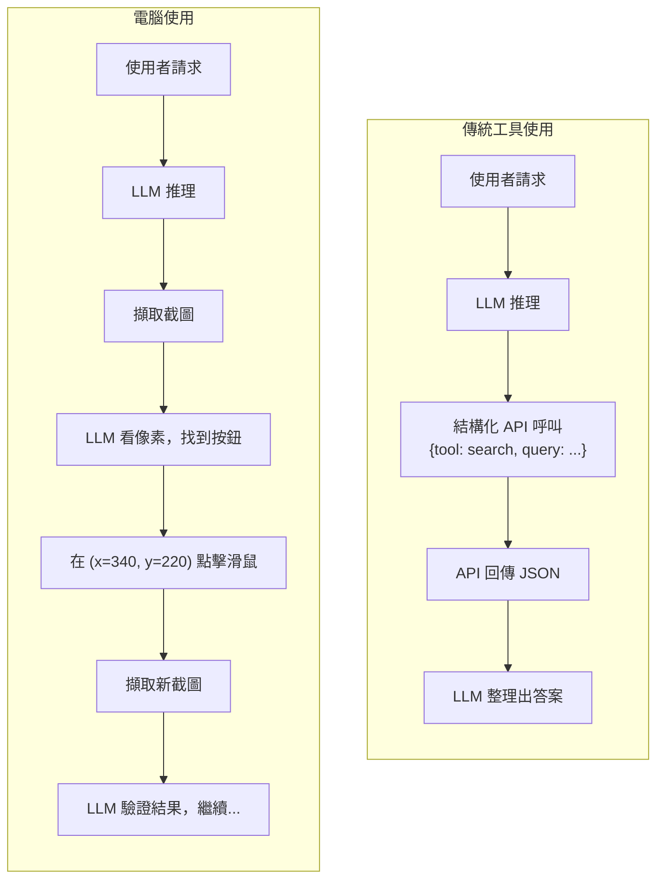
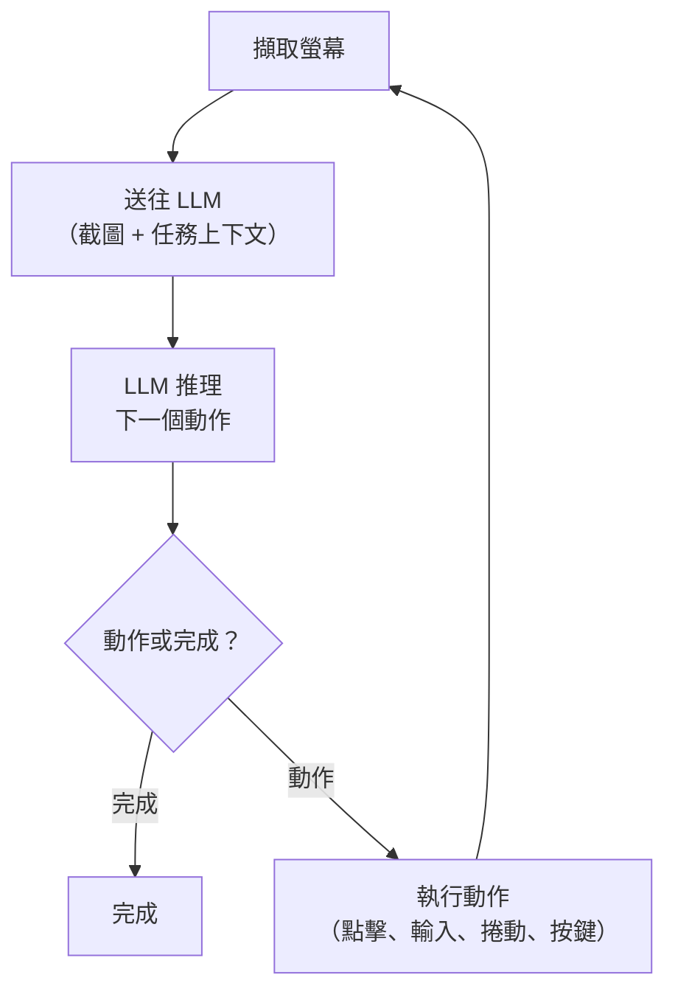
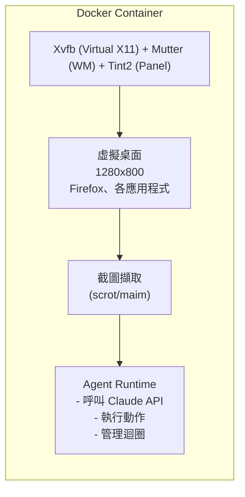

# 電腦使用代理（Computer-Use Agents）

電腦使用代理讓 LLM 能看見螢幕、對畫面進行推理，並透過滑鼠點擊與鍵盤輸入來操作，就跟人類操作電腦的方式一樣。模型不是去呼叫結構化的 API，而是直接處理原始像素。本章涵蓋它們的運作方式、何時會勝過傳統自動化，以及如何圍繞它們設計生產環境系統。

## 目錄

- [什麼是電腦使用代理？](#what-are-computer-use-agents)
- [截圖、推理、執行的迴圈](#the-screenshot-reason-act-loop)
- [Claude Computer Use：工具與 API](#claude-computer-use-tools-and-api)
- [架構：沙箱化環境](#architecture-sandboxed-environments)
- [瀏覽器自動化 vs 桌面自動化](#browser-vs-desktop-automation)
- [與傳統自動化的比較](#comparison-with-traditional-automation)
- [何時電腦使用會勝過 API 呼叫](#when-computer-use-beats-api-calls)
- [錯誤處理與復原](#error-handling-and-recovery)
- [效能：延遲、成本、吞吐量](#performance-latency-cost-throughput)
- [真實世界應用](#real-world-applications)
- [安全性考量](#security-considerations)
- [程式碼範例](#code-examples)
- [面試問題](#interview-questions)
- [參考資料](#references)

---

## 什麼是電腦使用代理？

電腦使用代理是一種 LLM，它透過解讀截圖並發出低階輸入指令（滑鼠移動、點擊、鍵盤輸入）來控制圖形介面。它取代了人機互動迴圈中的人類角色。



關鍵差異在於：傳統工具使用需要預先定義、具有已知結構描述（schema）的 API。電腦使用則適用於任何具有視覺介面的應用程式，不需要 API。

### 全貌（2026）

現在有多家供應商提供電腦使用能力：

| 供應商 | 代理 | 做法 | 主要強項 |
|----------|-------|----------|--------------|
| Anthropic | Claude Computer Use | 視覺 + 座標推理 | 桌面 + 瀏覽器，成熟的 API |
| OpenAI | ChatGPT Agent Mode | 基於 Operator 的瀏覽器代理 | 深度網頁導覽 |
| Google | Project Mariner | Gemini 視覺語言模型 | Chrome 整合 |
| Microsoft | UFO/UFO2 | Windows UI Automation + 視覺 | 原生 Windows 支援 |
| Amazon | Nova Act | 專為瀏覽器打造的模型 | 電子商務工作流程 |

---

## 截圖、推理、執行的迴圈

每個電腦使用代理都遵循相同的核心迴圈，通常稱為「代理迴圈（agent loop）」或「動作迴圈（action loop）」：



每一次迭代：
1. **截取（Capture）**：擷取目前顯示狀態的截圖。
2. **送出（Send）**：把截圖（base64 影像）連同對話歷史一起傳給 LLM。
3. **推理（Reason）**：模型分析螢幕上有什麼，判斷朝目標前進的下一步。
4. **執行（Act）**：模型輸出一個工具呼叫（例如 `click at (450, 320)`），由執行環境（runtime）執行。
5. **重複（Repeat）**：擷取新的截圖，迴圈持續進行，直到模型發出完成的訊號。

模型透過對話歷史在各次迭代之間維持上下文，對話歷史會累積截圖與動作，就像一份記錄已發生事情的視覺「記憶」。

---

## Claude Computer Use：工具與 API

Claude 為電腦使用提供三個內建工具。這些是 Anthropic 定義的工具，你不需要撰寫實作，Claude 知道如何產生對這些工具的呼叫，而你的執行環境會在環境中執行它們。

### 三個工具

**1. `computer` -- 完整 GUI 控制**

在虛擬顯示器上控制滑鼠與鍵盤。功能：
- `screenshot` -- 擷取目前的螢幕狀態
- `left_click`、`right_click`、`double_click`、`triple_click` -- 在座標處進行滑鼠點擊
- `left_click_drag` -- 從一點拖曳到另一點
- `type` -- 輸入一段文字字串
- `key` -- 按下鍵盤按鍵（例如 `ctrl+c`、`Return`、`Escape`）
- `scroll` -- 在某座標處向上/下/左/右捲動
- `move` -- 將游標移動到座標處
- `hold_key` -- 在執行另一個動作時按住某個修飾鍵
- `wait` -- 暫停指定的時間

**2. `bash` -- Shell 指令執行**

在一個持續存在的工作階段中執行 shell 指令：
- 各指令共享狀態（環境變數、工作目錄）
- 支援多行腳本
- 輸出會被擷取並以文字形式回傳

**3. `text_editor` -- 檔案操作**

具備下列指令的結構化檔案編輯：
- `view` -- 讀取檔案內容（可選擇行範圍）
- `create` -- 建立一個含內容的新檔案
- `str_replace` -- 替換檔案中某個特定字串（必須是唯一相符）
- `insert` -- 在指定行號處插入文字

### API 請求結構

```python
import anthropic

client = anthropic.Anthropic()

response = client.messages.create(
    model="claude-sonnet-4-20250514",
    max_tokens=4096,
    tools=[
        {
            "type": "computer_20250124",
            "name": "computer",
            "display_width_px": 1280,
            "display_height_px": 800,
            "display_number": 1
        },
        {
            "type": "bash_20250124",
            "name": "bash"
        },
        {
            "type": "text_editor_20250124",
            "name": "str_replace_based_edit_tool"
        }
    ],
    messages=[
        {
            "role": "user",
            "content": "Open Firefox, navigate to github.com, and find repos trending today."
        }
    ],
    betas=["computer-use-2025-01-24"]
)
```

回應會包含 `tool_use` 區塊，你的執行環境必須執行它們，並以 `tool_result` 訊息回饋。

---

## 架構：沙箱化環境

電腦使用代理必須在隔離的環境中執行。模型擁有滑鼠與鍵盤的完整控制權，你絕對不會想讓它在你的生產環境工作站上動作。

### 標準架構：Docker + VNC



### 雲端託管的替代方案

像 E2B（e2b.dev）這類服務提供預先設定好的沙箱化環境：
- 預先安裝瀏覽器與工具的臨時性（ephemeral）VM
- 用於截圖擷取與輸入注入的 API
- 工作階段結束後自動清理
- 沒有 Docker 管理的額外負擔

### 環境的關鍵元件

| 元件 | 用途 | 範例 |
|-----------|---------|---------|
| Xvfb | 虛擬 X11 顯示伺服器 | 在沒有實體顯示器的情況下建立 framebuffer |
| Mutter/Xfwm | 視窗管理員 | 處理視窗定位、調整大小 |
| Tint2 | 工作列面板 | 顯示執行中的應用程式 |
| xdotool | 輸入注入 | 執行滑鼠/鍵盤指令 |
| scrot/maim | 截圖擷取 | 將顯示畫面拍成 PNG 快照 |

---

## 瀏覽器自動化 vs 桌面自動化

| 面向 | 僅限瀏覽器 | 完整桌面 |
|-----------|-------------|--------------|
| 範圍 | 僅限網頁應用 | 任何 GUI 應用程式 |
| 設定複雜度 | 較低（無頭瀏覽器） | 較高（完整桌面環境） |
| 效能 | 較快（截圖較小） | 較慢（整個螢幕擷取） |
| 可靠度 | 較高（版面可預測） | 較低（OS 差異） |
| 使用情境 | 網頁爬取、表單填寫 | 舊有軟體、跨應用工作流程 |

瀏覽器自動化控制一個網頁瀏覽器（導覽、填寫表單、點擊按鈕、處理 SPA）。桌面自動化則控制整個 OS 環境（啟動應用程式、使用原生對話框、與厚客戶端軟體互動、跨多個應用串接操作）。

---

## 與傳統自動化的比較

Selenium、Playwright 與 Puppeteer 透過直接存取 DOM 來自動化瀏覽器。電腦使用代理則處理像素。兩者在生產環境中都有其用武之地。

| 特性 | Selenium/Playwright | 電腦使用代理 |
|---------|--------------------|--------------------|
| 速度 | 快（直接操作 DOM） | 慢（截圖 + LLM） |
| 可靠度 | 脆弱（選擇器一變就壞） | 有韌性（視覺辨識） |
| 維護 | 不斷更新選擇器 | 極少（能適應 UI 變化） |
| 反機器人偵測 | 經常被封鎖 | 較難被偵測 |
| 每次動作成本 | 約 $0.001 | 約 $0.01-0.05 |
| 非網頁支援 | 否 | 是（任何 GUI） |

**混合做法**在生產環境中效果最好：Playwright 處理高量、定義明確的流程（登入、導覽），而電腦使用代理處理動態、難以預測的步驟（視覺驗證、新穎的版面、反機器人網站）。

---

## 何時電腦使用會勝過 API 呼叫

**在以下情況使用電腦使用：** 沒有 API 存在（舊有系統）、反機器人保護封鎖了 Selenium、需要視覺判斷（圖表驗證、PDF 版面）、UI 變動的速度快過選擇器能維護的速度，或工作流程橫跨多個桌面應用程式。

**在以下情況維持使用 API：** 有結構化 API 可用（永遠優先選它）、延遲很重要（次秒級）、量很大（每小時數千次動作），或需要決定性（相同輸入、相同輸出）。

---

## 錯誤處理與復原

電腦使用代理的失敗方式與基於 API 的工具不同。主要的失敗模式：

### 1. 誤點（座標錯誤）

模型從截圖計算座標，但可能會差幾個像素：
- **緩解措施**：在每次點擊後使用 `screenshot` 驗證預期的狀態變化是否發生。
- **復原方式**：如果點到了錯誤的元素，模型可以對新狀態進行推理並修正方向。

### 2. 過時的截圖

螢幕可能在擷取與動作執行之間發生了變化（動畫、彈出視窗、載入中）：
- **緩解措施**：在截圖前加入短暫等待。在頁面載入時使用 `wait` 動作。
- **復原方式**：在繼續之前重新擷取並重新評估。

### 3. 無限迴圈

模型重複相同的動作卻沒有任何進展：
- **緩解措施**：設定最大迭代次數（例如每個任務 50 次動作）。
- **復原方式**：在 N 次重複的相同動作之後，強制改用不同做法或升級交由人類處理。

### 4. 預期外的對話框

Cookie 橫幅、彈出視窗、權限對話框會在意料之外出現：
- **緩解措施**：在系統提示中加入關於處理常見對話框的指示。
- **復原方式**：模型的視覺推理通常能自然地處理這些情況，它會看到對話框並將其關閉。

### 5. 解析度與縮放不一致

模型是在特定解析度下訓練的。不一致會導致座標錯誤：
- **緩解措施**：使用建議解析度（1280x800），並將顯示縮放設為 100%。
- **復原方式**：調整 `display_width_px` 與 `display_height_px` 以符合實際顯示。

### 錯誤處理模式

代理迴圈應追蹤動作歷史並偵測重複。如果相同動作連續發出 3 次以上，就注入一則訊息告訴模型嘗試不同做法。永遠設定一個硬性的最大迭代次數（例如 50），並在每次動作後擷取一張驗證截圖以偵測狀態變化。完整的代理迴圈請見下方的「程式碼範例」一節。

---

## 效能：延遲、成本、吞吐量

### 延遲拆解

代理迴圈的每一次迭代涉及：

| 步驟 | 時間 | 備註 |
|------|------|-------|
| 截圖擷取 | ~100ms | |
| 影像編碼（base64） | ~50ms | |
| API 呼叫（含影像） | ~2-5s | 模型推論 |
| 動作執行 | ~100ms | |
| **每次動作總計** | **~2.5-5.5s** | |

一個典型的 10 步驟任務需要 25 至 55 秒。相比之下，Playwright 完成相同的 10 個步驟只需不到 2 秒。

### 每次動作成本

每次動作會送出一張截圖（約 800KB base64）加上對話歷史：

| 模型 | 每次動作成本（約略） | 備註 |
|-------|-------------------------|-------|
| Claude Sonnet 4 | $0.01-0.03 | 大多數任務的建議選擇 |
| Claude Opus 4 | $0.05-0.15 | 用於複雜的視覺推理 |

一個 20 步驟的工作流程，用 Sonnet 大約花費 $0.20-0.60，用 Opus 則為 $1.00-3.00。

### 吞吐量最佳化

- **平行工作階段**：執行多個 Docker 容器以處理並行任務。
- **選擇性截圖**：只在不確定的動作之後才擷取；輸入文字之後則略過。
- **降低解析度**：使用 1024x768 而非 1920x1080，以降低 token 成本。
- **提早終止**：教模型在目標一經驗證就立刻發出完成訊號。

---

## 真實世界應用

| 應用 | 運作方式 | 為何使用電腦使用 |
|------------|--------------|------------------|
| 舊有系統整合 | 代理導覽主機/厚客戶端 UI，將資料擷取為結構化格式 | 舊有軟體沒有 API |
| 表單填寫 / 資料登錄 | 讀取來源文件，逐欄填寫網頁表單，處理多頁精靈式流程 | 政府入口網站、含複雜條件邏輯的保險理賠 |
| QA 與視覺測試 | 以使用者身分導覽應用，驗證視覺呈現，以自然語言回報問題 | 超越像素差異比對，能理解版面與 UX |
| 競爭情報 | 導覽產品頁面，從 JS 渲染的小工具中擷取定價資料 | 適用於會封鎖傳統爬蟲的網站 |

---

## 安全性考量

| 風險 | 會發生什麼 | 緩解措施 |
|------|-------------|------------|
| **可見的機密資訊** | 模型在截圖中看到密碼、工作階段、通知 | 臨時性容器，使用後清除憑證 |
| **不受限制的動作** | 代理可以執行 shell 指令、隨意導覽、下載檔案 | 防火牆規則、唯讀檔案系統、工作階段時間限制、對破壞性操作採用 HITL（人在迴圈中） |
| **資料外洩** | 送往 LLM 供應商的截圖含有敏感資料 | 受監管產業採用地端（on-premise）部署，遮蔽敏感的 UI 欄位 |
| **透過 UI 的提示注入** | 惡意網站顯示文字以操縱代理 | 在系統提示中警告，不要遵循螢幕上與任務相牴觸的指示 |

最高準則：**除非是在完全沙箱化的容器中，否則絕不要在你的生產環境工作站上，或讓其能存取真實憑證的情況下執行電腦使用代理**。

---

## 程式碼範例

### 最小化的代理迴圈

```python
import anthropic, base64, subprocess

client = anthropic.Anthropic()

def capture_screenshot():
    subprocess.run(["scrot", "/tmp/screen.png", "-o"], check=True)
    with open("/tmp/screen.png", "rb") as f:
        return base64.standard_b64encode(f.read()).decode()

def execute_action(action):
    name = action["action"]
    if name == "left_click":
        x, y = action["coordinate"]
        subprocess.run(["xdotool", "mousemove", str(x), str(y), "click", "1"])
    elif name == "type":
        subprocess.run(["xdotool", "type", "--", action["text"]])
    elif name == "key":
        subprocess.run(["xdotool", "key", action["text"]])

def run_agent(task: str, max_steps: int = 30):
    messages = [{"role": "user", "content": task}]
    tools = [
        {"type": "computer_20250124", "name": "computer",
         "display_width_px": 1280, "display_height_px": 800},
        {"type": "bash_20250124", "name": "bash"},
        {"type": "text_editor_20250124", "name": "str_replace_based_edit_tool"},
    ]
    for step in range(max_steps):
        response = client.messages.create(
            model="claude-sonnet-4-20250514", max_tokens=4096,
            tools=tools, messages=messages, betas=["computer-use-2025-01-24"],
        )
        if response.stop_reason == "end_turn":
            return [b.text for b in response.content if b.type == "text"]

        tool_results = []
        for block in response.content:
            if block.type != "tool_use":
                continue
            if block.name == "computer":
                execute_action(block.input)
                tool_results.append({
                    "type": "tool_result", "tool_use_id": block.id,
                    "content": [{"type": "image", "source": {
                        "type": "base64", "media_type": "image/png",
                        "data": capture_screenshot()}}],
                })
            elif block.name == "bash":
                r = subprocess.run(block.input["command"],
                    shell=True, capture_output=True, text=True)
                tool_results.append({
                    "type": "tool_result", "tool_use_id": block.id,
                    "content": r.stdout + r.stderr,
                })
        messages.append({"role": "assistant", "content": response.content})
        messages.append({"role": "user", "content": tool_results})
    return ["Max steps reached"]
```

### 沙箱化環境的 Dockerfile

```dockerfile
FROM ubuntu:22.04
RUN apt-get update && apt-get install -y \
    xvfb mutter tint2 xdotool scrot firefox-esr python3 python3-pip \
    && rm -rf /var/lib/apt/lists/*
RUN pip3 install anthropic
ENV DISPLAY=:1
COPY agent.py /agent.py
CMD Xvfb :1 -screen 0 1280x800x24 & sleep 1 && mutter & tint2 & \
    sleep 1 && python3 /agent.py
```

---

## 面試問題

### Q：某客戶每天有 500 份保險理賠 PDF，必須登錄到一個沒有 API 的舊有網頁入口網站。請使用電腦使用代理設計一套系統。

**優秀的回答：**
我會建立一條分為三個階段的管線。第一，一個文件處理階段，使用 LLM 從 PDF 中擷取結構化資料（理賠編號、申請人姓名、金額、日期）。第二，一個電腦使用代理階段，每件理賠都由一個在隔離 Docker 容器中、具有虛擬顯示器的 Claude Computer Use 代理處理。代理會導覽該網頁入口網站，使用擷取出的資料填寫表單欄位，並在提交後擷取一張確認截圖。第三，一個驗證階段，使用另一次獨立的 LLM 呼叫，將確認截圖與預期資料比對，以抓出任何登錄錯誤。

為了擴展規模，我會平行執行 10 至 20 個容器，每個容器依序處理理賠。以代理每件理賠約 2 分鐘計算，20 個容器在 8 小時的工作日內可處理 600 件理賠。我會為重試 3 次後仍失敗的理賠加入一個死信佇列（dead-letter queue），交由人工審查。

以每件理賠 $0.50 計算（約 20 次動作、每次 $0.025），500 件理賠每天為 $250，很可能比它所取代的人工資料登錄團隊更便宜。

### Q：請比較電腦使用代理與 Selenium 在網頁自動化上的差異。你在什麼情況下會選擇各自？

**優秀的回答：**
Selenium 直接與 DOM 互動，它快速、具決定性，且成本低。但它在選擇器變動時就會壞掉、會被反機器人系統封鎖，也無法處理需要視覺判斷的任務。

電腦使用代理每次動作慢上 100 倍、貴上 10 倍，但它們能適應 UI 變化，因為它們處理的是像素而非選擇器。它們在應付反機器人偵測上表現更好，因為它們會產生類似人類的互動模式。而且它們能對視覺版面進行推理，例如驗證圖表是否正確渲染，或從 Selenium 無法檢視的 canvas 元素讀取內容。

對於高量、穩定且目標網站在我掌控之下的工作流程，我會選擇 Selenium。對於一次性任務、經常變動的第三方網站、跨應用的桌面工作流程，以及任何維護選擇器的人力成本超過 LLM 推論成本的任務，我會選擇電腦使用代理。

最好的生產環境系統會同時使用兩者：Playwright 處理可預測的步驟（驗證、導覽），而電腦使用代理處理動態的步驟（解讀結果、做出判斷）。

---

## 參考資料

- Anthropic. "Computer Use Tool" API Documentation (2025)
- Anthropic. "Bash Tool" and "Text Editor Tool" API Documentation (2025)
- E2B. "Sandboxed Cloud Environments for AI Agents" (2025)
- OSWorld Benchmark: Desktop Agent Evaluation Suite (2025)
- WebArena Benchmark: Web Agent Evaluation Suite (2024)

---

*下一篇：[建構工具使用代理](05-building-tool-agents.md)*
