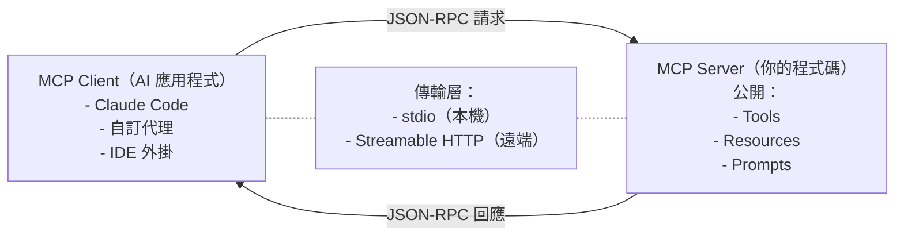
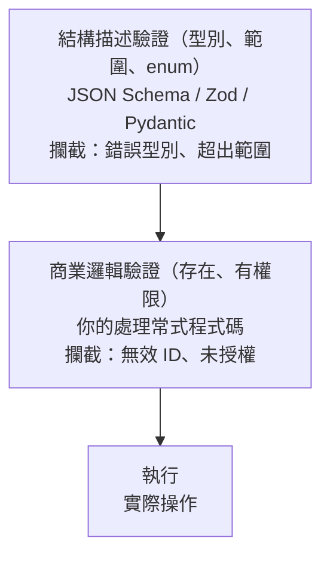
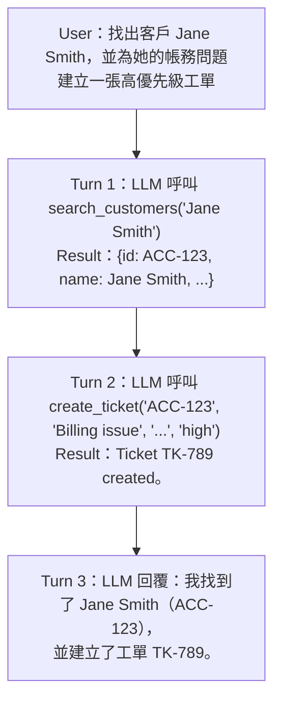
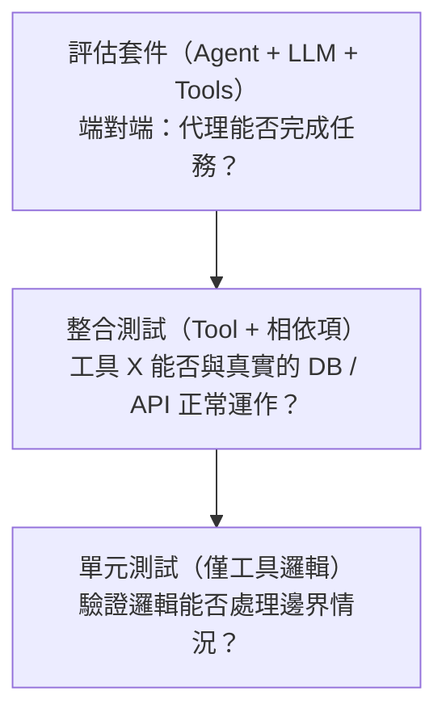
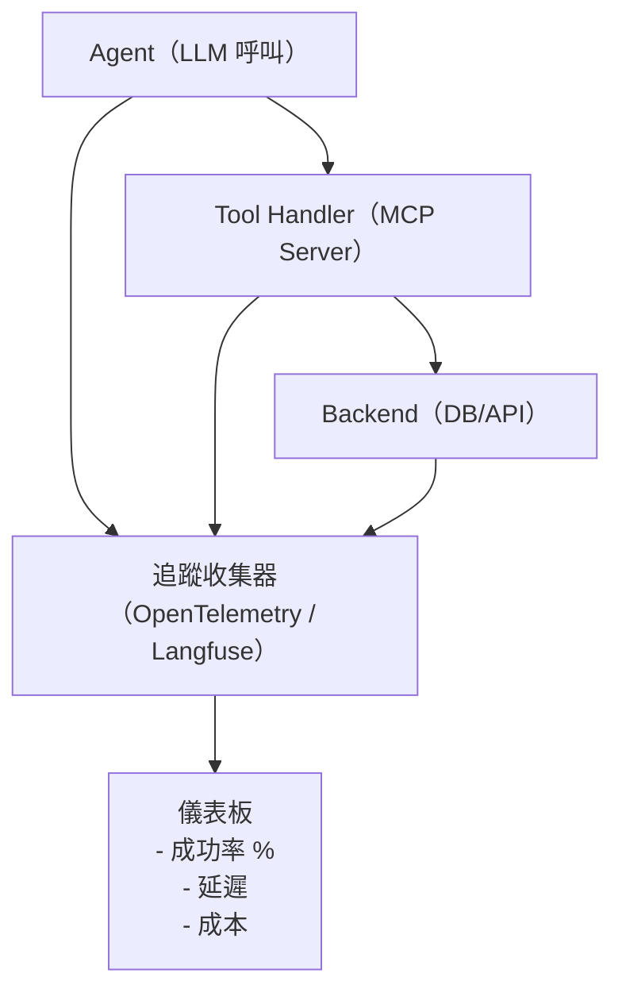

# 打造工具使用代理

本章介紹工具使用代理的實務工程：設計 LLM 能可靠呼叫的工具結構描述、打造用來託管這些工具的 MCP 伺服器、把工具組合成工作流程，以及測試整個系統。這些模式正是區分一個展示品與一套生產環境部署的關鍵。

## 目錄

- [為 LLM 設計工具結構描述](#designing-tool-schemas-for-llms)
- [建立 MCP 伺服器](#mcp-server-creation)
- [工具註冊與探索](#tool-registration-and-discovery)
- [輸入驗證與輸出格式化](#input-validation-and-output-formatting)
- [工具組合：串接工具](#tool-composition-chaining-tools)
- [打造自訂代理技能](#building-custom-agent-skills)
- [建立函式呼叫端點](#creating-function-calling-endpoints)
- [測試工具使用代理](#testing-tool-use-agents)
- [工具使用的可觀測性](#observability-for-tool-use)
- [常見錯誤與反模式](#common-mistakes-and-anti-patterns)
- [工具版本控管與向後相容性](#tool-versioning-and-backwards-compatibility)
- [面試問題](#interview-questions)
- [參考資料](#references)

---

## 為 LLM 設計工具結構描述

工具結構描述是 LLM 與你系統之間的契約。一個設計良好的結構描述能減少幻覺出來的引數、防止誤用，並讓模型的工具選擇更加可靠。

### 良好工具定義的剖析

```json
{
  "name": "search_customers",
  "description": "Search for customers by name, email, or account ID. Returns up to 10 matching customer records. Use this when the user asks about a specific customer. Do NOT use this for aggregate queries like 'how many customers do we have'.",
  "input_schema": {
    "type": "object",
    "properties": {
      "query": {
        "type": "string",
        "description": "Search term: customer name, email address, or account ID (e.g., 'john@acme.com' or 'ACC-12345')"
      },
      "limit": {
        "type": "integer",
        "description": "Max results to return (1-10). Default: 5",
        "default": 5,
        "minimum": 1,
        "maximum": 10
      }
    },
    "required": ["query"]
  }
}
```

### 結構描述設計守則

**1. 命名要精確**：使用 `verb_noun`（動詞_名詞）格式。用 `search_customers`，而不是 `search` 或 `customer_tool`。

**2. 描述「何時不該」使用**：模型需要負面範例。「Do NOT use for aggregate queries」（不要用於聚合查詢）比起只列出有效用途，更能有效防止誤用。

**3. 提供引數範例**：在描述字串中納入範例值。模型會用這些值來校準自己的輸出。

**4. 限制範圍**：使用 `minimum`、`maximum`、`enum` 與 `pattern`，在結構描述層級就阻擋無效引數，而不是在你的處理常式中才處理。

**5. 讓工具保持原子化**：一個工具只做一件事。避免一個 `manage_customer` 工具同時負責建立、讀取、更新與刪除，應拆成四個工具。

**6. 使用 `strict: true`**：Anthropic 的嚴格模式保證模型輸出與結構描述完全相符。在生產環境中務必啟用。

| 良好工具設計（原子化工具） | 不良工具設計（萬能工具） |
|---------------------------------|----------------------------|
| `search_customers`：query (string)、limit (int 1-10) | `customer_tool`：action (string)、data (object)、options (any) |
| `create_customer`：name (string)、email (string) | `action` 可以是 "search"、"create"、"update"、"delete" |
| `update_customer`：id (string)、fields (object) | 結果：模型混淆、結構描述太鬆散、難以驗證 |

---

## 建立 MCP 伺服器

MCP 伺服器是一個獨立的行程，向任何相容 MCP 的客戶端（Claude、GPT、以 Llama 為基礎的代理）公開工具、資源與提示。你只要撰寫一次伺服器，任何 LLM 都能使用它。

### MCP 架構



### TypeScript MCP 伺服器

```typescript
import { McpServer } from "@modelcontextprotocol/sdk/server/mcp.js";
import { StdioServerTransport } from "@modelcontextprotocol/sdk/server/stdio.js";
import { z } from "zod";

const server = new McpServer({ name: "customer-service", version: "1.0.0" });

server.tool(
  "search_customers",
  "Search customers by name, email, or ID. Returns up to 10 matches.",
  {
    query: z.string().describe("Search term: name, email, or account ID"),
    limit: z.number().min(1).max(10).default(5).describe("Max results"),
  },
  async ({ query, limit }) => ({
    content: [{ type: "text",
      text: JSON.stringify(await db.customers.search(query, limit), null, 2) }],
  })
);

const transport = new StdioServerTransport();
await server.connect(transport);
```

### Python MCP 伺服器（FastMCP）

```python
from mcp.server.fastmcp import FastMCP

mcp = FastMCP("customer-service")

@mcp.tool()
async def search_customers(query: str, limit: int = 5) -> str:
    """Search customers by name, email, or ID. Returns up to 10 matches.
    Args:
        query: Search term - customer name, email, or account ID
        limit: Max results to return (1-10, default 5)
    """
    return json.dumps(await db.customers.search(query, limit), indent=2)
```

兩種 SDK 都遵循同一套模式：建立伺服器、以型別化的結構描述註冊工具、連接傳輸層。TypeScript SDK 使用 Zod 進行驗證；Python 則使用型別提示與 docstring。

### 部署模式

| 模式 | 傳輸層 | 使用情境 |
|------|-----------|----------|
| 本機（stdio） | stdin/stdout 管道 | 桌面工具、IDE 外掛 |
| 遠端（Streamable HTTP） | HTTP + SSE | 雲端服務、共享伺服器 |
| 混合 | 兩者皆有 | 本機開發，遠端部署 |

---

## 工具註冊與探索

在生產環境中，代理需要動態探索可用的工具，而不是把它們寫死。

### 靜態註冊

在組態檔（例如 `claude_desktop_config.json`）中宣告 MCP 伺服器。每一筆項目把伺服器名稱對應到一個指令、引數，以及可選的環境變數。做法簡單但缺乏彈性，不論是否相關，每個伺服器都會在啟動時載入。

### 動態探索（工具搜尋）

Anthropic 的工具搜尋（Tool Search，2025）解決了結構描述過載的問題。代理不再把 200 個工具結構描述載入上下文（這會降低推理能力），而是送出一個輕量的搜尋查詢，只取回 3 到 5 個相關的工具結構描述。這讓上下文視窗能聚焦在推理上，而不是解析用不到的結構描述。

### MCP 探索協定

MCP 客戶端透過標準的 JSON-RPC 方法探索能力：`tools/list` 回傳可用的工具、`resources/list` 回傳資料資源、`prompts/list` 回傳提示範本。這讓執行期探索得以實現，而不必寫死。

---

## 輸入驗證與輸出格式化

### 輸入驗證層



務必在兩個層級都進行驗證。結構描述驗證會攔截格式錯誤的輸入。商業邏輯驗證則會攔截語意上無效的輸入。

```python
@mcp.tool()
async def transfer_funds(
    from_account: str,
    to_account: str,
    amount: float
) -> str:
    """Transfer funds between accounts."""
    # Schema already enforced types via type hints

    # Business validation
    if amount <= 0:
        return "Error: Amount must be positive."
    if amount > 10000:
        return "Error: Transfers over $10,000 require manual approval."
    if from_account == to_account:
        return "Error: Cannot transfer to the same account."

    from_acct = await db.accounts.get(from_account)
    if not from_acct:
        return f"Error: Account {from_account} not found."

    # Execute
    result = await db.transfers.execute(from_account, to_account, amount)
    return f"Transferred ${amount:.2f}. Confirmation: {result.id}"
```

### 輸出格式化

當模型需要對結果進行推理時，回傳結構化資料。當結果已是最終答案時，回傳人類可讀的文字。

```python
# Good: structured for further reasoning
return json.dumps({
    "customers": [
        {"id": "ACC-123", "name": "Jane Smith", "email": "jane@acme.com"},
        {"id": "ACC-456", "name": "John Doe", "email": "john@acme.com"}
    ],
    "total_matches": 2,
    "has_more": False
})

# Bad: unstructured blob
return "Found Jane Smith (ACC-123, jane@acme.com) and John Doe (ACC-456, john@acme.com)"
```

---

## 工具組合：串接工具

真實任務需要依序呼叫多個工具。組合方式有兩種模式：

### 模式 1：LLM 編排式串接

LLM 根據先前的結果，決定接下來要呼叫哪個工具：



每一次工具呼叫都是一趟獨立的 API 來回。模型會在各次呼叫之間對結果進行推理。

### 模式 2：程式化工具呼叫

Anthropic 的程式化工具呼叫（programmatic tool calling，2025）讓模型撰寫程式碼來串接工具，而不需要來回往返：

```
LLM generates code:
  customer = search_customers("Jane Smith")
  if customer.results:
    ticket = create_ticket(customer.results[0].id, ...)
    return f"Created {ticket.id} for {customer.results[0].name}"
  else:
    return "Customer not found"
```

這會以單一一次 API 呼叫執行，把延遲從 3 趟來回降為 1 趟。

### 模式 3：伺服器端組合

在 MCP 伺服器內部組合工具，由單一一個 `resolve_customer_issue` 工具在內部呼叫 search 與 create_ticket，把多步驟邏輯對 LLM 隱藏起來。當工作流程固定且定義明確、LLM 不需要在各步驟之間進行推理時，就採用這種做法。

### 各模式的適用時機

| 模式 | 延遲 | 彈性 | 最適合 |
|---------|---------|-------------|----------|
| LLM 編排式 | 高（N 趟來回） | 非常高 | 複雜、有分支的邏輯 |
| 程式化 | 低（1 趟來回） | 高 | 線性串接、批次 |
| 伺服器端 | 最低 | 低 | 固定、常見的工作流程 |

---

## 打造自訂代理技能

代理技能（Agent Skills，Anthropic，2025）是代理動態載入的一組打包好的指示、工具與資源。一個技能就是一個資料夾：

```
my-skill/
  SKILL.md          # Instructions the agent loads into system prompt
  tools/            # MCP tool implementations
  resources/        # Data files, templates, schemas
  tests/            # Evaluation cases
```

在執行期，SkillManager 會註冊可用的技能，並按需啟用它們，把該技能的指示注入系統提示，並把它的工具加入可用的工具集。這讓基礎代理保持輕量，同時又能進行深度的專業化。

---

## 建立函式呼叫端點

若要讓你的 API 可被任何 LLM 呼叫，可透過搭配 Pydantic 模型的 FastAPI 將其公開。自動產生的 OpenAPI 規格（`/openapi.json`）同時也能當作函式呼叫的工具結構描述使用。或者，你也可以把同一套邏輯包進一個 MCP 伺服器，以便與 Claude、GPT 或其他相容 MCP 的客戶端直接整合。

---

## 測試工具使用代理

### 三個測試層級



### 工具的單元測試

在隔離的環境中，以模擬的相依項測試每一個工具處理常式。涵蓋範圍包括：輸入驗證的邊界情況（超出範圍的值、缺漏的欄位）、錯誤訊息的品質（它是否引導模型復原？），以及輸出格式（有效的 JSON、正確的結構描述）。

### 代理行為的評估套件

建立一個包含 100 筆以上真實查詢、並附帶預期結果的資料集：

```python
eval_cases = [
    {
        "input": "Find Jane Smith's account and check her last payment",
        "expected_tools": ["search_customers", "get_payment_history"],
        "max_tool_calls": 5,
    },
    {
        "input": "What is the meaning of life?",
        "expected_tools": [],  # Should NOT call any tools
        "max_tool_calls": 0,
    },
]
```

針對每一個案例，衡量：工具選擇準確度（選對工具了嗎？）、引數品質（引數正確嗎？）、任務完成率，以及效率（工具呼叫次數）。在每一次模型版本變更與每一次工具結構描述變更時，都執行評估。

---

## 工具使用的可觀測性

每一次工具呼叫都應記錄：追蹤／span ID、時間戳記、工具名稱、輸入引數、輸出大小、延遲、狀態、所使用的模型、token 用量，以及工作階段 ID。

### 關鍵指標

| 指標 | 衡量什麼 | 警示門檻 |
|--------|-----------------|-----------------|
| 工具呼叫成功率 | 回傳有效結果的呼叫百分比 | < 95% |
| 工具選擇準確度 | 是否選對了工具？ | < 90% |
| 每項任務平均工具呼叫次數 | 工具使用的效率 | > 基準值的 2 倍 |
| 每次工具呼叫的延遲 | 工具處理常式的回應時間 | > 5s（p99） |
| 幻覺引數 | 儘管有結構描述仍出現無效引數 | > 2% |
| 每項任務的成本 | LLM 加上工具執行的總成本 | > 預算 |

### 追蹤架構



---

## 常見錯誤與反模式

| 反模式 | 問題 | 修正方式 |
|-------------|---------|-----|
| 工具過載 | 50 個以上的工具會降低選擇準確度 | 動態探索，每回合載入 5 到 10 個 |
| 描述模糊 | 「Handles customer operations」，太過籠統 | 納入何時該用、何時不該用，以及範例 |
| 萬能工具 | 一個帶有 `action` 參數的工具什麼都做 | 拆成原子化工具，每個只負責一項操作 |
| 缺少錯誤情境 | 工具只回傳「Error」卻沒有任何細節 | 提供可據以行動的訊息：「ACC-999 not found. Use search_customers...」 |
| 非結構化輸出 | 工具回傳模型必須自行解析的散文 | 回傳 JSON 以便進行結構化推理 |
| 沒有冪等性 | `create_ticket` 被呼叫兩次就建立了重複資料 | 接受冪等性金鑰，建立前先檢查 |
| 暴露內部 ID | 工具要求模型無從得知的資料庫 UUID | 接受人類可讀的識別碼，於內部解析 |
| 忽視速率限制 | 代理循環呼叫 100 次 API，遭到節流 | 在處理常式中採用退避機制，回傳「retry in X seconds」 |

---

## 工具版本控管與向後相容性

隨著工具演進，你必須維持與依賴這些工具的代理之間的相容性。

**守則：**
1. **增量式變更**（新增可選參數）：不需要提升版本號。舊的呼叫仍然可用。
2. **破壞性變更**（重新命名、移除參數、改變語意）：以新的結構描述建立一個新的工具名稱。讓舊工具繼續運作，並在其描述中加上「DEPRECATED: Use new_tool instead」。記錄每一次對已棄用工具的呼叫以供監控。
3. **永遠不要移除工具**，除非你已確認沒有任何使用中的代理依賴它。

---

## 面試問題

### Q：你需要讓一個 LLM 代理存取 200 個內部工具。你會如何處理結構描述過載？

**有力的回答：**
我不會把全部 200 個工具結構描述都載入上下文。相反地，我會採用兩階段做法。第一，工具探索階段，代理描述它需要做什麼，由一個輕量的搜尋（嵌入相似度或關鍵字比對）回傳最相關的 5 到 10 個工具結構描述。第二，工具執行階段，在實際的 LLM 呼叫中只納入被選中的那些工具到上下文裡。

這呼應了 Anthropic 的工具搜尋模式。探索這一步可以是一次獨立、較便宜的 LLM 呼叫，甚至是一次非 LLM 的搜尋。關鍵的洞見在於：被無關工具結構描述佔用的上下文視窗空間，會直接降低模型的推理品質。我會把工具選擇準確度當作關鍵指標來衡量，如果代理在應該呼叫 `get_customer_by_id` 時卻呼叫了 `search_customers`，那麼探索階段就需要調校。

至於 MCP 的實作，我會把工具依領域分組到不同的伺服器（customer-service、billing、analytics），並只連接到與當前對話相關的那些伺服器。

### Q：為一個處理客戶支援的工具使用代理設計一套測試策略。

**有力的回答：**
我會在三個層級進行測試。第一，為每一個工具處理常式撰寫單元測試：驗證輸入的邊界情況、錯誤訊息與輸出格式。這些測試在每一次提交時於 CI 中以模擬的相依項執行。

第二，撰寫整合測試，驗證工具能對真實的（測試環境）資料庫正常運作。例如，`create_ticket` 確實建立了一筆記錄，而 `search_customers` 能把它取回。這些測試能攔截工具與後端之間的結構描述漂移。

第三，撰寫評估套件來測試完整的代理，也就是 LLM 加上工具。我會建立一個包含 100 筆以上真實客戶查詢的資料集，附帶預期的工具呼叫序列與輸出標準。這套評估衡量工具選擇準確度（它選對工具了嗎？）、引數品質（引數正確嗎？）、任務完成率（它解決問題了嗎？），以及效率（它用了幾次工具呼叫？）。

我會在每一次模型版本變更與每一次工具結構描述變更時執行評估。若一次結構描述變更後工具選擇準確度下降了 2%，代表需要修訂的是描述，而不是模型。

---

## 參考資料

- Anthropic. "Tool Use with Claude" API Documentation (2025)
- Model Context Protocol. "Build an MCP Server" (2025)
- MCP TypeScript SDK: github.com/modelcontextprotocol/typescript-sdk
- MCP Python SDK: github.com/modelcontextprotocol/python-sdk
- Anthropic. "Introducing Advanced Tool Use" (2025)
- Anthropic. "Agent Skills" Beta Documentation (2025)

---

*上一篇：[電腦使用代理](04-computer-use-agents.md)*
