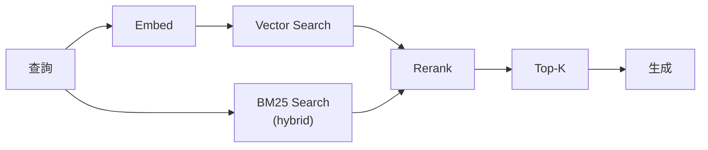
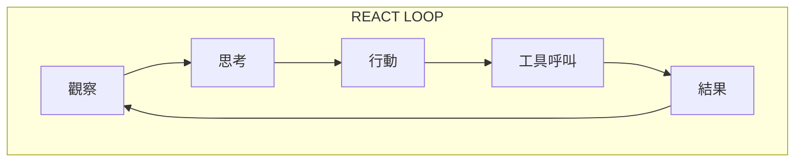
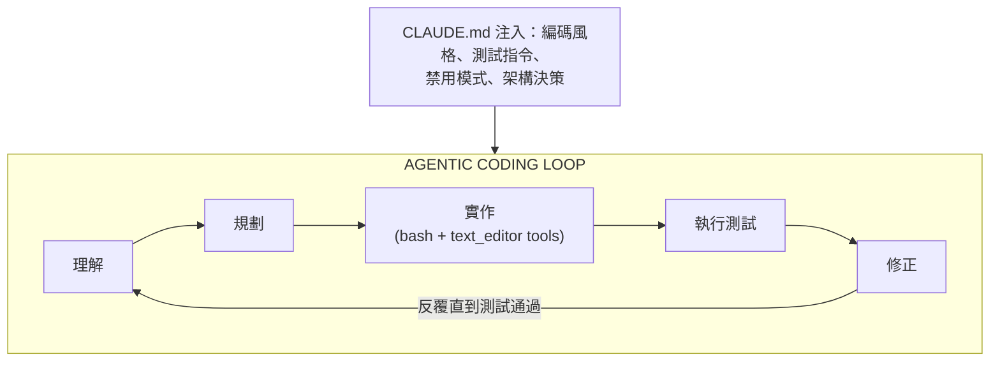
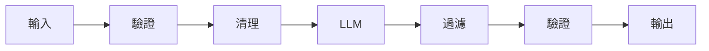
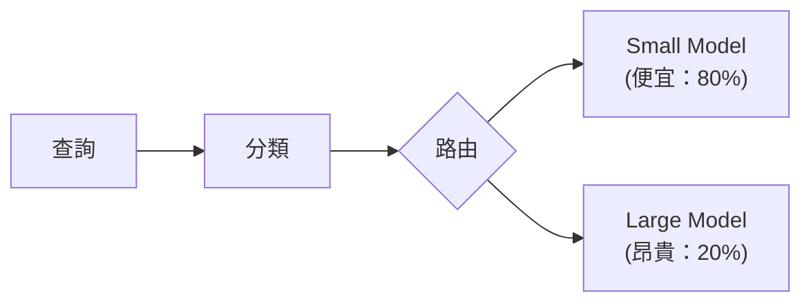

# AI 設計模式快速參考

常見模式的快速查詢。詳細實作請參閱各章節。

---

## 檢索模式

| 模式 | 使用情境 | 關鍵取捨 |
|---------|----------|--------------|
| **Basic RAG** | 針對文件的簡單問答 | 容易實作，準確度有限 |
| **Hybrid Search** | 結合語意搜尋與關鍵字 | 召回率更佳，複雜度更高 |
| **Reranking** | 高精準度檢索 | 準確度對上延遲 |
| **Query Expansion** | 模稜兩可的查詢 | 召回率更佳，token 更多 |
| **HyDE** | 預期沒有直接匹配 | 有創造力，但可能產生幻覺 |
| **Parent-Child Chunking** | 需要周邊上下文 | 記憶體開銷 |



---

## 生成模式

| 模式 | 使用情境 | 關鍵取捨 |
|---------|----------|--------------|
| **Zero-Shot** | 簡單任務 | 快速，可靠度較低 |
| **Few-Shot** | 需要格式控制 | token 成本 |
| **Chain-of-Thought** | 推理任務 | 延遲，呈現推理過程 |
| **Self-Consistency** | 高風險答案 | 3 至 5 倍成本 |
| **Structured Output** | API 回應 | 受限的創造力 |

---

## 代理模式

| 模式 | 使用情境 | 複雜度 |
|---------|----------|------------|
| **ReAct** | 使用工具的代理 | 中 |
| **Plan-and-Execute** | 多步驟任務 | 高 |
| **Multi-Agent Debate** | 驗證 | 高 |
| **Human-in-the-Loop** | 高風險動作 | 中 |
| **Swarm / Handoff** | 專門化的子代理 | 高 |



---

## 代理式編碼模式（2026）

| 模式 | 使用情境 | 關鍵工具 |
|---------|----------|----------|
| **Scaffold → Implement → Verify** | 完整功能開發 | Claude Code / OpenHands |
| **Read-Plan-Edit** | 重構既有程式碼 | Claude Code text_editor |
| **Test-Driven Agent** | 高可靠度程式碼 | 代理先撰寫測試 |
| **Shadow Review** | PR 品質關卡 | 代理在合併前審查差異 |
| **CLAUDE.md Manifest** | 注入專案上下文 | Claude Code CLAUDE.md 檔案 |
| **Sub-Agent Parallelism** | 大型程式碼庫變更 | 每個模組多個代理 |



**何時該用哪個工具：**

| 需求 | 工具 |
|------|------|
| 完整自主 + CLI | Claude Code |
| 開源 + 任意 LLM | OpenHands / Cline |
| 緊密 IDE 整合 | Cursor / Windsurf |
| 可重現的管線 | OpenHands in Docker CI |

---

## 可靠性模式

| 模式 | 解決的問題 | 實作 |
|---------|----------------|----------------|
| **Retry with Backoff** | 短暫性失敗 | 指數退避 |
| **Circuit Breaker** | 連鎖性失敗 | 超過閾值後快速失敗 |
| **Fallback Model** | 主要模型無法使用 | 次要模型 |
| **Timeout** | 回應緩慢 | 取消加上 fallback |
| **Bulkhead** | 資源隔離 | 分離的資源池 |

```python
# Reliability stack
@circuit_breaker(failure_threshold=5)
@retry(max_attempts=3, backoff=exponential)
@timeout(seconds=30)
@fallback(model="gpt-4o-mini")
async def generate(prompt):
    return await primary_model.generate(prompt)
```

---

## 快取模式

| 模式 | 命中率 | 使用情境 |
|---------|----------|----------|
| **Exact Match** | 低 | 完全相同的查詢 |
| **Semantic Cache** | 中 | 相似的查詢 |
| **KV Cache** | 高 | 相同前綴 |
| **Response Cache** | 視情況而定 | 確定性輸出 |

---

## 安全模式

| 模式 | 威脅 | 實作 |
|---------|--------|----------------|
| **Input Validation** | 提示注入 | 清理、偵測 |
| **Output Filtering** | 資料外洩 | PII 偵測、封鎖清單 |
| **Tenant Isolation** | 跨租戶存取 | 在查詢時過濾 |
| **Rate Limiting** | 濫用 | 每使用者/租戶限制 |



---

## 評估模式

| 模式 | 使用情境 | 指標 |
|---------|----------|---------|
| **Golden Set** | 回歸測試 | 通過率 |
| **LLM-as-Judge** | 品質評分 | 1 至 5 分制 |
| **Human Eval** | 真實標準 | 一致率 |
| **A/B Testing** | 生產環境比較 | 使用者指標 |

---

## 成本最佳化模式

| 模式 | 節省 | 取捨 |
|---------|---------|----------|
| **Model Routing** | 50-70% | 複雜度 |
| **Caching** | 20-40% | 資料過時 |
| **Prompt Compression** | 10-30% | 品質風險 |
| **Batch Processing** | 30-50% | 延遲 |



---

## 應避免的反模式

| 反模式 | 問題 | 更好的做法 |
|--------------|---------|-----------------|
| **Context Stuffing** | 浪費 token | 只檢索相關內容 |
| **Retry Forever** | 資源耗盡 | Circuit breaker |
| **Trust All Output** | 幻覺 | 驗證、接地 |
| **Single Model** | 單點故障 | 多供應商 |
| **No Observability** | 盲目除錯 | 追蹤所有環節 |
| **Infinite Agentic Loop** | 代理空轉而無進展 | 最大回合數加上 Critic 代理 |
| **Over-trusting Computer-Use** | 代理點到錯誤的 UI 元素 | 截圖驗證加上 HITL |
| **No CLAUDE.md / Manifest** | 代理缺乏專案上下文 | 一律提供編碼 manifest |
| **Thinking Mode Always On** | 3 至 10 倍成本卻無好處 | 以複雜度分類器把關 |

---

## 模式選擇指南

**正要開始一個新專案？**
1. 從 Basic RAG 開始
2. 當精準度重要時加入 reranking
3. 針對關鍵字密集的內容加入 hybrid search

**需要可靠性？**
1. 從 retry 加上 timeout 開始
2. 為外部呼叫加入 circuit breaker
3. 為關鍵路徑加入 fallback 模型

**有成本考量？**
1. 先實作 semantic caching
2. 針對查詢複雜度加入 model routing
3. 在延遲允許的情況下進行批次處理

---

*詳細實作請參閱 [15-ai-design-patterns/](15-ai-design-patterns/)*
