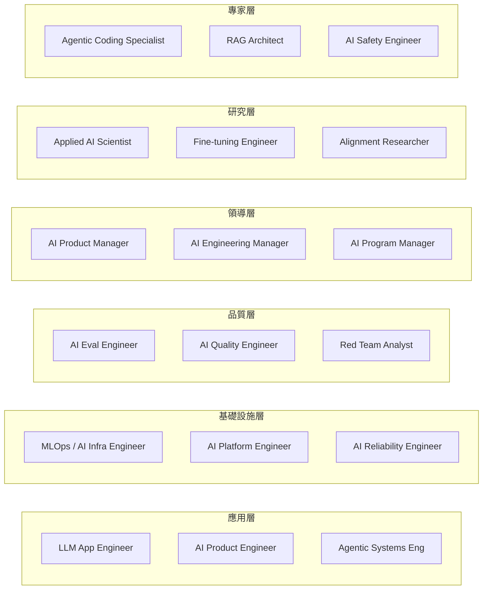
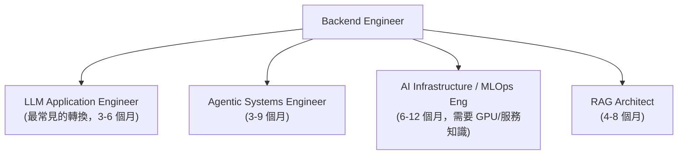
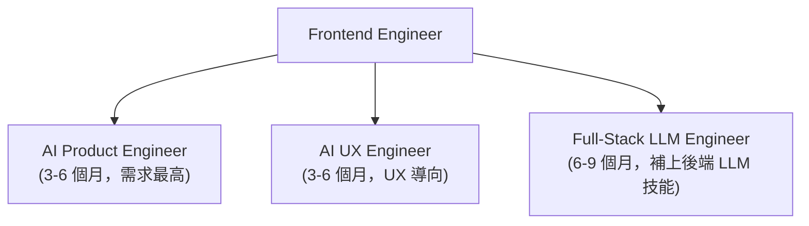
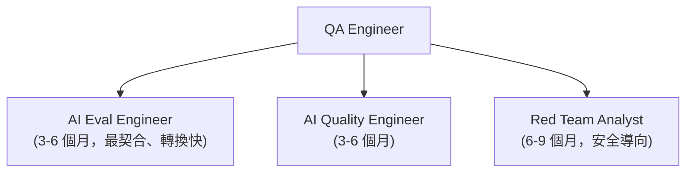
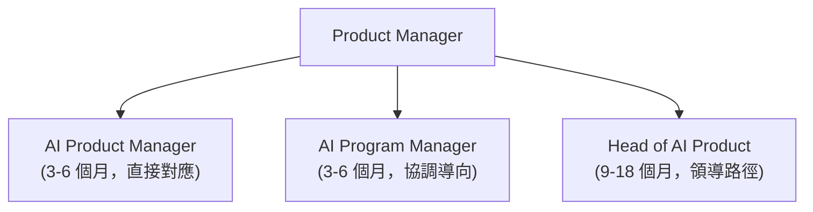
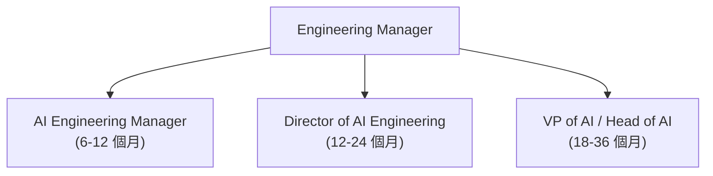
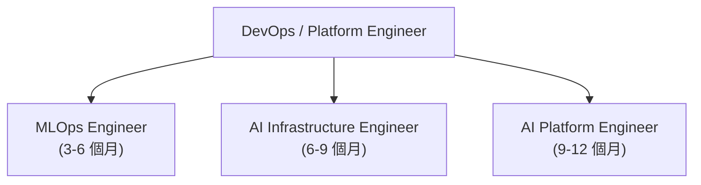
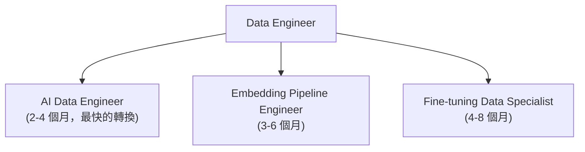

# 🔄 轉職至 AI 工程職位

> 一份具體、針對特定角色的指南，協助工程師、PM、QA 與管理者轉換到以 AI 為核心的職位。
> **沒有空泛的建議。每條路徑都對應到真實的技能、真實的儲存庫章節，以及真實的課程。**

---

## 這份指南適合誰

你目前的工作是軟體工程師、QA、PM、EM 或資料工程師，而你想轉換到以 AI 為核心的角色。這份指南把你的**既有技能**對應到特定的 AI 角色，告訴你**究竟要補齊哪些落差**，並指引你到本儲存庫與課程中正確的章節去填補它們。

---

## AI 角色全景

在挑選路徑之前，先了解目標角色實際上是什麼：

---

## 依現職角色劃分的轉職路徑

---

### 1. 🖥️ 後端工程師 → AI 工程

**為什麼後端是最好的起點：** 你已經理解 API、延遲、資料庫、分散式系統，以及生產環境的可靠性。AI 應用全都需要這些。落差主要在於領域知識，而不是工程基礎。

#### 目標角色

#### 技能落差分析

| 你已經具備 | 需要補齊的落差 | 優先級 |
|-----------------|--------------|----------|
| REST API 設計 | LLM API 整合模式 | 🔴 高 |
| 資料庫設計 | 向量資料庫（Qdrant、Pinecone、Weaviate） | 🔴 高 |
| 非同步/串流 | 串流 LLM 回應、token 串流 | 🔴 高 |
| 驗證與多租戶 | 多租戶 RAG 隔離 | 🔴 高 |
| 快取（Redis、CDN） | 提示快取、語意快取 | 🟡 中 |
| 監控（Prometheus） | LLM 可觀測性（追蹤、評估） | 🟡 中 |
| CI/CD | LLMOps 管線、模型版本管理 | 🟡 中 |
| 無 | 嵌入模型與向量數學 | 🟡 中 |
| 無 | 提示工程基礎 | 🟡 中 |
| 無 | RAG 管線架構 | 🟡 中 |
| 無 | 代理框架（LangGraph、CrewAI） | 🟢 較低 |
| 無 | 微調概念（LoRA、RLHF） | 🟢 較低 |

#### 你的 90 天計畫

**第 1 個月：LLM 整合**
- 學習 OpenAI / Anthropic API（串流、function calling、結構化輸出）
- 建立一個簡單的 RAG 系統：PDF 匯入 → Qdrant → LLM 回應
- 閱讀本儲存庫：[01-foundations](01-foundations/)、[02-model-landscape](02-model-landscape/)、[05-prompting-and-context](05-prompting-and-context/)
- 課程：*ChatGPT Prompt Engineering for Developers*（DeepLearning.AI，免費）

**第 2 個月：生產環境模式**
- 為你的 RAG 系統加入多租戶隔離
- 加入 LangSmith 或 Langfuse 追蹤
- 實作提示快取以節省成本
- 閱讀本儲存庫：[06-retrieval-systems](06-retrieval-systems/)、[12-security-and-access](12-security-and-access/)、[08-memory-and-state](08-memory-and-state/)
- 課程：*Building and Evaluating Advanced RAG*（DeepLearning.AI，免費）

**第 3 個月：代理式系統**
- 建立一個帶工具（網頁搜尋、程式碼執行）的 LangGraph 代理
- 用 RAGAS 或 Phoenix 加入評估管線
- 部署時搭配適當的成本控管與速率限制
- 閱讀本儲存庫：[07-agentic-systems](07-agentic-systems/)、[09-frameworks-and-tools](09-frameworks-and-tools/)、[14-evaluation-and-observability](14-evaluation-and-observability/)
- 課程：*AI Agents in LangGraph*（DeepLearning.AI，免費）

#### 作品集專案點子
- 帶存取控制的多租戶文件問答服務
- 會在 GitHub PR 上留言的代理式程式碼審查者
- 由 RAG 驅動、附帶評估管線的內部知識庫

---

### 2. 🎨 前端工程師 → AI 產品工程

**為什麼這個轉換行得通：** 前端工程師理解 UX、即時 UI 更新與使用者行為。AI 產品的成敗繫於 UX，串流回應、漸進式渲染、載入狀態、回饋收集。你的技能比你想的更有價值。

#### 目標角色

#### 技能落差分析

| 你已經具備 | 需要補齊的落差 | 優先級 |
|-----------------|--------------|----------|
| 串流 UI（SSE、WebSocket） | LLM token 串流整合 | 🔴 高 |
| 狀態管理 | 對話狀態、工作階段記憶 | 🔴 高 |
| 使用者回饋模式 | AI 回饋收集（讚、評分） | 🔴 高 |
| 表單驗證 | 提示輸入驗證與清理 | 🟡 中 |
| 非同步的錯誤處理 | LLM 逾時、回退、重試模式 | 🟡 中 |
| A/B 測試 | LLM A/B 測試與變體追蹤 | 🟡 中 |
| 無 | 基本提示工程 | 🟡 中 |
| 無 | LLM API 整合（至少一家供應商） | 🟡 中 |
| 無 | 理解上下文視窗 | 🟡 中 |
| 無 | 基本 RAG 概念（是什麼、為什麼需要） | 🟢 較低 |

#### 你的 90 天計畫

**第 1 個月：把 LLM 整合進 UI**
- 建立一個串流聊天介面（Next.js + Vercel AI SDK）
- 實作適當的載入狀態、逐 token 渲染、error boundary
- 加入一個回饋小工具（讚/倒讚、重新產生按鈕）
- 課程：*ChatGPT Prompt Engineering for Developers*（DeepLearning.AI，免費）

**第 2 個月：AI 的 UX 模式**
- 用工作階段狀態實作對話記憶
- 為 RAG 回應加入引用渲染
- 為你的團隊建立一個提示遊樂場 UI
- 閱讀本儲存庫：[08-memory-and-state](08-memory-and-state/)、[05-prompting-and-context](05-prompting-and-context/)

**第 3 個月：評估整合**
- 在你的 UI 中加入儀器，以收集回饋訊號
- 把回饋連接到 Langfuse 或 LangSmith 專案
- 在兩個提示變體之間執行一次基本的 A/B 測試
- 閱讀本儲存庫：[14-evaluation-and-observability](14-evaluation-and-observability/)
- 課程：*Evaluating and Debugging Generative AI*（DeepLearning.AI + W&B，免費）

#### 作品集專案點子
- 帶 AI 建議與行內引用的串流文件編輯器
- 帶持久上下文的多步驟 AI 表單精靈
- 顯示各功能品質指標的 AI 回饋儀表板

---

### 3. 🧪 QA 工程師 → AI 評估工程師

**為什麼 QA 是最被低估的路徑：** AI 評估本質上是一種新形式的 QA。手動測試案例設計、邊界情況思考、回歸預防，這些正是 AI 系統所需要的。但工具不同，而且面對非確定性輸出的心態需要轉變。

#### 目標角色

#### 技能落差分析

| 你已經具備 | 需要補齊的落差 | 優先級 |
|-----------------|--------------|----------|
| 測試案例設計 | 評估資料集建立（維度抽樣） | 🔴 高 |
| 回歸測試心態 | 把評估套件當成 CI 品質關卡 | 🔴 高 |
| 缺陷回報 | 錯誤分析方法論（開放式/主軸式編碼） | 🔴 高 |
| 測試自動化 | LLM-as-judge 評估器自動化 | 🔴 高 |
| 非功能性測試 | 幻覺、偏見、毒性偵測 | 🟡 中 |
| 使用者驗收測試 | 人工標註工作流程 | 🟡 中 |
| 無 | 追蹤與可觀測性設定 | 🟡 中 |
| 無 | RAGAS 指標（忠實度、相關性、召回率） | 🟡 中 |
| 無 | 基本提示工程 | 🟢 較低 |
| 無 | 用於評估管線的 Python 指令稿撰寫 | 🟢 較低 |

#### 你的 90 天計畫

**第 1 個月：錯誤分析基礎**
- 在任一 LLM 應用（你自己的或開源的）上設定 Langfuse 或 Phoenix 追蹤
- 做 3 輪手動錯誤分析：審查 50 條追蹤、寫筆記、分類
- 閱讀本儲存庫的評估配套指南：
  - [AI Evals: Comprehensive Study Guide](ai_evals_comprehensive_study_guide.md)
- 要閱讀的課程章節：*Error Analysis: The Secret Sauce*（評估指南內，第 3 章）

**第 2 個月：建立評估器**
- 撰寫 3 個以程式碼為基礎的評估器（JSON schema 檢查、格式驗證器、以 regex 為基礎）
- 撰寫 1 個帶 Train/Dev/Test 校準的 LLM-as-judge 評估器
- 導入 `judgy` 進行統計偏差校正
- 閱讀本儲存庫：[14-evaluation-and-observability](14-evaluation-and-observability/)
- 課程：*Quality and Safety for LLM Applications*（DeepLearning.AI + WhyLabs，免費）

**第 3 個月：CI/CD 整合**
- 把評估器接進 GitHub Actions 工作流程，每個 PR 都會執行評估
- 定義品質關卡（忠實度 > 0.85、格式通過率 > 0.99）
- 建立每週評估報告儀表板
- 課程：*Evals for AI*（Maven，Hamel + Shreya，付費，為了職涯轉換很值得）

#### 作品集專案點子
- 為某個公開 LLM 應用打造的開源評估套件
- 部落格文章：「我如何把 QA 方法論套用到捕捉 LLM 失誤上」
- 帶 LangSmith + GitHub Actions 的評估管線範本儲存庫

---

### 4. 📋 產品經理 → AI 產品經理

**為什麼 PM 處於獨特的位置：** AI 產品失敗不是因為模型差，而是因為糟糕的產品決策（錯的問題、錯的評估標準、錯的成功指標）。理解 AI 失效模式的 PM 極為稀有且非常受重視。

#### 目標角色

#### 技能落差分析

| 你已經具備 | 需要補齊的落差 | 優先級 |
|-----------------|--------------|----------|
| 使用者研究 | 把錯誤分析當成顧客之聲 | 🔴 高 |
| 成功指標定義 | AI 專屬指標（忠實度、完成率） | 🔴 高 |
| 路線圖優先排序 | 從評估資料對失效模式排序 | 🔴 高 |
| A/B 測試 | LLM A/B 測試設計（提示變體、模型） | 🔴 高 |
| 利害關係人溝通 | 向合作夥伴解釋 AI 的限制 | 🟡 中 |
| PRD 撰寫 | AI 系統能力文件與限制文件 | 🟡 中 |
| 無 | LLM 高層次運作原理（不需寫程式） | 🟡 中 |
| 無 | RAG 管線概念 | 🟡 中 |
| 無 | 追蹤/可觀測性工具（Langfuse UI） | 🟡 中 |
| 無 | 提示工程基礎 | 🟢 較低 |

#### 你的 90 天計畫

**第 1 個月：建立技術詞彙**
- 閱讀本儲存庫的基礎，不要跳過去看程式碼：
  - [01-foundations](01-foundations/)，從概念上理解 transformer
  - [02-model-landscape](02-model-landscape/)，知道有哪些模型存在以及它們的成本
  - [GLOSSARY.md](GLOSSARY.md)，學習詞彙
- 課程：*AI for Everyone*（Coursera，Andrew Ng，免費），為非技術角色而設計

**第 2 個月：負責錯誤分析**
- 請你的工程團隊設定 Langfuse 或 LangSmith
- 親自審查你產品的 100 條以上追蹤，做筆記、找出模式
- 與你的團隊執行一次錯誤分析會議；主導失效模式分類
- 閱讀本儲存庫：[14-evaluation-and-observability](14-evaluation-and-observability/)
- 閱讀：[AI Evals Comprehensive Study Guide](ai_evals_comprehensive_study_guide.md) 的第 3 章（錯誤分析）

**第 3 個月：定義你的評估策略**
- 為你的產品撰寫一份「AI 品質規格」：為每個功能定義什麼叫做好
- 與工程師合作，為那些標準加入評估儀器
- 為你下一季設定成功指標，並納入 AI 品質關卡（不只是使用者成長）
- 課程：*Evals for AI*（Maven，Hamel + Shreya，明確為 PM 設計）

#### 讓你在 AI PM 中脫穎而出的技能
- 你親自審查過追蹤（多數 PM 把這件事交辦出去）
- 你能定量地定義失效模式，而不只是定性
- 你能溝通品質改善的成本（提示更動 vs. 模型升級 vs. 微調）
- 你理解 RAG、微調與提示工程之間的差異，以及各自何時適用

---

### 5. 👨‍💼 工程經理 → AI 工程經理

**EM 的轉換關乎領導力的演進：** AI 領域的技術素養是必要的，但還不夠。關鍵的轉變在於管理非確定性系統、管理在沒有標準答案下評估品質的團隊，以及管理一個每 3 到 6 個月就改變的領域。

#### 目標角色

#### 身為 AI EM 會有什麼改變

| 傳統 EM | AI EM 新增項目 |
|----------------|-----------------|
| 衝刺規劃 | 由評估驅動的迭代週期 |
| PR 審查標準 | 把評估套件當成新的「測試通過」門檻 |
| 招募後端/前端人才 | 招募 LLM、向量搜尋、評估專長人才 |
| 針對服務中斷的事件回應 | 針對品質回歸的事件回應 |
| 帶 feature flag 的路線圖 | 帶模型升級風險的路線圖 |
| 以交付為基礎的績效考核 | 納入 AI 品質責任的績效考核 |

#### 你的 90 天計畫

**第 1 個月：技術深度**
- 閱讀整個 [09-frameworks-and-tools](09-frameworks-and-tools/)，以理解工具全景
- 閱讀 [09-claude-code.md](09-frameworks-and-tools/09-claude-code.md) 與 [10-opencoderguide.md](09-frameworks-and-tools/10-opencoderguide.md)，你將管理使用這些工具的團隊
- 理解成本：閱讀 [02-model-landscape/03-pricing-and-costs.md](02-model-landscape/03-pricing-and-costs.md)
- 課程：*Generative AI with LLMs*（Coursera，DeepLearning.AI），給你足夠的深度去領導技術討論

**第 2 個月：流程與團隊設計**
- 重新設計你團隊對「完成」的定義，納入評估關卡
- 建立評估文化：每週追蹤審查、回顧會議中的品質指標
- 定義你的 AI 事件處理手冊：當幻覺率飆升時該怎麼辦？
- 閱讀本儲存庫：[13-reliability-and-safety](13-reliability-and-safety/)、[14-evaluation-and-observability](14-evaluation-and-observability/)

**第 3 個月：策略與招募**
- 為你的團隊定義 AI 技能矩陣：誰具備什麼、缺什麼
- 為 AI 工程師建立一份面試評分標準（以 [00-interview-prep](00-interview-prep/) 作為你的來源）
- 為下一季設定團隊層級的 AI 品質 OKR
- 課程：*CS294 LLM Agents*（Berkeley，免費），給你進行策略對話的深度

---

### 6. 🛠️ DevOps / 平台工程師 → MLOps / AI 基礎設施工程師

**為什麼平台工程師在這裡如魚得水：** Kubernetes、CI/CD、可觀測性、成本管理、SLA，這些你全都做過。AI 專屬的新增項目是 GPU 排程、模型服務，以及 LLMOps 管線。

#### 目標角色

#### 技能落差分析

| 你已經具備 | 需要補齊的落差 | 優先級 |
|-----------------|--------------|----------|
| 容器編排（K8s） | GPU 節點池、NVIDIA device plugin | 🔴 高 |
| CI/CD 管線 | LLMOps 管線（模型評估、部署關卡） | 🔴 高 |
| 可觀測性技術棧 | LLM 專屬指標（token 吞吐量、TTFT） | 🔴 高 |
| 成本管理 | GPU 成本最佳化、用於訓練的 spot instance | 🔴 高 |
| 機密管理 | 為多家 LLM 供應商輪換 API key | 🟡 中 |
| 無 | 用於自架模型服務的 vLLM / TGI | 🟡 中 |
| 無 | 模型版本管理與註冊表 | 🟡 中 |
| 無 | 量化基礎（GPTQ、AWQ、GGUF） | 🟡 中 |
| 無 | 基本提示工程，以理解你正在服務什麼 | 🟢 較低 |

#### 你的 90 天計畫

**第 1 個月：LLM 服務**
- 在本機部署 vLLM，服務 Llama 3.3 7B 或 Qwen2.5-Coder
- 加入 Prometheus 指標：tokens/秒、延遲 P50/P95/P99、佇列深度
- 依請求佇列設定自動擴展
- 閱讀本儲存庫：[04-inference-optimization](04-inference-optimization/)、[11-infrastructure-and-mlops](11-infrastructure-and-mlops/)
- 課程：*Efficiently Serving LLMs*（DeepLearning.AI + Predibase，免費）

**第 2 個月：LLMOps 管線**
- 設定 LangSmith 或 Langfuse 以收集追蹤
- 建立一個 CI/CD 品質關卡：評估套件在模型部署前執行
- 實作提示版本控制（Langfuse 提示註冊表或 DSPy）
- 閱讀本儲存庫：[14-evaluation-and-observability](14-evaluation-and-observability/)

**第 3 個月：擴展與成本**
- 在目標流量下比較自架 vs. API 的成本（使用儲存庫中的定價指南）
- 設定依模型、依團隊、依功能的成本儀表板
- 實作優雅的多供應商容錯移轉
- 課程：*ML Engineering for Production (MLOps)*（Coursera，DeepLearning.AI）

---

### 7. 📊 資料工程師 → AI 資料 / 特徵工程師

**為什麼資料工程師不可或缺：** 訓練資料是 AI 系統的競爭護城河。資料管線、品質與新鮮度對模型表現的決定性，更甚於架構。你的技能可以立即派上用場。

#### 目標角色

#### 技能落差分析

| 你已經具備 | 需要補齊的落差 | 優先級 |
|-----------------|--------------|----------|
| ETL 管線 | 用於 RAG 的文件匯入管線 | 🔴 高 |
| 資料品質檢查 | 評估資料集品質驗證 | 🔴 高 |
| schema 設計 | 向量資料庫的中繼資料 schema | 🔴 高 |
| 串流管線 | 即時嵌入與索引更新 | 🟡 中 |
| 無 | 嵌入模型選擇與批次處理 | 🟡 中 |
| 無 | 向量資料庫操作（upsert、過濾、ANN 搜尋） | 🟡 中 |
| 無 | 各文件類型的分塊策略 | 🟡 中 |
| 無 | 用於微調的標註管線設計 | 🟢 較低 |
| 無 | RLHF 偏好資料格式 | 🟢 較低 |

#### 你的 90 天計畫

**第 1 個月：RAG 資料管線**
- 建立一條匯入管線：PDF/HTML/DOCX → 分塊 → 嵌入 → Qdrant
- 加入資料品質關卡：最小區塊大小、去重、語言偵測
- 實作增量同步：只重新嵌入有變動的文件
- 閱讀本儲存庫：[06-retrieval-systems/02-chunking-strategies.md](06-retrieval-systems/02-chunking-strategies.md)、[10-document-processing](10-document-processing/)

**第 2 個月：評估資料集工程**
- 使用維度抽樣建立一個測試資料集（見評估指南）
- 使用 Label Studio 或 Argilla 設定人工標註管線
- 追蹤標註者間一致性；拒絕低品質標籤
- 閱讀：[AI Evals Comprehensive Study Guide](ai_evals_comprehensive_study_guide.md)，第 12 章（人工標註）
- 課程：*Finetuning Large Language Models*（DeepLearning.AI，免費）

**第 3 個月：進階資料工程**
- 建立一條把生產環境追蹤轉成微調範例的管線
- 實作嵌入漂移偵測：當文件分布偏移時發出警報
- 在你的領域資料上對 3 個嵌入模型做基準測試
- 閱讀本儲存庫：[03-training-and-adaptation](03-training-and-adaptation/)

---

## 📊 角色比較總覽

| 角色 | 至首份職位的月數 | 平均薪資（US, 2026） | 最適合的方向 |
|------|------------------|----------------------|--------------|
| 後端 | 3-6 個月 | $170-220K | LLM App / Agentic Engineering |
| 前端 | 3-6 個月 | $150-190K | AI Product / UX Engineering |
| QA | 3-6 個月 | $140-180K | AI Eval / Quality Engineering |
| PM | 3-6 個月 | $160-200K | AI Product Management |
| DevOps | 3-6 個月 | $170-220K | MLOps / AI Platform |
| 資料工程 | 2-4 個月 | $165-210K | RAG Data, Fine-tuning Data |
| EM | 6-12 個月 | $200-280K | AI Engineering Manager |

*薪資為美國市場估計值，依據 Levels.fyi 與 LinkedIn 資料，2026 年 5 月。範圍會因公司、地點與經驗水準而有顯著差異。*

---

## 🗺️ 哪些儲存庫章節對應到什麼

當你準備好深入時，使用這份表：

| 主題 | 儲存庫章節 | 為什麼 |
|-------|-------------|-----|
| LLM 如何運作 | [01-foundations](01-foundations/) | 一切其他事物的基礎 |
| 該用哪個模型 | [02-model-landscape](02-model-landscape/) | 模型選擇是每天的決策 |
| 微調 | [03-training-and-adaptation](03-training-and-adaptation/) | 適用於微調資料專家路徑 |
| GPU 服務 / vLLM | [04-inference-optimization](04-inference-optimization/) | MLOps / 平台路徑 |
| 提示工程 | [05-prompting-and-context](05-prompting-and-context/) | 每個人都需要這個 |
| RAG 管線 | [06-retrieval-systems](06-retrieval-systems/) | 後端 / 資料工程路徑 |
| 代理式系統 | [07-agentic-systems](07-agentic-systems/) | 後端 / 資深 AI 工程路徑 |
| 記憶與狀態 | [08-memory-and-state](08-memory-and-state/) | 所有建立代理的工程師 |
| LangGraph、CrewAI、Claude Code | [09-frameworks-and-tools](09-frameworks-and-tools/) | 實務上的工具選擇 |
| 文件解析 | [10-document-processing](10-document-processing/) | 資料工程 / RAG 路徑 |
| GPU 基礎設施、LLMOps | [11-infrastructure-and-mlops](11-infrastructure-and-mlops/) | DevOps / 平台路徑 |
| 多租戶安全 | [12-security-and-access](12-security-and-access/) | 後端 / PM 路徑 |
| 防護機制、紅隊演練 | [13-reliability-and-safety](13-reliability-and-safety/) | QA / 紅隊路徑 |
| RAGAS、LangSmith、評估 | [14-evaluation-and-observability](14-evaluation-and-observability/) | QA / PM / 所有角色 |
| 設計模式 | [15-ai-design-patterns](15-ai-design-patterns/) | 資深層級的準備 |
| 案例研究 | [16-case-studies](16-case-studies/) | 面試準備、參考設計 |
| 評估深入探討 | [AI Evals Comprehensive Guide](ai_evals_comprehensive_study_guide.md) | QA / PM 路徑 |
| 面試準備 | [00-interview-prep](00-interview-prep/) | 所有角色 |
| 課程 | [COURSES.md](COURSES.md) | 所有角色 |

---

## 📚 依角色推薦的入門課程

> 完整細節在 [COURSES.md](COURSES.md)

| 你的角色 | 第一門課程 | 第二門課程 | 第三門課程 |
|-----------|-------------|---------------|--------------|
| **後端** | ChatGPT Prompt Engineering for Devs (DL.AI, free) | Building & Evaluating RAG (DL.AI, free) | AI Agents in LangGraph (DL.AI, free) |
| **前端** | ChatGPT Prompt Engineering for Devs (DL.AI, free) | Building Systems with ChatGPT API (DL.AI, free) | Evaluating & Debugging GenAI (DL.AI + W&B, free) |
| **QA** | AI Evals Guide in this repo (free) | Quality & Safety for LLM Apps (DL.AI, free) | Evals for AI – Maven (Hamel + Shreya, paid) |
| **PM** | AI for Everyone (Coursera, free) | AI Evals Guide Chapter 3 (free) | Evals for AI – Maven (Hamel + Shreya, paid) |
| **DevOps** | Efficiently Serving LLMs (DL.AI, free) | Evaluating & Debugging GenAI (DL.AI + W&B, free) | ML Engineering for Production (Coursera) |
| **資料工程** | Building & Evaluating RAG (DL.AI, free) | Finetuning LLMs (DL.AI, free) | AI Evals Guide in this repo (free) |
| **EM** | Generative AI with LLMs (Coursera) | AI Agents in LangGraph (DL.AI, free) | CS294 LLM Agents (Berkeley, free) |

*DL.AI = DeepLearning.AI*

---

## 應避免的常見錯誤

1. **跳過基礎** — 在理解嵌入是什麼之前就跳到 LangChain，會導致你無法除錯的盲目模仿程式碼。

2. **先建立才評估** — 沒有衡量品質的方法就什麼都別出貨。在寫下第一個提示之前，先定義你的評估標準。

3. **不理解就照抄提示** — 提示是工程決策。要理解每個元素為什麼在那裡。

4. **拖到太遲才在意成本** — 每次 API 呼叫都有價格。從第一天就建立成本追蹤。見 [02-model-landscape/03-pricing-and-costs.md](02-model-landscape/03-pricing-and-costs.md)。

5. **假設模型是瓶頸** — 在多數生產環境 AI 系統中，瓶頸是檢索品質、提示設計或資料品質。模型很少是問題所在。

6. **在生產環境的模型版本字串中使用「latest」** — 釘住確切版本。靜默的模型更新會弄壞你的產品。

7. **過度代理化** — 在一次精心設計提示的呼叫就能搞定時，卻一開始就用 5 個代理的系統。從簡單開始，只在需要時才增加複雜度。

---

## 如何被錄取

**公開地建立作品。** AI 工程的就業市場獎勵實際展現出來的成果：

1. **GitHub 作品集** — 一個打磨過的端到端專案，勝過 10 個玩具專案
2. **寫一篇部落格文章** — 描述你解決的一個真實問題以及解法（錯誤分析、評估管線、RAG 延遲修正）
3. **貢獻開源** — OpenHands、LlamaIndex、DSPy、RAGAS。即使是文件 PR 也能讓你被注意到。
4. **使用本儲存庫的面試準備** — [00-interview-prep/01-question-bank.md](00-interview-prep/01-question-bank.md) 有 80 道題目並附上扎實的解答

**在面試中該說什麼：**
- 點名具體決策：「我選 Qdrant 而非 Pinecone，因為 X」（而不是「我建了一個 RAG 系統」）
- 引用你遇過的失效模式以及你如何修正它們
- 把至少一項基準測試記得滾瓜爛熟（SWE-bench、RAGAS 分數、你服務設定的 TTFT）
- 展現你會思考評估與成本，而不只是功能

---

*隸屬於 [AI System Design Guide](README.md)，由 [ombharatiya](https://github.com/ombharatiya) 維護*
